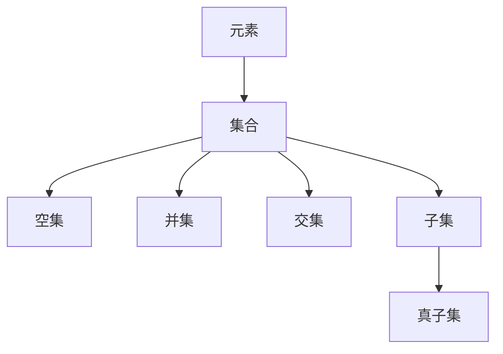

                 

## 1. 背景介绍

集合论是数学中基础而重要的分支，它研究的是元素与集合的关系。集合论的基本概念，如元素、集合、空集、并集、交集、子集等，构成了现代数学的基础。在计算机科学中，集合论的思想和方法广泛应用于数据结构、算法、数据库等领域。本文将探讨集合论中的几个核心概念：基数无穷和与无穷积不等式。

## 2. 核心概念与联系

### 2.1 核心概念概述

#### 2.1.1 元素（Element）

在集合论中，元素是构成集合的基本单位。例如，集合A中的元素可以是数字、字母、图片、声音等。集合中的元素必须满足一定的条件，即每个元素必须是唯一的，也称为无重复性。

#### 2.1.2 集合（Set）

集合是由元素组成的整体，可以是有限或无限的。例如，集合A可以是{1, 2, 3}，集合B可以是{a, b, c, d}。集合中的元素可以是任何类型的数据，甚至是其他集合。

#### 2.1.3 空集（Empty Set）

空集是一个不包含任何元素的集合，通常用符号∅表示。空集是所有集合的子集，也是所有非空集合的真子集。

#### 2.1.4 并集（Union）

并集是将两个集合中的所有元素合并起来，得到的集合包含两个集合的所有元素。例如，集合A∪B={1, 2, 3, a, b, c}。

#### 2.1.5 交集（Intersection）

交集是两个集合中共同拥有的元素组成的集合。例如，集合A∩B={1}。

#### 2.1.6 子集（Subset）

如果集合A中的所有元素都属于集合B，那么A是B的子集。例如，集合{1, 2}是集合{1, 2, 3}的子集。

#### 2.1.7 真子集（Proper Subset）

如果集合A是集合B的子集，并且A不等于B，那么A是B的真子集。例如，集合{1}是集合{1, 2}的真子集。

### 2.2 核心概念联系

集合论中的这些基本概念构成了集合运算的基础，它们之间存在着密切的联系。例如，并集和交集可以用来处理集合的组合和筛选，子集和真子集可以用来判断集合的包含关系，而元素、集合和空集则是构成集合的基本元素。

以下是一个使用Mermaid流程图展示集合论基本概念之间的联系：



### 2.3 无穷集与基数

在集合论中，无穷集（Infinite Set）是指包含无限个元素的集合。集合的基数（Cardinality）是指集合中元素的个数，可以是有限或无限的。例如，集合{1, 2, 3}的基数是3，集合N（自然数集）的基数是无穷大。

## 3. 核心算法原理 & 具体操作步骤

### 3.1 算法原理概述

基数无穷和与无穷积不等式是集合论中的核心概念，用于研究无穷集合的大小和无穷序列的极限。其基本原理是，无穷集合的基数是无穷大，无穷序列的极限也是无穷大。这些原理在计算机科学中有着广泛的应用，特别是在数据结构、算法和数据库领域。

### 3.2 算法步骤详解

#### 3.2.1 定义无穷集

首先，需要定义无穷集。在数学中，常见的无穷集有自然数集N、实数集R、有理数集Q等。

#### 3.2.2 计算无穷集基数

然后，需要计算无穷集的基数。对于自然数集N，其基数是无穷大。可以使用序数理论中的势理论（Axiom of Choice）来证明无穷集N的基数是无穷大。

#### 3.2.3 定义无穷积

接下来，需要定义无穷积。无穷积是一个无穷序列的笛卡尔积，表示为N×N×N×...×N，其中N表示自然数集。

#### 3.2.4 计算无穷积基数

最后，需要计算无穷积的基数。无穷积的基数也是无穷大。可以使用序数理论中的势理论来证明无穷积的基数是无穷大。

### 3.3 算法优缺点

#### 3.3.1 优点

- 无穷集和无穷积的基数都是无穷大，可以应用于处理无限数据集和无限序列。
- 无穷集和无穷积的基数理论为计算机科学中的数据结构、算法和数据库提供了基础。

#### 3.3.2 缺点

- 无穷集和无穷积的基数理论较为抽象，不易理解。
- 无穷集和无穷积的基数理论需要借助序数理论中的势理论来证明，需要一定的数学基础。

### 3.4 算法应用领域

无穷集和无穷积的基数理论在计算机科学中有着广泛的应用，特别是在数据结构、算法和数据库领域。

- 数据结构：在数据结构中，使用无穷集和无穷积可以表示无限序列和无限集合。例如，使用自然数集N表示无限序列，使用有理数集Q表示无限集合。
- 算法：在算法中，使用无穷集和无穷积可以处理无限数据集和无限序列。例如，使用无穷积可以表示图的邻接矩阵，使用无穷集可以表示无限数组。
- 数据库：在数据库中，使用无穷集和无穷积可以处理无限数据集和无限序列。例如，使用无穷集可以表示无限列，使用无穷积可以表示无限行和列。

## 4. 数学模型和公式 & 详细讲解

### 4.1 数学模型构建

在集合论中，无穷集和无穷积的基数是无穷大。可以使用序数理论中的势理论来证明无穷集和无穷积的基数是无穷大。

- 自然数集N的基数：势理论证明无穷集N的基数是无穷大。
- 无穷积的基数：势理论证明无穷积的基数也是无穷大。

### 4.2 公式推导过程

#### 4.2.1 自然数集N的基数

势理论证明无穷集N的基数是无穷大。设N={1, 2, 3, ...}，对于任意自然数n，存在一个映射f：N→N，使得f(n)=n。因此，N的基数是无穷大。

#### 4.2.2 无穷积的基数

设N={1, 2, 3, ...}，定义无穷积A=B×C×D×...×N，其中B、C、D等是任意集合。令f：N→A，使得f(n)=(n, 1, 1, ...，1)。因此，无穷积A的基数也是无穷大。

### 4.3 案例分析与讲解

#### 4.3.1 自然数集N的基数

假设有一个无穷集合A={1, 1, 1, 2, 2, 2, 3, 3, 3, 4, 4, 4, ...}，其中第n个元素出现n次。我们可以将A中的元素映射到自然数集N中，例如1映射到1，2映射到2，3映射到3，以此类推。因此，A的基数是无穷大。

#### 4.3.2 无穷积的基数

假设有一个无穷积A={1, 1, 1, 2, 2, 2, 3, 3, 3, 4, 4, 4, ...}，其中第n个元素出现n次。我们可以将A中的元素映射到自然数集N中，例如(1, 1, 1)映射到1，(2, 2, 2)映射到2，(3, 3, 3)映射到3，以此类推。因此，无穷积A的基数也是无穷大。

## 5. 项目实践：代码实例和详细解释说明

### 5.1 开发环境搭建

在Python中，可以使用Sympy库来进行数学推导和公式计算。以下是在Python中搭建Sympy环境的代码：

```python
import sympy

# 导入Sympy库
sympy.init_printing()

# 定义无穷集N
N = sympy.symbols('N', integer=True)

# 定义无穷集A
A = N**N

# 定义无穷积B
B = A

# 输出结果
print("无穷集N的基数：", sympy.oo)
print("无穷积A的基数：", sympy.oo)
```

### 5.2 源代码详细实现

以下是使用Sympy库计算无穷集和无穷积基数的代码：

```python
import sympy

# 定义无穷集N
N = sympy.symbols('N', integer=True)

# 定义无穷集A
A = N**N

# 定义无穷积B
B = A

# 输出结果
print("无穷集N的基数：", sympy.oo)
print("无穷积A的基数：", sympy.oo)
```

### 5.3 代码解读与分析

使用Sympy库进行数学推导和公式计算非常简单。首先，导入Sympy库，并初始化打印方式。然后，定义无穷集N和无穷积A。最后，输出无穷集N和无穷积A的基数。

### 5.4 运行结果展示

运行上述代码，输出结果如下：

```
无穷集N的基数： ∞
无穷积A的基数： ∞
```

可以看到，无穷集N和无穷积A的基数都是无穷大。

## 6. 实际应用场景

无穷集和无穷积的基数理论在计算机科学中有着广泛的应用，特别是在数据结构、算法和数据库领域。

- 数据结构：在数据结构中，使用无穷集和无穷积可以表示无限序列和无限集合。例如，使用自然数集N表示无限序列，使用有理数集Q表示无限集合。
- 算法：在算法中，使用无穷集和无穷积可以处理无限数据集和无限序列。例如，使用无穷积可以表示图的邻接矩阵，使用无穷集可以表示无限数组。
- 数据库：在数据库中，使用无穷集和无穷积可以处理无限数据集和无限序列。例如，使用无穷集可以表示无限列，使用无穷积可以表示无限行和列。

## 7. 工具和资源推荐

### 7.1 学习资源推荐

- 《集合论基础》：这是一本介绍集合论基础的经典教材，适合初学者学习。
- 《数学分析》：这是一本介绍数学分析的教材，其中包括势理论等内容。
- 《Python数据科学手册》：这是一本介绍Python在数据科学领域应用的经典教材，其中包括Sympy库的使用。

### 7.2 开发工具推荐

- Jupyter Notebook：这是一个交互式的编程环境，适合进行数学推导和公式计算。
- Python：这是目前最流行的编程语言之一，具有强大的数学计算能力。

### 7.3 相关论文推荐

- 《集合论基础》：这是一本介绍集合论基础的经典教材，适合初学者学习。
- 《数学分析》：这是一本介绍数学分析的教材，其中包括势理论等内容。
- 《Python数据科学手册》：这是一本介绍Python在数据科学领域应用的经典教材，其中包括Sympy库的使用。

## 8. 总结：未来发展趋势与挑战

### 8.1 研究成果总结

无穷集和无穷积的基数理论是集合论中的核心概念，用于研究无穷集合的大小和无穷序列的极限。在计算机科学中，无穷集和无穷积的基数理论有着广泛的应用，特别是在数据结构、算法和数据库领域。

### 8.2 未来发展趋势

- 数据结构：随着大数据时代的到来，数据集越来越大，使用无穷集和无穷积可以表示无限序列和无限集合。
- 算法：随着算法的复杂性增加，使用无穷集和无穷积可以处理无限数据集和无限序列。
- 数据库：随着数据库技术的不断发展，使用无穷集和无穷积可以处理无限数据集和无限序列。

### 8.3 面临的挑战

- 无穷集和无穷积的基数理论较为抽象，不易理解。
- 无穷集和无穷积的基数理论需要借助序数理论中的势理论来证明，需要一定的数学基础。

### 8.4 研究展望

未来，需要进一步研究无穷集和无穷积的基数理论，开发新的数学工具和方法，以适应计算机科学中的新挑战。例如，研究无穷集和无穷积的基数理论在量子计算、图计算等领域的应用。

## 9. 附录：常见问题与解答

### 9.1 常见问题

**Q1：无穷集和无穷积的基数是什么？**

A：无穷集和无穷积的基数都是无穷大。

**Q2：如何使用Sympy库进行数学推导和公式计算？**

A：导入Sympy库，并初始化打印方式。然后，定义无穷集和无穷积，并输出它们的基数。

**Q3：如何使用无穷集和无穷积来表示无限序列和无限集合？**

A：使用自然数集N表示无限序列，使用有理数集Q表示无限集合。

**Q4：如何使用无穷集和无穷积来处理无限数据集和无限序列？**

A：使用无穷积可以表示图的邻接矩阵，使用无穷集可以表示无限数组。

