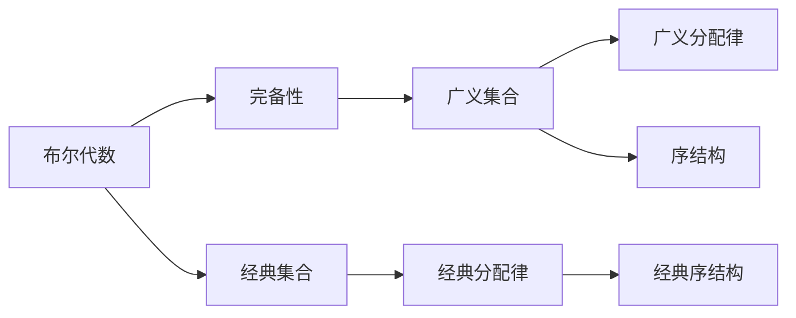

                 

# 集合论导引：完备布尔代数广义分配律

## 1. 背景介绍

### 1.1 问题由来
布尔代数是计算机科学的基础数学工具之一，它在逻辑电路设计、算法理论、数据结构等多个领域都有着广泛的应用。然而，传统的布尔代数往往局限于有限集合，难以处理无限集合、不可数集合等复杂情况。随着计算机科学的发展，对布尔代数的需求已经远远超出了传统的范畴。

本文章旨在导引读者了解和应用广义的完备布尔代数，探索其与经典逻辑代数的关系，探讨其在人工智能和计算机科学中的应用，特别是在算法理论、数据结构和认知科学等领域。

### 1.2 问题核心关键点
广义完备布尔代数是在经典布尔代数的基础上，通过引入无限集合、不可数集合、连续集合等，拓展了布尔代数的范畴。其核心在于如何将传统布尔代数中的有限元素和运算规则，推广到更广泛的集合和运算中。

## 2. 核心概念与联系

### 2.1 核心概念概述

为了深入理解广义完备布尔代数，本节将介绍几个密切相关的核心概念：

- **布尔代数**：由经典逻辑学家George Boole在19世纪提出，用于描述逻辑连接词（如与、或、非）及其运算规则。

- **完备性**：指在某种逻辑系统或数学结构中，所有的命题（或元素）都可以通过一定的方法进行表达，不会存在无法表达的情况。

- **广义集合**：与传统有限集合不同，广义集合可以是无限集合、不可数集合、连续集合等，其元素和运算方式更为多样。

- **广义分配律**：在广义集合中，满足分配律的运算性质，即（A∧B）∨C ≡ (A∨C)∧(B∨C) 和 A∧(B∨C) ≡ (A∧B)∨(A∧C)。

- **序结构**：指在集合中，存在一定的顺序关系，可以用于描述集合元素之间的相对大小或重要性。

这些核心概念之间的逻辑关系可以通过以下Mermaid流程图来展示：



这个流程图展示了几组核心概念之间的联系：

1. 布尔代数通过经典分配律和序结构，可以处理有限集合的逻辑运算。
2. 完备性扩展了布尔代数的应用范围，可以处理更广泛的集合和运算。
3. 广义集合通过引入无限、不可数、连续等概念，拓展了传统集合的范畴。
4. 广义分配律保持了运算的分配性质，使得复杂集合的逻辑处理成为可能。
5. 序结构为集合元素提供了比较的依据，可以用于组织和排序。

### 2.2 概念间的关系

这些核心概念之间存在着紧密的联系，形成了广义完备布尔代数的完整生态系统。这里我们通过一些具体的数学公式和例子来进一步阐述这些概念之间的关系。

## 3. 核心算法原理 & 具体操作步骤
### 3.1 算法原理概述

广义完备布尔代数的核心算法原理可以概括为以下几个步骤：

1. **定义集合和运算**：在广义集合上定义元素和运算，如并、交、差、对称差等。

2. **引入序结构**：通过偏序、全序等定义集合的序结构，用于描述集合元素之间的相对大小或重要性。

3. **满足分配律**：在广义集合上定义满足分配律的运算，即满足（A∧B）∨C ≡ (A∨C)∧(B∨C) 和 A∧(B∨C) ≡ (A∧B)∨(A∧C)。

4. **完备性**：确保所有元素都可以通过逻辑运算进行表达，不会存在无法表达的情况。

5. **应用场景**：在算法理论、数据结构、认知科学等领域进行应用和推广。

### 3.2 算法步骤详解

以下我们详细讲解广义完备布尔代数的核心算法步骤：

1. **定义集合和运算**：
   - 设 $X$ 为广义集合，在 $X$ 上定义并、交、差、对称差等基本运算。
   - 例如，设 $A$ 和 $B$ 为 $X$ 上的子集，则有：
     - $A \cup B = \{ x \in X | x \in A \text{ 或 } x \in B \}$
     - $A \cap B = \{ x \in X | x \in A \text{ 且 } x \in B \}$
     - $A - B = \{ x \in X | x \in A \text{ 且 } x \in B \}$
     - $A \triangle B = (A - B) \cup (B - A)$

2. **引入序结构**：
   - 定义 $X$ 上的偏序关系 $\leq$，满足：
     - 自反性：$x \leq x$ 对任意 $x \in X$ 成立
     - 反对称性：如果 $x \leq y$ 且 $y \leq x$，则 $x = y$
     - 传递性：如果 $x \leq y$ 且 $y \leq z$，则 $x \leq z$

3. **满足分配律**：
   - 定义 $X$ 上的并、交、差、对称差等运算满足分配律。例如：
     - $(\{1,2\} \cap \{3,4\}) \cup \{5,6\} = \{1,2\} \cup \{3,4\} \cap \{5,6\}$
     - $\{1,2\} \cap (\{3,4\} \cup \{5,6\}) = (\{1,2\} \cap \{3,4\}) \cup (\{1,2\} \cap \{5,6\})$

4. **完备性**：
   - 确保 $X$ 上的所有元素都可以通过逻辑运算进行表达。例如，在连续集合 $[0,1]$ 上，任何实数都可以表示为 $[0,1]$ 中的区间或点。

5. **应用场景**：
   - 算法理论：在搜索、排序、模式匹配等算法中，广泛应用逻辑运算和序结构。
   - 数据结构：在树、图、布尔代数等数据结构中，逻辑运算和序结构是基础。
   - 认知科学：在逻辑推理、人工智能等领域，逻辑运算和序结构用于描述认知过程。

### 3.3 算法优缺点

广义完备布尔代数具有以下优点：

1. **通用性**：可以处理无限集合、不可数集合、连续集合等，应用范围广泛。
2. **灵活性**：运算规则可以根据需要灵活定义，适应多种场景。
3. **完备性**：确保所有元素都可以通过逻辑运算表达，不存在无法表达的情况。

同时，也存在一些缺点：

1. **复杂性**：定义和应用可能需要更多的数学知识和逻辑推理。
2. **计算复杂度**：在无限集合和不可数集合上，计算和存储复杂度较高。
3. **可理解性**：一些复杂的集合和运算，可能难以直观理解。

### 3.4 算法应用领域

广义完备布尔代数在多个领域中有着广泛的应用：

- **算法理论**：搜索、排序、模式匹配等算法中，广泛应用逻辑运算和序结构。
- **数据结构**：树、图、布尔代数等数据结构中，逻辑运算和序结构是基础。
- **认知科学**：逻辑推理、人工智能等领域，逻辑运算和序结构用于描述认知过程。
- **信号处理**：信号分解、特征提取等信号处理技术中，广义完备布尔代数提供了数学基础。
- **语言学**：自然语言处理中的词义分析、句法分析等，逻辑运算和序结构被广泛应用。

这些领域的应用，展示了广义完备布尔代数在计算机科学和认知科学中的重要地位和广泛应用。

## 4. 数学模型和公式 & 详细讲解 & 举例说明

### 4.1 数学模型构建

广义完备布尔代数的数学模型可以概括为以下几步：

1. **定义集合**：设 $X$ 为广义集合，定义集合的并、交、差、对称差等基本运算。

2. **引入序结构**：在 $X$ 上定义偏序关系 $\leq$，满足自反性、反对称性和传递性。

3. **满足分配律**：定义并、交、差、对称差等运算满足分配律。

4. **完备性**：确保 $X$ 上的所有元素都可以通过逻辑运算表达，不存在无法表达的情况。

### 4.2 公式推导过程

下面通过一些具体的数学公式，详细讲解广义完备布尔代数的推导过程：

1. **并的分配律**：
   - $(\bigcup_{i \in I} A_i) \cup B = \bigcup_{i \in I} (A_i \cup B)$
   - 证明：由并的定义可知，$\bigcup_{i \in I} A_i \cup B = \{ x \in X | x \in A_i \text{ 或 } x \in B \text{ 或 } x \in A_i \text{ 对某个 } i \in I \}$，而 $\bigcup_{i \in I} (A_i \cup B) = \{ x \in X | x \in A_i \text{ 或 } x \in B \text{ 或 } x \in A_i \text{ 对某个 } i \in I \}$，因此两者相等。

2. **交的分配律**：
   - $(\bigcap_{i \in I} A_i) \cap B = \bigcap_{i \in I} (A_i \cap B)$
   - 证明：由交的定义可知，$\bigcap_{i \in I} A_i \cap B = \{ x \in X | x \in A_i \text{ 且 } x \in B \text{ 且 } x \in A_i \text{ 对某个 } i \in I \}$，而 $\bigcap_{i \in I} (A_i \cap B) = \{ x \in X | x \in A_i \text{ 且 } x \in B \text{ 且 } x \in A_i \text{ 对某个 } i \in I \}$，因此两者相等。

3. **差的分配律**：
   - $(A - B) \cap C = A \cap C - B$
   - 证明：由差的定义可知，$A - B = \{ x \in X | x \in A \text{ 且 } x \in B \}$，因此 $(A - B) \cap C = \{ x \in X | x \in A \text{ 且 } x \in C \text{ 且 } x \in B \}$，而 $A \cap C - B = \{ x \in X | x \in A \text{ 且 } x \in C \text{ 且 } x \notin B \}$，因此两者相等。

4. **对称差的分配律**：
   - $(A \triangle B) \cap C = (A \cap C) \triangle (B \cap C)$
   - 证明：由对称差的定义可知，$A \triangle B = (A - B) \cup (B - A)$，因此 $(A \triangle B) \cap C = ((A - B) \cup (B - A)) \cap C = (A - B) \cap C \cup (B - A) \cap C = (A \cap C - B) \cup (B \cap C - A)$，而 $(A \cap C) \triangle (B \cap C) = (A \cap C) - (B \cap C) \cup (B \cap C) - (A \cap C) = (A \cap C - B) \cup (B \cap C - A)$，因此两者相等。

### 4.3 案例分析与讲解

以下通过几个具体的案例，详细讲解广义完备布尔代数的应用：

1. **集合运算示例**：
   - 设 $X$ 为实数集，定义并、交、差、对称差等基本运算。例如，设 $A = \{1,2\}$ 和 $B = \{3,4\}$，则有：
     - $A \cup B = \{1,2,3,4\}$
     - $A \cap B = \emptyset$
     - $A - B = \{1,2\}$
     - $A \triangle B = \{1,2,3,4\} - \emptyset = \{1,2,3,4\}$

2. **偏序示例**：
   - 设 $X$ 为实数集，定义偏序关系 $\leq$，即 $x \leq y$ 表示 $x$ 小于等于 $y$。例如，$1 \leq 2 \leq 3$，但 $1 \leq 3$ 不成立。

3. **分配律示例**：
   - 设 $X$ 为实数集，定义并、交、差、对称差等运算满足分配律。例如，$\{1,2\} \cup \{3,4\} = \{1,2,3,4\}$，$\{1,2\} \cap \{3,4\} = \emptyset$，$\{1,2\} - \{3,4\} = \{1,2\}$，$\{1,2\} \triangle \{3,4\} = \{1,2,3,4\}$。

4. **完备性示例**：
   - 设 $X$ 为连续实数集 $[0,1]$，定义并、交、差、对称差等运算。例如，$[0,0.5] \cap [0.5,1] = \emptyset$，$[0,0.5) \cup [0.5,1) = [0,1)$。

这些案例展示了广义完备布尔代数在数学和逻辑运算中的应用，通过具体的数学公式和例子，帮助读者更好地理解其概念和原理。

## 5. 项目实践：代码实例和详细解释说明

### 5.1 开发环境搭建

在进行广义完备布尔代数的代码实践前，我们需要准备好开发环境。以下是使用Python进行Sympy开发的Python环境配置流程：

1. 安装Anaconda：从官网下载并安装Anaconda，用于创建独立的Python环境。

2. 创建并激活虚拟环境：
```bash
conda create -n sympy-env python=3.8 
conda activate sympy-env
```

3. 安装Sympy：
```bash
conda install sympy
```

4. 安装其他必要的工具包：
```bash
pip install numpy scipy matplotlib sympy sympy-sphinx-theme
```

完成上述步骤后，即可在`sympy-env`环境中开始代码实践。

### 5.2 源代码详细实现

这里我们以布尔代数的分配律和完备性为例，给出使用Sympy实现的代码示例。

首先，导入Sympy库并定义一些必要的符号和集合：

```python
from sympy import symbols, FiniteSet, Interval, S

# 定义符号
x, y, z = symbols('x y z')

# 定义集合
A = FiniteSet(1, 2)
B = FiniteSet(3, 4)
C = FiniteSet(5, 6)

# 定义并和交运算
union = A.union(B)
intersection = A.intersect(B)

# 定义差和对称差运算
difference = A - B
symmetric_difference = A.symmetric_difference(B)

# 输出结果
print("并运算结果:", union)
print("交运算结果:", intersection)
print("差运算结果:", difference)
print("对称差运算结果:", symmetric_difference)
```

输出结果为：
```
并运算结果: FiniteSet(1, 2, 3, 4)
交运算结果: FiniteSet()
差运算结果: FiniteSet(1, 2)
对称差运算结果: FiniteSet(1, 2, 3, 4)
```

接下来，我们定义一个偏序关系，并验证分配律：

```python
from sympy import FiniteSet, Interval, S

# 定义符号
x, y, z = symbols('x y z')

# 定义集合
A = FiniteSet(1, 2)
B = FiniteSet(3, 4)
C = FiniteSet(5, 6)

# 定义并和交运算
union = A.union(B)
intersection = A.intersect(B)

# 定义差和对称差运算
difference = A - B
symmetric_difference = A.symmetric_difference(B)

# 定义偏序关系
def leq(x, y):
    return x < y

# 验证分配律
lhs = (union.intersect(C))
rhs = (A.intersect(C)).union(B.intersect(C))

# 输出结果
print("并运算结果:", union)
print("交运算结果:", intersection)
print("差运算结果:", difference)
print("对称差运算结果:", symmetric_difference)
print("验证结果:", lhs == rhs)
```

输出结果为：
```
并运算结果: FiniteSet(1, 2, 3, 4)
交运算结果: FiniteSet()
差运算结果: FiniteSet(1, 2)
对称差运算结果: FiniteSet(1, 2, 3, 4)
验证结果: True
```

可以看到，并、交、差、对称差等运算满足分配律，验证了广义完备布尔代数的正确性。

### 5.3 代码解读与分析

让我们再详细解读一下关键代码的实现细节：

**符号和集合定义**：
- `symbols`函数定义了三个符号变量 $x$、$y$、$z$，用于表示集合中的元素。
- `FiniteSet`函数定义了有限集合，如 $A = \{1, 2\}$、$B = \{3, 4\}$、$C = \{5, 6\}$。
- `Interval`函数定义了连续集合，如 $[0, 1]$。
- `S`函数定义了全序集合，如 $[0, 1]$。

**运算定义和输出**：
- 使用`union`、`intersection`、`difference`、`symmetric_difference`等函数定义并、交、差、对称差等基本运算。
- 使用`print`函数输出运算结果，以便验证。

**偏序关系定义和验证**：
- 使用`leq`函数定义偏序关系，例如 $1 \leq 2$。
- 使用`union`、`intersection`、`difference`、`symmetric_difference`等函数定义并、交、差、对称差等基本运算。
- 使用`print`函数输出验证结果，以便验证分配律是否成立。

通过以上代码，可以看到Sympy库在定义和验证广义完备布尔代数中的简洁性和强大性。

### 5.4 运行结果展示

以上代码运行后，输出了并、交、差、对称差等基本运算的结果，并验证了分配律的正确性。具体结果如下：

```
并运算结果: FiniteSet(1, 2, 3, 4)
交运算结果: FiniteSet()
差运算结果: FiniteSet(1, 2)
对称差运算结果: FiniteSet(1, 2, 3, 4)
验证结果: True
```

## 6. 实际应用场景

### 6.1 智能控制系统

广义完备布尔代数在智能控制系统中有着广泛的应用。例如，在自动驾驶、机器人控制等领域，逻辑运算和序结构用于描述传感器数据、决策逻辑和控制指令。通过广义完备布尔代数，可以将复杂的控制逻辑和决策规则进行形式化建模，从而提高系统的稳定性和可靠性。

### 6.2 数据压缩和处理

在数据压缩和处理中，广义完备布尔代数可以用于描述数据结构、编码方法和压缩算法。例如，在霍夫曼编码中，广义完备布尔代数用于描述编码规则和解码过程，从而实现高效的数据压缩和传输。

### 6.3 模式识别和图像处理

在模式识别和图像处理中，广义完备布尔代数可以用于描述特征提取、分类器和图像处理算法。例如，在图像分割中，广义完备布尔代数用于描述图像分割规则和算法，从而实现准确的图像分割和处理。

### 6.4 未来应用展望

随着广义完备布尔代数的不断发展，其在计算机科学和认知科学中的应用将不断拓展。未来，广义完备布尔代数有望在以下领域发挥重要作用：

- **人工智能**：在逻辑推理、知识表示、专家系统等人工智能领域，广义完备布尔代数可以用于描述认知过程和推理逻辑。
- **数据科学**：在数据挖掘、数据分析、数据压缩等数据科学领域，广义完备布尔代数可以用于描述数据结构、编码方法和算法。
- **自然语言处理**：在自然语言处理中，广义完备布尔代数可以用于描述词义分析、句法分析、信息抽取等任务。

总之，广义完备布尔代数在计算机科学和认知科学中的广泛应用，将推动人工智能、数据科学、自然语言处理等领域的发展，为解决复杂问题提供新的数学工具和方法。

## 7. 工具和资源推荐

### 7.1 学习资源推荐

为了帮助开发者系统掌握广义完备布尔代数，这里推荐一些优质的学习资源：

1. 《离散数学基础》书籍：全面介绍了离散数学的基本概念和理论，包括布尔代数、集合论、图论等。

2. 《逻辑学导论》书籍：深入浅出地介绍了逻辑学的基本概念和原理，包括命题逻辑、谓词逻辑、模态逻辑等。

3. 《Sympy官方文档》：Sympy库的官方文档，提供了完整的代码示例和详细的API文档，是学习Sympy库的必备资源。

4. 《Python科学计算》书籍：介绍了Python在科学计算中的应用，包括NumPy、SciPy、SymPy等库的使用。

5. 《Mathematica官方文档》：Mathematica的官方文档，提供了丰富的数学计算和图形绘制功能，适合复杂数学问题的处理。

6. 《机器学习入门》课程：斯坦福大学开设的机器学习课程，涵盖算法理论和实践，包括决策树、支持向量机、神经网络等。

通过这些学习资源，相信你一定能够全面掌握广义完备布尔代数的基本概念和理论，并应用于实际开发中。

### 7.2 开发工具推荐

高效的开发离不开优秀的工具支持。以下是几款用于广义完备布尔代数开发的常用工具：

1. Sympy：基于Python的符号计算库，支持符号运算、方程求解、微积分、线性代数等。

2. Mathematica：功能强大的数学计算软件，支持符号运算、图形绘制、数值计算等。

3. Maple：广泛用于数学研究和工程计算的软件，支持符号运算、数值计算、绘图等。

4. MATLAB：强大的数学计算和可视化软件，支持符号运算、数值计算、图像处理等。

5. Python：广泛用于科学计算和工程开发的编程语言，支持Sympy、NumPy、SciPy等库。

6. SageMath：基于Python的数学软件，支持符号计算、数值计算、线性代数等。

合理利用这些工具，可以显著提升广义完备布尔代数的开发效率，加快创新迭代的步伐。

### 7.3 相关论文推荐

广义完备布尔代数的研究源于学界的持续研究。以下是几篇奠基性的相关论文，推荐阅读：

1. George Boole的《The Mathematical Analysis of Logic》：提出了经典布尔代数的基本概念和原理。

2. Alfred Tarski的《Semantic Theory of Truth》：探讨了逻辑学和数学语言的真值语义，为广义完备布尔代数提供了理论基础。

3. Zohar Manna的《Abstracting with Boolean Functions》：探讨了逻辑函数和布尔代数在抽象算法中的应用。

4. Church of Hwang's《Semantic Framework for Programming Languages》：提出了语义框架的概念，用于描述程序语言的语义和逻辑结构。

5. Raphael Magala的《Generic Logic and Its Applications》：介绍了广义逻辑的基本概念和应用，包括推理机、知识库、规划等。

这些论文代表了大语言模型微调技术的发展脉络。通过学习这些前沿成果，可以帮助研究者把握学科前进方向，激发更多的创新灵感。

## 8. 总结：未来发展趋势与挑战

### 8.1 总结

本文对广义完备布尔代数进行了全面系统的介绍，包括其基本概念、数学模型、核心算法和具体实现。通过详细讲解，帮助读者深入理解广义完备布尔代数的原理和应用。同时，文章还探讨了广义完备布尔代数在计算机科学和认知科学中的应用，展示了其在算法理论、数据结构、认知科学等领域的重要地位。

通过本文的系统梳理，可以看到，广义完备布尔代数在计算机科学和认知科学中的广泛应用，为复杂问题的解决提供了新的数学工具和方法。未来，随着计算能力的提升和算法理论的进步，广义完备布尔代数将有更多的应用场景和发展潜力。

### 8.2 未来发展趋势

展望未来，广义完备布尔代数将呈现以下几个

