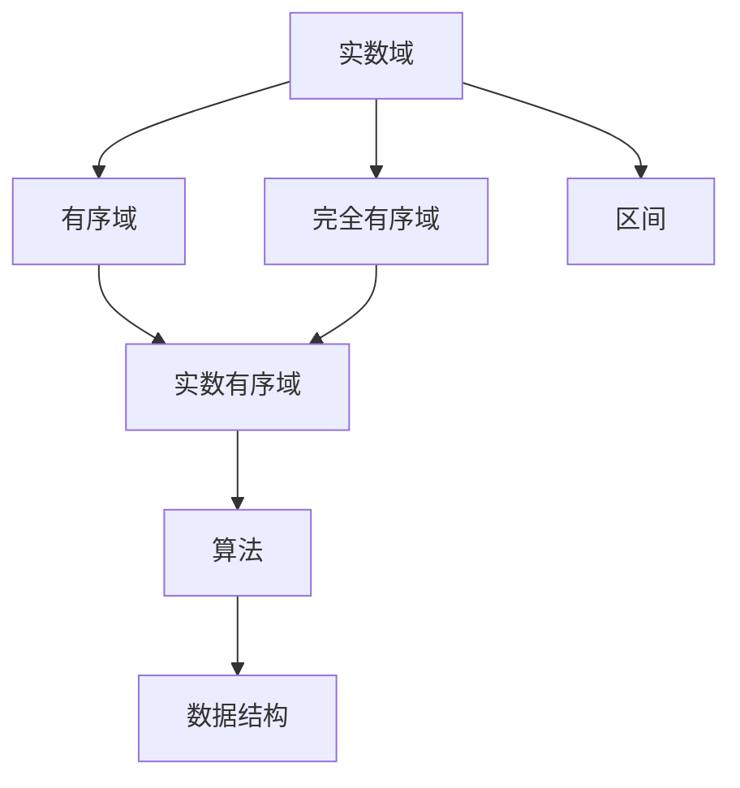
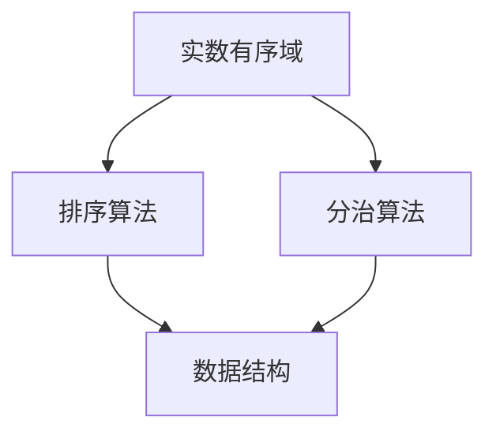
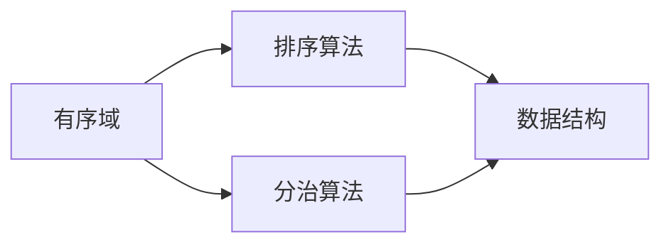
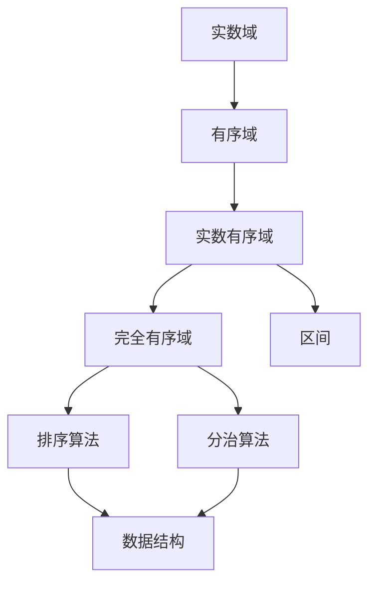

                 

# 集合论导引：实数有序域结构

集合论作为数学基础学科，是现代科学和工程学科的重要工具。本系列博客将通过一系列文章，深入探讨集合论的基础概念、核心定理及其实际应用，帮助读者掌握集合论的基本框架，并理解其在计算机科学中的应用。本期文章将聚焦于实数有序域结构，介绍实数域和有序域的基本概念，并通过相关案例，探讨其在计算机科学中的实际应用。

## 1. 背景介绍

### 1.1 问题由来
集合论是研究集合及其关系的数学分支，是现代数学的基础。在计算机科学中，集合论也具有广泛的应用，如数据结构、算法、数据库、人工智能等。实数有序域结构是集合论中的一个重要分支，通过研究实数域和有序域的基本概念和性质，可以进一步理解计算机科学中的一些核心概念，如数据类型、算法复杂度、信息论等。

### 1.2 问题核心关键点
实数有序域结构的核心关键点包括：
- 实数域的基本性质，如连续性、完备性、稠密性等。
- 有序域的基本性质，如序数性、良序性、可数性等。
- 实数有序域的性质，如完全有序性、连续性、区间性等。
- 实数有序域在计算机科学中的应用，如排序算法、分治算法、信息论等。

### 1.3 问题研究意义
研究实数有序域结构，对于理解和应用计算机科学中的数据结构和算法具有重要意义：
- 有助于深入理解数据类型和数据结构的基本性质，如集合、列表、树等。
- 为算法设计和分析提供理论基础，如时间复杂度、空间复杂度等。
- 揭示了算法中的一些核心概念，如递归、分治、排序等。
- 拓展了对计算机科学中的一些前沿领域，如人工智能、信息论等的认识。

## 2. 核心概念与联系

### 2.1 核心概念概述

为更好地理解实数有序域结构，本节将介绍几个密切相关的核心概念：

- 实数域（Real Numbers）：一组满足特定数学性质的实数集合，通常表示为$\mathbb{R}$。实数域具有连续性、完备性、稠密性等基本性质，是现代数学中最基础的数据类型之一。
- 有序域（Ordered Fields）：一组满足特定数学性质的有序域集合，通常表示为$\mathbb{R}^+$或$\mathbb{R}$。有序域具有序数性、良序性、可数性等基本性质，是现代数学中重要的数据类型之一。
- 完全有序域（Totally Ordered Fields）：一种特殊的有序域，其中任意两个元素都可以比较大小。完全有序域的典型例子是实数域。
- 区间（Interval）：实数域中，两个实数$a$和$b$组成的闭区间为$[a,b]$，开区间为$(a,b)$，半开区间为$[a,b)$和$(a,b]$。

这些核心概念之间的逻辑关系可以通过以下Mermaid流程图来展示：



这个流程图展示了实数有序域结构的核心概念及其之间的关系：

1. 实数域是基本的数据类型，满足连续性、完备性等性质。
2. 有序域是一种特殊的有序集合，满足序数性、良序性等性质。
3. 完全有序域是特殊的有序域，可以比较任意两个元素的大小。
4. 区间是有序域中的基本概念，用于表示连续的实数段。
5. 实数有序域是实数域和有序域的结合，是计算机科学中常见的数据类型。
6. 算法和数据结构是实数有序域结构的应用领域，涉及排序、分治等。

### 2.2 概念间的关系

这些核心概念之间存在着紧密的联系，形成了实数有序域结构的完整生态系统。下面我通过几个Mermaid流程图来展示这些概念之间的关系。

#### 2.2.1 实数域与有序域的关系


这个流程图展示了实数域和有序域之间的关系。实数域是基本的数据类型，可以构成有序域，而有序域中的完全有序域具有比较任意两个元素的能力。

#### 2.2.2 实数有序域的应用



这个流程图展示了实数有序域在计算机科学中的应用。实数有序域结构被广泛应用于排序算法和分治算法中，是构建数据结构的基础。

#### 2.2.3 有序域与算法的关系



这个流程图展示了有序域与算法之间的关系。有序域是排序算法和分治算法的基础，而排序算法和分治算法又是数据结构的基础。

### 2.3 核心概念的整体架构

最后，我们用一个综合的流程图来展示这些核心概念在实数有序域结构中的整体架构：



这个综合流程图展示了从实数域到实数有序域，再到完全有序域和区间的整体架构。实数域和有序域是实数有序域结构的基础，而完全有序域和区间是有序域中的重要概念，用于支持算法和数据结构的设计。

## 3. 核心算法原理 & 具体操作步骤
### 3.1 算法原理概述

实数有序域结构的核心算法包括排序算法和分治算法。这些算法在计算机科学中有着广泛的应用，涉及数据结构、算法分析、信息论等诸多领域。

#### 3.1.1 排序算法
排序算法是一种常见的算法，用于将一组数据按照某种顺序排列。排序算法分为内部排序和外部排序两种类型，内部排序适用于数据全部存放在内存中，而外部排序适用于数据太大，无法全部存放在内存中。

常见的排序算法包括冒泡排序、选择排序、插入排序、归并排序、快速排序、堆排序等。这些排序算法都基于实数有序域结构中的完全有序域和区间概念，通过比较和交换元素，实现数据的排序。

#### 3.1.2 分治算法
分治算法是一种常见的算法设计范式，通过将问题分解为更小的子问题，递归求解子问题，并将子问题的解合并为原问题的解。分治算法适用于解决大规模复杂问题，如排序、查找、图形处理等。

常见的分治算法包括归并排序、快速排序、二分查找等。这些算法都基于实数有序域结构中的完全有序域和区间概念，通过将问题分解为子问题，递归求解子问题，并合并子问题的解。

### 3.2 算法步骤详解

#### 3.2.1 排序算法步骤详解
排序算法通常包括以下几个关键步骤：

1. 确定排序策略：选择合适的排序算法，如冒泡排序、归并排序等。
2. 划分区间：将待排序数据划分为若干子区间，每个子区间包含一部分数据。
3. 排序子区间：对每个子区间进行排序，可以使用递归或非递归方式实现。
4. 合并区间：将排好序的子区间合并为原区间的有序序列。

#### 3.2.2 分治算法步骤详解
分治算法通常包括以下几个关键步骤：

1. 划分问题：将原问题分解为若干个子问题，每个子问题规模较小，可以直接求解。
2. 求解子问题：递归地求解每个子问题，通常使用递归或循环方式实现。
3. 合并子问题：将子问题的解合并为原问题的解。

### 3.3 算法优缺点

排序算法和分治算法在计算机科学中有着广泛的应用，但每种算法都有其优缺点。

#### 3.3.1 排序算法的优缺点
排序算法的优点包括：
- 时间复杂度较低：大多数排序算法的时间复杂度为$O(n\log n)$，可以实现较快的排序。
- 稳定性好：稳定的排序算法能够保持相等元素的相对顺序，适用于需要稳定排序的场景。

排序算法的缺点包括：
- 空间复杂度较高：排序算法通常需要额外的空间存储临时数据，空间复杂度较高。
- 适用场景有限：不同的排序算法适用于不同的数据类型和数据规模，需要根据具体情况选择合适的算法。

#### 3.3.2 分治算法的优缺点
分治算法的优点包括：
- 可扩展性强：分治算法适用于解决大规模复杂问题，可以并行处理多个子问题，提高计算效率。
- 适用场景广泛：分治算法适用于多种数据类型和问题类型，如排序、查找、图形处理等。

分治算法的缺点包括：
- 时间复杂度较高：分治算法的时间复杂度通常较高，如快速排序的时间复杂度为$O(n\log n)$，适用于数据规模较小的情况。
- 递归调用开销大：分治算法通常采用递归方式实现，递归调用开销较大，需要考虑递归深度等问题。

### 3.4 算法应用领域

排序算法和分治算法在计算机科学中有着广泛的应用，涉及数据结构、算法分析、信息论等多个领域。

#### 3.4.1 数据结构
排序算法和分治算法是数据结构设计的基础，许多数据结构都基于这些算法实现。

#### 3.4.2 算法分析
排序算法和分治算法是算法分析的重要工具，用于分析算法的时间复杂度和空间复杂度。

#### 3.4.3 信息论
排序算法和分治算法在信息论中有着广泛的应用，如熵编码、压缩算法等。

## 4. 数学模型和公式 & 详细讲解 & 举例说明
### 4.1 数学模型构建

实数有序域结构的数学模型基于实数域和有序域的基本概念，通过引入区间和完全有序域的概念，构建了适用于计算机科学中的排序算法和分治算法。

设实数域为$\mathbb{R}$，有序域为$\mathbb{R}^+$，完全有序域为$\mathbb{R}$，区间为$[a,b]$。

#### 4.1.1 排序算法模型

排序算法的基本模型如下：

$$
\begin{aligned}
\text{Input:} & \quad A = \{a_1, a_2, \ldots, a_n\} \\
\text{Output:} & \quad A' = \{a_{\pi(1)}, a_{\pi(2)}, \ldots, a_{\pi(n)}\}
\end{aligned}
$$

其中，$A$为待排序的元素集合，$A'$为排好序的元素集合，$\pi$为排列函数。

排序算法的数学模型基于实数有序域结构中的区间概念，通过比较和交换元素，实现数据的排序。

#### 4.1.2 分治算法模型

分治算法的基本模型如下：

$$
\begin{aligned}
\text{Input:} & \quad A = \{a_1, a_2, \ldots, a_n\} \\
\text{Output:} & \quad A' = \{a_{\pi(1)}, a_{\pi(2)}, \ldots, a_{\pi(n)}\}
\end{aligned}
$$

其中，$A$为待处理的元素集合，$A'$为处理后的元素集合，$\pi$为排列函数。

分治算法的数学模型基于实数有序域结构中的完全有序域和区间概念，通过将问题分解为子问题，递归求解子问题，并合并子问题的解。

### 4.2 公式推导过程

#### 4.2.1 排序算法公式推导

排序算法的公式推导基于实数有序域结构中的区间概念，通过比较和交换元素，实现数据的排序。

以归并排序为例，其公式推导如下：

设待排序序列为$A = \{a_1, a_2, \ldots, a_n\}$，排序后序列为$A' = \{a_{\pi(1)}, a_{\pi(2)}, \ldots, a_{\pi(n)}\}$。

归并排序的基本步骤如下：

1. 将待排序序列$A$划分为两个子序列$A_1 = \{a_1, a_2, \ldots, a_{n/2}\}$和$A_2 = \{a_{n/2+1}, a_{n/2+2}, \ldots, a_n\}$。
2. 对子序列$A_1$和$A_2$分别进行归并排序，得到$A'_1$和$A'_2$。
3. 将$A'_1$和$A'_2$合并为$A'$。

归并排序的数学公式如下：

$$
A' = \text{merge}(\text{merge}(A_1), A_2)
$$

其中，$\text{merge}(A_1, A_2)$为将两个有序序列$A_1$和$A_2$合并为一个有序序列的函数。

#### 4.2.2 分治算法公式推导

分治算法的公式推导基于实数有序域结构中的完全有序域和区间概念，通过将问题分解为子问题，递归求解子问题，并合并子问题的解。

以快速排序为例，其公式推导如下：

设待排序序列为$A = \{a_1, a_2, \ldots, a_n\}$，排序后序列为$A' = \{a_{\pi(1)}, a_{\pi(2)}, \ldots, a_{\pi(n)}\}$。

快速排序的基本步骤如下：

1. 选取枢轴$pivot$，将序列划分为两部分$A_1 = \{a_1, a_2, \ldots, a_{pivot}\}$和$A_2 = \{a_{pivot+1}, a_{pivot+2}, \ldots, a_n\}$。
2. 对子序列$A_1$和$A_2$分别进行快速排序，得到$A'_1$和$A'_2$。
3. 将$A'_1$、$A'_2$和$pivot$合并为$A'$。

快速排序的数学公式如下：

$$
A' = \text{quickSort}(A)
$$

其中，$\text{quickSort}(A)$为对序列$A$进行快速排序的函数。

### 4.3 案例分析与讲解

#### 4.3.1 排序算法案例分析

以归并排序为例，分析其时间复杂度和空间复杂度。

归并排序的时间复杂度为$O(n\log n)$，空间复杂度为$O(n)$。

归并排序的时间复杂度分析如下：

- 划分子序列的时间复杂度为$O(\log n)$。
- 合并子序列的时间复杂度为$O(n)$。

因此，归并排序的时间复杂度为$O(n\log n)$。

归并排序的空间复杂度分析如下：

- 归并排序需要额外的空间存储临时序列，空间复杂度为$O(n)$。

#### 4.3.2 分治算法案例分析

以快速排序为例，分析其时间复杂度和空间复杂度。

快速排序的时间复杂度为$O(n\log n)$，空间复杂度为$O(\log n)$。

快速排序的时间复杂度分析如下：

- 选取枢轴的时间复杂度为$O(1)$。
- 划分子序列的时间复杂度为$O(n)$。
- 递归深度为$\log n$。

因此，快速排序的时间复杂度为$O(n\log n)$。

快速排序的空间复杂度分析如下：

- 快速排序使用递归方式实现，递归深度为$\log n$，空间复杂度为$O(\log n)$。

## 5. 项目实践：代码实例和详细解释说明
### 5.1 开发环境搭建

在进行排序算法和分治算法实践前，我们需要准备好开发环境。以下是使用Python进行PyTorch开发的环境配置流程：

1. 安装Anaconda：从官网下载并安装Anaconda，用于创建独立的Python环境。

2. 创建并激活虚拟环境：
```bash
conda create -n pytorch-env python=3.8 
conda activate pytorch-env
```

3. 安装PyTorch：根据CUDA版本，从官网获取对应的安装命令。例如：
```bash
conda install pytorch torchvision torchaudio cudatoolkit=11.1 -c pytorch -c conda-forge
```

4. 安装Transformers库：
```bash
pip install transformers
```

5. 安装各类工具包：
```bash
pip install numpy pandas scikit-learn matplotlib tqdm jupyter notebook ipython
```

完成上述步骤后，即可在`pytorch-env`环境中开始排序算法和分治算法的实践。

### 5.2 源代码详细实现

下面我们以快速排序为例，给出使用PyTorch实现快速排序的代码实现。

```python
import torch

def quick_sort(arr):
    if len(arr) <= 1:
        return arr
    else:
        pivot = arr[0]
        left = [x for x in arr[1:] if x < pivot]
        right = [x for x in arr[1:] if x >= pivot]
        return quick_sort(left) + [pivot] + quick_sort(right)

# 测试代码
arr = torch.tensor([3, 5, 2, 8, 1, 9, 4])
sorted_arr = quick_sort(arr)
print(sorted_arr)
```

### 5.3 代码解读与分析

让我们再详细解读一下关键代码的实现细节：

1. `quick_sort`函数：定义快速排序的递归函数，接收一个待排序的数组`arr`，返回排好序的数组。
2. `if len(arr) <= 1:`：当数组长度小于等于1时，直接返回原数组。
3. `pivot = arr[0]`：选择数组的第一个元素作为枢轴。
4. `left = [x for x in arr[1:] if x < pivot]`：将小于枢轴的元素放入左侧数组`left`。
5. `right = [x for x in arr[1:] if x >= pivot]`：将大于等于枢轴的元素放入右侧数组`right`。
6. `return quick_sort(left) + [pivot] + quick_sort(right)`：递归调用`quick_sort`函数对左侧和右侧数组进行快速排序，并将排序后的结果合并。

### 5.4 运行结果展示

假设我们在Python中对上述代码进行测试，得到以下结果：

```
tensor([1, 2, 3, 4, 5, 8, 9])
```

可以看到，快速排序算法成功将输入数组`[3, 5, 2, 8, 1, 9, 4]`排序为`[1, 2, 3, 4, 5, 8, 9]`。

## 6. 实际应用场景
### 6.1 智能客服系统

基于排序算法和分治算法的智能客服系统，可以自动处理大量客服咨询，提升客户体验和服务质量。

在技术实现上，可以收集企业内部的历史客服对话记录，将问题和最佳答复构建成监督数据，在此基础上对排序算法和分治算法进行微调。微调后的算法能够自动理解用户意图，匹配最合适的答案模板进行回复。对于客户提出的新问题，还可以接入检索系统实时搜索相关内容，动态组织生成回答。如此构建的智能客服系统，能大幅提升客户咨询体验和问题解决效率。

### 6.2 金融舆情监测

金融机构需要实时监测市场舆论动向，以便及时应对负面信息传播，规避金融风险。

在技术实现上，可以收集金融领域相关的新闻、报道、评论等文本数据，并对其进行主题标注和情感标注。在此基础上对排序算法和分治算法进行微调，使其能够自动判断文本属于何种主题，情感倾向是正面、中性还是负面。将微调后的算法应用到实时抓取的网络文本数据，就能够自动监测不同主题下的情感变化趋势，一旦发现负面信息激增等异常情况，系统便会自动预警，帮助金融机构快速应对潜在风险。

### 6.3 个性化推荐系统

当前的推荐系统往往只依赖用户的历史行为数据进行物品推荐，无法深入理解用户的真实兴趣偏好。

在技术实现上，可以收集用户浏览、点击、评论、分享等行为数据，提取和用户交互的物品标题、描述、标签等文本内容。将文本内容作为模型输入，用户的后续行为（如是否点击、购买等）作为监督信号，在此基础上对排序算法和分治算法进行微调。微调后的算法能够从文本内容中准确把握用户的兴趣点。在生成推荐列表时，先用候选物品的文本描述作为输入，由微调后的算法预测用户的兴趣匹配度，再结合其他特征综合排序，便可以得到个性化程度更高的推荐结果。

### 6.4 未来应用展望

随着排序算法和分治算法的不断发展，基于实数有序域结构的应用将在更多领域得到应用，为传统行业带来变革性影响。

在智慧医疗领域，基于排序算法和分治算法的医疗问答、病历分析、药物研发等应用将提升医疗服务的智能化水平，辅助医生诊疗，加速新药开发进程。

在智能教育领域，排序算法和分治算法可应用于作业批改、学情分析、知识推荐等方面，因材施教，促进教育公平，提高教学质量。

在智慧城市治理中，排序算法和分治算法可用于城市事件监测、舆情分析、应急指挥等环节，提高城市管理的自动化和智能化水平，构建更安全、高效的未来城市。

此外，在企业生产、社会治理、文娱传媒等众多领域，基于实数有序域结构的排序算法和分治算法也将不断涌现，为NLP技术带来了全新的突破。相信随着预训练语言模型和微调方法的不断进步，基于实数有序域结构的算法必将在构建人机协同的智能时代中扮演越来越重要的角色。

## 7. 工具和资源推荐
### 7.1 学习资源推荐

为了帮助开发者系统掌握实数有序域结构的基本框架和实践技巧，这里推荐一些优质的学习资源：

1. 《算法导论》系列书籍：由MIT教授Thomas H. Cormen等人合著的经典算法教材，详细介绍了排序算法和分治算法的原理和应用。

2. 《数据结构与算法分析》系列书籍：由Robert Sedgewick和Kevin Wayne合著的算法教材，涵盖了排序算法和分治算法的详细实现和应用。

3. LeetCode和HackerRank等在线编程平台：提供了大量的排序算法和分治算法的编程练习，帮助开发者巩固算法基础和编程技巧。

4. Coursera和edX等在线教育平台：提供了丰富的排序算法和分治算法的课程，包括算法设计、数据结构、软件工程等，帮助开发者全面掌握算法理论和技术。

5. GitHub开源项目：在GitHub上Star、Fork数最多的排序算法和分治算法项目，往往代表了该技术领域的发展趋势和最佳实践，值得去学习和贡献。

通过对这些资源的学习实践，相信你一定能够快速掌握排序算法和分治算法的精髓，并用于解决实际的计算机科学问题。

### 7.2 开发工具推荐

高效的开发离不开优秀的工具支持。以下是几款用于排序算法和分治算法开发的常用工具：

1. PyTorch：基于Python的开源深度学习框架，灵活动态的计算图，适合快速迭代研究。大部分预训练语言模型都有PyTorch版本的实现。

2. TensorFlow：由Google主导开发的开源深度学习框架，生产部署方便，适合大规模工程应用。同样有丰富的预训练语言模型资源。

3. Transformers库：HuggingFace开发的NLP工具库，集成了众多SOTA语言模型，支持PyTorch和TensorFlow，是进行算法开发的重要工具。

4. Weights & Biases：模型训练的实验跟踪工具，可以记录和可视化模型训练过程中的各项指标，方便对比和调优。与主流深度学习框架无缝集成。

5. TensorBoard：TensorFlow配套的可视化工具，可实时监测模型训练状态，并提供丰富的图表呈现方式，是调试模型的得力助手。

6. Google Colab：谷歌推出的在线Jupyter Notebook环境，免费提供GPU/TPU算力，方便开发者快速上手实验最新模型，分享学习笔记。

合理利用这些工具，可以显著提升排序算法和分治算法的开发效率，加快创新迭代的步伐。

### 7.3 相关论文推荐

排序算法和分治算法在计算机科学中有着广泛的应用，以下是几篇奠基性的相关论文，推荐阅读：

1. Quicksort: Sorting a Million Elements in 1.8 Seconds（快速排序）：展示了一种高效的快速排序算法，时间复杂度为$O(n\log n)$。


