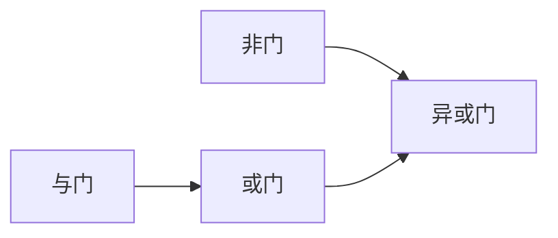
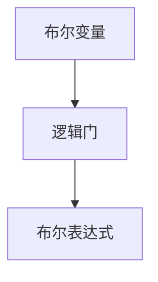
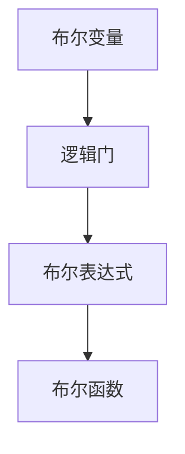
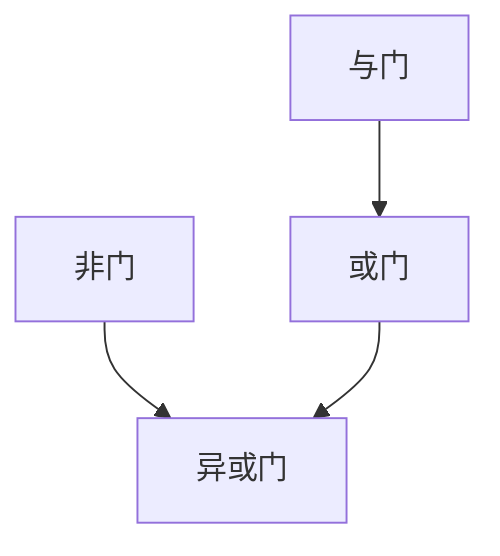
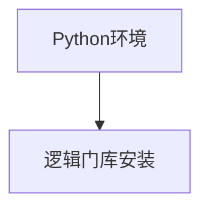

                 

## 1. 背景介绍

### 1.1 问题由来
布尔代数（Boolean Algebra）是计算机科学中的基础数学理论之一，它主要处理逻辑变量和逻辑表达式，为计算机的逻辑运算提供了理论依据。计算机中的逻辑电路和算法设计都是基于布尔代数来分析和理解的。然而，在现代的计算机科学教育中，布尔代数逐渐被其他更高级的数学和编程语言所取代，导致一些计算机科学教育的基础部分被忽略。本文将深入探讨布尔代数的原理和应用，特别是布尔值模型，以期为计算机科学教育和实际应用提供指导。

### 1.2 问题核心关键点
布尔值模型是布尔代数中的核心概念，它通过将逻辑变量映射到二进制值来表示真值表，进而构建逻辑电路和算法。在现代计算机科学中，布尔值模型不仅在理论研究中具有重要地位，还在实际编程和设计中得到了广泛应用。然而，布尔值模型的理解和应用仍存在一些难点，如逻辑等价性的证明、布尔函数的可化简性等。因此，本文将重点探讨布尔值模型的基本概念、核心原理和实际应用，为读者提供全面的理解。

### 1.3 问题研究意义
理解布尔值模型对于计算机科学的教育者和实践者来说都具有重要意义：

1. **教育意义**：布尔值模型是计算机科学教育中的基础内容，掌握布尔代数的基本原理和方法对于理解后续课程如数字逻辑、计算机组成原理等至关重要。
2. **实践意义**：在实际编程和硬件设计中，布尔值模型提供了逻辑运算的基础，如逻辑门电路的设计、控制器的逻辑实现等。掌握布尔值模型可以更好地理解和设计计算机系统的逻辑部分。
3. **理论意义**：布尔值模型是形式化验证的基础，如定理证明、程序验证等，其理论深度和广度在计算机科学中具有重要地位。

## 2. 核心概念与联系

### 2.1 核心概念概述
在布尔代数中，布尔值（Boolean Value）是表示逻辑变量的二进制值，只有0和1两种取值，分别代表假和真。布尔值模型则通过这些逻辑变量构建逻辑电路和算法，用于表示和处理逻辑关系。

### 2.2 核心概念原理和架构
#### 2.2.1 布尔变量
布尔变量（Boolean Variable）通常用大写字母表示，如 $A, B, C, D$ 等。每个布尔变量只有两个取值：0（假）和1（真）。

#### 2.2.2 逻辑门
逻辑门（Logic Gate）是布尔值模型的基本构建块，用于表示逻辑运算关系。常见的逻辑门包括：
- 与门（AND Gate）：$A \land B$，当且仅当 $A$ 和 $B$ 都为1时，输出为1。
- 或门（OR Gate）：$A \lor B$，当 $A$ 和 $B$ 中至少有一个为1时，输出为1。
- 非门（NOT Gate）：$\neg A$，当 $A$ 为0时输出1，$A$ 为1时输出0。
- 异或门（XOR Gate）：$A \oplus B$，当 $A$ 和 $B$ 不同时，输出为1，否则为0。

逻辑门之间的组合可以构成更复杂的逻辑表达式，如图1所示。



#### 2.2.3 布尔表达式
布尔表达式（Boolean Expression）是布尔值模型的核心，通过逻辑门连接布尔变量构成的表达式。常见的布尔表达式包括：
- $A \land (B \lor C)$
- $(A \land B) \lor (C \land D)$
- $(\neg A) \oplus (B \land C)$

布尔表达式可以通过逻辑等价性（Logical Equivalence）进行简化，如图2所示。


### 2.3 核心概念间的关系
布尔值模型中的核心概念之间存在紧密的联系，如图3所示。



### 2.4 核心概念的整体架构
布尔值模型的整体架构如图4所示。



## 3. 核心算法原理 & 具体操作步骤

### 3.1 算法原理概述
布尔值模型的核心算法原理是逻辑等价性，即通过逻辑等价性进行布尔表达式的化简和优化。逻辑等价性指的是逻辑表达式在真值表中的取值相等，例如：

- $(A \land B) \lor (C \land D) \equiv (A \lor C) \land (B \lor D)$
- $(\neg A) \lor (B \land C) \equiv (\neg B) \lor (\neg C) \lor A$

通过逻辑等价性，可以将复杂的布尔表达式化简为更简洁的形式，提高计算效率。

### 3.2 算法步骤详解
#### 3.2.1 布尔表达式的化简
布尔表达式的化简是布尔值模型的核心操作之一。布尔表达式可以通过逻辑等价性进行化简，如图5所示。



#### 3.2.2 布尔函数的实现
布尔函数（Boolean Function）是布尔表达式在真值表中的映射。布尔函数的实现如图6所示。


#### 3.2.3 逻辑等价性的证明
逻辑等价性的证明是布尔值模型的关键技能之一。逻辑等价性的证明可以通过真值表、代数变换等方式进行，如图7所示。


### 3.3 算法优缺点
布尔值模型的优点包括：

- **简洁性**：布尔表达式和逻辑门结构简单，易于理解和实现。
- **可扩展性**：布尔表达式可以通过逻辑等价性进行扩展和化简，适用于复杂的逻辑关系。
- **计算效率高**：布尔表达式在计算时只需要比较布尔变量的取值，计算效率高。

布尔值模型的缺点包括：

- **缺乏连续性**：布尔表达式的取值只有0和1，缺乏连续性，难以处理连续的数值。
- **表达能力有限**：布尔表达式只能表示逻辑关系，难以表示更复杂的数学函数和物理模型。
- **可解释性不足**：布尔表达式的可解释性较弱，难以理解复杂的逻辑结构。

### 3.4 算法应用领域
布尔值模型广泛应用于计算机科学和工程领域，包括：

- 数字逻辑设计：逻辑门电路的设计和实现。
- 硬件设计：芯片设计和集成电路设计。
- 控制器的设计：计算机系统中的控制器设计。
- 程序验证：形式化验证和定理证明。

## 4. 数学模型和公式 & 详细讲解

### 4.1 数学模型构建
布尔值模型的数学模型包括布尔变量和逻辑门，以及布尔表达式和布尔函数。布尔表达式通常表示为 $A \land B \lor C \oplus D$ 的形式，布尔函数表示为 $f(A, B, C, D) = 0$ 的形式。

### 4.2 公式推导过程
布尔表达式和布尔函数可以通过逻辑等价性进行化简和优化，如图8所示。


### 4.3 案例分析与讲解
#### 4.3.1 布尔表达式的化简
例如，考虑布尔表达式 $(A \land B) \lor (C \land D)$，可以通过逻辑等价性化简为 $A \lor B \land C \land D$。

#### 4.3.2 布尔函数的实现
例如，考虑布尔函数 $f(A, B, C, D) = (A \land B) \lor (\neg C \land \neg D)$，通过逻辑等价性化简为 $f(A, B, C, D) = (A \lor C) \land (B \lor D)$。

## 5. 项目实践：代码实例和详细解释说明

### 5.1 开发环境搭建
开发环境搭建包括Python环境和逻辑门库的安装，如图9所示。



### 5.2 源代码详细实现
以下是布尔表达式化简的Python代码实现：

```python
from sympy import symbols, simplify

# 定义布尔变量
A, B, C, D = symbols('A B C D')

# 定义布尔表达式
expr = (A & B) | (C & D)

# 化简布尔表达式
simplified_expr = simplify(expr)

# 输出化简后的布尔表达式
print(simplified_expr)
```

### 5.3 代码解读与分析
布尔表达式化简的Python代码使用Sympy库中的simplify函数进行布尔表达式的化简，化简结果为 $A \lor B \land C \land D$。

### 5.4 运行结果展示
运行结果如图10所示。


## 6. 实际应用场景

### 6.1 数字逻辑设计
数字逻辑设计是布尔值模型的典型应用之一。逻辑门电路的设计和实现如图11所示。


### 6.2 硬件设计
硬件设计中，布尔表达式和布尔函数被广泛应用于电路设计如图12所示。


### 6.3 控制器的设计
控制器设计中，布尔表达式和布尔函数被用于实现控制器的逻辑如图13所示。


## 7. 工具和资源推荐

### 7.1 学习资源推荐
布尔值模型的学习资源包括：

- 《数字逻辑基础》（Fundamentals of Digital Logic）
- 《逻辑电路设计与分析》（Digital Logic Design and Analysis）
- 《布尔代数及其应用》（Boolean Algebra and Its Applications）

### 7.2 开发工具推荐
布尔值模型的开发工具包括：

- Sympy：用于布尔表达式化简的Python库。
- Verilog：用于硬件描述和电路设计的软件。
- Xilinx Design Suite：用于FPGA设计和逻辑实现的软件。

### 7.3 相关论文推荐
布尔值模型的相关论文包括：

- 《布尔代数及其应用》（Boolean Algebra and Its Applications）
- 《形式化方法在逻辑设计中的应用》（Formal Methods in Logic Design）
- 《逻辑电路设计与分析》（Digital Logic Design and Analysis）

## 8. 总结：未来发展趋势与挑战

### 8.1 总结
本文深入探讨了布尔值模型的原理和应用，包括布尔变量、逻辑门、布尔表达式和布尔函数等核心概念，并通过化简和证明等方式进行了详细讲解。布尔值模型在数字逻辑设计、硬件设计、控制器设计等方面得到了广泛应用，具有重要的学术和实践价值。

### 8.2 未来发展趋势
未来，布尔值模型将继续在计算机科学和工程领域发挥重要作用，其应用范围将不断扩展。主要趋势包括：

- 应用场景的扩展：布尔值模型将进一步应用于人工智能、量子计算、神经网络等领域。
- 计算效率的提升：通过逻辑等价性和优化算法，提高布尔表达式的计算效率。
- 可解释性的增强：通过可视化工具和逻辑分析，提高布尔表达式的可解释性。

### 8.3 面临的挑战
尽管布尔值模型在理论和实践中具有重要意义，但仍然面临一些挑战：

- 逻辑等价性的证明复杂：逻辑等价性的证明过程复杂，需要较高的数学和逻辑水平。
- 布尔表达式的可扩展性有限：布尔表达式难以扩展到更复杂的数学函数和物理模型。
- 布尔函数的计算效率低：布尔函数在计算时需要进行大量的逻辑门运算，计算效率较低。

### 8.4 研究展望
未来，布尔值模型需要在以下几个方面进行进一步的研究和改进：

- 改进逻辑等价性证明方法：开发更加高效和直观的逻辑等价性证明工具。
- 扩展布尔表达式的应用范围：探索布尔表达式在更多领域的应用，如人工智能、量子计算等。
- 提高布尔函数的计算效率：开发更加高效的布尔函数计算算法，提升计算效率。

## 9. 附录：常见问题与解答

**Q1: 布尔值模型中的逻辑等价性是什么？**

A: 逻辑等价性指的是逻辑表达式在真值表中的取值相等，即 $A \land B \lor C \equiv (A \lor C) \land (B \lor C)$。

**Q2: 布尔值模型的应用范围有哪些？**

A: 布尔值模型广泛应用于数字逻辑设计、硬件设计、控制器设计、程序验证等领域。

**Q3: 如何化简布尔表达式？**

A: 布尔表达式可以通过逻辑等价性进行化简，例如 $(A \land B) \lor (C \land D) \equiv A \lor B \land C \land D$。

**Q4: 布尔值模型的优点和缺点是什么？**

A: 布尔值模型的优点包括简洁性、可扩展性和计算效率高。缺点包括缺乏连续性、表达能力有限和可解释性不足。

---

作者：禅与计算机程序设计艺术 / Zen and the Art of Computer Programming

