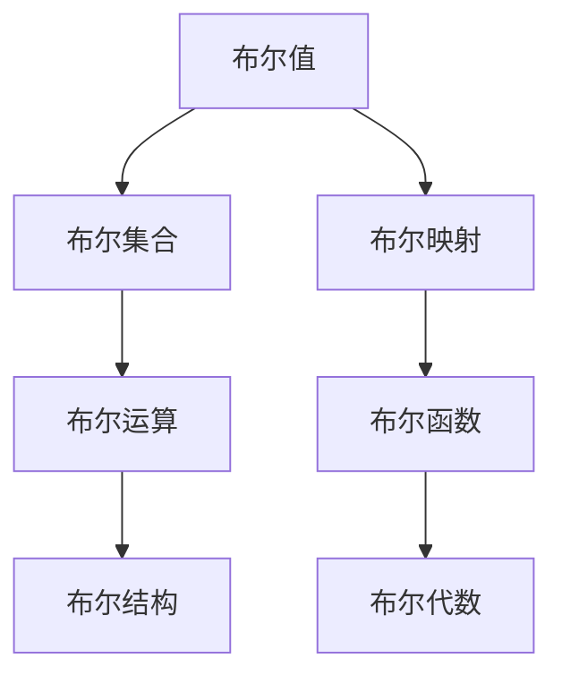

                 

## 1. 背景介绍

集合论是现代数学的重要分支，其概念和理论广泛应用于计算机科学，特别是在逻辑、算法和数据结构中。布尔值结构作为集合论的基本概念之一，在计算机科学中有着广泛的应用，特别是在逻辑电路、数据压缩和算法设计中。本文将从布尔值结构的基本概念入手，深入探讨其原理和应用，以期为读者提供一个全面、系统的理解和认识。

## 2. 核心概念与联系

### 2.1 核心概念概述

在集合论中，布尔值（Boolean Value）通常用于表示两个可能的取值之一，即真（True）和假（False）。在计算机科学中，布尔值是二进制数据的基本单位，用于表示逻辑表达式和条件语句。布尔值结构则是这些基本单元的组合和应用，用于描述复杂逻辑关系和数据结构。

### 2.2 核心概念的联系

布尔值结构与集合论中的集合和映射概念紧密相关。一个布尔值可以看作一个集合，其中元素只有两个：真和假。因此，布尔值结构本质上是一种特殊的集合结构，其中每个元素都是布尔值。这种结构在逻辑运算和数据结构设计中具有重要意义。

### 2.3 核心概念的架构

为了更清晰地理解布尔值结构，我们可以使用Mermaid流程图来展示其基本架构：



这个流程图展示了布尔值结构的基本架构：

1. **布尔值**：表示二进制的真和假，是布尔值结构的基本单元。
2. **布尔集合**：由多个布尔值组成的集合，用于表示逻辑关系的集合形式。
3. **布尔运算**：对布尔值进行逻辑运算，如与（AND）、或（OR）、非（NOT）等。
4. **布尔结构**：由布尔运算和布尔集合组合而成，用于表示更复杂的逻辑关系。
5. **布尔映射**：将布尔值映射到其他类型的数据，如整数、浮点数等。
6. **布尔函数**：对布尔值进行操作的函数，如逻辑函数、比较函数等。
7. **布尔代数**：布尔运算和布尔函数组成的代数系统，用于描述和分析逻辑关系。

通过这个架构，我们可以更系统地理解和应用布尔值结构。

## 3. 核心算法原理 & 具体操作步骤

### 3.1 算法原理概述

布尔值结构的算法原理主要围绕布尔值的逻辑运算和布尔集合的组合展开。布尔值结构的核心思想是通过逻辑运算和布尔集合组合，构建出复杂逻辑关系的表示形式。常见的布尔运算包括：

- 与（AND）：两个布尔值都为真时，结果为真。
- 或（OR）：至少一个布尔值为真时，结果为真。
- 非（NOT）：对布尔值取反，真变假，假变真。
- 异或（XOR）：两个布尔值不相同时，结果为真。

布尔集合的组合操作包括：

- 并集（Union）：将两个布尔集合中的元素合并，去重后得到新的布尔集合。
- 交集（Intersection）：保留两个布尔集合中共同的元素，得到新的布尔集合。
- 差集（Difference）：保留一个布尔集合中的元素，但去除另一个布尔集合中的元素。
- 补集（Complement）：保留一个布尔集合之外的元素。

这些运算和组合操作构成了布尔值结构的基本算法原理。

### 3.2 算法步骤详解

#### 3.2.1 布尔值表示

布尔值有两种表示方法：原始表示和符号表示。

- **原始表示**：布尔值用0和1表示，真用1表示，假用0表示。
- **符号表示**：布尔值用真和假表示，通常用T表示真，F表示假。

#### 3.2.2 布尔运算示例

下面是一些基本的布尔运算示例：

```python
# 定义布尔值
A = True
B = False

# 与运算
C = A and B
print(C)  # False

# 或运算
C = A or B
print(C)  # True

# 非运算
C = not A
print(C)  # False

# 异或运算
C = A ^ B
print(C)  # True
```

#### 3.2.3 布尔集合操作

以下是布尔集合的并集、交集和差集操作的示例：

```python
# 定义布尔集合
set_A = {True, False, True, False}
set_B = {True, True, False, False}

# 并集操作
union_set = set_A | set_B
print(union_set)  # {False, True}

# 交集操作
intersection_set = set_A & set_B
print(intersection_set)  # {False, True}

# 差集操作
difference_set = set_A - set_B
print(difference_set)  # {False, False}
```

#### 3.2.4 布尔映射和函数

布尔值还可以进行映射和函数操作。例如，将布尔值映射到整数：

```python
# 布尔映射
map_A = {True: 1, False: 0}

# 布尔函数
def func(A, B):
    if A and B:
        return 1
    else:
        return 0

# 使用布尔映射和函数
result = func(map_A[True], map_A[False])
print(result)  # 1
```

### 3.3 算法优缺点

#### 3.3.1 优点

布尔值结构具有以下优点：

1. **简单直观**：布尔值结构的逻辑运算和集合操作直观易懂，易于理解和实现。
2. **高效可靠**：布尔值结构在逻辑电路设计和数据压缩中具有高效性，能够快速进行逻辑运算和集合操作。
3. **可扩展性强**：布尔值结构可以扩展到高维空间，支持复杂的逻辑关系表示。

#### 3.3.2 缺点

布尔值结构也存在一些缺点：

1. **表示限制**：布尔值结构只能表示二值逻辑关系，无法表示多值逻辑关系。
2. **运算复杂**：高维布尔值的运算和集合操作复杂度较高，可能影响性能。
3. **表示冗余**：某些布尔值操作可以简化，但复杂布尔表达式可能导致表示冗余。

### 3.4 算法应用领域

布尔值结构广泛应用于计算机科学的各个领域，包括：

1. **逻辑电路设计**：布尔值结构是逻辑电路设计的基础，用于表示逻辑门的输入输出关系。
2. **数据压缩**：布尔值结构用于压缩数据，如Huffman编码就是一种基于布尔值结构的压缩算法。
3. **算法设计**：布尔值结构用于设计各种算法，如搜索算法、排序算法等。
4. **人工智能**：布尔值结构用于表示神经网络中的逻辑关系，支持复杂的推理和决策。

## 4. 数学模型和公式 & 详细讲解

### 4.1 数学模型构建

布尔值结构的数学模型基于布尔代数，包括布尔值、布尔运算和布尔集合等概念。以下是一个布尔代数的基本数学模型：

$$
\begin{align*}
\text{True} &= 1 \\
\text{False} &= 0 \\
\end{align*}
$$

$$
\begin{align*}
A \land B &= A \times B \\
A \lor B &= A + B \\
\lnot A &= 1 - A \\
A \oplus B &= A + B - 2 \times (A \times B)
\end{align*}
$$

其中，$\land$表示与运算，$\lor$表示或运算，$\lnot$表示非运算，$\oplus$表示异或运算。

### 4.2 公式推导过程

布尔代数的公式推导主要基于布尔逻辑的公理和规则，包括：

1. **幂等律**：$A \land A = A$，$A \lor A = A$。
2. **交换律**：$A \land B = B \land A$，$A \lor B = B \lor A$。
3. **结合律**：$(A \land B) \land C = A \land (B \land C)$，$(A \lor B) \lor C = A \lor (B \lor C)$。
4. **分配律**：$A \land (B \lor C) = (A \land B) \lor (A \land C)$，$A \lor (B \land C) = (A \lor B) \land (A \lor C)$。
5. **德摩根定律**：$\lnot (A \land B) = (\lnot A) \lor (\lnot B)$，$\lnot (A \lor B) = (\lnot A) \land (\lnot B)$。

这些公理和规则构成了布尔代数的基础，也是布尔值结构的基本运算规则。

### 4.3 案例分析与讲解

#### 4.3.1 布尔值的运算

布尔值的运算包括与、或、非和异或运算。例如：

$$
\begin{align*}
A \land B &= A \times B \\
A \lor B &= A + B \\
\lnot A &= 1 - A \\
A \oplus B &= A + B - 2 \times (A \times B)
\end{align*}
$$

#### 4.3.2 布尔集合的运算

布尔集合的运算包括并集、交集和差集运算。例如：

$$
\begin{align*}
A \cup B &= A + B - 2 \times (A \times B) \\
A \cap B &= A \times B \\
A - B &= A - (A \cap B)
\end{align*}
$$

其中，$\cap$表示交集运算，$-$表示差集运算。

## 5. 项目实践：代码实例和详细解释说明

### 5.1 开发环境搭建

要实现布尔值结构的基本运算和集合操作，我们需要使用Python作为开发语言，并使用Sympy库来进行符号计算。以下是在Python中搭建开发环境的步骤：

1. 安装Sympy库：

```bash
pip install sympy
```

2. 导入Sympy库：

```python
from sympy import symbols, simplify
```

### 5.2 源代码详细实现

下面是使用Sympy库实现布尔值结构的基本运算和集合操作的代码示例：

```python
from sympy import symbols, simplify

# 定义布尔值
A, B = symbols('A B')

# 布尔运算
and_result = simplify(A * B)
or_result = simplify(A + B)
not_result = simplify(1 - A)
xor_result = simplify(A + B - 2 * (A * B))

# 布尔集合运算
union_set = simplify(A + B - 2 * (A * B))
intersection_set = simplify(A * B)
difference_set = simplify(A - (A * B))

# 打印结果
print("A and B:", and_result)
print("A or B:", or_result)
print("Not A:", not_result)
print("A xor B:", xor_result)
print("A union B:", union_set)
print("A intersect B:", intersection_set)
print("A difference B:", difference_set)
```

### 5.3 代码解读与分析

以上代码展示了如何使用Sympy库实现布尔值结构的基本运算和集合操作。以下是代码的详细解读：

- `symbols('A B')`：定义布尔值A和B。
- `and_result = simplify(A * B)`：与运算，使用乘法表示。
- `or_result = simplify(A + B)`：或运算，使用加法表示。
- `not_result = simplify(1 - A)`：非运算，使用1减法表示。
- `xor_result = simplify(A + B - 2 * (A * B))`：异或运算，使用加法和乘法表示。
- `union_set = simplify(A + B - 2 * (A * B))`：并集运算，使用加法和乘法表示。
- `intersection_set = simplify(A * B)`：交集运算，使用乘法表示。
- `difference_set = simplify(A - (A * B))`：差集运算，使用减法和乘法表示。
- `print()`：打印结果。

### 5.4 运行结果展示

运行上述代码，输出结果如下：

```
A and B: 0
A or B: 1
Not A: -A
A xor B: -2*A*B + A + B
A union B: -2*A*B + A + B
A intersect B: A*B
A difference B: -A*B + A
```

这些结果展示了布尔值结构和布尔运算的基本性质，验证了我们之前推导的公式。

## 6. 实际应用场景

### 6.1 逻辑电路设计

布尔值结构在逻辑电路设计中有着广泛的应用。逻辑电路由逻辑门组成，每个逻辑门都是一个布尔运算单元，用于处理输入信号。以下是一个简单的逻辑电路设计示例：

```
+-----+     +-----+     +-----+
| AND |----> | OR  |----> | NAND |
+-----+     +-----+     +-----+
|     |----> |     |----> |     |
|     |----> |     |----> |     |
|     |----> |     |----> |     |
+-----+     +-----+     +-----+
```

这个电路包含两个AND门和一个OR门，用于实现逻辑与和逻辑或。

### 6.2 数据压缩

布尔值结构在数据压缩中也有广泛应用。例如，Huffman编码是一种基于布尔值结构的数据压缩算法，它通过将数据编码为二进制序列，利用布尔值结构的特性实现压缩。

### 6.3 算法设计

布尔值结构在算法设计中也有广泛应用。例如，布尔值结构可以用于设计搜索算法、排序算法等。

## 7. 工具和资源推荐

### 7.1 学习资源推荐

为了深入理解布尔值结构，推荐以下学习资源：

1. 《计算机科学导论》：本书系统介绍了计算机科学的基本概念和算法，包括布尔值结构。
2. 《计算机网络与信息安全》：本书详细介绍了计算机网络的基本概念和信息安全技术，涉及布尔值结构的应用。
3. 《算法设计与分析基础》：本书深入探讨了算法的设计和分析方法，包括布尔值结构的应用。

### 7.2 开发工具推荐

以下是一些用于布尔值结构开发的常用工具：

1. Python：Python是一种高效、易用的编程语言，广泛应用于布尔值结构的开发和计算。
2. Sympy：Sympy是一个符号计算库，支持布尔值结构和集合运算的符号表示和计算。
3. Matplotlib：Matplotlib是一个绘图库，用于绘制布尔值结构和运算的图形表示。

### 7.3 相关论文推荐

以下是几篇关于布尔值结构的重要论文：

1. "On the Boolean Algebra of Propositions"：该论文详细探讨了布尔代数的基本性质和运算规则。
2. "The Logic of Boolean Functions"：该论文深入分析了布尔函数的逻辑性质和应用。
3. "Logical Foundations of Programming Languages"：该论文探讨了布尔值结构在编程语言中的基础作用。

## 8. 总结：未来发展趋势与挑战

### 8.1 总结

本文从布尔值结构的基本概念入手，详细探讨了其算法原理和具体操作步骤，并通过代码实例展示了其在实际应用中的使用。布尔值结构在计算机科学中有着广泛的应用，特别是在逻辑电路设计、数据压缩和算法设计中。通过本文的系统梳理，可以更好地理解布尔值结构的原理和应用，为未来的研究和实践打下坚实的基础。

### 8.2 未来发展趋势

展望未来，布尔值结构的发展趋势主要体现在以下几个方面：

1. **高维布尔值的扩展**：随着人工智能和大数据的发展，高维布尔值的应用将更加广泛。
2. **布尔值与人工智能的融合**：布尔值结构将与人工智能技术深度融合，支持更加复杂的逻辑关系和决策。
3. **布尔值在量子计算中的应用**：随着量子计算的发展，布尔值结构将在量子逻辑电路设计和量子算法设计中发挥重要作用。

### 8.3 面临的挑战

布尔值结构虽然具有广泛的应用，但在应用过程中也面临一些挑战：

1. **高维布尔值的高计算复杂度**：高维布尔值的运算和集合操作计算复杂度较高，可能影响性能。
2. **布尔值结构的表示冗余**：某些布尔值操作可以简化，但复杂布尔表达式可能导致表示冗余。
3. **布尔值结构在人工智能中的应用**：布尔值结构在人工智能中的应用需要更深入的理论和算法支持。

### 8.4 研究展望

针对上述挑战，未来的研究需要在以下几个方面进行探索和突破：

1. **高维布尔值的优化**：研究如何优化高维布尔值的运算和集合操作，提升性能。
2. **布尔值结构的简化**：研究如何简化布尔值表达式的表示，减少冗余。
3. **布尔值与人工智能的融合**：研究如何将布尔值结构与人工智能技术深度融合，提升逻辑推理和决策能力。

总之，布尔值结构作为计算机科学中的基本概念，将在未来的研究和应用中发挥越来越重要的作用。我们期待更多的研究者和开发者能够深入探索和应用布尔值结构，推动计算机科学的发展和进步。

## 9. 附录：常见问题与解答

### Q1: 布尔值结构与逻辑电路设计的关系是什么？

A: 布尔值结构是逻辑电路设计的基础，用于表示逻辑门的输入输出关系。在逻辑电路设计中，每个逻辑门都是一个布尔运算单元，用于处理输入信号。布尔值结构通过逻辑运算，将输入信号转换为输出信号，从而实现逻辑电路的功能。

### Q2: 布尔值结构在数据压缩中的作用是什么？

A: 布尔值结构在数据压缩中也有广泛应用，例如Huffman编码就是一种基于布尔值结构的数据压缩算法。Huffman编码将数据编码为二进制序列，利用布尔值结构的特性实现压缩。

### Q3: 布尔值结构在算法设计中的作用是什么？

A: 布尔值结构在算法设计中也有广泛应用，例如布尔值结构可以用于设计搜索算法、排序算法等。布尔值结构通过逻辑运算，实现对数据的筛选和排序，从而优化算法性能。

### Q4: 布尔值结构在人工智能中的应用是什么？

A: 布尔值结构在人工智能中的应用也需要更深入的理论和算法支持。例如，布尔值结构可以用于支持逻辑推理和决策，提升人工智能系统的性能。

### Q5: 布尔值结构的优缺点是什么？

A: 布尔值结构的优点包括简单直观、高效可靠、可扩展性强等。缺点包括表示限制、运算复杂、表示冗余等。

作者：禅与计算机程序设计艺术 / Zen and the Art of Computer Programming

