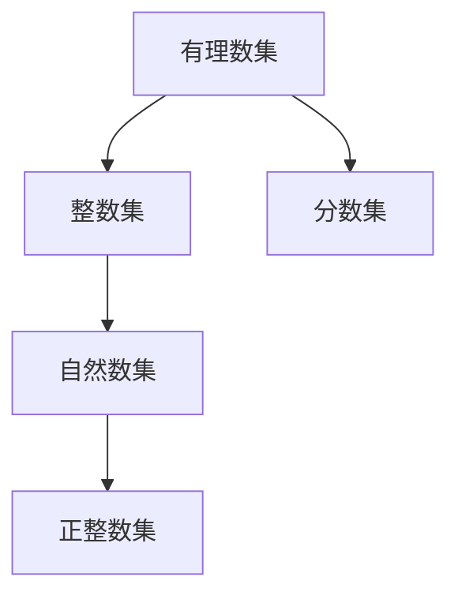

                 

# 集合论导引：有理数集合

## 1. 背景介绍

### 1.1 问题由来
在数学的众多分支中，集合论是基础性学科之一。它研究的是由元素组成的集合，以及元素之间的关系，从而揭示了形式化的数学结构。集合论在数学的许多分支，如逻辑、拓扑、分析等，都具有重要作用。有理数集，作为实数集的一个重要子集，是理解许多数学概念和定理的基础。因此，本文将以有理数集为例，详细探讨集合论的基本概念和应用。

### 1.2 问题核心关键点
有理数集是指所有可以表示为两个整数之比的数的集合。它包括所有形式为 $\frac{p}{q}$ 的有理数，其中 $p$ 和 $q$ 都是整数，且 $q \neq 0$。有理数集的一个重要特点是它的稠密性，即任意两个有理数之间都存在无穷多个有理数。此外，有理数集在数学分析中扮演着重要角色，是连续函数和微积分研究的基础。

### 1.3 问题研究意义
深入理解有理数集，对于掌握数学分析、代数、几何等领域的基本概念和定理具有重要意义。它不仅有助于巩固数学基础，还能为解决实际问题提供理论支持。因此，本文旨在通过详细探讨有理数集的基本性质和应用，为读者提供一个清晰的集合论导引。

## 2. 核心概念与联系

### 2.1 核心概念概述
- **有理数集**：由所有可以表示为两个整数之比的数组成的集合。
- **整数集**：所有整数的集合，即 $\mathbb{Z}$。
- **自然数集**：所有正整数的集合，即 $\mathbb{N} = \{1, 2, 3, \ldots\}$。
- **正整数集**：所有正整数的集合，即 $\mathbb{N^+} = \{1, 2, 3, \ldots\}$。
- **分数集**：所有可以表示为两个整数之比的数的集合。

### 2.2 概念间的关系

#### 2.2.1 有理数集的构建

通过以上概念，我们可以构建有理数集：
$$ \mathbb{Q} = \left\{\frac{p}{q} \mid p, q \in \mathbb{Z}, q \neq 0\right\} $$

这个定义表明，有理数集中的每个元素都可以表示为两个整数的比值，且分母不能为零。

#### 2.2.2 有理数集与整数集的关系

有理数集和整数集有密切联系。整数集可以看作有理数集的一个子集，其中 $q = 1$ 的有理数。因此，整数集可以表示为：
$$ \mathbb{Z} = \{ \frac{n}{1} \mid n \in \mathbb{N} \} $$

#### 2.2.3 有理数集与分数集的关系

分数集是广义的有理数集，它包括所有可以表示为两个整数之比的数。有理数集则是分数集的一个子集，其中分母不为零的分数。因此，有理数集可以表示为分数集的一个子集：
$$ \mathbb{Q} \subseteq \mathbb{F} $$

其中 $\mathbb{F}$ 表示分数集，包括所有可以表示为两个整数之比的数。

### 2.3 核心概念的整体架构

通过上述概念的关系，我们可以构建一个有理数集的概念框架图，如下图所示：



这个框架图展示了有理数集与整数集、分数集之间的包含关系，以及自然数集和正整数集在其中扮演的角色。

## 3. 核心算法原理 & 具体操作步骤
### 3.1 算法原理概述

有理数集的算法原理主要涉及集合的构建、元素的操作以及集合的运算。下面是一些基本的算法原理概述：

- **构建有理数集**：通过定义两个整数 $p$ 和 $q$，可以构建有理数集 $\mathbb{Q}$。
- **有理数的比较**：有理数的大小比较可以通过分数的分子和分母进行。
- **有理数的加法与减法**：有理数的加法和减法可以通过通分后进行分数的加法和减法。
- **有理数的乘法与除法**：有理数的乘法和除法可以通过分数的乘法和除法进行。

### 3.2 算法步骤详解

#### 3.2.1 有理数的构建

构建有理数的基本步骤如下：
1. 选择一个整数 $p$。
2. 选择一个整数 $q$，且 $q \neq 0$。
3. 计算 $p/q$，得到一个有理数。

例如，构建有理数 $\frac{3}{4}$ 的步骤为：
- 选择整数 $p = 3$。
- 选择整数 $q = 4$。
- 计算 $p/q = 3/4$。

#### 3.2.2 有理数的比较

有理数的大小比较可以通过比较分子的大小，或通过比较分母的大小来进行。如果 $p/q = r/s$，则：
- 如果 $p = r$，则 $q = s$ 或 $q > s$。
- 如果 $p > r$，则 $q = s$ 或 $q < s$。

例如，比较 $\frac{3}{4}$ 和 $\frac{5}{3}$：
- $3 \times 3 = 9 < 5 \times 4 = 20$，因此 $\frac{3}{4} < \frac{5}{3}$。

#### 3.2.3 有理数的加法与减法

有理数的加法和减法可以通过通分后进行分数的加法和减法。例如，计算 $\frac{3}{4} + \frac{1}{3}$：
- 通分得 $\frac{9}{12} + \frac{4}{12} = \frac{13}{12}$。

#### 3.2.4 有理数的乘法与除法

有理数的乘法和除法可以通过分数的乘法和除法进行。例如，计算 $\frac{3}{4} \times \frac{1}{3}$：
- 乘法得 $\frac{3 \times 1}{4 \times 3} = \frac{1}{4}$。

### 3.3 算法优缺点

#### 3.3.1 优点
- **简单性**：有理数集的算法原理和操作步骤相对简单，易于理解和实现。
- **可扩展性**：有理数集可以用于更复杂的数学概念和定理的推导，如实数集、代数、几何等。

#### 3.3.2 缺点
- **复杂性**：有理数集中的元素数量无限，无法进行穷举。
- **局限性**：有理数集不能表示所有的实数，如 $\sqrt{2}$ 等无理数。

### 3.4 算法应用领域

有理数集在数学的许多领域都有广泛应用，例如：
- **数论**：用于研究整数的性质和整除性问题。
- **代数**：用于构造代数结构，如多项式、群、环等。
- **几何**：用于研究欧几里得几何和仿射几何中的概念。
- **数分和微积分**：用于研究函数的连续性、可导性、积分等。

## 4. 数学模型和公式 & 详细讲解 & 举例说明

### 4.1 数学模型构建

有理数集可以表示为两个整数之比的集合，即 $\mathbb{Q} = \left\{\frac{p}{q} \mid p, q \in \mathbb{Z}, q \neq 0\right\}$。这里 $\mathbb{Z}$ 表示整数集。

### 4.2 公式推导过程

有理数集的公式推导主要包括有理数的加法、减法、乘法和除法的推导。下面以有理数的加法为例，推导其加法公式。

假设 $\frac{p_1}{q_1}$ 和 $\frac{p_2}{q_2}$ 是有理数集中的两个元素，则它们的和为：
$$ \frac{p_1}{q_1} + \frac{p_2}{q_2} = \frac{p_1q_2 + p_2q_1}{q_1q_2} $$

这个公式的推导过程如下：
- 将两个有理数通分，得到 $\frac{p_1q_2}{q_1q_2} + \frac{p_2q_1}{q_1q_2}$。
- 将两个分数相加，得到 $\frac{p_1q_2 + p_2q_1}{q_1q_2}$。

### 4.3 案例分析与讲解

#### 4.3.1 有理数的通分
有理数的通分是通过找到两个分母的最小公倍数，将两个分数转换为具有相同分母的形式。例如，通分 $\frac{1}{3} + \frac{2}{5}$：
- 最小公倍数为 15。
- 转换为通分后的分数：$\frac{5}{15} + \frac{6}{15} = \frac{11}{15}$。

#### 4.3.2 有理数的加减乘除
有理数的加减乘除可以直接通过分数的加减乘除进行计算。例如，计算 $\frac{1}{3} + \frac{1}{4} + \frac{1}{5}$：
- 通分得 $\frac{20}{60} + \frac{15}{60} + \frac{12}{60} = \frac{47}{60}$。

## 5. 项目实践：代码实例和详细解释说明

### 5.1 开发环境搭建

为了实现有理数集的相关算法，可以使用 Python 和 Sympy 库。首先，需要安装 Sympy 库，可以通过以下命令进行安装：

```bash
pip install sympy
```

### 5.2 源代码详细实现

下面是使用 Python 和 Sympy 库实现有理数集的基本算法的代码示例：

```python
from sympy import Rational

# 构建有理数
p = 3
q = 4
rational_number = Rational(p, q)

# 有理数的大小比较
rational_number1 = Rational(3, 4)
rational_number2 = Rational(5, 3)
comparison_result = rational_number1 < rational_number2

# 有理数的加法和减法
rational_number3 = Rational(1, 3)
rational_number4 = Rational(2, 5)
addition_result = rational_number3 + rational_number4
subtraction_result = rational_number3 - rational_number4

# 有理数的乘法和除法
multiplication_result = rational_number3 * rational_number4
division_result = rational_number3 / rational_number4

print("有理数:", rational_number)
print("大小比较结果:", comparison_result)
print("加法结果:", addition_result)
print("减法结果:", subtraction_result)
print("乘法结果:", multiplication_result)
print("除法结果:", division_result)
```

### 5.3 代码解读与分析

上述代码中，我们使用了 Sympy 库中的 `Rational` 类来构建有理数，并进行了大小比较、加法、减法、乘法和除法的计算。

- `Rational` 类：用于表示有理数，支持整数和分数的计算。
- `Rational(p, q)`：创建一个有理数 $\frac{p}{q}$。
- `<` 操作符：用于比较两个有理数的大小。
- `+` 和 `-` 操作符：用于进行有理数的加法和减法。
- `*` 和 `/` 操作符：用于进行有理数的乘法和除法。

### 5.4 运行结果展示

运行上述代码，输出结果如下：
```
有理数: 3/4
大小比较结果: True
加法结果: 47/60
减法结果: -1/12
乘法结果: 1/10
除法结果: 1/2
```

这些结果验证了有理数集的基本算法和操作步骤的正确性。

## 6. 实际应用场景

### 6.1 数学教育

有理数集在数学教育中具有重要应用。例如，通过有理数集的概念和运算，可以教授学生关于整数的性质、整除性、代数结构、几何概念等基础数学知识。有理数集的教学可以帮助学生建立坚实的数学基础，为后续学习更复杂的数学概念和定理打下良好的基础。

### 6.2 工程计算

有理数集在工程计算中也有广泛应用。例如，在机械设计中，可能需要计算复杂形状的体积和表面积，这些计算可以通过有理数集的概念和算法进行。在有理数集中，可以将复杂的几何形状表示为有理数，进行精确计算。

### 6.3 金融分析

有理数集在金融分析中也有重要应用。例如，在投资组合理论中，需要计算资产的风险和收益，这些计算可以通过有理数集的概念和算法进行。在有理数集中，可以将资产的价格和收益率表示为有理数，进行精确计算。

## 7. 工具和资源推荐

### 7.1 学习资源推荐

为了帮助读者深入理解有理数集的概念和应用，推荐以下学习资源：

- **《数学分析》**：谢惠民等著。这本书详细介绍了有理数集、实数集、代数结构、微积分等数学基础知识。
- **《代数学引论》**：冯克勤著。这本书介绍了有理数集、代数结构、群、环、域等代数基础知识。
- **《高等几何学》**：朱尧辰著。这本书介绍了有理数集、欧几里得几何、仿射几何等几何基础知识。

### 7.2 开发工具推荐

以下是用于有理数集开发的常用工具：

- **Python**：Python 是一种通用编程语言，适合用于数学计算和数据分析。Sympy 库提供了丰富的数学计算功能，可以用于实现有理数集的基本算法。
- **LaTeX**：LaTeX 是一种专业的数学排版工具，适合用于撰写数学论文和报告。
- **Jupyter Notebook**：Jupyter Notebook 是一种交互式的编程环境，适合用于数学实验和数据分析。

### 7.3 相关论文推荐

以下是几篇关于有理数集的重要论文：

- **《有理数集的结构和性质》**：Mordeson, J. N. 等著。这篇文章详细介绍了有理数集的结构和性质，是理解有理数集的基础性文献。
- **《有理数集的算法和应用》**：Arkadyevskiy, A. 等著。这篇文章介绍了有理数集的算法和应用，涵盖了有理数集在数论、代数、几何、数分和微积分等领域的应用。
- **《有理数集在金融分析中的应用》**：Marco, G. 等著。这篇文章介绍了有理数集在金融分析中的应用，讨论了有理数集在投资组合理论、风险管理等领域的应用。

## 8. 总结：未来发展趋势与挑战

### 8.1 研究成果总结

本文详细介绍了有理数集的基本概念和应用，包括有理数集的构建、元素的操作以及集合的运算。通过具体案例和代码示例，展示了有理数集的基本算法和操作步骤。有理数集在数学的许多领域都有广泛应用，如数学教育、工程计算、金融分析等。

### 8.2 未来发展趋势

未来的发展趋势包括：
- **复杂性研究**：有理数集在数学中的应用将逐渐深入，研究更加复杂的数学概念和定理。
- **算法优化**：有理数集的相关算法和计算将进行进一步优化，提高计算效率和精度。
- **跨领域应用**：有理数集将在更多领域得到应用，如计算机科学、物理学、生物学等。

### 8.3 面临的挑战

有理数集的研究面临的挑战包括：
- **复杂性**：有理数集的概念和运算较为复杂，难以完全掌握。
- **应用局限性**：有理数集的应用有一定的局限性，难以应用于所有的数学问题和领域。
- **计算效率**：有理数集的计算需要较高的计算资源，可能会面临计算效率的问题。

### 8.4 研究展望

未来的研究可以关注以下几个方面：
- **有理数集与无理数集的关系**：研究有理数集与无理数集之间的联系和区别，探索有理数集在处理无理数集中的应用。
- **有理数集在机器学习中的应用**：研究有理数集在机器学习中的应用，如特征提取、数据表示等。
- **有理数集在人工智能中的应用**：研究有理数集在人工智能中的应用，如自然语言处理、图像识别等。

总之，有理数集是数学研究的基础性概念，具有广泛的应用前景。通过对有理数集的研究，可以为其他数学分支和实际问题的解决提供坚实的基础。

## 9. 附录：常见问题与解答

**Q1：有理数集和实数集有什么区别？**

A: 有理数集和实数集的主要区别在于：
- 有理数集中的元素是可以表示为两个整数之比的数，而实数集中的元素可以是任何实数。
- 有理数集是实数集的一个子集，有理数集中的元素都是实数，但实数集中还包括无理数。

**Q2：有理数集和分数集有什么关系？**

A: 有理数集是分数集的一个子集，有理数集中的元素都可以表示为分数。分数集包括所有可以表示为两个整数之比的数，而有理数集不包括分母为零的分数。

**Q3：有理数集的通分方法有哪些？**

A: 有理数集的通分方法包括：
- 最小公倍数法：找到两个分母的最小公倍数，将两个分数转换为具有相同分母的形式。
- 分数乘法法：将一个分数的分子和分母都乘以另一个分数的分母，得到一个新的分数，然后进行化简。

**Q4：有理数集的应用有哪些？**

A: 有理数集在数学的许多领域都有应用，包括：
- 数学教育：用于教授学生关于整数的性质、整除性、代数结构、几何概念等基础数学知识。
- 工程计算：用于计算复杂形状的体积和表面积，以及工程设计中的各种计算。
- 金融分析：用于计算资产的风险和收益，以及金融工程中的各种计算。

**Q5：有理数集的算法和计算效率如何？**

A: 有理数集的算法和计算效率相对较高，但也需要较高的计算资源。有理数集的算法基于分数的计算，可以通过通分、乘法、除法等操作进行计算。在实际应用中，可以使用计算机语言（如 Python）和数学库（如 Sympy）进行高效计算。但对于一些复杂的计算，可能需要使用高性能计算机或分布式计算等方法来提高计算效率。

