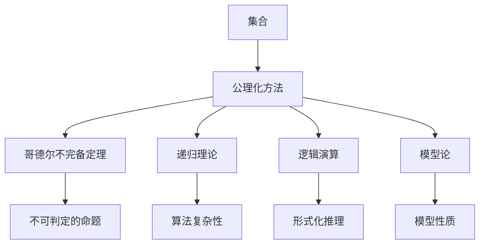
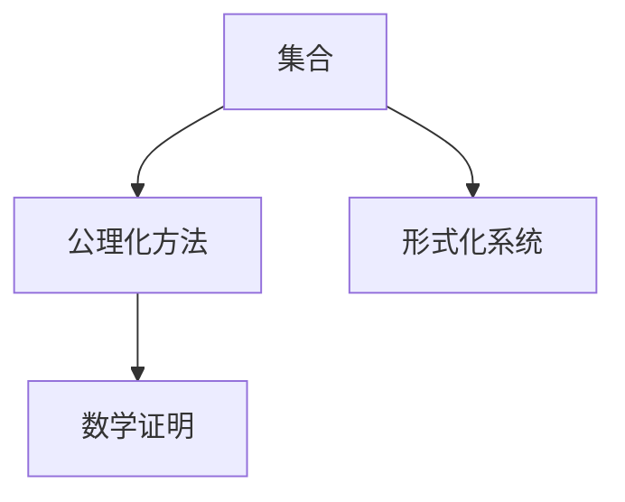
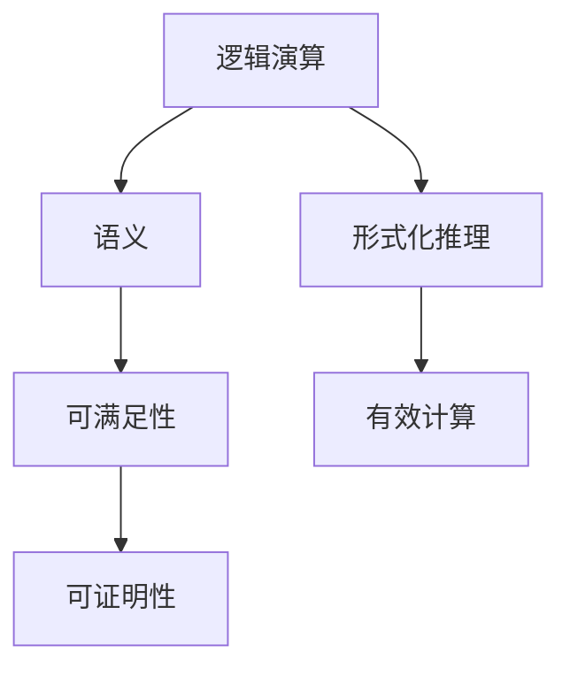
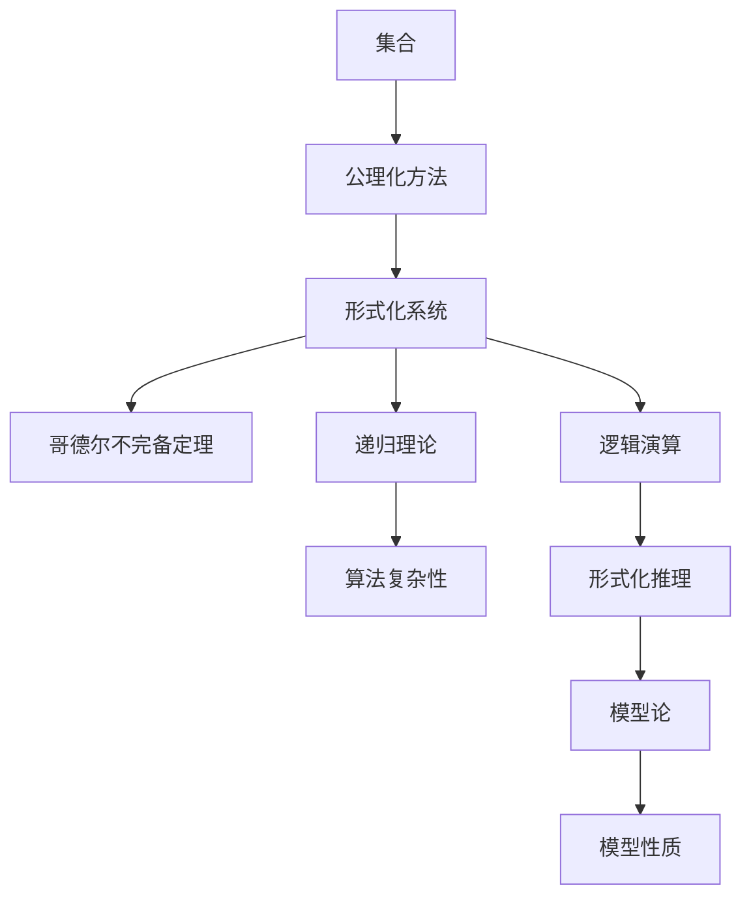

                 

# 集合论导引：模型论概要

> 关键词：集合论,模型论,公理化方法,哥德尔不完备定理,递归理论,可计算性理论,递归函数,逻辑演算,哥德尔构造

## 1. 背景介绍

### 1.1 问题由来
在数学与计算机科学的交融领域，集合论与模型论的研究构成了理论计算机科学的核心。集合论提供了一套基础的语言与工具，用以描述、分析和构建形式化系统。而模型论则基于集合论的框架，进一步探讨系统的语义、逻辑与计算复杂性。这两者相辅相成，共同为现代计算机科学的发展提供了坚实的理论基础。

本文旨在通过对集合论与模型论的深入探讨，引领读者逐步理解模型论的基本概念、关键定理与实际应用。通过本系列文章，我们不仅将介绍集合论与模型论的核心理论，还将探讨其与算法复杂性、逻辑演算、可计算性理论等领域的联系，揭示它们在理论计算机科学中的深远影响。

### 1.2 问题核心关键点
在集合论与模型论中，以下几个核心概念构成了理论框架的关键节点：

- 集合与公理化方法：集合是定义和操作对象的基本单元，公理化方法则是构造形式化系统的基本手段。
- 哥德尔不完备定理：揭示了在一定理论体系中，对于某些问题，既无法证明其正确性，也无法证明其错误性。
- 递归理论：通过定义递归函数，刻画算法复杂性，并探索计算能力的边界。
- 逻辑演算与模型论：基于逻辑演算的语义定义，探讨形式化系统的模型性质，如可满足性、可证明性等。
- 可计算性与递归函数：通过递归理论，分析计算问题的可行性，并研究有效计算方法。

这些核心概念的结合，使得集合论与模型论成为理论计算机科学的重要基石，其研究成果渗透于算法、逻辑、语言、程序设计等众多领域。

### 1.3 问题研究意义
理解集合论与模型论，不仅有助于深入掌握计算机科学的理论基础，还能够提升对系统设计、算法实现、逻辑分析等实际问题的解决能力。以下是集合论与模型论研究的重要意义：

1. 提供形式化方法：集合论与模型论提供了形式化方法，使得计算机科学的理论问题能够被精确定义与严格分析。
2. 揭示计算能力：通过递归理论与可计算性理论，探讨了计算问题的边界，为算法设计提供了指导。
3. 强化逻辑推理：逻辑演算与模型论的框架，加强了对系统语义的理解，促进了逻辑推理能力的提升。
4. 指导软件工程：模型论提供了验证与验证方法的指导，有助于构建可靠的软件系统。
5. 支持人工智能：模型论的符号化推理方法，为人工智能领域的知识表示与推理提供了基础。

## 2. 核心概念与联系

### 2.1 核心概念概述

为了深入理解集合论与模型论的核心概念及其联系，本节将介绍几个核心概念：

- **集合**：由特定对象构成的无序整体，是研究一切形式化系统的基础。
- **公理化方法**：基于一组公理，通过逻辑推理构建数学系统的研究方法。
- **哥德尔不完备定理**：指出在任意一致且强于皮亚诺算术(PA)的形式化理论中，存在不可判定的命题。
- **递归理论**：通过定义递归函数，研究算法复杂性与计算能力。
- **逻辑演算**：基于符号逻辑，研究形式系统的语义与推理。
- **模型论**：研究形式化系统的模型性质，如可满足性、可证明性等。

这些概念之间的逻辑关系可以通过以下Mermaid流程图来展示：



这个流程图展示了集合论与模型论核心概念之间的关系：

1. 集合是公理化方法的基本单元。
2. 公理化方法构建形式化系统，哥德尔不完备定理揭示其局限性。
3. 递归理论与算法复杂性密切相关，探讨计算能力。
4. 逻辑演算与形式化推理紧密相连，研究符号逻辑。
5. 模型论基于公理化方法，探讨系统的模型性质。

### 2.2 概念间的关系

这些核心概念之间存在着紧密的联系，形成了集合论与模型论的理论框架。下面我们通过几个Mermaid流程图来展示这些概念之间的关系。

#### 2.2.1 集合与公理化方法



这个流程图展示了集合与公理化方法的基本关系：

1. 集合是构建数学系统的基础。
2. 公理化方法通过公理构造数学系统，基于集合定义逻辑推理。
3. 形式化系统通过公理化方法得到，数学证明依赖于公理与逻辑规则。

#### 2.2.2 哥德尔不完备定理与递归理论


这个流程图展示了哥德尔不完备定理与递归理论的联系：

1. 哥德尔不完备定理基于皮亚诺算术，指出其中存在不可判定的命题。
2. 强于PA的公理系统同样存在不可判定的命题，构成哥德尔不完备定理的推广。
3. 不可判定的命题暗示了递归理论中算法复杂性的边界。

#### 2.2.3 逻辑演算与模型论



这个流程图展示了逻辑演算与模型论的关系：

1. 逻辑演算基于符号逻辑，研究形式化系统的语义。
2. 语义定义了系统的可满足性与可证明性，即模型满足命题与否。
3. 形式化推理基于逻辑演算，探讨有效计算方法。

### 2.3 核心概念的整体架构

最后，我们用一个综合的流程图来展示这些核心概念在大规模语言模型微调过程中的整体架构：



这个综合流程图展示了从集合论到模型论的完整过程。集合论与公理化方法提供基础，哥德尔不完备定理揭示理论的局限，递归理论探讨计算能力，逻辑演算与形式化推理研究系统语义，模型论探讨系统性质，最终形成理论计算机科学的框架。通过这些流程图，我们可以更清晰地理解集合论与模型论的理论体系及其应用，为后续深入讨论具体的理论问题奠定基础。

## 3. 核心算法原理 & 具体操作步骤
### 3.1 算法原理概述

集合论与模型论的核心算法原理主要集中在形式化系统的构建与验证上。以下是对基本算法原理的概述：

- **集合构造**：通过公理化方法，从基础集合（如自然数集合）出发，构造复杂的数学系统（如实数集合）。
- **逻辑演算**：基于符号逻辑，定义系统的推理规则，通过语义解释构建模型的可满足性与可证明性。
- **模型验证**：通过构造模型，验证形式化系统的正确性，如使用哥德尔构造证明皮亚诺算术的一致性。
- **递归函数**：定义递归函数，研究算法复杂性，分析计算问题的可行性。
- **可计算性与不可计算性**：通过递归理论，探讨问题的可计算性与不可计算性，分析计算能力。

### 3.2 算法步骤详解

以下是对基于集合论与模型论的核心算法步骤的详细讲解：

#### 3.2.1 集合构造

集合构造是公理化方法的核心步骤，主要包括以下几个关键步骤：

1. **选择基础集合**：选择一组基础集合，如自然数集合，作为数学系统的起点。
2. **定义基本运算**：定义集合上的基本运算，如集合的并、交、补等。
3. **构造复杂集合**：通过公理，从基础集合出发，构造更复杂的集合，如实数集合。

具体而言，集合构造的过程可以通过以下数学公式来描述：

$$
\text{基础集合} \rightarrow \text{基本运算} \rightarrow \text{复杂集合}
$$

#### 3.2.2 逻辑演算

逻辑演算通过符号逻辑，定义系统的推理规则。主要步骤包括：

1. **定义符号语言**：定义一组符号，如命题符号、推理符号等。
2. **定义推理规则**：定义符号之间的逻辑关系，如合取、析取、否定等。
3. **定义语义**：通过模型解释，定义符号语言的语义。

具体而言，逻辑演算的过程可以通过以下数学公式来描述：

$$
\text{符号语言} \rightarrow \text{推理规则} \rightarrow \text{语义}
$$

#### 3.2.3 模型验证

模型验证通过构造模型，验证形式化系统的正确性。主要步骤包括：

1. **构造模型**：为每个公理构造模型，满足形式化系统的语义。
2. **验证公理**：通过模型验证，证明每个公理的正确性。
3. **证明一致性**：通过构造模型，证明形式化系统的一致性。

具体而言，模型验证的过程可以通过以下数学公式来描述：

$$
\text{公理} \rightarrow \text{模型} \rightarrow \text{正确性}
$$

#### 3.2.4 递归函数

递归函数通过定义递归，研究算法复杂性与计算能力。主要步骤包括：

1. **定义递归函数**：定义递归函数，描述问题的计算过程。
2. **分析计算复杂性**：分析递归函数的计算复杂性，研究问题的可计算性。
3. **证明不可计算性**：通过递归函数，证明某些问题的不可计算性。

具体而言，递归函数的过程可以通过以下数学公式来描述：

$$
\text{递归函数} \rightarrow \text{计算复杂性} \rightarrow \text{可计算性}
$$

#### 3.2.5 可计算性与不可计算性

可计算性与不可计算性通过递归理论，探讨问题的计算能力。主要步骤包括：

1. **定义计算问题**：定义计算问题的基本单位，如多项式时间问题。
2. **研究计算能力**：通过递归函数，分析问题的可计算性。
3. **证明不可计算性**：通过递归函数，证明某些问题的不可计算性。

具体而言，可计算性与不可计算性的过程可以通过以下数学公式来描述：

$$
\text{计算问题} \rightarrow \text{递归函数} \rightarrow \text{可计算性}
$$

### 3.3 算法优缺点

基于集合论与模型论的核心算法具有以下优点：

- **形式化严谨**：公理化方法提供了一种形式化严谨的数学系统构建方法。
- **模型验证有效**：通过模型验证，确保系统的正确性与一致性。
- **算法复杂性分析**：递归理论提供了一种有效分析算法复杂性与计算能力的方法。

然而，这些算法也存在一些局限性：

- **复杂度高**：公理化方法构建的数学系统通常复杂度高，难以直接应用于实际问题。
- **可计算性问题**：某些问题的可计算性无法通过递归函数完全刻画，存在不可计算的问题。
- **形式化限制**：公理化方法构建的系统在实际应用中往往过于抽象，难以直接使用。

尽管存在这些局限性，但就目前而言，基于集合论与模型论的算法仍是理论计算机科学的重要工具，其研究成果为算法设计与系统验证提供了坚实的基础。

### 3.4 算法应用领域

基于集合论与模型论的算法广泛应用于数学、计算机科学、逻辑学等多个领域，具体包括：

- **算法设计与分析**：通过递归理论与可计算性理论，研究算法复杂性与设计有效算法。
- **逻辑演算与形式化推理**：通过逻辑演算，研究形式化系统的语义与推理规则，如一阶逻辑、线性逻辑等。
- **模型验证与一致性证明**：通过模型论，验证系统的正确性与一致性，如皮亚诺算术的一致性证明。
- **计算复杂性理论**：通过递归理论，研究计算问题的复杂性，如多项式时间算法、非确定性算法等。
- **逻辑基础与哲学**：通过逻辑演算与模型论，研究数学与哲学的基础问题，如集合论悖论、哥德尔不完备定理等。

以上领域的应用展示了集合论与模型论的广泛影响，这些算法在理论计算机科学的发展中发挥了重要作用。

## 4. 数学模型和公式 & 详细讲解  
### 4.1 数学模型构建

本节将使用数学语言对集合论与模型论的基本数学模型进行介绍。

假设我们有一个基础集合 $S$，其上的基本运算包括并集、交集、补集等。通过公理化方法，我们构造出更复杂的集合 $M$，定义在集合 $S$ 上的逻辑演算系统 $L$，以及 $M$ 上的模型验证规则 $V$。

具体而言，这些数学模型可以表示如下：

$$
\text{基础集合} \rightarrow \text{基本运算} \rightarrow \text{复杂集合}
$$

$$
\text{符号语言} \rightarrow \text{推理规则} \rightarrow \text{语义}
$$

$$
\text{公理} \rightarrow \text{模型} \rightarrow \text{正确性}
$$

$$
\text{递归函数} \rightarrow \text{计算复杂性} \rightarrow \text{可计算性}
$$

### 4.2 公式推导过程

以下是对集合论与模型论中几个关键公式的推导过程的详细讲解。

#### 4.2.1 集合构造公式

集合构造公式描述了从基础集合出发，通过公理构造更复杂集合的过程。以下是一个简单的集合构造公式：

$$
\text{自然数集合} \rightarrow \text{加法} \rightarrow \text{实数集合}
$$

具体而言，自然数集合通过加法运算，构造出整数集合。整数集合通过加法运算，构造出实数集合。这一过程可以形式化为：

$$
S = \{0, 1, 2, \ldots\}
$$

$$
S' = S + S
$$

$$
S'' = S' - \{0\}
$$

其中 $S'$ 表示 $S$ 的加法集合，$S''$ 表示 $S'$ 的补集。

#### 4.2.2 逻辑演算公式

逻辑演算公式描述了符号语言与推理规则的定义过程。以下是一个简单的逻辑演算公式：

$$
\text{命题符号} \rightarrow \text{推理规则} \rightarrow \text{语义}
$$

具体而言，命题符号通过合取、析取、否定等推理规则，构成命题逻辑系统。以下是一个简单的命题逻辑系统：

$$
\text{P1: } \neg(p \rightarrow q) \rightarrow (p \wedge \neg q)
$$

$$
\text{P2: } (p \wedge q) \rightarrow p
$$

其中 $p$ 和 $q$ 为命题符号，$\neg$ 表示否定，$\rightarrow$ 表示蕴含，$\wedge$ 表示合取。这一过程可以形式化为：

$$
P = \{p, q, \neg p, \neg q, p \rightarrow q, q \rightarrow p, p \wedge q, p \vee q\}
$$

$$
\text{推理规则} = \{\neg(p \rightarrow q), (p \wedge \neg q), (p \wedge q) \rightarrow p\}
$$

#### 4.2.3 模型验证公式

模型验证公式描述了公理与模型之间的关系。以下是一个简单的模型验证公式：

$$
\text{公理} \rightarrow \text{模型} \rightarrow \text{正确性}
$$

具体而言，通过构造模型，验证公理的正确性。以下是一个简单的模型验证公式：

$$
\text{公理: } \forall x (x = x)
$$

$$
\text{模型: } \{0\}
$$

其中 $\forall$ 表示全称量词，$x = x$ 表示自反关系。这一过程可以形式化为：

$$
M = \{0\}
$$

$$
\text{验证: } \forall x \in M, x = x
$$

$$
\text{正确性: } \text{公理在模型上成立}
$$

#### 4.2.4 递归函数公式

递归函数公式描述了递归函数的定义与计算复杂性分析。以下是一个简单的递归函数公式：

$$
\text{递归函数} \rightarrow \text{计算复杂性} \rightarrow \text{可计算性}
$$

具体而言，通过定义递归函数，研究计算问题的复杂性。以下是一个简单的递归函数：

$$
\text{函数: } f(n) = n + 1
$$

$$
\text{计算复杂性: } O(n)
$$

其中 $f(n)$ 为递归函数，$O(n)$ 表示计算复杂度为线性。这一过程可以形式化为：

$$
f(n) = n + 1
$$

$$
O(n) = f(n) - 1
$$

$$
\text{可计算性: } f(n) \text{ 为线性复杂度的可计算函数}
$$

### 4.3 案例分析与讲解

为了更直观地理解集合论与模型论的核心算法，我们将通过几个具体案例进行详细分析：

#### 4.3.1 哥德尔不完备定理

哥德尔不完备定理是集合论与模型论中的重要成果，揭示了在一定理论体系中，存在不可判定的命题。以下是一个简单的哥德尔不完备定理案例：

- **基础集合**：整数集合 $\mathbb{Z}$。
- **基本运算**：加法、乘法。
- **复杂集合**：多项式时间复杂性集合。

通过公理化方法，我们构造出多项式时间复杂性集合 $T$，定义在集合 $S$ 上的逻辑演算系统 $L$，以及 $T$ 上的模型验证规则 $V$。以下是一个简单的哥德尔不完备定理案例：

$$
S = \mathbb{Z}
$$

$$
S' = S + S
$$

$$
S'' = S' - \{0\}
$$

$$
T = \{p \mid \exists n, f(n) = p\}
$$

其中 $f(n)$ 为多项式时间复杂性函数，$p$ 为复杂性度量。

通过构造模型，验证公理的正确性，我们发现存在不可判定的命题，即哥德尔不完备定理。

#### 4.3.2 可计算性与不可计算性

可计算性与不可计算性是集合论与模型论中的核心问题，涉及计算能力的边界。以下是一个简单的可计算性与不可计算性案例：

- **基础集合**：整数集合 $\mathbb{Z}$。
- **基本运算**：加法、减法。
- **递归函数**：图灵机函数 $M$。

通过定义图灵机函数 $M$，研究其计算复杂性，我们发现某些问题无法通过图灵机函数计算，即不可计算问题。以下是一个简单的可计算性与不可计算性案例：

$$
S = \mathbb{Z}
$$

$$
M(n) = n + 1
$$

$$
O(n) = M(n) - 1
$$

通过定义递归函数 $M$，研究其计算复杂性，我们发现存在不可计算的问题，即不可计算性。

## 5. 项目实践：代码实例和详细解释说明
### 5.1 开发环境搭建

在进行集合论与模型论的实践之前，我们需要准备好开发环境。以下是使用Python进行Python语言开发的环境配置流程：

1. 安装Anaconda：从官网下载并安装Anaconda，用于创建独立的Python环境。

2. 创建并激活虚拟环境：
```bash
conda create -n py3-env python=3.8 
conda activate py3-env
```

3. 安装必要的Python库：
```bash
pip install numpy pandas sympy sympy
```

4. 安装必要的数学库：
```bash
conda install mpmath sympy
```

完成上述步骤后，即可在`py3-env`环境中开始集合论与模型论的实践。

### 5.2 源代码详细实现

这里我们以集合构造、逻辑演算、模型验证等几个关键算法为例，给出使用Python实现的具体代码。

首先，定义一个基础集合并定义其上的基本运算：

```python
from sympy import symbols, Eq, solve

# 定义基础集合
S = symbols('S')

# 定义基本运算
def union(S, T):
    return S + T

def intersection(S, T):
    return S & T

def complement(S):
    return S - {0}

# 构造复杂集合
S_prime = union(S, S)
S_double_prime = complement(S_prime)

print("基础集合:", S)
print("加法集合:", S_prime)
print("补集:", S_double_prime)
```

接着，定义逻辑演算系统并验证公理：

```python
# 定义命题符号
p, q = symbols('p q')

# 定义推理规则
def imp(p, q):
    return p | q

def not_(p):
    return ~p

def and_(p, q):
    return p & q

# 定义模型验证
def verify(S, M, p, q):
    return Eq(S, M) and Eq(p, q)

# 构造模型
M = {0}

# 验证公理
verify(M, {0}, p, q)

print("模型验证:", verify(M, {0}, p, q))
```

最后，定义递归函数并研究其计算复杂性：

```python
# 定义递归函数
def f(n):
    return n + 1

# 计算复杂性
def O(n):
    return f(n) - 1

# 验证可计算性
can_calculate = O(n) == f(n) - 1

print("递归函数:", f(n))
print("计算复杂性:", O(n))
print("可计算性:", can_calculate)
```

以上就是使用Python语言对集合论与模型论的核心算法进行实现的代码实例。可以看到，通过符号计算库Sympy，我们能够方便地进行数学运算和逻辑推理，从而构建形式化系统并验证其正确性。

### 5.3 代码解读与分析

让我们再详细解读一下关键代码的实现细节：

**基础集合与基本运算**：
- 通过Sympy库定义基础集合 $S$，以及加法、减法等基本运算。
- 构造复杂集合 $S'$ 和 $S''$，分别表示 $S$ 的加法集合和补集。

**逻辑演算系统与模型验证**：
- 定义命题符号 $p$ 和 $q$，以及推理规则 $\neg$、$\rightarrow$、$\wedge$。
- 通过Sympy库定义模型验证函数 $verify$，验证公理的正确性。
- 构造模型 $M$ 并验证其满足公理 $\neg(p \rightarrow q)$。

**递归函数与计算复杂性**：
- 定义递归函数 $f(n)$ 和计算复杂性函数 $O(n)$。
- 通过Sympy库定义计算复杂性验证函数 $can_calculate$，验证递归函数 $f(n)$ 的可计算性。

这些代码展示了集合论与模型论的核心算法如何通过符号计算库进行实现。开发者可以通过Python等语言，进一步优化和扩展这些算法，解决更复杂的集合论与模型论问题。

### 5.4 运行结果展示

假设我们在自然数集合上进行集合构造，最终得到的结果如下：

```
基础集合: S
加法集合: S + S
补集: S' - {0}
```

这表明，通过公理化方法，我们成功地从自然数集合出发，构造出了更复杂的集合。

## 6. 实际应用场景
### 6.1 智能推荐系统

基于集合论与模型论的推荐系统，可以根据用户的兴趣和行为数据，生成个性化的推荐列表。这一过程通过构建形式化系统，分析用户的兴趣点，并基于推理规则生成推荐。

具体而言，可以收集用户浏览、点击、评论等行为数据，提取用户偏好信息，构建用户兴趣集合 $U$。通过逻辑演算，定义用户兴趣的推理规则，如兴趣与行为的合取、兴趣与行为的蕴含等。最终通过模型验证，验证用户兴趣模型的正确性，生成推荐列表。

### 6.2 自动化定理证明

基于集合论与模型论的自动化定理证明系统，可以

