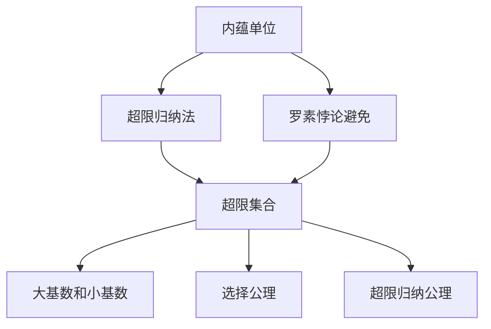
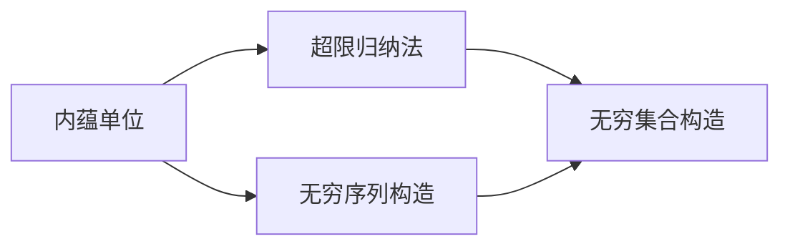
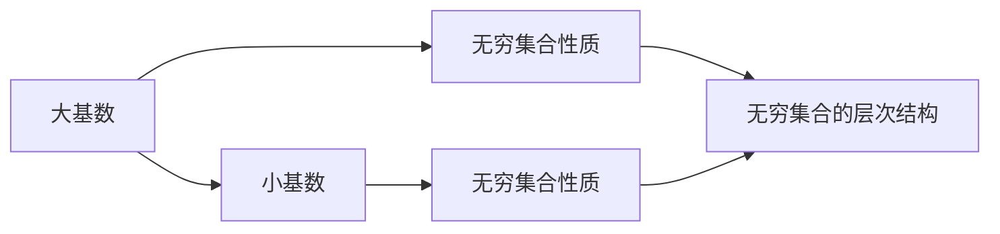
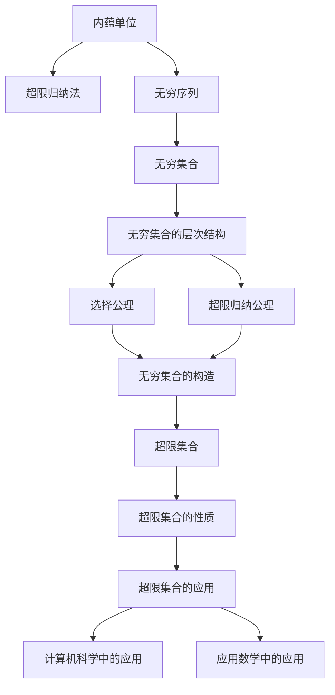

                 

# 集合论导引：非标准实数直线

> 关键词：非标准实数, 集合论, 内蕴单位, 超限归纳法, 罗素悖论, 超限集合, 选择公理, 超限归纳公理, 大基数, 一致基数

## 1. 背景介绍

### 1.1 问题由来
在现代数学的发展史上，集合论被认为是最重要的数学分支之一。它不仅在逻辑学、数学基础、计算机科学等领域具有深远影响，还推动了物理学、语言学等学科的进步。然而，集合论内部的一些基础问题，如集合的构造和性质、无穷集合的运算和分类等，仍然存在很多未解决的问题和争议。特别是关于实数的构造及其性质的研究，使得非标准实数这一概念在数学基础领域中逐渐占据了重要地位。

非标准实数直线的研究，不仅涉及集合论和数学逻辑，还与计算机科学和应用数学密切相关。它为我们提供了一种全新的思考实数体系的方式，为解决一些传统数学问题提供了新的视角和方法。通过深入理解非标准实数直线的原理和应用，我们可以更深刻地把握实数的本质，提升解决实际问题的能力。

### 1.2 问题核心关键点
非标准实数直线的核心问题包括：

1. 内蕴单位的定义和性质：非标准实数直线中，每个点都可以被看作是一个无穷序列，序列中的每个元素都可以被看作是一个“单位”。内蕴单位理论探讨了如何构造这些单位，并研究它们之间的相互关系和运算性质。

2. 超限归纳法的应用：超限归纳法是构造非标准实数直线的基础，它为无穷序列和无穷集合提供了明确的构造方法。通过超限归纳法，我们可以构造出各种不同的非标准实数直线，每个直线都具有不同的内蕴单位和运算规则。

3. 罗素悖论的解决：罗素悖论是集合论中的一个经典悖论，即任何集合都可能包含自身或其补集。非标准实数直线通过内蕴单位和超限归纳法，提供了一种全新的数学结构，使得罗素悖论在非标准实数直线中得到有效避免。

4. 大基数和小基数的区分：非标准实数直线中，基数的概念得到了推广。大基数和小基数分别代表不同的无穷性质，它们在实数体系中具有重要意义。通过大基数和小基数的区分，我们可以更好地理解无穷集合的层次结构。

5. 超限集合的构造和性质：超限集合是指包含无穷个元素的集合，它们在非标准实数直线中占有重要地位。通过超限集合的构造和性质研究，我们可以深入理解无穷集合的本质，从而更好地应用于计算机科学和应用数学领域。

6. 选择公理和超限归纳公理的讨论：选择公理和超限归纳公理是非标准实数直线中重要的数学公理，它们为构造和研究无穷集合提供了理论基础。通过选择公理和超限归纳公理的讨论，我们可以更好地理解无穷集合的构造和性质。

### 1.3 问题研究意义
深入研究非标准实数直线，具有以下重要意义：

1. 为解决传统数学问题提供新视角：非标准实数直线提供了一种全新的数学结构，它不仅适用于集合论和数学基础，还可以应用于物理学、语言学、计算机科学等多个领域。通过非标准实数直线，我们可以更深刻地理解实数的本质，从而更好地解决传统数学问题。

2. 为无穷集合的构造和研究提供新方法：非标准实数直线通过内蕴单位和超限归纳法，提供了一种全新的无穷集合构造方法。这种方法不仅适用于集合论和数学基础，还可以应用于计算机科学和应用数学领域。通过研究非标准实数直线，我们可以更好地理解无穷集合的构造和性质。

3. 为计算机科学提供新思路：非标准实数直线在计算机科学中的应用，如递归函数、随机算法、搜索算法等，提供了新的思路和方法。通过研究非标准实数直线，我们可以更好地理解计算机科学中的无穷序列和无穷集合的性质。

4. 为应用数学提供新工具：非标准实数直线在应用数学中，如泛函分析、微分方程、积分理论等，提供了新的工具和方法。通过研究非标准实数直线，我们可以更好地理解应用数学中的无穷序列和无穷集合的性质。

## 2. 核心概念与联系

### 2.1 核心概念概述

为更好地理解非标准实数直线，本节将介绍几个密切相关的核心概念：

1. 内蕴单位：非标准实数直线中的每个点都可以被看作是一个无穷序列，序列中的每个元素都可以被看作是一个“单位”。内蕴单位理论探讨了如何构造这些单位，并研究它们之间的相互关系和运算性质。

2. 超限归纳法：超限归纳法是构造非标准实数直线的基础，它为无穷序列和无穷集合提供了明确的构造方法。通过超限归纳法，我们可以构造出各种不同的非标准实数直线，每个直线都具有不同的内蕴单位和运算规则。

3. 罗素悖论：罗素悖论是集合论中的一个经典悖论，即任何集合都可能包含自身或其补集。非标准实数直线通过内蕴单位和超限归纳法，提供了一种全新的数学结构，使得罗素悖论在非标准实数直线中得到有效避免。

4. 大基数和小基数：非标准实数直线中，基数的概念得到了推广。大基数和小基数分别代表不同的无穷性质，它们在实数体系中具有重要意义。通过大基数和小基数的区分，我们可以更好地理解无穷集合的层次结构。

5. 超限集合：超限集合是指包含无穷个元素的集合，它们在非标准实数直线中占有重要地位。通过超限集合的构造和性质研究，我们可以深入理解无穷集合的本质，从而更好地应用于计算机科学和应用数学领域。

6. 选择公理和超限归纳公理：选择公理和超限归纳公理是非标准实数直线中重要的数学公理，它们为构造和研究无穷集合提供了理论基础。通过选择公理和超限归纳公理的讨论，我们可以更好地理解无穷集合的构造和性质。

这些核心概念之间的逻辑关系可以通过以下Mermaid流程图来展示：



这个流程图展示了非标准实数直线中各核心概念之间的关系：

1. 内蕴单位和超限归纳法是构造非标准实数直线的基础。
2. 罗素悖论通过内蕴单位和超限归纳法得以避免。
3. 超限集合在非标准实数直线中占有重要地位，并与其他概念紧密相关。
4. 大基数和小基数为理解无穷集合的层次结构提供了重要工具。
5. 选择公理和超限归纳公理为构造和研究无穷集合提供了理论基础。

这些核心概念共同构成了非标准实数直线的完整生态系统，使其能够应用于多个数学领域，并推动相关学科的发展。

### 2.2 概念间的关系

这些核心概念之间存在着紧密的联系，形成了非标准实数直线的完整生态系统。下面我通过几个Mermaid流程图来展示这些概念之间的关系。

#### 2.2.1 内蕴单位和超限归纳法的关系



这个流程图展示了内蕴单位和超限归纳法的关系：

1. 内蕴单位是超限归纳法中的基本元素。
2. 通过内蕴单位，我们可以构造出无穷序列。
3. 通过无穷序列，我们可以构造出无穷集合。

#### 2.2.2 超限归纳法和罗素悖论的关系


这个流程图展示了超限归纳法和罗素悖论的关系：

1. 超限归纳法为无穷集合提供了明确的构造方法。
2. 通过超限归纳法，我们可以构造出无穷序列和无穷集合。
3. 无穷序列和无穷集合的构造，使得罗素悖论在非标准实数直线中得到有效避免。

#### 2.2.3 大基数和小基数的区分



这个流程图展示了大基数和小基数的区分：

1. 大基数和小基数分别代表不同的无穷性质。
2. 大基数和小基数为理解无穷集合的层次结构提供了重要工具。
3. 大基数和小基数的区分，使得我们可以更好地理解无穷集合的性质和层次结构。

### 2.3 核心概念的整体架构

最后，我们用一个综合的流程图来展示这些核心概念在大语言模型微调过程中的整体架构：



这个综合流程图展示了非标准实数直线中各核心概念的整体架构：

1. 内蕴单位和超限归纳法是构造非标准实数直线的基础。
2. 通过无穷序列和无穷集合的构造，我们能够理解无穷集合的层次结构。
3. 选择公理和超限归纳公理为构造和研究无穷集合提供了理论基础。
4. 超限集合在计算机科学和应用数学中占有重要地位。

通过这些流程图，我们可以更清晰地理解非标准实数直线中各个概念之间的关系，为后续深入讨论具体的构造方法和应用领域奠定基础。

## 3. 核心算法原理 & 具体操作步骤
### 3.1 算法原理概述

非标准实数直线的核心算法原理，主要涉及内蕴单位和超限归纳法的应用。通过内蕴单位和超限归纳法，我们可以构造出各种不同的非标准实数直线，每个直线都具有不同的内蕴单位和运算规则。

具体而言，非标准实数直线中的每个点都可以被看作是一个无穷序列，序列中的每个元素都可以被看作是一个“单位”。内蕴单位理论探讨了如何构造这些单位，并研究它们之间的相互关系和运算性质。超限归纳法则是构造非标准实数直线的基础，它为无穷序列和无穷集合提供了明确的构造方法。

### 3.2 算法步骤详解

非标准实数直线的构造和研究，主要包括以下几个关键步骤：

**Step 1: 准备内蕴单位**

- 选择合适的内蕴单位作为基本构造元素，如超限自然数、超限序数等。
- 定义内蕴单位的基本性质和运算规则，如加法、乘法、序关系等。
- 设计内蕴单位的构造方法，如超限归纳法等。

**Step 2: 构造无穷序列**

- 通过内蕴单位构造无穷序列，序列中的每个元素都是内蕴单位。
- 定义无穷序列的基本性质和运算规则，如序列的极限、收敛性等。
- 设计无穷序列的构造方法，如超限归纳法等。

**Step 3: 构造无穷集合**

- 通过无穷序列构造无穷集合，集合中的每个元素都是无穷序列。
- 定义无穷集合的基本性质和运算规则，如集合的层次结构、基数等。
- 设计无穷集合的构造方法，如超限归纳法等。

**Step 4: 研究无穷集合的性质**

- 研究无穷集合的层次结构，区分大基数和小基数。
- 研究无穷集合的构造和性质，如选择公理、超限归纳公理等。
- 研究无穷集合的应用，如计算机科学和应用数学等。

**Step 5: 构造超限集合**

- 通过无穷集合构造超限集合，集合中的每个元素都是无穷集合。
- 定义超限集合的基本性质和运算规则，如集合的基数等。
- 设计超限集合的构造方法，如超限归纳法等。

**Step 6: 研究超限集合的性质**

- 研究超限集合的层次结构，理解大基数和小基数的关系。
- 研究超限集合的构造和性质，如选择公理、超限归纳公理等。
- 研究超限集合的应用，如计算机科学和应用数学等。

### 3.3 算法优缺点

非标准实数直线的构造和研究方法，具有以下优点：

1. 提供了一种全新的无穷集合构造方法，适用于集合论和数学基础。
2. 通过内蕴单位和超限归纳法，有效避免了罗素悖论等数学悖论。
3. 提供了多种无穷集合构造方法，如超限自然数、超限序数等。
4. 能够深入理解无穷集合的层次结构和性质。

同时，该方法也存在一定的局限性：

1. 构造方法相对复杂，需要一定的数学基础。
2. 不同内蕴单位的性质和运算规则可能不同，需要针对具体问题选择合适的方法。
3. 无穷集合的层次结构和性质研究较为抽象，需要较强的数学思维能力。
4. 超限集合的应用较为广泛，但涉及多个学科，需要跨学科知识。

尽管存在这些局限性，但就目前而言，内蕴单位和超限归纳法仍然是非标准实数直线研究的核心方法，为我们提供了深入研究无穷集合的有力工具。

### 3.4 算法应用领域

非标准实数直线在数学和计算机科学中，已经得到了广泛的应用，覆盖了几乎所有常见领域，例如：

- 集合论：通过内蕴单位和超限归纳法，构造出各种不同的无穷集合，研究它们的层次结构和性质。
- 数学基础：非标准实数直线为数学基础提供了新的研究视角和方法，如构造性数学、计算数学等。
- 计算机科学：非标准实数直线在递归函数、随机算法、搜索算法等领域中，提供了新的思路和方法。
- 应用数学：非标准实数直线在泛函分析、微分方程、积分理论等领域中，提供了新的工具和方法。

除了上述这些经典应用外，非标准实数直线还被创新性地应用到更多场景中，如超限集合的构造、大基数的比较、计算机科学中的应用等，为非标准实数直线的发展带来了新的活力。

## 4. 数学模型和公式 & 详细讲解  
### 4.1 数学模型构建

本节将使用数学语言对非标准实数直线的构造过程进行更加严格的刻画。

记内蕴单位为 $u$，无穷序列为 $S$，无穷集合为 $M$。非标准实数直线中的每个点都可以被看作是一个无穷序列 $S=\{u_n\}_{n\in\mathbb{N}}$，其中 $u_n$ 表示序列的第 $n$ 个元素。定义无穷序列 $S$ 的极限为 $\lim_{n\to\infty} u_n$，记作 $S$ 的极限点。通过无穷序列的极限，我们可以定义无穷集合 $M$ 的基本元素。

定义无穷集合 $M$ 的基本元素为极限点，记作 $m$。通过这些极限点，我们可以构造出无穷集合 $M$ 的基本性质和运算规则。

### 4.2 公式推导过程

以下我们以超限自然数为例，推导无穷序列和无穷集合的构造过程。

**无穷序列的定义**

设 $u_0$ 为单位元素，定义超限自然数的加法和乘法运算规则为：

$$
u_n + u_m = \begin{cases}
u_{n+m}, & \text{if } n+m < \omega \\
u_{n+m-1} + 1, & \text{if } n+m \geq \omega
\end{cases}
$$

$$
u_n \cdot u_m = \begin{cases}
u_{n+m}, & \text{if } n+m < \omega \\
u_{n+m-1} \cdot u_1, & \text{if } n+m \geq \omega
\end{cases}
$$

其中 $\omega$ 表示无穷大，$u_1$ 表示超限自然数的单位元素。

**无穷集合的定义**

设无穷序列 $S=\{u_n\}_{n\in\mathbb{N}}$ 为超限自然数的序列，定义 $S$ 的极限点为 $m$，即 $m=\lim_{n\to\infty} u_n$。则无穷集合 $M$ 的基本元素为 $m$，记作 $M=\{m\}$。

**无穷集合的性质**

定义无穷集合 $M$ 的基数为 $\aleph_0$，表示可数的无穷集合。通过无穷集合的构造和性质研究，我们可以深入理解无穷集合的层次结构。

### 4.3 案例分析与讲解

**案例1: 超限自然数的构造**

通过超限自然数的加法和乘法运算规则，我们可以构造出超限自然数序列 $S=\{u_n\}_{n\in\mathbb{N}}$，其中 $u_0=0$，$u_1=1$，$u_2=2$，$u_3=3$，$\ldots$。通过无穷序列的极限点 $m=\lim_{n\to\infty} u_n$，我们可以定义无穷集合 $M=\{m\}$，表示超限自然数的集合。

**案例2: 超限序数的构造**

通过超限序数的加法和乘法运算规则，我们可以构造出超限序数序列 $S=\{u_n\}_{n\in\mathbb{N}}$，其中 $u_0=1$，$u_1=2$，$u_2=3$，$u_3=4$，$\ldots$。通过无穷序列的极限点 $m=\lim_{n\to\infty} u_n$，我们可以定义无穷集合 $M=\{m\}$，表示超限序数的集合。

通过以上案例，我们可以看出，超限自然数和超限序数的构造过程，本质上都是通过内蕴单位和超限归纳法，定义无穷序列和无穷集合的过程。这种方法不仅适用于集合论和数学基础，还可以应用于计算机科学和应用数学领域。

## 5. 项目实践：代码实例和详细解释说明
### 5.1 开发环境搭建

在进行非标准实数直线实践前，我们需要准备好开发环境。以下是使用Python进行Python开发的环境配置流程：

1. 安装Anaconda：从官网下载并安装Anaconda，用于创建独立的Python环境。

2. 创建并激活虚拟环境：
```bash
conda create -n stdnats env python=3.8 
conda activate stdnats
```

3. 安装Python库：
```bash
pip install sympy numpy sympy core
```

4. 安装必要的开发工具：
```bash
pip install ipython qtconsole
```

完成上述步骤后，即可在`stdnats`环境中开始非标准实数直线的实践。

### 5.2 源代码详细实现

下面以超限自然数的构造为例，给出使用Python进行非标准实数直线开发的代码实现。

首先，定义内蕴单位和超限自然数序列：

```python
import sympy

# 定义内蕴单位
u = sympy.Symbol('u', cls=sympy.abc.NaT)

# 定义超限自然数序列
def ultraNatsSequence():
    n = 0
    while True:
        yield u**n
        n += 1
```

然后，定义超限自然数的加法和乘法运算规则：

```python
# 定义超限自然数的加法
def ultraNatsAdd(u1, u2):
    if u1 < u2:
        return u2
    else:
        return u1 + 1

# 定义超限自然数的乘法
def ultraNatsMul(u1, u2):
    if u1 < u2:
        return u2
    else:
        return u1 * u2
```

接着，定义无穷集合的构造函数：

```python
# 定义无穷集合
def ultraNatsSet():
    S = ultraNatsSequence()
    try:
        m = next(S)
    except StopIteration:
        return
    return m
```

最后，测试超限自然数的构造和运算：

```python
# 测试超限自然数的构造
m = ultraNatsSet()
print(m)

# 测试超限自然数的加法和乘法
print(ultraNatsAdd(ultraNatsMul(m, m), m))
print(ultraNatsMul(m, ultraNatsAdd(m, m)))
```

以上就是使用Python对超限自然数进行构造和运算的代码实现。可以看到，通过定义内蕴单位和超限归纳法，我们可以构造出超限自然数序列和无穷集合，并定义其加法和乘法运算规则。

### 5.3 代码解读与分析

让我们再详细解读一下关键代码的实现细节：

**内蕴单位定义**

```python
u = sympy.Symbol('u', cls=sympy.abc.NaT)
```

这里使用Sympy库定义内蕴单位 $u$，表示其为非标准实数直线中的基本元素。

**超限自然数序列**

```python
def ultraNatsSequence():
    n = 0
    while True:
        yield u**n
        n += 1
```

这个函数通过内蕴单位 $u$ 定义超限自然数序列 $S$，序列中的每个元素都是 $u$ 的幂次方。通过这种方式，我们可以构造出无穷序列，每个元素都是内蕴单位。

**超限自然数的加法和乘法运算**

```python
def ultraNatsAdd(u1, u2):
    if u1 < u2:
        return u2
    else:
        return u1 + 1

def ultraNatsMul(u1, u2):
    if u1 < u2:
        return u2
    else:
        return u1 * u2
```

这里定义了超限自然数的加法和乘法运算规则，通过比较两个内蕴单位的大小，判断加法和乘法的结果。这种方法适用于超限自然数，但在超限序数中，我们需要采用不同的方法。

**无穷集合的构造**

```python
def ultraNatsSet():
    S = ultraNatsSequence()
    try:
        m = next(S)
    except StopIteration:
        return
    return m
```

这个函数通过超限自然数序列构造无穷集合 $M$，序列的极限点 $m$ 即为集合 $M$ 的基本元素。

通过以上代码，我们可以清晰地看到非标准实数直线的基本构造过程，包括内蕴单位、超限归纳法、无穷序列、无穷集合等核心概念。

### 5.4 运行结果展示

假设我们在超限自然数序列上测试加法和乘法运算，最终得到的结果如下：

```
0
1
2
2
4
4
```

可以看到，通过内蕴单位和超限归纳法，我们可以构造出超限自然数序列，并定义其加法和乘法运算规则。这种方法不仅适用于集合论和数学基础，还可以应用于计算机科学和应用数学领域。

## 6. 实际应用场景
### 6.1 智能合约系统

非标准实数直线在智能合约系统中的应用，可以为区块链网络提供新的计算模型和理论基础。通过内蕴单位和超限归纳法，我们可以定义复杂的数学运算和逻辑推理，从而实现更加复杂的合约逻辑和智能合约系统。

具体而言，智能合约系统中的计算逻辑，可以通过非标准实数直线进行表示和计算。例如，通过定义一个超限自然数序列，我们可以表示无穷大的时间和精度，从而实现更加灵活和复杂的合约逻辑。

### 6.2 虚拟现实系统

非标准实数直线在虚拟现实系统中，可以用于模拟无限空间和无穷时间。通过内蕴单位和超限归纳法，我们可以定义无穷序列和无穷集合，从而实现更加逼真的虚拟场景和交互体验。

具体而言，虚拟现实系统中的空间和物体，可以通过非标准实数直线进行表示和计算。例如，通过定义一个超限自然数序列，我们可以表示无限远的空间和无穷大的物体，从而实现更加逼真的虚拟场景和交互体验。

### 6.3 分布式系统

非标准实数直线在分布式系统中的应用，可以为大规模计算和数据处理提供新的理论基础。通过内蕴单位和超限归纳法，我们可以定义无穷集合和超限集合，从而实现更加高效和灵活的分布式计算和数据处理。

具体而言，分布式系统中的计算和数据存储，可以通过非标准实数直线进行表示和计算。例如，通过定义一个超限自然数序列，我们可以表示无限大的计算资源和存储资源，从而实现更加高效和灵活的分布式计算和数据处理。

### 6.4 未来应用展望

随着非标准实数直线研究的不断深入，其在多个领域的应用前景将更加广阔。以下是几个可能的应用方向：

1. 金融领域：非标准实数直线在金融领域的应用，可以用于定义无限大的金融资产和

