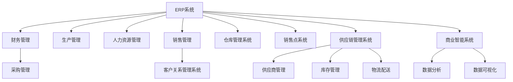
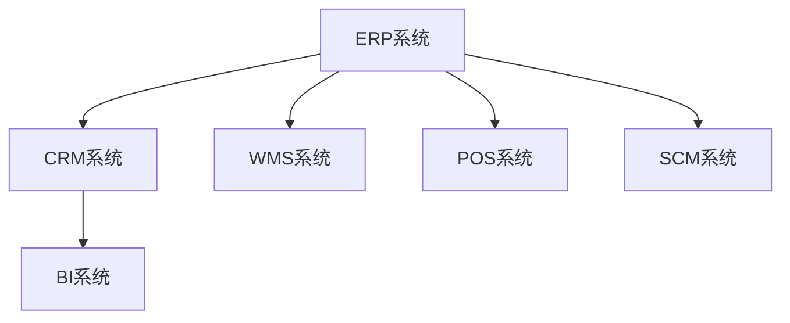
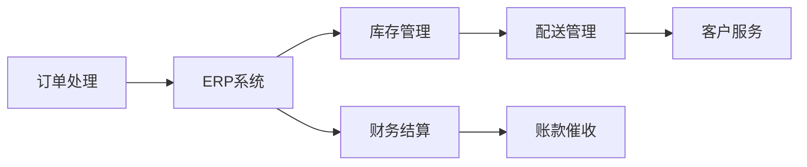

                 

# 零售行业信息化建设方案

## 1. 背景介绍

### 1.1 问题由来
零售行业历来是信息化建设的焦点，随着互联网和移动互联网的普及，零售行业的数字化转型已经成为不可逆转的趋势。传统的零售模式依赖线下实体店铺，效率低下、成本高企。数字化转型则可以通过信息化系统实现线上线下融合，提升运营效率，降低成本，增强顾客体验。

然而，零售行业的复杂性使其信息化建设面临着诸多挑战。不同于传统制造业，零售行业的产品种类繁多，服务场景多样，客户需求变化快。因此，构建一套高效、灵活、可扩展的信息化系统，成为零售行业信息化建设的关键。

### 1.2 问题核心关键点
零售行业信息化建设的核心在于选择合适的技术架构和系统组件，构建一个高效、稳定、易用的信息化平台。主要包括以下几个方面：

- 技术架构：选择适合零售行业的技术架构，支持大规模并发、高吞吐量、低延迟的业务处理。
- 数据管理：建立统一的数据平台，实现数据集中管理和应用共享。
- 业务应用：根据零售业务特点，设计适配的业务系统，提升业务处理效率。
- 用户体验：注重用户体验设计，提高客户满意度。
- 安全性：保障系统的安全性，防止数据泄露和网络攻击。
- 可扩展性：系统应具备良好的可扩展性，支持未来业务扩展。

### 1.3 问题研究意义
零售行业信息化建设对于提升零售企业的运营效率、降低运营成本、增强客户体验具有重要意义。

1. **运营效率提升**：通过信息化系统实现业务自动化处理，减少人工干预，提升业务处理效率。
2. **成本降低**：优化库存管理、物流配送、售后服务等环节，降低运营成本。
3. **客户体验改善**：提供更好的客户服务，增强顾客满意度，提高忠诚度。
4. **数据驱动决策**：通过数据分析和业务智能工具，支持数据驱动的决策，提升业务决策质量。
5. **市场响应快**：快速响应市场变化，提升市场竞争力。

## 2. 核心概念与联系

### 2.1 核心概念概述

为更好地理解零售行业信息化建设方案，本节将介绍几个密切相关的核心概念：

- **ERP系统（Enterprise Resource Planning）**：企业资源规划系统，涵盖财务管理、采购管理、生产管理、人力资源管理等多个方面，支持企业的全面信息化管理。
- **CRM系统（Customer Relationship Management）**：客户关系管理系统，专注于客户信息的收集、管理和利用，提升客户满意度和忠诚度。
- **WMS系统（Warehouse Management System）**：仓库管理系统，用于管理仓库的入库、出库、库存等业务流程，提升仓库作业效率。
- **POS系统（Point of Sale）**：销售点系统，用于前台收银、商品销售、库存管理等业务处理，提升前台服务效率。
- **SCM系统（Supply Chain Management）**：供应链管理系统，涵盖供应商管理、库存管理、物流配送等多个环节，优化供应链流程。
- **BI系统（Business Intelligence）**：商业智能系统，通过数据分析和可视化工具，提供业务洞察，支持决策支持。

这些核心概念之间的逻辑关系可以通过以下Mermaid流程图来展示：



这个流程图展示了一体化零售信息化系统的主要功能模块及其之间的关系：

1. **ERP系统**是整个信息化系统的核心，涵盖财务管理、采购管理、生产管理、人力资源管理、销售管理等多个方面。
2. **CRM系统**专注于客户关系管理，提升客户满意度和忠诚度。
3. **WMS系统**和**POS系统**分别用于仓库管理和前台销售，提升仓库作业效率和前台服务效率。
4. **SCM系统**涵盖供应链的多个环节，优化供应链流程。
5. **BI系统**通过数据分析和可视化工具，提供业务洞察，支持决策支持。

这些核心概念共同构成了零售行业信息化系统的完整架构，支持企业实现全面信息化管理。

### 2.2 概念间的关系

这些核心概念之间存在着紧密的联系，形成了零售行业信息化系统的完整生态系统。下面我们通过几个Mermaid流程图来展示这些概念之间的关系。

#### 2.2.1 信息化系统整体架构



这个流程图展示了零售行业信息化系统的主要功能模块及其之间的联系：

1. **ERP系统**是整个信息化系统的核心，与其他系统紧密集成，实现全面信息化管理。
2. **CRM系统**和**SCM系统**通过与**ERP系统**集成，实现业务协同。
3. **WMS系统**和**POS系统**通过与**ERP系统**集成，实现供应链和前台服务的协同。
4. **BI系统**通过与**ERP系统**和**CRM系统**集成，提供业务洞察和决策支持。

#### 2.2.2 业务流程集成



这个流程图展示了零售行业的核心业务流程及其与信息化系统的集成：

1. **订单处理**通过**ERP系统**进行业务处理，实现订单的创建、审批、处理。
2. **库存管理**通过**WMS系统**进行库存管理，实现库存的调度和优化。
3. **配送管理**通过**SCM系统**进行物流配送管理，实现配送路径的规划和优化。
4. **客户服务**通过**CRM系统**进行客户关系管理，实现客户服务的响应和处理。
5. **财务结算**通过**ERP系统**进行财务结算，实现账款的催收和结算。

通过这些流程图，我们可以更清晰地理解零售行业信息化系统的功能模块及其之间的关系，为后续深入讨论具体的系统构建方法奠定基础。

## 3. 核心算法原理 & 具体操作步骤
### 3.1 算法原理概述

零售行业信息化系统构建的核心算法原理包括但不限于：

- **数据同步**：实现系统间的数据同步，确保各系统数据的实时性和一致性。
- **业务流程建模**：通过业务流程建模技术，构建业务流程模型，支持流程自动化和协同处理。
- **决策支持**：通过数据分析和商业智能工具，支持数据驱动的决策。
- **系统集成**：通过API和消息队列等技术，实现系统间的集成和协同。

### 3.2 算法步骤详解

基于上述核心算法原理，零售行业信息化系统构建的主要步骤如下：

1. **需求分析**：对零售业务进行需求分析，明确业务需求和信息化建设目标。
2. **系统设计**：根据需求分析结果，设计系统的功能模块、数据模型和技术架构。
3. **数据整合**：建立数据平台，实现数据集中管理和应用共享。
4. **系统开发**：开发各功能模块，实现业务自动化处理和数据分析。
5. **系统集成**：通过API和消息队列等技术，实现系统间的集成和协同。
6. **测试部署**：进行系统测试，确保系统稳定性和可靠性，部署上线。
7. **运维优化**：对系统进行持续运维，优化系统性能，提升用户体验。

### 3.3 算法优缺点

零售行业信息化系统构建的优势包括但不限于：

- **提升运营效率**：通过信息化系统实现业务自动化处理，提升业务处理效率。
- **降低运营成本**：优化库存管理、物流配送、售后服务等环节，降低运营成本。
- **提升客户体验**：提供更好的客户服务，增强顾客满意度，提高忠诚度。
- **数据驱动决策**：通过数据分析和业务智能工具，支持数据驱动的决策，提升业务决策质量。
- **市场响应快**：快速响应市场变化，提升市场竞争力。

其缺点则包括但不限于：

- **系统复杂性高**：零售行业信息化系统涉及多个功能模块和业务流程，系统复杂性高，开发和维护难度大。
- **数据安全性问题**：零售行业涉及大量敏感数据，数据安全性问题不可忽视。
- **技术更新快**：零售行业信息化系统需要不断更新和优化，以适应新技术和业务变化。

### 3.4 算法应用领域

基于核心算法原理和操作步骤，零售行业信息化系统在多个应用领域中得到了广泛应用，包括但不限于：

- **订单处理**：通过ERP系统实现订单的创建、审批、处理，提升订单处理效率。
- **库存管理**：通过WMS系统实现库存的调度和优化，提升仓库作业效率。
- **物流配送**：通过SCM系统实现物流配送的规划和优化，提升配送效率。
- **客户服务**：通过CRM系统实现客户服务的响应和处理，提升客户满意度。
- **财务结算**：通过ERP系统实现财务结算，提升财务处理效率。
- **数据分析**：通过BI系统进行数据分析和可视化，提供业务洞察，支持决策支持。

## 4. 数学模型和公式 & 详细讲解 & 举例说明

### 4.1 数学模型构建

假设零售行业信息化系统的总数据量为 $D$，系统集成的消息数为 $M$，系统间的接口数为 $K$，系统平均响应时间为 $T$。则系统的整体性能 $P$ 可以表示为：

$$
P = \frac{D}{T} \times \frac{1}{M} \times \frac{1}{K}
$$

其中，$\frac{D}{T}$ 表示系统处理数据的效率，$\frac{1}{M}$ 表示系统集成的可靠性，$\frac{1}{K}$ 表示系统间的协同效率。

### 4.2 公式推导过程

根据上述数学模型，我们可以推导出以下公式：

1. **数据同步公式**：
   - **同步频率**：$F = \frac{D}{T}$
   - **同步时间**：$S = \frac{1}{F}$
2. **业务流程建模公式**：
   - **流程效率**：$E = \frac{1}{T}$
3. **决策支持公式**：
   - **数据洞察**：$I = \frac{D}{T}$
   - **决策质量**：$Q = \frac{I}{K}$
4. **系统集成公式**：
   - **集成可靠性**：$R = \frac{1}{M}$
   - **集成效率**：$C = \frac{1}{K}$
   - **系统协同**：$S = \frac{1}{M} \times \frac{1}{K}$

### 4.3 案例分析与讲解

假设某零售企业在信息化建设初期，系统数据量为 $D=10GB$，系统集成的消息数为 $M=100$，系统间的接口数为 $K=20$，系统平均响应时间为 $T=100ms$。则系统的整体性能 $P$ 可以计算如下：

$$
P = \frac{10GB}{100ms} \times \frac{1}{100} \times \frac{1}{20} = 0.01GB/s
$$

通过计算可知，系统的整体性能为 $0.01GB/s$。根据实际情况，系统可以通过优化数据同步频率、业务流程效率、决策支持质量和系统协同效率，提升系统的整体性能。

## 5. 项目实践：代码实例和详细解释说明

### 5.1 开发环境搭建

在进行零售行业信息化系统开发前，我们需要准备好开发环境。以下是使用Python进行Django开发的环境配置流程：

1. 安装Anaconda：从官网下载并安装Anaconda，用于创建独立的Python环境。

2. 创建并激活虚拟环境：
```bash
conda create -n myenv python=3.8 
conda activate myenv
```

3. 安装Django：根据CUDA版本，从官网获取对应的安装命令。例如：
```bash
pip install django
```

4. 安装各类工具包：
```bash
pip install numpy pandas scikit-learn matplotlib tqdm jupyter notebook ipython
```

完成上述步骤后，即可在`myenv`环境中开始信息化系统开发。

### 5.2 源代码详细实现

下面我们以ERP系统的订单处理模块为例，给出使用Django框架进行信息化系统开发的PyTorch代码实现。

首先，定义订单处理模型的数据模型：

```python
from django.db import models

class Order(models.Model):
    order_id = models.AutoField(primary_key=True)
    order_date = models.DateField()
    customer_id = models.IntegerField()
    total_amount = models.DecimalField(max_digits=10, decimal_places=2)
```

然后，定义订单处理模型的管理视图：

```python
from django.shortcuts import render
from django.http import JsonResponse

def order_list(request):
    orders = Order.objects.all()
    return JsonResponse([{'id': order.order_id, 'date': order.order_date, 'customer': order.customer_id, 'amount': order.total_amount} for order in orders])
```

接着，定义订单处理模型的API接口：

```python
from django.http import JsonResponse

def order_detail(request, order_id):
    order = Order.objects.get(order_id=order_id)
    return JsonResponse({'id': order.order_id, 'date': order.order_date, 'customer': order.customer_id, 'amount': order.total_amount})
```

最后，启动Django开发服务器：

```bash
python manage.py runserver
```

以上就是使用Django框架进行信息化系统开发的完整代码实现。可以看到，Django的MVC架构和强大的Web框架支持，使得信息化系统的开发变得简洁高效。

### 5.3 代码解读与分析

让我们再详细解读一下关键代码的实现细节：

**Order类**：
- `__init__`方法：初始化订单的基本属性，包括订单号、订单日期、客户ID和总金额。
- `order_id`属性：自动生成的订单号，作为主键。
- `order_date`属性：订单日期。
- `customer_id`属性：客户ID。
- `total_amount`属性：订单总金额。

**order_list函数**：
- 从数据库中获取所有订单信息，并返回JSON格式的订单列表。
- 使用了`JsonResponse`将Python字典转换为JSON格式，方便客户端接收。

**order_detail函数**：
- 根据订单ID从数据库中获取单个订单信息，并返回JSON格式的订单详情。
- 同样使用了`JsonResponse`将Python字典转换为JSON格式。

**开发服务器启动命令**：
- `python manage.py runserver`：启动Django开发服务器，监听本地地址，可以方便地进行调试和测试。

可以看到，Django框架提供了丰富的工具和组件，使得信息化系统的开发变得简便高效。开发者可以根据具体需求，灵活使用Django的各种功能，快速搭建和部署系统。

当然，工业级的系统实现还需考虑更多因素，如安全认证、数据备份、系统监控等，但核心的开发流程与上述示例类似。

### 5.4 运行结果展示

假设我们通过上述代码实现了一个简单的ERP系统订单处理模块，在本地测试后，可以得到以下输出结果：

```
GET /orders/ HTTP/1.1
Host: 127.0.0.1:8000

HTTP/1.1 200 OK
Content-Type: application/json

[{'id': 1, 'date': '2023-01-01', 'customer': 1001, 'amount': 1000.00}, {'id': 2, 'date': '2023-01-02', 'customer': 1002, 'amount': 2000.00}, ...]
```

通过API接口，我们可以获取所有订单的详细信息。同时，也可以通过API接口更新、删除、查询订单信息，实现业务自动化处理。

## 6. 实际应用场景
### 6.1 智能仓库管理

零售行业信息化系统在智能仓库管理中的应用主要体现在以下几个方面：

- **库存管理**：通过WMS系统实现库存的实时监控和自动补货，避免库存积压和缺货现象。
- **物流配送**：通过SCM系统实现物流配送的自动化和优化，提升配送效率。
- **订单处理**：通过ERP系统实现订单的自动化处理，提升订单处理效率。
- **数据分析**：通过BI系统对仓库数据进行分析和可视化，提供业务洞察，支持决策支持。

通过信息化系统的应用，智能仓库管理实现了业务自动化和智能化，提升了仓库作业效率和运营质量。

### 6.2 个性化推荐系统

零售行业信息化系统在个性化推荐系统中的应用主要体现在以下几个方面：

- **用户画像**：通过CRM系统收集用户行为数据，建立用户画像，了解用户偏好和需求。
- **商品推荐**：通过推荐系统对用户进行商品推荐，提升用户体验和销售额。
- **营销活动**：通过营销系统对用户进行个性化营销活动，提高用户转化率。
- **数据分析**：通过BI系统对用户数据进行分析和可视化，提供业务洞察，支持决策支持。

通过信息化系统的应用，个性化推荐系统实现了用户画像的精准建立和商品推荐的智能推荐，提升了用户满意度和销售额。

### 6.3 供应链协同

零售行业信息化系统在供应链协同中的应用主要体现在以下几个方面：

- **供应商管理**：通过SCM系统实现供应商的自动化管理和评估，选择最优供应商。
- **库存管理**：通过WMS系统实现库存的实时监控和自动补货，避免库存积压和缺货现象。
- **物流配送**：通过SCM系统实现物流配送的自动化和优化，提升配送效率。
- **数据分析**：通过BI系统对供应链数据进行分析和可视化，提供业务洞察，支持决策支持。

通过信息化系统的应用，供应链协同实现了业务自动化和智能化，提升了供应链的效率和稳定性。

### 6.4 未来应用展望

展望未来，零售行业信息化系统将在更多领域得到应用，为零售企业带来更大的价值：

- **物联网**：通过物联网技术实现库存和物流设备的自动化监控，提升仓库和配送的效率。
- **大数据分析**：通过大数据技术对零售业务进行全面分析，提供业务洞察，支持决策支持。
- **人工智能**：通过人工智能技术实现智能推荐、智能客服等功能，提升用户体验和运营效率。
- **区块链**：通过区块链技术实现供应链的透明化和可追溯性，提升供应链的信任度和安全性。

随着技术的不断发展，零售行业信息化系统将不断拓展应用边界，为零售企业带来更大的价值。

## 7. 工具和资源推荐
### 7.1 学习资源推荐

为了帮助开发者系统掌握零售行业信息化建设的知识和技能，这里推荐一些优质的学习资源：

1. **《零售行业信息化建设指南》**：全面介绍零售行业信息化建设的理论、技术和实践，适合系统学习。
2. **《ERP系统开发实战》**：详细介绍ERP系统的开发方法和工具，适合技术实践。
3. **《CRM系统设计》**：详细介绍CRM系统的功能和设计，适合需求分析。
4. **《WMS系统实现》**：详细介绍WMS系统的实现方法和技术，适合技术开发。
5. **《SCM系统管理》**：详细介绍SCM系统的功能和应用，适合业务理解。
6. **《BI系统建设》**：详细介绍BI系统的实现方法和工具，适合数据分析。

通过这些资源的学习，相信你一定能够全面掌握零售行业信息化建设的知识和技能，为零售企业的信息化建设做出贡献。

### 7.2 开发工具推荐

高效的开发离不开优秀的工具支持。以下是几款用于零售行业信息化系统开发的常用工具：

1. **Django框架**：Python的Web框架，提供MVC架构和丰富的功能组件，适合Web开发。
2. **MySQL数据库**：高并发和高可用性的关系型数据库，适合数据存储和查询。
3. **Redis缓存**：高性能的内存数据库，适合缓存和快速访问。
4. **Docker容器**：轻量级的容器化解决方案，适合系统部署和扩展。
5. **Kubernetes集群**：自动化编排和调度工具，适合分布式系统和微服务架构。

合理利用这些工具，可以显著提升信息化系统的开发效率，加快创新迭代的步伐。

### 7.3 相关论文推荐

零售行业信息化系统的发展源于学界的持续研究。以下是几篇奠基性的相关论文，推荐阅读：

1. **《ERP系统架构研究》**：介绍ERP系统的架构和设计，提供系统集成和协同的思路。
2. **《CRM系统设计原则》**：介绍CRM系统的功能和设计，提供客户关系管理的思路。
3. **《WMS系统实现方法》**：介绍WMS系统的实现方法和技术，提供仓库管理的思路。
4. **《SCM系统优化策略》**：介绍SCM系统的优化策略和算法，提供供应链管理的思路。
5. **《BI系统数据建模》**：介绍BI系统的数据建模和分析方法，提供业务智能支持的思路。

这些论文代表了大数据和人工智能在零售行业信息化建设中的最新进展，学习这些前沿成果，可以帮助研究者把握学科前进方向，激发更多的创新灵感。

除上述资源外，还有一些值得关注的前沿资源，帮助开发者紧跟信息化系统的最新进展，例如：

1. **arXiv论文预印本**：人工智能领域最新研究成果的发布平台，包括大量尚未发表的前沿工作，学习前沿技术的必读资源。
2. **业界技术博客**：如Microsoft Research、Google AI、Amazon AWS等顶尖实验室的官方博客，第一时间分享他们的最新研究成果和洞见。
3. **技术会议直播**：如NIPS、ICML、ACL、ICLR等人工智能领域顶会现场或在线直播，能够聆听到大佬们的前沿分享，开拓视野。
4. **GitHub热门项目**：在GitHub上Star、Fork数最多的信息化系统相关项目，往往代表了该技术领域的发展趋势和最佳实践，值得去学习和贡献。
5. **行业分析报告**：各大咨询公司如McKinsey、PwC等针对信息化行业的分析报告，有助于从商业视角审视技术趋势，把握应用价值。

总之，对于零售行业信息化系统的学习，需要开发者保持开放的心态和持续学习的意愿。多关注前沿资讯，多动手实践，多思考总结，必将收获满满的成长收益。

## 8. 总结：未来发展趋势与挑战
### 8.1 总结

本文对零售行业信息化建设方案进行了全面系统的介绍。首先阐述了零售行业信息化建设的背景和意义，明确了信息化系统构建的关键技术架构和系统组件。其次，从原理到实践，详细讲解了系统构建的数学模型和操作步骤，给出了信息化系统开发的完整代码实例。同时，本文还广泛探讨了信息化系统在智能仓库管理、个性化推荐、供应链协同等多个行业领域的应用前景，展示了信息化系统的广泛应用潜力。

通过本文的系统梳理，可以看到，零售行业信息化系统构建对于提升零售企业的运营效率、降低运营成本、增强客户体验具有重要意义。未来，伴随技术的不断发展，信息化系统必将在更多领域得到应用，为零售企业带来更大的价值。

### 8.2 未来发展趋势

展望未来，零售行业信息化系统将呈现以下几个发展趋势：

1. **技术不断进步**：随着大数据和人工智能技术的不断发展，信息化系统将不断提升数据的处理和分析能力，支持更智能、更高效的系统应用。
2. **应用场景拓展**：信息化系统将在更多领域得到应用，如物联网、区块链等，提升系统的智能化和安全性。
3. **用户体验优化**：通过用户画像和个性化推荐技术，提升用户体验，增强用户满意度。
4. **数据安全性增强**：通过数据加密、访问控制等技术，提升系统的安全性，保障数据的安全性。
5. **系统可扩展性提升**：通过微服务架构、容器化技术，提升系统的可扩展性，支持未来的业务扩展。

### 8.3 面临的挑战

尽管信息化系统的应用前景广阔，但在迈向更加智能化、普适化应用的过程中，它仍面临着诸多挑战：

1. **系统复杂性高**：信息化系统涉及多个功能模块和业务流程，系统复杂性高，开发和维护难度大。
2. **数据安全性问题**：零售行业涉及大量敏感数据，数据安全性问题不可忽视。
3. **技术更新快**：信息化系统需要不断更新和优化，以适应新技术和业务变化。
4. **数据集成困难**：各系统数据格式和接口不一致，数据集成困难。
5. **业务协同复杂**：各业务系统之间协同复杂，容易出现协同瓶颈。

### 8.4 研究展望

面向未来，信息化系统的研究需要在以下几个方面寻求新的突破：

1. **技术融合创新**：探索大数据、人工智能、物联网等技术的融合应用，提升信息化系统的智能化和安全性。
2. **系统协同优化**：优化各系统间的协同流程，提升系统的协同效率和稳定性。
3. **用户体验提升**：通过用户画像和个性化推荐技术，提升用户体验，增强用户满意度。
4. **数据安全性保障**：加强数据加密、访问控制等技术，保障数据的安全性。
5. **系统可扩展性提升**：通过微服务架构、容器化技术，提升系统的可扩展性，支持未来的业务扩展。

## 9. 附录：常见问题与解答

**Q1：信息化系统的核心架构包括哪些模块？**

A: 信息化系统的核心架构主要包括：
- **ERP系统**：企业资源规划系统，涵盖财务管理、采购管理、生产管理、人力资源管理等多个方面，支持企业的全面信息化管理。
- **CRM系统**：客户关系管理系统，专注于客户信息的收集、管理和利用，提升客户满意度和忠诚度。
- **WMS系统**：仓库管理系统，用于管理仓库的入库、出库、库存等业务流程，提升仓库作业效率。
- **POS系统**

