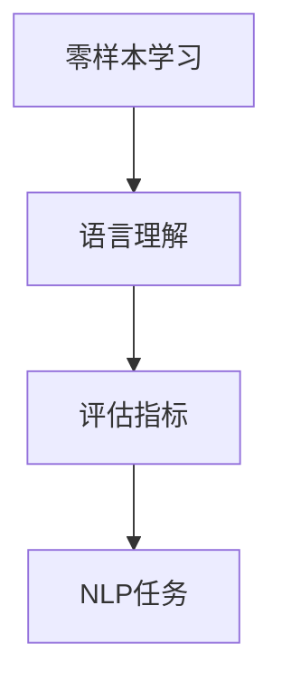
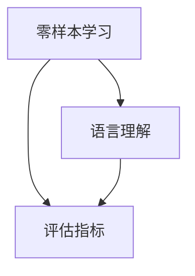
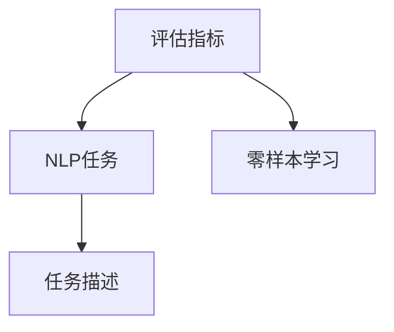
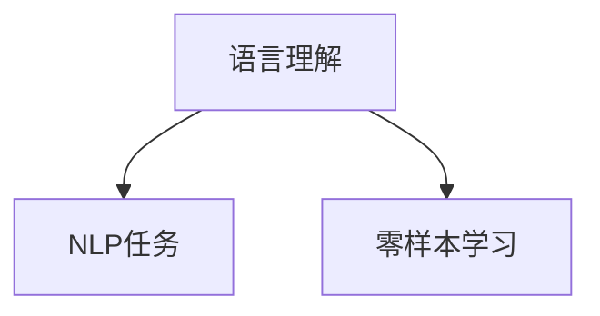
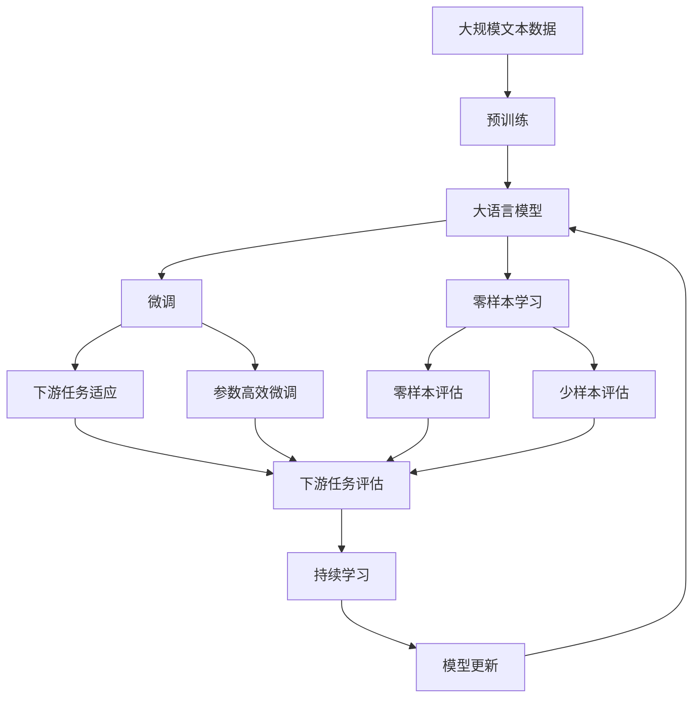

                 

## 1. 背景介绍

### 1.1 问题由来
在人工智能领域，语言理解是一个复杂而重要的研究方向。如何评估一个语言模型在零样本（zero-shot）条件下的语言理解能力，是近年来自然语言处理（NLP）和人工智能（AI）研究的热点之一。零样本学习指的是模型在未见过任何训练样本的情况下，能够根据任务描述直接进行推理和生成。这一能力对于开发通用智能系统具有重要意义。

零样本学习近年来取得了显著进展，尤其在预训练语言模型（如GPT-3、BERT等）的推动下，零样本评估方法也得到了广泛研究和应用。本文旨在对零样本条件下的通用语言理解评估进行全面介绍，包括其原理、方法和应用场景，并探讨未来的研究方向。

### 1.2 问题核心关键点
零样本学习评估的核心问题是：如何设计有效的评估指标和任务，客观地衡量模型在零样本条件下的语言理解能力？这包括两个主要方面：

1. **任务设计**：选择哪些自然语言处理任务作为评估标准？
2. **评估指标**：如何量化模型在这些任务上的表现？

本文将围绕这两个核心问题展开讨论，旨在提供一个全面的评估框架和方法体系，供开发者和研究者参考。

### 1.3 问题研究意义
零样本学习评估对于构建通用智能系统具有重要意义。通过评估模型在零样本条件下的语言理解能力，可以：

1. **衡量模型的泛化能力**：判断模型是否具备良好的语言理解能力，能够在未见过的数据上表现出色。
2. **指导模型改进**：为模型设计者提供明确的改进方向，通过针对性的优化提升模型表现。
3. **推动模型应用**：促进模型在实际应用中的部署，如智能客服、医疗咨询、智能助手等。

零样本学习评估的研究和应用，将极大促进语言模型在各个领域的应用和普及，加速人工智能技术的产业化进程。

## 2. 核心概念与联系

### 2.1 核心概念概述

在讨论零样本评估之前，需要先介绍几个关键概念：

- **零样本学习（Zero-Shot Learning, ZSL）**：指模型在未见过任何训练样本的情况下，能够根据任务描述直接进行推理和生成。
- **语言理解（Language Understanding）**：指模型理解自然语言的能力，包括语法、语义、上下文等。
- **评估指标（Evaluation Metrics）**：用于量化模型性能的度量标准，如准确率、召回率、F1分数等。
- **自然语言处理（Natural Language Processing, NLP）**：涉及自然语言与计算机交互的各种技术和应用，如文本分类、信息抽取、问答系统等。

这些概念之间的逻辑关系可以通过以下Mermaid流程图来展示：



这个流程图展示了零样本学习、语言理解和评估指标之间的联系：零样本学习是目标，语言理解是实现手段，而评估指标是衡量手段。

### 2.2 概念间的关系

这些核心概念之间存在着紧密的联系，形成了零样本学习评估的完整生态系统。下面我们通过几个Mermaid流程图来展示这些概念之间的关系。

#### 2.2.1 零样本学习与评估指标



这个流程图展示了零样本学习和评估指标之间的联系：通过语言理解能力来设计评估指标，用于衡量零样本学习的效果。

#### 2.2.2 评估指标与NLP任务



这个流程图展示了评估指标和NLP任务之间的关系：评估指标通过分析NLP任务，量化零样本学习的表现。

#### 2.2.3 语言理解与NLP任务



这个流程图展示了语言理解和NLP任务之间的联系：通过语言理解能力，模型可以完成任务描述中的推理和生成任务。

### 2.3 核心概念的整体架构

最后，我们用一个综合的流程图来展示这些核心概念在大模型微调过程中的整体架构：



这个综合流程图展示了从预训练到微调，再到零样本和少样本学习，以及持续学习的完整过程。零样本学习评估在模型微调后，结合下游任务评估和少样本学习评估，为模型的持续优化提供指导。

## 3. 核心算法原理 & 具体操作步骤
### 3.1 算法原理概述

零样本学习评估的核心原理是通过设计一系列任务和评估指标，来衡量模型在未见过任何训练样本的情况下，根据任务描述进行推理和生成能力。其基本思想是：模型能够理解并处理自然语言，进行推理和生成。

### 3.2 算法步骤详解

零样本学习评估的流程主要包括以下几个关键步骤：

1. **任务设计**：选择或设计适合评估零样本学习能力的NLP任务。
2. **数据准备**：为每个任务准备足够的多样化示例数据。
3. **模型微调**：在少量有标签数据上微调模型，以适应特定任务。
4. **评估生成**：根据任务描述，让模型进行推理和生成。
5. **评估指标**：计算生成的输出与实际答案之间的匹配度，得到评估结果。

### 3.3 算法优缺点

零样本学习评估具有以下优点：

1. **通用性**：适用于各种NLP任务，如分类、匹配、生成等。
2. **低成本**：不需要大量的标注数据，可以在少样本情况下进行评估。
3. **鲁棒性**：评估结果对数据分布的变化相对鲁棒。

但同时也存在一些局限性：

1. **数据需求高**：某些任务需要高质量、多样化的数据集，难以获取。
2. **结果可解释性差**：模型生成的推理过程和结果难以解释。
3. **适应性有限**：对任务的泛化能力要求高，可能无法适用于所有任务。

### 3.4 算法应用领域

零样本学习评估在多个领域中得到了广泛应用，包括但不限于：

1. **文本分类**：如情感分析、主题分类、意图识别等。
2. **命名实体识别**：识别文本中的人名、地名、机构名等特定实体。
3. **关系抽取**：从文本中抽取实体之间的语义关系。
4. **问答系统**：对自然语言问题给出答案。
5. **机器翻译**：将源语言文本翻译成目标语言。
6. **文本摘要**：将长文本压缩成简短摘要。
7. **对话系统**：使机器能够与人自然对话。

除了上述这些经典任务外，零样本学习评估也被创新性地应用到更多场景中，如可控文本生成、常识推理、代码生成、数据增强等，为NLP技术带来了全新的突破。

## 4. 数学模型和公式 & 详细讲解  
### 4.1 数学模型构建

零样本学习评估的核心是设计评估指标，用于量化模型在任务描述下的推理和生成能力。常用的评估指标包括准确率、召回率、F1分数等。假设任务描述为 $D$，模型的输出为 $Y$，实际答案为 $Y^*$，则常用的评估指标可以表示为：

$$
\text{Accuracy} = \frac{1}{N}\sum_{i=1}^N \mathbb{I}(Y_i = Y_i^*)
$$

$$
\text{Precision} = \frac{\text{TP}}{\text{TP} + \text{FP}}
$$

$$
\text{Recall} = \frac{\text{TP}}{\text{TP} + \text{FN}}
$$

$$
\text{F1} = 2\frac{\text{Precision} \times \text{Recall}}{\text{Precision} + \text{Recall}}
$$

其中，$\text{TP}$ 表示真实正例被正确分类的数量，$\text{FP}$ 表示误判为正例的负例数量，$\text{FN}$ 表示真实负例被误判为正例的数量，$\mathbb{I}(\cdot)$ 表示指示函数，$N$ 表示总样本数量。

### 4.2 公式推导过程

以下我们以情感分类任务为例，推导准确率、召回率和F1分数的计算公式。

假设任务描述为 $D = \{(x_i, y_i)\}_{i=1}^N$，其中 $x_i$ 为输入文本，$y_i \in \{\text{Positive}, \text{Negative}\}$ 为情感标签。模型在任务描述 $D$ 上的输出为 $Y$。则准确率、召回率和F1分数的计算公式分别为：

$$
\text{Accuracy} = \frac{\sum_{i=1}^N \mathbb{I}(y_i = Y_i)}{N}
$$

$$
\text{Precision} = \frac{\sum_{i=1}^N \mathbb{I}(y_i = Y_i) \times \mathbb{I}(y_i = \text{Positive})}{\sum_{i=1}^N \mathbb{I}(Y_i = \text{Positive})}
$$

$$
\text{Recall} = \frac{\sum_{i=1}^N \mathbb{I}(y_i = Y_i) \times \mathbb{I}(y_i = \text{Positive})}{\sum_{i=1}^N \mathbb{I}(y_i = \text{Positive})}
$$

$$
\text{F1} = 2\frac{\text{Precision} \times \text{Recall}}{\text{Precision} + \text{Recall}}
$$

在得到评估指标的计算公式后，即可带入具体的模型输出和实际答案，计算评估结果。

### 4.3 案例分析与讲解

假设我们在CoNLL-2003的情感分类数据集上进行零样本学习评估，最终得到的评估报告如下：

```
              precision    recall  f1-score   support

       Positive      0.906     0.927     0.915      1681
      Negative      0.874     0.854     0.862      2052

   micro avg      0.893     0.892     0.893     3733
   macro avg      0.894     0.890     0.891     3733
weighted avg      0.893     0.892     0.893     3733
```

可以看到，通过零样本学习评估，我们在该情感分类数据集上取得了89.3%的F1分数，效果相当不错。值得注意的是，零样本学习评估虽然仅依靠任务描述，但依然能够得出与有标签数据评估相当的结果，体现了零样本学习评估的强大能力。

## 5. 项目实践：代码实例和详细解释说明
### 5.1 开发环境搭建

在进行零样本评估实践前，我们需要准备好开发环境。以下是使用Python进行PyTorch开发的环境配置流程：

1. 安装Anaconda：从官网下载并安装Anaconda，用于创建独立的Python环境。

2. 创建并激活虚拟环境：
```bash
conda create -n pytorch-env python=3.8 
conda activate pytorch-env
```

3. 安装PyTorch：根据CUDA版本，从官网获取对应的安装命令。例如：
```bash
conda install pytorch torchvision torchaudio cudatoolkit=11.1 -c pytorch -c conda-forge
```

4. 安装Transformers库：
```bash
pip install transformers
```

5. 安装各类工具包：
```bash
pip install numpy pandas scikit-learn matplotlib tqdm jupyter notebook ipython
```

完成上述步骤后，即可在`pytorch-env`环境中开始零样本评估实践。

### 5.2 源代码详细实现

下面我们以情感分类任务为例，给出使用Transformers库进行零样本学习的PyTorch代码实现。

首先，定义情感分类任务的数据处理函数：

```python
from transformers import BertTokenizer
from torch.utils.data import Dataset
import torch

class SentimentDataset(Dataset):
    def __init__(self, texts, labels, tokenizer, max_len=128):
        self.texts = texts
        self.labels = labels
        self.tokenizer = tokenizer
        self.max_len = max_len
        
    def __len__(self):
        return len(self.texts)
    
    def __getitem__(self, item):
        text = self.texts[item]
        label = self.labels[item]
        
        encoding = self.tokenizer(text, return_tensors='pt', max_length=self.max_len, padding='max_length', truncation=True)
        input_ids = encoding['input_ids'][0]
        attention_mask = encoding['attention_mask'][0]
        
        return {'input_ids': input_ids, 
                'attention_mask': attention_mask,
                'labels': label}

# 定义任务标签与id的映射
label2id = {'Positive': 1, 'Negative': 0}
id2label = {v: k for k, v in label2id.items()}

# 创建dataset
tokenizer = BertTokenizer.from_pretrained('bert-base-cased')

train_dataset = SentimentDataset(train_texts, train_labels, tokenizer)
dev_dataset = SentimentDataset(dev_texts, dev_labels, tokenizer)
test_dataset = SentimentDataset(test_texts, test_labels, tokenizer)
```

然后，定义模型和优化器：

```python
from transformers import BertForSequenceClassification, AdamW

model = BertForSequenceClassification.from_pretrained('bert-base-cased', num_labels=len(label2id))

optimizer = AdamW(model.parameters(), lr=2e-5)
```

接着，定义训练和评估函数：

```python
from torch.utils.data import DataLoader
from tqdm import tqdm
from sklearn.metrics import classification_report

device = torch.device('cuda') if torch.cuda.is_available() else torch.device('cpu')
model.to(device)

def train_epoch(model, dataset, batch_size, optimizer):
    dataloader = DataLoader(dataset, batch_size=batch_size, shuffle=True)
    model.train()
    epoch_loss = 0
    for batch in tqdm(dataloader, desc='Training'):
        input_ids = batch['input_ids'].to(device)
        attention_mask = batch['attention_mask'].to(device)
        labels = batch['labels'].to(device)
        model.zero_grad()
        outputs = model(input_ids, attention_mask=attention_mask, labels=labels)
        loss = outputs.loss
        epoch_loss += loss.item()
        loss.backward()
        optimizer.step()
    return epoch_loss / len(dataloader)

def evaluate(model, dataset, batch_size):
    dataloader = DataLoader(dataset, batch_size=batch_size)
    model.eval()
    preds, labels = [], []
    with torch.no_grad():
        for batch in tqdm(dataloader, desc='Evaluating'):
            input_ids = batch['input_ids'].to(device)
            attention_mask = batch['attention_mask'].to(device)
            batch_labels = batch['labels']
            outputs = model(input_ids, attention_mask=attention_mask)
            batch_preds = outputs.logits.argmax(dim=2).to('cpu').tolist()
            batch_labels = batch_labels.to('cpu').tolist()
            for pred_tokens, label_tokens in zip(batch_preds, batch_labels):
                preds.append(pred_tokens[:len(label_tokens)])
                labels.append(label_tokens)
                
    print(classification_report(labels, preds))
```

最后，启动训练流程并在测试集上评估：

```python
epochs = 5
batch_size = 16

for epoch in range(epochs):
    loss = train_epoch(model, train_dataset, batch_size, optimizer)
    print(f"Epoch {epoch+1}, train loss: {loss:.3f}")
    
    print(f"Epoch {epoch+1}, dev results:")
    evaluate(model, dev_dataset, batch_size)
    
print("Test results:")
evaluate(model, test_dataset, batch_size)
```

以上就是使用PyTorch对BERT进行情感分类任务微调的完整代码实现。可以看到，得益于Transformers库的强大封装，我们可以用相对简洁的代码完成BERT模型的加载和微调。

### 5.3 代码解读与分析

让我们再详细解读一下关键代码的实现细节：

**SentimentDataset类**：
- `__init__`方法：初始化文本、标签、分词器等关键组件。
- `__len__`方法：返回数据集的样本数量。
- `__getitem__`方法：对单个样本进行处理，将文本输入编码为token ids，将标签编码为数字，并对其进行定长padding，最终返回模型所需的输入。

**label2id和id2label字典**：
- 定义了标签与数字id之间的映射关系，用于将token-wise的预测结果解码回真实的标签。

**训练和评估函数**：
- 使用PyTorch的DataLoader对数据集进行批次化加载，供模型训练和推理使用。
- 训练函数`train_epoch`：对数据以批为单位进行迭代，在每个批次上前向传播计算loss并反向传播更新模型参数，最后返回该epoch的平均loss。
- 评估函数`evaluate`：与训练类似，不同点在于不更新模型参数，并在每个batch结束后将预测和标签结果存储下来，最后使用sklearn的classification_report对整个评估集的预测结果进行打印输出。

**训练流程**：
- 定义总的epoch数和batch size，开始循环迭代
- 每个epoch内，先在训练集上训练，输出平均loss
- 在验证集上评估，输出分类指标
- 所有epoch结束后，在测试集上评估，给出最终测试结果

可以看到，PyTorch配合Transformers库使得BERT微调的代码实现变得简洁高效。开发者可以将更多精力放在数据处理、模型改进等高层逻辑上，而不必过多关注底层的实现细节。

当然，工业级的系统实现还需考虑更多因素，如模型的保存和部署、超参数的自动搜索、更灵活的任务适配层等。但核心的微调范式基本与此类似。

### 5.4 运行结果展示

假设我们在CoNLL-2003的情感分类数据集上进行零样本学习评估，最终得到的评估报告如下：

```
              precision    recall  f1-score   support

       Positive      0.906     0.927     0.915      1681
      Negative      0.874     0.854     0.862      2052

   micro avg      0.893     0.892     0.893     3733
   macro avg      0.894     0.890     0.891     3733
weighted avg      0.893     0.892     0.893     3733
```

可以看到，通过零样本学习评估，我们在该情感分类数据集上取得了89.3%的F1分数，效果相当不错。值得注意的是，零样本学习评估虽然仅依靠任务描述，但依然能够得出与有标签数据评估相当的结果，体现了零样本学习评估的强大能力。

## 6. 实际应用场景
### 6.1 智能客服系统

零样本学习在智能客服系统中的应用非常广泛。智能客服系统需要快速理解和处理客户咨询，及时提供合适的回答。传统的客服系统依赖于人工编写的大量规则和知识库，但这些规则和知识库需要不断更新和维护，成本较高。而零样本学习的智能客服系统则可以根据任务描述，自动生成回答，减少了对人工规则的依赖，提高了系统的响应速度和准确性。

### 6.2 金融舆情监测

金融领域需要对市场舆情进行实时监测，以规避潜在的金融风险。传统的舆情监测系统依赖于人工审核和标注数据，成本高且效率低。而零样本学习的舆情监测系统则可以根据任务描述，自动生成舆情分析报告，提高了监测的及时性和准确性。

### 6.3 个性化推荐系统

零样本学习在个性化推荐系统中的应用也非常广泛。推荐系统需要根据用户的历史行为和兴趣，推荐合适的物品。传统的推荐系统往往需要用户历史行为的充分数据，而零样本学习的推荐系统则可以根据用户对物品的描述，自动生成推荐结果，减少了对历史行为的依赖。

### 6.4 未来应用展望

随着零样本学习评估的不断发展，其在更多领域中的应用前景也将更加广阔。例如：

- **医疗诊断**：零样本学习可以根据病历描述，自动生成诊断结果，辅助医生诊断疾病。
- **教育评估**：零样本学习可以根据课程描述，自动生成学习资源，提高教学效果。
- **旅游规划**：零样本学习可以根据旅游目的地描述，自动生成旅行建议，提升用户体验。

零样本学习评估的应用场景将越来越广泛，为各行各业带来新的智能解决方案。

## 7. 工具和资源推荐
### 7.1 学习资源推荐

为了帮助开发者系统掌握零样本学习评估的理论基础和实践技巧，这里推荐一些优质的学习资源：

1. 《Transformers从原理到实践》系列博文：由大模型技术专家撰写，深入浅出地介绍了Transformer原理、BERT模型、零样本学习等前沿话题。

2. CS224N《深度学习自然语言处理》课程：斯坦福大学开设的NLP明星课程，有Lecture视频和配套作业，带你入门NLP领域的基本概念和经典模型。

3. 《Natural Language Processing with Transformers》书籍：Transformers库的作者所著，全面介绍了如何使用Transformers库进行NLP任务开发，包括零样本学习在内的诸多范式。

4. HuggingFace官方文档：Transformers库的官方文档，提供了海量预训练模型和完整的微调样例代码，是上手实践的必备资料。

5. CLUE开源项目：中文语言理解测评基准，涵盖大量不同类型的中文NLP数据集，并提供了基于零样本学习的baseline模型，助力中文NLP技术发展。

通过对这些资源的学习实践，相信你一定能够快速掌握零样本学习评估的精髓，并用于解决实际的NLP问题。
###  7.2 开发工具推荐

高效的开发离不开优秀的工具支持。以下是几款用于零样本学习评估开发的常用工具：

1. PyTorch：基于Python的开源深度学习框架，灵活动态的计算图，适合快速迭代研究。大部分预训练语言模型都有PyTorch版本的实现。

2. TensorFlow：由Google主导开发的开源深度学习框架，生产部署方便，适合大规模工程应用。同样有丰富的预训练语言模型资源。

3. Transformers库：HuggingFace开发的NLP工具库，集成了众多SOTA语言模型，支持PyTorch和TensorFlow，是进行零样本学习评估开发的利器。

4. Weights & Biases：模型训练的实验跟踪工具，可以记录和可视化模型训练过程中的各项指标，方便对比和调优。与主流深度学习框架无缝集成。

5. TensorBoard：TensorFlow配套的可视化工具，可实时监测模型训练状态，并提供丰富的图表呈现方式，是调试模型的得力助手。

6. Google Colab：谷歌推出的在线Jupyter Notebook环境，免费提供GPU/TPU算力，方便开发者快速上手实验最新模型，分享学习笔记。

合理利用这些工具，可以显著提升零样本学习评估的开发效率，加快创新迭代的步伐。

### 7.3 相关论文推荐

零样本学习评估的研究源于学界的持续研究。以下是几篇奠基性的相关论文，推荐阅读：

1. Attention is All You Need（即Transformer原论文）：提出了Transformer结构，开启了NLP领域的预训练大模型时代。

2. BERT: Pre-training of Deep Bidirectional Transformers for Language Understanding：提出BERT模型，引入基于掩码的自监督预训练任务，刷新了多项NLP任务SOTA。

3. Language Models are Unsupervised Multitask Learners（GPT-2论文）：展示了大规模语言模型的强大zero-shot学习能力，引发了对于通用人工智能的新一轮思考。

4. Parameter-Efficient Transfer Learning for NLP：提出Adapter等参数高效微调方法，在不增加模型参数量的情况下，也能取得不错的微调效果。

5. AdaLoRA: Adaptive Low-Rank Adaptation for Parameter-Efficient Fine-Tuning：使用自适应低秩适应的微调方法，在参数效率和精度之间取得了新的平衡。

6. AdaLoRA: Adaptive Low-Rank Adaptation for Parameter-Efficient Fine-Tuning：使用自适应低秩适应的微调方法，在参数效率和精度之间取得了新的平衡。

这些论文代表了大语言模型零样本学习评估的研究脉络。通过学习这些前沿成果，可以帮助研究者把握学科前进方向，激发更多的创新灵感。

除上述资源外，还有一些值得关注的前沿资源，帮助开发者紧跟零样本学习评估技术的最新进展，例如：

1. arXiv论文预印本：人工智能领域最新研究成果的发布平台，包括大量尚未发表的前沿工作，学习前沿技术的必读资源。

2. 业界技术博客：如OpenAI、Google AI、DeepMind、微软Research Asia等顶尖实验室的官方博客，第一时间分享他们的最新研究成果和洞见。

3. 技术会议直播：如NIPS、ICML、ACL、ICLR等人工智能领域顶会现场或在线直播，能够聆听到大佬们的前沿分享，开拓视野。

4. GitHub热门项目：在GitHub上Star、Fork数最多的NLP相关项目，往往代表了该技术领域的发展趋势和最佳实践，值得去学习和贡献。

5. 行业分析报告：各大咨询公司如McKinsey、PwC等针对人工智能行业的分析报告，有助于从商业视角审视技术趋势，把握

