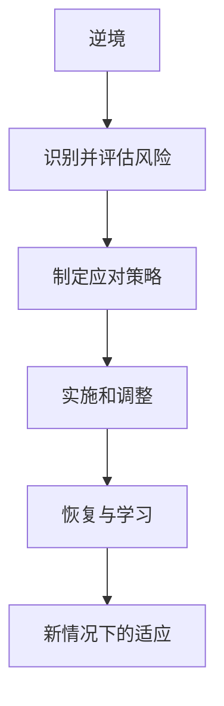
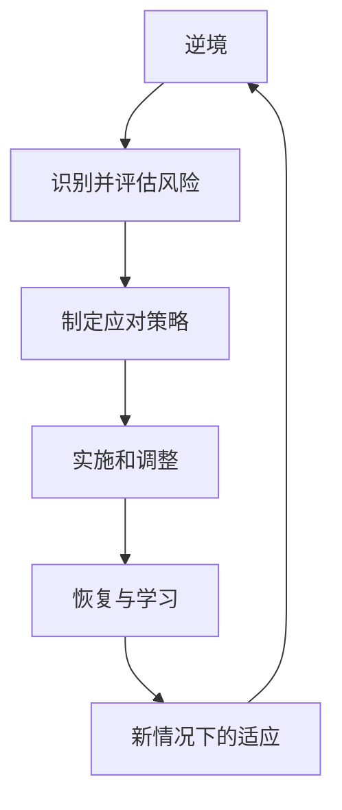

                 

# 韧性：知道这些技能可以帮助我们成功地应对任何即将到来的变化和挑战

## 1. 背景介绍

在科技迅猛发展的今天，我们生活在一个充满不确定性和变化的世界中。从全球经济环境的变化到技术发展的突破，从自然灾害的频发到社交媒体的影响，每一天我们都可能面对各种挑战和不确定性。在这样的背景下，韧性成为了个人、团队和组织成功的关键因素。所谓韧性，是指面对逆境时能够迅速适应、恢复和成长的品质。

### 1.1 问题的由来

逆境和变化是自然界和人类社会不可避免的一部分。从自然灾害到经济危机，从疫情到技术变革，每一场突如其来的挑战都会考验我们的应对能力。然而，一些人或组织能够快速适应并从中恢复，而另一些人则可能被击垮。这其中的关键在于韧性的不同。

### 1.2 问题核心关键点

逆境和变化管理的关键在于以下几个方面：

1. **识别并评估风险**：识别可能影响个人、团队或组织的潜在风险，并对其进行评估。
2. **制定应对策略**：制定能够有效应对风险的策略，包括短期和长期的应对措施。
3. **实施和调整**：将应对策略付诸行动，并根据实际情况进行调整。
4. **恢复与学习**：在应对挑战后，反思经验教训，并从中学习，以便在未来更好地应对类似的挑战。

### 1.3 问题研究意义

了解和掌握韧性管理的方法，对于个人、团队和组织在面对未来变化和挑战时保持稳定、快速适应和恢复至关重要。韧性不仅能够帮助我们更好地应对当前的环境，还能增强我们在未来不确定性下的生存和发展能力。

## 2. 核心概念与联系

### 2.1 核心概念概述

为了更好地理解如何通过技能来提高韧性，我们需要先了解几个核心概念：

- **逆境**：任何超出正常、可预测范围的变化或事件，可能会对个人、团队或组织造成压力。
- **适应**：通过改变行为或策略来适应新的环境或情况。
- **恢复**：从逆境中恢复过来，重新回到正常状态。
- **学习**：从经历中获取经验教训，为未来做好准备。

### 2.2 概念间的关系

这些概念之间存在紧密的联系，形成了韧性的完整框架。下图展示了这个框架：



在这个图中，逆境触发风险识别和评估，进而制定应对策略并实施。恢复和学习的反馈循环确保了适应性和韧性的持续提升。

### 2.3 核心概念的整体架构

最后，我们可以用下图展示这个整体架构：



这个架构展示了逆境如何触发风险识别和评估，以及如何通过应对策略、实施调整、恢复学习和新适应不断循环，形成韧性管理的过程。

## 3. 核心算法原理 & 具体操作步骤

### 3.1 算法原理概述

韧性管理的核心在于策略的制定和执行。这种策略的制定和执行通常基于对逆境的识别和评估。我们可以使用算法来辅助这个过程中的一些关键步骤。

### 3.2 算法步骤详解

1. **逆境识别**：
   - **数据收集**：收集与逆境相关的数据，包括自然灾害、经济危机、技术变革等。
   - **风险评估**：使用算法对收集到的数据进行分析，评估逆境的可能性和影响。

2. **制定应对策略**：
   - **策略制定**：基于风险评估的结果，制定应对逆境的策略。
   - **模拟测试**：使用算法模拟不同策略的效果，选择最优策略。

3. **实施和调整**：
   - **策略执行**：将选择的策略付诸行动。
   - **动态调整**：根据实际情况和反馈，调整策略和执行计划。

4. **恢复与学习**：
   - **恢复过程**：采取措施恢复正常的业务运营。
   - **经验总结**：分析逆境中的经验教训，为未来做好准备。

### 3.3 算法优缺点

韧性管理的算法具有以下优点：
- **数据驱动**：基于数据分析和模拟，决策更加科学和合理。
- **可预测性**：通过算法模拟，可以预测不同策略的效果，提前做好准备。

同时，算法也存在一些局限性：
- **数据质量要求高**：算法的准确性依赖于数据的全面性和质量。
- **复杂度高**：算法需要处理大量数据和变量，复杂度较高。

### 3.4 算法应用领域

韧性管理的算法可以应用于多个领域，包括但不限于：

- **个人发展**：帮助个人识别和应对生活中的逆境，提高适应性和恢复能力。
- **团队管理**：协助团队制定和实施应对逆境的策略，增强团队凝聚力和抗压能力。
- **组织运营**：指导组织在面对外部环境变化时，制定和调整运营策略，保持稳定和竞争力。
- **公共安全**：帮助政府和公共机构在面对自然灾害和公共卫生事件时，快速响应和恢复。

## 4. 数学模型和公式 & 详细讲解 & 举例说明

### 4.1 数学模型构建

韧性管理的数学模型通常基于风险评估和决策优化。以下是一个简化的模型框架：

1. **风险评估**：
   - **风险概率**：计算逆境发生的概率。
   - **影响评估**：评估逆境对目标的影响。

2. **决策优化**：
   - **目标函数**：定义决策的目标，如最小化风险或最大化恢复速度。
   - **约束条件**：定义决策的约束，如预算、时间限制等。

### 4.2 公式推导过程

假设我们有一个逆境 $E$，需要评估其发生的概率 $P(E)$ 和影响 $I(E)$。则风险 $R$ 可以表示为：

$$
R = P(E) \times I(E)
$$

为了制定策略，我们需要最小化风险 $R$，即：

$$
\minimize_{\text{策略} \ S} R = \minimize_{S} P(E) \times I(E)
$$

在约束条件下，目标函数可以写为：

$$
\minimize_{S} \sum_{e \in E} P(e) \times I(e)
$$

其中，$e$ 是逆境的具体事件，$P(e)$ 和 $I(e)$ 分别表示事件 $e$ 的发生概率和影响。

### 4.3 案例分析与讲解

假设我们有一个组织，需要应对突发的自然灾害。我们可以使用上述模型来评估不同应对策略的效果。例如，我们可以选择在风险高发地区建设防灾设施，或增加灾害应对培训等策略。通过计算每个策略的风险值，选择最低风险的策略。

## 5. 项目实践：代码实例和详细解释说明

### 5.1 开发环境搭建

为了进行韧性管理的项目实践，我们需要搭建一个包含数据处理、风险评估和策略制定的开发环境。可以使用Python和Pandas库进行数据处理，使用Scikit-learn库进行风险评估和决策优化。

### 5.2 源代码详细实现

以下是一个简化的Python代码示例，用于风险评估和策略制定：

```python
import pandas as pd
from sklearn.linear_model import LogisticRegression
from sklearn.ensemble import RandomForestClassifier
from sklearn.metrics import roc_auc_score

# 加载数据
data = pd.read_csv('risks.csv')

# 数据预处理
features = ['probability', 'impact', 'prevention_cost', 'recovery_cost']
target = 'risk'

# 风险评估模型
model = RandomForestClassifier()
model.fit(features, target)

# 预测风险
predictions = model.predict_proba(features)
risk_values = predictions[:, 1]

# 策略制定
strategies = ['build_facilities', 'train_staff', 'insure_facilities']
costs = {'build_facilities': 1000000, 'train_staff': 50000, 'insure_facilities': 100000}
effects = {'build_facilities': 0.8, 'train_staff': 0.7, 'insure_facilities': 0.5}

# 计算每个策略的风险值
risk_values = []
for strategy, cost, effect in zip(strategies, costs.values(), effects.values()):
    risk_value = cost * effect
    risk_values.append(risk_value)

# 选择最小风险策略
min_risk_strategy = min(enumerate(risk_values), key=lambda x: x[1])[0]
best_strategy = strategies[min_risk_strategy]

print(f"Best strategy: {best_strategy}")
```

### 5.3 代码解读与分析

这个代码示例展示了如何使用Python进行风险评估和策略制定。首先，我们使用Pandas加载数据，并使用Scikit-learn库训练一个随机森林模型进行风险评估。然后，我们定义了不同的策略和对应的成本和效果，并计算每个策略的风险值。最后，我们选择了最小风险策略并输出。

### 5.4 运行结果展示

运行上述代码，我们将得到最佳策略的输出。例如，如果输出结果为“Best strategy: build_facilities”，则说明在给定的策略中，建设防灾设施是最佳选择。

## 6. 实际应用场景

### 6.1 个人发展

韧性管理的算法和模型可以应用于个人发展，帮助个人识别和应对生活中的逆境。例如，一个人可以通过分析自己的健康数据、财务状况和社交网络，识别潜在的健康风险和财务压力，并制定相应的应对策略。

### 6.2 团队管理

在团队管理中，韧性的应用可以帮助团队识别和应对外部环境的变化，如市场波动、技术变革等。通过分析团队成员的技能和资源，制定应对策略，提高团队的适应性和恢复能力。

### 6.3 组织运营

在组织运营中，韧性的管理可以帮助组织应对突发事件，如自然灾害、供应链中断等。通过分析组织的资源和能力，制定应急响应计划，确保业务的连续性和稳定性。

### 6.4 公共安全

在公共安全中，韧性的应用可以帮助政府和公共机构在面对自然灾害和公共卫生事件时，快速响应和恢复。通过分析历史数据和模拟预测，制定应急响应策略，提高公共安全水平。

## 7. 工具和资源推荐

### 7.1 学习资源推荐

为了深入理解韧性管理，以下是一些推荐的资源：

1. **《韧性管理：掌握不确定性下的生存与发展》**：介绍韧性管理的理论和实践，提供实用的方法论和案例分析。
2. **《风险管理：原理与实践》**：讲解风险评估和决策优化的基本原理和应用案例，适合学习韧性管理的数学模型。
3. **Coursera的韧性管理课程**：由知名大学和机构提供，涵盖韧性管理的理论和实践，适合在线学习。
4. **《心理韧性：如何在逆境中保持健康和成功》**：专注于个人心理韧性的提升，提供实用的策略和方法。

### 7.2 开发工具推荐

以下推荐一些常用的开发工具：

1. **Python**：Python是数据分析和机器学习的主流语言，拥有丰富的库和框架，如Pandas、NumPy、Scikit-learn等。
2. **Jupyter Notebook**：一个交互式的Python开发环境，适合数据处理和模型开发。
3. **Tableau**：一个数据可视化工具，适合分析和展示数据结果。
4. **RapidMiner**：一个数据科学平台，提供数据预处理、建模和部署的端到端解决方案。
5. **TensorFlow**：一个流行的深度学习框架，适合复杂模型和大规模数据的处理。

### 7.3 相关论文推荐

以下推荐一些相关的论文：

1. **《韧性的量化：基于案例研究的方法》**：介绍如何使用案例研究方法量化组织的韧性。
2. **《应对气候变化：韧性城市的未来》**：讨论气候变化对城市的影响，并提出韧性城市的规划和管理方法。
3. **《团队韧性：基于员工特征和环境因素的测量》**：研究员工特征和环境因素对团队韧性的影响，提供实证数据和模型。
4. **《公共卫生危机中的韧性管理》**：探讨公共卫生危机中的韧性管理策略，提供案例分析和方法建议。

## 8. 总结：未来发展趋势与挑战

### 8.1 总结

本文系统地介绍了如何通过算法和模型来提高韧性管理的能力。我们首先讨论了韧性的核心概念和其关键步骤，然后详细讲解了数学模型和算法原理，并通过代码实例展示了实践应用。最后，我们探讨了韧性管理在个人、团队和组织中的应用，并推荐了一些学习资源和开发工具。

### 8.2 未来发展趋势

未来，韧性管理将呈现以下几个趋势：

1. **自动化和智能化**：通过算法和人工智能技术，实现自动化的风险识别和策略制定，提高效率和准确性。
2. **多模态数据的融合**：结合多模态数据（如文本、图像、视频等）进行综合分析，提高韧性的评估和决策水平。
3. **跨学科协作**：结合心理学、经济学、工程学等学科的知识和方法，提高韧性管理的科学性和全面性。
4. **动态适应**：在动态变化的环境中，实时更新和调整策略，提高适应性。
5. **伦理和可持续性**：在韧性管理中引入伦理和可持续性的考虑，确保策略的公平性和环境影响。

### 8.3 面临的挑战

尽管韧性管理具有重要的应用价值，但在实践中也面临一些挑战：

1. **数据隐私和安全性**：在处理个人和组织数据时，需要确保数据隐私和安全。
2. **算法透明度和可解释性**：算法和模型的决策过程需要透明和可解释，以便进行审查和优化。
3. **模型复杂性**：算法和模型的复杂性可能带来计算和资源上的挑战，需要优化和简化。
4. **跨领域合作**：韧性管理需要跨学科的合作和知识整合，可能面临协调和沟通的困难。

### 8.4 研究展望

未来的研究需要在以下几个方面进行探索：

1. **跨领域数据融合**：研究如何有效整合多模态数据，提升韧性的评估和决策能力。
2. **伦理和可持续性**：在韧性管理中引入伦理和可持续性的考量，确保策略的公平性和环境友好。
3. **自动化和智能化**：开发更智能和自动化的韧性管理系统，提高效率和准确性。
4. **跨学科研究**：结合心理学、经济学、工程学等学科的知识和方法，提升韧性管理的科学性和全面性。
5. **动态适应**：研究如何在动态变化的环境中，实时更新和调整韧性管理策略。

总之，韧性管理是应对未来不确定性和变化的关键技能。通过不断探索和优化，我们可以更好地应对挑战，实现个人、团队和组织的可持续发展。

## 9. 附录：常见问题与解答

**Q1：如何定义和评估风险？**

A: 风险的定义通常基于潜在事件的发生概率和其对目标的影响。评估风险需要收集相关数据，并使用数学模型或算法进行分析和预测。例如，可以使用历史数据、专家意见和模拟实验来评估风险。

**Q2：如何选择和实施应对策略？**

A: 选择应对策略需要考虑多个因素，如成本、效果、资源限制等。可以通过计算不同策略的风险值，选择最低风险的策略。实施策略时，需要制定详细的执行计划，并进行动态调整。

**Q3：如何提高组织的韧性？**

A: 提高组织的韧性需要从多个方面入手，如建立应急响应机制、培训员工、增加资源储备等。可以通过引入外部专家、进行风险评估和模拟训练来提升组织韧性。

**Q4：如何在个人发展中应用韧性管理？**

A: 在个人发展中，可以通过识别和评估生活中的逆境，制定应对策略，如调整心态、增强技能、建立支持系统等，提升个人韧性和适应能力。

**Q5：如何评估韧性管理的效果？**

A: 评估韧性管理的效果需要考虑多个维度，如风险减少、业务恢复速度、员工满意度等。可以使用定量和定性的方法进行评估，如问卷调查、绩效指标等。

总之，韧性管理是一个复杂但重要的过程。通过不断学习和实践，我们可以更好地应对未来的变化和挑战，实现可持续发展。

---

作者：禅与计算机程序设计艺术 / Zen and the Art of Computer Programming

