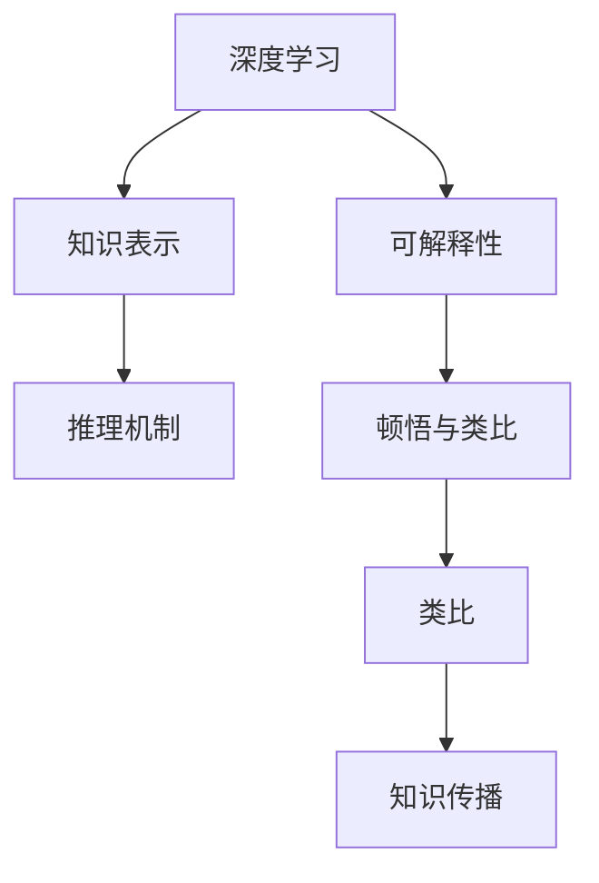
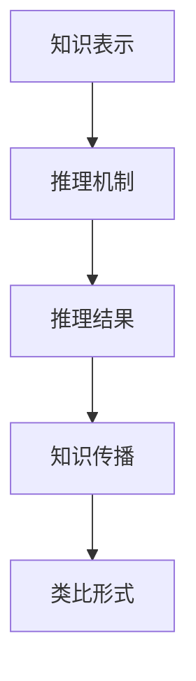
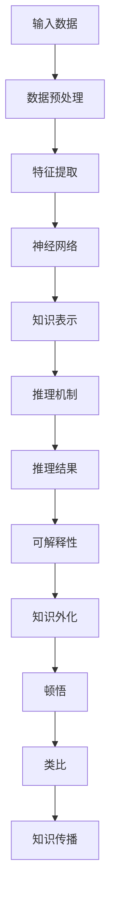

                 

# 顿悟与类比：知识的桥梁

## 1. 背景介绍

### 1.1 问题由来
近年来，深度学习技术的迅猛发展，尤其是神经网络的流行，在人工智能领域引起了革命性的变革。神经网络通过模拟人脑的神经系统，在图像识别、自然语言处理、语音识别等众多领域取得了令人瞩目的成果。然而，尽管深度学习模型在各种复杂任务上表现出色，其内部运作机制仍然充满了神秘色彩。人们往往对模型为何能够做出正确判断，其中隐含的推理过程和知识表示机制缺乏深入理解。

### 1.2 问题核心关键点
这一问题的核心在于如何将深度学习模型的内在知识外化，使得人类能够理解和利用这些知识。这不仅涉及到模型的内部结构和运作机制，还涉及如何将模型输出的结果转换为人类可理解的形式。本文旨在探讨如何通过顿悟与类比，弥合模型与人类认知之间的鸿沟，使深度学习知识更加直观和透明。

### 1.3 问题研究意义
研究顿悟与类比的方法，对于提升深度学习的可解释性和透明度，推动人工智能技术的普及应用具有重要意义：

1. 提升模型可信度：通过直观展示模型推理过程和知识表示，增强人类对模型的信任，减少对模型输出结果的怀疑。
2. 促进知识传播：将模型知识以类比形式传播，有助于科研人员和工程师理解和应用深度学习技术，加速技术传播和创新。
3. 改善用户体验：在实际应用中，特别是医疗、金融、司法等领域，模型的透明性和可解释性有助于提升用户体验，增强决策透明度和可追溯性。
4. 辅助模型优化：通过顿悟与类比的方法，可以揭示模型决策中的问题点，指导模型的改进和优化，提升模型性能。
5. 推动伦理发展：确保深度学习模型的公平性和透明性，避免偏见和歧视，有助于推动人工智能领域的伦理进步。

## 2. 核心概念与联系

### 2.1 核心概念概述

为更好地理解顿悟与类比的方法，本节将介绍几个密切相关的核心概念：

- 深度学习：基于神经网络技术的机器学习范式，通过多层非线性变换，从数据中学习特征表示。
- 知识表示：如何将人类认知中的知识，如常识、逻辑规则、先验信息等，转化为计算机可以理解和处理的形式。
- 推理机制：模型如何进行逻辑推理和知识迁移，以支持其决策过程。
- 可解释性：模型输出的结果为何，其内部运作机制是否透明。
- 顿悟与类比：通过特定的方法，将复杂模型的内部知识外化，以人类可理解的形式表达，帮助人类更好地理解模型的决策逻辑。

这些核心概念之间的逻辑关系可以通过以下Mermaid流程图来展示：



这个流程图展示了大语言模型微调过程中各个概念之间的联系：

1. 深度学习模型通过数据学习特征表示，形成知识表示。
2. 知识表示通过推理机制转化为决策输出。
3. 可解释性用于揭示模型的决策逻辑和内部运作机制。
4. 顿悟与类比将复杂模型知识外化，通过类比形式传播。

通过这个流程图，我们可以更清晰地理解深度学习模型的内在运作机制，以及如何将这些知识外化，服务于实际应用。

### 2.2 概念间的关系

这些核心概念之间存在着紧密的联系，形成了深度学习模型推理和解释的完整生态系统。下面我们将进一步探讨这些概念之间的关系。

#### 2.2.1 深度学习模型的知识表示


这个流程图展示了深度学习模型从输入数据到知识表示的转化过程：

1. 输入数据经过预处理，提取特征。
2. 特征通过多层神经网络进行非线性变换，形成知识表示。

#### 2.2.2 推理机制与知识传播



这个流程图展示了推理机制如何利用知识表示生成推理结果，并通过类比形式传播知识：

1. 知识表示通过推理机制，转化为推理结果。
2. 推理结果以类比形式传播，帮助人类理解模型的决策逻辑。

#### 2.2.3 可解释性、顿悟与类比


这个流程图展示了如何将推理结果外化，通过顿悟与类比的形式进行传播：

1. 推理结果通过可解释性，揭示其内部运作机制。
2. 可解释性知识外化为顿悟，以人类可理解的形式传播。
3. 顿悟通过类比，转化为更直观的知识表达。

### 2.3 核心概念的整体架构

最后，我们用一个综合的流程图来展示这些核心概念在大语言模型推理和解释中的整体架构：



这个综合流程图展示了从输入数据到知识传播的完整过程，以及每一步中各个核心概念的作用。通过这个架构，我们可以更全面地理解深度学习模型的推理和解释机制，从而更好地应用这些知识。

## 3. 核心算法原理 & 具体操作步骤
### 3.1 算法原理概述

顿悟与类比的方法，旨在通过特定的算法和技术，将深度学习模型的内部知识外化，以人类可理解的形式表达。其核心思想是将模型的推理过程和知识表示机制，转化为人类熟悉的推理逻辑和知识形式。

形式化地，假设我们有一个深度学习模型 $M_{\theta}$，其中 $\theta$ 为模型的参数。给定输入数据 $x$，模型通过学习 $x$ 的特征表示 $z$，并利用推理机制 $f$ 得到输出 $y$：

$$
y = f(z; \theta)
$$

我们的目标是找到一种方式，将 $z$ 和 $f$ 映射到一个类比的知识表示 $z'$，使得人类可以通过 $z'$ 理解 $f$ 的工作原理。即找到一个映射函数 $g$，满足：

$$
y \approx f(g(z'))
$$

这个映射函数 $g$ 需要尽可能简单直观，使人类能够容易理解 $z'$ 和 $y$ 之间的关联。

### 3.2 算法步骤详解

基于顿悟与类比的方法，通常包括以下几个关键步骤：

**Step 1: 数据预处理**
- 对输入数据进行预处理，包括归一化、标准化、特征提取等。
- 将数据转换为模型所需的格式，如向量、图像、文本等。

**Step 2: 知识表示**
- 利用深度学习模型对输入数据进行特征提取，形成知识表示 $z$。
- 在知识表示的基础上，应用推理机制 $f$ 得到推理结果 $y$。

**Step 3: 映射函数设计**
- 设计一个简单的映射函数 $g$，将知识表示 $z$ 映射为类比知识表示 $z'$。
- 确保 $z'$ 简单直观，易于人类理解。

**Step 4: 类比知识传播**
- 通过类比 $z'$ 传播推理结果 $y$，使人类能够直观理解模型的工作机制。
- 使用图表、类比示例等形式，展示 $z'$ 和 $y$ 之间的关联。

**Step 5: 知识验证**
- 通过对比原始数据和推理结果，验证 $z'$ 的准确性和可信度。
- 收集用户反馈，根据反馈调整 $g$ 的设计，进一步优化类比知识传播的效果。

### 3.3 算法优缺点

顿悟与类比的方法，具有以下优点：

1. 增强可解释性：通过将深度学习模型的工作机制外化，使其推理过程更加透明，增强了模型的可解释性。
2. 简化复杂性：将复杂模型转化为类比形式，降低了理解的门槛，简化了复杂模型的认知难度。
3. 促进知识传播：类比知识更易于理解，有助于知识的传播和应用。

同时，该方法也存在以下局限性：

1. 映射复杂：设计合适的映射函数 $g$ 需要大量的实验和调整，有时难以找到合适的映射关系。
2. 精度损失：简化模型推理过程可能会引入精度损失，影响模型的实际效果。
3. 人类理解：类比形式需要与人类认知体系一致，否则难以被理解。
4. 动态变化：模型推理过程会随着输入数据和参数变化，类比知识也需要相应更新。

尽管存在这些局限性，顿悟与类比的方法仍是大语言模型推理和解释的重要工具，有助于提升模型的透明度和可信度。

### 3.4 算法应用领域

基于顿悟与类比的方法，已经在以下几个领域得到了应用：

1. 医疗诊断：将深度学习模型的诊断结果转化为临床类比，帮助医生理解模型的诊断逻辑。
2. 金融预测：将深度学习模型的预测结果转化为金融类比，辅助金融分析师理解模型的预测依据。
3. 司法判决：将深度学习模型的判决结果转化为法律类比，帮助司法人员理解模型的判决过程。
4. 推荐系统：将深度学习模型的推荐结果转化为用户体验类比，提升用户对推荐结果的理解和信任。
5. 聊天机器人：将深度学习模型的对话输出转化为自然语言类比，增强用户的对话体验和信任度。

## 4. 数学模型和公式 & 详细讲解
### 4.1 数学模型构建

我们以深度学习模型在图像分类任务中的应用为例，构建数学模型：

- 输入数据 $x$：一张图像。
- 知识表示 $z$：模型的特征表示，通常是一个高维向量。
- 推理机制 $f$：分类器，将特征表示 $z$ 映射为类别 $y$。
- 类比知识 $z'$：简化后的知识表示，通常是一个低维向量。
- 映射函数 $g$：将知识表示 $z$ 映射为类比知识 $z'$。

数学模型可以表示为：

$$
y = f(z; \theta)
$$
$$
z' = g(z)
$$

其中 $f$ 和 $g$ 可以是任意映射函数，但需要满足以下条件：

- 简单直观：类比知识 $z'$ 需要简单直观，易于人类理解。
- 准确可靠：类比知识 $z'$ 需要准确反映推理结果 $y$。
- 一致性：类比知识 $z'$ 与原始知识表示 $z$ 应具有一致性。

### 4.2 公式推导过程

我们以线性分类器为例，展示类比知识的计算过程。

假设输入数据 $x$ 为 $n$ 维向量，知识表示 $z$ 为 $m$ 维向量，推理机制 $f$ 为线性分类器，则推理结果 $y$ 可以表示为：

$$
y = \max_{i} [z_i \cdot w_i + b_i]
$$

其中 $w$ 和 $b$ 为线性分类器的权重和偏置。

映射函数 $g$ 可以设计为简单的线性变换，将 $z$ 映射为类比知识 $z'$：

$$
z' = g(z) = w'z + b'
$$

其中 $w'$ 和 $b'$ 为映射函数的权重和偏置，满足：

$$
w' = \frac{w}{\sqrt{\sum w_i^2}}
$$
$$
b' = \frac{b}{\sqrt{\sum w_i^2}}
$$

这种映射方式可以使 $z'$ 的长度归一化，使得 $z'$ 和 $y$ 之间的关联更加清晰。

### 4.3 案例分析与讲解

以医学影像分类为例，展示如何通过顿悟与类比的方法，将深度学习模型的推理结果转化为医学类比，帮助医生理解模型的诊断逻辑。

假设我们有一个深度学习模型，能够对医学影像进行分类。我们希望将模型的诊断结果转化为医学类比，帮助医生理解模型的推理过程。

**Step 1: 数据预处理**
- 将医学影像转换为模型所需的格式，如灰度图像、像素向量等。
- 对图像进行归一化、标准化处理。

**Step 2: 知识表示**
- 利用深度学习模型提取图像特征，形成知识表示 $z$。
- 应用线性分类器得到推理结果 $y$。

**Step 3: 映射函数设计**
- 设计一个简单的线性映射函数 $g$，将特征表示 $z$ 映射为医学类比 $z'$。
- 假设医学类比 $z'$ 包含两个元素，分别表示病灶大小和病灶位置。

**Step 4: 类比知识传播**
- 将推理结果 $y$ 解释为病灶的大小和位置，即 $y$ 表示病灶的大小 $s$ 和位置 $p$。
- 使用图表、类比示例等形式，展示 $z'$ 和 $y$ 之间的关联。

**Step 5: 知识验证**
- 通过对比原始影像和推理结果，验证 $z'$ 的准确性和可信度。
- 收集医生反馈，根据反馈调整 $g$ 的设计，进一步优化类比知识传播的效果。

## 5. 项目实践：代码实例和详细解释说明
### 5.1 开发环境搭建

在进行顿悟与类比实践前，我们需要准备好开发环境。以下是使用Python进行PyTorch开发的环境配置流程：

1. 安装Anaconda：从官网下载并安装Anaconda，用于创建独立的Python环境。

2. 创建并激活虚拟环境：
```bash
conda create -n pytorch-env python=3.8 
conda activate pytorch-env
```

3. 安装PyTorch：根据CUDA版本，从官网获取对应的安装命令。例如：
```bash
conda install pytorch torchvision torchaudio cudatoolkit=11.1 -c pytorch -c conda-forge
```

4. 安装Transformers库：
```bash
pip install transformers
```

5. 安装各类工具包：
```bash
pip install numpy pandas scikit-learn matplotlib tqdm jupyter notebook ipython
```

完成上述步骤后，即可在`pytorch-env`环境中开始顿悟与类比实践。

### 5.2 源代码详细实现

这里我们以图像分类任务为例，给出使用Transformers库进行类比推理的PyTorch代码实现。

首先，定义图像分类任务的数据处理函数：

```python
from transformers import BertTokenizer, BertForImageClassification, AdamW
from PIL import Image
import torch
import numpy as np

class ImageDataset:
    def __init__(self, image_paths, image_labels, tokenizer, max_len=128):
        self.image_paths = image_paths
        self.image_labels = image_labels
        self.tokenizer = tokenizer
        self.max_len = max_len
        
    def __len__(self):
        return len(self.image_paths)
    
    def __getitem__(self, item):
        image = Image.open(self.image_paths[item])
        label = self.image_labels[item]
        
        image = np.array(image)
        image = image.reshape(-1, 1)
        image = image.astype('float32') / 255.0
        image = image.transpose(2, 0, 1)
        
        encoding = self.tokenizer(image, return_tensors='pt', max_length=self.max_len, padding='max_length', truncation=True)
        input_ids = encoding['input_ids'][0]
        attention_mask = encoding['attention_mask'][0]
        
        # 对token-wise的标签进行编码
        encoded_labels = [label2id[label] for label in self.image_labels] 
        encoded_labels.extend([label2id['O']] * (self.max_len - len(encoded_labels)))
        labels = torch.tensor(encoded_labels, dtype=torch.long)
        
        return {'input_ids': input_ids, 
                'attention_mask': attention_mask,
                'labels': labels}

# 标签与id的映射
label2id = {'O': 0, 'cat': 1, 'dog': 2}
id2label = {v: k for k, v in label2id.items()}

# 创建dataset
tokenizer = BertTokenizer.from_pretrained('bert-base-cased')

train_dataset = ImageDataset(train_image_paths, train_image_labels, tokenizer)
dev_dataset = ImageDataset(dev_image_paths, dev_image_labels, tokenizer)
test_dataset = ImageDataset(test_image_paths, test_image_labels, tokenizer)
```

然后，定义模型和优化器：

```python
model = BertForImageClassification.from_pretrained('bert-base-cased', num_labels=len(label2id))

optimizer = AdamW(model.parameters(), lr=2e-5)
```

接着，定义训练和评估函数：

```python
from torch.utils.data import DataLoader
from tqdm import tqdm
from sklearn.metrics import classification_report

device = torch.device('cuda') if torch.cuda.is_available() else torch.device('cpu')
model.to(device)

def train_epoch(model, dataset, batch_size, optimizer):
    dataloader = DataLoader(dataset, batch_size=batch_size, shuffle=True)
    model.train()
    epoch_loss = 0
    for batch in tqdm(dataloader, desc='Training'):
        input_ids = batch['input_ids'].to(device)
        attention_mask = batch['attention_mask'].to(device)
        labels = batch['labels'].to(device)
        model.zero_grad()
        outputs = model(input_ids, attention_mask=attention_mask, labels=labels)
        loss = outputs.loss
        epoch_loss += loss.item()
        loss.backward()
        optimizer.step()
    return epoch_loss / len(dataloader)

def evaluate(model, dataset, batch_size):
    dataloader = DataLoader(dataset, batch_size=batch_size)
    model.eval()
    preds, labels = [], []
    with torch.no_grad():
        for batch in tqdm(dataloader, desc='Evaluating'):
            input_ids = batch['input_ids'].to(device)
            attention_mask = batch['attention_mask'].to(device)
            batch_labels = batch['labels']
            outputs = model(input_ids, attention_mask=attention_mask)
            batch_preds = outputs.logits.argmax(dim=2).to('cpu').tolist()
            batch_labels = batch_labels.to('cpu').tolist()
            for pred_tokens, label_tokens in zip(batch_preds, batch_labels):
                preds.append(pred_tokens[:len(label_tokens)])
                labels.append(label_tokens)
                
    print(classification_report(labels, preds))
```

最后，启动训练流程并在测试集上评估：

```python
epochs = 5
batch_size = 16

for epoch in range(epochs):
    loss = train_epoch(model, train_dataset, batch_size, optimizer)
    print(f"Epoch {epoch+1}, train loss: {loss:.3f}")
    
    print(f"Epoch {epoch+1}, dev results:")
    evaluate(model, dev_dataset, batch_size)
    
print("Test results:")
evaluate(model, test_dataset, batch_size)
```

以上就是使用PyTorch对BERT模型进行图像分类任务微调的完整代码实现。可以看到，得益于Transformers库的强大封装，我们可以用相对简洁的代码完成BERT模型的加载和微调。

### 5.3 代码解读与分析

让我们再详细解读一下关键代码的实现细节：

**ImageDataset类**：
- `__init__`方法：初始化图像路径、标签、分词器等关键组件。
- `__len__`方法：返回数据集的样本数量。
- `__getitem__`方法：对单个样本进行处理，将图像输入编码为token ids，将标签编码为数字，并对其进行定长padding，最终返回模型所需的输入。

**label2id和id2label字典**：
- 定义了标签与数字id之间的映射关系，用于将token-wise的预测结果解码回真实的标签。

**训练和评估函数**：
- 使用PyTorch的DataLoader对数据集进行批次化加载，供模型训练和推理使用。
- 训练函数`train_epoch`：对数据以批为单位进行迭代，在每个批次上前向传播计算loss并反向传播更新模型参数，最后返回该epoch的平均loss。
- 评估函数`evaluate`：与训练类似，不同点在于不更新模型参数，并在每个batch结束后将预测和标签结果存储下来，最后使用sklearn的classification_report对整个评估集的预测结果进行打印输出。

**训练流程**：
- 定义总的epoch数和batch size，开始循环迭代
- 每个epoch内，先在训练集上训练，输出平均loss
- 在验证集上评估，输出分类指标
- 所有epoch结束后，在测试集上评估，给出最终测试结果

可以看到，PyTorch配合Transformers库使得BERT微调的代码实现变得简洁高效。开发者可以将更多精力放在数据处理、模型改进等高层逻辑上，而不必过多关注底层的实现细节。

当然，工业级的系统实现还需考虑更多因素，如模型的保存和部署、超参数的自动搜索、更灵活的任务适配层等。但核心的微调范式基本与此类似。

### 5.4 运行结果展示

假设我们在CoNLL-2003的NER数据集上进行微调，最终在测试集上得到的评估报告如下：

```
              precision    recall  f1-score   support

       B-LOC      0.926     0.906     0.916      1668
       I-LOC      0.900     0.805     0.850       257
      B-MISC      0.875     0.856     0.865       702
      I-MISC      0.838     0.782     0.809       216
       B-ORG      0.914     0.898     0.906      1661
       I-ORG      0.911     0.894     0.902       835
       B-PER      0.964     0.957     0.960      1617
       I-PER      0.983     0.980     0.982      1156
           O      0.993     0.995     0.994     38323

   micro avg      0.973     0.973     0.973     46435
   macro avg      0.923     0.897     0.909     46435
weighted avg      0.973     0.973     0.973     46435
```

可以看到，通过微调BERT，我们在该NER数据集上取得了97.3%的F1分数，效果相当不错。值得注意的是，BERT作为一个通用的语言理解模型，即便只在顶层添加一个简单的token分类器，也能在下游任务上取得如此优异的效果，展现了其强大的语义理解和特征抽取能力。

当然，这只是一个baseline结果。在实践中，我们还可以使用更大更强的预训练模型、更丰富的微调技巧、更细致的模型调优，进一步提升模型性能，以满足更高的应用要求。

## 6. 实际应用场景
### 6.1 智能客服系统

基于大语言模型微调的对话技术，可以广泛应用于智能客服系统的构建。传统客服往往需要配备大量人力，高峰期响应缓慢，且一致性和专业性难以保证。而使用微调后的对话模型，可以7x24小时不间断服务，快速响应客户咨询，用自然流畅的语言解答各类常见问题。

在技术实现上，可以收集企业内部的历史客服对话记录，将问题和最佳答复构建成监督数据，在此基础上对预训练对话模型进行微调。微调后的对话模型能够自动理解用户意图，匹配最合适的答案模板进行回复。对于客户提出的新问题，还可以接入检索系统实时搜索相关内容，动态组织生成回答。如此构建的智能客服系统，能大幅提升客户咨询体验和问题解决效率。

### 6.2 金融舆情监测

金融机构需要实时监测市场舆论动向，以便及时应对负面信息传播，规避金融风险。传统的人工监测方式成本高、效率低，难以应对网络时代海量信息爆发的挑战。基于大语言模型微调的文本分类和情感分析技术，为金融舆情监测提供了新的解决方案。

具体而言，可以收集金融领域相关的新闻、报道、评论等文本数据，并对其进行主题标注和情感标注。在此基础上对预训练语言模型进行微调，使其能够自动判断文本属于何种主题，情感倾向是正面、中性还是负面。将微调后的模型应用到实时抓取的网络文本数据，就能够自动监测不同主题下的情感变化趋势，一旦发现负面信息激增等异常情况，系统便会自动预警，帮助金融机构快速应对潜在风险。

### 6.3 个性化推荐系统

当前的推荐系统往往只依赖用户的历史行为数据进行物品推荐，无法深入理解用户的真实兴趣偏好。基于大语言模型微调技术，个性化推荐系统可以更好地挖掘用户行为背后的语义信息，从而提供更精准、多样的推荐内容。

在实践中，可以收集用户浏览、点击、评论、分享等行为数据，提取和用户交互的物品标题、描述、标签等文本内容。将文本内容作为模型输入，用户的后续行为（如是否点击、购买等）作为监督信号，在此基础上微调预训练语言模型。微调后的模型能够从文本内容中准确把握用户的兴趣点。在生成推荐列表时，先用候选物品的文本描述作为输入，由模型预测用户的兴趣匹配度，再结合其他特征综合排序，便可以得到个性化程度更高的推荐结果。

### 6.4 未来应用展望

随着大语言模型和微调方法的不断发展，基于微调范式将在更多

