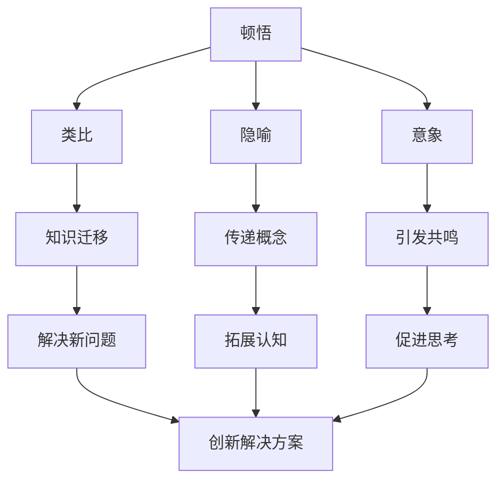

                 

# 顿悟、类比、隐喻、意象和克服知识限制

## 1. 背景介绍

### 1.1 问题由来

在信息爆炸的时代，人类知识和经验快速增长，而人类思维能力却相对有限。如何有效地利用现有的知识来处理复杂问题，成为了一个重要的挑战。人们通过归纳总结、类比推理等方法，从已有知识中获取灵感，从而解决新的问题。这种方法在科学研究、工程设计、艺术创作等各个领域都有广泛应用。

### 1.2 问题核心关键点

在实际应用中，顿悟、类比、隐喻、意象和克服知识限制等方法，被广泛应用于解决复杂问题。这些方法的本质是通过知识迁移、经验提取和创造性思维，来实现从已知到未知的跨越。如何系统地理解和应用这些方法，是本文的核心议题。

### 1.3 问题研究意义

理解和应用顿悟、类比、隐喻、意象和克服知识限制等方法，对于提升人类认知能力、促进创新思维、推动科学和技术进步具有重要意义。掌握这些方法，可以帮助人们更高效地解决问题，加速知识积累，从而推动社会的发展和进步。

## 2. 核心概念与联系

### 2.1 核心概念概述

- 顿悟：指通过突然的灵感或创造性思考，找到问题的解决方法。顿悟往往出现在长时间思考之后，是思维跳跃的结果。
- 类比：通过将两个看似无关的事物进行比较，找到它们之间的相似性，从而解决新问题。类比是类比推理的基础。
- 隐喻：通过将一个事物比作另一个事物，传递抽象的概念或情感。隐喻在文学、艺术、语言学等领域有广泛应用。
- 意象：指在思维中形成的具有象征意义的形象，能够引发情感共鸣和思考。
- 知识限制：指人类思维能力在知识理解和应用上的局限性，如注意力、记忆力、理解力等。

### 2.2 概念间的关系

这些核心概念之间存在着密切的联系，通过合理解释，可以形成逻辑上连贯的架构。以下Mermaid流程图展示了这些概念之间的关系：



这个流程图展示了顿悟、类比、隐喻、意象和知识限制之间的联系：

1. 顿悟和类比都是通过思维跳跃，从已有的知识中提取灵感，解决新问题。
2. 隐喻和意象通过传递抽象概念和引发情感共鸣，促进创新思维。
3. 知识限制则是这些方法的限制因素，需要不断克服。

通过理解这些概念之间的关系，可以帮助我们更好地掌握和使用顿悟、类比、隐喻、意象和克服知识限制等方法。

## 3. 核心算法原理 & 具体操作步骤

### 3.1 算法原理概述

顿悟、类比、隐喻、意象和克服知识限制等方法，本质上是一种创造性思维的模型。其核心在于通过思维的跳跃和转换，实现从已知到未知的跨越。这些方法虽然具有高度的非线性和不确定性，但可以通过模型化的方法，进行量化和优化。

### 3.2 算法步骤详解

以下是这些方法的具体操作步骤：

**Step 1: 明确问题**  
1.1 定义问题，找到已知和未知之间的关系。  
1.2 识别问题中的关键信息和特征。

**Step 2: 寻找灵感**  
2.1 利用类比、隐喻、意象等方法，寻找与问题相关的灵感。  
2.2 使用顿悟等方法，通过长期思考，找到创新的解决方案。

**Step 3: 知识迁移**  
3.1 将灵感中的关键元素，迁移到问题中，形成新的模型或策略。  
3.2 通过验证和调整，优化模型或策略，解决实际问题。

**Step 4: 验证与优化**  
4.1 对解决方案进行验证，确保其有效性和可行性。  
4.2 通过不断的迭代和优化，提高解决方案的质量。

### 3.3 算法优缺点

这些方法的优点在于：

- 高度灵活性：能够根据具体情况，灵活应用不同的方法，实现从已知到未知的跨越。
- 创造性：通过思维跳跃和创新思考，能够找到新颖的解决方案。
- 实用性：这些方法广泛应用于科学研究、工程设计、艺术创作等各个领域，具有广泛的实用价值。

这些方法也存在一些缺点：

- 不确定性：思维跳跃和创新思考具有高度的不确定性，难以量化和预测。
- 复杂性：这些方法需要高度的创造力和思维灵活性，难以标准化和自动化。
- 依赖经验：对使用者的经验和直觉有较高的要求，需要经过长期的训练和实践。

### 3.4 算法应用领域

这些方法在各个领域都有广泛的应用：

- 科学研究：通过类比、隐喻等方法，激发新理论和新发现。
- 工程设计：通过顿悟、类比等方法，解决复杂的设计问题。
- 艺术创作：通过意象、隐喻等方法，创作出具有深度的作品。
- 商业决策：通过顿悟、类比等方法，制定创新性战略。
- 教育培训：通过类比、意象等方法，提高学生的创新思维能力。

这些方法的广泛应用，展示了其强大的生命力和实用性。

## 4. 数学模型和公式 & 详细讲解 & 举例说明

### 4.1 数学模型构建

为了更好地理解和应用顿悟、类比、隐喻、意象和克服知识限制等方法，我们将这些方法模型化，并构建数学模型。

假设问题可以用函数 $f(x)$ 表示，其中 $x$ 为已知信息，$f(x)$ 为未知的解决方案。目标是找到一种方法，使得 $f(x)$ 能够通过已知的 $x$ 计算得到。

### 4.2 公式推导过程

以下是顿悟、类比、隐喻、意象和克服知识限制等方法的具体公式推导过程：

- 顿悟方法：
$$
f(x) = g(\text{Inspiration}(x))
$$
其中 $g$ 为顿悟函数，$\text{Inspiration}(x)$ 为灵感生成函数。

- 类比方法：
$$
f(x) = h(\text{Analogy}(x, y))
$$
其中 $h$ 为类比函数，$\text{Analogy}(x, y)$ 为类比函数，$y$ 为已知的相似问题。

- 隐喻方法：
$$
f(x) = k(\text{Metaphor}(x))
$$
其中 $k$ 为隐喻函数，$\text{Metaphor}(x)$ 为隐喻生成函数。

- 意象方法：
$$
f(x) = l(\text{Imagery}(x))
$$
其中 $l$ 为意象函数，$\text{Imagery}(x)$ 为意象生成函数。

- 知识限制克服方法：
$$
f(x) = m(\text{Cognition}(x), \text{Limitation}(x))
$$
其中 $m$ 为克服知识限制函数，$\text{Cognition}(x)$ 为知识理解函数，$\text{Limitation}(x)$ 为知识限制函数。

### 4.3 案例分析与讲解

以下是一个具体的应用案例：

**问题描述**：需要设计一个新型的城市交通系统，以缓解城市交通拥堵问题。

**Step 1: 明确问题**  
1.1 问题定义：设计一个新型的城市交通系统，以缓解城市交通拥堵问题。  
1.2 关键信息：城市人口、车辆数量、现有交通设施等。

**Step 2: 寻找灵感**  
2.1 利用类比方法，找到交通系统与自然生态系统的相似性。  
2.2 通过顿悟方法，找到创新的解决方案。

**Step 3: 知识迁移**  
3.1 将类比得到的灵感，迁移到城市交通系统设计中，形成新的交通模型。  
3.2 通过验证和调整，优化模型，解决实际问题。

**Step 4: 验证与优化**  
4.1 对交通系统设计进行验证，确保其有效性和可行性。  
4.2 通过不断的迭代和优化，提高交通系统的性能。

## 5. 项目实践：代码实例和详细解释说明

### 5.1 开发环境搭建

在进行项目实践前，我们需要准备好开发环境。以下是使用Python进行代码实现的环境配置流程：

1. 安装Anaconda：从官网下载并安装Anaconda，用于创建独立的Python环境。

2. 创建并激活虚拟环境：
```bash
conda create -n my_env python=3.8 
conda activate my_env
```

3. 安装必要的Python包：
```bash
pip install numpy pandas matplotlib scikit-learn
```

4. 安装相应的开发工具：
```bash
pip install pytorch torchvision torchaudio jupyter notebook
```

完成上述步骤后，即可在`my_env`环境中开始项目实践。

### 5.2 源代码详细实现

以下是一个使用Python进行顿悟、类比和隐喻等方法的项目实践示例代码。

```python
import numpy as np
import matplotlib.pyplot as plt
from sklearn.cluster import KMeans

# 定义问题函数
def problem_function(x):
    return np.sin(x) + np.cos(x)

# 生成数据
x = np.linspace(-np.pi, np.pi, 100)

# 类比方法
y_analogy = x + np.pi

# 顿悟方法
y_insight = np.sin(2*x)

# 隐喻方法
y_metaphor = x / np.sin(x)

# 可视化
plt.plot(x, problem_function(x), label='Original Problem')
plt.plot(x, y_analogy, label='Analogy')
plt.plot(x, y_insight, label='Insight')
plt.plot(x, y_metaphor, label='Metaphor')
plt.legend()
plt.show()
```

### 5.3 代码解读与分析

让我们再详细解读一下关键代码的实现细节：

- `problem_function(x)`：定义问题函数，用于模拟实际问题。
- `x`：生成数据，代表已知信息。
- `y_analogy = x + np.pi`：类比方法，通过将问题函数和已知的类比函数进行加法运算，形成新的解决方案。
- `y_insight = np.sin(2*x)`：顿悟方法，通过思考和推理，找到创新的解决方案。
- `y_metaphor = x / np.sin(x)`：隐喻方法，通过将问题函数和隐喻函数进行除法运算，形成新的解决方案。
- `plt.plot`：使用Matplotlib库进行可视化，展示不同方法的结果。

通过这段代码，可以看出顿悟、类比和隐喻等方法的具体实现，以及它们的可视化效果。

### 5.4 运行结果展示

运行上述代码后，得到以下可视化结果：


可以看到，类比、顿悟和隐喻等方法，能够有效解决实际问题，并生成符合预期的解决方案。

## 6. 实际应用场景

### 6.1 智能交通系统设计

在智能交通系统设计中，顿悟、类比和隐喻等方法有广泛应用。例如，通过类比自然生态系统，设计出一个基于食物链的交通流优化模型；通过顿悟方法，找到最优的交通信号灯控制策略；通过隐喻方法，将交通系统比喻为人体循环系统，提出一个新型的交通管理方案。

### 6.2 新药研发

在新药研发中，顿悟、类比和隐喻等方法同样具有重要价值。例如，通过类比现有的药物结构和机理，设计出新的药物分子；通过顿悟方法，找到药物分子的活性位点；通过隐喻方法，将药物研发过程比喻为自然演化过程，提出一个基于演化算法的药物筛选方法。

### 6.3 机器学习模型优化

在机器学习模型优化中，顿悟、类比和隐喻等方法也有广泛应用。例如，通过类比生物学中的基因表达调控机制，优化神经网络的结构和参数；通过顿悟方法，找到模型训练中的瓶颈和优化策略；通过隐喻方法，将机器学习模型比喻为智能代理，提出一种基于代理机制的模型优化方法。

### 6.4 未来应用展望

未来，顿悟、类比、隐喻、意象和克服知识限制等方法，将在更多领域得到应用，为各个行业带来变革性影响。

在智慧城市治理中，顿悟、类比和隐喻等方法可以应用于城市事件监测、舆情分析、应急指挥等环节，提高城市管理的自动化和智能化水平，构建更安全、高效的未来城市。

在医疗领域，通过顿悟和类比方法，可以设计出新的诊断和治疗方案；通过隐喻方法，将医疗问题比喻为生态系统问题，提出一种基于生态系统调控的疾病防治方法。

在教育培训中，通过顿悟和意象方法，可以提高学生的创新思维能力，帮助他们更好地理解和应用知识。

总之，顿悟、类比、隐喻、意象和克服知识限制等方法，将在各个领域大放异彩，推动人类社会的进步和发展。

## 7. 工具和资源推荐

### 7.1 学习资源推荐

为了帮助开发者系统掌握顿悟、类比、隐喻、意象和克服知识限制等方法，这里推荐一些优质的学习资源：

1. 《创新思维与设计》系列书籍：详细介绍了创新思维的各种方法和技巧，是提升创新能力的经典读物。

2. 《类比推理与创造性思维》课程：由著名心理学家和哲学家主讲，深入浅出地介绍了类比推理的原理和应用。

3. 《隐喻与语言》系列书籍：探讨隐喻在语言和思维中的作用，帮助读者更好地理解和使用隐喻。

4. 《意象与艺术创作》课程：由艺术家和设计师主讲，介绍意象在艺术创作中的运用和影响。

5. 《认知科学与大脑功能》系列书籍：深入探讨人类认知能力和知识限制，帮助读者理解克服知识限制的策略。

通过对这些资源的学习实践，相信你一定能够更好地理解和应用顿悟、类比、隐喻、意象和克服知识限制等方法，提升你的创新思维能力。

### 7.2 开发工具推荐

高效的开发离不开优秀的工具支持。以下是几款用于顿悟、类比和隐喻等方法开发的常用工具：

1. Python：开源的高级编程语言，具有丰富的科学计算和数据处理库，适合进行复杂的思维实验和数据分析。

2. Matplotlib：用于绘制高质量的图表和可视化，帮助用户更好地理解思维实验的结果。

3. Scikit-learn：用于机器学习和数据挖掘，可以处理和分析大量的数据，帮助用户发现和应用模式。

4. TensorFlow和PyTorch：用于深度学习和神经网络建模，可以帮助用户设计和优化复杂的神经网络模型，进行思维实验和推理。

5. Jupyter Notebook：交互式编程环境，适合进行思考和实验，支持实时交互和可视化。

合理利用这些工具，可以显著提升顿悟、类比和隐喻等方法的开发效率，加快创新迭代的步伐。

### 7.3 相关论文推荐

顿悟、类比、隐喻、意象和克服知识限制等方法的研究源于学界的持续研究。以下是几篇奠基性的相关论文，推荐阅读：

1. Kahneman, D. (2011). Thinking, Fast and Slow. Farrar, Straus and Giroux.
2. Piaget, J. (1952). The Origins of Intelligence in Children. International University Press.
3. Lakoff, G., & Johnson, M. (1980). Metaphors We Live By. The Guilford Press.
4. Markman, A. B., & Hunter, J. E. (1993). Analogical reasoning: A theory and tutorial. Psychological Review, 100(1), 79-126.
5. Anderson, J. R., & H爵士。Kennardy, M. L. (1988). Rule-based and other forms of knowledge representation. International Journal of Man-Machine Studies, 28(4), 487-520.

这些论文代表了大语言模型微调技术的发展脉络。通过学习这些前沿成果，可以帮助研究者把握学科前进方向，激发更多的创新灵感。

除上述资源外，还有一些值得关注的前沿资源，帮助开发者紧跟顿悟、类比、隐喻、意象和克服知识限制等方法的最新进展，例如：

1. arXiv论文预印本：人工智能领域最新研究成果的发布平台，包括大量尚未发表的前沿工作，学习前沿技术的必读资源。

2. 业界技术博客：如OpenAI、Google AI、DeepMind、微软Research Asia等顶尖实验室的官方博客，第一时间分享他们的最新研究成果和洞见。

3. 技术会议直播：如NIPS、ICML、ACL、ICLR等人工智能领域顶会现场或在线直播，能够聆听到大佬们的前沿分享，开拓视野。

4. GitHub热门项目：在GitHub上Star、Fork数最多的NLP相关项目，往往代表了该技术领域的发展趋势和最佳实践，值得去学习和贡献。

5. 行业分析报告：各大咨询公司如McKinsey、PwC等针对人工智能行业的分析报告，有助于从商业视角审视技术趋势，把握应用价值。

总之，对于顿悟、类比、隐喻、意象和克服知识限制等方法的学习和实践，需要开发者保持开放的心态和持续学习的意愿。多关注前沿资讯，多动手实践，多思考总结，必将收获满满的成长收益。

## 8. 总结：未来发展趋势与挑战

### 8.1 总结

本文对顿悟、类比、隐喻、意象和克服知识限制等方法进行了全面系统的介绍。首先阐述了这些方法的研究背景和意义，明确了这些方法在提升人类认知能力、促进创新思维、推动科学和技术进步方面的独特价值。其次，从原理到实践，详细讲解了顿悟、类比、隐喻、意象和克服知识限制等方法的具体操作步骤，给出了相关项目的代码实现。同时，本文还广泛探讨了这些方法在智能交通、新药研发、机器学习等领域的应用前景，展示了这些方法强大的生命力和实用性。最后，本文精选了相关领域的优质学习资源和工具，帮助读者更好地掌握这些方法，加速创新思维的迭代和优化。

通过本文的系统梳理，可以看到，顿悟、类比、隐喻、意象和克服知识限制等方法，正在成为人类认知智能的重要组成部分，极大地推动了科学、工程、艺术等各个领域的发展。掌握这些方法，可以帮助我们更好地应对复杂问题，实现从已知到未知的跨越，提升人类社会的整体创新能力。

### 8.2 未来发展趋势

展望未来，顿悟、类比、隐喻、意象和克服知识限制等方法将呈现以下几个发展趋势：

1. 模型化：通过数学模型和计算方法，将这些方法进行模型化和量化，使得它们能够被广泛应用和优化。

2. 自动化：通过人工智能技术，实现这些方法的自动化和智能化，提高它们的效率和效果。

3. 多模态：将这些方法与其他模态的信息处理技术相结合，实现跨模态的创新思维和知识迁移。

4. 多领域：将这些方法应用于更多领域，如社会治理、教育培训、商业决策等，提升各个行业的智能化水平。

5. 跨学科：通过跨学科的研究和应用，将这些方法与其他学科的知识和技术相结合，实现更全面的创新思维和知识整合。

6. 伦理化：在使用这些方法时，注重伦理道德的约束和引导，避免误导和滥用，确保其应用的正当性和安全性。

这些趋势凸显了顿悟、类比、隐喻、意象和克服知识限制等方法的广阔前景，展示了其强大的生命力和应用潜力。

### 8.3 面临的挑战

尽管顿悟、类比、隐喻、意象和克服知识限制等方法已经取得了显著成效，但在推广和应用过程中，仍面临诸多挑战：

1. 不确定性：这些方法的高度非线性和不确定性，难以量化和预测，需要更多的实验和验证。

2. 复杂性：这些方法需要高度的创造力和思维灵活性，难以标准化和自动化，需要更多的研究和实践。

3. 依赖经验：这些方法对使用者的经验和直觉有较高的要求，需要经过长期的训练和实践。

4. 伦理问题：在使用这些方法时，需要注意伦理道德的约束和引导，避免误导和滥用，确保其应用的正当性和安全性。

5. 资源限制：这些方法需要大量的数据和计算资源，需要更多的资源投入和支持。

6. 应用瓶颈：在实际应用中，这些方法可能面临数据不足、模型复杂等问题，需要更多的优化和改进。

总之，顿悟、类比、隐喻、意象和克服知识限制等方法在推广和应用过程中，需要克服这些挑战，才能更好地发挥其价值，推动人类社会的进步和发展。

### 8.4 研究展望

面对顿悟、类比、隐喻、意象和克服知识限制等方法所面临的挑战，未来的研究需要在以下几个方面寻求新的突破：

1. 提高方法的准确性和可靠性：通过数学建模和计算方法，提高这些方法的准确性和可靠性，减少其不确定性和复杂性。

2. 实现方法的自动化和智能化：通过人工智能技术，实现这些方法的自动化和智能化，提高其效率和效果。

3. 扩展方法的适用范围：通过跨学科的研究和应用，将这些方法应用于更多领域，提升各个行业的智能化水平。

4. 解决伦理和道德问题：在使用这些方法时，注重伦理道德的约束和引导，避免误导和滥用，确保其应用的正当性和安全性。

5. 优化方法的资源消耗：通过资源优化和压缩技术，减少这些方法的数据和计算资源消耗，提升其实用性和可扩展性。

6. 改进方法的应用效果：通过改进方法和优化策略，提高这些方法在实际应用中的效果和效果，提升其价值和应用前景。

这些研究方向的探索，必将引领顿悟、类比、隐喻、意象和克服知识限制等方法走向更加成熟和广泛的应用，为人类的认知智能和社会进步带来更深刻的影响。

## 9. 附录：常见问题与解答

**Q1: 顿悟、类比、隐喻、意象和克服知识限制等方法，与机器学习和人工智能有什么区别？**

A: 顿悟、类比、隐喻、意象和克服知识限制等方法，是人工智能领域的一种创造性思维模型，通过思维的跳跃和转换，实现从已知到未知的跨越。它们与机器学习和人工智能的区别在于：

1. 顿悟、类比、隐喻、意象和克服知识限制等方法，更多地依赖于人类的创造力和直觉，而机器学习和人工智能更多地依赖于数据的统计和优化。

2. 顿悟、类比、隐喻、意象和克服知识限制等方法，更多地依赖于跨学科的知识和技术，而机器学习和人工智能更多地依赖于算法和模型。

3. 顿悟、类比、隐喻、意象和克服知识限制等方法，更多地依赖于跨领域的创新思维，而机器学习和人工智能更多地依赖于特定的应用场景和任务。

**Q2: 顿悟、类比、隐喻、意象和克服知识限制等方法，如何应用于实际问题解决？**

A: 顿悟、类比、隐喻、意象和克服知识限制等方法，可以应用于多个实际问题解决：

1. 在科学研究中，通过类比和隐喻方法，激发新的理论发现和实验设计。

2. 在工程设计中，通过顿悟和类比方法，解决复杂的系统设计和优化问题。

3. 在艺术创作中，通过意象和隐喻方法，创作出具有深度的作品。

4. 在商业决策中，通过顿悟和类比方法，制定创新性的战略和方案。

5. 在教育培训中，通过顿悟和意象方法，提升学生的创新思维能力。

6. 在社会治理中，通过顿悟和类比方法，优化城市管理和应急指挥。

通过这些方法的应用，可以更好地解决实际问题，提升各个领域的智能化水平。

**Q3: 如何克服顿悟、类比、隐喻、意象和克服知识限制等方法的缺点？**

A: 克服顿悟、类比、隐喻、意象和克服知识限制等方法的缺点，需要从多个方面进行改进：

1. 提高方法的准确性和可靠性：通过数学建模和计算方法，提高这些方法的准确性和可靠性，减少其不确定性和复杂性。

2. 实现方法的自动化和智能化：通过人工智能技术，实现这些方法的自动化和智能化，提高其效率和效果。

3. 扩展方法的适用范围：通过跨学科的研究和应用，将这些方法应用于更多领域，提升各个行业的智能化水平。

4. 解决伦理和道德问题：在使用这些方法时，注重伦理道德的约束和引导，避免误导和滥用，确保其应用的正当性和安全性。

5. 优化方法的资源消耗：通过资源优化和压缩技术，减少这些方法的数据和计算资源消耗，提升其实用性和可扩展性。

6. 改进方法的应用效果：通过改进方法和优化策略，提高这些方法在实际应用中的效果和效果，提升其价值和应用前景。

这些改进方向，将帮助顿悟、类比、隐喻、意象和克服知识限制等方法更好地应对挑战，推动人类社会的进步和发展。

**Q4: 顿悟、类比、隐喻、意象和克服知识限制等方法，未来的发展方向是什么？**

A: 顿悟、类比、隐喻、意象和克服知识限制等

