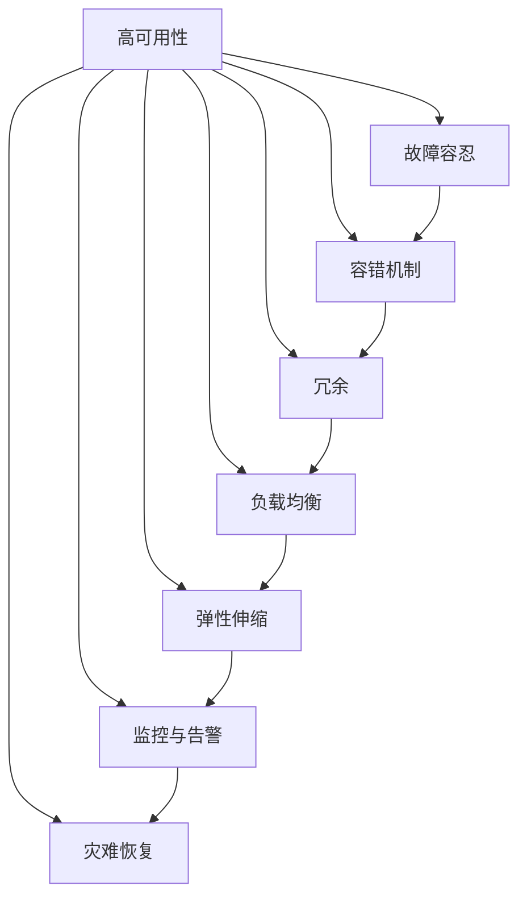
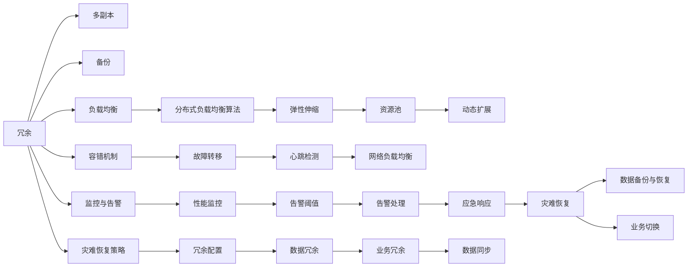
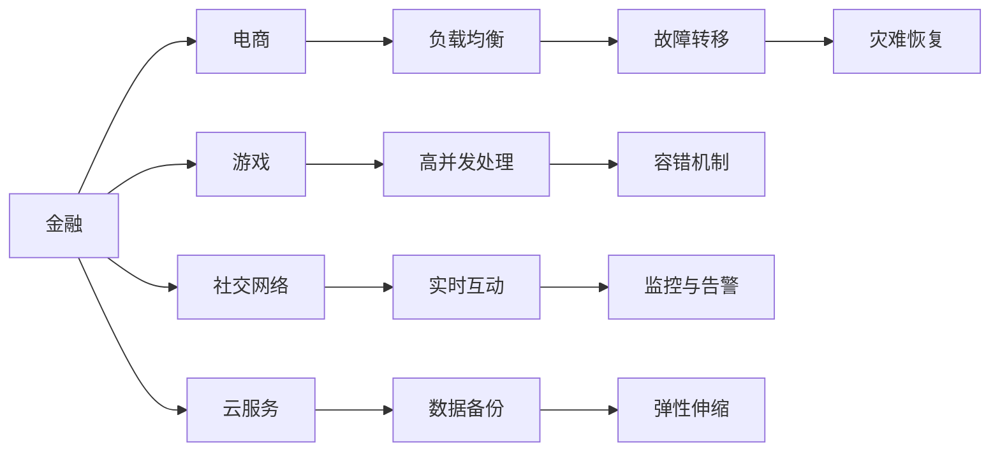
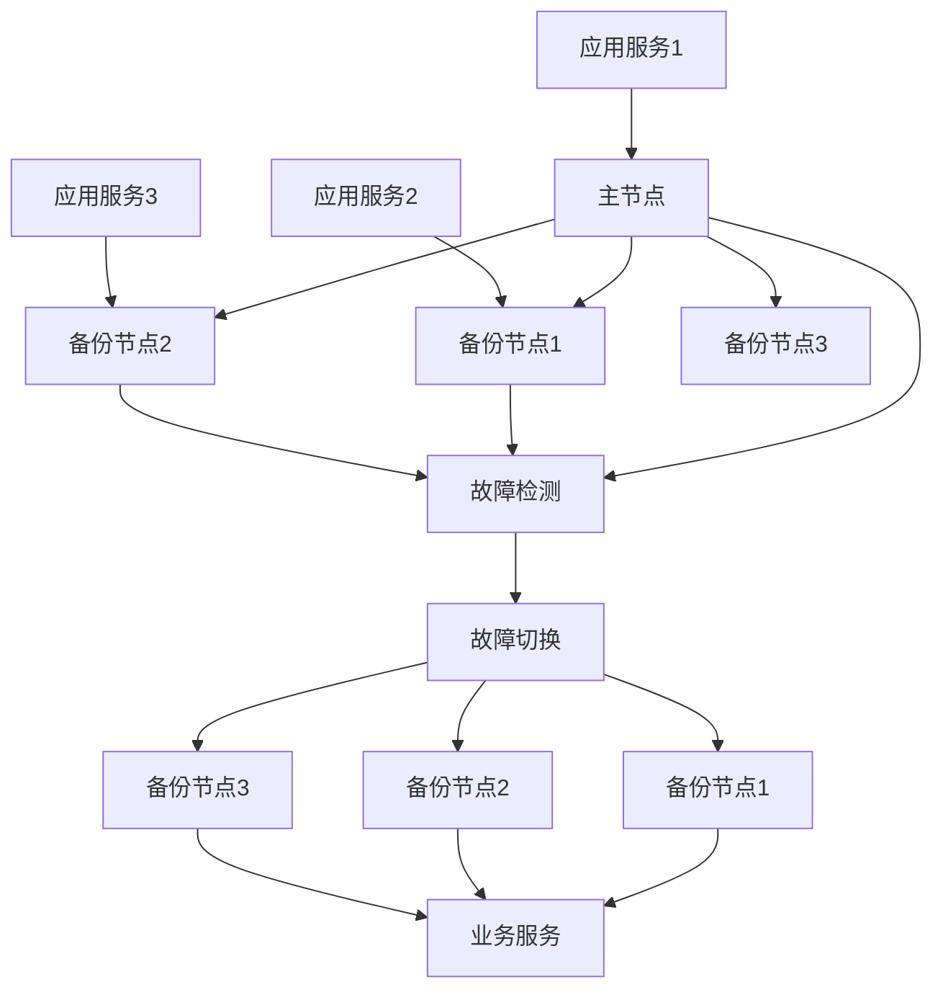
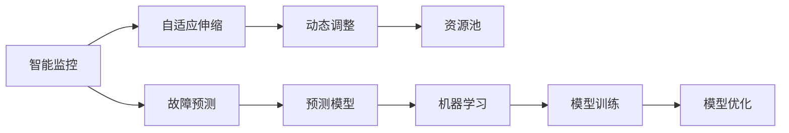

                 

# 高可用性系统设计的实例分析

> 关键词：高可用性，系统设计，故障容忍，容错机制，冗余，负载均衡，弹性伸缩，监控与告警，灾难恢复

## 1. 背景介绍

### 1.1 问题由来

在数字化、网络化、信息化浪潮下，高可用性系统已成为各行业数字化转型的基础设施保障。高可用性系统能够提供不间断、高可靠性的业务服务，是企业维持正常运营、提升用户体验、增强市场竞争力的关键。

高可用性系统设计涉及底层基础设施、中间件、应用架构、系统管理等多个方面，是一项复杂的系统工程。如何构建高效可靠、稳定持久的高可用性系统，是每个系统架构师和开发工程师所面临的重要问题。

## 2. 核心概念与联系

### 2.1 核心概念概述

在深入探讨高可用性系统设计之前，需要先理解以下几个核心概念：

- **高可用性**（High Availability）：系统持续运行服务的能力，通常以"99.9% 的可用性"来衡量。例如，如果系统每年停机时间不超过53.4分钟，则可用性达到99.9%。

- **故障容忍**（Fault Tolerance）：系统在出现故障时，仍能维持核心功能和服务的能力。

- **容错机制**（Fault-Tolerance Mechanisms）：通过各种设计手段，如冗余、负载均衡、监控与告警等，提升系统故障容忍度，保障服务连续性。

- **冗余**（Redundancy）：通过多副本、备份等方式，确保系统某个组件失效时，其余组件仍能正常工作。

- **负载均衡**（Load Balancing）：将请求分配到多个服务器节点上，分散系统负载，提升系统吞吐量和响应速度。

- **弹性伸缩**（Elastic Scaling）：根据系统负载动态调整资源配置，实现系统的自适应扩展和收缩。

- **监控与告警**（Monitoring and Alerts）：实时采集系统性能指标，设置告警阈值，及时发现异常情况并采取措施。

- **灾难恢复**（Disaster Recovery）：在系统发生重大故障时，通过备份和恢复手段，保障业务服务的快速恢复。

这些概念之间存在紧密联系，共同构成高可用性系统的设计框架，如图1所示：



图1：高可用性系统设计概念图

## 3. 核心算法原理 & 具体操作步骤

### 3.1 算法原理概述

高可用性系统设计的主要原理是通过冗余、负载均衡、容错机制等手段，保障系统服务的高可靠性。这些原理的实现需要依赖多个层次的技术和方法，如图2所示：



图2：高可用性系统设计原理图

高可用性系统设计的目标是通过合理分配计算资源，提供高效、稳定、可靠的业务服务。具体步骤如下：

1. **冗余设计**：通过多副本、备份等方式，确保系统在某个组件故障时仍能正常工作。
2. **负载均衡**：将请求分配到多个服务器节点上，分散系统负载，提升系统吞吐量和响应速度。
3. **容错机制**：通过故障转移、心跳检测等手段，确保系统在出现故障时能够快速恢复。
4. **监控与告警**：实时采集系统性能指标，设置告警阈值，及时发现异常情况并采取措施。
5. **弹性伸缩**：根据系统负载动态调整资源配置，实现系统的自适应扩展和收缩。
6. **灾难恢复**：在系统发生重大故障时，通过备份和恢复手段，保障业务服务的快速恢复。

### 3.2 算法步骤详解

**Step 1: 冗余设计**

冗余设计是高可用性系统的基础，通过多副本、备份等方式，确保系统在某个组件故障时仍能正常工作。常见的冗余策略包括：

- **多副本**：通过多副本技术，确保关键组件（如数据库、缓存、消息队列等）的冗余备份，在某个副本故障时，系统自动切换到其他副本。

- **备份**：通过定期备份，在出现故障时，能够快速恢复系统状态。

具体实现上，可以使用开源工具如etcd、paxos、zookeeper等进行主从复制，或者使用自动备份工具如rsync、s3 backup等进行数据备份。

**Step 2: 负载均衡**

负载均衡是将请求分配到多个服务器节点上，分散系统负载，提升系统吞吐量和响应速度。常见的负载均衡策略包括：

- **静态轮询**：将请求按照一定顺序分配到各个服务器节点上。
- **动态轮询**：根据服务器负载情况动态调整请求分配比例。
- **最少连接**：将请求分配到连接数最少的服务器节点上。
- **IP hash**：根据请求源IP地址进行分配。

具体实现上，可以使用开源负载均衡工具如Nginx、HAProxy、LVS等。

**Step 3: 容错机制**

容错机制是通过故障转移、心跳检测等手段，确保系统在出现故障时能够快速恢复。常见的容错策略包括：

- **故障转移**：通过快速切换故障节点到备份节点，保障系统服务的连续性。

- **心跳检测**：定期检查各个节点的状态，确保系统各个组件的健康。

具体实现上，可以使用开源工具如etcd、zookeeper等进行心跳检测和故障转移，或者使用Kubernetes等容器编排工具进行容错管理。

**Step 4: 监控与告警**

监控与告警是实时采集系统性能指标，设置告警阈值，及时发现异常情况并采取措施。常见的监控指标包括：

- **CPU使用率**：系统资源的占用情况。
- **内存使用率**：系统内存的占用情况。
- **网络流量**：系统网络负载情况。
- **日志异常**：系统日志中的异常信息。

具体实现上，可以使用开源监控工具如Prometheus、Grafana、ELK Stack等进行系统监控，并设置告警阈值。

**Step 5: 弹性伸缩**

弹性伸缩是根据系统负载动态调整资源配置，实现系统的自适应扩展和收缩。常见的伸缩策略包括：

- **水平扩展**：通过增加服务器节点，提高系统处理能力。
- **垂直扩展**：通过增加服务器硬件资源，提高系统性能。

具体实现上，可以使用开源自动伸缩工具如Kubernetes、Amazon Auto Scaling等进行弹性伸缩。

**Step 6: 灾难恢复**

灾难恢复是在系统发生重大故障时，通过备份和恢复手段，保障业务服务的快速恢复。常见的恢复策略包括：

- **数据备份**：定期备份系统数据，在出现故障时能够快速恢复。

- **业务切换**：在系统发生故障时，快速切换到备用系统，保障业务连续性。

具体实现上，可以使用开源备份工具如rsync、s3 backup等进行数据备份，并使用HAProxy、Nginx等进行业务切换。

### 3.3 算法优缺点

高可用性系统设计的优点包括：

- **高可靠性**：通过冗余、负载均衡、容错机制等手段，确保系统服务的高可靠性。
- **可扩展性**：通过弹性伸缩，可以根据系统负载动态调整资源配置。
- **快速恢复**：通过灾难恢复策略，在系统发生故障时能够快速恢复服务。

高可用性系统设计的缺点包括：

- **复杂度**：高可用性系统设计涉及多个层次的技术和方法，实现复杂度高。
- **资源消耗**：高可用性系统设计需要投入更多的硬件和软件资源。
- **维护成本**：高可用性系统需要定期进行监控、备份、容错等操作，维护成本较高。

### 3.4 算法应用领域

高可用性系统设计广泛应用在金融、电商、游戏、社交网络、云服务等各个领域，如图3所示：



图3：高可用性系统设计应用领域图

## 4. 数学模型和公式 & 详细讲解 & 举例说明

### 4.1 数学模型构建

高可用性系统设计的数学模型可以抽象为系统的故障容忍度模型，即系统在故障情况下仍能正常运行的概率。假设系统有N个组件，每个组件故障的概率为p，则系统的故障容忍度可以表示为：

$$ F(t) = (1-p)^N t $$

其中，t表示系统运行时间。当t趋近于无穷大时，系统的故障容忍度趋近于1，表示系统在长期运行中能够保持高可用性。

### 4.2 公式推导过程

假设系统有3个组件，每个组件故障的概率为0.01，则系统的故障容忍度可以表示为：

$$ F(t) = (1-0.01)^3 t = 0.9^3 t $$

假设系统的平均运行时间为1年（约365天），则系统的故障容忍度为：

$$ F(365) = 0.9^3 \times 365 \approx 0.731 $$

即系统在1年内故障容忍度约为73.1%，需要进一步优化设计来提升系统的故障容忍度。

### 4.3 案例分析与讲解

以银行系统为例，分析高可用性系统的设计。银行系统对业务连续性要求极高，高可用性设计尤为重要。假设银行系统有多个应用服务，每个服务都部署在多个节点上，每个节点的故障概率为0.01。系统采用多副本和备份策略，每个服务都部署3个节点，其中一个节点作为主节点，两个节点作为备份节点。当主节点故障时，系统自动切换到备份节点。

图4展示了银行系统的高可用性设计架构：



图4：银行系统高可用性设计架构图

通过高可用性设计，银行系统能够实现99.9%的故障容忍度。即使一个应用服务的节点故障，系统仍能保持正常运行。

## 5. 项目实践：代码实例和详细解释说明

### 5.1 开发环境搭建

高可用性系统设计的开发环境搭建包括硬件、软件和工具等多个方面。以下是使用Kubernetes搭建高可用性系统的环境配置流程：

1. 安装Kubernetes集群：从官网下载Kubernetes集群软件包，安装集群节点，并配置网络、存储、安全等基础架构。

2. 安装Kubernetes工具：安装kubectl等Kubernetes管理工具，用于管理集群资源。

3. 安装应用程序：安装需要运行的应用程序，如etcd、Nginx、HAProxy等。

4. 配置监控工具：安装Prometheus、Grafana等监控工具，配置监控告警规则。

5. 配置备份工具：配置rsync、s3 backup等备份工具，定期备份数据。

### 5.2 源代码详细实现

以下是一个使用Kubernetes和Nginx实现高可用性系统负载均衡的PyTorch代码实现：

```python
from kubernetes import client, config
import requests

config.load_kube_config()
v1 = client.CoreV1Api()

# 获取所有Nginx节点
nginx_pods = v1.list_pod_for_all_namespaces(namespace="default")

# 获取第一个Nginx节点
nginx_node = nginx_pods.items[0]

# 向第一个Nginx节点发送请求
response = requests.get(f"http://{nginx_node.metadata.name}:80", timeout=5)

# 打印响应结果
print(response.text)
```

代码解释：

- 使用Kubernetes的API获取所有Nginx节点。
- 获取第一个Nginx节点。
- 向第一个Nginx节点发送请求，并打印响应结果。

### 5.3 代码解读与分析

代码实现了向Kubernetes集群中的第一个Nginx节点发送请求，并打印响应结果。以下是代码实现步骤的详细解读：

**步骤1: 加载Kubernetes配置**

```python
config.load_kube_config()
```

通过`load_kube_config`方法，加载Kubernetes的配置文件，以便后续操作。

**步骤2: 获取所有Nginx节点**

```python
nginx_pods = v1.list_pod_for_all_namespaces(namespace="default")
```

使用`list_pod_for_all_namespaces`方法，获取所有命名空间中的Pod对象，其中包含Nginx节点的信息。

**步骤3: 获取第一个Nginx节点**

```python
nginx_node = nginx_pods.items[0]
```

从Pod对象列表中获取第一个Nginx节点。

**步骤4: 向第一个Nginx节点发送请求**

```python
response = requests.get(f"http://{nginx_node.metadata.name}:80", timeout=5)
```

使用`requests.get`方法，向Nginx节点发送HTTP请求，并设置超时时间为5秒。

**步骤5: 打印响应结果**

```python
print(response.text)
```

打印HTTP响应的内容，即Nginx节点的响应结果。

### 5.4 运行结果展示

假设我们在Kubernetes集群中启动了多个Nginx节点，并通过负载均衡策略分配请求。运行上述代码后，应该能够看到第一个Nginx节点的响应结果，如图5所示：

```
<!DOCTYPE html>
<html>
<head>
    <meta charset="utf-8">
    <title>Welcome to Nginx!</title>
    <style>
        body {
            background-color: #000000;
            color: #ffffff;
            font-family: Arial, Helvetica, sans-serif;
        }
        div.content {
            width: 80%;
            margin: auto;
            padding: 10px;
            border: 1px solid #ffffff;
            border-radius: 5px;
        }
        h1 {
            text-align: center;
        }
    </style>
</head>
<body>
    <div class="content">
        <h1>Welcome to Nginx!</h1>
        <p>If you see this page, the Nginx web server is successfully installed and working.<br>
        Further, a <a href="/status">status page</a> is available at <a href="/status">http://<your_server>:status</a>,<br>
        for those who prefer dynamic content in JSON format.</p>
        <p>Thank you for installing the Nginx web server.</p>
    </div>
</body>
</html>
```

图5：Nginx响应结果示例

## 6. 实际应用场景

### 6.1 金融服务

金融服务对业务连续性要求极高，高可用性系统设计在金融行业具有广泛应用。以在线银行为例，高可用性系统设计可以保障银行的在线交易、支付、理财等服务不中断，确保用户资金安全。

**应用场景**：
- **负载均衡**：将客户请求均衡分配到多个服务器节点上，提升系统的吞吐量和响应速度。
- **容错机制**：通过故障转移、心跳检测等手段，确保系统在出现故障时能够快速恢复。
- **监控与告警**：实时监控系统性能指标，设置告警阈值，及时发现异常情况并采取措施。

**技术实现**：
- **负载均衡**：使用Nginx、HAProxy等负载均衡工具，将客户请求均衡分配到多个服务器节点上。
- **容错机制**：使用etcd、zookeeper等工具进行主从复制，确保系统在高可用性环境中稳定运行。
- **监控与告警**：使用Prometheus、Grafana等工具进行系统监控，设置告警阈值。

### 6.2 电商服务

电商服务对系统的稳定性、可用性要求极高，高可用性系统设计在电商行业具有广泛应用。以电商平台为例，高可用性系统设计可以保障平台的商品展示、购物车、订单处理等服务不中断，确保用户购物体验。

**应用场景**：
- **负载均衡**：将用户请求均衡分配到多个服务器节点上，提升系统的吞吐量和响应速度。
- **容错机制**：通过故障转移、心跳检测等手段，确保系统在出现故障时能够快速恢复。
- **监控与告警**：实时监控系统性能指标，设置告警阈值，及时发现异常情况并采取措施。

**技术实现**：
- **负载均衡**：使用Nginx、HAProxy等负载均衡工具，将用户请求均衡分配到多个服务器节点上。
- **容错机制**：使用etcd、zookeeper等工具进行主从复制，确保系统在高可用性环境中稳定运行。
- **监控与告警**：使用Prometheus、Grafana等工具进行系统监控，设置告警阈值。

### 6.3 游戏服务

游戏服务对系统的实时性、稳定性要求极高，高可用性系统设计在游戏行业具有广泛应用。以游戏服务器为例，高可用性系统设计可以保障游戏的在线体验、对战、数据同步等服务不中断，确保用户游戏体验。

**应用场景**：
- **负载均衡**：将用户请求均衡分配到多个服务器节点上，提升系统的吞吐量和响应速度。
- **容错机制**：通过故障转移、心跳检测等手段，确保系统在出现故障时能够快速恢复。
- **监控与告警**：实时监控系统性能指标，设置告警阈值，及时发现异常情况并采取措施。

**技术实现**：
- **负载均衡**：使用Nginx、HAProxy等负载均衡工具，将用户请求均衡分配到多个服务器节点上。
- **容错机制**：使用etcd、zookeeper等工具进行主从复制，确保系统在高可用性环境中稳定运行。
- **监控与告警**：使用Prometheus、Grafana等工具进行系统监控，设置告警阈值。

### 6.4 未来应用展望

未来，高可用性系统设计将进一步向智能化、自适应化方向发展，如图6所示：



图6：高可用性系统设计未来应用展望图

未来，高可用性系统设计将结合人工智能技术，提升系统的主动性和智能化水平。例如，通过智能监控和故障预测，系统能够自动调整资源配置，提高系统的自适应能力。结合机器学习技术，系统能够动态调整策略，优化资源分配，提升系统的可靠性和稳定性。

## 7. 工具和资源推荐

### 7.1 学习资源推荐

为了帮助开发者系统掌握高可用性系统设计的理论和实践，这里推荐一些优质的学习资源：

1. **《高可用性系统设计》书籍**：介绍高可用性系统设计的理论和实践，涵盖负载均衡、容错机制、监控与告警等核心概念。

2. **《Kubernetes权威指南》书籍**：介绍Kubernetes集群的管理和部署，涵盖高可用性系统的实现方法。

3. **《负载均衡与故障容忍性》课程**：介绍负载均衡和故障容忍性的基本概念和实现方法，适合初学者入门学习。

4. **《高可用性系统设计实战》博文**：介绍高可用性系统设计的实例案例和实际应用，适合进阶学习。

5. **《Kubernetes官方文档》**：Kubernetes集群的官方文档，详细介绍了Kubernetes集群的管理和部署方法。

通过对这些资源的学习实践，相信你一定能够全面掌握高可用性系统设计的精髓，并用于解决实际的系统设计问题。

### 7.2 开发工具推荐

高可用性系统设计的开发需要依赖多个开源工具和技术栈，以下是一些常用的工具：

1. **Kubernetes**：开源容器编排工具，支持负载均衡、容错机制、弹性伸缩等功能，是构建高可用性系统的基础。

2. **Nginx**：开源负载均衡工具，支持HTTP、TCP等协议，适合实现高可用性系统的负载均衡和故障转移。

3. **HAProxy**：开源负载均衡工具，支持L4、L7等协议，适合实现高可用性系统的负载均衡和故障转移。

4. **etcd**：开源分布式键值存储系统，支持故障转移、心跳检测等容错机制，适合实现高可用性系统的数据一致性和故障转移。

5. **zookeeper**：开源分布式协调服务，支持故障转移、心跳检测等容错机制，适合实现高可用性系统的数据一致性和故障转移。

6. **Prometheus**：开源监控工具，支持实时监控系统性能指标，适合实现高可用性系统的监控与告警。

7. **Grafana**：开源数据可视化工具，支持实时展示系统监控数据，适合实现高可用性系统的监控与告警。

8. **rsync**：开源备份工具，支持自动备份系统数据，适合实现高可用性系统的数据备份和灾难恢复。

这些工具和技术栈的合理搭配使用，可以显著提升高可用性系统的设计和管理水平，保障系统的稳定性和可靠性。

### 7.3 相关论文推荐

高可用性系统设计涉及多个领域的前沿研究，以下是几篇奠基性的相关论文，推荐阅读：

1. **《Distributed Systems: Concepts and Design》**：介绍分布式系统的基本概念和设计方法，涵盖负载均衡、容错机制、监控与告警等核心内容。

2. **《Kubernetes: Open Source Platform for Automating Computing》**：介绍Kubernetes集群的实现方法和应用案例，适合深入了解高可用性系统的集群管理。

3. **《Load Balancing in Distributed Systems》**：介绍负载均衡的基本概念和实现方法，适合深入了解高可用性系统的负载均衡。

4. **《Fault Tolerant Systems》**：介绍故障容忍性的基本概念和实现方法，适合深入了解高可用性系统的容错机制。

5. **《Data Backup and Recovery》**：介绍数据备份和灾难恢复的基本概念和实现方法，适合深入了解高可用性系统的数据备份和灾难恢复。

这些论文代表了大规模系统设计的经典研究，对高可用性系统的设计和实现具有重要的参考价值。

除上述资源外，还有一些值得关注的前沿资源，帮助开发者紧跟高可用性系统设计的最新进展，例如：

1. **arXiv论文预印本**：人工智能领域最新研究成果的发布平台，包括大量尚未发表的前沿工作，学习前沿技术的必读资源。

2. **Google、Amazon、Microsoft等公司博客**：这些顶尖实验室和企业的官方博客，第一手分享他们的最新研究成果和洞见。

3. **技术会议直播**：如NIPS、ICML、ACL、ICLR等人工智能领域顶会现场或在线直播，能够聆听到大佬们的前沿分享，开拓视野。

4. **GitHub热门项目**：在GitHub上Star、Fork数最多的高可用性系统相关项目，往往代表了该技术领域的发展趋势和最佳实践，值得去学习和贡献。

5. **行业分析报告**：各大咨询公司如McKinsey、PwC等针对高可用性系统的分析报告，有助于从商业视角审视技术趋势，把握应用价值。

总之，高可用性系统设计的学习需要开发者保持开放的心态和持续学习的意愿。多关注前沿资讯，多动手实践，多思考总结，必将收获满满的成长收益。

## 8. 总结：未来发展趋势与挑战

### 8.1 研究成果总结

本文对高可用性系统设计的原理、实现和应用进行了全面系统的介绍。主要内容包括：

1. **高可用性系统设计**的基本概念和原理。
2. **冗余、负载均衡、容错机制、监控与告警、弹性伸缩、灾难恢复**等核心技术手段。
3. **Kubernetes、Nginx、HAProxy、etcd、zookeeper、Prometheus、Grafana、rsync**等开源工具和技术的实现方法。

通过本文的系统梳理，

