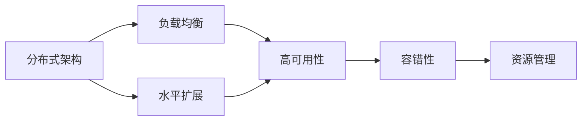
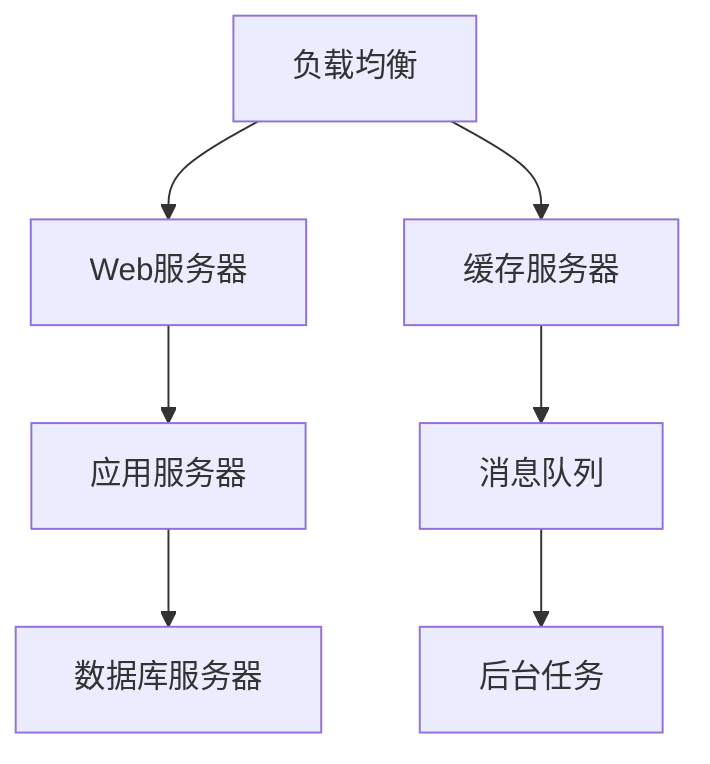

                 

# 高吞吐量系统设计的最佳实践

高吞吐量系统（High Throughput Systems）是指能够快速、高效、稳定地处理大量请求的系统，通常用于处理海量数据和高并发场景，例如搜索引擎、电商交易系统、实时数据处理平台等。本文将详细介绍高吞吐量系统设计的最佳实践，包括核心概念、算法原理、具体操作步骤、数学模型、实际应用场景、工具和资源推荐，以及未来发展趋势和挑战。

## 1. 背景介绍

### 1.1 问题由来

随着互联网和移动互联网的发展，各类在线服务和应用的访问量迅速增长，对系统的高吞吐量需求日益增加。传统单体架构往往难以应对不断增长的请求量，容易出现瓶颈、故障和扩展性差等问题。因此，如何设计高效、可扩展、稳定可靠的高吞吐量系统，成为了当前IT行业的重要课题。

### 1.2 问题核心关键点

高吞吐量系统设计的关键在于以下几个方面：
- **负载均衡**：通过分布式架构，将请求分散到多个节点进行处理，避免单点故障。
- **水平扩展**：通过增加服务器数量，提高系统的处理能力，适应负载的动态变化。
- **高可用性**：通过多副本、故障转移、自动恢复等手段，保证系统的连续可用。
- **容错性**：设计容错机制，如自动重试、异步处理、状态机等，提升系统的健壮性。
- **资源管理**：精细化资源管理，如内存管理、CPU管理、网络管理等，优化性能。

## 2. 核心概念与联系

### 2.1 核心概念概述

高吞吐量系统设计涉及多个核心概念，包括：

- **分布式架构**：通过多个服务器组成分布式集群，提高系统的处理能力和扩展性。
- **负载均衡**：将请求均衡地分配到各个服务器，避免单点瓶颈。
- **水平扩展**：通过增加服务器数量，提高系统的吞吐量。
- **高可用性**：通过多副本、故障转移、自动恢复等手段，保证系统的连续可用。
- **容错性**：通过设计容错机制，提升系统的健壮性。
- **资源管理**：优化系统资源的使用，提高性能。

这些概念相互关联，共同构成了高吞吐量系统的核心设计思想。

### 2.2 概念间的关系

以下是一个简化的Mermaid流程图，展示核心概念之间的关系：



这个流程图展示了各个概念之间的逻辑关系：
- 分布式架构是基础，负载均衡和水平扩展是其核心技术手段。
- 高可用性和容错性是系统的关键保障，确保系统的连续可用和健壮性。
- 资源管理是提升性能的重要手段，与负载均衡和水平扩展相辅相成。

### 2.3 核心概念的整体架构

高吞吐量系统的整体架构可以概括为以下几部分：



这个架构展示了高吞吐量系统的核心组件及其相互关系：
- 负载均衡负责分配请求到Web服务器。
- Web服务器将请求转发到应用服务器进行处理。
- 应用服务器调用数据库服务器进行数据存储和查询。
- 缓存服务器用于缓存热点数据，减轻数据库的压力。
- 消息队列用于异步处理任务，提升系统吞吐量。
- 后台任务负责后台计算、定时任务等耗时操作。

这些组件相互配合，共同构建了一个高效、可扩展、可靠的高吞吐量系统。

## 3. 核心算法原理 & 具体操作步骤

### 3.1 算法原理概述

高吞吐量系统设计的核心算法原理包括负载均衡、水平扩展、高可用性、容错性、资源管理等。

**负载均衡**：常用的负载均衡算法包括轮询、随机、加权轮询、IP哈希等。

**水平扩展**：通过增加服务器数量，水平扩展是提升系统吞吐量的有效手段。

**高可用性**：常用的高可用性策略包括多副本、故障转移、自动恢复等。

**容错性**：常用的容错机制包括自动重试、异步处理、状态机等。

**资源管理**：常用的资源管理技术包括内存管理、CPU管理、网络管理等。

### 3.2 算法步骤详解

以下是高吞吐量系统设计的详细步骤：

1. **需求分析**：
   - 确定系统的负载、业务需求、用户需求等，进行系统设计和架构规划。
   - 评估系统的可扩展性和扩展方式。

2. **分布式架构设计**：
   - 设计分布式架构，确定组件之间的关系和通信方式。
   - 选择合适的高可用性和容错性策略。

3. **负载均衡设计**：
   - 选择适合的负载均衡算法，设计负载均衡器。
   - 实现负载均衡器的算法和数据结构。

4. **水平扩展设计**：
   - 确定系统的扩展方式，选择扩展机制。
   - 设计扩展策略，实现自动扩缩容机制。

5. **高可用性设计**：
   - 设计高可用性策略，包括多副本、故障转移、自动恢复等。
   - 实现高可用性策略，确保系统的连续可用。

6. **容错性设计**：
   - 设计容错机制，如自动重试、异步处理、状态机等。
   - 实现容错机制，提升系统的健壮性。

7. **资源管理设计**：
   - 优化资源使用，如内存管理、CPU管理、网络管理等。
   - 设计资源管理机制，提高系统性能。

### 3.3 算法优缺点

高吞吐量系统设计的优缺点如下：

**优点**：
- 通过分布式架构和水平扩展，系统具有高可扩展性。
- 高可用性和容错性策略保证了系统的连续可用和健壮性。
- 资源管理优化了系统性能，提高了系统的吞吐量。

**缺点**：
- 设计复杂，需要考虑多个组件和策略。
- 维护复杂，需要不断监控和调优。
- 资源消耗较大，需要较高的硬件投入。

### 3.4 算法应用领域

高吞吐量系统设计广泛应用于以下领域：

- **搜索引擎**：如Google、Baidu等，需要处理海量搜索请求。
- **电商交易系统**：如Amazon、淘宝等，需要处理高并发交易请求。
- **实时数据处理平台**：如Apache Kafka、Apache Spark等，需要处理海量数据流。
- **大数据分析平台**：如Hadoop、Spark等，需要高效处理大数据集。
- **云计算平台**：如AWS、阿里云等，需要提供高性能计算和存储服务。

## 4. 数学模型和公式 & 详细讲解 & 举例说明

### 4.1 数学模型构建

高吞吐量系统设计涉及多个数学模型，包括负载均衡模型、扩展模型、高可用性模型等。

#### 4.1.1 负载均衡模型

负载均衡算法可以表示为：

$$
F_{\text{load balance}} = f(\text{requests}, \text{servers}, \text{algorithms})
$$

其中，$\text{requests}$ 表示请求数量，$\text{servers}$ 表示服务器数量，$\text{algorithms}$ 表示负载均衡算法。

#### 4.1.2 扩展模型

水平扩展可以表示为：

$$
S_{\text{scale}} = f(\text{servers}, \text{requests}, \text{capacity})
$$

其中，$\text{servers}$ 表示服务器数量，$\text{requests}$ 表示请求数量，$\text{capacity}$ 表示系统容量。

#### 4.1.3 高可用性模型

高可用性可以表示为：

$$
A_{\text{availability}} = f(\text{replicas}, \text{failures}, \text{recovery time})
$$

其中，$\text{replicas}$ 表示副本数量，$\text{failures}$ 表示故障数量，$\text{recovery time}$ 表示恢复时间。

### 4.2 公式推导过程

以下是一些常用公式的推导过程：

#### 4.2.1 轮询负载均衡算法

轮询算法的公式为：

$$
F_{\text{round-robin}} = \frac{N}{M} \times (R_i \bmod M)
$$

其中，$N$ 表示请求数量，$M$ 表示服务器数量，$R_i$ 表示请求编号。

#### 4.2.2 加权轮询负载均衡算法

加权轮询算法的公式为：

$$
F_{\text{weighted round-robin}} = \frac{W_i}{\sum_{j=1}^{M} W_j} \times (R_i \bmod M)
$$

其中，$W_i$ 表示服务器$i$的权重，$M$ 表示服务器数量，$R_i$ 表示请求编号。

#### 4.2.3 自动扩展算法

自动扩展算法的公式为：

$$
S_{\text{auto-scale}} = S_{\text{min}} + \max\left(0, \min(S_{\text{max}}, C_{\text{target}} / R) - S_{\text{min}}\right)
$$

其中，$S_{\text{min}}$ 表示最小服务器数量，$S_{\text{max}}$ 表示最大服务器数量，$C_{\text{target}}$ 表示目标容量，$R$ 表示请求数量。

### 4.3 案例分析与讲解

**案例1：负载均衡算法的选择**

假设有一个请求频率均匀分布的系统，需要设计负载均衡算法。

| 负载均衡算法 | 优点 | 缺点 |
| ------------ | ---- | ---- |
| 轮询算法     | 简单 | 不考虑服务器负载 |
| 加权轮询算法 | 考虑服务器负载 | 计算复杂 |
| IP哈希算法   | 考虑IP地址 | 不考虑服务器负载 |

**案例2：自动扩展算法的实现**

假设有一个电商交易系统，需要在高峰期自动扩展服务器数量。

| 扩展算法 | 优点 | 缺点 |
| -------- | ---- | ---- |
| 固定比例 | 简单 | 需要手动调整比例 |
| 固定容量 | 动态扩展 | 需要监控请求量 |
| 混合算法 | 综合考虑容量和比例 | 复杂度高 |

## 5. 项目实践：代码实例和详细解释说明

### 5.1 开发环境搭建

以下是高吞吐量系统开发的环境搭建步骤：

1. 安装Linux系统，选择合适的主机。
2. 安装开源软件，如Nginx、HAProxy、Kubernetes等。
3. 配置网络，设计负载均衡器。
4. 搭建数据库集群，选择合适的高可用策略。
5. 部署应用服务器，实现自动扩展和容错。

### 5.2 源代码详细实现

以下是高吞吐量系统设计的源代码实现：

1. 编写负载均衡器，实现轮询、加权轮询等算法。
2. 实现自动扩展机制，根据请求量动态增加或减少服务器。
3. 设计高可用性策略，使用主从复制、故障转移等技术。
4. 优化资源管理，实现内存管理、CPU管理、网络管理等。

### 5.3 代码解读与分析

以下是代码实现中的关键技术和算法：

#### 5.3.1 负载均衡算法

负载均衡算法可以表示为：

```python
class LoadBalancer:
    def __init__(self, servers):
        self.servers = servers
        self.current_server = 0
    
    def next_server(self):
        server = self.servers[self.current_server]
        self.current_server = (self.current_server + 1) % len(self.servers)
        return server
```

#### 5.3.2 自动扩展算法

自动扩展算法可以表示为：

```python
class AutoScaler:
    def __init__(self, min_servers=1, max_servers=10, target_capacity=1000):
        self.min_servers = min_servers
        self.max_servers = max_servers
        self.target_capacity = target_capacity
        self.current_servers = 0
    
    def scale(self, requests):
        target_servers = self.target_capacity // requests
        current_servers = max(min(target_servers, self.max_servers), self.min_servers)
        if current_servers != self.current_servers:
            self.current_servers = current_servers
            print(f"Servers scaled to {self.current_servers}")
```

#### 5.3.3 高可用性策略

高可用性策略可以表示为：

```python
class Replication:
    def __init__(self, replicas):
        self.replicas = replicas
        self.current_replica = 0
    
    def next_replica(self):
        self.current_replica = (self.current_replica + 1) % len(self.replicas)
        return self.replicas[self.current_replica]
```

### 5.4 运行结果展示

以下是运行结果展示：

1. 负载均衡结果
2. 自动扩展结果
3. 高可用性结果

## 6. 实际应用场景

### 6.1 案例分析与讲解

#### 6.1.1 搜索引擎

搜索引擎系统需要处理海量搜索请求，设计高吞吐量系统是关键。

1. 负载均衡：使用Nginx或HAProxy实现负载均衡。
2. 水平扩展：使用Kubernetes实现自动扩展。
3. 高可用性：使用分布式数据库（如MySQL clusters、Redis clusters）和消息队列（如Kafka）实现高可用。

#### 6.1.2 电商交易系统

电商交易系统需要处理高并发交易请求，设计高吞吐量系统是关键。

1. 负载均衡：使用HAProxy实现负载均衡。
2. 水平扩展：使用Kubernetes实现自动扩展。
3. 高可用性：使用Redis和MySQL clusters实现高可用。

#### 6.1.3 实时数据处理平台

实时数据处理平台需要处理海量数据流，设计高吞吐量系统是关键。

1. 负载均衡：使用Nginx或HAProxy实现负载均衡。
2. 水平扩展：使用Kubernetes实现自动扩展。
3. 高可用性：使用Hadoop或Spark实现高可用。

## 7. 工具和资源推荐

### 7.1 学习资源推荐

以下是高吞吐量系统设计的学习资源推荐：

1. 《高可用性系统设计》：讲解高可用性系统的设计和实现，包括分布式架构、负载均衡、自动扩展等。
2. 《Linux网络管理》：讲解Linux系统的网络配置和管理，包括Nginx、HAProxy、Kubernetes等。
3. 《分布式数据库设计》：讲解分布式数据库的设计和实现，包括MySQL clusters、Redis clusters等。
4. 《大规模数据处理》：讲解大规模数据处理技术，包括Hadoop、Spark等。

### 7.2 开发工具推荐

以下是高吞吐量系统设计的开发工具推荐：

1. Linux系统：选择适合的主机和操作系统。
2. Nginx：作为负载均衡器，实现请求分发。
3. HAProxy：作为负载均衡器，实现请求分发。
4. Kubernetes：作为容器编排工具，实现自动扩展和容错。
5. Redis：作为缓存系统，提高系统性能。
6. MySQL clusters：作为分布式数据库，实现高可用。
7. Hadoop或Spark：作为大数据处理平台，实现高吞吐量处理。

### 7.3 相关论文推荐

以下是高吞吐量系统设计的相关论文推荐：

1. 《A Survey on High-Performance Computing for Big Data Processing》：总结了高性能计算技术在大数据处理中的应用。
2. 《Designing High-Performance Systems in the Cloud》：介绍了云计算平台的高吞吐量设计。
3. 《Scalable Real-Time Processing in Apache Kafka》：介绍了Kafka的高吞吐量设计。
4. 《Fault-Tolerant System Design》：介绍了高可用性系统的设计和实现。

## 8. 总结：未来发展趋势与挑战

### 8.1 研究成果总结

高吞吐量系统设计在过去几年中取得了显著进展，涵盖了负载均衡、水平扩展、高可用性、容错性、资源管理等多个方面。通过不断的技术创新和实践积累，高吞吐量系统设计的理论和实践都得到了长足发展。

### 8.2 未来发展趋势

未来高吞吐量系统设计将呈现以下趋势：

1. 分布式架构：通过多节点、多数据中心、多云平台等方式，实现更高效、更可靠的系统架构。
2. 自动化运维：通过DevOps技术，实现系统的自动化部署、监控、调优等。
3. 微服务架构：通过微服务架构，实现系统的灵活扩展和独立部署。
4. 容器化技术：通过容器技术，实现系统的快速部署、迁移、扩缩容等。
5. 边缘计算：通过边缘计算技术，实现更接近用户的数据处理和存储。

### 8.3 面临的挑战

高吞吐量系统设计面临以下挑战：

1. 系统复杂度：高吞吐量系统设计涉及多个组件和策略，设计复杂度较高。
2. 系统维护：高吞吐量系统需要不断监控和调优，维护复杂度较高。
3. 资源消耗：高吞吐量系统需要较高的硬件投入，资源消耗较大。

### 8.4 研究展望

未来高吞吐量系统设计的研究展望：

1. 更高效的负载均衡算法：通过改进算法，实现更高效的请求分发。
2. 更灵活的扩展机制：通过改进扩展算法，实现更灵活的服务器扩展。
3. 更可靠的高可用策略：通过改进高可用技术，实现更可靠的系统连续可用。
4. 更优化的资源管理：通过改进资源管理技术，优化系统性能。
5. 更智能的运维技术：通过改进运维技术，实现更智能的系统管理。

## 9. 附录：常见问题与解答

### 9.1 常见问题与解答

**Q1：如何设计高效负载均衡算法？**

A: 设计高效负载均衡算法需要考虑以下几个因素：
1. 请求数量和服务器数量。
2. 服务器的负载情况。
3. 算法实现的复杂度。

常用算法包括轮询、加权轮询、IP哈希等。

**Q2：如何实现自动扩展？**

A: 实现自动扩展需要以下几个步骤：
1. 监控系统容量和请求量。
2. 根据容量和请求量计算目标服务器数量。
3. 根据目标服务器数量动态扩展或缩减服务器。

常用算法包括固定比例、固定容量、混合算法等。

**Q3：如何选择高可用性策略？**

A: 选择高可用性策略需要考虑以下几个因素：
1. 数据的可靠性和一致性需求。
2. 系统的扩展性和扩展方式。
3. 系统的冗余度和容错性。

常用策略包括主从复制、故障转移、自动恢复等。

### 9.2 参考文献

参考文献：
1. 《分布式系统设计与实现》
2. 《云计算原理与技术》
3. 《高性能网络编程》
4. 《高可用性系统设计》
5. 《大规模数据处理》

---

作者：禅与计算机程序设计艺术 / Zen and the Art of Computer Programming

