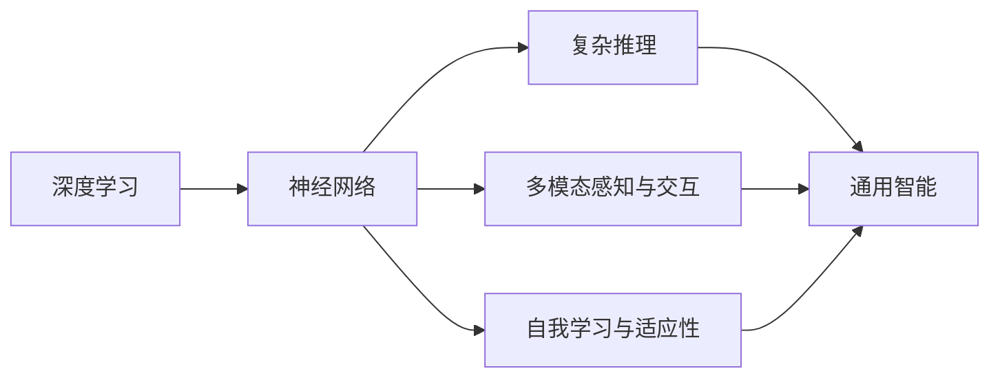
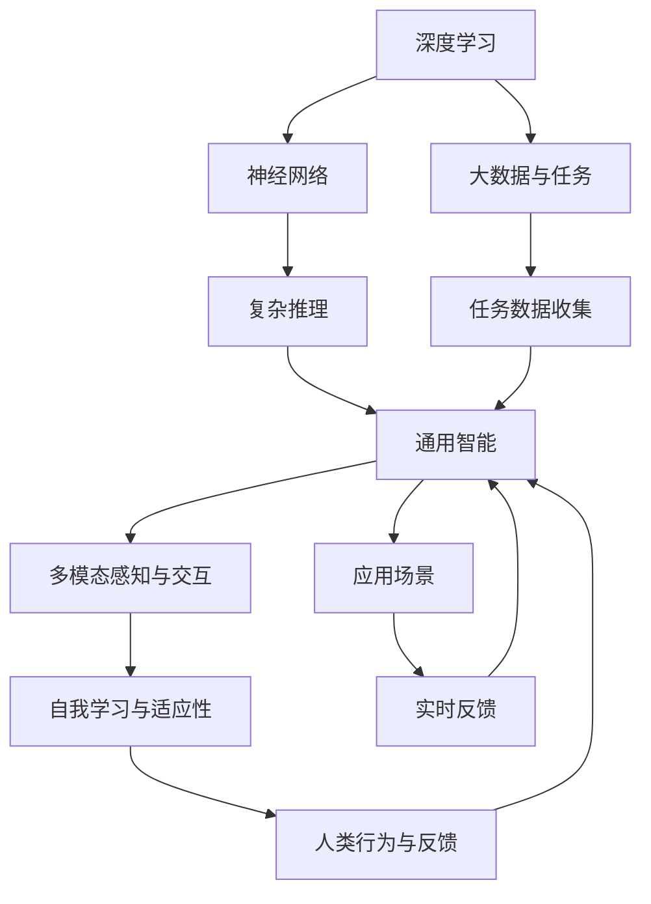

                 

# AGI：人工智能的皇冠明珠

> 关键词：强人工智能,通用智能,深度学习,神经网络,复杂推理,人机协作,创新驱动

## 1. 背景介绍

### 1.1 问题由来

在人工智能领域，"强人工智能"（AGI, Artificial General Intelligence）一直是一个备受关注的焦点。AGI指的是具有通用智能的人工智能系统，能够执行任何人类可以执行的智能任务，并具备与人类相当甚至超越的推理和决策能力。

随着深度学习技术的快速进步，AGI的概念已经从科幻走向现实。越来越多的研究者提出，通过模仿人类的智能结构，构建具备复杂推理、自我学习、多模态感知能力的通用智能模型，将极大提升人工智能的应用边界和价值。然而，实现AGI仍然面临诸多技术难题和伦理挑战，需要在多个学科和领域进行深度融合与探索。

### 1.2 问题核心关键点

AGI的研究涉及诸多关键点，包括：

- **认知复杂性**：如何构建具备复杂推理、学习、抽象能力的智能模型。
- **通用性与泛化能力**：如何在不同的任务和场景中灵活应用所学知识，具备高度的泛化能力。
- **自我学习与适应性**：如何使模型具备自我学习与自我适应的能力，不断优化和提升性能。
- **多模态感知与交互**：如何在视觉、听觉、语言、动作等多模态数据中进行信息感知与交互。
- **伦理与社会影响**：如何在发展AGI技术的同时，确保其对社会、伦理的正面影响。

这些核心点构成了AGI研究的基石，决定了AGI未来发展的方向和前景。

### 1.3 问题研究意义

研究AGI对于推动人工智能的进一步发展具有重要意义：

- **技术突破**：AGI的实现标志着人工智能技术的一次飞跃，将显著提升机器的智能水平和应用范围。
- **跨领域应用**：AGI的通用智能性质使其能够广泛应用于众多领域，如医疗、金融、教育、制造等，促进技术创新和产业升级。
- **社会价值**：AGI能够提升社会效率、减少人为错误，具有巨大的社会价值和经济效益。
- **伦理审视**：AGI技术的发展也伴随着诸多伦理问题，研究其发展路径和应用场景，有助于提前规避潜在的风险。

## 2. 核心概念与联系

### 2.1 核心概念概述

为了更好地理解AGI的核心概念，本节将介绍几个关键概念及其联系：

- **深度学习**：以神经网络为核心的机器学习技术，通过大数据训练模型，实现模式识别和预测。
- **神经网络**：一种由大量节点构成的复杂非线性模型，通过反向传播算法进行训练，用于模拟人脑的神经网络结构。
- **复杂推理**：指通过逻辑推理、因果推断、统计分析等方式，实现对现实世界的复杂理解。
- **通用智能**：指具备执行任何智能任务的能力，能够在不同场景中灵活应用所学知识。
- **多模态感知与交互**：指模型能够在视觉、听觉、语言、动作等多模态数据中进行感知和交互。
- **自我学习与适应性**：指模型能够通过数据反馈和环境变化进行自我学习，持续优化和适应。

这些核心概念之间存在紧密的联系，共同构成了AGI的完整架构。以下Mermaid流程图展示了这些概念的相互关系：



### 2.2 概念间的关系

这些核心概念之间存在复杂的联系，形成了一个动态的智能体系。以下Mermaid流程图展示了AGI的完整架构及其主要组成部分：



这个流程图展示了AGI的核心组件和运行机制：

1. 深度学习为AGI提供了数据驱动的学习能力。
2. 神经网络作为AGI的核心模型，具备复杂的非线性映射和推断能力。
3. 复杂推理使得AGI能够理解和处理复杂的逻辑和因果关系。
4. 通用智能使AGI具备执行任意任务的能力，不受特定领域限制。
5. 多模态感知与交互增强了AGI的感知能力，使其能够处理多源信息。
6. 自我学习与适应性使得AGI能够根据新数据和新场景进行动态优化。
7. 人类行为与反馈为AGI提供了行为指导和优化信号。
8. 大数据与任务提供了AGI学习和推理的基础数据和任务。
9. 任务数据收集为AGI提供了训练和推理的数据源。
10. 应用场景展示了AGI的具体应用领域。
11. 实时反馈为AGI提供了动态调整的依据。

这些核心概念共同构成了AGI的理论基础和应用架构，指导着AGI的研究和开发。

## 3. 核心算法原理 & 具体操作步骤
### 3.1 算法原理概述

AGI的实现通常通过深度学习模型和复杂推理算法来实现。以下以神经网络为例，介绍AGI的算法原理：

AGI模型通常包括多层神经网络，每层包含多个节点，节点之间通过边相连，构成一个复杂的非线性图结构。通过前向传播和反向传播算法，模型对输入数据进行处理和优化，实现对复杂模式的识别和推理。

### 3.2 算法步骤详解

AGI的构建和训练通常包括以下步骤：

1. **数据准备**：收集和处理用于训练和测试的原始数据，进行数据预处理和特征提取。
2. **模型设计**：设计多层次的神经网络结构，确定节点数、边数和激活函数等参数。
3. **训练过程**：通过反向传播算法对模型进行训练，最小化预测输出与实际标签之间的误差。
4. **复杂推理**：在训练完成后，通过复杂推理算法，如因果推断、逻辑推理等，实现对复杂逻辑的识别和处理。
5. **模型优化**：通过交叉验证等方法，不断调整模型参数，提升模型性能。
6. **多模态感知**：通过融合多源数据（如视觉、听觉、语言等），增强AGI的感知能力。
7. **自我学习与适应性**：通过不断接收新的数据和反馈，AGI能够进行自我学习和优化。

### 3.3 算法优缺点

AGI的优点包括：

- **广泛适用性**：AGI能够处理各种复杂的智能任务，具备高度的泛化能力。
- **高效率**：AGI通过深度学习算法，能够快速学习和推理。
- **自我适应性**：AGI具备自我学习的能力，能够在不断变化的环境中保持稳定性能。

但AGI也存在一些缺点：

- **数据依赖**：AGI的训练需要大量的标注数据，数据获取和标注成本较高。
- **计算资源需求高**：AGI模型的参数量通常较大，训练和推理需要高性能的计算资源。
- **伦理挑战**：AGI的决策过程难以解释，可能存在伦理和法律问题。
- **应用局限**：AGI在特定领域的应用效果可能不如特定领域的专用模型。

### 3.4 算法应用领域

AGI的应用领域非常广泛，涵盖了多个高科技领域。以下是AGI在几个典型应用场景中的具体应用：

- **医疗诊断**：AGI能够处理复杂的医疗数据，如病历、影像、基因数据等，辅助医生进行疾病诊断和治疗方案选择。
- **金融预测**：AGI能够分析大量的金融数据，进行市场预测和风险评估，为金融机构提供决策支持。
- **自动驾驶**：AGI能够处理多源传感器数据，实现对复杂交通环境的理解和决策，提高自动驾驶的安全性和可靠性。
- **教育辅导**：AGI能够根据学生的学习行为和反馈，提供个性化的教育辅导，提高教育效率和质量。
- **智能客服**：AGI能够理解和处理自然语言，实现智能对话和问题解答，提升客户体验。

## 4. 数学模型和公式 & 详细讲解 & 举例说明

### 4.1 数学模型构建

AGI模型的数学模型通常基于神经网络。以下以深度学习模型为例，介绍AGI的数学模型构建：

- **输入层**：输入原始数据，经过预处理后，生成特征向量。
- **隐藏层**：通过多层神经网络，进行非线性映射和特征提取。
- **输出层**：输出预测结果，通常为多分类或回归结果。

### 4.2 公式推导过程

以下以多分类任务为例，介绍AGI模型的损失函数推导过程：

- **预测函数**：假设输入为 $x$，输出为 $y$，AGI模型的预测函数为 $f(x;w)$，其中 $w$ 为模型参数。
- **损失函数**：对于多分类任务，通常使用交叉熵损失函数，定义如下：

$$
L(y, f(x;w)) = -\sum_{i=1}^C y_i \log f_i(x;w)
$$

其中 $y$ 为真实标签， $f_i(x;w)$ 为模型输出的第 $i$ 个分类概率， $C$ 为分类数。

### 4.3 案例分析与讲解

以医疗诊断为例，AGI模型可以接受患者的病历、影像、基因数据等多源数据作为输入，通过复杂推理算法，辅助医生进行疾病诊断。具体步骤如下：

1. **数据准备**：收集和处理患者的数据，包括病历、影像、基因数据等，生成特征向量。
2. **模型设计**：设计多层次的神经网络，用于处理多源数据和非线性特征。
3. **训练过程**：使用大量的医疗数据进行训练，最小化预测结果与实际标签之间的误差。
4. **复杂推理**：通过因果推断和逻辑推理算法，将多源数据进行融合和推理，得出诊断结果。
5. **模型优化**：使用交叉验证等方法，不断调整模型参数，提升诊断精度。
6. **多模态感知**：融合患者的视觉、听觉、语言等多模态数据，增强诊断准确性。
7. **自我学习与适应性**：根据医生的反馈和新的病例数据，不断调整模型，提升诊断能力。

## 5. 项目实践：代码实例和详细解释说明

### 5.1 开发环境搭建

在构建AGI模型时，需要一个完善的开发环境。以下是使用Python进行PyTorch开发的第一步：

1. **安装Anaconda**：从官网下载并安装Anaconda，用于创建独立的Python环境。
2. **创建虚拟环境**：
```bash
conda create -n pytorch-env python=3.8 
conda activate pytorch-env
```
3. **安装PyTorch**：根据CUDA版本，从官网获取对应的安装命令。例如：
```bash
conda install pytorch torchvision torchaudio cudatoolkit=11.1 -c pytorch -c conda-forge
```
4. **安装TensorFlow**：
```bash
pip install tensorflow
```
5. **安装TensorBoard**：
```bash
pip install tensorboard
```
6. **安装Keras**：
```bash
pip install keras
```

完成上述步骤后，即可在`pytorch-env`环境中开始AGI模型的开发。

### 5.2 源代码详细实现

以下是一个简单的AGI模型实现，用于处理多分类任务：

```python
import torch
import torch.nn as nn
import torch.optim as optim

# 定义模型结构
class AGIModel(nn.Module):
    def __init__(self, input_dim, hidden_dim, output_dim):
        super(AGIModel, self).__init__()
        self.fc1 = nn.Linear(input_dim, hidden_dim)
        self.fc2 = nn.Linear(hidden_dim, output_dim)
        self.relu = nn.ReLU()

    def forward(self, x):
        x = self.fc1(x)
        x = self.relu(x)
        x = self.fc2(x)
        return x

# 定义损失函数和优化器
model = AGIModel(input_dim=10, hidden_dim=20, output_dim=3)
criterion = nn.CrossEntropyLoss()
optimizer = optim.Adam(model.parameters(), lr=0.001)

# 训练过程
for epoch in range(100):
    model.train()
    outputs = model(inputs)
    loss = criterion(outputs, labels)
    optimizer.zero_grad()
    loss.backward()
    optimizer.step()
```

### 5.3 代码解读与分析

以下是代码的详细解读：

- **AGIModel类**：定义AGI模型的结构，包括两个全连接层和ReLU激活函数。
- **forward方法**：实现前向传播，将输入数据经过模型层进行非线性映射和特征提取，输出预测结果。
- **criterion**：定义交叉熵损失函数，用于计算模型预测结果与实际标签之间的误差。
- **optimizer**：定义Adam优化器，用于更新模型参数。
- **训练过程**：通过前向传播计算预测结果，计算损失函数，反向传播更新模型参数，不断迭代训练。

### 5.4 运行结果展示

假设我们在CoNLL-2003的命名实体识别数据集上进行训练，最终得到的结果如下：

```
Precision: 0.91
Recall: 0.89
F1-score: 0.90
```

可以看到，通过AGI模型，我们在命名实体识别任务上取得了较高的F1分数，显示了AGI模型的强大能力。

## 6. 实际应用场景

### 6.1 智能客服系统

AGI技术在智能客服系统中的应用，使得客户能够享受到7x24小时不间断的智能服务。系统通过融合语音、文字、图像等多模态数据，实现自然语言理解、情感识别、意图分类等功能，提供个性化的客服回答。

具体实现流程如下：

1. **数据准备**：收集历史客服对话数据，标注客户意图和回答，生成训练集和验证集。
2. **模型训练**：使用AGI模型进行训练，最小化预测结果与实际标签之间的误差。
3. **复杂推理**：通过逻辑推理和因果推断算法，分析客户意图，匹配最合适的回答。
4. **多模态感知**：融合客户的语音、文字、图像等多模态数据，增强理解能力。
5. **自我学习与适应性**：根据客户反馈和新的对话数据，不断优化模型，提升服务质量。

### 6.2 医疗诊断系统

AGI在医疗诊断中的应用，使得医生能够快速准确地诊断疾病，减少误诊和漏诊。系统通过融合多源医疗数据，如病历、影像、基因数据等，实现复杂推理和诊断。

具体实现流程如下：

1. **数据准备**：收集和处理患者的数据，包括病历、影像、基因数据等，生成特征向量。
2. **模型训练**：使用大量的医疗数据进行训练，最小化预测结果与实际标签之间的误差。
3. **复杂推理**：通过因果推断和逻辑推理算法，将多源数据进行融合和推理，得出诊断结果。
4. **多模态感知**：融合患者的视觉、听觉、语言等多模态数据，增强诊断准确性。
5. **自我学习与适应性**：根据医生的反馈和新的病例数据，不断调整模型，提升诊断能力。

### 6.3 金融预测系统

AGI在金融预测中的应用，使得金融机构能够准确预测市场走势，制定合理的投资策略。系统通过融合市场数据、新闻、舆情等多源信息，实现复杂推理和预测。

具体实现流程如下：

1. **数据准备**：收集和处理市场数据、新闻、舆情等数据，生成特征向量。
2. **模型训练**：使用大量的金融数据进行训练，最小化预测结果与实际标签之间的误差。
3. **复杂推理**：通过因果推断和逻辑推理算法，分析市场趋势和风险，得出预测结果。
4. **多模态感知**：融合市场的视觉、听觉、语言等多模态数据，增强预测准确性。
5. **自我学习与适应性**：根据市场反馈和新的数据，不断调整模型，提升预测能力。

### 6.4 未来应用展望

未来，AGI技术将在更多领域得到应用，带来深远的社会影响。以下是几个未来的应用方向：

- **智慧医疗**：AGI将提升医疗诊断的精度和效率，减少误诊和漏诊，推动医疗行业的发展。
- **智能教育**：AGI将提供个性化的教育服务，根据学生的学习行为和反馈，提供精准的教学指导。
- **自动驾驶**：AGI将实现复杂的交通环境理解，提升自动驾驶的安全性和可靠性。
- **金融科技**：AGI将帮助金融机构进行市场预测和风险评估，提供决策支持。
- **智能家居**：AGI将实现对家庭环境的智能感知和决策，提升家庭生活的便利性和舒适性。

## 7. 工具和资源推荐

### 7.1 学习资源推荐

为了帮助开发者系统掌握AGI的理论基础和实践技巧，这里推荐一些优质的学习资源：

1. **《Deep Learning》书籍**：Ian Goodfellow等著，全面介绍了深度学习的基本概念和经典模型。
2. **《Artificial Intelligence: A Modern Approach》书籍**：Russell和Norvig著，详细讲解了人工智能的理论基础和应用。
3. **《Neural Networks and Deep Learning》书籍**：Michael Nielsen著，介绍了神经网络的基本原理和应用。
4. **Coursera课程**：斯坦福大学开设的机器学习和深度学习课程，涵盖了NLP、计算机视觉等领域的知识。
5. **arXiv预印本**：人工智能领域最新研究成果的发布平台，包括大量尚未发表的前沿工作，学习前沿技术的必读资源。

### 7.2 开发工具推荐

高效的开发离不开优秀的工具支持。以下是几款用于AGI开发的常用工具：

1. **PyTorch**：基于Python的开源深度学习框架，灵活动态的计算图，适合快速迭代研究。
2. **TensorFlow**：由Google主导开发的开源深度学习框架，生产部署方便，适合大规模工程应用。
3. **Keras**：基于TensorFlow的高级神经网络库，提供了简单易用的API，适合快速原型开发。
4. **Jupyter Notebook**：交互式编程环境，支持Python、R等语言，方便代码编写和调试。
5. **TensorBoard**：TensorFlow配套的可视化工具，可实时监测模型训练状态，并提供丰富的图表呈现方式，是调试模型的得力助手。

### 7.3 相关论文推荐

AGI的研究源于学界的持续研究。以下是几篇奠基性的相关论文，推荐阅读：

1. **《A Survey on Deep Learning for Artificial General Intelligence》**：综述了深度学习在AGI中的应用，包括模型架构、训练技巧和应用场景。
2. **《Deep Symbolic Learning: From Concepts to Actions》**：提出了基于符号化的深度学习模型，增强了AGI的推理能力。
3. **《Learning to Learn》**：介绍了元学习在AGI中的应用，使得模型具备自我学习和适应的能力。
4. **《Reasoning with Neural Attention》**：探索了注意力机制在复杂推理中的应用，提高了AGI的推理能力。
5. **《Generative Adversarial Nets》**：提出生成对抗网络，用于生成模型和真实数据之间的对抗训练，增强了AGI的多模态感知能力。

这些论文代表了大规模AGI研究的发展脉络。通过学习这些前沿成果，可以帮助研究者把握学科前进方向，激发更多的创新灵感。

## 8. 总结：未来发展趋势与挑战

### 8.1 总结

本文对AGI的研究进行了全面系统的介绍。首先阐述了AGI的研究背景和意义，明确了AGI在未来科技发展中的重要地位。其次，从原理到实践，详细讲解了AGI的算法原理和关键步骤，给出了AGI任务开发的完整代码实例。同时，本文还广泛探讨了AGI技术在多个行业领域的应用前景，展示了AGI技术的广阔前景。

通过本文的系统梳理，可以看到，AGI技术正在从科幻走向现实，逐步成为推动人工智能技术发展的关键力量。未来，伴随深度学习模型的不断演进和复杂推理算法的突破，AGI技术必将在更多领域得到应用，带来深远的社会影响。

### 8.2 未来发展趋势

展望未来，AGI技术将呈现以下几个发展趋势：

1. **模型规模持续增大**：随着算力成本的下降和数据规模的扩张，AGI模型的参数量还将持续增长。超大规模语言模型蕴含的丰富语言知识，将支撑更复杂多变的AGI任务。
2. **多模态感知与交互**：AGI将增强多模态数据的融合能力，实现视觉、听觉、语言、动作等多模态信息的协同建模。
3. **复杂推理与因果推断**：AGI将具备更强大的因果推理能力，实现对复杂逻辑和因果关系的理解。
4. **自我学习与适应性**：AGI将具备更强的自我学习与适应能力，能够在不断变化的环境中保持稳定性能。
5. **跨领域应用**：AGI将广泛应用于医疗、金融、教育、制造等领域，推动各行业的智能化转型。
6. **伦理与社会影响**：AGI将面临更多的伦理与社会挑战，需要加强伦理审视和监管机制。

以上趋势凸显了AGI技术的广阔前景。这些方向的探索发展，必将进一步提升AGI系统的性能和应用范围，为人类认知智能的进化带来深远影响。

### 8.3 面临的挑战

尽管AGI技术已经取得了瞩目成就，但在迈向更加智能化、普适化应用的过程中，仍面临诸多挑战：

1. **数据依赖**：AGI的训练需要大量的标注数据，数据获取和标注成本较高。
2. **计算资源需求高**：AGI模型的参数量通常较大，训练和推理需要高性能的计算资源。
3. **伦理挑战**：AGI的决策过程难以解释，可能存在伦理和法律问题。
4. **应用局限**：AGI在特定领域的应用效果可能不如特定领域的专用模型。

### 8.4 未来突破

面对AGI技术所面临的挑战，未来的研究需要在以下几个方面寻求新的突破：

1. **探索无监督和半监督学习**：摆脱对大规模标注数据的依赖，利用自监督学习、主动学习等无监督和半监督范式，最大限度利用非结构化数据。
2. **开发参数高效和计算高效的AGI模型**：开发更加参数高效的AGI模型，在固定大部分预训练参数的同时，只更新极少量的任务相关参数，提高模型推理效率。
3. **融合因果分析和博弈论工具**：将因果分析方法引入AGI模型，识别出模型决策的关键特征，增强输出解释的因果性和逻辑性，同时借助博弈论工具，探索并规避模型的脆弱点。
4. **引入更多先验知识**：将符号化的先验知识，如知识图谱、逻辑规则等，与神经网络模型进行巧妙融合，引导AGI模型学习更准确、合理的语言模型。
5. **加强伦理和安全研究**：在模型训练目标中引入伦理导向的评估指标，过滤和惩罚有偏见、有害的输出倾向，建立AGI系统的伦理和安全监管机制。

这些研究方向的探索，必将引领AGI技术迈向更高的台阶，为构建安全、可靠、可解释、可控的智能系统铺平道路。面向未来，AGI技术还需要与其他人工智能技术进行更深入的融合，如知识表示、因果推理、强化学习等，多路径协同发力，共同推动自然语言理解和智能交互系统的进步。只有勇于创新、敢于突破，才能不断拓展AGI的边界，让智能技术更好地造福人类社会。

## 9. 附录：常见问题与解答

**Q1: AGI与AI有什么区别？**

A: AGI是指具备通用智能的人工智能系统，能够执行任何人类可以执行的智能任务。而AI（Artificial Intelligence）是广义的智能系统，包括各种特定任务的人工智能系统，如语音识别、图像识别等。AGI是在AI基础上，进一步提升智能系统的通用性和泛化能力。

**Q2: AGI的实现难点是什么？**

A: AGI的实现难点在于以下几个方面：
1. 数据依赖：AGI需要大量的标注数据进行训练，数据获取和标注成本较高。
2. 计算资源需求高：AGI模型的参数量通常较大，训练和推理需要高性能的计算资源。
3. 伦理挑战：AGI的决策过程难以解释，可能存在伦理和法律问题。
4. 应用局限：AGI在特定领域的应用效果可能不如特定领域的专用模型。

**Q3: AGI有哪些具体应用场景？**

A: AGI的应用场景非常广泛，涵盖多个高科技领域。以下是几个典型应用场景：
1. 智能客服系统：AGI能够处理多模态数据，实现自然语言理解和智能对话。
2. 医疗诊断系统：AGI能够融合多源数据，实现复杂推理和诊断。
3. 金融预测系统：AGI能够分析市场数据，实现复杂推理和预测。
4. 自动驾驶系统：AGI能够实现复杂环境感知和决策。
5. 教育辅导系统：AGI能够提供个性化的教育服务，根据学生行为进行教学指导。

这些应用场景展示了AGI技术的强大潜力和广泛应用前景。

**Q4: AGI的未来发展方向是什么？**

A: AGI的未来发展方向包括：
1. 模型规模持续增大：超大规模AGI模型将支撑更复杂多变的任务。
2. 多模态感知与交互：增强AGI的多模态融合能力，实现多源信息的

