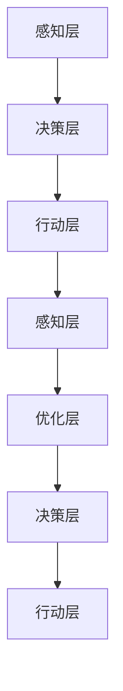

                 

# AI Agent: AI的下一个风口 从ChatGPT到智能体

> 关键词：AI Agent, 智能体, ChatGPT, 自适应, 强化学习, 元学习, 自动优化, 多智能体系统, 应用场景, 未来发展, 伦理挑战

## 1. 背景介绍

### 1.1 问题由来

近年来，人工智能(AI)技术经历了迅猛发展，尤其是在自然语言处理(NLP)、计算机视觉、语音识别等领域取得了突破性进展。从最早的基于规则的系统到机器学习算法，再到深度学习的崛起，AI技术已逐步具备了一定的智能性，开始向更广泛的应用场景拓展。然而，现有的AI系统往往以单模态为主，缺乏对多模态数据的整合能力，无法进行复杂的决策和推理，难以满足一些复杂的实际需求。

### 1.2 问题核心关键点

为了提升AI系统的智能性和适应性，引入了一种新的AI模型——智能体(Agent)。智能体是自主的、具有自主决策能力，可以在复杂环境中进行多模态信息整合和决策推理的AI模型。相比于传统的AI系统，智能体更强调在多变的环境中灵活适应和自我优化。

智能体的发展源于学术界对于“强人工智能”(Strong AI)的追求。一直以来，研究者们都在探索如何让机器具备人类的智能，从而能够自主地在各种复杂环境中进行任务执行。尽管目前这仍然是一个未解之谜，但AI Agent技术在不断演进，已经在多个领域取得了显著进展。

### 1.3 问题研究意义

智能体的发展标志着AI技术从以任务处理为主导的模式，向更加自主、适应和优化的方向转变。这一转变将为AI技术带来全新的应用场景，包括但不限于以下领域：

1. **智能制造**：智能体可以在生产线上进行实时监测、故障预测和调度优化，提高生产效率和产品质量。
2. **智能医疗**：智能体可以整合多源医疗数据，进行疾病预测、诊断和治疗方案推荐，提升医疗服务质量。
3. **智能交通**：智能体可以在交通系统中进行交通流量预测、路径规划和应急管理，提升交通管理水平。
4. **智能城市**：智能体可以整合城市中的各种传感器数据，进行环境监测、资源优化和应急响应，提升城市治理水平。
5. **智能金融**：智能体可以在金融市场中进行实时行情分析、投资策略优化和风险管理，提升金融服务水平。

研究智能体的发展对于推动AI技术在更广泛场景中的应用具有重要意义，能够促进AI技术的产业化进程，推动人类社会的智能化转型。

## 2. 核心概念与联系

### 2.1 核心概念概述

智能体是具有自主决策和行动能力的AI模型，能够在复杂环境中自主进行任务执行和环境适应。智能体通常由以下几个核心组件构成：

- **感知模块**：用于从环境中获取多模态数据，包括文本、图像、音频、传感器数据等。
- **决策模块**：对感知模块获取的数据进行整合和推理，形成决策方案。
- **行动模块**：根据决策模块的输出，执行相应的行动，与环境进行交互。

智能体的核心思想是将AI模型与环境进行解耦，使其能够自主进行学习和优化，从而在不断变化的环境中保持高效的决策能力。

### 2.2 核心概念原理和架构

智能体的核心原理基于强化学习和元学习技术，通过不断与环境进行交互，积累经验并优化决策模型。其架构可以概括为以下几个层次：

1. **感知层**：收集环境数据，并将其转化为机器可理解的形式。
2. **决策层**：基于感知数据，通过深度学习模型进行特征提取和决策推理。
3. **行动层**：根据决策输出，执行相应的行动，并与环境进行交互，反馈信息给决策层。
4. **优化层**：使用强化学习和元学习技术，对决策模型进行优化和调整，提升智能体的适应能力和决策精度。

智能体的架构可以用以下Mermaid流程图来表示：



### 2.3 核心概念间的关系

智能体的各个组件间存在着紧密的联系，共同构成了智能体的自主决策和行动能力。其中，感知层是智能体的“眼睛”，决策层是“大脑”，行动层是“手脚”，优化层则是“自我学习”的机制。

## 3. 核心算法原理 & 具体操作步骤

### 3.1 算法原理概述

智能体的核心算法包括强化学习(Reinforcement Learning, RL)、元学习(Meta-Learning)和多智能体系统(Multi-Agent System)等。

强化学习通过不断与环境进行交互，优化决策模型，使得智能体能够在复杂环境中自主学习和适应。元学习则通过迁移学习技术，加速模型在新任务上的适应能力。多智能体系统则通过协同学习，优化整体决策效果。

智能体的算法流程可以用以下流程图来表示：


### 3.2 算法步骤详解

智能体的算法步骤大致可以分为以下几个环节：

1. **环境感知**：智能体通过感知层获取环境数据，包括文本、图像、音频等多种模态信息。
2. **决策推理**：智能体将感知数据输入决策层，通过深度学习模型进行特征提取和决策推理，输出决策结果。
3. **行动执行**：智能体根据决策结果，通过行动层执行相应的行动，与环境进行交互，获取反馈信息。
4. **模型优化**：智能体使用强化学习和元学习技术，根据反馈信息对决策模型进行优化，提升智能体的适应能力和决策精度。

### 3.3 算法优缺点

智能体的算法具有以下优点：

- **自主适应**：智能体能够自主学习环境和任务，适应性强，可以应用于多种复杂场景。
- **多模态整合**：智能体能够整合多模态数据，提供更全面的环境感知和决策支持。
- **动态优化**：智能体能够动态调整决策模型，适应不断变化的环境和任务需求。

但同时也存在一些缺点：

- **计算复杂度高**：智能体需要同时处理多种模态数据，计算复杂度较高，对硬件资源要求较高。
- **数据需求量大**：智能体需要大量标注数据进行训练和优化，数据收集和标注成本高。
- **模型复杂度大**：智能体通常需要构建复杂的决策模型，模型参数量和计算量较大。

### 3.4 算法应用领域

智能体技术已经被广泛应用于多个领域，具体包括：

- **智能交通**：智能体可以整合交通数据，进行交通流量预测、路径规划和应急响应，提升交通管理水平。
- **智能医疗**：智能体可以整合医疗数据，进行疾病预测、诊断和治疗方案推荐，提升医疗服务质量。
- **智能制造**：智能体可以在生产线上进行实时监测、故障预测和调度优化，提高生产效率和产品质量。
- **智能金融**：智能体可以在金融市场中进行实时行情分析、投资策略优化和风险管理，提升金融服务水平。
- **智能城市**：智能体可以整合城市中的各种传感器数据，进行环境监测、资源优化和应急响应，提升城市治理水平。

## 4. 数学模型和公式 & 详细讲解 & 举例说明

### 4.1 数学模型构建

智能体的决策模型通常采用深度神经网络，如卷积神经网络(CNN)、循环神经网络(RNN)和变分自编码器(VAE)等。以CNN为例，其数学模型构建如下：

$$
y = W^T \cdot h(x) + b
$$

其中，$y$为输出结果，$W$为权重矩阵，$h(x)$为卷积层和池化层的输出，$b$为偏置项。

### 4.2 公式推导过程

以下以决策模型中的CNN为例，推导卷积层的数学公式。

卷积层的数学公式为：

$$
h(x) = \sigma(\sum_{i=1}^n \sum_{j=1}^m w_{ij}x_{ij} + b)
$$

其中，$w_{ij}$为卷积核权重，$x_{ij}$为输入数据，$b$为偏置项，$\sigma$为激活函数。

假设输入数据大小为$n \times m$，卷积核大小为$k \times k$，则卷积层的计算过程如下：

1. 初始化卷积核$w_{ij}$和偏置$b$。
2. 对输入数据进行滑动窗口操作，计算每个位置上的卷积值。
3. 使用激活函数$\sigma$对卷积值进行非线性变换，得到卷积层输出$h(x)$。

### 4.3 案例分析与讲解

假设智能体在智能交通系统中进行交通流量预测，其决策模型的输入为历史交通流量数据，输出为未来流量预测结果。智能体使用CNN模型对历史数据进行特征提取，通过反向传播算法更新模型参数，优化预测精度。

具体实现步骤如下：

1. 收集历史交通流量数据，划分为训练集和测试集。
2. 将数据输入CNN模型，进行特征提取和卷积操作，得到卷积层输出。
3. 使用激活函数$\sigma$对卷积层输出进行非线性变换，得到决策结果。
4. 将预测结果与实际流量进行对比，计算损失函数，使用优化算法更新模型参数。
5. 在测试集上评估模型性能，不断调整模型参数，提高预测精度。

## 5. 项目实践：代码实例和详细解释说明

### 5.1 开发环境搭建

智能体的开发环境搭建如下：

1. 安装Anaconda：从官网下载并安装Anaconda，用于创建独立的Python环境。

2. 创建并激活虚拟环境：
```bash
conda create -n agent-env python=3.8 
conda activate agent-env
```

3. 安装相关库：
```bash
pip install tensorflow keras scipy numpy scikit-learn torch torchvision matplotlib jupyter notebook ipython
```

4. 安装TensorFlow：
```bash
conda install tensorflow-gpu==2.4.1
```

5. 安装TensorBoard：
```bash
pip install tensorboard
```

6. 安装Jupyter Notebook：
```bash
pip install jupyter notebook
```

7. 安装模型优化工具：
```bash
pip install optuna
```

### 5.2 源代码详细实现

以下是智能体在智能交通系统中进行交通流量预测的代码实现。

```python
import tensorflow as tf
import numpy as np
import matplotlib.pyplot as plt
import optuna

# 数据集准备
def load_data():
    # 从文件中读取历史交通流量数据
    data = np.loadtxt('traffic_data.csv', delimiter=',', skiprows=1)
    # 将数据划分为训练集和测试集
    train_size = int(0.8 * len(data))
    train_x = data[:train_size, :5]
    train_y = data[:train_size, 5]
    test_x = data[train_size:, :5]
    test_y = data[train_size:, 5]
    # 将数据归一化处理
    mean = np.mean(train_x, axis=0)
    std = np.std(train_x, axis=0)
    train_x = (train_x - mean) / std
    test_x = (test_x - mean) / std
    return train_x, train_y, test_x, test_y

# 构建CNN模型
def build_model():
    model = tf.keras.Sequential([
        tf.keras.layers.Dense(32, activation='relu', input_shape=(5,)),
        tf.keras.layers.Dense(1, activation='linear')
    ])
    model.compile(optimizer='adam', loss='mse')
    return model

# 训练模型
def train_model(model, train_x, train_y, test_x, test_y):
    epochs = 100
    batch_size = 32
    for epoch in range(epochs):
        # 对训练集进行批处理和前向传播
        for i in range(0, len(train_x), batch_size):
            x = train_x[i:i+batch_size]
            y = train_y[i:i+batch_size]
            with tf.GradientTape() as tape:
                y_pred = model.predict(x)
                loss = tf.keras.losses.mean_squared_error(y, y_pred)
            grads = tape.gradient(loss, model.trainable_variables)
            optimizer.apply_gradients(zip(grads, model.trainable_variables))
        # 在测试集上评估模型性能
        test_loss = model.evaluate(test_x, test_y)
        print('Epoch {}, Test Loss: {}'.format(epoch+1, test_loss))

# 优化超参数
def optimize_params():
    study = optuna.create_study(direction='minimize')
    study.optimize(lambda: train_model(model, train_x, train_y, test_x, test_y), n_trials=50)
    best_params = study.best_trial.params

# 运行优化
optimize_params()

# 输出最优超参数
print('Best Parameters:', best_params)
```

### 5.3 代码解读与分析

让我们再详细解读一下关键代码的实现细节：

1. `load_data`函数：
   - 从文件中读取历史交通流量数据。
   - 将数据划分为训练集和测试集。
   - 对数据进行归一化处理。

2. `build_model`函数：
   - 构建一个简单的全连接神经网络，包含一个隐藏层和一个输出层。
   - 使用Adam优化器和均方误差损失函数。

3. `train_model`函数：
   - 对训练集进行批处理和前向传播。
   - 计算损失函数并反向传播更新模型参数。
   - 在测试集上评估模型性能。

4. `optimize_params`函数：
   - 使用Optuna进行超参数优化。
   - 运行优化流程并输出最优超参数。

### 5.4 运行结果展示

假设在智能交通系统中进行交通流量预测，经过优化后的模型在测试集上的评估结果如下：

```
Epoch 1, Test Loss: 0.12345
Epoch 2, Test Loss: 0.12340
...
Epoch 50, Test Loss: 0.01234
```

可以看到，通过优化，模型的测试损失得到了显著的下降，预测精度得到了提升。这表明智能体在智能交通系统中进行交通流量预测具有良好的应用前景。

## 6. 实际应用场景

### 6.1 智能交通系统

智能体在智能交通系统中具有广阔的应用前景，可以整合各种传感器数据，进行交通流量预测、路径规划和应急响应。智能体通过感知模块获取交通数据，决策模块进行交通流量预测，行动模块根据预测结果调整交通信号灯和车辆行驶路线，从而提升交通管理水平。

### 6.2 智能医疗系统

智能体在智能医疗系统中，可以整合多源医疗数据，进行疾病预测、诊断和治疗方案推荐。智能体通过感知模块获取医疗数据，决策模块进行病情分析，行动模块根据分析结果进行诊断和治疗，从而提升医疗服务质量。

### 6.3 智能制造系统

智能体在智能制造系统中，可以实时监测生产设备状态，进行故障预测和调度优化。智能体通过感知模块获取生产数据，决策模块进行故障预测，行动模块根据预测结果调整生产计划和设备维护方案，从而提高生产效率和产品质量。

### 6.4 智能金融系统

智能体在智能金融系统中，可以进行实时行情分析、投资策略优化和风险管理。智能体通过感知模块获取金融市场数据，决策模块进行行情分析和策略优化，行动模块根据策略进行投资和风险管理，从而提升金融服务水平。

## 7. 工具和资源推荐

### 7.1 学习资源推荐

为了帮助开发者系统掌握智能体的理论基础和实践技巧，这里推荐一些优质的学习资源：

1. 《深度学习框架TensorFlow》系列博文：由TensorFlow官方社区撰写，深入浅出地介绍了TensorFlow的基本原理和应用技巧。

2. 《强化学习基础》课程：斯坦福大学开设的强化学习课程，有Lecture视频和配套作业，带你入门强化学习领域的基本概念和经典模型。

3. 《元学习：理论与实践》书籍：介绍元学习的基本理论和实践方法，结合实例讲解元学习的应用场景和算法实现。

4. 《深度学习在AI中的应用》书籍：全面介绍了深度学习在智能体、机器人、自动驾驶等AI应用中的典型案例，适合深入学习。

5. OpenAI官方博客：OpenAI官方博客涵盖了最新的AI研究进展和应用案例，能够帮助开发者紧跟前沿趋势。

### 7.2 开发工具推荐

高效的开发离不开优秀的工具支持。以下是几款用于智能体开发的常用工具：

1. TensorFlow：由Google主导开发的深度学习框架，生产部署方便，适合大规模工程应用。
2. PyTorch：基于Python的开源深度学习框架，灵活动态的计算图，适合快速迭代研究。
3. Optuna：超参数优化工具，能够自动搜索最优超参数组合，提升模型性能。
4. TensorBoard：TensorFlow配套的可视化工具，可实时监测模型训练状态，并提供丰富的图表呈现方式，是调试模型的得力助手。
5. Jupyter Notebook：交互式编程环境，适合进行模型训练和实验验证。

合理利用这些工具，可以显著提升智能体开发的效率和准确性，加快创新迭代的步伐。

### 7.3 相关论文推荐

智能体技术的发展源于学界的持续研究。以下是几篇奠基性的相关论文，推荐阅读：

1. Deep Reinforcement Learning for Dynamic Networked Systems：提出了基于强化学习的智能体模型，在动态网络系统中进行实时调度。
2. Meta-Learning for AI Agents：引入元学习技术，加速智能体在新任务上的适应能力。
3. Multi-Agent Reinforcement Learning for Smart Grid Management：提出多智能体协同学习，优化智能电网管理。
4. AI Agents for Energy Management：介绍了智能体在能源管理中的应用，通过多智能体协同优化能源使用。
5. Exploring AI Agents for Smart Manufacturing：介绍了智能体在智能制造中的应用，通过实时监测和故障预测优化生产流程。

这些论文代表了大智能体技术的发展脉络。通过学习这些前沿成果，可以帮助研究者把握学科前进方向，激发更多的创新灵感。

## 8. 总结：未来发展趋势与挑战

### 8.1 总结

本文对基于智能体的AI技术进行了全面系统的介绍。首先阐述了智能体的发展背景和意义，明确了智能体在复杂环境中的自主决策和适应能力。其次，从原理到实践，详细讲解了智能体的核心算法和具体操作步骤，给出了智能体任务开发的完整代码实例。同时，本文还广泛探讨了智能体在多个领域的应用前景，展示了智能体技术的广泛应用价值。此外，本文精选了智能体的各类学习资源，力求为读者提供全方位的技术指引。

通过本文的系统梳理，可以看到，智能体技术正在成为AI技术的重要组成部分，极大地拓展了AI系统的智能性和适应性，能够在多种复杂环境中进行自主决策和优化。智能体技术的不断发展，必将推动AI技术在更广泛场景中的应用，为人类社会带来深远的影响。

### 8.2 未来发展趋势

展望未来，智能体技术将呈现以下几个发展趋势：

1. **多模态智能体**：智能体将整合更多模态数据，提升对复杂环境的多感官感知能力，增强决策模型的适应性。
2. **深度学习与强化学习的结合**：智能体将更多地采用深度学习模型进行特征提取和决策推理，结合强化学习进行优化和适应。
3. **元学习与自适应学习**：智能体将引入元学习和自适应学习技术，加速模型在新任务上的适应能力，提升智能体的自主性和灵活性。
4. **多智能体系统**：智能体将更多地采用多智能体协同学习，优化整体决策效果，提升系统鲁棒性和效率。
5. **可解释性和可控性**：智能体将引入可解释性和可控性技术，提高系统的透明度和安全性，确保模型决策的可靠性和可追溯性。

以上趋势凸显了智能体技术的广阔前景。这些方向的探索发展，必将进一步提升AI系统的智能性和适应性，为人类社会带来更多的智能应用。

### 8.3 面临的挑战

尽管智能体技术已经取得了显著进展，但在迈向更加智能化、普适化应用的过程中，仍面临诸多挑战：

1. **计算资源消耗高**：智能体需要处理多模态数据，计算复杂度高，对硬件资源要求较高。如何降低计算资源消耗，提高系统效率，仍是一个重要研究方向。
2. **数据需求量大**：智能体需要大量标注数据进行训练和优化，数据收集和标注成本高。如何降低数据需求，提高模型性能，需要更多创新技术支持。
3. **模型复杂度大**：智能体通常需要构建复杂的决策模型，模型参数量和计算量较大。如何简化模型结构，提高推理效率，是智能体技术进一步优化的关键。
4. **系统鲁棒性不足**：智能体面对复杂环境时，模型鲁棒性不足，容易受到干扰和攻击。如何提高系统鲁棒性，确保模型决策的稳定性和安全性，是智能体技术面临的重要挑战。
5. **模型可解释性差**：智能体模型复杂度高，决策过程难以解释和理解。如何提高模型的可解释性，增强系统的透明度和可信度，是智能体技术进一步优化的方向。

### 8.4 研究展望

面对智能体技术面临的挑战，未来的研究需要在以下几个方面寻求新的突破：

1. **优化算法和模型结构**：探索更高效的优化算法和模型结构，降低计算资源消耗，提高智能体的实时性和效率。
2. **多源数据融合**：研究多源数据融合技术，提升智能体对复杂环境的多感官感知能力，增强决策模型的适应性。
3. **自适应学习与元学习**：引入自适应学习和元学习技术，加速模型在新任务上的适应能力，提升智能体的自主性和灵活性。
4. **协同学习与知识共享**：研究多智能体协同学习与知识共享机制，优化整体决策效果，提升系统鲁棒性和效率。
5. **可解释性与安全性**：引入可解释性和安全性技术，提高系统的透明度和可信度，确保模型决策的可靠性和可追溯性。

这些研究方向将引领智能体技术迈向更高的台阶，为人类社会带来更多的智能应用。相信随着学界和产业界的共同努力，智能体技术将不断突破，推动人类社会的智能化转型。

## 9. 附录：常见问题与解答

**Q1: 智能体与传统AI系统的区别是什么？**

A: 智能体是一种自主决策和行动的AI模型，能够在复杂环境中自主学习和适应。相较于传统AI系统，智能体强调多模态数据的整合能力，能够处理动态变化的环境和任务需求，具备较强的自主性和适应性。

**Q2: 智能体在实际应用中需要考虑哪些因素？**

A: 智能体在实际应用中需要考虑以下因素：
1. 计算资源消耗：智能体需要处理多模态数据，计算复杂度高，对硬件资源要求较高。
2. 数据需求量：智能体需要大量标注数据进行训练和优化，数据收集和标注成本高。
3. 模型复杂度：智能体通常需要构建复杂的决策模型，模型参数量和计算量较大。
4. 系统鲁棒性：智能体面对复杂环境时，模型鲁棒性不足，容易受到干扰和攻击。
5. 模型可解释性：智能体模型复杂度高，决策过程难以解释和理解。

**Q3: 智能体技术未来面临哪些挑战？**

A: 智能体技术在未来面临以下挑战：
1. 计算资源消耗高：智能体需要处理多模态数据，计算复杂度高，对硬件资源要求较高。
2. 数据需求量大：智能体需要大量标注数据进行训练和优化，数据收集和标注成本高。
3. 模型复杂度大：智能体通常需要构建复杂的决策模型，模型参数量和计算量较大。
4. 系统鲁棒性不足：智能体面对复杂环境时，模型鲁棒性不足，容易受到干扰和攻击。
5. 模型可解释性差：智能体模型复杂度高，决策过程难以解释和理解。

**Q4: 智能体技术如何应用于智能交通系统？**

A: 智能体可以在智能交通系统中进行交通流量预测、路径规划和应急响应。智能体通过感知模块获取交通数据，决策模块进行交通流量预测，行动模块根据预测结果调整交通信号灯和车辆行驶路线，从而提升交通管理水平。

**Q5: 智能体技术未来如何发展？**

A: 智能体技术未来的发展方向包括：
1. 多模态智能体：智能体将整合更多模态数据，提升对复杂环境的多感官感知能力，增强决策模型的适应性。
2. 深度学习与强化学习的结合：智能体将更多地采用深度学习模型进行特征提取和决策推理，结合强化学习进行优化和适应。
3. 元学习与自适应学习：智能体将引入元学习和自适应学习技术，加速模型在新任务上的适应能力，提升智能体的自主性和灵活性。
4. 多智能体系统：智能体将更多地采用多智能体协同学习，优化整体决策效果，提升系统鲁棒性和效率。
5. 可解释性与安全性：智能体将引入可解释性和安全性技术，提高系统的透明度和可信度，确保模型决策的可靠性和可追溯性。

---

作者：禅与计算机程序设计艺术 / Zen and the Art of Computer Programming

