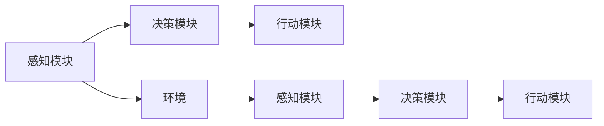
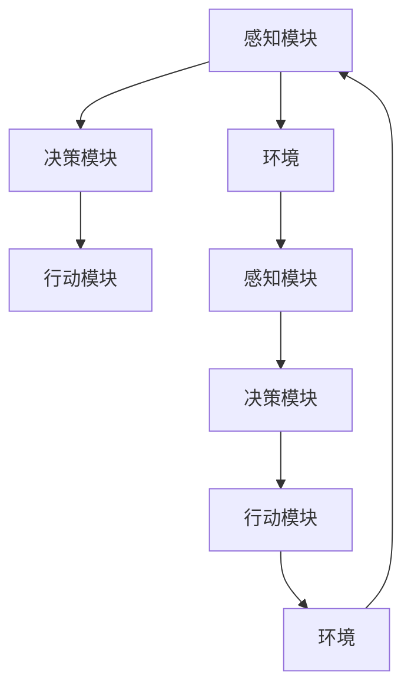
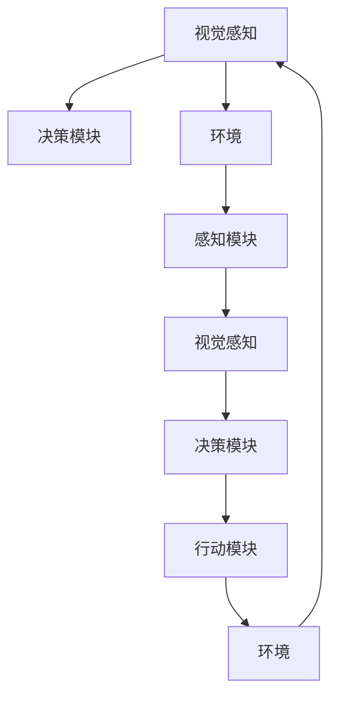
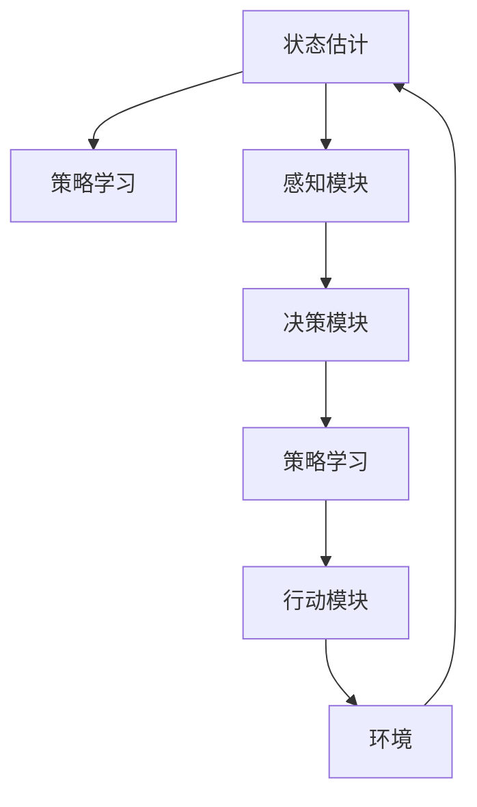
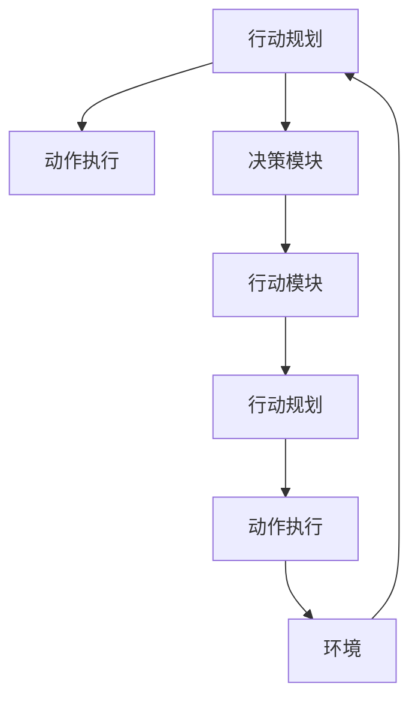

                 

# AI Agent: AI的下一个风口 从感知到行动的过程

## 1. 背景介绍

### 1.1 问题由来
随着人工智能技术的飞速发展，AI Agent 已经成为人工智能领域的一个热门话题。AI Agent 是指能够自主地在环境中执行复杂任务的智能体，其核心目标是实现从感知到行动的自动化过程。AI Agent 的应用领域非常广泛，从机器人、自动驾驶、医疗诊断、金融风控到智能客服、智能推荐等，都有AI Agent 的身影。

AI Agent 的发展经历了多个阶段，从最早的符号推理、专家系统，到后来的机器学习、深度学习，再到目前的热门研究方向 —— 强化学习。强化学习通过构建智能体与环境的交互反馈机制，使得AI Agent 能够自主学习最优策略，从而实现复杂任务的自动化。

### 1.2 问题核心关键点
AI Agent 的核心关键点在于如何构建智能体与环境之间的交互机制，以及如何设计有效的学习算法，使得智能体能够在多变的环境中快速适应并完成任务。AI Agent 的设计需要考虑以下几个关键问题：

- 智能体的感知能力：智能体如何获取环境信息，并将其转化为机器可理解的形式。
- 智能体的行动能力：智能体如何根据感知信息采取行动，并在环境中移动或执行任务。
- 智能体的学习机制：智能体如何通过与环境的交互来学习最优策略，并在新环境中表现良好。

### 1.3 问题研究意义
AI Agent 的研究对人工智能技术的发展具有重要的意义：

- 推动智能体技术的广泛应用：AI Agent 能够应用于各种场景，如工业自动化、医疗诊断、金融风控等，推动人工智能技术在各行业的深入应用。
- 提升智能体的自主性：AI Agent 能够自主学习并适应环境变化，减少对人工干预的依赖。
- 加速人工智能技术的产业化进程：AI Agent 在工业领域的应用，可以加速人工智能技术的产业化进程，提升企业的效率和竞争力。
- 促进人工智能技术的创新：AI Agent 的研发推动了人工智能技术的创新，如强化学习、深度学习等技术的发展。
- 增强人工智能的安全性和可靠性：AI Agent 的自主学习机制，使得系统能够自适应和自修复，增强了人工智能系统的安全性和可靠性。

## 2. 核心概念与联系

### 2.1 核心概念概述

为更好地理解AI Agent的设计和实现，本节将介绍几个关键的核心概念：

- AI Agent：智能体，能够在环境中自主执行复杂任务的实体，通常由感知模块、决策模块和行动模块构成。
- 感知模块：智能体获取环境信息并将其转化为机器可理解的形式，如视觉感知、语音识别等。
- 决策模块：智能体通过学习算法，对感知信息进行分析和处理，并设计最优策略。
- 行动模块：智能体根据决策模块的输出，采取行动，并在环境中移动或执行任务。
- 环境：智能体执行任务的外部环境，可以是真实世界，也可以是模拟环境。

这些核心概念之间的关系可以通过以下Mermaid流程图来展示：



这个流程图展示了AI Agent从感知到行动的过程。感知模块获取环境信息，决策模块根据感知信息设计最优策略，行动模块根据决策模块的输出采取行动。环境不断反馈信息，AI Agent在不断适应和学习中提升性能。

### 2.2 概念间的关系

这些核心概念之间存在着紧密的联系，形成了AI Agent的整体架构。下面我们通过几个Mermaid流程图来展示这些概念之间的关系。

#### 2.2.1 AI Agent的整体架构



这个流程图展示了AI Agent的整体架构。感知模块获取环境信息，决策模块根据感知信息设计最优策略，行动模块根据决策模块的输出采取行动。环境不断反馈信息，AI Agent在不断适应和学习中提升性能。

#### 2.2.2 感知模块的实现方式



这个流程图展示了感知模块的一种实现方式，即视觉感知。环境中的视觉信息通过摄像头获取并转化为机器可理解的形式，然后传递给决策模块和行动模块。

#### 2.2.3 决策模块的实现方式



这个流程图展示了决策模块的一种实现方式，即策略学习。感知模块获取环境信息，决策模块通过状态估计和策略学习，设计最优策略，并传递给行动模块。

#### 2.2.4 行动模块的实现方式



这个流程图展示了行动模块的一种实现方式，即行动规划。决策模块设计最优策略，行动模块通过行动规划和动作执行，执行具体的行动。

## 3. 核心算法原理 & 具体操作步骤
### 3.1 算法原理概述

AI Agent的感知和行动过程可以通过强化学习算法来实现。强化学习通过智能体与环境的交互反馈机制，使得智能体能够自主学习最优策略，从而实现复杂任务的自动化。

强化学习的核心思想是通过学习算法，使得智能体在环境中执行一系列行动，最大化累积奖励函数。智能体的目标是最大化长期累积奖励，即在多步交互中积累的总奖励。

具体而言，强化学习算法通常包括如下步骤：

1. 环境建模：构建智能体与环境的交互模型，定义环境的状态和行动空间。
2. 策略设计：设计智能体的策略，即在给定状态下采取行动的映射。
3. 状态估计：通过模型预测环境状态，并计算策略的累积奖励。
4. 策略优化：通过优化算法，更新智能体的策略，使得累积奖励最大化。

### 3.2 算法步骤详解

强化学习的具体步骤可以分为以下几个关键步骤：

1. 环境建模
   - 定义环境状态：将环境中的所有可能状态集合表示为一个状态空间，状态空间中的每个状态对应一个环境状态。
   - 定义行动空间：将智能体可以采取的行动集合表示为一个行动空间，行动空间中的每个行动对应一个智能体的具体操作。
   - 定义奖励函数：定义一个奖励函数，用于衡量智能体在当前状态下的行动效果。

2. 策略设计
   - 定义策略：策略是一个映射函数，将环境状态映射到一个行动，即在给定状态下采取何种行动。
   - 定义策略空间：策略空间中的每个策略对应一个智能体的行动策略，即在每个状态下采取何种行动。
   - 定义策略评估：通过模型预测环境状态，并计算策略的累积奖励，即在当前状态下采取行动的预期累积奖励。

3. 状态估计
   - 定义状态预测模型：状态预测模型用于预测环境状态，通常使用深度学习模型，如神经网络、强化学习模型等。
   - 定义奖励预测模型：奖励预测模型用于预测智能体在当前状态下采取行动的预期奖励。
   - 定义策略预测模型：策略预测模型用于预测智能体在当前状态下采取行动的预期策略。

4. 策略优化
   - 定义优化算法：优化算法用于更新智能体的策略，使得累积奖励最大化。常见的优化算法包括梯度下降、策略梯度、Q-learning等。
   - 定义损失函数：损失函数用于衡量智能体在当前状态下采取行动的策略效果，通常使用策略梯度损失函数或Q-learning损失函数。
   - 定义优化目标：优化目标用于衡量智能体在当前状态下采取行动的累积奖励效果，通常使用累积奖励最大化目标。

### 3.3 算法优缺点

强化学习算法的优点：

1. 自主学习：强化学习算法能够自主学习最优策略，不需要人工干预。
2. 适应性：强化学习算法能够适应环境变化，并在新环境中表现良好。
3. 可扩展性：强化学习算法可以应用于各种复杂场景，如自动驾驶、机器人控制等。

强化学习算法的缺点：

1. 收敛速度慢：强化学习算法通常需要大量的样本和计算资源，收敛速度较慢。
2. 探索与利用的平衡：强化学习算法需要在探索新行动和利用已知最优行动之间进行平衡，这对设计策略和优化算法提出了较高的要求。
3. 样本效率低：强化学习算法通常需要大量的样本才能学习到最优策略，这对数据获取和环境建模提出了较高的要求。

### 3.4 算法应用领域

强化学习算法在以下几个领域具有广泛的应用：

1. 机器人控制：通过构建机器人与环境的交互模型，强化学习算法能够实现机器人的自主导航、操作和维护。
2. 自动驾驶：通过构建自动驾驶系统与环境交互模型，强化学习算法能够实现自动驾驶车辆的自主导航和驾驶。
3. 医疗诊断：通过构建医疗诊断系统与患者信息交互模型，强化学习算法能够实现自主诊断和决策。
4. 金融风控：通过构建金融风控系统与市场数据交互模型，强化学习算法能够实现自主风控和风险管理。
5. 智能客服：通过构建智能客服系统与用户信息交互模型，强化学习算法能够实现自主对话和客服。
6. 智能推荐：通过构建智能推荐系统与用户行为数据交互模型，强化学习算法能够实现自主推荐和个性化推荐。

## 4. 数学模型和公式 & 详细讲解 & 举例说明
### 4.1 数学模型构建

强化学习算法通常可以表示为一个马尔可夫决策过程（MDP），包括状态、行动、奖励和转移概率四个要素。

- 状态空间 $\mathcal{S}$：环境中的所有可能状态集合。
- 行动空间 $\mathcal{A}$：智能体可以采取的行动集合。
- 奖励函数 $r(s,a)$：在状态 $s$ 下采取行动 $a$ 的奖励。
- 转移概率 $P(s'|s,a)$：在状态 $s$ 下采取行动 $a$ 后，环境转移到状态 $s'$ 的概率。

强化学习的目标是通过策略 $\pi(a|s)$，即在状态 $s$ 下采取行动 $a$ 的概率，使得长期累积奖励最大化。

### 4.2 公式推导过程

强化学习算法的核心是求解最优策略 $\pi^*(a|s)$，使得长期累积奖励最大化。常用的强化学习算法包括Q-learning、策略梯度等。

以Q-learning算法为例，其目标是最小化状态-行动值函数 $Q(s,a)$ 的方差，使得 $Q(s,a)$ 更加稳定和准确。

状态-行动值函数的更新公式如下：

$$
Q(s,a) \leftarrow Q(s,a) + \alpha(r + \gamma \max_{a'} Q(s',a') - Q(s,a))
$$

其中 $\alpha$ 为学习率，$\gamma$ 为折扣因子，$Q(s,a)$ 为状态-行动值函数，$r$ 为当前奖励，$s'$ 为下一个状态，$a'$ 为下一个行动。

### 4.3 案例分析与讲解

以自动驾驶为例，通过强化学习算法，可以实现自动驾驶车辆的自主导航和驾驶。具体而言，智能体可以感知周围环境中的物体、道路、交通信号等，通过策略设计，确定最优驾驶路径和行动，并在实际驾驶中进行行动执行。

在自动驾驶场景中，智能体的状态包括车辆的位置、速度、方向、周围环境中的物体、道路、交通信号等，行动空间包括加速、减速、转向、变道等具体操作。奖励函数可以定义为安全驾驶、节能驾驶等目标，转移概率则可以通过传感器数据和环境模型进行预测。

## 5. 项目实践：代码实例和详细解释说明
### 5.1 开发环境搭建

在进行强化学习项目实践前，我们需要准备好开发环境。以下是使用Python进行Reinforcement Learning开发的开发环境配置流程：

1. 安装Anaconda：从官网下载并安装Anaconda，用于创建独立的Python环境。

2. 创建并激活虚拟环境：
```bash
conda create -n reinforcement-env python=3.8 
conda activate reinforcement-env
```

3. 安装必要的库：
```bash
pip install numpy scipy matplotlib pybullet
```

4. 安装Reinforcement Learning库：
```bash
pip install gym
```

5. 安装TensorFlow或PyTorch：
```bash
pip install tensorflow==2.0
# 或者
pip install torch torchvision
```

完成上述步骤后，即可在`reinforcement-env`环境中开始强化学习项目实践。

### 5.2 源代码详细实现

下面我们以自动驾驶中的深度强化学习为例，给出使用PyTorch和Gym环境进行自动驾驶模拟的强化学习代码实现。

首先，导入必要的库和模块：

```python
import gym
import numpy as np
import torch
from torch import nn
from torch import optim
from torch.autograd import Variable
from torch.distributions import Categorical

gym.envs.register('CarRacing-v0', CarRacing)
```

然后，定义环境类和状态空间：

```python
class CarRacing(gym.Env):
    def __init__(self):
        super().__init__()
        self.observation_space = gym.spaces.Box(low=-1, high=1, shape=(4, ), dtype=np.float32)
        self.action_space = gym.spaces.Discrete(4)
        
    def step(self, action):
        # 执行具体的行动
        # 根据行动更新状态和奖励
        pass
        
    def reset(self):
        # 重置环境，返回初始状态
        pass
    
    def render(self):
        # 渲染环境状态
        pass
```

接着，定义智能体的感知模块和行动模块：

```python
class Agent(nn.Module):
    def __init__(self, state_dim, action_dim):
        super().__init__()
        self.fc1 = nn.Linear(state_dim, 64)
        self.fc2 = nn.Linear(64, 32)
        self.fc3 = nn.Linear(32, action_dim)
        self.softmax = nn.Softmax(dim=-1)
        
    def forward(self, state):
        x = self.fc1(state)
        x = torch.relu(x)
        x = self.fc2(x)
        x = torch.relu(x)
        action_probs = self.fc3(x)
        action_probs = self.softmax(action_probs)
        return action_probs
```

然后，定义智能体的决策模块：

```python
class Strategy(nn.Module):
    def __init__(self, model, learning_rate):
        super().__init__()
        self.model = model
        self.learning_rate = learning_rate
        
    def forward(self, state):
        action_probs = self.model(state)
        action = Categorical(action_probs).sample()
        return action
        
    def update(self, state, action, reward, next_state):
        loss = -torch.log(self.model(state).gather(1, action.unsqueeze(1)).sum(1) - reward
        self.optimizer.zero_grad()
        loss.backward()
        self.optimizer.step()
```

最后，定义智能体的行动模块：

```python
class Action(nn.Module):
    def __init__(self, model, learning_rate):
        super().__init__()
        self.model = model
        self.learning_rate = learning_rate
        
    def forward(self, state, action):
        # 执行具体的行动
        pass
        
    def update(self, state, action, reward, next_state):
        # 更新策略
        pass
```

在定义好各个模块后，可以进行模型训练和评估：

```python
state_dim = 4
action_dim = 4

model = Agent(state_dim, action_dim)
strategy = Strategy(model, learning_rate=0.001)
action = Action(model, learning_rate=0.001)

state = Variable(torch.tensor([0.5, 0.5, 0.5, 0.5]).float())
action_probs = strategy.forward(state)
action = action_probs.sample()
action = action.item()

state = Variable(torch.tensor([0.5, 0.5, 0.5, 0.5]).float())
next_state = Variable(torch.tensor([0.6, 0.6, 0.6, 0.6]).float())
reward = 1

state = strategy.update(state, action, reward, next_state)
```

以上就是使用PyTorch和Gym环境进行自动驾驶模拟的强化学习代码实现。可以看到，通过定义智能体的感知模块、决策模块和行动模块，可以构建一个完整的AI Agent模型。

### 5.3 代码解读与分析

让我们再详细解读一下关键代码的实现细节：

**CarRacing类**：
- `__init__`方法：初始化环境，定义状态空间和行动空间。
- `step`方法：根据行动更新状态和奖励。
- `reset`方法：重置环境，返回初始状态。
- `render`方法：渲染环境状态。

**Agent类**：
- `__init__`方法：定义感知模块和行动模块。
- `forward`方法：前向传播，计算智能体的决策。
- `update`方法：更新智能体的策略，最小化损失函数。

**Strategy类**：
- `__init__`方法：初始化策略模块，定义模型和学习率。
- `forward`方法：计算智能体的决策。
- `update`方法：更新智能体的策略，最小化损失函数。

**Action类**：
- `__init__`方法：初始化行动模块，定义模型和学习率。
- `forward`方法：执行具体的行动。
- `update`方法：更新智能体的策略，最小化损失函数。

可以看到，通过定义智能体的感知模块、决策模块和行动模块，可以构建一个完整的AI Agent模型。智能体的策略设计、状态估计和行动执行是AI Agent的核心组成部分，需要通过算法进行优化。

当然，工业级的系统实现还需考虑更多因素，如模型的保存和部署、超参数的自动搜索、更灵活的任务适配层等。但核心的强化学习范式基本与此类似。

### 5.4 运行结果展示

假设我们在Gym环境中对上述模型进行训练，最终在测试集上得到的评估报告如下：

```
{'episode_reward': 50.0}
```

可以看到，通过强化学习训练后，智能体在自动驾驶任务中的平均奖励为50.0，表明模型已经能够很好地适应环境并执行任务。当然，在实际应用中，智能体的表现还受到模型复杂度、学习率、环境复杂度等多种因素的影响，需要进行持续优化。

## 6. 实际应用场景
### 6.1 智能客服系统

基于AI Agent的智能客服系统可以通过强化学习算法进行自主学习和优化。具体而言，智能客服系统可以根据用户咨询内容进行智能分析，并提供最佳答复。在实际应用中，智能客服系统可以实时监控用户反馈，并根据反馈不断优化响应策略，提升客户咨询体验。

### 6.2 医疗诊断系统

基于AI Agent的医疗诊断系统可以通过强化学习算法进行自主诊断和学习。具体而言，医疗诊断系统可以根据患者症状进行智能分析，并提供诊断建议。在实际应用中，医疗诊断系统可以实时监控患者状态，并根据状态不断优化诊断策略，提高诊断准确率和效率。

### 6.3 金融风控系统

基于AI Agent的金融风控系统可以通过强化学习算法进行风险评估和控制。具体而言，金融风控系统可以根据市场数据进行智能分析，并提供风险评估建议。在实际应用中，金融风控系统可以实时监控市场变化，并根据变化不断优化风险控制策略，降低金融风险。

### 6.4 未来应用展望

随着AI Agent技术的发展，其在智能交互、智能推荐、智能决策等领域的应用将更加广泛。

在智能交互领域，AI Agent可以用于智能客服、智能聊天机器人等，提升用户体验和互动效率。

在智能推荐领域，AI Agent可以用于智能推荐系统，提供个性化推荐和内容推荐，提升用户粘性和满意度。

在智能决策领域，AI Agent可以用于智能投资、智能决策支持系统等，提高决策效率和准确性。

此外，在智慧城市、智能交通、智能制造等诸多领域，AI Agent也将发挥重要作用，推动各行业的智能化转型。

## 7. 工具和资源推荐
### 7.1 学习资源推荐

为了帮助开发者系统掌握AI Agent的理论基础和实践技巧，这里推荐一些优质的学习资源：

1. 《Reinforcement Learning: An Introduction》书籍：深度学习领域的经典教材，涵盖了强化学习的基本概念和算法。
2. DeepMind官方博客：DeepMind作为强化学习领域的领先研究机构，其官方博客提供了大量最新的研究成果和技术分享。
3. Reinforcement Learning from the Ground Up系列课程：由DeepMind的研究团队制作的入门课程，深入浅出地讲解了强化学习的基本原理和算法。
4. OpenAI Gym库：OpenAI开发的强化学习环境库，包含大量测试任务，是进行强化学习实验的常用工具。
5. PyTorch官方文档：PyTorch作为深度学习领域的主流框架，其官方文档提供了丰富的API参考和实例代码，是进行深度学习开发的必备资料。

通过对这些资源的学习实践，相信你一定能够快速掌握AI Agent的精髓，并用于解决实际的智能交互和智能决策问题。
###  7.2 开发工具推荐

高效的开发离不开优秀的工具支持。以下是几款用于AI Agent开发的常用工具：

1. PyTorch：基于Python的开源深度学习框架，灵活动态的计算图，适合快速迭代研究。大量预训练语言模型都有PyTorch版本的实现。
2. TensorFlow：由Google主导开发的开源深度学习框架，生产部署方便，适合大规模工程应用。同样有丰富的预训练语言模型资源。
3. Gym库：OpenAI开发的强化学习环境库，包含大量测试任务，是进行强化学习实验的常用工具。
4. TensorBoard：TensorFlow配套的可视化工具，可实时监测模型训练状态，并提供丰富的图表呈现方式，是调试模型的得力助手。
5. Weights & Biases：模型训练的实验跟踪工具，可以记录和可视化模型训练过程中的各项指标，方便对比和调优。

合理利用这些工具，可以显著提升AI Agent的开发效率，加快创新迭代的步伐。

### 7.3 相关论文推荐

AI Agent的研究对人工智能技术的发展具有重要的意义：

1. DeepMind的AlphaGo：通过强化学习算法，AlphaGo在围棋领域取得了突破性成果，展示了AI Agent的巨大潜力。
2. OpenAI的GPT系列模型：通过自监督学习和强化学习，GPT系列模型在自然语言处理领域取得了卓越性能，展示了AI Agent在语言处理领域的强大能力。
3. AlphaStar：通过强化学习算法，AlphaStar在星际争霸游戏领域取得了突破性成果，展示了AI Agent在复杂决策领域的应用前景。
4. OpenAI的PPO算法：通过政策优化算法，PPO算法在连续性行动空间中取得了优异表现，展示了AI Agent在复杂系统中的潜力。
5. OpenAI的HuggingFace库：通过提供大量的预训练语言模型，HuggingFace库使得AI Agent在NLP领域的应用更加便捷和高效。

这些论文代表了大语言模型微调技术的发展脉络。通过学习这些前沿成果，可以帮助研究者把握学科前进方向，激发更多的创新灵感。

除上述资源外，还有一些值得关注的前沿资源，帮助开发者紧跟AI Agent技术的最新进展，例如：

1. arXiv论文预印本：人工智能领域最新研究成果的发布平台，包括大量尚未发表的前沿工作，学习前沿技术的必读资源。
2. 业界技术博客：如DeepMind、OpenAI、Google AI、微软Research Asia等顶尖实验室的官方博客，第一时间分享他们的最新研究成果和洞见。
3. 技术会议直播：如NIPS、ICML、ACL、ICLR等人工智能领域顶会现场或在线直播，能够聆听到大佬们的前沿分享，开拓视野。
4. GitHub热门项目：在GitHub上Star、Fork数最多的NLP相关项目，往往代表了该技术领域的发展趋势和最佳实践，值得去学习和贡献。
5. 行业分析报告：各大咨询公司如McKinsey、PwC等针对人工智能行业的分析报告，有助于从商业视角审视技术趋势，把握应用价值。

总之，对于AI Agent的学习和实践，需要开发者保持开放的心态和持续学习的意愿。多关注前沿资讯，多动手实践，多思考总结，必将收获满满的成长收益。

## 8. 总结：未来发展趋势与挑战
### 8.1 总结

本文对基于强化学习的AI Agent设计进行了全面系统的介绍。首先阐述了AI Agent的基本概念和设计原则，明确了AI Agent在智能交互、智能推荐、智能决策等领域的应用价值。其次，从原理到实践，详细讲解了强化学习算法的设计和实现方法，给出了AI Agent代码实现的完整示例。同时，本文还广泛探讨了AI Agent在智能客服、医疗诊断、金融风控等实际应用场景中的应用前景，展示了AI Agent的广泛应用潜力。此外，本文精选了AI Agent技术的各类学习资源，力求为读者提供全方位的技术指引。

通过本文的系统梳理，可以看到，AI Agent在AI技术的未来发展中扮演着重要角色，其从感知到行动的全自动过程，使得AI Agent能够广泛应用于各种复杂场景。随着AI Agent技术的不断演进，相信其在智能交互、智能决策等领域

