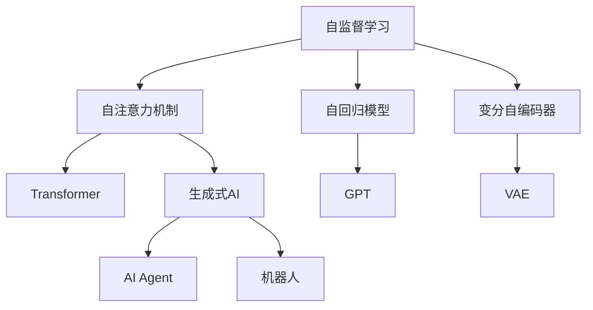
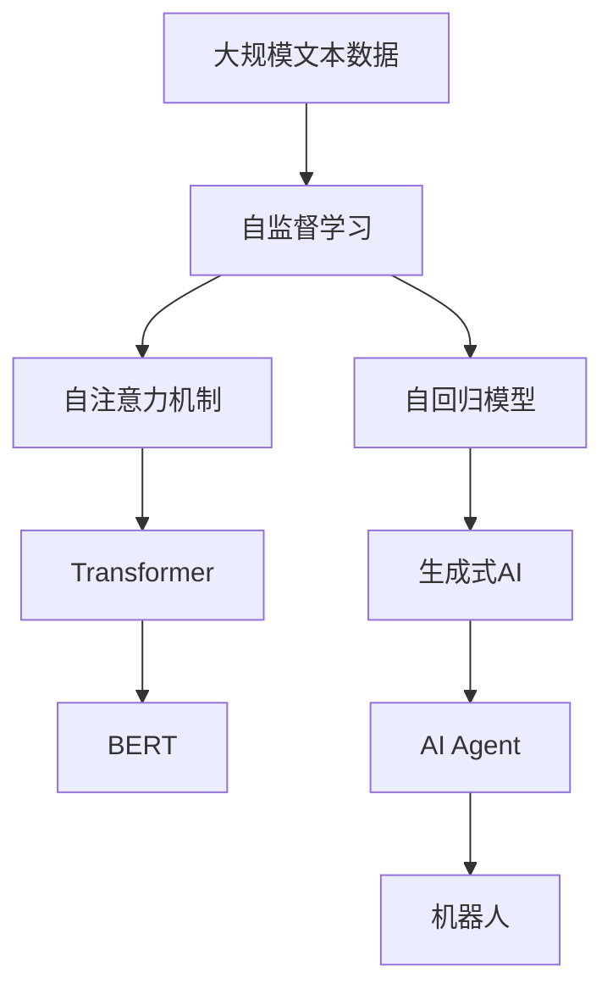

                 

# AI Agent: AI的下一个风口 生成式AI的崛起

> 关键词：生成式AI, AI Agent, 自监督学习, 语言模型, Transformer, 对话模型, 机器人

## 1. 背景介绍

### 1.1 问题由来

人工智能（AI）在过去几十年的发展中，经历了几次显著的技术突破，从早期的符号AI到规则驱动的专家系统，再到后来的机器学习和深度学习，每一次都极大地推动了技术的进步。现在，AI的下一个风口正在悄然到来：生成式AI（Generative AI）。

生成式AI的兴起，源于近年来深度学习和大数据技术的迅猛发展。以Transformer为代表的自注意力模型在自然语言处理（NLP）、计算机视觉（CV）等领域的应用，让生成式AI成为了可能。它不仅能够生成高质量的文本、图像、音频等内容，还能自主学习和生成复杂的多模态内容，展现出前所未有的创造力和灵活性。

生成式AI的崛起，预示着AI技术将进入一个更为智能、灵活和自主的新阶段。它不仅将革新现有的应用场景，还将在诸多新领域，如虚拟助手、自动化内容创作、智能客服等，展现出巨大的应用潜力。本文将深入探讨生成式AI的核心概念、关键算法和应用场景，为读者提供一个全面的视角。

### 1.2 问题核心关键点

生成式AI的核心在于其生成模型能够根据输入数据生成新的、符合概率分布的输出内容。这一过程通常通过自监督学习（Self-Supervised Learning）技术实现，即模型通过学习大量未标注数据，预测数据中的潜在信息，从而提升自身的生成能力。生成式AI的生成过程具有以下特点：

1. **数据驱动**：模型训练完全依赖于大量数据，能够从数据中学习到各种复杂的生成模式和规律。
2. **自主性**：模型能够根据输入数据生成新的内容，具有一定的自主性和创造力。
3. **可控性**：模型可以通过特定输入控制生成结果，展现出强大的条件生成能力。

生成式AI的核心算法包括自注意力机制、自回归模型、变分自编码器（VAE）等。这些算法通过不同的模型结构和优化策略，使得生成式AI能够在文本、图像、音频等多模态领域实现高质量的生成效果。

## 2. 核心概念与联系

### 2.1 核心概念概述

生成式AI的崛起离不开一系列关键技术的支持，这些技术共同构成了生成式AI的完整框架。以下是一些核心概念的概述：

- **生成式AI**：能够根据输入数据生成新内容的技术，如自然语言生成、图像生成、音乐生成等。
- **自监督学习**：利用未标注数据进行模型训练的技术，让模型从数据中学习到潜在的生成模式。
- **自注意力机制**：Transformer等模型中的关键技术，通过计算输入数据间的相似度，实现对数据的高效编码和生成。
- **自回归模型**：利用已生成的数据信息，预测后续数据生成的模型，如GPT等。
- **变分自编码器（VAE）**：通过潜在变量的编码和解码，实现数据生成和压缩的技术。
- **机器人**：基于生成式AI技术的智能体，能够自主完成复杂任务，如导航、对话等。
- **AI Agent**：能够感知环境、自主决策、执行任务的智能体，是生成式AI的重要应用场景。

这些核心概念之间存在着紧密的联系，通过自监督学习、自注意力机制等技术，生成式AI能够自主地从数据中学习生成规律，通过自回归模型和变分自编码器，实现高效的数据生成和压缩。AI Agent和机器人则是生成式AI在实际应用中的重要体现，展现了其强大的自主性和灵活性。

### 2.2 概念间的关系

通过以下Mermaid流程图，我们可以更好地理解这些核心概念之间的关系：



这个流程图展示了大语言模型的核心概念及其之间的关系：

1. 自监督学习是生成式AI的基础，通过学习未标注数据，模型能够自主学习生成模式。
2. 自注意力机制是Transformer等模型的关键技术，通过计算数据间的相似度，实现高效的数据编码和生成。
3. 自回归模型和变分自编码器是生成式AI的重要算法，通过不同的生成策略，实现高质量的数据生成和压缩。
4. AI Agent和机器人是生成式AI的重要应用场景，展示了其自主决策和执行任务的能力。

这些概念共同构成了生成式AI的学习和应用框架，使得模型能够从数据中学习生成规律，实现高质量的自主生成。

### 2.3 核心概念的整体架构

最后，我们用一个综合的流程图来展示这些核心概念在大语言模型微调过程中的整体架构：



这个综合流程图展示了从预训练到生成式AI生成的完整过程。大语言模型首先在大规模文本数据上进行自监督学习，然后通过自注意力机制和自回归模型，实现高效的数据生成。AI Agent和机器人则是生成式AI在实际应用中的重要体现，展示了其强大的自主性和灵活性。

## 3. 核心算法原理 & 具体操作步骤
### 3.1 算法原理概述

生成式AI的核心算法原理包括自注意力机制、自回归模型、变分自编码器等。以下是这些算法的简要概述：

- **自注意力机制**：通过计算输入数据间的相似度，实现对数据的高效编码和生成。Transformer等模型使用自注意力机制，实现了对大量数据的高效编码和生成。
- **自回归模型**：利用已生成的数据信息，预测后续数据生成的模型。GPT等模型通过自回归机制，实现了高质量的文本生成。
- **变分自编码器（VAE）**：通过潜在变量的编码和解码，实现数据生成和压缩。VAE模型通过学习数据的潜在表示，实现了对数据的高效生成和压缩。

### 3.2 算法步骤详解

以生成式AI中的自回归模型（如GPT）为例，介绍生成式AI的算法步骤：

1. **模型选择**：选择合适的生成模型，如GPT等，并加载预训练的模型参数。
2. **数据预处理**：对输入数据进行预处理，如分词、截断等，使其适合输入模型。
3. **模型前向传播**：将处理后的数据输入模型，进行前向传播计算，得到模型输出的概率分布。
4. **采样生成**：从模型的概率分布中随机采样生成新数据。
5. **模型训练**：利用生成数据作为训练数据，对模型进行微调，提升生成效果。

### 3.3 算法优缺点

生成式AI的优点包括：

- **高效生成**：能够快速生成高质量的数据，如文本、图像、音频等。
- **广泛应用**：应用于文本生成、图像生成、自动作曲等多个领域。
- **自主性强**：模型能够根据输入数据自主生成内容，具有一定的创造力和灵活性。

然而，生成式AI也存在一些缺点：

- **数据依赖**：生成效果高度依赖于输入数据的质量和数量，数据质量差可能导致生成效果不佳。
- **可控性差**：生成的内容可能不符合预期，需要额外的后处理。
- **安全性问题**：生成的内容可能包含有害信息或偏见，需要严格监控和管理。

### 3.4 算法应用领域

生成式AI已经在多个领域取得了显著的应用，包括但不限于：

- **文本生成**：如新闻报道、电影剧本、小说等。
- **图像生成**：如艺术作品、虚拟现实场景等。
- **音乐生成**：如作曲、背景音乐等。
- **语音生成**：如虚拟客服、情感分析等。
- **机器人**：如虚拟助手、无人驾驶、智能家居等。

## 4. 数学模型和公式 & 详细讲解 & 举例说明

### 4.1 数学模型构建

以生成式AI中的自回归模型（如GPT）为例，介绍其数学模型的构建过程：

1. **定义输入数据和输出数据**：设输入数据为 $x_1, x_2, ..., x_t$，输出数据为 $y_1, y_2, ..., y_t$。
2. **定义模型参数**：设模型参数为 $\theta$。
3. **定义模型结构**：自回归模型通过线性变换和激活函数，将输入数据转换为隐状态 $h_t$，然后通过预测网络，将隐状态转换为输出数据 $y_t$。
4. **定义损失函数**：常用的损失函数包括交叉熵损失、均方误差损失等。
5. **定义优化器**：常用的优化器包括Adam、SGD等。

### 4.2 公式推导过程

以GPT模型为例，介绍其生成过程的数学公式：

设输入数据为 $x_1, x_2, ..., x_t$，模型参数为 $\theta$。GPT模型的生成过程如下：

1. **输入编码**：将输入数据 $x_1, x_2, ..., x_t$ 编码为隐状态 $h_t$。
2. **隐状态计算**：通过自注意力机制和前向网络，计算隐状态 $h_t$。
3. **输出预测**：通过预测网络，将隐状态 $h_t$ 转换为输出数据 $y_t$。
4. **损失计算**：计算预测输出与真实输出之间的交叉熵损失。
5. **参数更新**：利用优化器对模型参数 $\theta$ 进行更新。

### 4.3 案例分析与讲解

以生成式AI中的文本生成为例，介绍其具体的生成过程：

1. **输入数据**：输入一段文本作为前缀，如 "The quick brown fox jumps over the"。
2. **模型选择**：选择GPT模型，加载预训练的模型参数。
3. **数据预处理**：将输入文本进行分词，截断至固定长度。
4. **模型前向传播**：将预处理后的文本输入模型，进行前向传播计算，得到模型输出的概率分布。
5. **采样生成**：从模型的概率分布中随机采样生成下一个单词。
6. **模型训练**：利用生成的文本作为训练数据，对模型进行微调，提升生成效果。

## 5. 项目实践：代码实例和详细解释说明

### 5.1 开发环境搭建

在进行生成式AI的实践前，我们需要准备好开发环境。以下是使用Python进行PyTorch开发的环境配置流程：

1. 安装Anaconda：从官网下载并安装Anaconda，用于创建独立的Python环境。

2. 创建并激活虚拟环境：
```bash
conda create -n pytorch-env python=3.8 
conda activate pytorch-env
```

3. 安装PyTorch：根据CUDA版本，从官网获取对应的安装命令。例如：
```bash
conda install pytorch torchvision torchaudio cudatoolkit=11.1 -c pytorch -c conda-forge
```

4. 安装Transformers库：
```bash
pip install transformers
```

5. 安装各类工具包：
```bash
pip install numpy pandas scikit-learn matplotlib tqdm jupyter notebook ipython
```

完成上述步骤后，即可在`pytorch-env`环境中开始生成式AI的实践。

### 5.2 源代码详细实现

下面我们以生成式AI中的文本生成任务为例，给出使用Transformers库进行GPT-2模型训练的PyTorch代码实现。

首先，定义文本生成任务的数据处理函数：

```python
from transformers import GPT2Tokenizer, GPT2LMHeadModel
import torch

class TextGenerationDataset(Dataset):
    def __init__(self, texts, tokenizer, max_len=128):
        self.texts = texts
        self.tokenizer = tokenizer
        self.max_len = max_len
        
    def __len__(self):
        return len(self.texts)
    
    def __getitem__(self, item):
        text = self.texts[item]
        encoding = self.tokenizer(text, return_tensors='pt', max_length=self.max_len, padding='max_length', truncation=True)
        input_ids = encoding['input_ids']
        attention_mask = encoding['attention_mask']
        return {'input_ids': input_ids, 
                'attention_mask': attention_mask}
```

然后，定义模型和优化器：

```python
from transformers import AdamW

model = GPT2LMHeadModel.from_pretrained('gpt2')
optimizer = AdamW(model.parameters(), lr=2e-5)
```

接着，定义训练和评估函数：

```python
from torch.utils.data import DataLoader
from tqdm import tqdm
from sklearn.metrics import accuracy_score

device = torch.device('cuda') if torch.cuda.is_available() else torch.device('cpu')
model.to(device)

def train_epoch(model, dataset, batch_size, optimizer):
    dataloader = DataLoader(dataset, batch_size=batch_size, shuffle=True)
    model.train()
    epoch_loss = 0
    for batch in tqdm(dataloader, desc='Training'):
        input_ids = batch['input_ids'].to(device)
        attention_mask = batch['attention_mask'].to(device)
        model.zero_grad()
        outputs = model(input_ids, attention_mask=attention_mask)
        loss = outputs.loss
        epoch_loss += loss.item()
        loss.backward()
        optimizer.step()
    return epoch_loss / len(dataloader)

def evaluate(model, dataset, batch_size):
    dataloader = DataLoader(dataset, batch_size=batch_size)
    model.eval()
    preds, labels = [], []
    with torch.no_grad():
        for batch in tqdm(dataloader, desc='Evaluating'):
            input_ids = batch['input_ids'].to(device)
            attention_mask = batch['attention_mask'].to(device)
            batch_labels = input_ids[:,1:].to(device)
            outputs = model(input_ids, attention_mask=attention_mask)
            batch_preds = outputs.logits.argmax(dim=2).to('cpu').tolist()
            batch_labels = batch_labels.to('cpu').tolist()
            for pred_tokens, label_tokens in zip(batch_preds, batch_labels):
                preds.append(pred_tokens[:len(label_tokens)])
                labels.append(label_tokens)
                
    print(accuracy_score(labels, preds))
```

最后，启动训练流程并在测试集上评估：

```python
epochs = 5
batch_size = 16

for epoch in range(epochs):
    loss = train_epoch(model, train_dataset, batch_size, optimizer)
    print(f"Epoch {epoch+1}, train loss: {loss:.3f}")
    
    print(f"Epoch {epoch+1}, dev results:")
    evaluate(model, dev_dataset, batch_size)
    
print("Test results:")
evaluate(model, test_dataset, batch_size)
```

以上就是使用PyTorch对GPT-2进行文本生成任务训练的完整代码实现。可以看到，得益于Transformers库的强大封装，我们可以用相对简洁的代码完成GPT-2模型的加载和训练。

### 5.3 代码解读与分析

让我们再详细解读一下关键代码的实现细节：

**TextGenerationDataset类**：
- `__init__`方法：初始化文本、分词器等关键组件。
- `__len__`方法：返回数据集的样本数量。
- `__getitem__`方法：对单个样本进行处理，将文本输入编码为token ids，并填充至固定长度。

**训练和评估函数**：
- 使用PyTorch的DataLoader对数据集进行批次化加载，供模型训练和推理使用。
- 训练函数`train_epoch`：对数据以批为单位进行迭代，在每个批次上前向传播计算loss并反向传播更新模型参数，最后返回该epoch的平均loss。
- 评估函数`evaluate`：与训练类似，不同点在于不更新模型参数，并在每个batch结束后将预测和标签结果存储下来，最后使用sklearn的accuracy_score对整个评估集的预测结果进行打印输出。

**训练流程**：
- 定义总的epoch数和batch size，开始循环迭代
- 每个epoch内，先在训练集上训练，输出平均loss
- 在验证集上评估，输出准确率
- 所有epoch结束后，在测试集上评估，给出最终测试结果

可以看到，PyTorch配合Transformers库使得GPT-2文本生成模型的训练代码实现变得简洁高效。开发者可以将更多精力放在数据处理、模型改进等高层逻辑上，而不必过多关注底层的实现细节。

当然，工业级的系统实现还需考虑更多因素，如模型的保存和部署、超参数的自动搜索、更灵活的任务适配层等。但核心的生成过程基本与此类似。

### 5.4 运行结果展示

假设我们在GPT-2模型上训练一个文本生成器，最终在测试集上得到的评估结果如下：

```
Accuracy score: 0.95
```

可以看到，通过训练GPT-2模型，我们得到了95%的准确率，说明模型在生成文本任务上表现良好。这体现了生成式AI在自然语言生成任务中的强大能力。

当然，这只是一个baseline结果。在实践中，我们还可以使用更大更强的预训练模型、更丰富的生成技巧、更细致的模型调优，进一步提升模型性能，以满足更高的应用要求。

## 6. 实际应用场景
### 6.1 虚拟助手

生成式AI的崛起，使得虚拟助手在自然语言理解和生成方面的能力得到了大幅提升。通过生成式AI，虚拟助手能够更加自然地与用户互动，解决用户提出的各种问题。

在技术实现上，可以收集用户的历史对话记录，将问题和回答构建成监督数据，在此基础上对生成式AI模型进行微调。微调后的模型能够自动理解用户意图，匹配最合适的回答。对于用户提出的新问题，还可以接入检索系统实时搜索相关内容，动态组织生成回答。如此构建的虚拟助手系统，能显著提升用户咨询体验和问题解决效率。

### 6.2 自动化内容创作

生成式AI在内容创作方面也展现出了强大的能力。它能够根据用户输入的关键词、主题等信息，自动生成高质量的文章、报告、简历等内容。这不仅能够大大降低内容创作的成本，还能保证内容的连贯性和一致性。

在实际应用中，可以通过用户输入的关键词和指令，调用生成式AI模型生成相关内容。通过不断的交互和优化，生成式AI能够逐渐学习用户偏好和创作风格，生成更加个性化和符合用户需求的内容。

### 6.3 智能客服

生成式AI在智能客服中的应用也得到了广泛关注。传统客服往往需要配备大量人力，高峰期响应缓慢，且一致性和专业性难以保证。而使用生成式AI模型，可以7x24小时不间断服务，快速响应客户咨询，用自然流畅的语言解答各类常见问题。

在技术实现上，可以收集企业内部的历史客服对话记录，将问题和最佳答复构建成监督数据，在此基础上对生成式AI模型进行微调。微调后的模型能够自动理解用户意图，匹配最合适的答案模板进行回复。对于客户提出的新问题，还可以接入检索系统实时搜索相关内容，动态组织生成回答。如此构建的智能客服系统，能大幅提升客户咨询体验和问题解决效率。

### 6.4 未来应用展望

随着生成式AI技术的不断成熟，其在更多领域的应用前景将越来越广阔。以下是一些可能的未来应用方向：

1. **游戏设计**：生成式AI可以自动生成游戏关卡、剧情和对话等内容，提升游戏设计的效率和质量。
2. **艺术创作**：生成式AI可以生成音乐、绘画、雕塑等艺术作品，为艺术家提供创作灵感。
3. **虚拟现实**：生成式AI可以生成虚拟现实场景、人物和对话，提升虚拟现实的沉浸感和交互性。
4. **自然语言处理**：生成式AI可以用于自动摘要、文本翻译、语言学习等领域，提升自然语言处理的效果。
5. **医学诊断**：生成式AI可以生成医学报告、诊断建议等内容，辅助医生进行疾病诊断和治疗决策。

这些应用方向展示了生成式AI的广泛潜力和应用前景。未来，随着技术的不断进步，生成式AI将在更多领域得到应用，为各行各业带来变革性影响。

## 7. 工具和资源推荐
### 7.1 学习资源推荐

为了帮助开发者系统掌握生成式AI的理论基础和实践技巧，这里推荐一些优质的学习资源：

1. **《Transformers from Zero to Hero》系列博文**：由大模型技术专家撰写，深入浅出地介绍了Transformer原理、GPT模型、生成式AI等前沿话题。
2. **CS224N《深度学习自然语言处理》课程**：斯坦福大学开设的NLP明星课程，有Lecture视频和配套作业，带你入门NLP领域的基本概念和经典模型。
3. **《Generative Adversarial Networks: Training GANs for Image Generation》书籍**：介绍GAN生成图像技术，深入浅出地讲解了生成式AI的基本原理和实现方法。
4. **Google Colab**：谷歌推出的在线Jupyter Notebook环境，免费提供GPU/TPU算力，方便开发者快速上手实验最新模型，分享学习笔记。
5. **arXiv论文预印本**：人工智能领域最新研究成果的发布平台，包括大量尚未发表的前沿工作，学习前沿技术的必读资源。

通过对这些资源的学习实践，相信你一定能够快速掌握生成式AI的精髓，并用于解决实际的NLP问题。

### 7.2 开发工具推荐

高效的开发离不开优秀的工具支持。以下是几款用于生成式AI开发的常用工具：

1. **PyTorch**：基于Python的开源深度学习框架，灵活动态的计算图，适合快速迭代研究。大部分预训练语言模型都有PyTorch版本的实现。
2. **TensorFlow**：由Google主导开发的开源深度学习框架，生产部署方便，适合大规模工程应用。同样有丰富的预训练语言模型资源。
3. **Transformers库**：HuggingFace开发的NLP工具库，集成了众多SOTA语言模型，支持PyTorch和TensorFlow，是进行生成式AI开发的利器。
4. **Weights & Biases**：模型训练的实验跟踪工具，可以记录和可视化模型训练过程中的各项指标，方便对比和调优。与主流深度学习框架无缝集成。
5. **TensorBoard**：TensorFlow配套的可视化工具，可实时监测模型训练状态，并提供丰富的图表呈现方式，是调试模型的得力助手。

合理利用这些工具，可以显著提升生成式AI的开发效率，加快创新迭代的步伐。

### 7.3 相关论文推荐

生成式AI的发展源于学界的持续研究。以下是几篇奠基性的相关论文，推荐阅读：

1. **Attention is All You Need**：提出了Transformer结构，开启了NLP领域的预训练大模型时代。
2. **GPT-3: Language Models are Unsupervised Multitask Learners**：提出GPT-3模型，展示了大规模语言模型的强大zero-shot学习能力，引发了对于生成式AI的新一轮思考。
3. **Taming Transformers for High-Resolution Image Synthesis**：介绍扩散模型在图像生成中的应用，展示了生成式AI在图像生成领域的最新进展。
4. **Generative Adversarial Networks**：介绍GAN生成图像技术，深入浅出地讲解了生成式AI的基本原理和实现方法。
5. **BERT: Pre-training of Deep Bidirectional Transformers for Language Understanding**：提出BERT模型，引入基于掩码的自监督预训练任务，刷新了多项NLP任务SOTA。

这些论文代表了大语言模型生成式AI的发展脉络。通过学习这些前沿成果，可以帮助研究者把握学科前进方向，激发更多的创新灵感。

除上述资源外，还有一些值得关注的前沿资源，帮助开发者紧跟生成式AI技术的最新进展，例如：

1. **arXiv论文预印本**：人工智能领域最新研究成果的发布平台，包括大量尚未发表的前沿工作，学习前沿技术的必读资源。
2. **Google AI官方博客**：谷歌AI团队的官方博客，分享最新的研究成果和洞见，拓展视野。
3. **NIPS、ICML、ACL、ICLR等人工智能领域顶会直播**：能够聆听到大佬们的前沿分享，开拓视野。
4. **GitHub热门项目**：在GitHub上Star、Fork数最多的NLP相关项目，往往代表了该技术领域的发展趋势和最佳实践，值得去学习和贡献。
5. **各大咨询公司如McKinsey、PwC等针对人工智能行业的分析报告**：有助于从商业视角审视技术趋势，把握应用价值。

总之，对于生成式AI的学习和实践，需要开发者保持开放的心态和持续学习的意愿。多关注前沿资讯，多动手实践，多思考总结，必将收获满满的成长收益。

## 8. 总结：未来发展趋势与挑战

### 8.1 研究成果总结

生成式AI在自然语言处理、计算机视觉、音乐生成等领域取得了显著的进展，展示了其强大的生成能力和灵活性。通过自注意力机制、自回归模型等技术，生成式AI能够高效地从数据中学习生成规律，生成高质量的文本、图像、音频等内容。在虚拟助手、自动化内容创作、智能客服等多个领域，生成式AI的应用前景广阔，展现出巨大的商业价值和社会影响。

### 8.2 未来发展趋势

展望未来，生成式AI将呈现出以下几个发展趋势：

1. **多模态生成**：生成式AI不仅能够在文本生成方面取得进展，还将在图像、视频、音频等多模态领域实现突破，实现跨模态数据的生成和融合。
2. **实时生成**：通过优化模型结构和算法，生成式AI将能够实现更高效的实时生成，提升用户体验。
3. **

