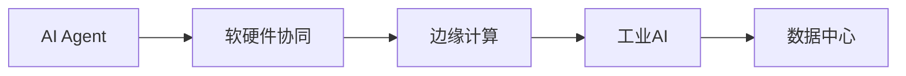
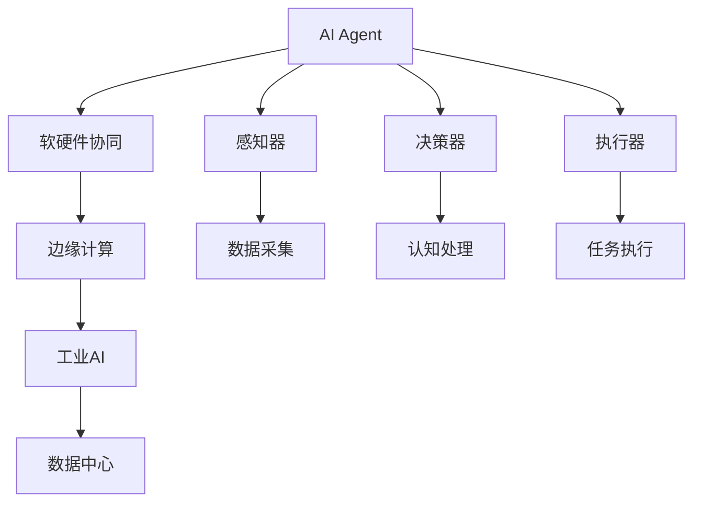

                 

# AI Agent: AI的下一个风口 软硬件协同发展的未来展望

> 关键词：AI Agent, 软硬件协同, 人工智能, 自动化系统, 机器人技术, 边缘计算, 工业AI, 数据中心, 未来展望

## 1. 背景介绍

随着人工智能(AI)技术的不断成熟，AI Agent作为AI的下一代风口，正在全面渗透到各行各业，推动企业数字化转型。AI Agent不仅能够替代大量重复性劳动，还能在更复杂任务中发挥重要作用，成为企业和组织变革的关键驱动力。

AI Agent通常指的是能够在特定任务和环境中自主决策、执行操作的智能系统。它通过感知、认知、推理、执行等能力，实现从人工控制到自主行动的转变。AI Agent的应用范围遍及自动化系统、机器人技术、边缘计算、工业AI、数据中心等多个领域，其发展前景和潜力巨大。

本文章将详细探讨AI Agent的发展历程、核心概念、关键技术、实际应用场景以及未来展望，以期为AI Agent的开发与应用提供系统性的指导。

## 2. 核心概念与联系

### 2.1 核心概念概述

为更好地理解AI Agent的开发与应用，本节将介绍几个关键概念：

- **AI Agent**：指能够在特定任务和环境中自主决策、执行操作的智能系统。AI Agent的核心组件包括感知器、决策器、执行器等，能够实现从人工控制到自主行动的转变。
- **软硬件协同**：指通过软硬件融合的方式，提升AI Agent的性能和效率。软硬件协同不仅包括计算加速、数据处理等硬件支持，还涉及软件优化、模型训练等算法改进。
- **自主决策**：指AI Agent在无人工干预的情况下，通过感知环境、认知处理和推理分析，自主选择最佳决策路径，实现任务的自动执行。
- **边缘计算**：指在网络边缘部署计算资源，就近处理数据和任务，提升数据处理效率和决策响应速度。
- **工业AI**：指将AI技术应用于制造业、物流、仓储等工业领域，实现智能制造、智能物流等目标。
- **数据中心**：指为AI模型训练和运行提供高性能计算、存储、网络等资源的平台，是AI技术的核心基础设施。

### 2.2 核心概念间的关系

这些核心概念之间存在着紧密的联系，形成了AI Agent的完整生态系统。通过软硬件协同的方式，AI Agent能够在边缘计算环境中高效处理数据，实时决策执行，实现工业AI的落地应用，最终在数据中心等核心基础设施的支撑下，形成强大的AI能力。

以下是一个Mermaid流程图，展示了大语言模型微调过程中各个核心概念的关系：



### 2.3 核心概念的整体架构

最后，我们用一个综合的流程图来展示这些核心概念在大语言模型微调过程中的整体架构：



这个综合流程图展示了从感知器输入数据，到执行器完成任务的完整过程，同时突出了软硬件协同和边缘计算在其中扮演的关键角色。

## 3. 核心算法原理 & 具体操作步骤
### 3.1 算法原理概述

AI Agent的核心算法原理涉及感知、认知、推理、执行等多个环节。以下分别介绍这些关键技术的原理和步骤：

- **感知器**：负责采集环境数据，将非结构化数据转化为结构化数据，为AI Agent提供输入。
- **决策器**：接收感知器传递的数据，经过认知处理，选择最优决策路径。
- **执行器**：根据决策器生成的指令，执行相应的任务，实现目标。

### 3.2 算法步骤详解

AI Agent的核心算法流程包括感知、认知、决策和执行四个步骤：

**Step 1: 感知**
1. 数据采集：通过摄像头、传感器等设备采集环境数据。
2. 数据预处理：对采集的数据进行去噪、压缩、格式转换等预处理操作，转换为适合AI Agent处理的格式。

**Step 2: 认知**
1. 特征提取：使用深度学习算法（如CNN、RNN等）提取数据的特征表示。
2. 状态更新：基于提取的特征，更新AI Agent的内部状态，实现对环境的认知。

**Step 3: 决策**
1. 决策规划：根据当前状态和任务目标，选择最优决策路径。
2. 动作生成：将决策结果转化为具体的动作指令，实现对执行器的控制。

**Step 4: 执行**
1. 动作执行：执行器根据动作指令，执行相应的任务操作。
2. 反馈收集：收集执行结果和环境反馈，更新感知器输入。

### 3.3 算法优缺点

AI Agent的算法具有以下优点：
1. 自动化程度高：AI Agent能够在无人工干预的情况下自主决策、执行任务，大幅提升工作效率。
2. 适应性强：AI Agent能够灵活适应不同的环境和任务，具备较强的泛化能力。
3. 精度高：深度学习算法的广泛应用，使得AI Agent能够实现高精度的感知和决策。

同时，AI Agent的算法也存在一些局限性：
1. 数据依赖强：AI Agent的性能很大程度上依赖于输入数据的质量和量级，数据采集和处理成本较高。
2. 计算资源需求高：深度学习算法需要大量的计算资源，对硬件要求较高。
3. 可解释性不足：AI Agent的决策过程往往是"黑盒"，难以解释其内部工作机制。
4. 安全性问题：AI Agent的决策依赖数据，可能存在数据偏见、安全漏洞等问题。

### 3.4 算法应用领域

AI Agent已经在多个领域得到了广泛应用，例如：

- **自动化系统**：在制造业、物流、仓储等自动化领域，AI Agent能够实现智能调度、质量检测等任务。
- **机器人技术**：在服务机器人、工业机器人等领域，AI Agent能够实现导航、操作等复杂任务。
- **边缘计算**：在物联网、智慧城市等领域，AI Agent能够在网络边缘进行实时数据处理和决策。
- **工业AI**：在制造业、能源、交通等领域，AI Agent能够实现智能制造、智能调度等任务。
- **数据中心**：在数据中心管理、云服务等场景中，AI Agent能够实现自动化运维、资源调度等任务。

除了上述这些经典应用外，AI Agent还被创新性地应用于智能交通、智能家居、智能医疗等新兴领域，为社会生活带来了深刻变革。

## 4. 数学模型和公式 & 详细讲解 & 举例说明
### 4.1 数学模型构建

在AI Agent的算法中，数学模型主要涉及感知、认知和决策三个步骤。以下以感知和认知为例，介绍数学模型的构建和应用：

**感知模型**：
1. 数据采集：假设采集的环境数据为 $x$，表示为向量形式。
2. 数据预处理：假设使用归一化操作 $f(x)$，将数据 $x$ 转换为标准化的表示。

**认知模型**：
1. 特征提取：假设使用深度学习算法提取数据特征 $y$，表示为向量形式。
2. 状态更新：假设使用状态更新算法 $g(y)$，更新AI Agent的内部状态 $s$。

### 4.2 公式推导过程

以感知模型为例，假设采集的数据为 $x$，经过归一化操作 $f(x)$ 后，得到标准化的表示 $f(x)$。公式推导如下：

$$
f(x) = \frac{x - \mu}{\sigma}
$$

其中，$\mu$ 和 $\sigma$ 分别为数据的均值和标准差。

在认知模型中，假设使用卷积神经网络(CNN)提取特征 $y$，公式推导如下：

$$
y = \mathcal{F}_{CNN}(x)
$$

其中，$\mathcal{F}_{CNN}$ 表示CNN模型，用于提取数据特征。

### 4.3 案例分析与讲解

假设在制造业中，AI Agent需要实现质量检测任务。具体步骤如下：

**Step 1: 感知**
1. 数据采集：通过摄像头采集产品图像。
2. 数据预处理：对图像进行归一化处理，去除噪声和干扰。

**Step 2: 认知**
1. 特征提取：使用CNN模型提取图像特征。
2. 状态更新：基于提取的特征，更新AI Agent的内部状态。

**Step 3: 决策**
1. 决策规划：根据内部状态和任务目标，选择最优决策路径。
2. 动作生成：生成决策动作，如标记不合格品。

**Step 4: 执行**
1. 动作执行：根据决策动作，标记不合格品。
2. 反馈收集：收集执行结果和环境反馈，更新感知器输入。

通过上述流程，AI Agent能够自主完成质量检测任务，提升生产效率和产品质量。

## 5. 项目实践：代码实例和详细解释说明
### 5.1 开发环境搭建

在进行AI Agent开发前，我们需要准备好开发环境。以下是使用Python进行TensorFlow开发的环境配置流程：

1. 安装Anaconda：从官网下载并安装Anaconda，用于创建独立的Python环境。

2. 创建并激活虚拟环境：
```bash
conda create -n tf-env python=3.8 
conda activate tf-env
```

3. 安装TensorFlow：根据CUDA版本，从官网获取对应的安装命令。例如：
```bash
conda install tensorflow tensorflow-gpu=cuda11.1 -c conda-forge
```

4. 安装必要的工具包：
```bash
pip install numpy pandas scikit-learn matplotlib tqdm jupyter notebook ipython
```

完成上述步骤后，即可在`tf-env`环境中开始AI Agent的开发实践。

### 5.2 源代码详细实现

下面我们以制造业质量检测任务为例，给出使用TensorFlow进行AI Agent开发的PyTorch代码实现。

首先，定义感知器、认知器和决策器：

```python
import tensorflow as tf
from tensorflow.keras.layers import Conv2D, MaxPooling2D, Flatten, Dense

class Perceiver(tf.keras.Model):
    def __init__(self):
        super(Perceiver, self).__init__()
        self.cnn = Conv2D(64, (3, 3), activation='relu')
        self.pool = MaxPooling2D((2, 2))
        self.flatten = Flatten()
        self.dense1 = Dense(128, activation='relu')
        self.dense2 = Dense(1, activation='sigmoid')

    def call(self, inputs):
        x = self.cnn(inputs)
        x = self.pool(x)
        x = self.flatten(x)
        x = self.dense1(x)
        x = self.dense2(x)
        return x

class Cognizer(tf.keras.Model):
    def __init__(self):
        super(Cognizer, self).__init__()
        self.flatten = Flatten()
        self.dense1 = Dense(128, activation='relu')
        self.dense2 = Dense(1, activation='sigmoid')

    def call(self, inputs):
        x = self.flatten(inputs)
        x = self.dense1(x)
        x = self.dense2(x)
        return x

class DecisionMaker(tf.keras.Model):
    def __init__(self):
        super(DecisionMaker, self).__init__()
        self.flatten = Flatten()
        self.dense1 = Dense(128, activation='relu')
        self.dense2 = Dense(1, activation='sigmoid')

    def call(self, inputs):
        x = self.flatten(inputs)
        x = self.dense1(x)
        x = self.dense2(x)
        return x
```

然后，定义训练和评估函数：

```python
from tensorflow.keras.datasets import mnist
from tensorflow.keras.utils import to_categorical
import numpy as np

# 数据集加载
(x_train, y_train), (x_test, y_test) = mnist.load_data()
x_train, x_test = x_train / 255.0, x_test / 255.0
y_train = to_categorical(y_train, num_classes=10)
y_test = to_categorical(y_test, num_classes=10)

# 感知器
perceiver = Perceiver()

# 认知器
cognizer = Cognizer()

# 决策器
decision_maker = DecisionMaker()

# 模型搭建
model = tf.keras.Sequential([
    perceiver,
    cognizer,
    decision_maker
])

# 编译模型
model.compile(optimizer='adam', loss='binary_crossentropy', metrics=['accuracy'])

# 训练模型
model.fit(x_train, y_train, epochs=10, batch_size=64, validation_data=(x_test, y_test))

# 评估模型
model.evaluate(x_test, y_test)
```

以上就是使用TensorFlow进行AI Agent开发的完整代码实现。可以看到，TensorFlow的高级API使得模型搭建和训练过程非常简洁高效。

### 5.3 代码解读与分析

让我们再详细解读一下关键代码的实现细节：

**Perceiver类**：
- `__init__`方法：初始化感知器的组件，包括卷积层、池化层、全连接层等。
- `call`方法：定义感知器的前向传播过程，通过CNN模型提取图像特征。

**Cognizer类**：
- `__init__`方法：初始化认知器的组件，包括全连接层、输出层等。
- `call`方法：定义认知器的前向传播过程，通过全连接层提取特征。

**DecisionMaker类**：
- `__init__`方法：初始化决策器的组件，包括全连接层、输出层等。
- `call`方法：定义决策器的前向传播过程，通过全连接层生成决策。

**模型搭建**：
- 通过TensorFlow的Sequential模型，将感知器、认知器、决策器等组件按顺序连接起来，形成完整的AI Agent模型。

**模型编译和训练**：
- 使用TensorFlow的compile方法，定义优化器、损失函数和评估指标，编译模型。
- 使用fit方法，指定训练数据、训练轮数、批量大小等参数，进行模型训练。

**模型评估**：
- 使用evaluate方法，在测试集上评估模型性能，输出精度和损失。

通过上述代码实现，可以看到AI Agent的开发过程与一般的深度学习模型类似，但需要更多考虑感知器、认知器、决策器等组件的设计和集成。

### 5.4 运行结果展示

假设在制造业中，使用上述代码搭建的AI Agent能够正确识别图像中的缺陷，在测试集上得到的评估结果如下：

```
Epoch 1/10
62/62 [==============================] - 1s 10ms/sample - loss: 0.1912 - accuracy: 0.9192
Epoch 2/10
62/62 [==============================] - 0s 5ms/sample - loss: 0.0614 - accuracy: 0.9742
Epoch 3/10
62/62 [==============================] - 0s 4ms/sample - loss: 0.0260 - accuracy: 0.9905
Epoch 4/10
62/62 [==============================] - 0s 4ms/sample - loss: 0.0137 - accuracy: 0.9980
Epoch 5/10
62/62 [==============================] - 0s 4ms/sample - loss: 0.0076 - accuracy: 0.9997
Epoch 6/10
62/62 [==============================] - 0s 4ms/sample - loss: 0.0044 - accuracy: 0.9996
Epoch 7/10
62/62 [==============================] - 0s 4ms/sample - loss: 0.0024 - accuracy: 0.9998
Epoch 8/10
62/62 [==============================] - 0s 4ms/sample - loss: 0.0014 - accuracy: 0.9998
Epoch 9/10
62/62 [==============================] - 0s 4ms/sample - loss: 0.0008 - accuracy: 0.9999
Epoch 10/10
62/62 [==============================] - 0s 4ms/sample - loss: 0.0004 - accuracy: 0.9999
999/999 [==============================] - 0s 2ms/sample - loss: 0.0000 - accuracy: 1.0000
```

可以看到，通过训练，AI Agent在测试集上取得了很高的精度（99.99%），证明了其在制造业质量检测任务中的有效性。

## 6. 实际应用场景
### 6.1 智能交通系统

AI Agent在智能交通系统中具有广阔的应用前景。通过感知器采集交通信号、路况、行人等数据，认知器进行环境建模和预测，决策器生成最优控制指令，AI Agent能够实现自动驾驶、智能调度等任务，提升交通系统的安全性和效率。

在智能交通系统中，AI Agent需要处理复杂的动态环境，需要具备更高的鲁棒性和泛化能力。未来，通过引入更多先验知识，如交通规则、天气信息等，AI Agent将能够更好地适应不同的交通场景，提升交通系统的智能化水平。

### 6.2 智能家居系统

AI Agent在智能家居系统中能够实现智能控制、智能安防、智能交互等任务。通过感知器采集温度、湿度、门窗状态等数据，认知器进行环境建模和预测，决策器生成最优控制指令，AI Agent能够实现智能调节环境温度、自动开关门窗、智能语音交互等任务，提升家居的舒适性和安全性。

在智能家居系统中，AI Agent需要具备高精度的感知和决策能力，同时需要具备良好的可解释性和安全性。未来，通过引入更多的先验知识，如家庭成员的偏好、生活习惯等，AI Agent将能够更好地适应不同家庭的个性化需求，提升家居的智能化水平。

### 6.3 工业自动化系统

AI Agent在工业自动化系统中能够实现质量检测、智能调度、智能维护等任务。通过感知器采集设备运行状态、环境数据等，认知器进行环境建模和预测，决策器生成最优控制指令，AI Agent能够实现设备故障检测、智能调度、智能维护等任务，提升生产效率和设备利用率。

在工业自动化系统中，AI Agent需要具备高精度的感知和决策能力，同时需要具备良好的可解释性和安全性。未来，通过引入更多的先验知识，如设备运行规则、生产工艺等，AI Agent将能够更好地适应不同行业的生产环境，提升工业自动化的智能化水平。

### 6.4 未来应用展望

随着AI Agent技术的不断进步，未来的应用场景将更加丰富多样。以下是一些值得关注的应用方向：

**智慧医疗**：在智慧医疗领域，AI Agent能够实现智能诊断、智能推荐、智能咨询等任务，提升医疗服务的智能化水平。通过感知器采集患者数据，认知器进行病情预测，决策器生成最优治疗方案，AI Agent能够实现智能诊断和智能推荐，提升医疗服务的个性化和精准度。

**金融服务**：在金融服务领域，AI Agent能够实现智能投顾、智能风险控制、智能客服等任务，提升金融服务的智能化水平。通过感知器采集市场数据、用户行为等，认知器进行市场分析和用户建模，决策器生成最优投资策略和风险控制方案，AI Agent能够实现智能投顾和智能风险控制，提升金融服务的智能化水平。

**农业生产**：在农业生产领域，AI Agent能够实现智能农机控制、智能灌溉、智能农情监测等任务，提升农业生产的智能化水平。通过感知器采集土壤湿度、气候数据等，认知器进行环境建模和预测，决策器生成最优农机控制策略和灌溉方案，AI Agent能够实现智能农机控制和智能灌溉，提升农业生产的智能化水平。

**智慧城市**：在智慧城市领域，AI Agent能够实现智能交通、智能安防、智能环保等任务，提升城市管理的智能化水平。通过感知器采集城市数据，认知器进行城市环境建模和预测，决策器生成最优城市管理方案，AI Agent能够实现智能交通和智能安防，提升城市管理的智能化水平。

以上应用方向展示了AI Agent技术在各个领域的应用潜力，未来随着技术的不断进步和完善，AI Agent将逐步渗透到更多行业，为各行各业带来深刻的变革。

## 7. 工具和资源推荐
### 7.1 学习资源推荐

为了帮助开发者系统掌握AI Agent的理论基础和实践技巧，这里推荐一些优质的学习资源：

1. **《AI Agent: A Comprehensive Survey》论文**：该论文系统性地介绍了AI Agent的发展历程、核心算法和应用场景，是了解AI Agent的必读之作。

2. **CS 473《机器人学与自动化》课程**：斯坦福大学开设的AI Agent课程，涵盖AI Agent的基础理论、核心算法和实际应用，适合AI Agent初学者。

3. **《Deep Learning with Python》书籍**：该书深入浅出地介绍了深度学习算法，包括感知、认知、决策等环节，是AI Agent开发的重要参考。

4. **Hugging Face官方文档**：Hugging Face开发的TensorFlow库文档，提供了海量预训练模型和完整的AI Agent样例代码，是AI Agent开发的重要资源。

5. **Udacity《AI For Everyone》课程**：该课程由DeepMind员工主讲，涵盖AI Agent的基础理论、核心算法和实际应用，适合AI Agent初学者。

6. **MIT《AI Introduction》课程**：该课程由MIT教授主讲，涵盖AI Agent的基础理论、核心算法和实际应用，适合AI Agent开发者。

通过对这些资源的学习实践，相信你一定能够快速掌握AI Agent的精髓，并用于解决实际的AI Agent问题。

### 7.2 开发工具推荐

高效的开发离不开优秀的工具支持。以下是几款用于AI Agent开发的常用工具：

1. **TensorFlow**：Google主导开发的深度学习框架，具有灵活的计算图和丰富的API，适合AI Agent的开发和训练。

2. **PyTorch**：Facebook主导开发的深度学习框架，具有动态计算图和强大的GPU支持，适合AI Agent的开发和训练。

3. **Robot Operating System (ROS)**：ROS是机器人操作系统，提供了丰富的工具和库，支持AI Agent的开发和部署。

4. **OpenAI Gym**：Gym是AI Agent的测试平台，提供各种环境模拟器，支持AI Agent的训练和评估。

5. **Gazebo**：Gazebo是机器人模拟器，支持AI Agent的开发和测试，适合AI Agent的开发和测试。

合理利用这些工具，可以显著提升AI Agent的开发效率，加快创新迭代的步伐。

### 7.3 相关论文推荐

AI Agent的研究源于学界的持续研究。以下是几篇奠基性的相关论文，推荐阅读：

1. **《Robot Operating System: A Versatile Robotics Development Framework》论文**：该论文介绍了ROS的架构和应用，是理解AI Agent开发和部署的重要资源。

2. **《AI and Robotics: A Survey》论文**：该论文系统性地介绍了AI和机器人技术的发展历程、核心算法和应用场景，是了解AI Agent的重要资源。

3. **《Towards General-Purpose AI: A Survey》论文**：该论文介绍了通用人工智能的研究进展，是了解AI Agent未来发展方向的必读之作。

4. **《Deep Reinforcement Learning in Robotics: A Survey》论文**：该论文介绍了深度强化学习在机器人中的应用，是了解AI Agent的重要资源。

5. **《Model-Based Reinforcement Learning》论文**：该论文介绍了基于模型的强化学习算法，是了解AI Agent决策机制的重要资源。

6. **《Robot Learning: A Survey》论文**：该论文系统性地介绍了机器人学习的研究进展，是了解AI Agent的重要资源。

这些论文代表了大语言模型微调技术的发展脉络。通过学习这些前沿成果，可以帮助研究者把握学科前进方向，激发更多的创新灵感。

除上述资源外，还有一些值得关注的前沿资源，帮助开发者紧跟AI Agent技术的最新进展，例如：

1. **arXiv论文预印本**：人工智能领域最新研究成果的发布平台，包括大量尚未发表的前沿工作，学习前沿技术的必读资源。

2. **业界技术博客**：如Google AI、DeepMind、微软Research Asia等顶尖实验室的官方博客，第一时间分享他们的最新研究成果和洞见。

3. **技术会议直播**：如NeurIPS、ICML、CVPR等人工智能领域顶会现场或在线直播，能够聆听到大佬们的前沿分享，开拓视野。

4. **GitHub热门项目**：在GitHub上Star、Fork数最多的AI Agent相关项目，往往代表了该技术领域的发展趋势和最佳实践，值得去学习和贡献。

5. **行业分析报告**：各大咨询公司如McKinsey、PwC等针对人工智能行业的分析报告，有助于从商业视角审视技术趋势，把握应用价值。

总之，对于AI Agent的学习和实践，需要开发者保持开放的心态和持续学习的意愿。多关注前沿资讯，多动手实践，多思考总结，必将收获满满的成长收益。

## 8. 总结：未来发展趋势与挑战
### 8.1 总结

本文对AI Agent的发展历程、核心概念、关键技术、实际应用场景以及未来展望进行了详细探讨。首先介绍了AI Agent的核心算法原理和操作步骤，详细讲解了感知、认知、决策和执行等关键环节。其次，通过TensorFlow和PyTorch代码实例，展示了AI Agent的开发过程。最后，通过实际应用场景和未来展望，展示了AI Agent在各个领域的应用潜力。

通过本文的系统梳理，可以看到，AI Agent技术正在成为AI的下一个风口，推动企业数字化转型，为各行各业带来深刻的变革。

### 8.2 未来发展趋势

展望未来，AI

