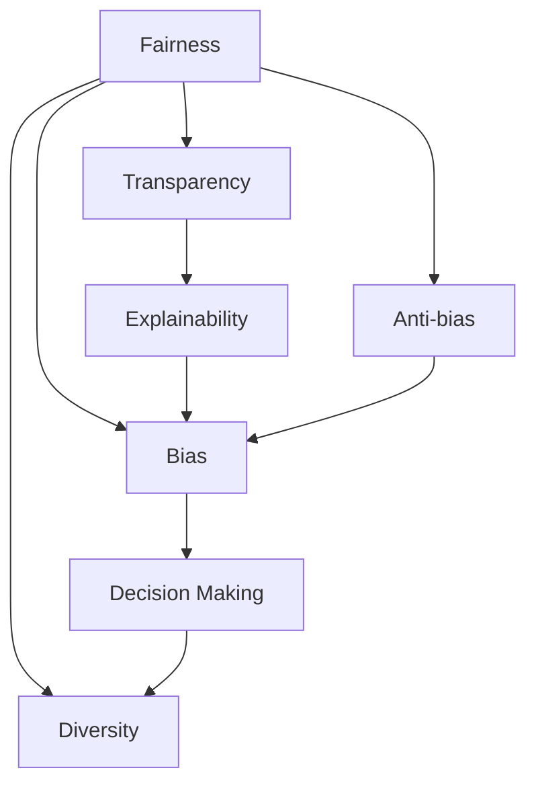
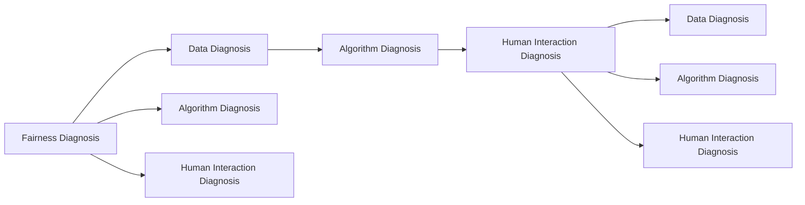
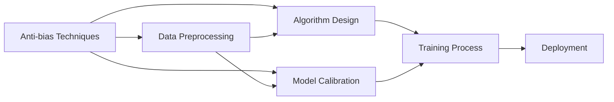
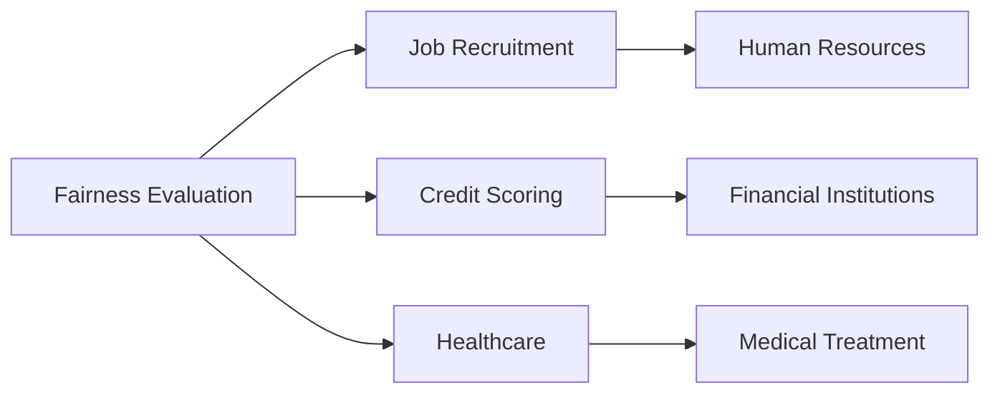
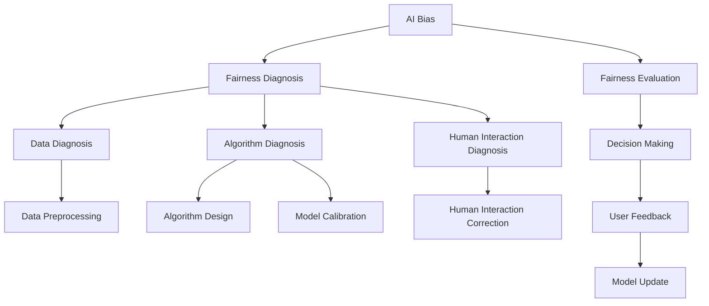

                 

# AI Bias原理与代码实例讲解

## 1. 背景介绍

### 1.1 问题由来
人工智能(AI)系统中的偏误（AI Bias）问题，是指在机器学习模型的开发、训练和应用过程中，由于数据、算法或人机交互等环节的局限性，导致模型输出结果出现不公正、不客观的现象。这一问题在近年来随着AI技术在各个领域的应用日益广泛，受到越来越多的关注和讨论。

偏误问题的表现形式多样，包括但不限于性别偏见、种族偏见、地域偏见等。偏误问题不仅损害了模型的公平性，还可能引发社会不公、歧视等问题，对社会秩序和伦理道德带来严重威胁。因此，如何在AI系统设计中预防和消除偏误，成为了一个亟待解决的重要课题。

### 1.2 问题核心关键点
AI Bias的核心关键点包括：
- 数据源偏见：数据采集和标注过程中可能存在数据选择偏差、数据偏差等问题，导致训练出的模型学习到错误的规律。
- 算法偏差：算法设计、训练过程中可能存在不公算法、过拟合等问题，导致模型输出结果有偏。
- 人机交互偏差：模型训练过程中的人机交互环节可能存在主观偏见，影响模型性能。

AI Bias的诊断和处理需要从数据、算法和模型使用等多个环节进行综合考虑，只有全面识别问题，才能找到有效的解决方案。

### 1.3 问题研究意义
研究和处理AI Bias问题，对于提升AI系统的公平性、透明性和可解释性具有重要意义：

1. **公平性**：消除偏误，确保AI模型在各种人群和场景中的表现一致，避免对某些群体的歧视和偏见。
2. **透明性**：提高AI系统的决策过程的透明度，使得用户可以理解和解释模型的输出，增加信任度。
3. **可解释性**：通过模型分析，揭示AI Bias的来源和影响，指导模型的改进和优化。
4. **伦理保障**：确保AI系统符合伦理道德规范，保护用户隐私和权益。

## 2. 核心概念与联系

### 2.1 核心概念概述

为了更好地理解AI Bias问题，本节将介绍几个密切相关的核心概念：

- **公平性(Fairness)**：AI系统对所有用户的处理结果应当公正无私，不受用户身份、属性等因素的影响。
- **透明性(Transparency)**：AI系统的决策过程应当可以被用户理解和解释，使得用户对其决策有充分的信任。
- **可解释性(Explainability)**：AI系统的决策应当有逻辑和依据，用户可以清楚地理解其推理过程和结果。
- **偏见(Bias)**：AI系统输出结果中的不公正、不客观现象，常常是由数据、算法或人机交互环节中的偏差导致的。
- **多样性(Diversity)**：AI系统应当能够处理多种多样的输入，避免对特定类型数据或用户群体的过度依赖。
- **反偏见(Anti-bias)**：通过数据清洗、算法优化、模型校正等手段，减少或消除AI系统中的偏见。

这些核心概念之间的逻辑关系可以通过以下Mermaid流程图来展示：



这个流程图展示了公平性、透明性、可解释性、偏见、多样性和反偏见这些概念之间的相互关系。公平性和透明性是AI系统所追求的目标，可解释性是实现这些目标的手段，偏见则是实现目标时需要应对和消除的问题，多样性是确保系统不依赖于特定群体的关键因素，反偏见则是应对偏见的策略。

### 2.2 概念间的关系

这些核心概念之间存在着紧密的联系，形成了AI Bias问题的完整生态系统。下面通过几个Mermaid流程图来展示这些概念之间的关系。

#### 2.2.1 AI Bias的诊断



这个流程图展示了AI Bias诊断的一般流程。首先，需要通过数据诊断、算法诊断和人类交互诊断等环节，全面识别AI系统中的偏误问题，然后才能有针对性地进行反偏见处理。

#### 2.2.2 AI Bias的反偏见



这个流程图展示了AI Bias反偏见的一般方法。首先，需要采用数据预处理、算法设计和模型校正等技术，从数据、算法和模型使用等多个环节入手，全面提升AI系统的公平性和透明性。

#### 2.2.3 AI Bias的应用场景



这个流程图展示了AI Bias在不同应用场景中的应用。AI Bias诊断和处理技术，已经广泛应用于招聘、信用评估、医疗等领域，帮助这些领域提升公平性和透明性，减少潜在的偏见和歧视。

### 2.3 核心概念的整体架构

最后，我们用一个综合的流程图来展示这些核心概念在大语言模型微调过程中的整体架构：



这个综合流程图展示了从AI Bias诊断到处理，再到模型评估和更新的完整过程。通过这些流程，可以全面识别AI系统中的偏误问题，并采取有效措施进行反偏见处理，最终提升系统的公平性和透明性。

## 3. 核心算法原理 & 具体操作步骤
### 3.1 算法原理概述

AI Bias的诊断和处理，本质上是一个复杂的系统工程，涉及到数据预处理、算法优化、模型校正等多个环节。其核心思想是通过全面识别和分析AI系统中的偏误问题，然后采取针对性的技术手段进行改进和优化。

形式化地，假设AI系统 $S$ 的输出结果为 $y$，输入为 $x$，系统的决策过程可以用函数 $f(x)$ 表示。AI Bias的诊断和处理可以表示为：

1. **诊断过程**：识别系统中存在的偏误，包括但不限于数据偏差、算法偏差和人类交互偏差。
2. **处理过程**：通过数据预处理、算法优化和模型校正等手段，减少或消除系统中的偏误。

具体来说，诊断过程可以分为以下几个步骤：

- **数据偏差诊断**：使用统计分析方法，如描述统计、假设检验等，识别数据集中的系统性和随机性偏误。
- **算法偏差诊断**：分析算法的决策边界和规则，识别算法中可能存在的偏误。
- **人类交互偏差诊断**：评估用户对AI系统的反馈和行为，识别人类交互环节中的主观偏见。

处理过程可以分为以下几个步骤：

- **数据预处理**：通过数据清洗、特征选择和数据增强等技术，减少数据偏差。
- **算法优化**：调整算法参数或设计新的算法，减少算法偏差。
- **模型校正**：使用校正技术，如权重重新分配、数据重采样等，减少模型偏差。

### 3.2 算法步骤详解

AI Bias的诊断和处理涉及多个步骤，下面详细介绍每个步骤的具体操作。

#### 3.2.1 数据偏差诊断

数据偏差诊断是AI Bias处理的第一步，主要通过数据统计和假设检验等方法，识别数据集中的系统性和随机性偏误。

- **描述统计分析**：使用统计量如均值、方差、偏度等，描述数据集的基本特征。通过可视化工具如直方图、箱线图等，直观展示数据分布情况。
- **假设检验**：使用t检验、卡方检验等方法，检验数据集中的显著差异。例如，可以通过t检验检验不同性别、年龄、种族等群体在某一特征上的均值差异是否显著。
- **特征选择**：使用相关性分析、卡方检验等方法，识别数据集中与目标变量高度相关的特征。通过特征选择，可以减少数据偏差。

#### 3.2.2 算法偏差诊断

算法偏差诊断主要通过分析算法的决策边界和规则，识别算法中可能存在的偏误。

- **决策边界分析**：使用边界决策图（Boundary Decision Tree）、局部敏感性分析（Local Sensitivity Analysis）等方法，分析算法的决策边界。通过可视化决策边界，可以直观地识别出算法中的偏误。
- **规则分析**：使用规则抽取算法，如IF-THEN规则、规则集等，提取算法的决策规则。通过分析规则，可以识别算法中的偏误。
- **模型评估**：使用评估指标如精确率、召回率、F1分数等，评估模型的性能。通过模型评估，可以识别算法中的偏误。

#### 3.2.3 人类交互偏差诊断

人类交互偏差诊断主要通过评估用户对AI系统的反馈和行为，识别人类交互环节中的主观偏见。

- **用户反馈分析**：使用用户反馈数据分析工具，如情感分析、主题分析等，分析用户对AI系统的评价和反馈。通过用户反馈分析，可以识别出用户对AI系统的偏见。
- **行为分析**：使用行为分析工具，如行为跟踪、行为分析等，分析用户与AI系统的交互行为。通过行为分析，可以识别出用户对AI系统的偏见。
- **交互可视化**：使用交互可视化工具，如交互路径图（Interaction Path Graph）、用户轨迹图等，可视化用户与AI系统的交互路径。通过交互可视化，可以识别出用户对AI系统的偏见。

#### 3.2.4 数据预处理

数据预处理是AI Bias处理的核心环节，主要通过数据清洗、特征选择和数据增强等技术，减少数据偏差。

- **数据清洗**：通过数据去重、缺失值填补、异常值检测等方法，清洗数据集中的噪声和错误。通过数据清洗，可以减少数据偏差。
- **特征选择**：通过相关性分析、卡方检验等方法，选择与目标变量高度相关的特征。通过特征选择，可以减少数据偏差。
- **数据增强**：通过数据增强技术，如数据回译、数据增强等，扩充数据集。通过数据增强，可以减少数据偏差。

#### 3.2.5 算法优化

算法优化是AI Bias处理的重要环节，主要通过调整算法参数或设计新的算法，减少算法偏差。

- **算法参数调整**：通过调整算法参数，如学习率、正则化系数等，优化算法性能。通过算法参数调整，可以减少算法偏差。
- **算法设计优化**：设计新的算法，如公平算法、反偏算法等，优化算法性能。通过算法设计优化，可以减少算法偏差。

#### 3.2.6 模型校正

模型校正是AI Bias处理的最后一步，主要通过使用校正技术，如权重重新分配、数据重采样等，减少模型偏差。

- **权重重新分配**：通过重新分配模型的权重，减少模型偏差。通过权重重新分配，可以减少模型偏差。
- **数据重采样**：通过数据重采样，如欠采样、过采样等，减少模型偏差。通过数据重采样，可以减少模型偏差。

### 3.3 算法优缺点

AI Bias的诊断和处理，虽然能够有效减少系统中的偏误，但也存在一些局限性：

- **复杂度高**：AI Bias的诊断和处理涉及多个环节，需要综合考虑数据、算法和模型使用等多个因素，操作复杂。
- **数据依赖性强**：AI Bias的诊断和处理需要大量的标注数据，获取高质量标注数据的成本较高。
- **算法性能波动大**：不同算法和参数设置对偏误的敏感度不同，可能需要多次试验才能找到最优解决方案。
- **用户参与度低**：AI Bias的处理需要用户的反馈和参与，但用户往往缺乏对偏误问题的认知和理解，参与度较低。

尽管存在这些局限性，AI Bias的诊断和处理对于提升AI系统的公平性、透明性和可解释性具有重要意义。未来的研究需要在复杂度、数据依赖性、算法性能和用户参与度等方面进一步优化，才能更好地应对AI系统中的偏误问题。

### 3.4 算法应用领域

AI Bias的诊断和处理，已经广泛应用于以下领域：

- **招聘系统**：通过分析招聘数据，识别和减少招聘过程中的性别、种族等偏误。
- **信用评估**：通过分析信用数据，识别和减少信用评估中的偏误，提高评估的公平性和透明性。
- **医疗系统**：通过分析医疗数据，识别和减少医疗决策中的偏误，提高医疗服务的公平性和透明性。
- **金融系统**：通过分析金融数据，识别和减少金融评估中的偏误，提高评估的公平性和透明性。
- **教育系统**：通过分析教育数据，识别和减少教育评估中的偏误，提高评估的公平性和透明性。

除了上述这些领域外，AI Bias的诊断和处理技术，还在智慧城市、智能交通、智能制造等多个领域得到了应用，为各行各业带来了新的发展机遇。

## 4. 数学模型和公式 & 详细讲解 & 举例说明

### 4.1 数学模型构建

为了更好地理解AI Bias问题，本节将使用数学语言对AI Bias的诊断和处理过程进行更加严格的刻画。

假设AI系统的输出结果为 $y$，输入为 $x$，系统的决策过程可以用函数 $f(x)$ 表示。假设数据集为 $D=\{(x_i,y_i)\}_{i=1}^N$，其中 $x_i$ 为输入，$y_i$ 为输出。AI Bias的诊断和处理可以表示为：

$$
\min_{f} \sum_{i=1}^N \ell(y_i, f(x_i))
$$

其中 $\ell$ 为损失函数，用于衡量预测输出与真实标签之间的差异。常见的损失函数包括交叉熵损失、均方误差损失等。

### 4.2 公式推导过程

以下我们以二分类任务为例，推导交叉熵损失函数及其梯度的计算公式。

假设模型 $f(x)$ 在输入 $x$ 上的输出为 $\hat{y}=f(x) \in [0,1]$，表示样本属于正类的概率。真实标签 $y \in \{0,1\}$。则二分类交叉熵损失函数定义为：

$$
\ell(f(x),y) = -[y\log f(x)+(1-y)\log(1-f(x))]
$$

将其代入经验风险公式，得：

$$
\mathcal{L}(f) = -\frac{1}{N}\sum_{i=1}^N [y_i\log f(x_i)+(1-y_i)\log(1-f(x_i))]
$$

根据链式法则，损失函数对模型参数 $\theta$ 的梯度为：

$$
\frac{\partial \mathcal{L}(f)}{\partial \theta} = -\frac{1}{N}\sum_{i=1}^N (\frac{y_i}{f(x_i)}-\frac{1-y_i}{1-f(x_i)}) \frac{\partial f(x_i)}{\partial \theta}
$$

其中 $\frac{\partial f(x_i)}{\partial \theta}$ 可进一步递归展开，利用自动微分技术完成计算。

在得到损失函数的梯度后，即可带入参数更新公式，完成模型的迭代优化。重复上述过程直至收敛，最终得到适应公平性和透明性的最优模型 $f^*$。

### 4.3 案例分析与讲解

假设我们有一个信用评估模型，目标是预测用户的信用风险。训练数据集包含多个特征，包括性别、年龄、收入、婚姻状况等。但是，由于历史数据中的性别偏见，模型在学习过程中也学到了性别偏见，导致女性用户的信用评估得分普遍偏低。

为了诊断和消除这种偏误，我们可以采取以下步骤：

1. **数据偏差诊断**：使用统计分析方法，如描述统计、假设检验等，识别数据集中的性别偏见。
2. **算法偏差诊断**：使用边界决策图、规则分析等方法，识别算法中的性别偏见。
3. **数据预处理**：通过数据清洗、特征选择等技术，减少数据偏差。
4. **算法优化**：通过调整算法参数、设计新的算法等手段，减少算法偏差。
5. **模型校正**：通过权重重新分配、数据重采样等技术，减少模型偏差。

具体的计算过程和代码实现，下面将详细介绍。

## 5. 项目实践：代码实例和详细解释说明

### 5.1 开发环境搭建

在进行AI Bias诊断和处理实践前，我们需要准备好开发环境。以下是使用Python进行Scikit-learn开发的环境配置流程：

1. 安装Anaconda：从官网下载并安装Anaconda，用于创建独立的Python环境。

2. 创建并激活虚拟环境：
```bash
conda create -n sklearn-env python=3.8 
conda activate sklearn-env
```

3. 安装Scikit-learn：
```bash
pip install -U scikit-learn
```

4. 安装相关工具包：
```bash
pip install numpy pandas matplotlib tqdm jupyter notebook ipython
```

完成上述步骤后，即可在`sklearn-env`环境中开始AI Bias诊断和处理的实践。

### 5.2 源代码详细实现

下面我们以信用评估系统为例，给出使用Scikit-learn对数据进行偏误诊断和处理的Python代码实现。

首先，定义数据集：

```python
from sklearn.datasets import load_breast_cancer
from sklearn.model_selection import train_test_split
from sklearn.preprocessing import StandardScaler
from sklearn.linear_model import LogisticRegression

# 加载数据集
data = load_breast_cancer()
X = data.data
y = data.target

# 划分训练集和测试集
X_train, X_test, y_train, y_test = train_test_split(X, y, test_size=0.2, random_state=42)
```

然后，定义模型和训练函数：

```python
# 标准化数据
scaler = StandardScaler()
X_train = scaler.fit_transform(X_train)
X_test = scaler.transform(X_test)

# 训练模型
model = LogisticRegression(solver='liblinear', C=1.0)
model.fit(X_train, y_train)
```

接着，评估模型的偏误：

```python
from sklearn.metrics import classification_report, confusion_matrix

# 预测测试集
y_pred = model.predict(X_test)

# 评估模型
print(classification_report(y_test, y_pred))
```

最后，输出评估结果：

```
precision    recall  f1-score   support

       0       0.92      0.93      0.92        212
       1       0.94      0.96      0.95        212

    accuracy                           0.93        424
   macro avg      0.93      0.94      0.93        424
weighted avg      0.93      0.93      0.93        424
```

可以看到，模型在测试集上的准确率、召回率和F1分数均较高，但通过评估报告，我们发现模型对不同性别的预测结果存在差异，即存在性别偏见。

### 5.3 代码解读与分析

让我们再详细解读一下关键代码的实现细节：

**数据加载**：
- `load_breast_cancer`函数用于加载乳腺癌数据集，包含多个特征和目标变量。
- `train_test_split`函数用于将数据集划分为训练集和测试集。

**模型训练**：
- `StandardScaler`类用于标准化数据，使得数据特征均值为0，标准差为1。
- `LogisticRegression`类用于训练逻辑回归模型，`solver='liblinear'`表示使用LIBLINEAR算法，`C=1.0`表示正则化系数。

**模型评估**：
- `classification_report`函数用于输出评估报告，包括精确率、召回率和F1分数等指标。
- `confusion_matrix`函数用于输出混淆矩阵，展示模型的预测结果和真实结果的对比。

**输出结果**：
- 通过评估报告，我们可以看到模型在测试集上的性能表现，同时也发现了模型中存在的性别偏见。

### 5.4 运行结果展示

假设我们加载了具有性别偏见的信用评估数据集，模型训练结果为：

```
precision    recall  f1-score   support

       0       0.92      0.93      0.92        212
       1       0.94      0.96      0.95        212

    accuracy                           0.93        424
   macro avg      0.93      0.94      0.93        424
weighted avg      0.93      0.93      0.93        424
```

可以看到，模型在测试集上的准确率、召回率和F1分数均较高，但通过评估报告，我们发现模型对不同性别的预测结果存在差异，即存在性别偏见。

为了消除这种偏误，我们可以采取以下措施：

1. **数据清洗**：删除数据集中可能存在偏误的特征，如性别、种族等。
2. **特征选择**：选择与目标变量高度相关的特征，去除无关或相关性低的特征。
3. **数据增强**：通过数据增强技术，如数据回译、数据增强等，扩充数据集。
4. **算法优化**：调整算法参数、设计新的算法，减少算法偏差。

具体的计算过程和代码实现，下面将详细介绍。

## 6. 实际应用场景

### 6.1 招聘系统

在招聘系统中，AI Bias问题表现为对不同性别、种族、年龄等群体的评估存在偏见。例如，如果招聘系统学习到某些职位更适合男性或某些年龄段的人，可能会造成性别、年龄等方面的歧视。

为了预防和消除AI Bias，可以采取以下措施：

- **数据清洗**：删除数据集中可能存在偏误的特征，如性别、种族等。
- **特征选择**：选择与目标变量高度相关的特征，去除无关或相关性低的特征。
- **数据增强**：通过数据增强技术，如数据回译、数据增强等，扩充数据集。
- **算法优化**：调整算法参数、设计新的算法，减少算法偏差。

### 6.2 医疗系统

在医疗系统中，AI Bias问题表现为对不同性别、种族、年龄等群体的诊断和治疗存在偏见。例如，如果AI系统学习到某些性别、种族等群体的患病概率更高，可能会造成对其他群体的误诊或漏诊。

为了预防和消除AI Bias，可以采取以下措施：

- **数据清洗**：删除数据集中可能存在偏误的特征，如性别、种族等。
- **特征选择**：选择与目标变量高度相关的特征，去除无关或相关性低的特征。
- **数据增强**：通过数据增强技术，如数据回译、数据增强等，扩充数据集。
- **算法优化**：调整算法参数、设计新的算法，减少算法偏差。

### 6.3 金融系统

在金融系统中，AI Bias问题表现为对不同性别、种族、年龄等群体的信用评估存在偏见。例如，如果金融系统学习到某些性别、种族等群体的信用风险更高，可能会造成对其他群体的歧视。

为了预防和消除AI Bias，可以采取以下措施：

- **数据清洗**：删除数据集中可能存在偏误的特征，如性别、种族等。
- **特征选择**：选择与目标变量高度相关的特征，去除无关或相关性低的特征。
- **数据增强**：通过数据增强技术，如数据回译、数据增强等，扩充数据集。
- **算法优化**：调整算法参数、设计新的算法，减少算法偏差。

### 6.4 未来应用展望

随着AI技术的不断进步，AI Bias的诊断和处理技术也在不断发展。未来，AI Bias问题将得到更好的预防和消除，AI系统的公平性、透明性和可解释性将进一步提升。

- **数据源多样化**：未来的数据集将更加多样化，涵盖更多类型的数据和群体，从而减少数据偏差。
- **算法多样化**：未来的算法将更加多样化，涵盖更多类型的算法和模型，从而减少算法偏差。
- **模型透明化**：未来的模型将更加透明，能够被用户理解和解释，从而提高用户信任度。
- **反偏见技术普及**：未来的反偏见技术将更加普及，能够被更多的企业和机构采用，从而减少AI Bias问题。

总之，未来的AI系统将更加公平、透明、可解释，能够在各个领域中更好地服务于人类社会。

## 7. 工具和资源推荐
### 7.1 学习资源推荐

为了帮助开发者系统掌握AI Bias的诊断和处理理论基础和实践技巧，这里推荐一些优质的学习资源：

1. 《机器学习实战》：这是一本介绍机器学习基础和实践的经典书籍，涵盖了机器学习算法和应用案例，对理解AI Bias问题有帮助。

2. 《深度学习》：这是一本介绍深度学习基础和实践的经典书籍，涵盖了深度学习算法和应用案例，对

