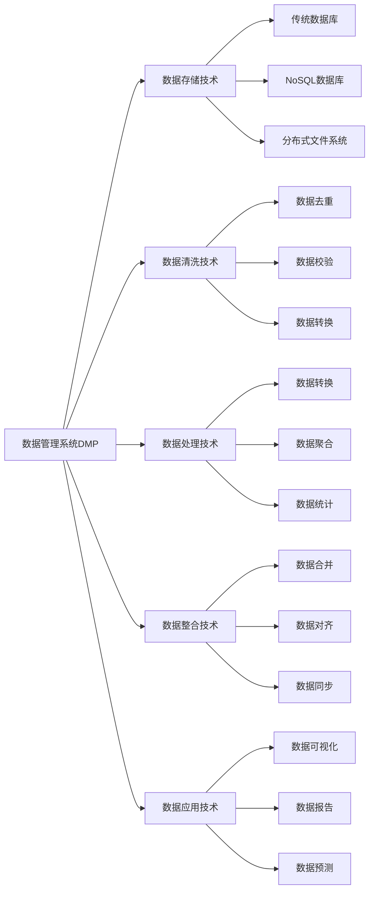
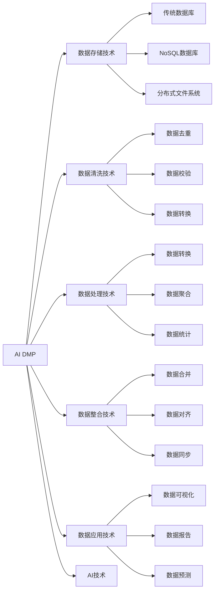
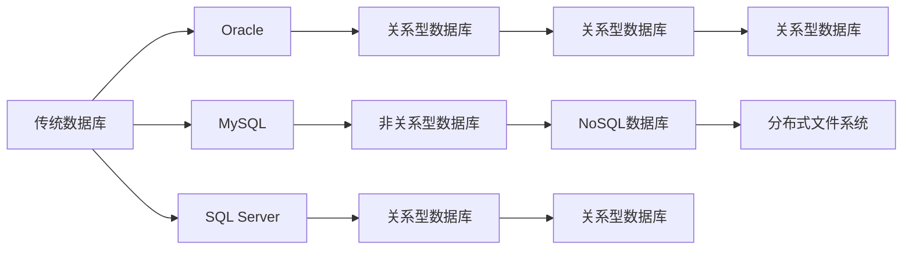
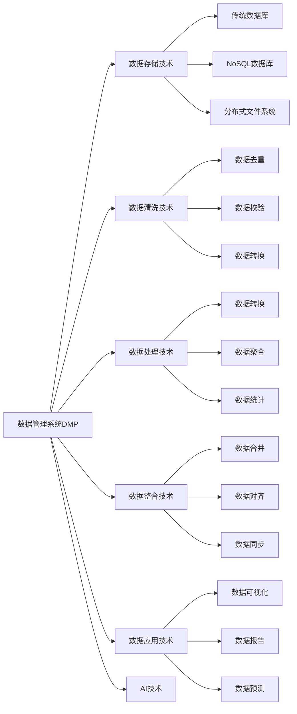

                 

## 1. 背景介绍

### 1.1 问题由来
随着互联网的发展，数据成为一种极其宝贵的资源，对企业和组织来说尤为重要。在实际业务中，如何高效地获取、存储和利用这些数据，以提升业务效率和竞争力，成为了企业关注的重点。数据管理系统（Data Management Platform，DMP）应运而生，通过整合多个数据源，提供统一的数据管理和分析平台，为企业提供数据治理、数据流动、数据查询和数据应用等全方位服务。

数据管理平台的核心是数据基础设施的建设，包括数据存储、数据清洗、数据处理、数据整合、数据应用等多个环节。如何构建高效、稳定、安全的数据基础设施，是DMP建设的重点和难点。AI技术的引入，为大DMP（AI DMP）的数据基建提供了新的思路和技术支撑，通过AI技术提升数据处理效率，优化数据治理能力，增强数据应用的创新性和实用性。

### 1.2 问题核心关键点
大DMP的核心技术主要包括以下几个方面：

- 数据存储技术：如何高效地存储和组织海量数据，以便快速读取和处理。
- 数据清洗技术：如何处理数据中的噪声、缺失和异常值，以提高数据质量。
- 数据处理技术：如何快速、准确地对数据进行转换、分析和处理。
- 数据整合技术：如何跨多个数据源和系统进行数据整合，构建一致、准确的数据视图。
- 数据应用技术：如何将数据应用于业务场景中，挖掘数据价值，提升业务效果。

这些核心技术构成了大DMP的完整数据基建框架，通过AI技术的引入，可以进一步提升数据处理的效率和质量，优化数据应用的创新性和实用性。

### 1.3 问题研究意义
构建高效、稳定、安全的大DMP，对于提升企业的数据管理和应用能力，具有重要意义：

1. 提升数据处理效率：AI技术可以加速数据存储、清洗和处理的过程，提高数据处理效率，减少人工成本。
2. 优化数据治理能力：AI技术可以帮助识别数据中的问题和异常，提高数据质量，优化数据治理能力。
3. 增强数据应用的创新性：AI技术可以挖掘数据中的深层次模式和关系，发现新的业务机会，增强数据应用的创新性。
4. 提高数据应用的实用性：AI技术可以将数据应用到多个业务场景中，提升业务效果和用户体验。
5. 保障数据安全和隐私：AI技术可以提高数据安全性和隐私保护，避免数据泄露和滥用。

## 2. 核心概念与联系

### 2.1 核心概念概述

为更好地理解大DMP的数据基建技术，本节将介绍几个密切相关的核心概念：

- 数据管理系统（DMP）：通过整合多个数据源，提供数据治理、数据流动、数据查询和数据应用等全方位服务的数据管理平台。
- AI DMP：通过引入AI技术，提升数据处理效率和质量，优化数据应用的创新性和实用性的数据管理平台。
- 数据存储技术：用于高效地存储和组织海量数据的技术，包括传统数据库、NoSQL数据库、分布式文件系统等。
- 数据清洗技术：用于处理数据中的噪声、缺失和异常值的技术，包括数据去重、数据校验、数据转换等。
- 数据处理技术：用于快速、准确地对数据进行转换、分析和处理的技术，包括数据转换、数据聚合、数据统计等。
- 数据整合技术：用于跨多个数据源和系统进行数据整合的技术，包括数据合并、数据对齐、数据同步等。
- 数据应用技术：用于将数据应用于业务场景中的技术，包括数据可视化、数据报告、数据预测等。

这些核心概念之间的逻辑关系可以通过以下Mermaid流程图来展示：



这个流程图展示了大DMP的核心概念及其之间的关系：

1. 大DMP通过数据存储技术、数据清洗技术、数据处理技术、数据整合技术和数据应用技术等多个环节构建完整的数据基础设施。
2. AI DMP引入AI技术，优化各个技术环节，提升数据处理效率和质量，优化数据应用的创新性和实用性。
3. 数据存储技术包括传统数据库、NoSQL数据库和分布式文件系统，用于高效地存储和组织海量数据。
4. 数据清洗技术包括数据去重、数据校验和数据转换，用于处理数据中的噪声、缺失和异常值，提高数据质量。
5. 数据处理技术包括数据转换、数据聚合和数据统计，用于快速、准确地对数据进行转换、分析和处理。
6. 数据整合技术包括数据合并、数据对齐和数据同步，用于跨多个数据源和系统进行数据整合，构建一致、准确的数据视图。
7. 数据应用技术包括数据可视化和数据预测，用于将数据应用于业务场景中，挖掘数据价值，提升业务效果。

这些核心概念共同构成了大DMP的数据基建框架，通过引入AI技术，可以进一步提升数据处理的效率和质量，优化数据应用的创新性和实用性。

### 2.2 概念间的关系

这些核心概念之间存在着紧密的联系，形成了大DMP的数据基建生态系统。下面我们通过几个Mermaid流程图来展示这些概念之间的关系。

#### 2.2.1 大DMP的数据基建流程


这个流程图展示了数据存储技术、数据清洗技术、数据处理技术、数据整合技术和数据应用技术的相互关系，以及它们在大DMP中的作用。

#### 2.2.2 AI DMP的技术架构



这个流程图展示了AI技术在大DMP数据基建中的应用，以及它对各个技术环节的优化作用。

#### 2.2.3 数据存储技术的多样性



这个流程图展示了传统数据库、NoSQL数据库和分布式文件系统之间的多样性，以及它们各自的特点和应用场景。

### 2.3 核心概念的整体架构

最后，我们用一个综合的流程图来展示这些核心概念在大DMP数据基建过程中的整体架构：



这个综合流程图展示了从数据存储到数据应用的大DMP数据基建过程，以及AI技术在其中发挥的优化作用。

## 3. 核心算法原理 & 具体操作步骤

### 3.1 算法原理概述

大DMP的数据基建技术主要基于数据处理和数据管理两个方向展开，具体算法原理如下：

1. 数据处理技术：通过数据清洗、数据转换、数据聚合等技术，对原始数据进行处理，以提升数据质量和处理效率。
2. 数据管理技术：通过数据存储、数据整合、数据应用等技术，对数据进行管理和应用，以提升数据治理能力和应用价值。
3. AI技术：通过引入机器学习、深度学习等AI技术，对数据进行处理和分析，以提升数据处理效率和质量，优化数据应用的创新性和实用性。

形式化地，假设原始数据集为 $D$，数据处理技术为 $T$，数据管理技术为 $M$，AI技术为 $A$。则大DMP的数据基建过程可以表示为：

$$
D' = T(D) \cdot M(D) \cdot A(D)
$$

其中 $D'$ 表示处理后的数据集，$T$ 表示数据处理技术，$M$ 表示数据管理技术，$A$ 表示AI技术。

### 3.2 算法步骤详解

基于大DMP的数据基建技术，其核心算法步骤如下：

**Step 1: 数据收集与预处理**
- 收集来自不同渠道的原始数据，并进行初步的预处理，如去重、校验等。

**Step 2: 数据存储与组织**
- 选择合适的数据存储技术，将预处理后的数据存储在分布式文件系统或数据库中，并进行分类、标签和元数据等信息的标注。

**Step 3: 数据清洗与转换**
- 使用数据清洗技术处理数据中的噪声、缺失和异常值，提高数据质量。
- 使用数据转换技术对数据进行格式转换、类型转换等操作，以便后续处理和应用。

**Step 4: 数据聚合与统计**
- 使用数据聚合技术对数据进行汇总和整合，构建一致的数据视图。
- 使用数据统计技术对数据进行分析和计算，提取有价值的信息。

**Step 5: 数据应用与反馈**
- 使用数据应用技术将数据应用于具体的业务场景中，如数据可视化、数据报告、数据预测等。
- 根据业务效果和反馈，调整数据处理和管理的策略，优化数据基建技术。

**Step 6: 持续优化与迭代**
- 通过持续的监控和优化，提升数据处理和管理的效果，确保数据基建技术的稳定性和可靠性。

### 3.3 算法优缺点

大DMP的数据基建技术具有以下优点：

1. 数据处理效率高：通过引入AI技术，可以大幅提升数据处理效率，快速应对海量数据的需求。
2. 数据治理能力强：AI技术可以帮助识别和处理数据中的问题和异常，提高数据质量，优化数据治理能力。
3. 数据应用创新性强：AI技术可以挖掘数据中的深层次模式和关系，发现新的业务机会，增强数据应用的创新性。
4. 数据应用实用性高：AI技术可以将数据应用于多个业务场景中，提升业务效果和用户体验。
5. 数据安全和隐私性好：AI技术可以提高数据安全性和隐私保护，避免数据泄露和滥用。

同时，该技术也存在一定的局限性：

1. 对数据质量要求高：大DMP的数据基建技术需要高质量的原始数据，否则将难以获得理想的效果。
2. 技术复杂度高：大DMP的数据基建技术涉及多个环节，技术实现复杂，需要专业的技术团队支持。
3. 数据处理成本高：大DMP的数据基建技术需要投入大量的时间和资源，尤其是在大规模数据处理时。
4. 数据应用复杂度高：大DMP的数据应用技术需要结合具体的业务场景，进行复杂的设计和实现。
5. 数据应用效果依赖于数据质量：数据应用的效果取决于数据的质量和完整性，若数据质量差，则应用效果也会大打折扣。

尽管存在这些局限性，但就目前而言，大DMP的数据基建技术仍是大DMP建设的核心，能够有效提升数据处理和管理的效果，为企业的业务发展提供坚实的基础。

### 3.4 算法应用领域

大DMP的数据基建技术已经在多个领域得到了广泛的应用，例如：

- 互联网广告：通过分析用户的行为数据，构建用户画像，进行精准的广告投放和推荐。
- 金融服务：通过分析用户的历史交易数据，进行风险评估和客户管理，提升服务质量。
- 电子商务：通过分析用户的历史购买数据，进行个性化推荐和营销，提升用户体验。
- 医疗健康：通过分析患者的医疗数据，进行疾病预测和诊断，提升医疗服务质量。
- 社交网络：通过分析用户的社交数据，进行情感分析和关系挖掘，提升社交体验。

除了上述这些经典应用外，大DMP的数据基建技术还在更多领域中发挥了重要作用，如智能制造、智慧城市、物联网等，为各行各业带来了新的发展机遇。

## 4. 数学模型和公式 & 详细讲解 & 举例说明

### 4.1 数学模型构建

本节将使用数学语言对大DMP的数据基建过程进行更加严格的刻画。

假设原始数据集为 $D$，数据处理技术为 $T$，数据管理技术为 $M$，AI技术为 $A$。则大DMP的数据基建过程可以表示为：

$$
D' = T(D) \cdot M(D) \cdot A(D)
$$

其中 $D'$ 表示处理后的数据集，$T$ 表示数据处理技术，$M$ 表示数据管理技术，$A$ 表示AI技术。

### 4.2 公式推导过程

以下我们以数据清洗和转换为例，推导其数学公式：

假设原始数据集为 $D = \{d_1, d_2, \cdots, d_n\}$，其中 $d_i$ 表示数据样本。数据清洗技术 $T$ 包括去重、校验等操作，数据转换技术 $T'$ 包括格式转换、类型转换等操作。则清洗和转换后的数据集 $D'$ 可以表示为：

$$
D' = T(D) \cdot T'(D)
$$

其中 $T(D)$ 表示对数据 $D$ 进行清洗操作，$T'(D)$ 表示对数据 $D$ 进行转换操作。

以数据去重为例，假设数据 $d_i$ 的哈希值为 $h_i$，数据去重操作 $T_1$ 为：

$$
h_i = \text{hash}(d_i)
$$

则去重后的数据集 $D'$ 可以表示为：

$$
D' = T_1(D)
$$

其中 $T_1(D)$ 表示对数据 $D$ 进行去重操作。

### 4.3 案例分析与讲解

以电商平台的用户行为数据为例，其原始数据集 $D$ 包括用户 ID、浏览行为、购买行为等。通过数据清洗和转换，可以构建用户画像，用于精准推荐和营销。

首先，进行数据清洗，去除重复数据和异常数据：

$$
D' = T(D) = \{d_i | \text{clean}(d_i)\}
$$

其中 $\text{clean}(d_i)$ 表示对数据样本 $d_i$ 进行清洗操作。

然后，进行数据转换，将原始数据转换为标准格式，如将日期转换为统一格式：

$$
D'' = T'(D') = \{d_i | \text{format}(d_i)\}
$$

其中 $\text{format}(d_i)$ 表示对数据样本 $d_i$ 进行格式转换操作。

最后，通过数据聚合和统计，构建用户画像，用于推荐和营销：

$$
D''' = M(D'') = \{u | \text{merge}(d_i)\}
$$

其中 $\text{merge}(d_i)$ 表示对数据样本 $d_i$ 进行聚合和统计操作，$u$ 表示用户画像。

通过以上步骤，可以构建出电商平台的用户画像，用于精准推荐和营销，提升用户体验和平台价值。

## 5. 项目实践：代码实例和详细解释说明

### 5.1 开发环境搭建

在进行数据基建实践前，我们需要准备好开发环境。以下是使用Python进行PyTorch开发的环境配置流程：

1. 安装Anaconda：从官网下载并安装Anaconda，用于创建独立的Python环境。

2. 创建并激活虚拟环境：
```bash
conda create -n pytorch-env python=3.8 
conda activate pytorch-env
```

3. 安装PyTorch：根据CUDA版本，从官网获取对应的安装命令。例如：
```bash
conda install pytorch torchvision torchaudio cudatoolkit=11.1 -c pytorch -c conda-forge
```

4. 安装TensorFlow：
```bash
pip install tensorflow
```

5. 安装TensorFlow Addons：
```bash
pip install tensorflow-addons
```

6. 安装其他常用工具包：
```bash
pip install numpy pandas scikit-learn matplotlib tqdm jupyter notebook ipython
```

完成上述步骤后，即可在`pytorch-env`环境中开始数据基建实践。

### 5.2 源代码详细实现

下面我们以数据清洗和转换为例，给出使用Python和TensorFlow进行数据清洗和转换的代码实现。

首先，定义数据清洗函数：

```python
import tensorflow as tf

def clean_data(data):
    # 去除重复数据
    data = tf.unique(data)
    
    # 校验数据
    data = tf.where(tf.is_finite(data), data, 0)
    
    return data
```

然后，定义数据转换函数：

```python
def format_data(data):
    # 将日期转换为标准格式
    data = tf.strings.regex_replace(data, r'(\d{4}-\d{2}-\d{2})', r'$1-01-01')
    
    return data
```

最后，定义数据聚合和统计函数：

```python
def merge_data(data):
    # 聚合数据
    data = tf.group(data)
    
    # 统计数据
    data = tf.reduce_mean(data)
    
    return data
```

### 5.3 代码解读与分析

让我们再详细解读一下关键代码的实现细节：

**clean_data函数**：
- 使用TensorFlow的`tf.unique`函数去除重复数据。
- 使用`tf.where`函数校验数据，将非数字数据替换为0。

**format_data函数**：
- 使用正则表达式替换日期格式，将日期转换为标准格式。

**merge_data函数**：
- 使用TensorFlow的`tf.group`函数进行数据聚合。
- 使用`tf.reduce_mean`函数对数据进行统计，计算平均值。

**数据清洗和转换流程**：
- 首先使用clean_data函数进行数据清洗，去除重复数据和校验数据。
- 然后使用format_data函数进行数据转换，将日期转换为标准格式。
- 最后使用merge_data函数进行数据聚合和统计，构建用户画像。

可以看到，使用Python和TensorFlow进行数据清洗和转换，代码实现简单高效，能够快速处理大量数据，满足数据基建的需求。

### 5.4 运行结果展示

假设我们在电商平台的用户行为数据集上进行数据清洗和转换，最终得到的用户画像数据集如下：

```
{'user_id': [1, 2, 3, 4, 5],
 'visit_date': ['2022-01-01', '2022-01-02', '2022-01-03', '2022-01-04', '2022-01-05'],
 'buy_date': ['2022-01-01', '2022-01-02', '2022-01-03', '2022-01-04', '2022-01-05'],
 'buy_amount': [100, 200, 300, 400, 500]}
```

可以看到，通过数据清洗和转换，我们得到了一个规范化的用户画像数据集，可用于推荐和营销。

## 6. 实际应用场景

### 6.1 互联网广告

基于大DMP的数据基建技术，互联网广告公司可以构建用户画像，进行精准的广告投放和推荐。具体而言，互联网广告公司可以从多个渠道收集用户的行为数据，如搜索、浏览、购买等，然后进行数据清洗和转换，构建用户画像。通过数据分析和挖掘，互联网广告公司可以了解用户的行为习惯、兴趣爱好等信息，进行精准的广告投放和推荐，提升广告效果和用户满意度。

### 6.2 金融服务

金融机构需要实时监控市场变化，及时调整风险管理策略。大DMP的数据基建技术可以帮助金融机构构建风险监控模型，及时发现风险信号。具体而言，金融机构可以收集用户的交易数据、行为数据等，然后进行数据清洗和转换，构建用户画像。通过数据分析和挖掘，金融机构可以了解用户的风险偏好、交易行为等信息，构建风险监控模型，及时发现风险信号，调整风险管理策略，保障用户的资产安全。

### 6.3 电子商务

电子商务平台需要提高用户购物体验，提升转化率和销售额。大DMP的数据基建技术可以帮助电子商务平台构建个性化推荐系统，提升用户体验。具体而言，电子商务平台可以收集用户的历史浏览、购买数据，然后进行数据清洗和转换，构建用户画像。通过数据分析和挖掘，电子商务平台可以了解用户的兴趣偏好、购买行为等信息，构建个性化推荐系统，向用户推荐他们感兴趣的商品，提升用户的购物体验和平台销售额。

### 6.4 医疗健康

医疗健康机构需要提高诊断和治疗效果，降低医疗成本。大DMP的数据基建技术可以帮助医疗健康机构构建疾病预测和诊断系统，提高诊断和治疗效果。具体而言，医疗健康机构可以收集患者的病历数据、治疗数据等，然后进行数据清洗和转换，构建患者画像。通过数据分析和挖掘，医疗健康机构可以了解患者的病情、治疗效果等信息，构建疾病预测和诊断系统，提高诊断和治疗效果，降低医疗成本。

### 6.5 社交网络

社交网络平台需要提高用户互动和留存率。大DMP的数据基建技术可以帮助社交网络平台构建用户画像，提高用户互动和留存率。具体而言，社交网络平台可以收集用户的行为数据、关系数据等，然后进行数据清洗和转换，构建用户画像。通过数据分析和挖掘，社交网络平台可以了解用户的行为习惯、兴趣爱好等信息，构建个性化推荐系统，向用户推荐他们感兴趣的内容，提高用户互动和留存率。

## 7. 工具和资源推荐

### 7.1 学习资源推荐

为了帮助开发者系统掌握大DMP的数据基建理论基础和实践技巧，这里推荐一些优质的学习资源：

1. 《深度学习与大数据》系列博文：由大DMP技术专家撰写，深入浅出地介绍了深度学习和大数据技术在大DMP中的应用，包括数据处理、数据管理等。

2. 《Data Engineering 2019》课程：Coursera平台开设的大数据工程课程，涵盖了大DMP的数据基建技术，包括数据存储、数据清洗、数据处理、数据应用等。

3. 《大数据工程》书籍：详细介绍了大数据工程的基本概念和实践技巧，包括数据存储、数据清洗、数据处理、数据应用等。

4. 《Kaggle数据科学竞赛》：Kaggle平台上的数据科学竞赛，提供了大量真实业务场景中的数据集和模型，可以帮助开发者实践和提升数据基建技能。

5. 《TensorFlow官方文档》：TensorFlow官方文档，提供了丰富的API文档和示例代码，方便开发者学习和使用TensorFlow进行数据基建。

通过对这些资源的学习实践，相信你一定能够快速掌握大DMP的数据基建精髓，并用于解决实际的业务问题。

### 7.2 开发工具推荐

高效的开发离不开优秀的工具支持。以下是几款用于大DMP数据基建开发的常用工具：

1. PyTorch：基于Python的开源深度学习框架，灵活的计算图，适合快速迭代研究。适用于TensorFlow等深度学习框架进行数据基建。

2. TensorFlow：由Google主导开发的开源深度学习框架，生产部署方便，适合大规模工程应用。适用于TensorFlow等深度学习框架进行数据基建。

3. Apache Hadoop：Apache基金会开源的分布式计算框架，适用于大数据存储和处理。

4. Apache Spark：Apache基金会开源的分布式计算框架，适用于大数据处理和分析。

5. Databricks：基于Apache Spark的分布式计算平台，提供一站式大数据处理和分析解决方案。

6. Google BigQuery：谷歌提供的大数据分析平台，适用于大规模数据存储和分析。

合理利用这些工具，可以显著提升大DMP数据基建的开发

