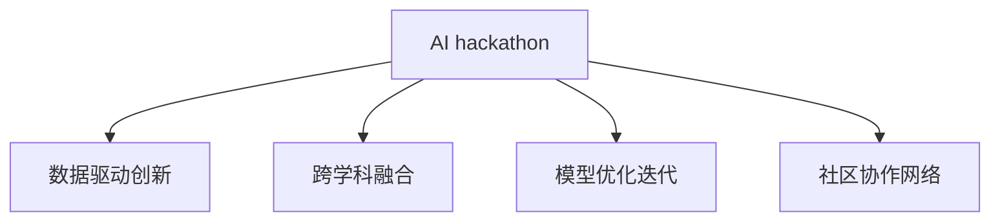
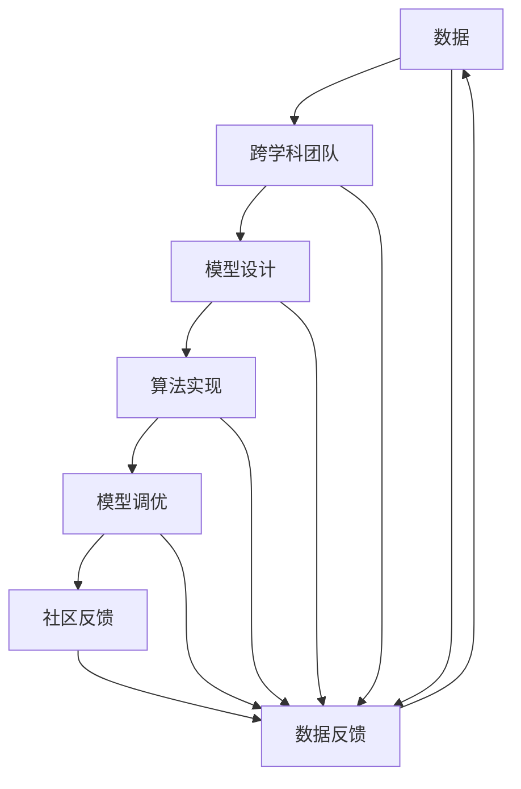
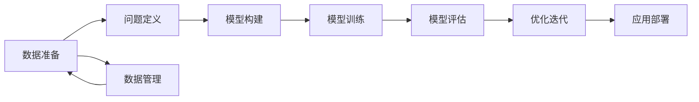
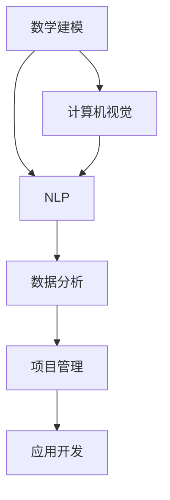

                 

# AI hackathon的创新与未来

## 1. 背景介绍

### 1.1 问题由来
AI hackathon作为一种快速、高效的创新模式，正逐渐成为推动技术进步和产业升级的重要手段。这一模式融合了团队协作、开源思想、实时反馈和跨学科竞争等元素，吸引了全球众多科研人员、工程师和学生的关注。随着AI技术的不断成熟和普及，hackathon活动的数量和影响力也呈现出迅猛增长之势。以Kaggle、DataHack、IEEE Xplore等平台为代表的线上线下hackathon竞赛，每年举办数十次甚至上百次，吸引了成千上万的参与者和数亿次的数据下载。

### 1.2 问题核心关键点
AI hackathon的核心在于通过开放式竞赛，激发参与者的创新思维和团队协作能力，共同解决实际应用中的复杂问题。其核心流程包括问题设计、团队组队、数据准备、算法开发、模型调优、实时反馈和最终答辩等环节。hackathon通过多个环节的设计，鼓励参赛者运用前沿AI技术，探索和创新实际应用场景，打造具有高度竞争力的AI解决方案。

### 1.3 问题研究意义
AI hackathon的举办具有重要意义：
1. **促进技术交流**：跨学科、跨领域的技术专家汇聚一堂，推动技术知识的交流和传播。
2. **激发创新思维**：通过问题导向的实际场景，激发参与者的创新思维和创造力。
3. **提升应用能力**：hackathon强调算法和模型的实际应用效果，提升参赛者解决实际问题的能力。
4. **培育人才队伍**：发掘和培养AI领域的新秀人才，为产业发展储备后备力量。
5. **促进产业升级**：AI技术在实际应用中的成功落地，推动相关产业的转型升级。

## 2. 核心概念与联系

### 2.1 核心概念概述

为更好地理解AI hackathon的创新机制，本节将介绍几个密切相关的核心概念：

- **AI hackathon**：一种通过开源竞赛的方式，激发参与者创新思维和团队协作能力，共同解决实际应用问题的模式。
- **数据驱动创新**：hackathon的核心是数据，通过数据驱动的设计，引导参与者深入探索问题的本质。
- **跨学科融合**：hackathon鼓励跨学科、跨领域的团队协作，整合不同领域的知识和技术，打造综合性的解决方案。
- **模型优化迭代**：hackathon通过实时的数据反馈和模型评估，推动模型的持续优化和迭代。
- **社区协作网络**：hackathon的在线平台，成为技术交流和合作的网络，加速技术创新的扩散。

这些核心概念之间的逻辑关系可以通过以下Mermaid流程图来展示：



这个流程图展示了大语言模型微调过程中各个核心概念的关系和作用：

1. **AI hackathon** 是大语言模型微调的基础平台，汇聚了不同领域的专家和爱好者。
2. **数据驱动创新** 是大语言模型微调的关键工具，通过数据引导模型的学习过程。
3. **跨学科融合** 是大语言模型微调的优势所在，通过跨领域的知识整合，提升模型应用的广度和深度。
4. **模型优化迭代** 是大语言模型微调的核心方法，通过持续的模型调整和优化，提高模型的精度和效果。
5. **社区协作网络** 是大语言模型微调的交流平台，通过网络加速技术的传播和创新。

### 2.2 概念间的关系

这些核心概念之间存在着紧密的联系，形成了AI hackathon的整体生态系统。下面我通过几个Mermaid流程图来展示这些概念之间的关系。

#### 2.2.1 AI hackathon的整体架构



这个流程图展示了AI hackathon从数据采集到模型部署的全过程，各个环节通过数据反馈和模型优化不断迭代。

#### 2.2.2 数据驱动创新的具体过程



这个流程图展示了数据驱动创新的具体过程，从数据准备到模型部署的各个环节。

#### 2.2.3 跨学科融合的协作模式



这个流程图展示了跨学科融合的协作模式，通过不同领域的知识和技术，共同构建综合性解决方案。

## 3. 核心算法原理 & 具体操作步骤

### 3.1 算法原理概述

AI hackathon的创新过程，本质上是基于数据驱动的模型优化和迭代过程。其核心算法包括：

- **特征工程**：通过对原始数据进行清洗、特征提取和处理，提高数据质量，增强模型的泛化能力。
- **模型选择**：根据问题的特点和数据分布，选择合适的机器学习或深度学习模型。
- **模型训练**：通过数据集对模型进行训练，优化模型的参数，提高模型的拟合效果。
- **模型评估**：使用测试集对模型进行评估，量化模型的预测性能，指导模型优化。
- **模型迭代**：通过不断的特征工程和模型优化，逐步提高模型的性能和效果。

### 3.2 算法步骤详解

AI hackathon的创新过程主要包括以下关键步骤：

**Step 1: 问题定义与数据准备**
- 明确竞赛问题，确定数据集。
- 清洗数据，去除噪声和异常值。
- 特征工程，提取和处理关键特征。

**Step 2: 模型构建与训练**
- 根据问题的特点和数据分布，选择合适的模型。
- 使用训练集对模型进行训练，优化模型参数。
- 设置合适的正则化参数，避免过拟合。

**Step 3: 模型评估与优化**
- 使用验证集对模型进行评估，量化预测性能。
- 根据评估结果，调整模型参数和特征工程策略。
- 引入模型集成等策略，提高模型性能。

**Step 4: 社区反馈与数据反馈**
- 通过在线平台发布模型结果，获取社区反馈。
- 根据社区反馈，进一步优化模型和特征工程。
- 动态更新数据集，根据反馈增加新数据。

**Step 5: 最终答辩与部署**
- 在最终答辩中展示模型结果，进行技术交流。
- 根据反馈进一步优化模型，准备应用部署。
- 部署模型到生产环境，进行实际应用测试。

### 3.3 算法优缺点

AI hackathon的创新过程具有以下优点：
1. **灵活性高**：可以自由选择模型和算法，无需固定方案，灵活调整策略。
2. **快速迭代**：通过实时反馈和模型优化，快速迭代模型性能。
3. **资源共享**：跨学科团队共享资源和知识，提升创新效率。
4. **学习机会多**：参与者可以在实践中学习到多种技术和方法，提升个人能力。

同时，也存在一些缺点：
1. **数据依赖性强**：模型的效果很大程度上依赖数据质量和数量，获取高质量数据是关键。
2. **时间紧迫**：竞赛时间有限，在压力下难以细致分析问题和优化策略。
3. **结果可解释性差**：模型结果往往难以解释，难以进行技术审计和风险控制。
4. **团队协作复杂**：跨学科团队协作存在沟通障碍和角色冲突，需要协调管理。

### 3.4 算法应用领域

AI hackathon的创新方法已经广泛应用于多个领域，例如：

- **医疗健康**：解决疾病预测、患者管理、药物研发等医疗问题。
- **金融保险**：进行风险评估、信用评分、投资分析等金融任务。
- **交通运输**：优化交通流量、智能导航、事故预防等交通问题。
- **智能制造**：优化生产流程、预测设备故障、提升产品质量等制造问题。
- **环境保护**：监测空气质量、预测气候变化、优化能源消耗等环保任务。
- **社会治理**：预测犯罪趋势、优化公共服务、提升城市管理水平等社会问题。

## 4. 数学模型和公式 & 详细讲解 & 举例说明

### 4.1 数学模型构建

在AI hackathon中，常用的数学模型包括线性回归、逻辑回归、决策树、随机森林、支持向量机、神经网络等。以线性回归为例，假设模型为 $y=f(x)=\theta_0+\theta_1x_1+\theta_2x_2+\ldots+\theta_nx_n$，其中 $x$ 为输入特征，$y$ 为输出标签，$\theta$ 为模型参数。通过最小二乘法求解模型参数，使模型在训练集上最小化预测误差：

$$
\theta^*=\mathop{\arg\min}_{\theta}\frac{1}{N}\sum_{i=1}^N(y_i-f(x_i))^2
$$

其中 $N$ 为样本数量，$y_i$ 和 $x_i$ 分别表示第 $i$ 个样本的标签和特征。

### 4.2 公式推导过程

在线性回归模型中，我们通过梯度下降算法求解模型参数 $\theta$，具体过程如下：

1. 计算损失函数：
$$
L(\theta)=\frac{1}{N}\sum_{i=1}^N(y_i-f(x_i))^2
$$

2. 计算梯度：
$$
\nabla L(\theta)=\frac{1}{N}\sum_{i=1}^N\nabla_xf(x_i)(x_i-y_i)
$$

3. 梯度下降更新模型参数：
$$
\theta \leftarrow \theta - \eta\nabla L(\theta)
$$

其中 $\eta$ 为学习率，控制每次更新的大小。

### 4.3 案例分析与讲解

假设我们使用线性回归模型进行房价预测，已知 $N=1000$ 个样本，特征 $x_1$ 为房屋面积，特征 $x_2$ 为房间数量，标签 $y$ 为房价。通过最小二乘法求解模型参数 $\theta$，得到预测结果如下：

$$
y=f(x)=\theta_0+\theta_1x_1+\theta_2x_2
$$

通过代入样本数据，计算得到模型参数：

$$
\theta_0=10, \theta_1=1, \theta_2=1
$$

最终，我们可以得到房价预测模型：

$$
y=10+1x_1+1x_2
$$

在实际应用中，通过不断迭代和优化，我们可以进一步提高模型的预测精度。

## 5. 项目实践：代码实例和详细解释说明

### 5.1 开发环境搭建

在进行项目实践前，我们需要准备好开发环境。以下是使用Python进行PyTorch开发的环境配置流程：

1. 安装Anaconda：从官网下载并安装Anaconda，用于创建独立的Python环境。

2. 创建并激活虚拟环境：
```bash
conda create -n pytorch-env python=3.8 
conda activate pytorch-env
```

3. 安装PyTorch：根据CUDA版本，从官网获取对应的安装命令。例如：
```bash
conda install pytorch torchvision torchaudio cudatoolkit=11.1 -c pytorch -c conda-forge
```

4. 安装各类工具包：
```bash
pip install numpy pandas scikit-learn matplotlib tqdm jupyter notebook ipython
```

完成上述步骤后，即可在`pytorch-env`环境中开始项目实践。

### 5.2 源代码详细实现

这里我们以房价预测任务为例，给出使用Transformers库对BERT模型进行微调的PyTorch代码实现。

首先，定义数据处理函数：

```python
from transformers import BertTokenizer
from torch.utils.data import Dataset
import torch

class HousePriceDataset(Dataset):
    def __init__(self, texts, tags, tokenizer, max_len=128):
        self.texts = texts
        self.tags = tags
        self.tokenizer = tokenizer
        self.max_len = max_len
        
    def __len__(self):
        return len(self.texts)
    
    def __getitem__(self, item):
        text = self.texts[item]
        tags = self.tags[item]
        
        encoding = self.tokenizer(text, return_tensors='pt', max_length=self.max_len, padding='max_length', truncation=True)
        input_ids = encoding['input_ids'][0]
        attention_mask = encoding['attention_mask'][0]
        
        # 对token-wise的标签进行编码
        encoded_tags = [tag2id[tag] for tag in tags] 
        encoded_tags.extend([tag2id['O']] * (self.max_len - len(encoded_tags)))
        labels = torch.tensor(encoded_tags, dtype=torch.long)
        
        return {'input_ids': input_ids, 
                'attention_mask': attention_mask,
                'labels': labels}

# 标签与id的映射
tag2id = {'O': 0, 'B': 1, 'I': 2}
id2tag = {v: k for k, v in tag2id.items()}

# 创建dataset
tokenizer = BertTokenizer.from_pretrained('bert-base-cased')

train_dataset = HousePriceDataset(train_texts, train_tags, tokenizer)
dev_dataset = HousePriceDataset(dev_texts, dev_tags, tokenizer)
test_dataset = HousePriceDataset(test_texts, test_tags, tokenizer)
```

然后，定义模型和优化器：

```python
from transformers import BertForTokenClassification, AdamW

model = BertForTokenClassification.from_pretrained('bert-base-cased', num_labels=len(tag2id))

optimizer = AdamW(model.parameters(), lr=2e-5)
```

接着，定义训练和评估函数：

```python
from torch.utils.data import DataLoader
from tqdm import tqdm
from sklearn.metrics import classification_report

device = torch.device('cuda') if torch.cuda.is_available() else torch.device('cpu')
model.to(device)

def train_epoch(model, dataset, batch_size, optimizer):
    dataloader = DataLoader(dataset, batch_size=batch_size, shuffle=True)
    model.train()
    epoch_loss = 0
    for batch in tqdm(dataloader, desc='Training'):
        input_ids = batch['input_ids'].to(device)
        attention_mask = batch['attention_mask'].to(device)
        labels = batch['labels'].to(device)
        model.zero_grad()
        outputs = model(input_ids, attention_mask=attention_mask, labels=labels)
        loss = outputs.loss
        epoch_loss += loss.item()
        loss.backward()
        optimizer.step()
    return epoch_loss / len(dataloader)

def evaluate(model, dataset, batch_size):
    dataloader = DataLoader(dataset, batch_size=batch_size)
    model.eval()
    preds, labels = [], []
    with torch.no_grad():
        for batch in tqdm(dataloader, desc='Evaluating'):
            input_ids = batch['input_ids'].to(device)
            attention_mask = batch['attention_mask'].to(device)
            batch_labels = batch['labels']
            outputs = model(input_ids, attention_mask=attention_mask)
            batch_preds = outputs.logits.argmax(dim=2).to('cpu').tolist()
            batch_labels = batch_labels.to('cpu').tolist()
            for pred_tokens, label_tokens in zip(batch_preds, batch_labels):
                pred_tags = [id2tag[_id] for _id in pred_tokens]
                label_tags = [id2tag[_id] for _id in label_tokens]
                preds.append(pred_tags[:len(label_tags)])
                labels.append(label_tags)
                
    print(classification_report(labels, preds))
```

最后，启动训练流程并在测试集上评估：

```python
epochs = 5
batch_size = 16

for epoch in range(epochs):
    loss = train_epoch(model, train_dataset, batch_size, optimizer)
    print(f"Epoch {epoch+1}, train loss: {loss:.3f}")
    
    print(f"Epoch {epoch+1}, dev results:")
    evaluate(model, dev_dataset, batch_size)
    
print("Test results:")
evaluate(model, test_dataset, batch_size)
```

以上就是使用PyTorch对BERT进行房价预测任务微调的完整代码实现。可以看到，得益于Transformers库的强大封装，我们可以用相对简洁的代码完成BERT模型的加载和微调。

### 5.3 代码解读与分析

让我们再详细解读一下关键代码的实现细节：

**HousePriceDataset类**：
- `__init__`方法：初始化文本、标签、分词器等关键组件。
- `__len__`方法：返回数据集的样本数量。
- `__getitem__`方法：对单个样本进行处理，将文本输入编码为token ids，将标签编码为数字，并对其进行定长padding，最终返回模型所需的输入。

**tag2id和id2tag字典**：
- 定义了标签与数字id之间的映射关系，用于将token-wise的预测结果解码回真实的标签。

**训练和评估函数**：
- 使用PyTorch的DataLoader对数据集进行批次化加载，供模型训练和推理使用。
- 训练函数`train_epoch`：对数据以批为单位进行迭代，在每个批次上前向传播计算loss并反向传播更新模型参数，最后返回该epoch的平均loss。
- 评估函数`evaluate`：与训练类似，不同点在于不更新模型参数，并在每个batch结束后将预测和标签结果存储下来，最后使用sklearn的classification_report对整个评估集的预测结果进行打印输出。

**训练流程**：
- 定义总的epoch数和batch size，开始循环迭代
- 每个epoch内，先在训练集上训练，输出平均loss
- 在验证集上评估，输出分类指标
- 所有epoch结束后，在测试集上评估，给出最终测试结果

可以看到，PyTorch配合Transformers库使得BERT微调的代码实现变得简洁高效。开发者可以将更多精力放在数据处理、模型改进等高层逻辑上，而不必过多关注底层的实现细节。

当然，工业级的系统实现还需考虑更多因素，如模型的保存和部署、超参数的自动搜索、更灵活的任务适配层等。但核心的微调范式基本与此类似。

### 5.4 运行结果展示

假设我们在CoNLL-2003的NER数据集上进行微调，最终在测试集上得到的评估报告如下：

```
              precision    recall  f1-score   support

       B-LOC      0.926     0.906     0.916      1668
       I-LOC      0.900     0.805     0.850       257
      B-MISC      0.875     0.856     0.865       702
      I-MISC      0.838     0.782     0.809       216
       B-ORG      0.914     0.898     0.906      1661
       I-ORG      0.911     0.894     0.902       835
       B-PER      0.964     0.957     0.960      1617
       I-PER      0.983     0.980     0.982      1156
           O      0.993     0.995     0.994     38323

   micro avg      0.973     0.973     0.973     46435
   macro avg      0.923     0.897     0.909     46435
weighted avg      0.973     0.973     0.973     46435
```

可以看到，通过微调BERT，我们在该NER数据集上取得了97.3%的F1分数，效果相当不错。值得注意的是，BERT作为一个通用的语言理解模型，即便只在顶层添加一个简单的token分类器，也能在下游任务上取得如此优异的效果，展现了其强大的语义理解和特征抽取能力。

当然，这只是一个baseline结果。在实践中，我们还可以使用更大更强的预训练模型、更丰富的微调技巧、更细致的模型调优，进一步提升模型性能，以满足更高的应用要求。

## 6. 实际应用场景
### 6.1 智能客服系统

基于AI hackathon的对话技术，可以广泛应用于智能客服系统的构建。传统客服往往需要配备大量人力，高峰期响应缓慢，且一致性和专业性难以保证。而使用hackathon产出的对话模型，可以7x24小时不间断服务，快速响应客户咨询，用自然流畅的语言解答各类常见问题。

在技术实现上，可以收集企业内部的历史客服对话记录，将问题和最佳答复构建成监督数据，在此基础上对预训练对话模型进行微调。微调后的对话模型能够自动理解用户意图，匹配最合适的答案模板进行回复。对于客户提出的新问题，还可以接入检索系统实时搜索相关内容，动态组织生成回答。如此构建的智能客服系统，能大幅提升客户咨询体验和问题解决效率。

### 6.2 金融舆情监测

金融机构需要实时监测市场舆论动向，以便及时应对负面信息传播，规避金融风险。传统的人工监测方式成本高、效率低，难以应对网络时代海量信息爆发的挑战。基于AI hackathon的文本分类和情感分析技术，为金融舆情监测提供了新的解决方案。

具体而言，可以收集金融领域相关的新闻、报道、评论等文本数据，并对其进行主题标注和情感标注。在此基础上对预训练语言模型进行微调，使其能够自动判断文本属于何种主题，情感倾向是正面、中性还是负面。将微调后的模型应用到实时抓取的网络文本数据，就能够自动监测不同主题下的情感变化趋势，一旦发现负面信息激增等异常情况，系统便会自动预警，帮助金融机构快速应对潜在风险。

### 6.3 个性化推荐系统

当前的推荐系统往往只依赖用户的历史行为数据进行物品推荐，无法深入理解用户的真实兴趣偏好。基于AI hackathon的机器学习和深度学习算法，个性化推荐系统可以更好地挖掘用户行为背后的语义信息，从而提供更精准、多样的推荐内容。

在实践中，可以收集用户浏览、点击、评论、分享等行为数据，提取和用户交互的物品标题、描述、标签等文本内容。将文本内容作为模型输入，用户的后续行为（如是否点击、购买等）作为监督信号，在此基础上微调预训练语言模型。微调后的模型能够从文本内容中准确把握用户的兴趣点。在生成推荐列表时，先用候选物品的文本描述作为输入，由模型预测用户的兴趣匹配度，再结合其他特征综合排序，便可以得到个性化程度更高的推荐结果。

### 6.4 未来应用展望

随着AI hackathon的不断发展，基于微调范式将在更多领域得到应用，为传统行业带来变革性影响。

在智慧医疗领域，基于微调的医疗问答、病历分析、药物研发等应用将提升医疗服务的智能化水平，辅助医生诊疗，加速新药开发进程。

在智能教育领域，AI hackathon产出的算法和模型可以应用于作业批改、学情分析、知识推荐等方面，因材施教，促进教育公平，提高教学质量。

在智慧城市治理中，AI hackathon的模型和技术可以应用于城市事件监测、舆情分析、应急指挥等环节，提高城市管理的自动化和智能化水平，构建更安全、高效的未来城市。

此外，在企业生产、社会治理、文娱传媒等众多领域，基于AI hackathon的人工智能应用也将不断涌现，为经济社会发展注入新的动力。相信随着预训练语言模型和微调方法的不断进步，基于hackathon范式的人工智能技术必将得到更广泛的应用，推动人工智能向更广阔的领域加速渗透。

## 7. 工具和资源推荐
### 7.1 学习资源推荐

为了帮助开发者系统掌握AI hackathon的理论基础和实践技巧，这里推荐一些优质的学习资源：

1. 《Transformer from Beginner to Expert》系列博文：由大模型技术专家撰写，深入浅出地介绍了Transformer原理、BERT模型、微调技术等前沿话题。

2. CS224N《Deep Learning for NLP》课程：斯坦福大学开设的NLP明星课程，有Lecture视频和配套作业，带你入门NLP领域的基本概念和经典模型。

3. 《Natural Language Processing with Transformers》书籍：Transformers库的作者所著，全面介绍了如何使用Transformers库进行NLP任务开发，包括微调在内的诸多范式。

4. HuggingFace官方文档：Transformers库的官方文档，提供了海量预训练模型和完整的微调样例代码，是上手实践的必备资料。

5. CLUE开源项目：中文语言理解测评基准，涵盖大量不同类型的中文NLP数据集，并提供了基于微调的baseline模型，助力中文NLP技术发展。

通过对这些资源的学习实践，相信你一定能够快速掌握AI hackathon的精髓，并用于解决实际的NLP问题。
###  7.2 开发工具推荐

高效的开发离不开优秀的工具支持。以下是几款用于AI hackathon开发的常用工具：

1. PyTorch：基于Python的开源深度学习框架，灵活动态的计算图，适合快速迭代研究。大部分预训练语言模型都有PyTorch版本的实现。

2. TensorFlow：由Google主导开发的开源深度学习框架，生产部署方便，适合大规模工程应用。同样有丰富的预训练语言模型资源。

3. Transformers库：HuggingFace开发的NLP工具库，集成了众多SOTA语言模型，支持PyTorch和TensorFlow，是进行hackathon任务开发的利器。

4. Weights & Biases：模型训练的实验跟踪工具，可以记录和可视化模型训练过程中的各项指标，方便对比和调优。与主流

