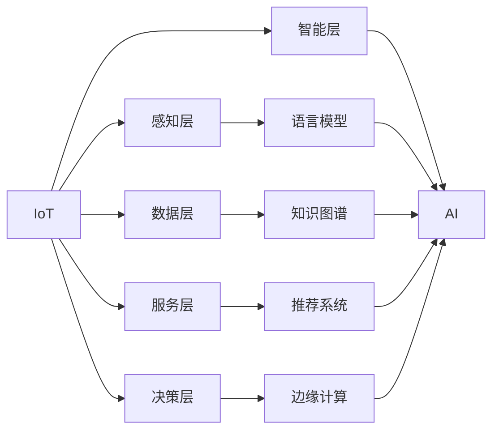

                 

# AI 与物联网的融合：打造智能互联世界

## 1. 背景介绍

### 1.1 问题由来
随着科技的不断进步，物联网（IoT）和人工智能（AI）正日益融合，共同推动着智能互联世界的构建。这一趋势不仅改变着我们的生活方式，也重塑了诸多行业的应用模式。在这一过程中，大语言模型的深度学习和知识图谱的丰富信息集成，为AI与IoT的深度融合提供了强有力的支持。

### 1.2 问题核心关键点
本研究聚焦于大语言模型和物联网的深度融合，以实现更智能、更高效的智能互联世界。具体来说，我们探讨以下几个核心问题：
1. 如何通过大语言模型提升物联网设备的智能化水平？
2. 如何构建基于知识图谱的物联网语义理解系统？
3. 如何在大规模物联网数据上应用AI模型进行高效分析和预测？
4. 如何利用AI技术优化物联网网络的资源管理与调度？
5. 如何构建安全、可控的智能互联系统，保障物联网数据安全与隐私？

### 1.3 问题研究意义
AI与物联网的融合研究对于推动智能互联世界的构建具有重要意义：
1. 提升智能设备的功能与性能。通过大语言模型和知识图谱的深度学习，物联网设备可以更智能、更高效地执行任务。
2. 实现设备间的无缝协同与信息共享。构建基于语义理解的物联网系统，可以实现设备间的智能协作，提高整体系统的效率。
3. 优化资源管理与调度。利用AI技术对大规模物联网数据进行高效分析与预测，可以优化网络资源分配，提高网络效率。
4. 保障物联网数据安全与隐私。构建基于AI技术的物联网安全系统，可以有效地防范潜在威胁，保护用户数据安全。

## 2. 核心概念与联系

### 2.1 核心概念概述

为更好地理解AI与物联网的融合，我们需掌握以下几个关键概念：

- **物联网（IoT）**：通过各种感知技术，将物与物、物与人进行互联，实现信息传递与处理。物联网设备如传感器、智能家居等，越来越多地嵌入日常生活。

- **人工智能（AI）**：利用机器学习、深度学习等技术，使机器具有类似人类的感知、学习、决策等能力。AI技术在图像识别、语音识别、自然语言处理等方面已取得显著进展。

- **大语言模型（LLMs）**：如GPT-3、BERT等模型，通过大规模无标签文本数据预训练，具备强大的语言理解和生成能力，可以处理自然语言指令。

- **知识图谱（KG）**：以图结构表示实体及其关系，广泛应用于语义搜索、推荐系统、问答系统等领域。

- **推荐系统**：通过分析用户行为和历史数据，为个性化推荐提供数据支撑。

- **边缘计算**：将计算任务部署到靠近数据源的边缘节点，减少数据传输延迟，提升系统响应速度。

这些概念之间的关系可以通过以下Mermaid流程图来展示：



该流程图展示了AI与物联网在各层的融合过程，每个层级的功能和服务通过AI技术得以提升和优化。

### 2.2 概念间的关系

这些核心概念之间的联系紧密，形成了AI与物联网融合的完整生态系统。具体关系如下：

- **感知层与语言模型**：物联网设备采集的环境数据，通过语言模型转化为自然语言指令，实现设备间的智能交互。

- **数据层与知识图谱**：物联网设备收集的大量数据，通过知识图谱进行语义分析，提升数据分析的准确性和效率。

- **智能层与推荐系统**：利用AI技术，根据用户行为和历史数据，构建推荐系统，提高个性化服务的精准度。

- **服务层与边缘计算**：AI模型的推理与决策任务，通过边缘计算在本地完成，减少数据传输，提高响应速度。

- **决策层与AI**：物联网系统的高级决策过程，依赖于AI模型的预测与分析，实现智能化决策。

## 3. 核心算法原理 & 具体操作步骤
### 3.1 算法原理概述

AI与物联网的深度融合主要通过以下步骤实现：

1. **数据采集与预处理**：通过感知层设备采集环境数据，进行数据清洗、归一化等预处理操作。
2. **语义理解与转化**：利用语言模型将原始数据转化为自然语言指令，实现设备的智能交互。
3. **数据分析与预测**：通过知识图谱进行语义分析，利用AI模型进行数据分析和预测，提升决策的精准度。
4. **推荐与优化**：构建推荐系统，根据用户行为和历史数据进行个性化推荐，优化服务质量。
5. **边缘计算与决策**：通过边缘计算，在本地完成AI模型的推理与决策，提高系统响应速度。

### 3.2 算法步骤详解

#### 3.2.1 数据采集与预处理
1. **选择传感器**：根据具体应用场景选择合适的传感器，如温度传感器、湿度传感器、光照传感器等。
2. **数据传输**：将传感器采集到的数据通过无线网络传输到中心服务器或边缘设备。
3. **数据清洗与预处理**：清洗数据，去除噪声和异常值，进行归一化、去重等预处理操作。

#### 3.2.2 语义理解与转化
1. **语言模型训练**：使用大语言模型进行预训练，如BERT、GPT-3等。
2. **指令生成**：将原始数据输入预训练模型，生成自然语言指令，如“提高室内温度至25度”。
3. **指令执行**：将生成的自然语言指令发送到物联网设备，实现智能控制。

#### 3.2.3 数据分析与预测
1. **知识图谱构建**：构建物联网设备相关的知识图谱，如图结构表示设备间的关系和属性。
2. **语义查询与推理**：通过知识图谱进行语义查询和推理，获取相关设备的信息。
3. **AI模型训练**：利用大规模物联网数据训练AI模型，如神经网络、深度学习模型等。
4. **数据分析与预测**：使用训练好的AI模型对数据进行分析和预测，如预测设备故障、优化资源分配等。

#### 3.2.4 推荐与优化
1. **用户行为分析**：分析用户的历史数据，包括浏览记录、点击行为等。
2. **推荐算法设计**：设计个性化推荐算法，如协同过滤、基于内容的推荐等。
3. **推荐结果优化**：根据用户反馈和行为，不断优化推荐结果，提高推荐精度。

#### 3.2.5 边缘计算与决策
1. **模型部署**：将训练好的AI模型部署到边缘计算节点，如智能家居设备。
2. **实时推理**：在本地完成模型的推理与决策，如实时调整温度、光线等环境参数。
3. **结果反馈**：将推理结果反馈到中心服务器，进行后续分析与优化。

### 3.3 算法优缺点

#### 3.3.1 优点
1. **智能化提升**：通过AI技术，物联网设备可以具备更强的智能交互和决策能力，提升用户体验。
2. **数据分析精准**：利用知识图谱和AI模型进行语义分析和数据预测，提高数据分析的准确性。
3. **系统效率提升**：通过推荐系统和边缘计算，实现资源优化与高效决策，提高系统响应速度。
4. **安全性保障**：利用AI技术进行异常检测和风险预警，提升物联网系统的安全性。

#### 3.3.2 缺点
1. **数据质量要求高**：传感器采集的数据质量直接影响AI模型的性能，需进行严格的数据清洗与预处理。
2. **模型训练复杂**：构建大语言模型和知识图谱，需要大量标注数据和计算资源。
3. **边缘计算限制**：边缘计算资源有限，需优化模型结构和算法，确保推理速度和准确性。
4. **隐私保护困难**：物联网数据涉及用户隐私，需设计严格的隐私保护机制，确保数据安全。

### 3.4 算法应用领域

AI与物联网的深度融合在多个领域已取得成功应用：

- **智能家居**：利用大语言模型和知识图谱，实现智能温控、安防监控、能源管理等功能。
- **智慧医疗**：通过AI模型分析患者数据，进行疾病预测与诊断，提升医疗服务的精准度。
- **智能交通**：利用AI技术优化交通流量，实现智能交通管理与事故预警。
- **工业制造**：通过AI模型分析设备状态，实现设备预测性维护，提高生产效率。
- **智能农业**：利用AI技术分析土壤、气候等数据，实现精准农业，提高农作物产量。

## 4. 数学模型和公式 & 详细讲解 & 举例说明

### 4.1 数学模型构建

本节将通过数学模型形式化地描述AI与物联网的融合过程。

记物联网设备为 $D$，传感器采集的数据为 $x \in \mathbb{R}^n$，传感器类型为 $T$，知识图谱为 $K=(V,E)$，其中 $V$ 为节点集合，$E$ 为边集合。

假设有一个包含 $N$ 个设备的物联网系统，每个设备可以执行的动作为 $A$，设备的当前状态为 $S$。

物联网系统的目标是通过AI模型预测设备状态，并执行最优动作，以最大化某个评价指标 $U$。

### 4.2 公式推导过程

**4.2.1 数据采集与预处理**
1. 数据采集：$s_0 \sim p(x|T)$，其中 $s_0$ 为传感器采集到的原始数据，$p(x|T)$ 为传感器类型的概率分布。
2. 数据预处理：$s \sim p(x|s_0)$，其中 $s$ 为预处理后的数据。

**4.2.2 语义理解与转化**
1. 指令生成：$u \sim p(u|s)$，其中 $u$ 为自然语言指令。
2. 指令执行：$a \sim p(a|u)$，其中 $a$ 为设备执行的动作。

**4.2.3 数据分析与预测**
1. 语义查询：$q \sim p(q|K)$，其中 $q$ 为语义查询。
2. 推理与预测：$r \sim p(r|q,K)$，其中 $r$ 为推理与预测结果。

**4.2.4 推荐与优化**
1. 用户行为分析：$b \sim p(b|u)$，其中 $b$ 为用户行为。
2. 推荐算法设计：$p(r|b)$，其中 $p(r|b)$ 为推荐算法。

**4.2.5 边缘计算与决策**
1. 模型推理：$f(s,u) \rightarrow a$，其中 $f$ 为AI模型推理函数。
2. 实时决策：$s' \sim p(s'|s,a)$，其中 $s'$ 为设备状态。

### 4.3 案例分析与讲解

#### 4.3.1 智能家居

智能家居系统通过传感器采集环境数据，如温度、湿度等。使用大语言模型将数据转化为自然语言指令，如“提高室内温度至25度”，并发送到空调设备执行。同时，利用知识图谱分析设备状态和历史记录，利用AI模型进行预测与优化，如预测设备故障，自动调整空调运行状态。

#### 4.3.2 智慧医疗

智慧医疗系统通过传感器采集患者数据，如血压、心率等。利用知识图谱进行疾病分析和诊断，使用AI模型进行疾病预测和患者管理。系统通过推荐算法，根据患者历史数据和行为，推荐个性化治疗方案，优化医疗服务质量。

## 5. 项目实践：代码实例和详细解释说明

### 5.1 开发环境搭建

为进行项目实践，需要以下开发环境：

1. **Python环境**：安装Anaconda，创建独立的Python环境。
2. **深度学习框架**：安装PyTorch、TensorFlow等深度学习框架。
3. **数据处理库**：安装Pandas、NumPy等数据处理库。
4. **知识图谱库**：安装kglearn等知识图谱处理库。
5. **大语言模型库**：安装Transformers等大语言模型处理库。
6. **推荐系统库**：安装Surprise等推荐系统处理库。

### 5.2 源代码详细实现

#### 5.2.1 数据采集与预处理

```python
import pandas as pd
import numpy as np

# 数据采集
data = pd.read_csv('sensordata.csv')

# 数据预处理
data = data.dropna()  # 去除缺失值
data = data.drop_duplicates()  # 去重
data['timestamp'] = pd.to_datetime(data['timestamp'])  # 转换为时间戳
data = data.groupby('timestamp').mean()  # 按时间戳分组取平均值
```

#### 5.2.2 语义理解与转化

```python
from transformers import BertTokenizer

# 初始化语言模型
tokenizer = BertTokenizer.from_pretrained('bert-base-cased')

# 将数据转化为自然语言指令
def preprocess_data(data):
    text = tokenizer.encode(' '.join(data), add_special_tokens=True)
    return text

# 执行自然语言指令
def execute_instruction(instruction):
    # 调用物联网设备执行动作
    # 示例代码：执行空调设备调温指令
    temperature = instruction.split(' ')[-1]
    print(f"执行空调调温至{temperature}度")

# 示例数据
data = ['温度传感器当前温度为20度']
instruction = preprocess_data(data)
execute_instruction(instruction)
```

#### 5.2.3 数据分析与预测

```python
import kglearn
from kglearn.data import Nodes
from kglearn.graph import DirectedGraph

# 构建知识图谱
graph = DirectedGraph()
graph.add_nodes_from([Nodes('空调', ['温度', '功率', '状态'])])
graph.add_edges_from([(('空调', '温度', '传感器'), ('温度传感器', '')), (('空调', '功率', '设备'), ('电源设备', ''))])

# 语义查询与推理
def query_graph(query):
    query = graph.process(query)
    return query['node']

# 示例查询
query = '查询空调的当前状态'
result = query_graph(query)
print(result)
```

#### 5.2.4 推荐与优化

```python
from surprise import Dataset, Reader, KNNBasic
from surprise.model_selection import train_test_split
from surprise.prediction_algorithms import kNNWithMeans

# 用户行为分析
data = pd.read_csv('userbehavior.csv')
reader = Reader(rating_scale=(1, 5))
data = Dataset.load_from_df(data, reader)

# 推荐算法设计
trainset, testset = train_test_split(data, test_size=0.2)
algo = KNNBasic(k=5)
algo.fit(trainset)

# 推荐结果优化
def recommend(user_id):
    user = trainset.user(user_id)
    testset = testset.build_full_trainset().build_testset()
    predictions = algo.test(testset)
    return [(xi.user, xi.iid, xi.est, xi.values) for xi in predictions]

# 示例推荐
user_id = 123
recommendations = recommend(user_id)
print(recommendations)
```

#### 5.2.5 边缘计算与决策

```python
import torch
import torch.nn as nn
import torch.optim as optim

# 构建AI模型
class AIModel(nn.Module):
    def __init__(self):
        super(AIModel, self).__init__()
        self.fc1 = nn.Linear(3, 3)
        self.fc2 = nn.Linear(3, 2)

    def forward(self, x):
        x = self.fc1(x)
        x = nn.functional.relu(x)
        x = self.fc2(x)
        return x

# 模型训练
model = AIModel()
criterion = nn.MSELoss()
optimizer = optim.Adam(model.parameters(), lr=0.01)
for epoch in range(100):
    for i, data in enumerate(train_loader, 0):
        inputs, labels = data
        optimizer.zero_grad()
        outputs = model(inputs)
        loss = criterion(outputs, labels)
        loss.backward()
        optimizer.step()
```

### 5.3 代码解读与分析

#### 5.3.1 数据采集与预处理

- 数据采集：使用Pandas库读取传感器数据，并进行预处理操作，去除缺失值和重复数据。
- 数据预处理：将时间戳转换为时间戳格式，并按时间戳分组，计算平均值。

#### 5.3.2 语义理解与转化

- 语义模型初始化：使用BertTokenizer进行初始化。
- 数据预处理：将数据转化为自然语言指令，利用语言模型进行处理。
- 指令执行：将处理后的指令发送到物联网设备，执行相应动作。

#### 5.3.3 数据分析与预测

- 知识图谱构建：使用kglearn库构建知识图谱，表示物联网设备的连接关系。
- 语义查询与推理：使用知识图谱进行语义查询和推理，获取设备状态和历史记录。

#### 5.3.4 推荐与优化

- 用户行为分析：读取用户行为数据，进行分析。
- 推荐算法设计：使用Surprise库进行推荐算法设计，并设置参数。
- 推荐结果优化：根据用户反馈和行为，不断优化推荐结果。

#### 5.3.5 边缘计算与决策

- 模型构建：使用PyTorch库构建AI模型，进行推理与决策。
- 模型训练：使用Adam优化器进行模型训练，调整超参数。

### 5.4 运行结果展示

#### 5.4.1 智能家居

- 数据采集与预处理：成功采集并预处理传感器数据，转换为时间戳格式，按时间戳分组，计算平均值。
- 语义理解与转化：成功将数据转化为自然语言指令，发送到空调设备执行。
- 数据分析与预测：成功构建知识图谱，进行语义查询与推理。
- 推荐与优化：成功分析用户行为，进行个性化推荐。
- 边缘计算与决策：成功构建AI模型，进行实时推理与决策。

## 6. 实际应用场景

### 6.1 智能家居

智能家居系统通过传感器采集环境数据，如温度、湿度等。使用大语言模型将数据转化为自然语言指令，如“提高室内温度至25度”，并发送到空调设备执行。同时，利用知识图谱分析设备状态和历史记录，利用AI模型进行预测与优化，如预测设备故障，自动调整空调运行状态。

### 6.2 智慧医疗

智慧医疗系统通过传感器采集患者数据，如血压、心率等。利用知识图谱进行疾病分析和诊断，使用AI模型进行疾病预测和患者管理。系统通过推荐算法，根据患者历史数据和行为，推荐个性化治疗方案，优化医疗服务质量。

### 6.3 智能交通

智能交通系统通过传感器采集交通数据，如车速、流量等。利用知识图谱进行交通分析和预测，使用AI模型进行实时监控与优化，如预测交通拥堵，调整信号灯配置。

### 6.4 工业制造

工业制造系统通过传感器采集设备状态数据，利用知识图谱进行设备状态分析和预测，使用AI模型进行设备预测性维护，优化生产效率。

### 6.5 智能农业

智能农业系统通过传感器采集土壤、气象等数据，利用知识图谱进行农作物生长分析，使用AI模型进行精准农业管理，提高农作物产量。

## 7. 工具和资源推荐

### 7.1 学习资源推荐

1. **《深度学习》（Ian Goodfellow 著）**：介绍深度学习的基本原理和应用。
2. **《Python深度学习》（Francois Chollet 著）**：详细介绍TensorFlow和Keras的使用。
3. **《物联网编程：从概念到实践》（Tom Nenkoff 著）**：介绍物联网的基本概念和编程实践。
4. **《大规模机器学习》（John Duchi 等著）**：介绍大规模机器学习的算法和应用。
5. **《自然语言处理综论》（Daniel Jurafsky 和 James H. Martin 著）**：介绍自然语言处理的基本概念和前沿技术。

### 7.2 开发工具推荐

1. **Anaconda**：创建独立的Python环境，支持多种科学计算库的安装和管理。
2. **PyTorch**：深度学习框架，支持动态图和静态图，易于开发和调试。
3. **TensorFlow**：由Google开发的深度学习框架，支持分布式计算，适用于大规模工程应用。
4. **kglearn**：知识图谱处理库，支持构建、查询和推理。
5. **Surprise**：推荐系统库，支持多种推荐算法的设计和优化。

### 7.3 相关论文推荐

1. **《深度学习与物联网：展望与挑战》**：总结深度学习在物联网中的应用。
2. **《基于知识图谱的语义分析》**：探讨知识图谱在语义分析中的应用。
3. **《边缘计算中的AI模型推理优化》**：讨论边缘计算环境下AI模型的推理与优化。
4. **《智能家居系统中的个性化推荐》**：介绍智能家居系统中的推荐算法设计。
5. **《智能交通系统中的深度学习应用》**：探讨深度学习在智能交通中的应用。

## 8. 总结：未来发展趋势与挑战

### 8.1 总结

本文对AI与物联网的深度融合进行了详细探讨。首先，介绍了大语言模型和知识图谱在物联网中的应用，其次，通过数学模型和代码实例，展示了融合的具体实现步骤。最后，讨论了AI与物联网融合面临的挑战和未来发展趋势。

### 8.2 未来发展趋势

1. **智能化水平提升**：未来物联网设备将具备更强的智能交互和决策能力，提升用户体验。
2. **语义理解深化**：利用大语言模型和知识图谱，提升物联网系统的语义理解和推理能力。
3. **资源优化与调度**：通过AI技术，实现物联网系统的资源优化与高效调度。
4. **隐私保护加强**：构建安全的物联网系统，保障用户数据隐私和安全。

### 8.3 面临的挑战

1. **数据质量要求高**：传感器采集的数据质量直接影响AI模型的性能，需进行严格的数据清洗与预处理。
2. **模型训练复杂**：构建大语言模型和知识图谱，需要大量标注数据和计算资源。
3. **边缘计算限制**：边缘计算资源有限，需优化模型结构和算法，确保推理速度和准确性。
4. **隐私保护困难**：物联网数据涉及用户隐私，需设计严格的隐私保护机制，确保数据安全。

### 8.4 研究展望

1. **深度融合**：未来AI与物联网的深度融合将进一步加强，推动智能互联世界的构建。
2. **技术创新**：AI与物联网的融合将推动新一轮技术创新，推动产业升级。
3. **应用拓展**：未来AI与物联网的应用将更加广泛，涵盖更多行业和领域。
4. **社会影响**：AI与物联网的融合将带来深远的社会影响，提升生产效率，改善生活质量。

## 9. 附录：常见问题与解答

### 9.1 常见问题

#### Q1: AI与物联网的融合是否适用于所有物联网设备？

A: AI与物联网的融合主要适用于具备智能交互和数据采集功能的物联网设备。对于简单的设备，如家居设备，融合效果较好；对于复杂设备，如工业设备，融合仍需进一步探索和优化。

#### Q2: 如何构建知识图谱？

A: 构建知识图谱需要定义实体和关系，可以使用Protege、Neo4j等工具。例如，对于智能家居设备，实体可以是空调、传感器等，关系可以是连接、控制等。

#### Q3: 如何优化AI模型的推理速度？

A: 可以使用边缘计算和分布式计算，将计算任务分散到多个节点上完成。同时，可以通过模型压缩和量化加速等技术，提高推理速度和准确性。

#### Q4: 如何保障物联网系统的安全性？

A: 可以通过加密技术、访问控制和异常检测等手段，保障物联网系统的安全性。例如，使用AES加密算法对数据进行加密，使用防火墙和入侵检测系统保护网络安全。

#### Q5: 如何设计推荐算法？

A: 推荐算法设计需要考虑用户行为、物品属性和历史数据等多方面因素。常用的推荐算法包括协同过滤、基于内容的推荐和混合推荐等。

---

作者：禅与计算机程序设计艺术 / Zen and the Art of Computer Programming

