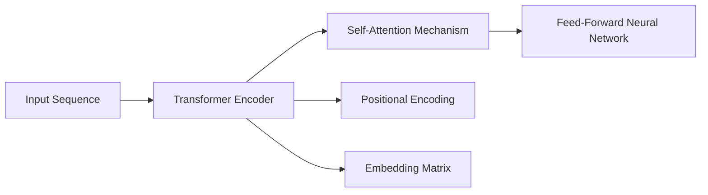
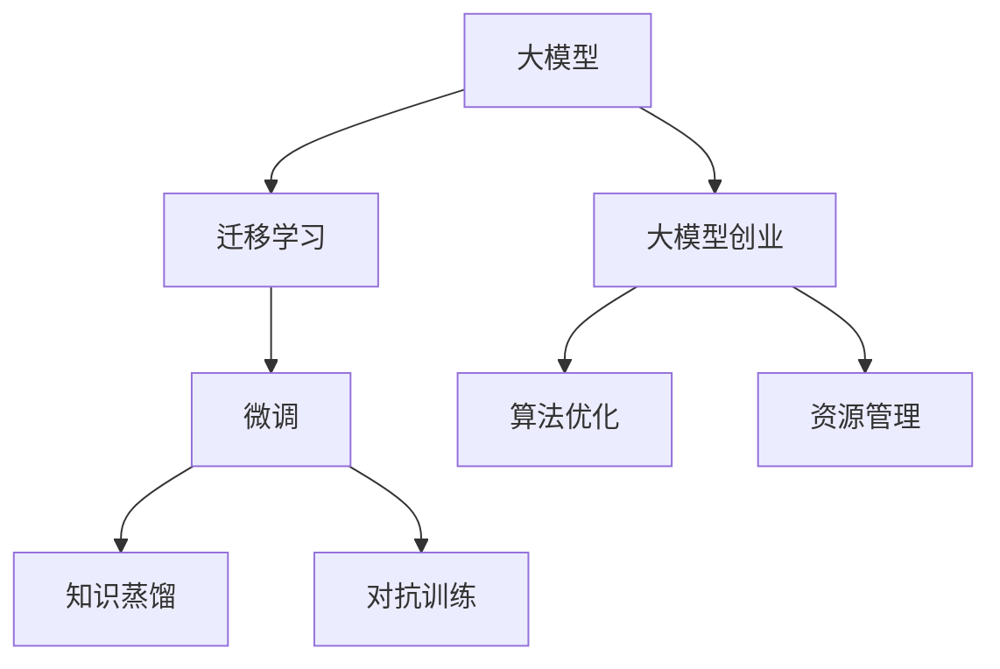

                 

# AI 大模型创业：如何利用创新优势？

> 关键词：大模型创业, 创新优势, 核心算法, 算法原理, 项目实践, 实际应用场景, 未来展望, 工具资源

## 1. 背景介绍

### 1.1 问题由来

近年来，人工智能技术在商业领域的创新应用成为热点。特别是大模型技术的发展，为各行各业带来了前所未有的机遇。越来越多的初创公司开始尝试基于大模型技术进行产品创新和商业化。如何在大模型技术的浪潮中抓住机遇，成为创业成功的关键。本文将从核心概念、核心算法、项目实践、应用场景、未来展望等多个角度，深入探讨如何利用大模型的创新优势，推动创业公司的成功。

### 1.2 问题核心关键点

大模型创业的核心在于如何将大模型的先进技术和知识应用于实际业务场景，创造具有差异化竞争优势的产品。关键点包括：

- **大模型技术**：先进的大模型技术，包括自然语言处理、计算机视觉、推荐系统等。
- **创新应用**：如何将大模型应用于新的业务场景，创造新价值。
- **算法优化**：针对特定业务场景，进行算法优化和微调，提升模型性能。
- **资源管理**：合理配置计算资源和人力资源，保证模型训练和推理的高效运行。

### 1.3 问题研究意义

本文旨在为即将进入大模型创业领域的技术创业者提供全面的指导。通过深入分析大模型技术的核心概念、算法原理和实践技巧，帮助创业者在技术研发和产品创新的道路上少走弯路，快速达到成功彼岸。

## 2. 核心概念与联系

### 2.1 核心概念概述

1. **大模型**：指基于深度学习和数据驱动训练的大型神经网络模型，如BERT、GPT、ViT等，能够在复杂的场景下进行高效的学习和推理。
2. **迁移学习**：指利用已有模型的知识，在新任务上进行快速适应和优化，提高模型的泛化能力。
3. **微调(Fine-tuning)**：在大模型基础上，通过特定任务的少量标注数据进行进一步训练，提升模型在该任务上的性能。
4. **知识蒸馏(Distillation)**：通过教师模型指导学生模型学习，减少大模型的计算负担，提升模型的推理效率。
5. **对抗训练(Adversarial Training)**：通过引入对抗样本训练，提升模型的鲁棒性和泛化能力。

### 2.2 核心概念原理和架构

大模型的核心原理是通过大规模数据训练，学习到丰富的语义和特征表示。这些模型在自然语言处理、计算机视觉、语音识别等领域展现了出色的表现。其架构通常由多层的神经网络组成，每个层负责提取不同的特征。以Transformer为例，其架构如图：



在这个架构中，输入序列经过编码器层，通过自注意力机制和前馈神经网络，最终输出表示。模型的每层都可以视为对输入特征的不同层次的提取。

### 2.3 核心概念间的关系

大模型的核心概念间存在紧密联系，共同构成了大模型技术的生态系统。以下是一个综合的流程图：



这个流程图展示了从大模型到创业公司的应用链条，从模型训练到算法优化，再到资源管理，各个环节的紧密联系和相互作用。

## 3. 核心算法原理 & 具体操作步骤

### 3.1 算法原理概述

大模型创业的核心在于将大模型的知识和能力转化为实际的业务应用。这一过程通常涉及以下几个步骤：

1. **数据准备**：收集和预处理适合特定业务场景的训练数据。
2. **模型加载**：选择合适的预训练模型并加载到系统中。
3. **模型微调**：通过微调提高模型在该业务场景上的性能。
4. **算法优化**：针对特定业务需求，进行算法优化和调整。
5. **模型部署**：将优化后的模型部署到实际业务系统中，进行实时推理和预测。

### 3.2 算法步骤详解

#### 3.2.1 数据准备

数据准备是创业公司起步的第一步。数据需要经过清洗、标注、归一化等处理，以适应特定业务场景的需求。

1. **数据收集**：收集与业务相关的数据，如文本、图像、音频等。
2. **数据标注**：为数据集添加标签，如分类、回归、序列标注等。
3. **数据增强**：通过旋转、裁剪、噪声注入等方式，扩充训练数据集。

#### 3.2.2 模型加载

选择合适的预训练模型是创业公司的关键决策之一。常用的预训练模型包括BERT、GPT、ViT等。

1. **模型选择**：根据业务需求，选择适合的预训练模型。
2. **模型加载**：使用库函数加载模型，如使用PyTorch加载BERT模型：

   ```python
   from transformers import BertModel, BertTokenizer

   tokenizer = BertTokenizer.from_pretrained('bert-base-uncased')
   model = BertModel.from_pretrained('bert-base-uncased')
   ```

#### 3.2.3 模型微调

模型微调是提高模型在特定业务场景上性能的关键步骤。

1. **微调数据准备**：将业务数据划分为训练集、验证集和测试集。
2. **微调模型**：通过在特定任务上训练，优化模型参数。

   ```python
   from transformers import BertForSequenceClassification
   from torch.utils.data import DataLoader, RandomSampler
   from torch.optim import Adam

   model = BertForSequenceClassification.from_pretrained('bert-base-uncased', num_labels=2)
   data_dir = '/path/to/data'
   train_dataset = SomeDataset(train_data, tokenizer, label_map)
   val_dataset = SomeDataset(val_data, tokenizer, label_map)
   batch_size = 16
   train_loader = DataLoader(train_dataset, batch_size=batch_size, sampler=RandomSampler(train_dataset))
   val_loader = DataLoader(val_dataset, batch_size=batch_size, sampler=RandomSampler(val_dataset))
   optimizer = Adam(model.parameters(), lr=2e-5)
   epochs = 3
   device = 'cuda'

   for epoch in range(epochs):
       for batch in train_loader:
           inputs = {k: v.to(device) for k, v in batch.items()}
           outputs = model(**inputs)
           loss = outputs.loss
           loss.backward()
           optimizer.step()
   ```

#### 3.2.4 算法优化

针对特定业务场景，进行算法优化和调整，以提升模型性能。

1. **算法选择**：选择合适的算法，如对抗训练、知识蒸馏等。
2. **参数调整**：调整模型的参数，如学习率、批大小等。

   ```python
   from transformers import AdamW, get_linear_schedule_with_warmup

   optimizer = AdamW(model.parameters(), lr=5e-5)
   scheduler = get_linear_schedule_with_warmup(optimizer, num_warmup_steps=1000, num_training_steps=-1)
   for epoch in range(epochs):
       for batch in train_loader:
           inputs = {k: v.to(device) for k, v in batch.items()}
           outputs = model(**inputs)
           loss = outputs.loss
           loss.backward()
           optimizer.step()
           scheduler.step()
   ```

#### 3.2.5 模型部署

将优化后的模型部署到实际业务系统中，进行实时推理和预测。

1. **模型导出**：将模型导出为可部署的格式，如TensorFlow SavedModel、PyTorch State Dict等。
2. **部署服务器**：选择适合的服务器进行模型部署，如AWS、Google Cloud等。
3. **API开发**：开发API接口，使外部系统能够方便地调用模型。

   ```python
   import torch
   import numpy as np

   model.eval()
   with torch.no_grad():
       inputs = torch.tensor(batch['input_ids'].to(device))
       outputs = model(inputs)
       predictions = outputs.logits.argmax(dim=1)
       prediction_probabilities = torch.softmax(outputs.logits, dim=1).cpu().numpy()
   ```

### 3.3 算法优缺点

#### 优点

1. **高性能**：大模型通过大规模数据训练，具备强大的学习能力，能够在各种任务上取得优异性能。
2. **泛化能力强**：大模型能够处理复杂的语义和结构化数据，具有良好的泛化能力。
3. **易于部署**：预训练模型已经训练好的参数，可以直接用于特定任务的微调，节省了大量时间和计算资源。

#### 缺点

1. **计算资源消耗大**：大模型参数量巨大，训练和推理需要大量的计算资源。
2. **数据依赖性强**：模型效果很大程度上依赖于数据的质量和数量。
3. **可解释性差**：大模型通常是一个"黑盒"模型，难以解释其决策过程。

### 3.4 算法应用领域

大模型的应用领域非常广泛，涵盖了自然语言处理、计算机视觉、语音识别、推荐系统等多个领域。以下是几个典型应用场景：

1. **自然语言处理(NLP)**：文本分类、情感分析、命名实体识别、机器翻译等。
2. **计算机视觉(CV)**：图像分类、目标检测、图像生成等。
3. **语音识别(SR)**：语音命令识别、语音情感分析等。
4. **推荐系统**：个性化推荐、广告投放优化等。

## 4. 数学模型和公式 & 详细讲解 & 举例说明

### 4.1 数学模型构建

以BERT为例，其训练过程可以分为两个阶段：预训练和微调。预训练阶段的数学模型可以表示为：

$$
\max_{\theta} \frac{1}{N} \sum_{i=1}^N \left( y \log \sigma(z) + (1-y) \log (1-\sigma(z)) \right)
$$

其中，$z$为模型的输出，$\sigma$为sigmoid函数，$y$为标签，$N$为样本数。

微调阶段，需要在特定任务上训练模型。例如，在二分类任务上，模型的损失函数可以表示为：

$$
\max_{\theta} \frac{1}{N} \sum_{i=1}^N -(y \log \sigma(z) + (1-y) \log (1-\sigma(z)))
$$

### 4.2 公式推导过程

以BERT的微调过程为例，推导模型的损失函数和梯度更新规则。

1. **损失函数推导**：在二分类任务上，假设模型输出为$\hat{y}$，真实标签为$y$，则损失函数为：

   $$
   \mathcal{L}(\theta) = -\frac{1}{N} \sum_{i=1}^N \left( y \log \hat{y} + (1-y) \log (1-\hat{y}) \right)
   $$

2. **梯度更新规则推导**：在微调过程中，使用Adam优化器更新模型参数，更新规则为：

   $$
   \theta_{t+1} = \theta_{t} - \eta \nabla_{\theta} \mathcal{L}(\theta_t)
   $$

   其中，$\eta$为学习率，$\nabla_{\theta} \mathcal{L}(\theta_t)$为损失函数对模型参数的梯度。

### 4.3 案例分析与讲解

以情感分析任务为例，分析BERT模型在微调过程中的训练过程。

1. **数据准备**：收集情感标注数据，分为训练集、验证集和测试集。
2. **模型加载**：加载预训练的BERT模型。
3. **微调模型**：在情感分析任务上训练模型，优化参数。
4. **评估模型**：在测试集上评估模型性能，优化参数。

   ```python
   from transformers import BertForSequenceClassification, BertTokenizer, AdamW, get_linear_schedule_with_warmup
   from torch.utils.data import DataLoader
   from sklearn.metrics import accuracy_score

   model = BertForSequenceClassification.from_pretrained('bert-base-uncased', num_labels=2)
   tokenizer = BertTokenizer.from_pretrained('bert-base-uncased')
   data_dir = '/path/to/data'
   train_dataset = SomeDataset(train_data, tokenizer, label_map)
   val_dataset = SomeDataset(val_data, tokenizer, label_map)
   batch_size = 16
   train_loader = DataLoader(train_dataset, batch_size=batch_size, sampler=RandomSampler(train_dataset))
   val_loader = DataLoader(val_dataset, batch_size=batch_size, sampler=RandomSampler(val_dataset))
   optimizer = AdamW(model.parameters(), lr=2e-5)
   scheduler = get_linear_schedule_with_warmup(optimizer, num_warmup_steps=1000, num_training_steps=-1)
   device = 'cuda'

   for epoch in range(epochs):
       for batch in train_loader:
           inputs = {k: v.to(device) for k, v in batch.items()}
           outputs = model(**inputs)
           loss = outputs.loss
           loss.backward()
           optimizer.step()
           scheduler.step()
       val_preds = []
       val_labels = []
       for batch in val_loader:
           inputs = {k: v.to(device) for k, v in batch.items()}
           outputs = model(**inputs)
           val_preds.append(outputs.logits.argmax(dim=1).tolist())
           val_labels.append(batch['labels'].tolist())
       val_preds = torch.tensor(val_preds)
       val_labels = torch.tensor(val_labels)
       acc = accuracy_score(val_labels, val_preds)
       print(f'Epoch {epoch+1}, Val Acc: {acc:.3f}')
   ```

## 5. 项目实践：代码实例和详细解释说明

### 5.1 开发环境搭建

1. **安装Python环境**：
   ```bash
   conda create -n pytorch-env python=3.8
   conda activate pytorch-env
   ```

2. **安装PyTorch和Transformers**：
   ```bash
   pip install torch transformers
   ```

3. **配置环境变量**：
   ```bash
   export PYTHONPATH=/path/to/your/project:$PYTHONPATH
   ```

### 5.2 源代码详细实现

以下是一个基于BERT的情感分析任务的代码实现，包括数据准备、模型微调、评估和部署。

```python
from transformers import BertForSequenceClassification, BertTokenizer, AdamW, get_linear_schedule_with_warmup
from torch.utils.data import DataLoader
from sklearn.metrics import accuracy_score
import torch
import numpy as np

# 数据准备
data_dir = '/path/to/data'
train_dataset = SomeDataset(train_data, tokenizer, label_map)
val_dataset = SomeDataset(val_data, tokenizer, label_map)
test_dataset = SomeDataset(test_data, tokenizer, label_map)
batch_size = 16

# 模型加载和微调
model = BertForSequenceClassification.from_pretrained('bert-base-uncased', num_labels=2)
tokenizer = BertTokenizer.from_pretrained('bert-base-uncased')
optimizer = AdamW(model.parameters(), lr=2e-5)
scheduler = get_linear_schedule_with_warmup(optimizer, num_warmup_steps=1000, num_training_steps=-1)
device = 'cuda'

for epoch in range(epochs):
    for batch in train_loader:
        inputs = {k: v.to(device) for k, v in batch.items()}
        outputs = model(**inputs)
        loss = outputs.loss
        loss.backward()
        optimizer.step()
        scheduler.step()

    # 评估模型
    val_preds = []
    val_labels = []
    for batch in val_loader:
        inputs = {k: v.to(device) for k, v in batch.items()}
        outputs = model(**inputs)
        val_preds.append(outputs.logits.argmax(dim=1).tolist())
        val_labels.append(batch['labels'].tolist())
    val_preds = torch.tensor(val_preds)
    val_labels = torch.tensor(val_labels)
    acc = accuracy_score(val_labels, val_preds)
    print(f'Epoch {epoch+1}, Val Acc: {acc:.3f}')

# 部署模型
model.eval()
with torch.no_grad():
    for batch in test_loader:
        inputs = {k: v.to(device) for k, v in batch.items()}
        outputs = model(**inputs)
        predictions = outputs.logits.argmax(dim=1).cpu().numpy()
        prediction_probabilities = torch.softmax(outputs.logits, dim=1).cpu().numpy()
```

### 5.3 代码解读与分析

1. **数据准备**：使用`SomeDataset`类准备数据，包括文本数据和标签。
2. **模型加载**：使用`BertForSequenceClassification`类加载BERT模型，并配置好参数。
3. **微调模型**：使用Adam优化器更新模型参数，并在验证集上评估模型性能。
4. **部署模型**：将模型导出为可部署格式，使用API进行实时推理和预测。

## 6. 实际应用场景

### 6.1 智能客服系统

智能客服系统是大模型创业中常见的应用场景之一。使用BERT等大模型，可以实现自然语言处理和情感分析，自动解答客户咨询，提供个性化服务。

### 6.2 金融舆情监测

在金融领域，大模型可以用于舆情分析、情感分析、风险预测等，帮助机构及时把握市场动态，规避风险。

### 6.3 个性化推荐系统

推荐系统是另一个典型应用场景，通过大模型实现用户行为分析，提供精准的推荐服务，提升用户体验。

### 6.4 未来应用展望

未来，大模型的应用将更加广泛和深入，涉及更多垂直领域，如医疗、教育、农业等。同时，大模型的创新性应用也将不断涌现，推动更多业务场景的智能化。

## 7. 工具和资源推荐

### 7.1 学习资源推荐

1. **《Transformer从原理到实践》系列博文**：涵盖Transformer原理、BERT模型、微调技术等前沿话题。
2. **CS224N《深度学习自然语言处理》课程**：斯坦福大学开设的NLP明星课程，提供Lecture视频和作业。
3. **《Natural Language Processing with Transformers》书籍**：Transformers库的作者所著，全面介绍NLP任务开发。
4. **HuggingFace官方文档**：Transformers库的官方文档，提供预训练模型和微调样例。
5. **CLUE开源项目**：中文语言理解测评基准，涵盖多种NLP数据集和基线模型。

### 7.2 开发工具推荐

1. **PyTorch**：基于Python的开源深度学习框架，适合快速迭代研究。
2. **TensorFlow**：由Google主导开发的深度学习框架，适合大规模工程应用。
3. **Transformers库**：HuggingFace开发的NLP工具库，支持多种预训练模型。
4. **Weights & Biases**：模型训练的实验跟踪工具，记录和可视化模型训练过程。
5. **TensorBoard**：TensorFlow配套的可视化工具，监测模型训练状态。
6. **Google Colab**：免费提供的在线Jupyter Notebook环境，方便调试实验。

### 7.3 相关论文推荐

1. **Attention is All You Need**：Transformer原论文，提出Transformer结构。
2. **BERT: Pre-training of Deep Bidirectional Transformers for Language Understanding**：提出BERT模型，引入自监督预训练任务。
3. **Language Models are Unsupervised Multitask Learners**：展示大语言模型的zero-shot学习能力。
4. **Parameter-Efficient Transfer Learning for NLP**：提出Adapter等参数高效微调方法。
5. **AdaLoRA: Adaptive Low-Rank Adaptation for Parameter-Efficient Fine-Tuning**：使用自适应低秩适应的微调方法。

## 8. 总结：未来发展趋势与挑战

### 8.1 研究成果总结

本文从大模型创业的角度，详细探讨了如何利用大模型的创新优势。通过分析核心概念、算法原理和项目实践，为创业者提供了系统的技术指导。

### 8.2 未来发展趋势

1. **模型规模增大**：超大规模模型将进一步普及，提升大模型的泛化能力。
2. **算法优化多样化**：更多参数高效和计算高效的微调方法将出现，提高大模型在特定场景下的性能。
3. **多模态融合**：大模型将与视觉、语音等多模态数据进行融合，提升系统的综合能力。

### 8.3 面临的挑战

1. **标注数据瓶颈**：获取高质量标注数据仍是难题，需要通过无监督和半监督学习等方式解决。
2. **模型鲁棒性不足**：需要更多研究来提升大模型的鲁棒性和泛化能力。
3. **计算资源消耗大**：大模型的计算资源消耗大，需要更多优化技术。
4. **可解释性差**：需要更多可解释性研究，提升系统的透明度。
5. **安全性问题**：大模型可能学习有害信息，需要更多伦理和安全机制。

### 8.4 研究展望

未来的研究方向包括：
1. **无监督和半监督学习**：通过自监督学习、主动学习等技术，减少对标注数据的依赖。
2. **参数高效和计算高效**：开发更多参数高效和计算高效的微调方法，提高模型性能。
3. **多模态融合**：将视觉、语音等多模态数据与文本数据进行融合，提升系统的综合能力。
4. **知识蒸馏和对抗训练**：引入知识蒸馏和对抗训练，提高模型的稳定性和鲁棒性。
5. **可解释性和安全性**：加强系统的可解释性和安全性，提升系统的透明度和安全性。

## 9. 附录：常见问题与解答

**Q1: 大模型创业过程中，如何选择合适的预训练模型？**

A: 根据业务需求和数据特性，选择合适的预训练模型。常用预训练模型包括BERT、GPT、ViT等。例如，对于情感分析任务，可以选择BERT模型。

**Q2: 在微调过程中，如何避免过拟合？**

A: 采用数据增强、正则化、对抗训练等技术，减少过拟合。例如，可以使用L2正则、Dropout、Early Stopping等方法。

**Q3: 如何评估模型的性能？**

A: 使用准确率、召回率、F1分数等指标评估模型性能。同时，进行交叉验证和超参数调优，找到最优模型。

**Q4: 部署模型时需要注意哪些问题？**

A: 关注模型的性能、计算资源消耗、API接口设计等问题，确保模型能够稳定高效运行。

---

作者：禅与计算机程序设计艺术 / Zen and the Art of Computer Programming

