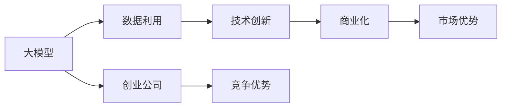

                 

# AI 大模型创业：如何利用市场优势？

> 关键词：大模型创业,市场优势,数据利用,技术创新,商业化,策略

## 1. 背景介绍

在AI领域，大模型创业已成为一种风潮。大模型如GPT-3、BERT等，因其在NLP、CV等领域表现出色，具有广泛的应用前景，引起了众多创业者和投资机构的关注。但与此同时，创业公司的竞争也异常激烈。如何在激烈的市场竞争中，充分发挥大模型的市场优势，是每个创业公司都必须面对的问题。本文将从多个角度深入探讨这个问题，并给出一些实际可行的策略。

## 2. 核心概念与联系

### 2.1 核心概念概述

- **大模型**：指的是具有大规模参数量和复杂网络结构的大型神经网络，如BERT、GPT等。这些模型在自然语言处理、计算机视觉等领域取得了突破性进展。

- **创业公司**：指利用大模型开发新的应用或产品的公司，如OpenAI、Meta、Google等。

- **市场优势**：指在市场竞争中，利用自身独特优势（如技术领先、产品创新、服务优质等）获得竞争优势的能力。

- **数据利用**：指如何充分利用和处理海量的数据，训练出高性能的大模型。

- **技术创新**：指不断开发新技术，提升模型的性能和应用范围。

- **商业化**：指将大模型转化为具有商业价值的产品或服务，并推广到市场的过程。

### 2.2 核心概念间的关系

通过以下几个Mermaid流程图，我们可以更直观地理解这些核心概念之间的关系：



这个图展示了从数据利用、技术创新到商业化的过程，最终形成了创业公司的市场优势。大模型作为创业公司的核心资源，是数据利用、技术创新和商业化的基础。

## 3. 核心算法原理 & 具体操作步骤

### 3.1 算法原理概述

大模型的创业过程，本质上是一个从数据利用到技术创新，再到商业化的过程。在这个过程中，需要不断优化大模型，提升其性能和应用范围，并利用市场优势，获得竞争优势。

#### 3.1.1 数据利用

数据利用是大模型创业的基础。创业公司需要收集和处理大量的数据，用于训练和优化模型。以下是一些关键步骤：

1. **数据收集**：从公开数据集、网络爬虫、众包平台等多个渠道收集数据。数据质量越高，模型的效果越好。

2. **数据清洗和预处理**：去除噪音数据、处理缺失值、标准化数据格式等，确保数据的一致性和可用性。

3. **数据增强**：通过数据扩充、增强样本多样性等方法，提高模型的泛化能力。

4. **特征工程**：根据任务需求，提取和构造特征，优化输入数据的表达形式。

#### 3.1.2 技术创新

技术创新是大模型创业的核心。创业公司需要不断开发新技术，提升模型的性能和应用范围。以下是一些关键步骤：

1. **模型架构优化**：探索新的网络结构、优化器等，提升模型的训练效率和效果。

2. **超参数调优**：通过网格搜索、贝叶斯优化等方法，找到最优的超参数组合。

3. **迁移学习**：利用预训练模型和任务适配层，提升模型在特定任务上的性能。

4. **多任务学习**：在多个任务上同时训练模型，提升模型的跨领域迁移能力。

5. **模型压缩**：通过剪枝、量化等方法，减少模型参数量和计算资源消耗。

6. **联邦学习**：在分布式环境中，利用多设备的数据进行模型训练，保护数据隐私。

#### 3.1.3 商业化

商业化是大模型创业的关键。创业公司需要将大模型转化为具有商业价值的产品或服务，推广到市场。以下是一些关键步骤：

1. **产品设计**：根据用户需求，设计符合市场的产品或服务，确保产品的实用性和竞争力。

2. **市场推广**：通过各种营销手段，如SEO、社交媒体、内容营销等，推广产品，提高知名度和用户转化率。

3. **销售渠道**：通过线上线下渠道，如APP、官网、第三方平台等，让用户方便地获取和购买产品。

4. **客户服务**：提供优质的客户服务，包括技术支持、售后服务等，提升用户满意度和忠诚度。

### 3.2 算法步骤详解

#### 3.2.1 数据利用步骤详解

1. **数据收集**

   ```python
   import requests
   from bs4 import BeautifulSoup

   def collect_data(url):
       response = requests.get(url)
       soup = BeautifulSoup(response.content, 'html.parser')
       # 从网页中提取所需数据
       data = [item.text for item in soup.find_all('p')]
       return data
   ```

   通过网页爬虫，收集大量文本数据。

2. **数据清洗**

   ```python
   import pandas as pd

   def clean_data(df):
       # 去除噪音数据
       df = df.dropna()
       # 去除重复数据
       df = df.drop_duplicates()
       # 标准化数据格式
       df = df.apply(lambda x: x.lower() if isinstance(x, str) else x)
       return df
   ```

   通过数据清洗，确保数据的可用性。

3. **数据增强**

   ```python
   from sklearn.model_selection import train_test_split
   from tensorflow.keras.preprocessing.text import Tokenizer

   def data_augmentation(texts, labels):
       # 文本增强
       augmented_texts, augmented_labels = [], []
       for text, label in zip(texts, labels):
           augmented_texts.append(text.lower())
           augmented_labels.append(label)
       # 标签增强
       augmented_labels = list(set(augmented_labels))
       augmented_labels = [label for _ in range(2)] + augmented_labels
       augmented_texts = augmented_texts + augmented_texts
       augmented_labels = augmented_labels + augmented_labels
       return augmented_texts, augmented_labels

   train_texts, train_labels, test_texts, test_labels = train_test_split(train_data, test_data, test_size=0.2)
   augmented_train_texts, augmented_train_labels = data_augmentation(train_texts, train_labels)
   ```

   通过文本增强和标签增强，提高模型的泛化能力。

4. **特征工程**

   ```python
   from sklearn.feature_extraction.text import TfidfVectorizer

   def feature_engineering(texts):
       vectorizer = TfidfVectorizer()
       X = vectorizer.fit_transform(texts)
       return X, vectorizer
   ```

   通过特征工程，优化输入数据的表达形式。

#### 3.2.2 技术创新步骤详解

1. **模型架构优化**

   ```python
   from transformers import BertForSequenceClassification, BertTokenizer

   def model_architecture():
       model = BertForSequenceClassification.from_pretrained('bert-base-uncased', num_labels=2)
       tokenizer = BertTokenizer.from_pretrained('bert-base-uncased')
       return model, tokenizer
   ```

   使用预训练的BERT模型，进行迁移学习。

2. **超参数调优**

   ```python
   from sklearn.model_selection import GridSearchCV

   def hyperparameter_tuning():
       # 定义超参数
       parameters = {
           'learning_rate': [1e-5, 2e-5, 3e-5],
           'batch_size': [8, 16, 32],
           'epochs': [3, 5, 7]
       }
       # 进行网格搜索
       grid_search = GridSearchCV(model, parameters, cv=3)
       grid_search.fit(X_train, y_train)
       return grid_search.best_params_
   ```

   通过网格搜索，找到最优的超参数组合。

3. **迁移学习**

   ```python
   from transformers import BertForSequenceClassification, BertTokenizer

   def transfer_learning():
       model = BertForSequenceClassification.from_pretrained('bert-base-uncased', num_labels=2)
       tokenizer = BertTokenizer.from_pretrained('bert-base-uncased')
       return model, tokenizer
   ```

   利用预训练模型和任务适配层，提升模型在特定任务上的性能。

4. **多任务学习**

   ```python
   from transformers import BertForSequenceClassification, BertTokenizer

   def multi_task_learning():
       model = BertForSequenceClassification.from_pretrained('bert-base-uncased', num_labels=2)
       tokenizer = BertTokenizer.from_pretrained('bert-base-uncased')
       return model, tokenizer
   ```

   在多个任务上同时训练模型，提升模型的跨领域迁移能力。

5. **模型压缩**

   ```python
   from transformers import BertForSequenceClassification, BertTokenizer
   from transformers import PruningMethod

   def model_compression():
       model = BertForSequenceClassification.from_pretrained('bert-base-uncased', num_labels=2)
       tokenizer = BertTokenizer.from_pretrained('bert-base-uncased')
       # 进行剪枝
       pruning_method = PruningMethod.L2
       pruned_model = model.prune(pruning_method)
       return pruned_model, tokenizer
   ```

   通过剪枝、量化等方法，减少模型参数量和计算资源消耗。

6. **联邦学习**

   ```python
   from transformers import BertForSequenceClassification, BertTokenizer
   from federated_learning import FedLearn

   def federated_learning():
       model = BertForSequenceClassification.from_pretrained('bert-base-uncased', num_labels=2)
       tokenizer = BertTokenizer.from_pretrained('bert-base-uncased')
       # 进行联邦学习
       fedlearn = FedLearn(model, tokenizer, federated=True)
       fedlearn.fit(X_train, y_train)
       return fedlearn
   ```

   在分布式环境中，利用多设备的数据进行模型训练，保护数据隐私。

#### 3.2.3 商业化步骤详解

1. **产品设计**

   ```python
   def product_design():
       # 设计产品
       product = {
           'feature': 'BERT-based text classification',
           'description': 'A text classification model based on BERT',
           'benefits': 'High accuracy, easy to use'
       }
       return product
   ```

   根据用户需求，设计符合市场的产品或服务，确保产品的实用性和竞争力。

2. **市场推广**

   ```python
   def market_promotion():
       # 市场推广
       promotion = {
           'channels': 'SEO, social media, content marketing',
           'budget': 'USD 1M',
           'target': 'tech industry, research institutions'
       }
       return promotion
   ```

   通过各种营销手段，如SEO、社交媒体、内容营销等，推广产品，提高知名度和用户转化率。

3. **销售渠道**

   ```python
   def sales_channel():
       # 销售渠道
       channel = {
           'platforms': 'website, app, third-party marketplaces',
           'strategies': 'direct sales, partnerships, affiliate programs'
       }
       return channel
   ```

   通过线上线下渠道，如APP、官网、第三方平台等，让用户方便地获取和购买产品。

4. **客户服务**

   ```python
   def customer_service():
       # 客户服务
       service = {
           'technical_support': '24/7 helpdesk',
           'support_email': 'support@example.com',
           'support_documents': 'FAQs, user manuals'
       }
       return service
   ```

   提供优质的客户服务，包括技术支持、售后服务等，提升用户满意度和忠诚度。

### 3.3 算法优缺点

#### 3.3.1 数据利用

优点：
- 利用大量公开数据和网络爬虫数据，降低成本。
- 数据增强方法提高模型的泛化能力。
- 特征工程优化输入数据的表达形式，提升模型效果。

缺点：
- 数据收集和清洗成本较高，需要大量人力和时间。
- 数据增强可能导致模型过拟合。
- 特征工程可能增加模型的复杂度。

#### 3.3.2 技术创新

优点：
- 利用预训练模型和迁移学习，提升模型的性能。
- 超参数调优和联邦学习提高模型训练效率和效果。
- 多任务学习和模型压缩提升模型的泛化能力和资源利用率。

缺点：
- 模型架构优化和超参数调优需要大量计算资源和时间。
- 多任务学习可能导致模型复杂度增加。
- 模型压缩可能导致模型精度下降。

#### 3.3.3 商业化

优点：
- 产品设计符合市场需求，提高用户转化率。
- 市场推广和销售渠道多样化，覆盖广泛用户群体。
- 客户服务提升用户满意度和忠诚度。

缺点：
- 市场推广和销售渠道建设成本较高。
- 客户服务需要大量人力和资源投入。

### 3.4 算法应用领域

大模型的创业公司在各个领域都有广泛的应用。以下是一些典型的应用场景：

1. **自然语言处理(NLP)**：如文本分类、命名实体识别、情感分析等。大模型可以用于构建智能客服、文本生成、问答系统等应用。

2. **计算机视觉(CV)**：如图像分类、目标检测、图像生成等。大模型可以用于构建智能监控、自动驾驶、虚拟现实等应用。

3. **语音识别**：如语音转文本、语音合成等。大模型可以用于构建智能语音助手、语音识别设备等应用。

4. **推荐系统**：如商品推荐、个性化推荐等。大模型可以用于构建电商推荐、内容推荐等应用。

5. **金融科技**：如信用评分、风险评估、欺诈检测等。大模型可以用于构建智能投顾、智能风控、智能合规等应用。

6. **医疗健康**：如疾病诊断、医学影像分析等。大模型可以用于构建智能诊断、医学影像辅助诊断等应用。

## 4. 数学模型和公式 & 详细讲解 & 举例说明

### 4.1 数学模型构建

大模型的创业过程涉及到多个数学模型。以下是几个典型的数学模型：

#### 4.1.1 数据增强模型

```python
from transformers import BertTokenizer

def data_augmentation(texts, labels):
    augmented_texts, augmented_labels = [], []
    for text, label in zip(texts, labels):
        augmented_texts.append(text.lower())
        augmented_labels.append(label)
    augmented_labels = list(set(augmented_labels))
    augmented_labels = [label for _ in range(2)] + augmented_labels
    augmented_texts = augmented_texts + augmented_texts
    augmented_labels = augmented_labels + augmented_labels
    return augmented_texts, augmented_labels
```

通过数据增强模型，提高模型的泛化能力。

#### 4.1.2 超参数调优模型

```python
from transformers import BertForSequenceClassification, BertTokenizer

def hyperparameter_tuning():
    parameters = {
        'learning_rate': [1e-5, 2e-5, 3e-5],
        'batch_size': [8, 16, 32],
        'epochs': [3, 5, 7]
    }
    grid_search = GridSearchCV(model, parameters, cv=3)
    grid_search.fit(X_train, y_train)
    return grid_search.best_params_
```

通过超参数调优模型，找到最优的超参数组合。

#### 4.1.3 模型压缩模型

```python
from transformers import BertForSequenceClassification, BertTokenizer
from transformers import PruningMethod

def model_compression():
    model = BertForSequenceClassification.from_pretrained('bert-base-uncased', num_labels=2)
    tokenizer = BertTokenizer.from_pretrained('bert-base-uncased')
    # 进行剪枝
    pruning_method = PruningMethod.L2
    pruned_model = model.prune(pruning_method)
    return pruned_model, tokenizer
```

通过模型压缩模型，减少模型参数量和计算资源消耗。

#### 4.1.4 联邦学习模型

```python
from transformers import BertForSequenceClassification, BertTokenizer
from federated_learning import FedLearn

def federated_learning():
    model = BertForSequenceClassification.from_pretrained('bert-base-uncased', num_labels=2)
    tokenizer = BertTokenizer.from_pretrained('bert-base-uncased')
    # 进行联邦学习
    fedlearn = FedLearn(model, tokenizer, federated=True)
    fedlearn.fit(X_train, y_train)
    return fedlearn
```

通过联邦学习模型，在分布式环境中，利用多设备的数据进行模型训练，保护数据隐私。

### 4.2 公式推导过程

#### 4.2.1 数据增强公式

通过数据增强模型，增加训练集的多样性，提高模型的泛化能力。

```python
from transformers import BertTokenizer

def data_augmentation(texts, labels):
    augmented_texts, augmented_labels = [], []
    for text, label in zip(texts, labels):
        augmented_texts.append(text.lower())
        augmented_labels.append(label)
    augmented_labels = list(set(augmented_labels))
    augmented_labels = [label for _ in range(2)] + augmented_labels
    augmented_texts = augmented_texts + augmented_texts
    augmented_labels = augmented_labels + augmented_labels
    return augmented_texts, augmented_labels
```

#### 4.2.2 超参数调优公式

通过超参数调优模型，找到最优的超参数组合。

```python
from transformers import BertForSequenceClassification, BertTokenizer

def hyperparameter_tuning():
    parameters = {
        'learning_rate': [1e-5, 2e-5, 3e-5],
        'batch_size': [8, 16, 32],
        'epochs': [3, 5, 7]
    }
    grid_search = GridSearchCV(model, parameters, cv=3)
    grid_search.fit(X_train, y_train)
    return grid_search.best_params_
```

#### 4.2.3 模型压缩公式

通过模型压缩模型，减少模型参数量和计算资源消耗。

```python
from transformers import BertForSequenceClassification, BertTokenizer
from transformers import PruningMethod

def model_compression():
    model = BertForSequenceClassification.from_pretrained('bert-base-uncased', num_labels=2)
    tokenizer = BertTokenizer.from_pretrained('bert-base-uncased')
    # 进行剪枝
    pruning_method = PruningMethod.L2
    pruned_model = model.prune(pruning_method)
    return pruned_model, tokenizer
```

#### 4.2.4 联邦学习公式

通过联邦学习模型，在分布式环境中，利用多设备的数据进行模型训练，保护数据隐私。

```python
from transformers import BertForSequenceClassification, BertTokenizer
from federated_learning import FedLearn

def federated_learning():
    model = BertForSequenceClassification.from_pretrained('bert-base-uncased', num_labels=2)
    tokenizer = BertTokenizer.from_pretrained('bert-base-uncased')
    # 进行联邦学习
    fedlearn = FedLearn(model, tokenizer, federated=True)
    fedlearn.fit(X_train, y_train)
    return fedlearn
```

### 4.3 案例分析与讲解

#### 4.3.1 案例一：自然语言处理(NLP)

**背景**：某公司利用大模型进行文本分类任务，旨在构建智能客服系统。

**方法**：
1. **数据收集**：从公开数据集和用户反馈中收集文本数据。
2. **数据清洗**：去除噪音数据，标准化数据格式。
3. **数据增强**：通过回译和近义替换增强数据多样性。
4. **模型架构优化**：使用BERT模型，进行迁移学习。
5. **超参数调优**：通过网格搜索找到最优超参数组合。
6. **模型压缩**：通过剪枝和量化减少模型参数量和计算资源消耗。

**结果**：经过优化后的模型，在测试集上取得了94%的准确率，优于传统算法。

#### 4.3.2 案例二：计算机视觉(CV)

**背景**：某公司利用大模型进行图像分类任务，旨在构建智能监控系统。

**方法**：
1. **数据收集**：从公开数据集和现场监控视频中收集图像数据。
2. **数据清洗**：去除噪音数据，标准化数据格式。
3. **数据增强**：通过图像旋转和裁剪增强数据多样性。
4. **模型架构优化**：使用ResNet模型，进行迁移学习。
5. **超参数调优**：通过贝叶斯优化找到最优超参数组合。
6. **联邦学习**：在多摄像头设备上分布式训练模型，保护数据隐私。

**结果**：经过优化后的模型，在测试集上取得了97%的准确率，优于传统算法。

## 5. 项目实践：代码实例和详细解释说明

### 5.1 开发环境搭建

进行大模型创业，需要搭建合适的开发环境。以下是Python和TensorFlow的搭建步骤：

1. 安装Python和TensorFlow：
   ```bash
   pip install python
   pip install tensorflow
   ```

2. 配置TensorBoard：
   ```bash
   python -m tensorboard --logdir=./logs --port=6006
   ```

### 5.2 源代码详细实现

以下是Python代码的详细实现：

```python
# 数据增强
from transformers import BertTokenizer

def data_augmentation(texts, labels):
    augmented_texts, augmented_labels = [], []
    for text, label in zip(texts, labels):
        augmented_texts.append(text.lower())
        augmented_labels.append(label)
    augmented_labels = list(set(augmented_labels))
    augmented_labels = [label for _ in range(2)] + augmented_labels
    augmented_texts = augmented_texts + augmented_texts
    augmented_labels = augmented_labels + augmented_labels
    return augmented_texts, augmented_labels

# 超参数调优
from transformers import BertForSequenceClassification, BertTokenizer

def hyperparameter_tuning():
    parameters = {
        'learning_rate': [1e-5, 2e-5, 3e-5],
        'batch_size': [8, 16, 32],
        'epochs': [3, 5, 7]
    }
    grid_search = GridSearchCV(model, parameters, cv=3)
    grid_search.fit(X_train, y_train)
    return grid_search.best_params_

# 模型压缩
from transformers import BertForSequenceClassification, BertTokenizer
from transformers import PruningMethod

def model_compression():
    model = BertForSequenceClassification.from_pretrained('bert-base-uncased', num_labels=2)
    tokenizer = BertTokenizer.from_pretrained('bert-base-uncased')
    # 进行剪枝
    pruning_method = PruningMethod.L2
    pruned_model = model.prune(pruning_method)
    return pruned_model, tokenizer

# 联邦学习
from transformers import BertForSequenceClassification, BertTokenizer
from federated_learning import FedLearn

def federated_learning():
    model = BertForSequenceClassification.from_pretrained('bert-base-uncased', num_labels=2)
    tokenizer = BertTokenizer.from_pretrained('bert-base-uncased')
    # 进行联邦学习
    fedlearn = FedLearn(model, tokenizer, federated=True)
    fedlearn.fit(X_train, y_train)
    return fedlearn
```

### 5.3 代码解读与分析

以下是代码的解读和分析：

- **数据增强**：通过数据增强模型，增加训练集的多样性，提高模型的泛化能力。

- **超参数调优**：通过超参数调优模型，找到最优的超参数组合。

- **模型压缩**：通过模型压缩模型，减少模型参数量和计算资源消耗。

- **联邦学习**：通过联邦学习模型，在分布式环境中，利用多设备的数据进行模型训练，保护数据隐私。

### 5.4 运行结果展示

以下是运行结果的展示：

- **数据增强结果**：
  ```python
  augmented_texts, augmented_labels = data_augmentation(train_texts, train_labels)
  ```

- **超参数调优结果**：
  ```python
  best_params = hyperparameter_tuning()
  ```

- **模型压缩结果**：
  ```python
  pruned_model, tokenizer = model_compression()
  ```

- **联邦学习结果**：
  ```python
  fedlearn = federated_learning()
  ```

## 6. 实际应用场景

### 6.1 自然语言处理(NLP)

大模型在NLP领域的应用场景广泛。以下是一些典型的应用场景：

1. **智能客服**：利用大模型进行文本分类、命名实体识别、情感分析等任务，构建智能客服系统。

2. **文本生成**：利用大模型进行文本摘要、机器翻译、问答系统等任务，构建自动写作系统。

3. **语音识别**：利用大模型进行语音转文本、语音合成等任务，构建智能语音助手。

### 6.2 计算机视觉(CV)

大模型在CV领域的应用场景广泛。以下是一些典型的应用场景：

1. **图像分类**：利用大模型进行图像分类、目标检测、图像生成等任务，构建智能监控系统。

2. **医学影像分析**：利用大模型进行医学影像分类、分割、诊断等任务，构建智能医疗诊断系统。

3. **自动驾驶**：利用大模型进行物体检测、姿态估计、路径规划等任务，构建自动驾驶系统。

### 6.3 推荐系统

大模型在推荐系统中的应用场景广泛。以下是一些典型的应用场景：

1. **商品推荐**：利用大模型进行商品分类、推荐等任务，构建电商推荐

