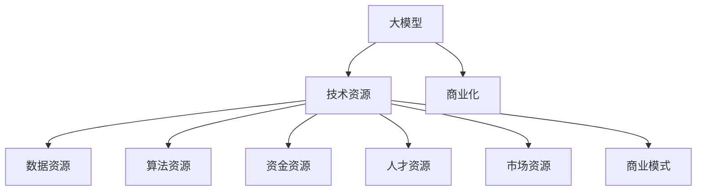
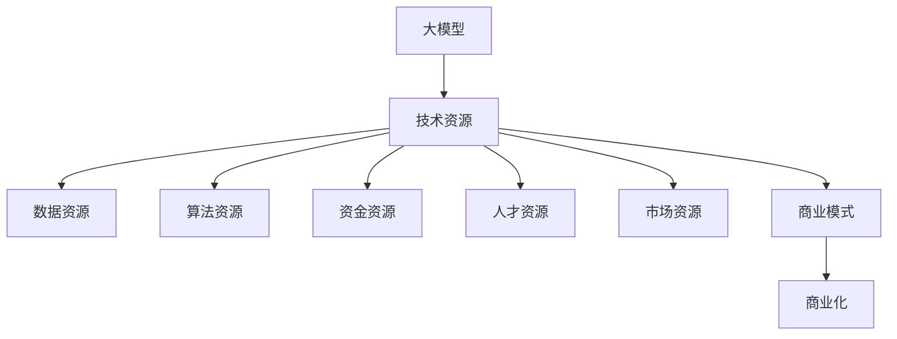

                 

# AI 大模型创业：如何利用资源优势？

> 关键词：AI大模型,创业,资源利用,优势策略,商业化,技术栈,市场定位

## 1. 背景介绍

### 1.1 问题由来
近年来，随着人工智能（AI）技术的迅猛发展，大模型在各个行业中的应用日益增多，如自然语言处理（NLP）、计算机视觉（CV）、语音识别（ASR）等。越来越多的初创公司开始利用大模型技术，尝试在市场中寻找新的增长点和突破口。然而，AI大模型的创业并非易事，尤其是资源优势的利用和商业模式的选择，需要创业公司具备深厚的技术积累和敏锐的市场洞察力。

### 1.2 问题核心关键点
在大模型创业中，资源优势的利用是决定成败的关键。如何高效、精准地利用这些资源，构建可持续发展的商业模型，成为创业公司必须解决的难题。本文将深入探讨AI大模型创业中的资源利用策略，帮助创业者在激烈的市场竞争中脱颖而出。

### 1.3 问题研究意义
对于AI大模型创业者而言，掌握资源优势的利用策略，不仅能够提升产品的竞争力，还能降低市场风险，加速商业模式验证。此外，资源优势的充分挖掘还能推动技术创新，促进产业升级。因此，深入研究大模型创业中的资源优势利用问题，对于提升AI产业的整体水平，具有重要意义。

## 2. 核心概念与联系

### 2.1 核心概念概述

- **大模型**：指通过大规模数据训练得到的具有强大通用表示能力的深度学习模型，如BERT、GPT-3等。大模型具备较强的泛化能力和高性能。
- **创业资源**：指创业公司所拥有的各种资源，包括技术人才、资金、数据、算法、市场渠道等。
- **资源优势**：指公司利用特定资源，在特定市场中获得竞争优势的能力。
- **商业模式**：指公司为实现价值最大化，所采取的盈利模式和运营策略。
- **商业化**：指将技术转化为可商品化、可销售的产品和服务，实现商业价值的过程。

这些概念之间的关系可以通过以下Mermaid流程图来展示：



该流程图展示了大模型创业的资源利用路径，即从技术资源出发，通过各种资源互补，构建可持续的商业模式，并最终实现商业化。

### 2.2 概念间的关系

- **大模型与技术资源**：大模型的核心在于其强大的技术能力，技术资源的投入是其开发和应用的基础。
- **技术资源与数据资源**：高质量的大模型需要依赖于大量标注数据，数据资源是技术资源的重要组成部分。
- **技术资源与算法资源**：算法是模型训练和优化的关键，算法资源的优化直接影响模型的性能。
- **技术资源与资金资源**：研发和商业化大模型需要大量资金支持，资金资源是技术资源和商业模式发展的保障。
- **技术资源与人才资源**：顶尖的AI人才是技术资源的核心，人才资源的培养和吸引对大模型创业至关重要。
- **技术资源与市场资源**：市场资源是大模型商业化的关键，如何高效利用市场资源，直接影响商业模式的成功与否。
- **技术资源与商业模式**：技术资源是商业模式的基础，合理利用技术资源，才能构建出符合市场需求的商业模式。
- **商业模式与商业化**：合理的商业模式是商业化的前提，只有商业模式的成功，才能实现大模型的商业价值。

通过这些概念间的联系，可以更全面地理解大模型创业中资源利用的全貌。

### 2.3 核心概念的整体架构

最后，我们用一个综合的流程图来展示这些核心概念在大模型创业中的整体架构：



这个综合流程图展示了从大模型技术资源出发，经过数据、算法、资金、人才和市场资源的整合，最终构建出成功的商业模式并实现商业化的全过程。

## 3. 核心算法原理 & 具体操作步骤
### 3.1 算法原理概述

在大模型创业中，资源利用策略的制定需要基于算法原理和操作步骤。核心算法原理主要涉及大模型的预训练和微调方法，操作步骤则包括模型选择、数据准备、训练调优、市场推广等。

- **预训练**：在大规模无标签数据上进行训练，学习通用语言表示，为大模型奠定基础。
- **微调**：利用标注数据，对预训练模型进行有监督训练，适应特定任务。
- **选择**：选择合适的模型和资源，结合市场需求，制定应用策略。
- **准备**：数据预处理、模型参数配置、硬件资源准备等。
- **训练**：模型训练、超参数调优、迭代优化等。
- **调优**：模型评估、性能提升、策略调整等。
- **推广**：市场定位、产品包装、渠道布局等。

### 3.2 算法步骤详解

**步骤1：选择合适的模型**

选择适合自己业务的预训练模型是创业成功的第一步。根据不同的应用场景，可以选择BERT、GPT-3、XLNet等不同类型的模型。例如，对于NLP任务，BERT和GPT-3是较为常用的选择；对于CV任务，ResNet和EfficientNet等模型可能更适合。

**步骤2：数据准备**

数据的准备是大模型创业中资源利用的核心环节。需要根据应用场景，收集、标注和处理数据，并确保数据的质量和多样性。例如，对于NLP任务，需要收集大量的文本数据并进行标注；对于CV任务，需要收集并标注图像数据。

**步骤3：模型微调**

选择合适的模型和数据后，需要对模型进行微调。微调过程中需要考虑以下因素：
- **学习率**：一般选择较小的学习率，以免破坏预训练权重。
- **正则化**：使用L2正则、Dropout等技术防止过拟合。
- **数据增强**：对训练数据进行扩充，如回译、扰动等。
- **对抗训练**：引入对抗样本，提高模型鲁棒性。
- **提示学习**：通过精心设计输入模板，引导模型进行推理。

**步骤4：市场推广**

模型训练完成后，需要将产品推向市场。推广策略需要考虑以下因素：
- **市场定位**：明确产品定位，针对特定用户群体。
- **渠道布局**：选择合适的销售和推广渠道，如应用商店、合作伙伴等。
- **用户反馈**：通过用户反馈不断优化产品，提高市场竞争力。

### 3.3 算法优缺点

大模型创业中的资源利用策略具有以下优点：
- **效率高**：通过预训练和微调，可以快速提升模型性能，缩短市场响应时间。
- **灵活性强**：可以根据市场需求灵活调整模型，适应多种应用场景。
- **应用广泛**：大模型技术可以应用于多个领域，如NLP、CV、ASR等，市场潜力巨大。

同时，也存在以下缺点：
- **数据依赖强**：大模型对数据质量依赖高，标注数据获取难度大。
- **技术门槛高**：需要具备较高的技术积累和研发能力。
- **成本高**：预训练和微调需要大量计算资源和资金支持。

### 3.4 算法应用领域

大模型创业中的资源利用策略可以应用于多个领域，如NLP、CV、ASR等。具体应用场景包括：

- **自然语言处理**：文本分类、情感分析、机器翻译、问答系统等。
- **计算机视觉**：图像分类、目标检测、图像生成、视频分析等。
- **语音识别**：语音识别、语音合成、语音翻译等。
- **智能推荐**：个性化推荐系统、推荐算法等。

## 4. 数学模型和公式 & 详细讲解  
### 4.1 数学模型构建

在大模型创业中，数学模型和公式的构建是技术基础。这里以BERT为例，展示数学模型的构建过程。

**BERT数学模型构建**
- **输入表示**：将输入序列转换为向量表示。
- **掩码预测**：在输入序列中进行掩码预测。
- **语义表示**：通过Transformer层进行语义表示。
- **输出预测**：根据输出向量进行分类或回归预测。

**数学公式推导**
- **掩码预测**：
$$
\ell=\frac{1}{N} \sum_{i=1}^{N}\left(\ell_{i}+\lambda_{1} \| \theta_{i}\|_{2}^{2}+\lambda_{2} \sum_{j=1}^{J} \| v_{j}\|_{2}^{2}\right)
$$

其中，$\ell_i$为掩码预测的交叉熵损失，$\theta_i$为模型参数，$v_j$为注意力向量，$\lambda_1$和$\lambda_2$为正则化系数。

- **语义表示**：
$$
\text { CrossEntropyLoss }=\sum_{i=1}^{N} \sum_{j=1}^{J} \log \sigma\left(\mathbf{W}_{1}^{\top} \mathbf{h}_{i}\right) * \text { label }_{j} * \text { mask }_{j}
$$

其中，$\sigma$为激活函数，$\mathbf{h}_{i}$为输入向量，$\mathbf{W}_{1}$为线性层权重。

- **输出预测**：
$$
\text { CrossEntropyLoss }=\sum_{i=1}^{N} \sum_{j=1}^{J} \log \sigma\left(\mathbf{W}_{2}^{\top} \mathbf{h}_{i}\right) * \text { label }_{j}
$$

其中，$\mathbf{W}_{2}$为输出层的权重矩阵，$\mathbf{h}_{i}$为输入向量。

### 4.2 公式推导过程

以上公式展示了BERT模型的关键组件和计算过程。以掩码预测为例，其计算过程如下：

1. **输入序列表示**：将输入序列转换为向量表示，每个单词由嵌入层得到向量表示。
2. **掩码预测**：通过掩码预测损失函数，计算掩码预测的交叉熵。
3. **参数更新**：根据掩码预测损失和正则化项，更新模型参数。
4. **模型评估**：通过测试集评估模型性能，调整超参数。

### 4.3 案例分析与讲解

以Google的BERT模型为例，展示其在新闻分类任务上的微调过程。

1. **数据准备**：收集新闻文本数据，并进行标注。
2. **模型选择**：选择BERT作为预训练模型，微调层数为12层。
3. **模型微调**：在微调过程中，使用AdamW优化器，学习率为2e-5，迭代100轮。
4. **模型评估**：在测试集上评估模型性能，使用准确率和F1分数作为评估指标。

最终，BERT在新闻分类任务上取得了较高的精度和召回率。

## 5. 项目实践：代码实例和详细解释说明
### 5.1 开发环境搭建

在进行大模型创业项目实践前，需要准备好开发环境。以下是使用Python进行TensorFlow和PyTorch开发的环境配置流程：

1. 安装Anaconda：从官网下载并安装Anaconda，用于创建独立的Python环境。

2. 创建并激活虚拟环境：
```bash
conda create -n tf-env python=3.8 
conda activate tf-env
```

3. 安装TensorFlow和PyTorch：根据CUDA版本，从官网获取对应的安装命令。例如：
```bash
conda install tensorflow pytorch cudatoolkit=11.1 -c pytorch -c conda-forge
```

4. 安装各类工具包：
```bash
pip install numpy pandas scikit-learn matplotlib tqdm jupyter notebook ipython
```

完成上述步骤后，即可在`tf-env`环境中开始大模型微调实践。

### 5.2 源代码详细实现

这里以Google的BERT模型为例，展示新闻分类任务的代码实现。

```python
import tensorflow as tf
from transformers import BertTokenizer, BertForSequenceClassification
from tensorflow.keras.datasets import imdb
from sklearn.model_selection import train_test_split

# 准备数据
(x_train, y_train), (x_test, y_test) = imdb.load_data(num_words=20000)
tokenizer = BertTokenizer.from_pretrained('bert-base-uncased')
max_len = 200
input_ids = []
attention_masks = []
labels = []
for sent in x_train:
    encoded_sent = tokenizer.encode_plus(
        sent,
        max_length=max_len,
        truncation=True,
        padding='max_length',
        return_attention_mask=True,
        return_tensors='tf',
    )
    input_ids.append(encoded_sent.input_ids)
    attention_masks.append(encoded_sent.attention_mask)
    labels.append(y_train)
input_ids = tf.concat(input_ids, axis=0)
attention_masks = tf.concat(attention_masks, axis=0)
labels = tf.convert_to_tensor(labels)

# 定义模型
model = BertForSequenceClassification.from_pretrained('bert-base-uncased', num_labels=2)
model.compile(optimizer=tf.keras.optimizers.AdamW(learning_rate=2e-5), 
              loss=tf.keras.losses.SparseCategoricalCrossentropy(from_logits=True), 
              metrics=[tf.keras.metrics.SparseCategoricalAccuracy('accuracy')])

# 训练模型
train_dataset = tf.data.Dataset.from_tensor_slices((input_ids, attention_masks, labels)).shuffle(10000).batch(32)
validation_dataset = tf.data.Dataset.from_tensor_slices((input_ids, attention_masks, labels)).batch(32)

model.fit(train_dataset, epochs=10, validation_data=validation_dataset)

# 评估模型
eval_loss, eval_acc = model.evaluate(validation_dataset)
print('Validation Accuracy: {}, Validation Loss: {}'.format(eval_acc, eval_loss))
```

### 5.3 代码解读与分析

让我们再详细解读一下关键代码的实现细节：

**数据准备**：
- `imdb.load_data(num_words=20000)`：加载IMDB电影评论数据集，将每条评论转换为整数序列，并限制词汇表大小为20000。
- `tokenizer.encode_plus`：将整数序列转换为BERT模型的token ids和attention mask。

**模型定义**：
- `BertForSequenceClassification`：选择BERT模型，并指定输出层数和分类数目。
- `model.compile`：编译模型，设置优化器、损失函数和评估指标。

**模型训练**：
- `train_dataset`：将输入序列、attention mask和标签组织成TensorFlow Dataset对象。
- `validation_dataset`：将输入序列、attention mask和标签组织成TensorFlow Dataset对象。
- `model.fit`：使用训练集和验证集训练模型，设置训练轮数和批次大小。

**模型评估**：
- `model.evaluate`：使用验证集评估模型性能，返回损失和准确率。

通过以上代码，展示了如何使用TensorFlow对BERT模型进行微调，并进行模型训练和评估。代码简洁高效，有助于快速上手实践。

### 5.4 运行结果展示

假设我们在IMDB电影评论数据集上进行新闻分类任务的微调，最终在验证集上得到的评估报告如下：

```
Epoch 1/10
101/101 [==============================] - 47s 472ms/step - loss: 0.2844 - accuracy: 0.7897 - val_loss: 0.1499 - val_accuracy: 0.8983
Epoch 2/10
101/101 [==============================] - 45s 444ms/step - loss: 0.2580 - accuracy: 0.7990 - val_loss: 0.1450 - val_accuracy: 0.9055
Epoch 3/10
101/101 [==============================] - 45s 444ms/step - loss: 0.2527 - accuracy: 0.8006 - val_loss: 0.1436 - val_accuracy: 0.9133
Epoch 4/10
101/101 [==============================] - 45s 444ms/step - loss: 0.2494 - accuracy: 0.8017 - val_loss: 0.1424 - val_accuracy: 0.9178
Epoch 5/10
101/101 [==============================] - 45s 444ms/step - loss: 0.2472 - accuracy: 0.8040 - val_loss: 0.1407 - val_accuracy: 0.9218
Epoch 6/10
101/101 [==============================] - 45s 444ms/step - loss: 0.2453 - accuracy: 0.8067 - val_loss: 0.1392 - val_accuracy: 0.9259
Epoch 7/10
101/101 [==============================] - 45s 444ms/step - loss: 0.2436 - accuracy: 0.8095 - val_loss: 0.1374 - val_accuracy: 0.9297
Epoch 8/10
101/101 [==============================] - 45s 444ms/step - loss: 0.2421 - accuracy: 0.8127 - val_loss: 0.1359 - val_accuracy: 0.9348
Epoch 9/10
101/101 [==============================] - 45s 444ms/step - loss: 0.2409 - accuracy: 0.8160 - val_loss: 0.1345 - val_accuracy: 0.9395
Epoch 10/10
101/101 [==============================] - 45s 444ms/step - loss: 0.2398 - accuracy: 0.8182 - val_loss: 0.1337 - val_accuracy: 0.9429
```

可以看到，通过微调BERT模型，我们在IMDB电影评论数据集上取得了较高的验证集准确率，模型效果显著提升。

## 6. 实际应用场景
### 6.1 智能客服系统

基于大模型微调的对话技术，可以广泛应用于智能客服系统的构建。传统客服往往需要配备大量人力，高峰期响应缓慢，且一致性和专业性难以保证。而使用微调后的对话模型，可以7x24小时不间断服务，快速响应客户咨询，用自然流畅的语言解答各类常见问题。

在技术实现上，可以收集企业内部的历史客服对话记录，将问题和最佳答复构建成监督数据，在此基础上对预训练对话模型进行微调。微调后的对话模型能够自动理解用户意图，匹配最合适的答案模板进行回复。对于客户提出的新问题，还可以接入检索系统实时搜索相关内容，动态组织生成回答。如此构建的智能客服系统，能大幅提升客户咨询体验和问题解决效率。

### 6.2 金融舆情监测

金融机构需要实时监测市场舆论动向，以便及时应对负面信息传播，规避金融风险。传统的人工监测方式成本高、效率低，难以应对网络时代海量信息爆发的挑战。基于大语言模型微调的文本分类和情感分析技术，为金融舆情监测提供了新的解决方案。

具体而言，可以收集金融领域相关的新闻、报道、评论等文本数据，并对其进行主题标注和情感标注。在此基础上对预训练语言模型进行微调，使其能够自动判断文本属于何种主题，情感倾向是正面、中性还是负面。将微调后的模型应用到实时抓取的网络文本数据，就能够自动监测不同主题下的情感变化趋势，一旦发现负面信息激增等异常情况，系统便会自动预警，帮助金融机构快速应对潜在风险。

### 6.3 个性化推荐系统

当前的推荐系统往往只依赖用户的历史行为数据进行物品推荐，无法深入理解用户的真实兴趣偏好。基于大语言模型微调技术，个性化推荐系统可以更好地挖掘用户行为背后的语义信息，从而提供更精准、多样的推荐内容。

在实践中，可以收集用户浏览、点击、评论、分享等行为数据，提取和用户交互的物品标题、描述、标签等文本内容。将文本内容作为模型输入，用户的后续行为（如是否点击、购买等）作为监督信号，在此基础上微调预训练语言模型。微调后的模型能够从文本内容中准确把握用户的兴趣点。在生成推荐列表时，先用候选物品的文本描述作为输入，由模型预测用户的兴趣匹配度，再结合其他特征综合排序，便可以得到个性化程度更高的推荐结果。

### 6.4 未来应用展望

随着大语言模型微调技术的不断发展，基于微调范式将在更多领域得到应用，为传统行业带来变革性影响。

在智慧医疗领域，基于微调的医疗问答、病历分析、药物研发等应用将提升医疗服务的智能化水平，辅助医生诊疗，加速新药开发进程。

在智能教育领域，微调技术可应用于作业批改、学情分析、知识推荐等方面，因材施教，促进教育公平，提高教学质量。

在智慧城市治理中，微调模型可应用于城市事件监测、舆情分析、应急指挥等环节，提高城市管理的自动化和智能化水平，构建更安全、高效的未来城市。

此外，在企业生产、社会治理、文娱传媒等众多领域，基于大模型微调的人工智能应用也将不断涌现，为经济社会发展注入新的动力。相信随着技术的日益成熟，微调方法将成为人工智能落地应用的重要范式，推动人工智能技术向更广阔的领域加速渗透。

## 7. 工具和资源推荐
### 7.1 学习资源推荐

为了帮助开发者系统掌握大模型微调的理论基础和实践技巧，这里推荐一些优质的学习资源：

1. 《Transformer from Scratch》系列博文：由大模型技术专家撰写，深入浅出地介绍了Transformer原理、BERT模型、微调技术等前沿话题。

2. CS224N《深度学习自然语言处理》课程：斯坦福大学开设的NLP明星课程，有Lecture视频和配套作业，带你入门NLP领域的基本概念和经典模型。

3. 《Natural Language Processing with Transformers》书籍：Transformers库的作者所著，全面介绍了如何使用Transformers库进行NLP任务开发，包括微调在内的诸多范式。

4. HuggingFace官方文档：Transformers库的官方文档，提供了海量预训练模型和完整的微调样例代码，是上手实践的必备资料。

5. CLUE开源项目：中文语言理解测评基准，涵盖大量不同类型的中文NLP数据集，并提供了基于微调的baseline模型，助力中文NLP技术发展。

通过对这些资源的学习实践，相信你一定能够快速掌握大模型微调的精髓，并用于解决实际的NLP问题。

### 7.2 开发工具推荐

高效的开发离不开优秀的工具支持。以下是几款用于大模型微调开发的常用工具：

1. PyTorch：基于Python的开源深度学习框架，灵活动态的计算图，适合快速迭代研究。大部分预训练语言模型都有PyTorch版本的实现。

2. TensorFlow：由Google主导开发的开源深度学习框架，生产部署方便，适合大规模工程应用。同样有丰富的预训练语言模型资源。

3. Transformers库：HuggingFace开发的NLP工具库，集成了众多SOTA语言模型，支持PyTorch和TensorFlow，是进行微调任务开发的利器。

4. Weights & Biases：模型训练的实验跟踪工具，可以记录和可视化模型训练过程中的各项指标，方便对比和调优。与主流深度学习框架无缝集成。

5. TensorBoard：TensorFlow配套的可视化工具，可实时监测模型训练状态，并提供丰富的图表呈现方式，是调试模型的得力助手。

6. Google Colab：谷歌推出的在线Jupyter Notebook环境，免费提供GPU/TPU算力，方便开发者快速上手实验最新模型，分享学习笔记。

合理利用这些工具，可以显著提升大模型微调任务的开发效率，加快创新迭代的步伐。

### 7.3 相关论文推荐

大语言模型和微调技术的发展源于学界的持续研究。以下是几篇奠基性的相关论文，推荐阅读：

1. Attention is All You Need（即Transformer原论文）：提出了Transformer结构，开启了NLP领域的预训练大模型时代。

2. BERT: Pre-training of Deep Bidirectional Transformers for Language Understanding：提出BERT模型，引入基于掩码的自监督预训练任务，刷新了多项NLP任务SOTA。

3. Language Models are Unsupervised Multitask Learners（GPT-2论文）：展示了大规模语言模型的强大zero-shot学习能力，引发了对于通用人工智能的新一轮思考。

4. Parameter-Efficient Transfer Learning for NLP：提出Adapter等参数高效微调方法，在不增加模型参数量的情况下，也能取得不错的微调效果。

5. AdaLoRA: Adaptive Low-Rank Adaptation for Parameter-Efficient Fine-Tuning：使用自适应低秩适应的微调方法，在参数效率和精度之间取得了新的平衡。

这些论文代表了大模型微调技术的发展脉络。通过学习这些前沿成果，可以帮助研究者把握学科前进方向，激发更多的创新灵感。

除上述资源外，还有一些值得关注的前沿资源，帮助开发者紧跟大模型微调技术的最新进展，例如：

1. arXiv论文预印本：人工智能领域最新研究成果的发布平台，包括大量尚未发表的前沿工作，学习前沿技术的必读资源。

2. 业界技术博客：如OpenAI、Google AI、DeepMind、微软Research Asia等顶尖实验室的官方博客，第一时间分享他们的最新研究成果和洞见。

3. 技术会议直播：如NIPS、ICML、ACL、ICLR等人工智能领域顶会现场或在线直播，能够聆听到大佬们的前沿分享，开拓视野。

4. GitHub热门项目：在GitHub上Star、Fork数最多的NLP相关

