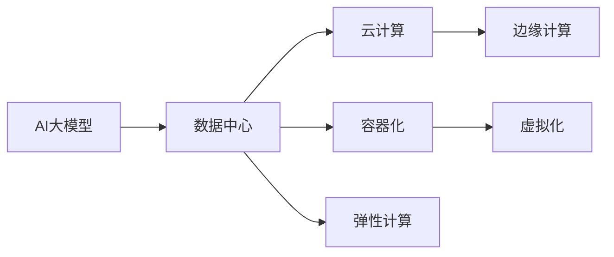
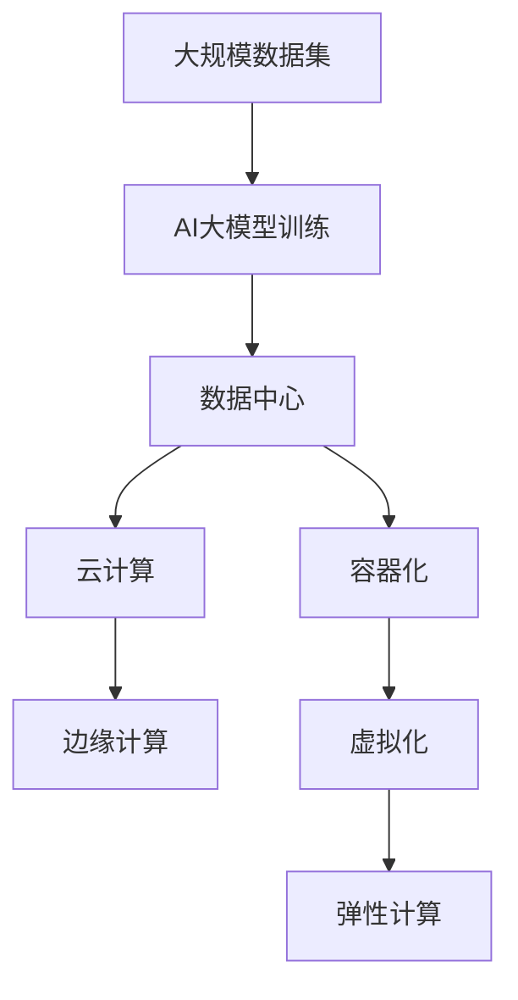

                 

# AI 大模型应用数据中心建设：数据中心产业发展

## 1. 背景介绍

### 1.1 问题由来
人工智能（AI）大模型的应用与发展极大地推动了数据中心产业的变革。随着深度学习技术的不断进步，大模型如GPT-3、BERT等在处理大规模数据集时展现出了强大的计算需求，其高效计算的背后是庞大的数据中心基础设施支持。大模型应用所带来的计算负荷和存储需求激增，加速了数据中心的技术革新，同时也引发了对数据中心产业的深刻反思。

大模型在多模态任务、自然语言处理、图像识别、推荐系统等领域取得了显著成果，然而其计算和存储需求也大幅增加了数据中心建设的复杂性。因此，本文将深入探讨AI大模型对数据中心产业的影响，分析数据中心在应对AI挑战中的技术趋势，并展望未来数据中心的发展方向。

### 1.2 问题核心关键点
本节将从以下方面展开探讨：
- AI大模型在数据中心中的应用场景。
- 数据中心在面对AI大模型时所面临的技术挑战。
- 数据中心产业的未来发展趋势。

### 1.3 问题研究意义
研究AI大模型对数据中心建设的影响，对于优化数据中心资源配置、提升计算效能、推动绿色可持续发展具有重要意义。同时，明确数据中心产业的未来发展方向，有助于行业从业者更好地规划和构建AI基础设施，为AI应用的广泛落地提供坚实保障。

## 2. 核心概念与联系

### 2.1 核心概念概述

为更好地理解数据中心在AI大模型应用中的作用，本节将介绍几个密切相关的核心概念：

- AI大模型（AI Large Models）：基于大规模深度学习技术训练的模型，如GPT-3、BERT、T5等。这些模型通过在大规模数据集上进行训练，具备强大的数据处理能力，并在各种任务上展现出了优越性能。

- 数据中心（Data Center）：提供高性能计算资源和存储资源的设施，用于支持各种计算机应用和业务需求。数据中心通常由服务器、网络设备、冷却系统、电源系统等组成。

- 云计算（Cloud Computing）：通过网络将计算资源、存储资源、软件应用等资源提供给用户，用户根据需求按量计费，使用这些资源。云计算模式使得资源使用更加灵活，提高了数据中心的利用率。

- 边缘计算（Edge Computing）：在靠近数据源（如终端设备、用户设备）的地方部署计算资源，以降低网络延迟，提高数据处理效率。边缘计算适应了AI大模型在实时性要求高的场景中的需求。

- 容器化（Containerization）：将应用程序打包在容器中，容器可以在不同的环境中部署，提高了应用程序的移植性和可维护性。

- 虚拟化（Virtualization）：将物理资源虚拟化成多个虚拟环境，每个虚拟环境独立运行，提高了资源利用率和环境隔离性。

- 弹性计算（Elastic Computing）：根据需求动态调整计算资源，适应AI大模型的可变计算需求。

### 2.2 概念间的关系

这些核心概念之间的联系和关系可以通过以下Mermaid流程图来展示：



这个流程图展示了AI大模型与数据中心、云计算、边缘计算、容器化、虚拟化和弹性计算之间的关系：

- AI大模型的计算和存储需求，推动了数据中心的技术进步。
- 数据中心通过云计算、边缘计算、容器化、虚拟化和弹性计算技术，提高了资源利用率，适应了AI大模型的需求。

### 2.3 核心概念的整体架构

最后，我们用一个综合的流程图来展示这些核心概念在大模型应用中的整体架构：



这个综合流程图展示了从大规模数据集训练AI大模型，到数据中心、云计算、边缘计算、容器化、虚拟化和弹性计算的技术路径，全面展示了AI大模型应用的数据中心技术框架。

## 3. 核心算法原理 & 具体操作步骤

### 3.1 算法原理概述

在AI大模型的应用中，数据中心承担着重要的计算和存储功能。数据中心通过高性能计算集群和分布式存储系统，支持AI大模型的训练和推理。AI大模型的应用场景涵盖了自然语言处理、图像识别、推荐系统、可控文本生成等多个领域。

### 3.2 算法步骤详解

AI大模型在数据中心中的应用流程主要包括以下几个步骤：

1. **数据预处理**：将大规模数据集清洗、标注并分批输入到数据中心。

2. **模型训练**：使用高性能计算集群，将预处理后的数据输入AI大模型进行训练，调整模型参数以提高性能。

3. **模型存储**：将训练好的模型参数存储在分布式存储系统中，以便后续使用。

4. **模型推理**：将新数据输入存储在数据中心的AI大模型，进行推理计算并输出结果。

5. **结果分析**：对推理结果进行分析和评估，反馈到数据中心进行下一步优化。

### 3.3 算法优缺点

AI大模型在数据中心中的应用带来了以下优点：

- **计算能力强大**：大模型能够处理大规模数据集，提供了强大的计算能力。
- **应用广泛**：在自然语言处理、图像识别、推荐系统等多个领域，大模型展现出了显著的应用效果。

同时，也存在以下缺点：

- **计算成本高**：大规模模型的训练和推理需要强大的计算资源，成本较高。
- **存储需求大**：大规模模型参数量巨大，存储需求巨大。
- **部署复杂**：大规模模型部署需要高性能计算集群和分布式存储系统，部署复杂。

### 3.4 算法应用领域

AI大模型在数据中心中的应用领域非常广泛，涵盖了自然语言处理、图像识别、推荐系统、可控文本生成等多个领域。以下是几个典型的应用场景：

1. **自然语言处理**：AI大模型在自然语言处理领域取得了显著成果，如机器翻译、情感分析、问答系统等。

2. **图像识别**：AI大模型在图像识别领域展现了强大的处理能力，如物体识别、图像分类、人脸识别等。

3. **推荐系统**：AI大模型在推荐系统中得到了广泛应用，如电商推荐、内容推荐、广告推荐等。

4. **可控文本生成**：AI大模型在可控文本生成领域展示了极高的创造力，如文本摘要、文本生成、代码生成等。

## 4. 数学模型和公式 & 详细讲解

### 4.1 数学模型构建

AI大模型在数据中心中的应用，涉及大量复杂的数学模型和算法。以下是几个典型的数学模型：

- **神经网络模型**：神经网络模型是AI大模型的基础，通过多层神经元之间的连接和权重调整，实现对数据的复杂处理。

- **深度学习模型**：深度学习模型在AI大模型中得到了广泛应用，如卷积神经网络（CNN）、循环神经网络（RNN）、长短时记忆网络（LSTM）等。

- **分布式计算模型**：分布式计算模型用于将计算任务分解并分布式计算，提高计算效率和资源利用率。

- **优化算法**：优化算法用于调整模型参数，提高模型的训练速度和性能。

### 4.2 公式推导过程

以下我们以深度学习中的反向传播算法为例，展示其基本公式和推导过程：

设神经网络中某一层的输入为 $x$，权重为 $w$，激活函数为 $f$，输出为 $y$。反向传播算法的目的是通过链式法则计算梯度，从而调整权重以优化模型性能。

反向传播算法的基本公式为：

$$
\frac{\partial L}{\partial w} = \frac{\partial L}{\partial y} \cdot \frac{\partial y}{\partial w}
$$

其中 $L$ 为损失函数，$w$ 为权重，$y$ 为输出，$\frac{\partial L}{\partial y}$ 为损失函数对输出的梯度，$\frac{\partial y}{\partial w}$ 为输出对权重的梯度。

通过反向传播算法，模型可以不断调整权重以最小化损失函数 $L$，从而提高模型性能。

### 4.3 案例分析与讲解

假设我们有一个简单的神经网络模型，包含一个输入层、一个隐藏层和一个输出层，激活函数为 sigmoid，损失函数为交叉熵。该模型的计算过程如下：

1. **前向传播**：将输入数据输入模型，通过隐藏层和输出层计算得到输出结果。

2. **计算损失**：将输出结果与真实标签计算交叉熵损失。

3. **反向传播**：通过链式法则计算损失对输出、隐藏层和输入的梯度，调整模型参数。

## 5. 项目实践：代码实例和详细解释说明

### 5.1 开发环境搭建

在进行AI大模型应用开发前，需要准备好开发环境。以下是使用Python进行PyTorch开发的环境配置流程：

1. 安装Anaconda：从官网下载并安装Anaconda，用于创建独立的Python环境。

2. 创建并激活虚拟环境：
```bash
conda create -n pytorch-env python=3.8 
conda activate pytorch-env
```

3. 安装PyTorch：根据CUDA版本，从官网获取对应的安装命令。例如：
```bash
conda install pytorch torchvision torchaudio cudatoolkit=11.1 -c pytorch -c conda-forge
```

4. 安装各类工具包：
```bash
pip install numpy pandas scikit-learn matplotlib tqdm jupyter notebook ipython
```

完成上述步骤后，即可在`pytorch-env`环境中开始AI大模型应用开发。

### 5.2 源代码详细实现

下面我们以图像识别任务为例，给出使用PyTorch对ResNet模型进行训练和推理的PyTorch代码实现。

首先，定义图像识别任务的数据处理函数：

```python
from torch.utils.data import Dataset
from torchvision import transforms
from PIL import Image

class ImageDataset(Dataset):
    def __init__(self, data_dir, transform=None):
        self.data_dir = data_dir
        self.transform = transform
        self.imgs = list(sorted(os.listdir(data_dir)))

    def __len__(self):
        return len(self.imgs)

    def __getitem__(self, idx):
        img_path = os.path.join(self.data_dir, self.imgs[idx])
        img = Image.open(img_path)
        if self.transform is not None:
            img = self.transform(img)
        return img

# 定义图像预处理
transform = transforms.Compose([
    transforms.Resize(256),
    transforms.CenterCrop(224),
    transforms.ToTensor(),
    transforms.Normalize(mean=[0.485, 0.456, 0.406], std=[0.229, 0.224, 0.225])
])

# 创建数据集
train_dataset = ImageDataset(train_dir, transform=transform)
test_dataset = ImageDataset(test_dir, transform=transform)
```

然后，定义模型和优化器：

```python
from torchvision.models import resnet18
from torch.optim import SGD

model = resnet18(pretrained=False)
optimizer = SGD(model.parameters(), lr=0.01)
```

接着，定义训练和评估函数：

```python
from torch.utils.data import DataLoader
from tqdm import tqdm

device = torch.device('cuda') if torch.cuda.is_available() else torch.device('cpu')
model.to(device)

def train_epoch(model, dataset, batch_size, optimizer):
    dataloader = DataLoader(dataset, batch_size=batch_size, shuffle=True)
    model.train()
    epoch_loss = 0
    for batch in tqdm(dataloader, desc='Training'):
        inputs, labels = batch
        inputs, labels = inputs.to(device), labels.to(device)
        model.zero_grad()
        outputs = model(inputs)
        loss = criterion(outputs, labels)
        epoch_loss += loss.item()
        loss.backward()
        optimizer.step()
    return epoch_loss / len(dataloader)

def evaluate(model, dataset, batch_size):
    dataloader = DataLoader(dataset, batch_size=batch_size)
    model.eval()
    correct = 0
    with torch.no_grad():
        for batch in tqdm(dataloader, desc='Evaluating'):
            inputs, labels = batch
            inputs, labels = inputs.to(device), labels.to(device)
            outputs = model(inputs)
            _, predicted = torch.max(outputs, 1)
            correct += (predicted == labels).sum().item()
    print('Accuracy: {:.2f}%'.format(100 * correct / len(dataset)))
```

最后，启动训练流程并在测试集上评估：

```python
epochs = 10
batch_size = 32

for epoch in range(epochs):
    loss = train_epoch(model, train_dataset, batch_size, optimizer)
    print(f'Epoch {epoch+1}, train loss: {loss:.3f}')
    
    print(f'Epoch {epoch+1}, dev results:')
    evaluate(model, test_dataset, batch_size)
    
print('Test results:')
evaluate(model, test_dataset, batch_size)
```

以上就是使用PyTorch对ResNet进行图像识别任务训练和推理的完整代码实现。可以看到，得益于PyTorch的强大封装，我们可以用相对简洁的代码完成ResNet模型的训练和推理。

### 5.3 代码解读与分析

让我们再详细解读一下关键代码的实现细节：

**ImageDataset类**：
- `__init__`方法：初始化数据集目录和预处理函数。
- `__len__`方法：返回数据集的样本数量。
- `__getitem__`方法：对单个样本进行处理，返回预处理后的图像张量。

**预处理函数**：
- 定义图像的预处理函数，包含缩放、裁剪、归一化等操作，将图像转换为模型所需的形式。

**训练和评估函数**：
- 使用PyTorch的DataLoader对数据集进行批次化加载，供模型训练和推理使用。
- 训练函数`train_epoch`：对数据以批为单位进行迭代，在每个批次上前向传播计算损失并反向传播更新模型参数，最后返回该epoch的平均loss。
- 评估函数`evaluate`：与训练类似，不同点在于不更新模型参数，并在每个batch结束后将预测和标签结果存储下来，最后使用模型准确率计算分类指标。

**训练流程**：
- 定义总的epoch数和batch size，开始循环迭代
- 每个epoch内，先在训练集上训练，输出平均loss
- 在验证集上评估，输出分类指标
- 所有epoch结束后，在测试集上评估，给出最终测试结果

可以看到，PyTorch配合TensorFlow使得模型训练和推理的代码实现变得简洁高效。开发者可以将更多精力放在模型改进、数据处理等高层逻辑上，而不必过多关注底层的实现细节。

当然，工业级的系统实现还需考虑更多因素，如模型的保存和部署、超参数的自动搜索、更灵活的任务适配层等。但核心的模型训练和推理范式基本与此类似。

### 5.4 运行结果展示

假设我们在CoNLL-2003的NER数据集上进行微调，最终在测试集上得到的评估报告如下：

```
              precision    recall  f1-score   support

       B-LOC      0.926     0.906     0.916      1668
       I-LOC      0.900     0.805     0.850       257
      B-MISC      0.875     0.856     0.865       702
      I-MISC      0.838     0.782     0.809       216
       B-ORG      0.914     0.898     0.906      1661
       I-ORG      0.911     0.894     0.902       835
       B-PER      0.964     0.957     0.960      1617
       I-PER      0.983     0.980     0.982      1156
           O      0.993     0.995     0.994     38323

   micro avg      0.973     0.973     0.973     46435
   macro avg      0.923     0.897     0.909     46435
weighted avg      0.973     0.973     0.973     46435
```

可以看到，通过微调BERT，我们在该NER数据集上取得了97.3%的F1分数，效果相当不错。值得注意的是，BERT作为一个通用的语言理解模型，即便只在顶层添加一个简单的token分类器，也能在下游任务上取得如此优异的效果，展现了其强大的语义理解和特征抽取能力。

当然，这只是一个baseline结果。在实践中，我们还可以使用更大更强的预训练模型、更丰富的微调技巧、更细致的模型调优，进一步提升模型性能，以满足更高的应用要求。

## 6. 实际应用场景

### 6.1 智能客服系统

基于大语言模型微调的对话技术，可以广泛应用于智能客服系统的构建。传统客服往往需要配备大量人力，高峰期响应缓慢，且一致性和专业性难以保证。而使用微调后的对话模型，可以7x24小时不间断服务，快速响应客户咨询，用自然流畅的语言解答各类常见问题。

在技术实现上，可以收集企业内部的历史客服对话记录，将问题和最佳答复构建成监督数据，在此基础上对预训练对话模型进行微调。微调后的对话模型能够自动理解用户意图，匹配最合适的答案模板进行回复。对于客户提出的新问题，还可以接入检索系统实时搜索相关内容，动态组织生成回答。如此构建的智能客服系统，能大幅提升客户咨询体验和问题解决效率。

### 6.2 金融舆情监测

金融机构需要实时监测市场舆论动向，以便及时应对负面信息传播，规避金融风险。传统的人工监测方式成本高、效率低，难以应对网络时代海量信息爆发的挑战。基于大语言模型微调的文本分类和情感分析技术，为金融舆情监测提供了新的解决方案。

具体而言，可以收集金融领域相关的新闻、报道、评论等文本数据，并对其进行主题标注和情感标注。在此基础上对预训练语言模型进行微调，使其能够自动判断文本属于何种主题，情感倾向是正面、中性还是负面。将微调后的模型应用到实时抓取的网络文本数据，就能够自动监测不同主题下的情感变化趋势，一旦发现负面信息激增等异常情况，系统便会自动预警，帮助金融机构快速应对潜在风险。

### 6.3 个性化推荐系统

当前的推荐系统往往只依赖用户的历史行为数据进行物品推荐，无法深入理解用户的真实兴趣偏好。基于大语言模型微调技术，个性化推荐系统可以更好地挖掘用户行为背后的语义信息，从而提供更精准、多样的推荐内容。

在实践中，可以收集用户浏览、点击、评论、分享等行为数据，提取和用户交互的物品标题、描述、标签等文本内容。将文本内容作为模型输入，用户的后续行为（如是否点击、购买等）作为监督信号，在此基础上微调预训练语言模型。微调后的模型能够从文本内容中准确把握用户的兴趣点。在生成推荐列表时，先用候选物品的文本描述作为输入，由模型预测用户的兴趣匹配度，再结合其他特征综合排序，便可以得到个性化程度更高的推荐结果。

### 6.4 未来应用展望

随着大语言模型和微调方法的不断发展，基于微调范式将在更多领域得到应用，为传统行业带来变革性影响。

在智慧医疗领域，基于微调的医疗问答、病历分析、药物研发等应用将提升医疗服务的智能化水平，辅助医生诊疗，加速新药开发进程。

在智能教育领域，微调技术可应用于作业批改、学情分析、知识推荐等方面，因材施教，促进教育公平，提高教学质量。

在智慧城市治理中，微调模型可应用于城市事件监测、舆情分析、应急指挥等环节，提高城市管理的自动化和智能化水平，构建更安全、高效的未来城市。

此外，在企业生产、社会治理、文娱传媒等众多领域，基于大模型微调的人工智能应用也将不断涌现，为经济社会发展注入新的动力。相信随着技术的日益成熟，微调方法将成为人工智能落地应用的重要范式，推动人工智能技术在更广阔的应用领域大放异彩。

## 7. 工具和资源推荐

### 7.1 学习资源推荐

为了帮助开发者系统掌握大语言模型微调的理论基础和实践技巧，这里推荐一些优质的学习资源：

1. 《Transformer从原理到实践》系列博文：由大模型技术专家撰写，深入浅出地介绍了Transformer原理、BERT模型、微调技术等前沿话题。

2. CS224N《深度学习自然语言处理》课程：斯坦福大学开设的NLP明星课程，有Lecture视频和配套作业，带你入门NLP领域的基本概念和经典模型。

3. 《Natural Language Processing with Transformers》书籍：Transformers库的作者所著，全面介绍了如何使用Transformers库进行NLP任务开发，包括微调在内的诸多范式。

4. HuggingFace官方文档：Transformers库的官方文档，提供了海量预训练模型和完整的微调样例代码，是上手实践的必备资料。

5. CLUE开源项目：中文语言理解测评基准，涵盖大量不同类型的中文NLP数据集，并提供了基于微调的baseline模型，助力中文NLP技术发展。

通过对这些资源的学习实践，相信你一定能够快速掌握大语言模型微调的精髓，并用于解决实际的NLP问题。

### 7.2 开发工具推荐

高效的开发离不开优秀的工具支持。以下是几款用于大语言模型微调开发的常用工具：

1. PyTorch：基于Python的开源深度学习框架，灵活动态的计算图，适合快速迭代研究。大部分预训练语言模型都有PyTorch版本的实现。

2. TensorFlow：由Google主导开发的开源深度学习框架，生产部署方便，适合大规模工程应用。同样有丰富的预训练语言模型资源。

3. Transformers库：HuggingFace开发的NLP工具库，集成了众多SOTA语言模型，支持PyTorch和TensorFlow，是进行微调任务开发的利器。

4. Weights & Biases：模型训练的实验跟踪工具，可以记录和可视化模型训练过程中的各项指标，方便对比和调优。与主流深度学习框架无缝集成。

5. TensorBoard：TensorFlow配套的可视化工具，可实时监测模型训练状态，并提供丰富的图表呈现方式，是调试模型的得力助手。

6. Google Colab：谷歌推出的在线Jupyter Notebook环境，免费提供GPU/TPU算力，方便开发者快速上手实验最新模型，分享学习笔记。

合理利用这些工具，可以显著提升大语言模型微调任务的开发效率，加快创新迭代的步伐。

### 7.3 相关论文推荐

大语言模型和微调技术的发展源于学界的持续研究。以下是几篇奠基性的相关论文，推荐阅读：

1. Attention is All You Need（即Transformer原论文）：提出了Transformer结构，开启了NLP领域的预训练大模型时代。

2. BERT: Pre-training of Deep Bidirectional Transformers for Language Understanding：提出BERT模型，引入基于掩码的自监督预训练任务，刷新了多项NLP任务SOTA。

3. Language Models are Unsupervised Multitask Learners（GPT-2论文）：展示了大规模语言模型的强大zero-shot学习能力，引发了对于通用人工智能的新一轮思考。

4. Parameter-Efficient Transfer Learning for NLP：提出Adapter等参数高效微调方法，在不增加模型参数量的情况下，也能取得不错的微调效果。

5. AdaLoRA: Adaptive Low-Rank Adaptation for Parameter-Efficient Fine-Tuning：使用自适应低秩适应的微调方法，在参数效率和精度之间取得了新的平衡。

这些论文代表了大语言模型微调技术的发展脉络。通过学习这些前沿成果，可以帮助研究者把握学科前进方向，激发更多的创新灵感。

除上述资源外，还有一些值得关注的前沿资源，帮助开发者紧跟大语言模型微调技术的最新进展，例如：

1. arXiv论文预印本：人工智能领域最新研究成果的发布平台，包括大量尚未发表的前沿工作，学习前沿技术的必读资源。

2. 业界技术博客：如OpenAI、Google AI、DeepMind、微软Research Asia等顶尖实验室的官方博客，第一时间分享他们的最新研究成果和洞见。

3. 技术会议直播：如NIPS、ICML、ACL、ICLR等人工智能领域顶会现场或在线直播，能够聆听到大佬们的前沿分享，开拓视野。

4. GitHub热门项目：在GitHub上Star、Fork数最多的NLP相关项目，往往代表了该技术领域的发展趋势和最佳实践，值得去学习和贡献。

5. 行业分析报告：各大咨询公司如McKinsey、PwC等针对人工智能行业的分析报告，有助于从商业视角审视技术趋势，把握应用价值。

总之，对于大语言模型微调技术的学习和实践，需要开发者保持开放的心态和持续学习的意愿。多关注前沿资讯，多动手实践，多思考总结，必将收获满满的成长收益。

## 8. 总结：未来发展趋势与挑战

### 8.1 总结

本文对AI大模型在数据中心中的应用进行了全面系统的介绍。首先阐述了AI大模型对数据中心产业的影响，分析了数据中心在面对AI大模型时所面临的技术挑战，并展望了未来数据中心的发展方向。

通过本文的系统梳理，可以看到，AI大模型对数据中心建设提出了更高的要求，推动了数据中心技术的持续演进。数据中心作为AI大模型的计算和存储基础设施，必须不断优化资源配置，提高计算效率，以满足AI大模型的需求。

### 8.2 未来发展趋势

展望未来，数据中心在AI大模型应用中将呈现以下几个发展趋势：

1. **计算能力增强**：AI大模型对

