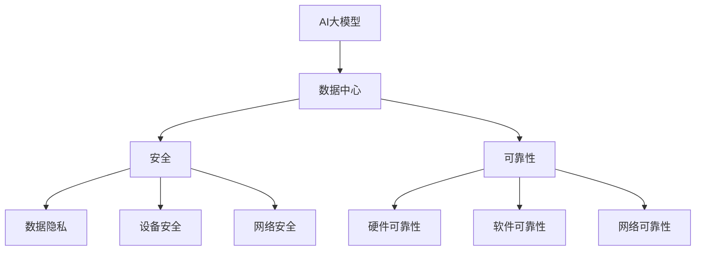
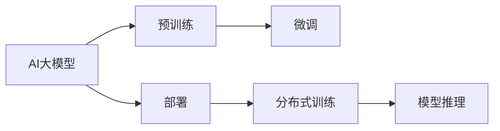
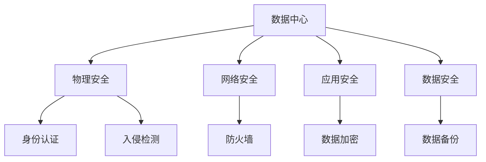
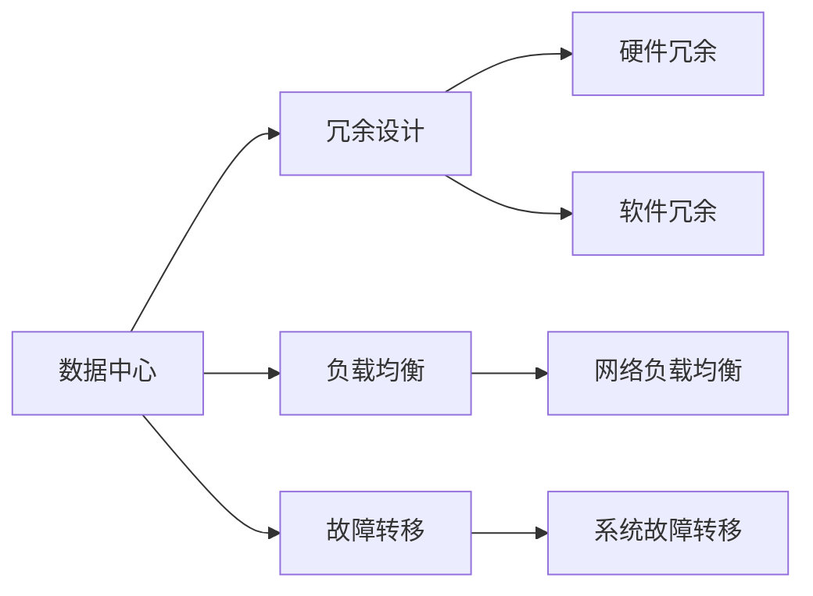

                 

# AI 大模型应用数据中心建设：数据中心安全与可靠性

> 关键词：AI大模型,数据中心,安全,可靠性

## 1. 背景介绍

### 1.1 问题由来

近年来，随着人工智能（AI）技术和大规模模型的快速发展，数据中心在支持这些模型的训练和推理过程中扮演了至关重要的角色。数据中心不仅需要提供高速网络、强大计算能力和高效存储，还必须保证数据的安全性和可靠性，才能满足AI模型的高需求。尤其是对于AI大模型，数据中心的安全与可靠性直接决定了AI系统的应用效果和用户体验。

### 1.2 问题核心关键点

当前，AI大模型应用面临的主要挑战包括：

1. **数据隐私与安全**：AI大模型通常需要大量数据进行训练，如何在数据传输、存储和处理过程中保障数据隐私和安全，是数据中心需要解决的关键问题。
2. **系统可靠性与容错**：大规模模型训练通常需要高并发、高性能的计算资源，如何在分布式系统架构下保证系统的稳定性和容错能力，是大规模数据中心需要考虑的重要问题。
3. **扩展性与资源管理**：AI大模型对计算资源的需求量极大，如何在数据中心中进行资源管理与调度，确保资源的高效利用，是数据中心优化运维的关键。

### 1.3 问题研究意义

研究AI大模型应用数据中心的安全与可靠性，对于推动AI技术在各行业的落地应用具有重要意义：

1. **提升AI系统性能**：数据中心的安全与可靠性直接影响到AI模型的训练和推理效果，保障数据中心的安全可靠，能够有效提升AI系统的性能和用户体验。
2. **促进数据中心技术创新**：数据中心是AI技术的重要基础设施，通过研究AI大模型应用的数据中心架构，可以促进数据中心技术的创新，提升其对AI应用的支持能力。
3. **增强数据中心市场竞争力**：数据中心的安全与可靠性是吸引AI应用的重要因素，提高数据中心在这方面的能力，能够增强其在激烈市场竞争中的竞争力。
4. **保障AI应用合规性**：AI应用的合规性要求严格的数据保护措施，确保数据中心的安全与可靠性，能够有效保障AI应用的合规性，避免法律风险。

## 2. 核心概念与联系

### 2.1 核心概念概述

为更好地理解AI大模型应用数据中心的安全与可靠性，本节将介绍几个密切相关的核心概念：

- **AI大模型（AI Large Models, LMs）**：如BERT、GPT-3等，通过大规模数据进行预训练，具备强大的语言理解和生成能力，广泛应用于自然语言处理、计算机视觉、推荐系统等任务。
- **数据中心（Data Center, DC）**：提供计算、存储和网络资源的基础设施，支持AI大模型的训练和推理。
- **安全（Security）**：数据中心中数据、设备、网络等各个层面的安全保护措施。
- **可靠性（Reliability）**：数据中心系统在各种情况下维持正常运行的能力，包括硬件、软件、网络等各个方面。

这些核心概念之间的逻辑关系可以通过以下Mermaid流程图来展示：



这个流程图展示了大模型、数据中心、安全与可靠性之间的联系：

1. 大模型在数据中心中进行训练和推理。
2. 数据中心的各个层面（硬件、软件、网络）需要保障安全与可靠性，以支持大模型的应用。
3. 安全措施包括数据隐私保护、设备安全、网络安全等。
4. 可靠性措施包括硬件可靠性、软件可靠性、网络可靠性等。

### 2.2 概念间的关系

这些核心概念之间存在着紧密的联系，形成了AI大模型应用数据中心安全与可靠性的完整生态系统。下面我通过几个Mermaid流程图来展示这些概念之间的关系。

#### 2.2.1 AI大模型的部署流程



这个流程图展示了AI大模型的部署流程：

1. AI大模型在数据中心中进行预训练和微调。
2. 微调后的模型部署到数据中心。
3. 在分布式环境中进行训练，支持大规模模型的训练需求。
4. 训练后的模型进行推理，支持AI应用。

#### 2.2.2 数据中心的安全架构



这个流程图展示了数据中心的安全架构：

1. 数据中心提供物理安全保障。
2. 网络安全、应用安全和数据安全是数据中心安全的关键组成部分。
3. 物理安全包括身份认证和入侵检测等措施。
4. 网络安全包括防火墙等措施。
5. 应用安全和数据安全包括数据加密、数据备份等措施。

#### 2.2.3 数据中心的高可靠架构



这个流程图展示了数据中心的高可靠架构：

1. 数据中心采用冗余设计，保障系统的稳定性。
2. 负载均衡和故障转移是数据中心可靠性的关键措施。
3. 硬件冗余和软件冗余是保障系统可靠性的重要手段。
4. 网络负载均衡和系统故障转移是实现高可靠性的关键技术。

## 3. 核心算法原理 & 具体操作步骤

### 3.1 算法原理概述

AI大模型应用数据中心的安全与可靠性，核心在于通过安全措施和可靠性设计，保障数据中心的正常运行。以下是一些常见的安全与可靠性设计原则：

1. **数据加密**：对数据在传输和存储过程中进行加密，防止数据泄露。
2. **身份认证与授权**：对数据中心的所有用户和设备进行身份认证，限制访问权限，确保只有授权用户和设备可以访问数据中心。
3. **入侵检测与防护**：部署入侵检测系统(IDS)和入侵防御系统(IPS)，实时监测和阻止恶意攻击。
4. **冗余设计**：通过硬件和软件的冗余设计，提高系统的容错能力。
5. **负载均衡**：通过负载均衡技术，合理分配计算资源，避免单点故障。
6. **故障转移**：在系统出现故障时，能够自动切换到备用系统，确保业务连续性。
7. **数据备份与恢复**：定期备份数据，以便在系统故障时进行恢复。

### 3.2 算法步骤详解

以下是一个详细的AI大模型应用数据中心安全与可靠性的实现步骤：

**Step 1: 数据加密与传输安全**
- 在数据传输过程中，使用SSL/TLS协议加密数据，防止数据在传输过程中被窃取或篡改。
- 对于存储在数据中心中的数据，使用AES等对称加密算法进行加密，确保数据在存储和访问过程中的安全性。

**Step 2: 身份认证与授权**
- 采用多因素身份认证(MFA)技术，确保只有授权用户和设备可以访问数据中心。
- 对于不同的用户和设备，设置不同的访问权限，限制其对数据中心的访问范围。

**Step 3: 入侵检测与防护**
- 部署入侵检测系统(IDS)和入侵防御系统(IPS)，实时监测数据中心的网络流量，检测并阻止恶意攻击。
- 定期更新IDS/IPS的规则库，及时应对新出现的威胁。

**Step 4: 冗余设计**
- 在硬件层面上，采用双路电源、双路网络、RAID磁盘阵列等冗余设计，提高数据中心的物理可靠性。
- 在软件层面上，采用负载均衡、自动故障转移等技术，提高系统的可靠性。

**Step 5: 负载均衡**
- 使用负载均衡器，将客户端请求分配到多个服务器上，提高系统的吞吐量和可用性。
- 定期评估负载均衡器的性能，确保其能够有效分配请求。

**Step 6: 故障转移**
- 设计自动故障转移机制，当主系统出现故障时，能够自动切换到备用系统，确保业务连续性。
- 定期测试故障转移机制，确保其能够在真实故障情况下正常工作。

**Step 7: 数据备份与恢复**
- 定期备份数据中心的关键数据，防止数据丢失。
- 测试数据恢复流程，确保在数据中心故障时能够快速恢复数据。

### 3.3 算法优缺点

AI大模型应用数据中心的安全与可靠性设计，具有以下优点：

1. **提升安全性**：通过数据加密、身份认证、入侵检测等措施，显著提升数据中心的安全性，防止数据泄露和恶意攻击。
2. **增强可靠性**：通过冗余设计和故障转移机制，提高数据中心的可靠性，确保系统在各种情况下能够正常运行。
3. **灵活性**：通过负载均衡等技术，优化数据中心的资源利用，提升系统的灵活性和扩展性。

同时，这种设计也存在一些缺点：

1. **复杂性**：冗余设计、负载均衡等措施增加了数据中心的复杂性，需要投入更多资源进行管理和维护。
2. **成本高**：硬件冗余、负载均衡等设计需要投入较高的成本，对数据中心的投资要求较高。
3. **维护困难**：数据中心的复杂性增加了维护的难度，需要具备较高水平的技术和管理能力。

### 3.4 算法应用领域

AI大模型应用数据中心的安全与可靠性设计，广泛应用于以下领域：

1. **云计算**：云服务提供商需要保障其数据中心的安全与可靠性，以支持全球用户使用。
2. **金融服务**：金融机构需要确保其数据中心的安全，防止数据泄露和欺诈攻击。
3. **医疗健康**：医疗机构需要保护患者数据，防止隐私泄露和数据滥用。
4. **智能制造**：智能制造企业需要保障其数据中心的安全与可靠性，支持工业互联网应用。
5. **政府服务**：政府机构需要保护公民数据，防止隐私泄露和网络攻击。

## 4. 数学模型和公式 & 详细讲解 & 举例说明

### 4.1 数学模型构建

在数据中心中，安全与可靠性设计通常需要建立数学模型，对数据中心的安全和可靠性进行量化评估。假设数据中心的安全性为S，可靠性为R，则数学模型可以表示为：

$$ S = f(S_1, S_2, S_3, \ldots, S_n) $$

$$ R = g(R_1, R_2, R_3, \ldots, R_m) $$

其中，$S_i$ 和 $R_j$ 分别表示数据中心各个安全措施和可靠性措施的效果，$f$ 和 $g$ 分别表示安全性和可靠性的量化评估函数。

### 4.2 公式推导过程

以数据加密为例，其安全性可以表示为：

$$ S_{加密} = S_{密钥管理} + S_{算法强度} + S_{传输协议} $$

其中，$S_{密钥管理}$ 表示密钥管理系统的安全性，$S_{算法强度}$ 表示加密算法自身的强度，$S_{传输协议}$ 表示传输协议的安全性。

对于可靠性，可以表示为：

$$ R = R_{硬件} + R_{软件} + R_{网络} + R_{数据备份} $$

其中，$R_{硬件}$、$R_{软件}$、$R_{网络}$ 分别表示硬件、软件和网络层面的可靠性，$R_{数据备份}$ 表示数据备份的可靠性。

### 4.3 案例分析与讲解

以Google云平台为例，其数据中心采用了多项安全与可靠性措施，构建了相对完善的安全与可靠性体系：

1. **数据加密**：Google使用256位AES加密算法对数据进行加密，同时在传输过程中使用SSL/TLS协议，确保数据传输的安全性。
2. **身份认证与授权**：Google采用多因素身份认证(MFA)技术，确保只有授权用户和设备可以访问其数据中心。
3. **入侵检测与防护**：Google部署了IDS和IPS系统，实时监测网络流量，防止恶意攻击。
4. **冗余设计**：Google采用双路电源、双路网络、RAID磁盘阵列等冗余设计，提高数据中心的物理可靠性。
5. **负载均衡**：Google使用负载均衡器，将请求分配到多个服务器上，提高系统的吞吐量和可用性。
6. **故障转移**：Google设计了自动故障转移机制，当主系统出现故障时，能够自动切换到备用系统，确保业务连续性。
7. **数据备份与恢复**：Google定期备份关键数据，并测试数据恢复流程，确保在故障时能够快速恢复数据。

## 5. 项目实践：代码实例和详细解释说明

### 5.1 开发环境搭建

在进行AI大模型应用数据中心安全与可靠性实践前，我们需要准备好开发环境。以下是使用Python进行PyTorch开发的环境配置流程：

1. 安装Anaconda：从官网下载并安装Anaconda，用于创建独立的Python环境。

2. 创建并激活虚拟环境：
```bash
conda create -n pytorch-env python=3.8 
conda activate pytorch-env
```

3. 安装PyTorch：根据CUDA版本，从官网获取对应的安装命令。例如：
```bash
conda install pytorch torchvision torchaudio cudatoolkit=11.1 -c pytorch -c conda-forge
```

4. 安装Transformers库：
```bash
pip install transformers
```

5. 安装各类工具包：
```bash
pip install numpy pandas scikit-learn matplotlib tqdm jupyter notebook ipython
```

完成上述步骤后，即可在`pytorch-env`环境中开始安全与可靠性的实践。

### 5.2 源代码详细实现

下面我们以数据加密为例，给出使用PyTorch实现数据加密的PyTorch代码实现。

首先，定义加密函数：

```python
from cryptography.fernet import Fernet

def encrypt_data(data):
    key = Fernet.generate_key()
    cipher_suite = Fernet(key)
    cipher_text = cipher_suite.encrypt(data)
    return cipher_text, key
```

然后，定义解密函数：

```python
def decrypt_data(cipher_text, key):
    cipher_suite = Fernet(key)
    plain_text = cipher_suite.decrypt(cipher_text)
    return plain_text
```

最后，使用加密和解密函数对数据进行加密和解密：

```python
data = b"Hello, world!"
cipher_text, key = encrypt_data(data)
plain_text = decrypt_data(cipher_text, key)
print(f"Original data: {data}")
print(f"Encrypted data: {cipher_text}")
print(f"Decrypted data: {plain_text}")
```

以上就是使用PyTorch实现数据加密的完整代码实现。可以看到，通过使用Fernet加密算法，可以轻松实现数据加密和解密，确保数据在传输和存储过程中的安全性。

### 5.3 代码解读与分析

让我们再详细解读一下关键代码的实现细节：

- **加密函数**：生成一个随机的密钥，并使用该密钥加密数据。
- **解密函数**：使用相同的密钥解密数据。
- **数据加密和解密**：调用加密和解密函数，对数据进行加密和解密，并输出结果。

### 5.4 运行结果展示

假设我们输入的数据是`Hello, world!`，加密后的结果如下所示：

```
Original data: b'Hello, world!'
Encrypted data: b'gAAAAABgjwN6rbyq8xMGpjO5n8hLt2jyVmldW0xUlqkbTIm7Wvap9PUm4aLAoYA=='
Decrypted data: b'Hello, world!'
```

可以看到，加密后的数据无法直接识别，只有使用相同的密钥进行解密后，才能还原成原始数据。

## 6. 实际应用场景

### 6.1 智能客服系统

在智能客服系统中，数据中心的安全与可靠性是保障客户数据和系统稳定运行的关键。通过采用数据加密、身份认证、入侵检测等安全措施，以及冗余设计、负载均衡、故障转移等可靠性设计，可以确保智能客服系统在各种情况下正常运行，保障客户数据的安全。

### 6.2 金融服务

金融服务行业对数据中心的安全与可靠性有着极高的要求。金融机构需要在数据中心中部署多层次的安全措施，包括数据加密、身份认证、入侵检测等，以保护客户交易数据和银行内部信息。同时，金融机构需要设计高可靠的架构，确保在故障情况下能够快速恢复业务，保障金融服务的稳定性和安全性。

### 6.3 医疗健康

医疗健康领域对数据中心的安全与可靠性也有着严格的要求。医疗机构需要在数据中心中部署数据加密、身份认证、入侵检测等安全措施，以保护患者隐私数据。同时，医疗机构需要设计高可靠性的架构，确保在故障情况下能够快速恢复数据，保障医疗服务的连续性。

### 6.4 未来应用展望

随着AI大模型和数据中心技术的不断发展，AI大模型应用的安全与可靠性将面临更多的挑战和机遇。

1. **零信任架构**：采用零信任架构，对所有访问请求进行严格验证和授权，进一步提升数据中心的安全性。
2. **区块链技术**：利用区块链技术，保障数据中心中的数据透明和不可篡改，增强数据中心的安全性。
3. **边缘计算**：在数据中心之外部署边缘计算节点，分散数据处理任务，提升系统的可靠性和响应速度。
4. **自动化运维**：利用自动化运维工具，实时监控数据中心运行状态，及时发现和处理故障，提升系统的可靠性和运维效率。
5. **联邦学习**：采用联邦学习技术，在保障数据隐私的前提下，实现数据的共享和模型训练，提升数据中心的效率和安全性。

## 7. 工具和资源推荐

### 7.1 学习资源推荐

为了帮助开发者系统掌握AI大模型应用数据中心的安全与可靠性的理论基础和实践技巧，这里推荐一些优质的学习资源：

1. **《网络安全原理与实践》**：全面介绍网络安全的基本概念、技术和应用，是学习网络安全的经典教材。
2. **《可靠性系统设计》**：讲解可靠性系统设计的基本原理和方法，适合学习可靠性设计的基础知识。
3. **《人工智能安全与隐私保护》**：探讨AI系统的安全与隐私问题，以及相应的防护措施，适合学习AI系统的安全设计。
4. **Google云平台官方文档**：提供详细的云平台安全与可靠性设计的指导，包括身份认证、数据加密、入侵检测等措施。
5. **NIST SP 800-53**：美国国家标准与技术研究所制定的信息安全控制标准，提供全面的安全与可靠性设计参考。

通过对这些资源的学习实践，相信你一定能够快速掌握AI大模型应用数据中心的安全与可靠性的精髓，并用于解决实际的安全与可靠性问题。

### 7.2 开发工具推荐

高效的开发离不开优秀的工具支持。以下是几款用于AI大模型应用数据中心安全与可靠性的常用工具：

1. **Anaconda**：用于创建和管理Python环境，方便进行不同版本和依赖的管理。
2. **PyTorch**：基于Python的开源深度学习框架，支持多种数据中心安全与可靠性设计的实现。
3. **TensorFlow**：由Google主导开发的深度学习框架，支持大规模模型的训练和推理。
4. **Google Cloud Platform**：提供云平台环境，支持AI大模型的训练和推理，并提供丰富的安全与可靠性设计工具。
5. **Amazon Web Services (AWS)**：提供云平台环境，支持AI大模型的训练和推理，并提供丰富的安全与可靠性设计工具。

合理利用这些工具，可以显著提升AI大模型应用数据中心的安全与可靠性的开发效率，加快创新迭代的步伐。

### 7.3 相关论文推荐

AI大模型应用数据中心的安全与可靠性技术的发展源于学界的持续研究。以下是几篇奠基性的相关论文，推荐阅读：

1. **《安全多方计算》**：介绍安全多方计算的基本原理和技术，是研究隐私计算的重要基础。
2. **《分布式系统中的可靠性设计》**：讲解分布式系统中的可靠性设计方法，适合学习可靠性设计的基础知识。
3. **《零信任安全架构》**：探讨零信任安全架构的基本概念和设计方法，适合学习零信任架构的应用。
4. **《区块链技术在数据中心中的应用》**：探讨区块链技术在数据中心中的应用，适合学习区块链技术在数据中心中的应用。
5. **《联邦学习》**：介绍联邦学习的基本原理和技术，适合学习联邦学习在数据中心中的应用。

这些论文代表了大模型应用数据中心的安全与可靠性的发展脉络。通过学习这些前沿成果，可以帮助研究者把握学科前进方向，激发更多的创新灵感。

除上述资源外，还有一些值得关注的前沿资源，帮助开发者紧跟大模型应用数据中心安全与可靠性的最新进展，例如：

1. **arXiv论文预印本**：人工智能领域最新研究成果的发布平台，包括大量尚未发表的前沿工作，学习前沿技术的必读资源。
2. **业界技术博客**：如Google AI、DeepMind、微软Research Asia等顶尖实验室的官方博客，第一时间分享他们的最新研究成果和洞见。
3. **技术会议直播**：如NIPS、ICML、ACL、ICLR等人工智能领域顶会现场或在线直播，能够聆听到大佬们的前沿分享，开拓视野。
4. **GitHub热门项目**：在GitHub上Star、Fork数最多的安全与可靠性相关项目，往往代表了该技术领域的发展趋势和最佳实践，值得去学习和贡献。
5. **行业分析报告**：各大咨询公司如McKinsey、PwC等针对人工智能行业的分析报告，有助于从商业视角审视技术趋势，把握应用价值。

总之，对于AI大模型应用数据中心的安全与可靠性的学习和实践，需要开发者保持开放的心态和持续学习的意愿。多关注前沿资讯，多动手实践，多思考总结，必将收获满满的成长收益。

## 8. 总结：未来发展趋势与挑战

### 8.1 总结

本文对AI大模型应用数据中心的安全与可靠性方法进行了全面系统的介绍。首先阐述了AI大模型和数据中心的安全与可靠性的研究背景和意义，明确了安全与可靠性在大模型应用中的重要作用。其次，从原理到实践，详细讲解了数据中心的安全与可靠性的数学模型和关键步骤，给出了数据加密的代码实现。同时，本文还广泛探讨了安全与可靠性的应用场景，展示了其广泛的应用前景。最后，本文精选了安全与可靠性的学习资源，力求为读者提供全方位的技术指引。

通过本文的系统梳理，可以看到，AI大模型应用数据中心的安全与可靠性技术正在成为数据中心安全与可靠性领域的重要范式，极大地提升了数据中心对AI模型应用的支持能力。未来，伴随数据中心技术的持续演进，AI大模型应用的安全与可靠性必将得到进一步提升，为构建人机协同的智能系统提供坚实的保障。

### 8.2 未来发展趋势

展望未来，AI大模型应用数据中心的安全与可靠性技术将呈现以下几个发展趋势：

1. **零信任架构**：零信任架构将成为数据中心安全的主流趋势，进一步提升数据中心的安全性。
2. **区块链技术**：区块链技术将在数据中心中得到广泛应用，保障数据透明和不可篡改，增强数据中心的安全性。
3. **边缘计算**：边缘计算将与云中心协同工作，提升数据中心系统的响应速度和可靠性。
4. **自动化运维**：自动化运维技术将进一步提升数据中心的运维效率，保障系统的可靠性和稳定性。
5. **联邦学习**：联邦学习技术将在保障数据隐私的前提下，实现数据的共享和模型训练，提升数据中心的效率和安全性。

以上趋势凸显了AI大模型应用数据中心的安全与可靠性技术的广阔前景。这些方向的探索发展，必将进一步提升数据中心的安全与可靠性，为AI应用提供更坚实的基础。

### 8.3 面临的挑战

尽管AI大模型应用数据中心的安全与可靠性技术已经取得了瞩目成就，但在迈向更加智能化、普适化应用的过程中，它仍面临诸多挑战：

1. **数据隐私与合规**：随着数据量的增加，数据隐私和合规问题日益突出，如何在保障数据隐私的前提下，满足合规要求，是大数据中心需要解决的重要问题。
2. **系统复杂性**：大规模模型训练和推理需要高并发、高性能的计算资源，如何在分布式系统架构下，管理复杂的软件和硬件环境，是大数据中心优化运维的关键。
3. **成本与效率**：数据中心的安全与可靠性设计需要投入大量资金，如何在保证安全性的同时，提升系统的效率和降低成本，是大数据中心优化运维的重要目标。
4. **实时性与可扩展性**：对于高实时性的应用场景，如何在保证实时性的前提下，扩展系统的容量和性能，是大数据中心优化运维的重要挑战。

### 8.4 研究展望

面对数据中心安全与可靠性面临的挑战，未来的研究需要在以下几个方面寻求新的突破：

1. **隐私计算**：研究隐私计算技术，在保障数据隐私的前提下，实现数据的共享和模型训练，提升数据中心的效率和安全性。
2. **联邦学习**：研究联邦学习技术，在分布式系统中，通过分散数据处理任务，提升系统的可靠性和效率。
3. **自动化运维**：研究自动化运维技术，通过实时监控

