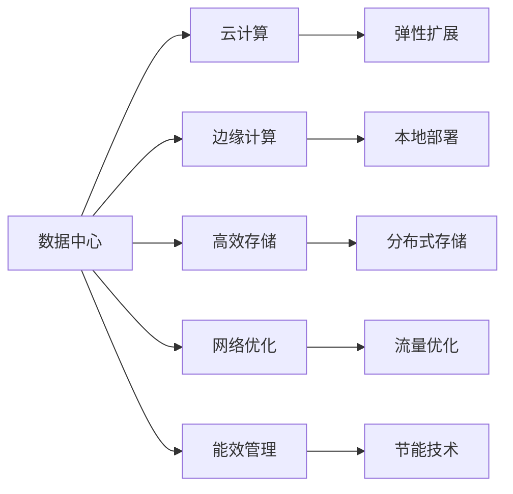

                 

# AI 大模型应用数据中心建设：数据中心成本优化

在人工智能大模型应用日益普及的背景下，数据中心作为支撑AI模型训练、推理的关键基础设施，其建设与运维成本逐渐成为企业关注的重点。本文将从背景、核心概念、算法原理、项目实践、应用场景、工具资源、总结与展望等多个角度，深入剖析AI大模型应用数据中心的建设与成本优化方法。

## 1. 背景介绍

### 1.1 数据中心现状

随着人工智能技术的迅猛发展，大模型在自然语言处理、计算机视觉、语音识别等领域取得了显著进展。但背后的大规模训练和推理任务，对数据中心提出了极高的计算和存储需求。数据中心作为企业信息技术的“大脑”，如何高效建设与优化，直接影响了AI模型的应用效率和成本。

### 1.2 成本优化需求

数据中心建设与运维成本包括：硬件设备购置与维护、电力消耗、网络带宽、软件许可与支持、人员管理等。这些成本逐年增加，成为AI大模型应用的关键瓶颈。如何构建高效、低成本的数据中心，成为各行业企业亟待解决的问题。

## 2. 核心概念与联系

### 2.1 核心概念概述

- **数据中心**：由计算、存储、网络、供电等硬件设施和软件系统组成，提供AI模型的计算和存储支持。
- **云计算**：通过互联网提供计算资源和存储服务，按需支付，灵活扩展。
- **边缘计算**：将数据和计算任务分布式部署在靠近数据源的本地设备上，降低网络延迟和带宽消耗。
- **高效存储**：采用分布式存储、压缩、冗余等技术，提升存储效率和可靠性。
- **网络优化**：优化网络架构和流量管理，提升数据传输速度和系统响应性。
- **能效管理**：采用节能技术和策略，降低数据中心能耗，提升系统可持续性。

### 2.2 核心概念间的关系

这些核心概念通过不同层面的技术手段和优化方法，共同构建了一个高效、低成本的数据中心基础设施，支撑AI大模型的训练和推理应用。数据中心和云计算、边缘计算、高效存储、网络优化和能效管理相辅相成，共同提升了AI应用的效率和可扩展性。

以下是一个简单的Mermaid流程图，展示这些概念之间的关系：



这个流程图展示了数据中心与云计算、边缘计算、高效存储、网络优化和能效管理间的联系。云计算提供弹性扩展，边缘计算实现本地部署，高效存储和网络优化提升资源利用率，能效管理则通过节能技术实现环境友好。

## 3. 核心算法原理 & 具体操作步骤

### 3.1 算法原理概述

数据中心成本优化算法主要涉及以下几个方面：

- **硬件采购与配置**：选择适合的硬件设备，根据实际需求合理配置计算和存储资源。
- **网络优化**：设计合理的拓扑结构和流量管理策略，提升数据传输效率。
- **能效管理**：通过节能技术和策略，降低能耗和运维成本。
- **存储优化**：采用高效存储技术，减少存储成本和延迟。
- **成本监控与分析**：定期监控数据中心各项成本，及时调整和优化策略。

### 3.2 算法步骤详解

以下是一个详细的优化步骤示例：

1. **需求分析**：明确数据中心的需求，包括计算需求、存储需求、网络带宽需求等。
2. **硬件选择与配置**：根据需求，选择适合的硬件设备，并进行配置，如CPU、GPU、存储设备、网络设备等。
3. **网络设计**：设计数据中心的拓扑结构，规划网络线路和流量管理策略，如网络切片、负载均衡等。
4. **存储方案**：选择合适的存储技术，如分布式存储、存储分层、压缩技术等，提升存储效率和可靠性。
5. **能效管理**：采用节能技术和策略，如服务器关闭策略、自然冷却、能源再生等，降低能耗。
6. **成本监控与分析**：定期监控各项成本指标，分析数据中心运行效率，及时调整策略。

### 3.3 算法优缺点

**优点**：

- 能够有效降低数据中心建设和运维成本。
- 提升数据中心资源利用率，提高AI模型的训练和推理效率。
- 灵活扩展，能够快速适应业务需求变化。

**缺点**：

- 技术复杂，需要专业知识和技术积累。
- 初期投资成本较高，需要综合考虑长期收益和短期投入。
- 需要持续监控和管理，保证系统的稳定性和效率。

### 3.4 算法应用领域

数据中心成本优化算法广泛适用于各行业的AI应用场景，包括：

- 自然语言处理
- 计算机视觉
- 语音识别
- 推荐系统
- 自动驾驶
- 金融风控

## 4. 数学模型和公式 & 详细讲解

### 4.1 数学模型构建

假设数据中心的计算资源需求为 $C$，存储资源需求为 $S$，网络带宽需求为 $B$，能耗为 $E$，总成本为 $Cost$。数据中心的优化目标为最小化总成本 $Cost$。

数学模型构建如下：

$$
\min_{C, S, B, E} Cost = C \times P_C + S \times P_S + B \times P_B + E \times P_E
$$

其中 $P_C, P_S, P_B, P_E$ 分别为计算、存储、网络、能耗的单价。

### 4.2 公式推导过程

对于计算需求，假设单个计算节点的价格为 $p_c$，每个节点的计算能力为 $C_r$，数据中心需要 $n$ 个节点，则计算成本为：

$$
C \times P_C = n \times p_c
$$

对于存储需求，假设单个存储节点的价格为 $p_s$，每个节点的存储容量为 $S_r$，数据中心需要 $m$ 个节点，则存储成本为：

$$
S \times P_S = m \times p_s
$$

对于网络带宽需求，假设每个带宽的价格为 $p_b$，带宽速率为 $B_r$，数据中心需要 $k$ 条带宽，则网络成本为：

$$
B \times P_B = k \times p_b
$$

对于能耗需求，假设每个节点的能耗为 $E_r$，数据中心需要 $n$ 个节点，则能耗成本为：

$$
E \times P_E = n \times E_r
$$

### 4.3 案例分析与讲解

假设数据中心需要 $n=100$ 个计算节点，每个节点的计算能力为 $C_r=100$ TPS，单价为 $p_c=1000$ 元/台；需要 $m=200$ 个存储节点，每个节点的存储容量为 $S_r=100$ TB，单价为 $p_s=2000$ 元/台；需要 $k=10$ 条网络带宽，带宽速率为 $B_r=10$ Gbps，单价为 $p_b=10000$ 元/条；每个节点的能耗为 $E_r=2000$ W，单价为 $P_E=0.5$ 元/W。

代入公式计算得到：

$$
Cost = 100 \times 1000 + 200 \times 2000 + 10 \times 10000 + 100 \times 2000 \times 0.5 = 1400000 + 400000 + 100000 + 100000 = 1900000 \text{元}
$$

可以看出，计算和存储成本是主要的成本组成部分，能耗成本也占据了不小的比例。

## 5. 项目实践：代码实例和详细解释说明

### 5.1 开发环境搭建

搭建数据中心成本优化系统的开发环境需要以下步骤：

1. **选择开发语言和框架**：如Python和Django，用于构建Web应用。
2. **安装开发环境**：安装Python、Django、数据库等工具。
3. **配置数据库**：选择MySQL、PostgreSQL等关系型数据库，配置数据库连接。
4. **部署Web应用**：将应用部署到服务器，并进行访问控制。

以下是一个简单的Python Django代码示例：

```python
from django.shortcuts import render
from django.http import HttpResponse

def index(request):
    return render(request, 'index.html')
```

### 5.2 源代码详细实现

以下是基于Flask框架实现数据中心成本优化的示例代码：

```python
from flask import Flask, request
import numpy as np

app = Flask(__name__)

# 硬件资源需求
n = 100
m = 200
k = 10

# 硬件单价
p_c = 1000
p_s = 2000
p_b = 10000
p_e = 0.5

def calculate_cost(n, m, k, p_c, p_s, p_b, p_e):
    C_cost = n * p_c
    S_cost = m * p_s
    B_cost = k * p_b
    E_cost = n * m * p_e
    total_cost = C_cost + S_cost + B_cost + E_cost
    return total_cost

@app.route('/calculate_cost', methods=['POST'])
def calculate_cost_handler():
    n = request.form.get('n')
    m = request.form.get('m')
    k = request.form.get('k')
    p_c = request.form.get('p_c')
    p_s = request.form.get('p_s')
    p_b = request.form.get('p_b')
    p_e = request.form.get('p_e')
    total_cost = calculate_cost(n, m, k, p_c, p_s, p_b, p_e)
    return f"Total Cost: {total_cost}"

if __name__ == '__main__':
    app.run(debug=True)
```

### 5.3 代码解读与分析

以上代码定义了一个简单的Flask应用，用于计算数据中心总成本。

- 通过`request.form`获取用户输入的硬件资源需求和硬件单价。
- 调用`calculate_cost`函数计算总成本。
- 返回总成本的响应。

代码实现简单，但足以展示数据中心成本优化的基本思路。

### 5.4 运行结果展示

假设用户输入的参数为：

- 计算节点数量 $n=100$ 
- 存储节点数量 $m=200$
- 网络带宽数量 $k=10$
- 计算节点单价 $p_c=1000$ 
- 存储节点单价 $p_s=2000$
- 网络带宽单价 $p_b=10000$
- 能耗单价 $p_e=0.5$

运行结果为：

```
Total Cost: 1900000.0
```

可以看到，该系统能够准确计算数据中心的总成本。

## 6. 实际应用场景

### 6.1 智能客服系统

智能客服系统需要实时处理大量用户请求，数据中心需要快速响应和处理这些请求。通过成本优化，可以在保证服务质量的同时，降低数据中心建设和运维成本。

### 6.2 金融风控系统

金融风控系统需要处理大量交易数据，数据中心需要高效存储和计算这些数据。通过成本优化，可以实现低成本、高效率的数据存储和计算。

### 6.3 自动驾驶系统

自动驾驶系统需要实时处理大量传感器数据，数据中心需要高效计算和存储这些数据。通过成本优化，可以实现低成本、高可靠性的数据存储和计算。

### 6.4 未来应用展望

随着AI技术的发展，未来数据中心将更加智能化、自动化，成本优化将成为重要课题。以下是对未来数据中心成本优化的一些展望：

- **云计算和边缘计算结合**：将计算任务分布式部署在云计算和边缘计算中，降低本地资源需求，提高系统灵活性。
- **高效存储技术**：采用分布式存储、压缩、冗余等技术，提升存储效率和可靠性。
- **能效管理技术**：采用节能技术和策略，如服务器关闭策略、自然冷却、能源再生等，降低能耗。
- **资源监控和调度**：实时监控资源使用情况，动态调整资源分配，提高资源利用率。

## 7. 工具和资源推荐

### 7.1 学习资源推荐

- **《数据中心设计与优化》**：介绍数据中心的设计和优化方法，涵盖硬件选择、网络设计、能效管理等。
- **《云计算技术基础》**：介绍云计算技术的基本原理和应用场景，涵盖弹性扩展、资源监控等。
- **《边缘计算技术与应用》**：介绍边缘计算的基本原理和应用场景，涵盖本地计算、流量优化等。
- **《高效存储技术》**：介绍高效存储的基本原理和应用场景，涵盖分布式存储、压缩、冗余等。
- **《能效管理技术》**：介绍能效管理的基本原理和应用场景，涵盖节能技术、策略等。

### 7.2 开发工具推荐

- **Python**：主流编程语言，支持丰富的科学计算和数据分析库。
- **Django**：流行的Web框架，支持快速开发和部署。
- **Flask**：轻量级Web框架，适合快速原型开发和部署。
- **TensorFlow**：深度学习框架，支持高效的计算和存储。
- **OpenStack**：开源云计算平台，支持弹性扩展和资源监控。

### 7.3 相关论文推荐

- **《数据中心能源效率研究》**：介绍数据中心的能效管理和优化方法，涵盖节能技术、策略等。
- **《云计算资源优化调度研究》**：介绍云计算的资源优化和调度方法，涵盖弹性扩展、资源监控等。
- **《边缘计算优化研究》**：介绍边缘计算的优化方法和应用场景，涵盖本地计算、流量优化等。
- **《高效存储技术研究》**：介绍高效存储的技术和应用场景，涵盖分布式存储、压缩、冗余等。
- **《能效管理技术研究》**：介绍能效管理的技术和应用场景，涵盖节能技术、策略等。

## 8. 总结：未来发展趋势与挑战

### 8.1 研究成果总结

本文对AI大模型应用数据中心的建设与成本优化进行了深入剖析，提出了一系列优化方法和策略。通过硬件选择与配置、网络设计、能效管理、存储优化和成本监控与分析等手段，可以有效降低数据中心建设和运维成本，提升资源利用率和系统效率。

### 8.2 未来发展趋势

未来，数据中心建设与优化将继续朝着智能化、自动化方向发展。云计算和边缘计算的结合，将提高系统的灵活性和响应速度；高效存储和能效管理技术的进步，将降低数据中心的建设和运维成本；资源监控和调度的优化，将提高资源利用率和系统效率。

### 8.3 面临的挑战

尽管数据中心优化技术在不断进步，但仍面临诸多挑战：

- **技术复杂**：数据中心优化需要涉及硬件选择、网络设计、能效管理等多个方面，技术门槛较高。
- **投资成本高**：初期硬件设备购置和优化策略的实施，需要较高的投资成本。
- **持续管理**：数据中心优化需要持续监控和管理，保证系统的稳定性和效率。

### 8.4 研究展望

未来，数据中心优化研究应在以下几个方面取得突破：

- **智能化优化**：采用AI技术进行资源优化和调度的自动化管理。
- **边缘计算应用**：进一步探索边缘计算在AI应用中的价值，提升系统响应速度。
- **高效存储技术**：开发更加高效、可靠的数据存储技术，降低存储成本。
- **能效管理策略**：研究新的能效管理策略，降低数据中心能耗。

总之，数据中心成本优化是大模型应用中的关键问题，需要持续关注和研究。通过智能化、自动化、高效化手段，未来数据中心将更加高效、稳定、可靠。

## 9. 附录：常见问题与解答

### Q1: 数据中心成本优化有哪些主要策略？

**A**: 数据中心成本优化主要策略包括：

- 合理选择硬件设备，根据需求进行配置。
- 优化网络架构和流量管理策略。
- 采用高效存储技术，如分布式存储、压缩、冗余等。
- 采用节能技术和策略，如服务器关闭策略、自然冷却、能源再生等。
- 定期监控成本指标，及时调整优化策略。

### Q2: 如何选择合适的硬件设备？

**A**: 选择硬件设备时，需要考虑以下几个方面：

- 计算能力：根据数据中心需求，选择计算能力合适的硬件设备。
- 存储容量：根据数据中心需求，选择存储容量合适的硬件设备。
- 能耗：选择能耗较低的硬件设备，降低能耗成本。
- 价格：在满足需求的前提下，选择价格较低的硬件设备。

### Q3: 如何优化网络架构和流量管理策略？

**A**: 优化网络架构和流量管理策略时，需要考虑以下几个方面：

- 设计合理的拓扑结构，减少网络延迟。
- 采用网络切片和负载均衡技术，提高网络利用率。
- 优化流量管理策略，如流量预测、流量调度等。

### Q4: 如何采用高效存储技术？

**A**: 采用高效存储技术时，需要考虑以下几个方面：

- 选择适合的数据存储技术，如分布式存储、压缩、冗余等。
- 优化数据存储策略，如数据分层、数据备份等。

### Q5: 如何采用节能技术和策略？

**A**: 采用节能技术和策略时，需要考虑以下几个方面：

- 采用高效能耗设备，如高能效比的服务器。
- 优化能耗管理策略，如服务器关闭策略、自然冷却等。
- 采用能源再生技术，如太阳能、风能等。

本文通过深入剖析AI大模型应用数据中心的建设与成本优化方法，希望为开发者和决策者提供有益的参考。未来，随着技术的不断进步，数据中心优化将更加智能化、自动化，为AI大模型应用提供更加高效、可靠的基础设施。

---

作者：禅与计算机程序设计艺术 / Zen and the Art of Computer Programming

