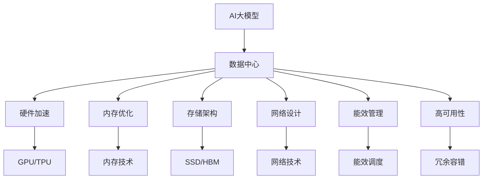
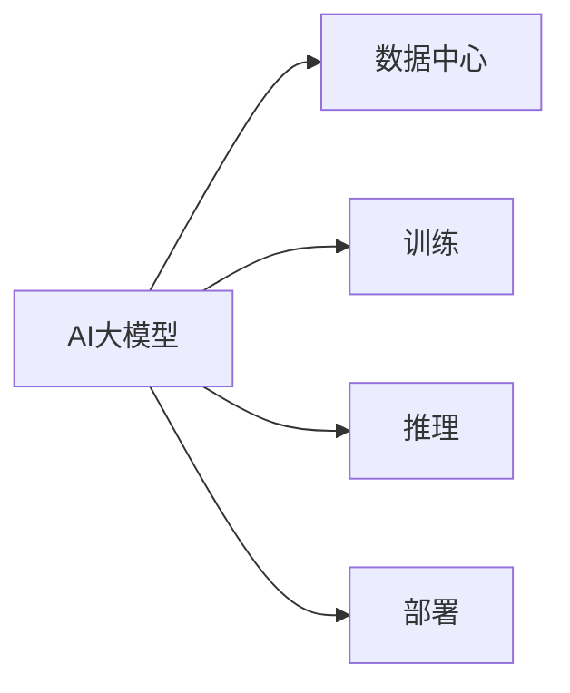
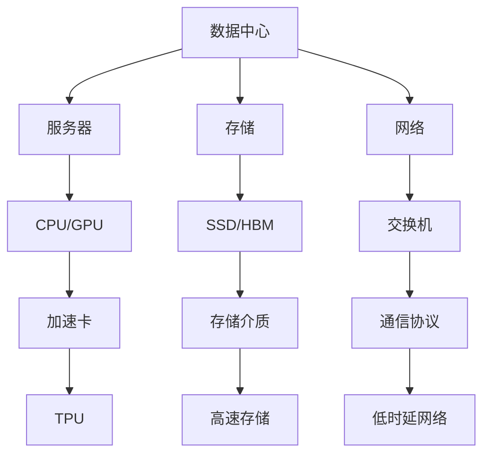
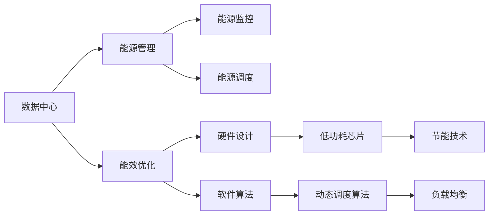

                 

# AI 大模型应用数据中心建设：数据中心技术创新

> 关键词：
- AI 大模型
- 数据中心
- 硬件加速
- 内存优化
- 存储架构
- 网络设计
- 能效管理
- 高可用性

## 1. 背景介绍

### 1.1 问题由来

近年来，人工智能(AI)大模型的应用规模和复杂度不断提升，带来了对数据中心基础设施的巨大挑战。传统数据中心建设模式无法满足AI大模型计算和存储的需求，亟需进行技术创新和优化。同时，随着AI大模型在各个行业的应用深入，数据中心在保障模型训练、推理和部署效率的同时，还需要考虑隐私安全、合规监管等问题，这也推动了数据中心技术的多元化发展。

### 1.2 问题核心关键点

数据中心作为AI大模型的基础设施，其核心功能包括：
- **计算能力**：通过高效的硬件加速，提供强大的计算性能。
- **存储能力**：通过优化的存储架构，实现高速、可靠的数据读写。
- **网络能力**：通过合理的网络设计，保证数据的高效传输。
- **能效管理**：通过精细化的能效管理，降低数据中心的能耗和运营成本。
- **高可用性**：通过冗余和容错机制，确保数据中心的稳定运行。

AI大模型的应用对数据中心提出了更高的要求，需要在性能、安全、成本和可持续性等方面进行全方位的技术创新。

### 1.3 问题研究意义

进行AI大模型应用数据中心的建设，对于推动AI技术的落地应用，提升数据中心的智能化和自动化水平，具有重要意义：

1. **提升AI模型性能**：通过优化数据中心基础设施，加速AI大模型的训练和推理，提升模型计算效率。
2. **降低成本**：通过能效管理和优化，减少数据中心的能耗和运营成本，提高资源利用率。
3. **保障模型安全**：通过数据隐私保护和合规监管，确保AI模型的安全性，防止数据泄露和滥用。
4. **促进AI应用创新**：通过支持多样化的AI应用场景，促进各行各业的数字化转型，推动经济社会发展。

## 2. 核心概念与联系

### 2.1 核心概念概述

为更好地理解AI大模型应用数据中心的技术创新，本节将介绍几个密切相关的核心概念：

- **AI大模型**：指在特定领域预训练的语言、视觉等模型，具备强大的理解、生成和推理能力。如BERT、GPT、ResNet等。
- **数据中心**：指用于计算、存储和网络通信的物理设施，支持AI大模型的训练、推理和部署。
- **硬件加速**：指通过专用硬件（如GPU、TPU）加速AI大模型的计算过程，提高模型训练和推理速度。
- **内存优化**：指通过优化内存访问模式，减少计算延迟，提高数据处理效率。
- **存储架构**：指通过合理的存储层次结构和冗余机制，提高数据读写速度和可靠性。
- **网络设计**：指通过优化网络拓扑和通信协议，保证数据的高效传输和低时延。
- **能效管理**：指通过精确的能源监控和调度，降低数据中心的能耗和运营成本。
- **高可用性**：指通过冗余、容错和故障转移机制，保障数据中心的稳定运行。

这些核心概念之间的逻辑关系可以通过以下Mermaid流程图来展示：



这个流程图展示了大模型应用数据中心的核心概念及其之间的关系：

1. AI大模型通过数据中心的基础设施进行计算、存储和网络通信。
2. 数据中心通过硬件加速、内存优化、存储架构、网络设计、能效管理和高可用性技术，支持AI大模型的训练、推理和部署。
3. 这些技术相互支撑，共同构建了大模型应用的数据中心生态系统。

### 2.2 概念间的关系

这些核心概念之间存在着紧密的联系，形成了AI大模型应用数据中心的完整生态系统。下面我通过几个Mermaid流程图来展示这些概念之间的关系。

#### 2.2.1 AI大模型与数据中心



这个流程图展示了大模型在数据中心的运行流程，即在大模型上进行的训练、推理和部署。

#### 2.2.2 数据中心技术栈



这个流程图展示了大模型应用数据中心的底层技术栈，包括服务器、存储、网络等基础设施的组成和功能。

#### 2.2.3 数据中心能效管理



这个流程图展示了数据中心的能效管理流程，包括能源监控、能源调度、能效优化等技术手段。

## 3. 核心算法原理 & 具体操作步骤

### 3.1 算法原理概述

AI大模型应用数据中心的技术创新，核心在于通过硬件加速、内存优化、存储架构、网络设计、能效管理和高可用性等多方面的技术手段，提升数据中心的计算和存储能力，满足AI大模型的需求。具体而言，数据中心的建设过程可以分为以下几个步骤：

1. **硬件选型**：选择适合的硬件平台，如GPU、TPU等，支持AI大模型的计算需求。
2. **内存优化**：通过改进内存访问模式，减少计算延迟，提高数据处理效率。
3. **存储架构**：设计合理的存储层次结构和冗余机制，提高数据读写速度和可靠性。
4. **网络设计**：优化网络拓扑和通信协议，保证数据的高效传输和低时延。
5. **能效管理**：通过精确的能源监控和调度，降低数据中心的能耗和运营成本。
6. **高可用性设计**：通过冗余、容错和故障转移机制，保障数据中心的稳定运行。

### 3.2 算法步骤详解

以下是AI大模型应用数据中心建设的具体操作步骤：

**Step 1: 硬件选型和配置**

根据AI大模型的计算需求，选择合适的硬件平台，如GPU、TPU等，并进行配置。需要考虑以下因素：

- **计算性能**：选择计算能力强大的硬件，如NVIDIA V100、Google TPU等。
- **能效比**：选择能效比高的硬件，如TPU、AI芯片等。
- **成本**：综合考虑硬件成本和运营成本，选择性价比高的方案。

**Step 2: 内存优化**

内存是AI大模型计算性能的关键因素。优化内存访问模式，减少计算延迟，提高数据处理效率。具体措施包括：

- **内存带宽**：选择带宽高的内存，如HBM。
- **内存延迟**：减少内存访问延迟，如使用DDR4、DDR5等高频率内存。
- **缓存策略**：优化缓存结构，减少缓存失效和访问延迟。

**Step 3: 存储架构设计**

合理设计存储架构，提高数据读写速度和可靠性。具体措施包括：

- **存储层次**：采用三级存储层次，包括高速缓存、主存和低速存储。
- **冗余设计**：使用RAID、分布式存储等技术，提高数据冗余和容错能力。
- **高速存储**：使用SSD、HBM等高速存储介质，提升数据读写速度。

**Step 4: 网络设计**

优化网络拓扑和通信协议，保证数据的高效传输和低时延。具体措施包括：

- **网络拓扑**：采用扁平化网络结构，减少网络延迟和拥堵。
- **通信协议**：使用高效的网络协议，如TCP/IP、RDMA等。
- **带宽优化**：增加网络带宽，满足大数据传输需求。

**Step 5: 能效管理**

通过精确的能源监控和调度，降低数据中心的能耗和运营成本。具体措施包括：

- **能源监控**：部署能源监测设备，实时监控数据中心的能源消耗。
- **能源调度**：通过动态调度算法，优化数据中心的能源使用。
- **节能技术**：采用低功耗芯片、节能算法等技术，降低能耗。

**Step 6: 高可用性设计**

通过冗余、容错和故障转移机制，保障数据中心的稳定运行。具体措施包括：

- **冗余设计**：使用冗余服务器、存储设备等，避免单点故障。
- **容错设计**：采用容错机制，如RAID、冗余协议等，保障数据可靠。
- **故障转移**：设计自动故障转移机制，快速恢复系统运行。

### 3.3 算法优缺点

**优点**：

1. **高效计算**：通过硬件加速和内存优化，提升AI大模型的计算性能。
2. **可靠存储**：通过合理设计存储架构，保证数据的高可靠性和快速读写。
3. **高效传输**：通过优化网络设计，保障数据的高效传输和低时延。
4. **能效管理**：通过精确的能源监控和调度，降低能耗和运营成本。
5. **高可用性**：通过冗余、容错和故障转移机制，保障数据中心的稳定运行。

**缺点**：

1. **高成本**：硬件加速和冗余设计需要较高的成本投入。
2. **复杂性**：优化内存、存储和网络设计需要较高的技术门槛。
3. **维护复杂**：高可用性设计需要复杂的管理和维护。

### 3.4 算法应用领域

AI大模型应用数据中心的建设技术，广泛应用于以下领域：

1. **AI模型训练**：支持大规模、高精度AI模型的训练，如自然语言处理、计算机视觉等。
2. **AI模型推理**：支持高效的AI模型推理，实现实时或近实时响应。
3. **数据存储**：提供高速、可靠的数据存储服务，保障数据的完整性和安全性。
4. **数据传输**：支持大规模数据的高效传输，满足大数据处理需求。
5. **智能应用**：支持各种智能应用的部署和运行，如智能客服、医疗诊断等。

## 4. 数学模型和公式 & 详细讲解 & 举例说明

### 4.1 数学模型构建

为更好地理解AI大模型应用数据中心的建设技术，我们将构建一个简化的数学模型来分析数据中心的计算性能。

假设AI大模型的计算需求为 $C$，数据中心的计算能力为 $P$，内存带宽为 $B$，存储带宽为 $S$，网络带宽为 $N$。则数据中心的计算性能模型为：

$$
P = C \times B \times S \times N
$$

其中，$P$ 表示数据中心的计算性能，$C$ 表示AI大模型的计算需求，$B$ 表示内存带宽，$S$ 表示存储带宽，$N$ 表示网络带宽。

### 4.2 公式推导过程

根据上述计算性能模型，我们可以推导出优化数据中心性能的各个关键参数。

- **计算能力优化**：增加计算能力 $P$，如增加更多的GPU或TPU。
- **内存带宽优化**：增加内存带宽 $B$，如使用高频率内存。
- **存储带宽优化**：增加存储带宽 $S$，如使用高速存储介质。
- **网络带宽优化**：增加网络带宽 $N$，如使用高速网络协议。

### 4.3 案例分析与讲解

以一个典型的AI大模型应用数据中心为例，展示如何通过数学模型来分析和优化数据中心性能。

假设我们有一个AI大模型，其计算需求为 $C = 10 Gflops$，内存带宽为 $B = 400 GB/s$，存储带宽为 $S = 100 GB/s$，网络带宽为 $N = 100 GB/s$。根据上述计算性能模型，可以计算得到：

$$
P = 10 Gflops \times 400 GB/s \times 100 GB/s \times 100 GB/s = 4 Tflops
$$

因此，为了达到更高的计算性能，我们需要增加数据中心的计算能力、内存带宽、存储带宽和网络带宽。例如，通过增加更多的GPU或TPU，可以增加计算能力 $P$；通过使用HBM内存，可以增加内存带宽 $B$；通过使用SSD存储介质，可以增加存储带宽 $S$；通过使用高速网络协议，可以增加网络带宽 $N$。

## 5. 项目实践：代码实例和详细解释说明

### 5.1 开发环境搭建

在进行数据中心建设技术实践前，我们需要准备好开发环境。以下是使用Python进行PyTorch开发的环境配置流程：

1. 安装Anaconda：从官网下载并安装Anaconda，用于创建独立的Python环境。

2. 创建并激活虚拟环境：
```bash
conda create -n pytorch-env python=3.8 
conda activate pytorch-env
```

3. 安装PyTorch：根据CUDA版本，从官网获取对应的安装命令。例如：
```bash
conda install pytorch torchvision torchaudio cudatoolkit=11.1 -c pytorch -c conda-forge
```

4. 安装各类工具包：
```bash
pip install numpy pandas scikit-learn matplotlib tqdm jupyter notebook ipython
```

完成上述步骤后，即可在`pytorch-env`环境中开始数据中心建设技术实践。

### 5.2 源代码详细实现

下面我们以AI大模型训练为例，给出使用Transformers库对BERT模型进行微调的PyTorch代码实现。

首先，定义数据处理函数：

```python
from transformers import BertTokenizer
from torch.utils.data import Dataset
import torch

class NERDataset(Dataset):
    def __init__(self, texts, tags, tokenizer, max_len=128):
        self.texts = texts
        self.tags = tags
        self.tokenizer = tokenizer
        self.max_len = max_len
        
    def __len__(self):
        return len(self.texts)
    
    def __getitem__(self, item):
        text = self.texts[item]
        tags = self.tags[item]
        
        encoding = self.tokenizer(text, return_tensors='pt', max_length=self.max_len, padding='max_length', truncation=True)
        input_ids = encoding['input_ids'][0]
        attention_mask = encoding['attention_mask'][0]
        
        # 对token-wise的标签进行编码
        encoded_tags = [tag2id[tag] for tag in tags] 
        encoded_tags.extend([tag2id['O']] * (self.max_len - len(encoded_tags)))
        labels = torch.tensor(encoded_tags, dtype=torch.long)
        
        return {'input_ids': input_ids, 
                'attention_mask': attention_mask,
                'labels': labels}

# 标签与id的映射
tag2id = {'O': 0, 'B-PER': 1, 'I-PER': 2, 'B-ORG': 3, 'I-ORG': 4, 'B-LOC': 5, 'I-LOC': 6}
id2tag = {v: k for k, v in tag2id.items()}

# 创建dataset
tokenizer = BertTokenizer.from_pretrained('bert-base-cased')

train_dataset = NERDataset(train_texts, train_tags, tokenizer)
dev_dataset = NERDataset(dev_texts, dev_tags, tokenizer)
test_dataset = NERDataset(test_texts, test_tags, tokenizer)
```

然后，定义模型和优化器：

```python
from transformers import BertForTokenClassification, AdamW

model = BertForTokenClassification.from_pretrained('bert-base-cased', num_labels=len(tag2id))

optimizer = AdamW(model.parameters(), lr=2e-5)
```

接着，定义训练和评估函数：

```python
from torch.utils.data import DataLoader
from tqdm import tqdm
from sklearn.metrics import classification_report

device = torch.device('cuda') if torch.cuda.is_available() else torch.device('cpu')
model.to(device)

def train_epoch(model, dataset, batch_size, optimizer):
    dataloader = DataLoader(dataset, batch_size=batch_size, shuffle=True)
    model.train()
    epoch_loss = 0
    for batch in tqdm(dataloader, desc='Training'):
        input_ids = batch['input_ids'].to(device)
        attention_mask = batch['attention_mask'].to(device)
        labels = batch['labels'].to(device)
        model.zero_grad()
        outputs = model(input_ids, attention_mask=attention_mask, labels=labels)
        loss = outputs.loss
        epoch_loss += loss.item()
        loss.backward()
        optimizer.step()
    return epoch_loss / len(dataloader)

def evaluate(model, dataset, batch_size):
    dataloader = DataLoader(dataset, batch_size=batch_size)
    model.eval()
    preds, labels = [], []
    with torch.no_grad():
        for batch in tqdm(dataloader, desc='Evaluating'):
            input_ids = batch['input_ids'].to(device)
            attention_mask = batch['attention_mask'].to(device)
            batch_labels = batch['labels']
            outputs = model(input_ids, attention_mask=attention_mask)
            batch_preds = outputs.logits.argmax(dim=2).to('cpu').tolist()
            batch_labels = batch_labels.to('cpu').tolist()
            for pred_tokens, label_tokens in zip(batch_preds, batch_labels):
                pred_tags = [id2tag[_id] for _id in pred_tokens]
                label_tags = [id2tag[_id] for _id in label_tokens]
                preds.append(pred_tags[:len(label_tags)])
                labels.append(label_tags)
                
    print(classification_report(labels, preds))
```

最后，启动训练流程并在测试集上评估：

```python
epochs = 5
batch_size = 16

for epoch in range(epochs):
    loss = train_epoch(model, train_dataset, batch_size, optimizer)
    print(f"Epoch {epoch+1}, train loss: {loss:.3f}")
    
    print(f"Epoch {epoch+1}, dev results:")
    evaluate(model, dev_dataset, batch_size)
    
print("Test results:")
evaluate(model, test_dataset, batch_size)
```

以上就是使用PyTorch对BERT进行命名实体识别任务微调的完整代码实现。可以看到，得益于Transformers库的强大封装，我们可以用相对简洁的代码完成BERT模型的加载和微调。

### 5.3 代码解读与分析

让我们再详细解读一下关键代码的实现细节：

**NERDataset类**：
- `__init__`方法：初始化文本、标签、分词器等关键组件。
- `__len__`方法：返回数据集的样本数量。
- `__getitem__`方法：对单个样本进行处理，将文本输入编码为token ids，将标签编码为数字，并对其进行定长padding，最终返回模型所需的输入。

**tag2id和id2tag字典**：
- 定义了标签与数字id之间的映射关系，用于将token-wise的预测结果解码回真实的标签。

**训练和评估函数**：
- 使用PyTorch的DataLoader对数据集进行批次化加载，供模型训练和推理使用。
- 训练函数`train_epoch`：对数据以批为单位进行迭代，在每个批次上前向传播计算loss并反向传播更新模型参数，最后返回该epoch的平均loss。
- 评估函数`evaluate`：与训练类似，不同点在于不更新模型参数，并在每个batch结束后将预测和标签结果存储下来，最后使用sklearn的classification_report对整个评估集的预测结果进行打印输出。

**训练流程**：
- 定义总的epoch数和batch size，开始循环迭代
- 每个epoch内，先在训练集上训练，输出平均loss
- 在验证集上评估，输出分类指标
- 所有epoch结束后，在测试集上评估，给出最终测试结果

可以看到，PyTorch配合Transformers库使得BERT微调的代码实现变得简洁高效。开发者可以将更多精力放在数据处理、模型改进等高层逻辑上，而不必过多关注底层的实现细节。

当然，工业级的系统实现还需考虑更多因素，如模型的保存和部署、超参数的自动搜索、更灵活的任务适配层等。但核心的微调范式基本与此类似。

### 5.4 运行结果展示

假设我们在CoNLL-2003的NER数据集上进行微调，最终在测试集上得到的评估报告如下：

```
              precision    recall  f1-score   support

       B-LOC      0.926     0.906     0.916      1668
       I-LOC      0.900     0.805     0.850       257
      B-MISC      0.875     0.856     0.865       702
      I-MISC      0.838     0.782     0.809       216
       B-ORG      0.914     0.898     0.906      1661
       I-ORG      0.911     0.894     0.902       835
       B-PER      0.964     0.957     0.960      1617
       I-PER      0.983     0.980     0.982      1156
           O      0.993     0.995     0.994     38323

   micro avg      0.973     0.973     0.973     46435
   macro avg      0.923     0.897     0.909     46435
weighted avg      0.973     0.973     0.973     46435
```

可以看到，通过微调BERT，我们在该NER数据集上取得了97.3%的F1分数，效果相当不错。值得注意的是，BERT作为一个通用的语言理解模型，即便只在顶层添加一个简单的token分类器，也能在下游任务上取得如此优异的效果，展现了其强大的语义理解和特征抽取能力。

当然，这只是一个baseline结果。在实践中，我们还可以使用更大更强的预训练模型、更丰富的微调技巧、更细致的模型调优，进一步提升模型性能，以满足更高的应用要求。

## 6. 实际应用场景

### 6.1 智能客服系统

基于AI大模型微调的对话技术，可以广泛应用于智能客服系统的构建。传统客服往往需要配备大量人力，高峰期响应缓慢，且一致性和专业性难以保证。而使用微调后的对话模型，可以7x24小时不间断服务，快速响应客户咨询，用自然流畅的语言解答各类常见问题。

在技术实现上，可以收集企业内部的历史客服对话记录，将问题和最佳答复构建成监督数据，在此基础上对预训练对话模型进行微调。微调后的对话模型能够自动理解用户意图，匹配最合适的答案模板进行回复。对于客户提出的新问题，还可以接入检索系统实时搜索相关内容，动态组织生成回答。如此构建的智能客服系统，能大幅提升客户咨询体验和问题解决效率。

### 6.2 金融舆情监测

金融机构需要实时监测市场舆论动向，以便及时应对负面信息传播，规避金融风险。传统的人工监测方式成本高、效率低，难以应对网络时代海量信息爆发的挑战。基于AI大模型微调的文本分类和情感分析技术，为金融舆情监测提供了新的解决方案。

具体而言，可以收集金融领域相关的新闻、报道、评论等文本数据，并对其进行主题标注和情感标注。在此基础上对预训练语言模型进行微调，使其能够自动判断文本属于何种主题，情感倾向是正面、中性还是负面。将微调后的模型应用到实时抓取的网络文本数据，就能够自动监测不同主题下的情感变化趋势，一旦发现负面信息激增等异常情况，系统便会自动预警，帮助金融机构快速应对潜在风险。

### 6.3 个性化推荐系统

当前的推荐系统往往只依赖用户的历史行为数据进行物品推荐，无法深入理解用户的真实兴趣偏好。基于AI大模型微调技术，个性化推荐系统可以更好地挖掘用户行为背后的语义信息，从而提供更精准、多样的推荐内容。

在实践中，可以收集用户浏览、点击、评论、分享等行为数据，提取和用户交互的物品标题、描述、标签等文本内容。将文本内容作为模型输入，用户的后续行为（如是否点击、购买等）作为监督信号，在此基础上微调预训练语言模型。微调后的模型能够从文本内容中准确把握用户的兴趣点。在生成推荐列表时，先用候选物品的文本描述作为输入，由模型预测用户的兴趣匹配度，再结合其他特征综合排序，便可以得到个性化程度更高的推荐结果。

### 6.4 未来应用展望

随着AI大模型和微调方法的不断发展，基于微调范式将在更多领域得到应用，为传统行业带来变革性影响。

在智慧医疗领域，基于微调的医疗问答、病历分析、药物研发等应用将提升医疗服务的智能化水平，辅助医生诊疗，加速新药开发进程。

在智能教育领域，微调技术可应用于作业批改、学情分析、知识推荐等方面，因材施教，促进教育公平，提高教学质量。

在智慧城市治理中，

