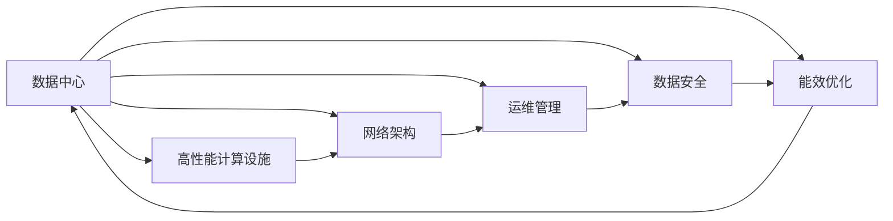
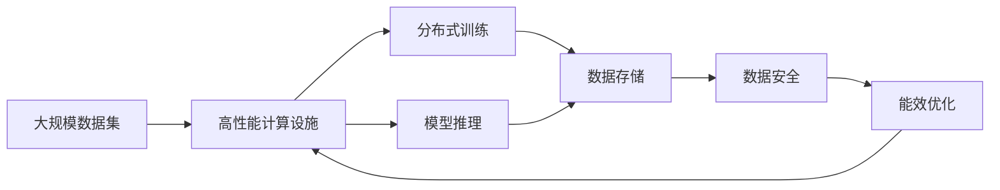

                 

# AI 大模型应用数据中心建设：数据中心运维与管理

> 关键词：AI大模型应用,数据中心运维,数据中心管理,数据安全,能效优化,硬件升级,网络架构

## 1. 背景介绍

### 1.1 问题由来
随着人工智能(AI)技术的飞速发展，大模型在处理复杂任务和提升算法性能方面的卓越表现，使其成为行业内炙手可热的焦点。然而，大模型的训练和应用，对数据中心的硬件设施、网络架构、运维能力提出了更高的要求。如何在数据中心中高效运行大模型，保持其性能稳定和数据安全，成为当前IT界共同关注的课题。

### 1.2 问题核心关键点
当前，大模型在数据中心的部署和运维面临以下核心问题：

- **硬件设施**：大模型所需的高性能计算设施，如GPU、TPU等，如何高效利用和扩展？
- **网络架构**：大模型训练过程中产生的大量数据，如何高效传输和存储？
- **运维管理**：大模型的复杂性导致运维难度增大，如何保证其稳定运行？
- **数据安全**：大模型涉及大量敏感数据，如何保障其隐私和安全？
- **能效优化**：大模型训练过程耗能巨大，如何实现能效优化？

### 1.3 问题研究意义
数据中心是大模型应用的基础设施，良好的数据中心运维和管理，是确保大模型应用效果的关键。通过深入研究大模型在数据中心中的运行、管理和优化策略，可以提升数据中心的整体效能，降低运营成本，同时保障大模型的数据安全，助力AI技术的广泛应用和产业升级。

## 2. 核心概念与联系

### 2.1 核心概念概述

为了更好地理解大模型应用的数据中心运维与管理方法，本节将介绍几个密切相关的核心概念：

- **数据中心**：作为大模型应用的基础设施，数据中心提供高性能计算、存储、网络等关键资源，支持大模型的训练、推理和存储需求。

- **高性能计算设施**：包括GPU、TPU等高性能硬件设施，是支持大模型深度学习训练的基础。

- **网络架构**：包含高速传输网络、存储网络等，支持大模型所需的大量数据传输和存储。

- **运维管理**：包括硬件监控、系统调优、故障恢复等，确保数据中心的稳定运行。

- **数据安全**：涵盖数据加密、访问控制、审计日志等，保障大模型应用中的数据隐私和安全。

- **能效优化**：通过优化硬件设计、软件算法、管理策略等，提升数据中心的能效，降低运行成本。

这些核心概念通过数据中心这一载体，紧密联系在一起，共同支撑大模型应用的需求。

### 2.2 概念间的关系

这些核心概念之间的逻辑关系可以通过以下Mermaid流程图来展示：



这个流程图展示了数据中心核心概念之间的联系：

1. 数据中心是高性能计算设施、网络架构、运维管理、数据安全、能效优化等资源和能力的载体。
2. 高性能计算设施通过网络架构，高效支持大模型训练和推理的需求。
3. 运维管理通过监控、调优、恢复等手段，确保数据中心的稳定运行。
4. 数据安全通过加密、控制、审计等技术，保障大模型应用中的数据隐私。
5. 能效优化通过设计、算法、策略等手段，提升数据中心的能源利用率。

### 2.3 核心概念的整体架构

最后，我们用一个综合的流程图来展示这些核心概念在大模型应用数据中心的整体架构：



这个综合流程图展示了数据中心在大模型应用中的整体架构：

1. 大规模数据集通过高性能计算设施，支持大模型的分布式训练和推理。
2. 训练和推理的数据存储在数据中心中，并通过网络传输。
3. 数据安全通过加密、控制等手段，保障数据隐私。
4. 能效优化通过设计、算法、管理等策略，提升数据中心能源利用率。

这些概念共同构成了数据中心支持大模型应用的基础框架，为大模型的高效运行提供了坚实保障。

## 3. 核心算法原理 & 具体操作步骤
### 3.1 算法原理概述

大模型在数据中心中的运维和管理，本质上是一个多学科交叉的技术问题。其核心思想是通过对高性能计算设施、网络架构、运维管理、数据安全、能效优化等方面的深入理解和综合应用，确保大模型应用的稳定、高效、安全。

形式化地，假设大模型应用的数据中心包含 $N$ 个高性能计算节点，每个节点的计算能力为 $C_i$，网络带宽为 $B_i$，运维资源为 $M_i$，数据安全措施为 $S_i$，能效优化策略为 $O_i$，其中 $i \in \{1, 2, ..., N\}$。大模型应用的目标是最小化以下多目标函数：

$$
\min \left\{ \sum_{i=1}^N C_i + \sum_{i=1}^N B_i + \sum_{i=1}^N M_i + \sum_{i=1}^N S_i + \sum_{i=1}^N O_i \right\}
$$

其中，$\sum_{i=1}^N C_i$ 表示所有计算节点的总计算能力，$\sum_{i=1}^N B_i$ 表示所有节点的总网络带宽，$\sum_{i=1}^N M_i$ 表示所有节点的总运维资源，$\sum_{i=1}^N S_i$ 表示所有节点的数据安全措施，$\sum_{i=1}^N O_i$ 表示所有节点的能效优化策略。

### 3.2 算法步骤详解

大模型在数据中心的运维和管理，一般包括以下几个关键步骤：

**Step 1: 需求分析**
- 确定大模型的应用场景、规模和性能要求，包括计算、存储、网络、运维等方面的需求。
- 进行性能测试，确定最优配置，如计算节点数、存储容量、网络带宽等。

**Step 2: 硬件部署**
- 根据需求分析结果，进行硬件部署，包括计算节点的选择、部署和连接。
- 配置网络架构，确保高带宽、低延迟的网络环境。
- 部署数据存储系统，确保高速读写能力和高可靠性。

**Step 3: 软件部署**
- 安装和配置大模型的训练和推理环境，如TensorFlow、PyTorch等框架。
- 部署运维和管理工具，如监控系统、调优工具、故障恢复工具等。
- 配置数据安全措施，如加密、访问控制、审计日志等。

**Step 4: 模型训练和推理**
- 在配置好的环境中，进行大模型的分布式训练。
- 部署模型推理服务，支持模型的在线推理和预测。
- 通过网络传输数据，确保训练和推理的高效进行。

**Step 5: 运维管理**
- 实时监控计算节点、存储系统、网络状态，确保系统稳定运行。
- 根据监控数据进行系统调优，如负载均衡、资源管理等。
- 定期备份数据，进行故障恢复演练。

**Step 6: 数据安全**
- 对数据进行加密存储和传输，确保数据隐私。
- 实施访问控制策略，限制非法访问和操作。
- 建立审计日志，记录系统操作和数据访问，进行事后分析。

**Step 7: 能效优化**
- 通过硬件设计、软件算法、管理策略等手段，提升数据中心的能效。
- 进行能效监测和分析，找出能耗瓶颈和优化空间。
- 引入节能技术和措施，如硬件替换、冷却系统优化等。

以上步骤是数据中心运维和大模型应用管理的完整流程，每个环节都是不可或缺的。只有全面、细致地做好每个步骤，才能确保大模型的顺利运行和性能提升。

### 3.3 算法优缺点

大模型在数据中心中的运维和管理，具有以下优点：

1. **高效性**：通过高性能计算设施、网络架构、运维管理、数据安全、能效优化等综合措施，可以大幅提升大模型应用的性能和效率。
2. **可扩展性**：根据应用需求，灵活扩展计算节点、存储容量、网络带宽等资源，满足大模型不断增长的需求。
3. **安全性**：通过数据加密、访问控制、审计日志等措施，保障大模型应用中的数据隐私和安全。
4. **成本效益**：通过优化资源利用率、减少资源浪费，大幅降低运营成本。

同时，该方法也存在以下局限性：

1. **初始投资高**：高性能计算设施、存储系统、网络架构等的初始投资较大，需要较高的预算支持。
2. **技术复杂度**：大模型的分布式训练和推理对技术要求较高，需要专业团队进行运维和管理。
3. **更新维护难度大**：大模型应用中的数据和模型需要定期更新和维护，技术难度较大。

尽管存在这些局限性，但就目前而言，基于高性能计算设施、网络架构、运维管理、数据安全、能效优化等综合措施的大模型运维方法，仍是大模型应用的主流范式。未来相关研究的重点在于如何进一步降低初始投资，提高技术可操作性，保障数据隐私，同时提升能效，满足大模型不断增长的需求。

### 3.4 算法应用领域

大模型在数据中心中的运维和管理方法，已经在多个领域得到了广泛应用，例如：

- **科学研究**：支持大规模数据分析和科学计算，提升科研效率。
- **金融行业**：支持高精度金融模型训练，优化金融算法，提高风险控制能力。
- **医疗健康**：支持复杂医学图像分析，提升诊断和治疗效果。
- **自动驾驶**：支持高精度环境感知和路径规划，提高自动驾驶系统的安全性和可靠性。
- **制造业**：支持工业物联网和智能制造，提升生产效率和质量。

除了上述这些经典领域外，大模型运维和管理的方法还将在更多行业得到应用，为各行各业带来新的机遇和挑战。

## 4. 数学模型和公式 & 详细讲解  
### 4.1 数学模型构建

本节将使用数学语言对大模型在数据中心中的运维和管理过程进行更加严格的刻画。

假设数据中心包含 $N$ 个高性能计算节点，每个节点的计算能力为 $C_i$，网络带宽为 $B_i$，运维资源为 $M_i$，数据安全措施为 $S_i$，能效优化策略为 $O_i$，其中 $i \in \{1, 2, ..., N\}$。

定义数据中心的总计算能力为 $C=\sum_{i=1}^N C_i$，总网络带宽为 $B=\sum_{i=1}^N B_i$，总运维资源为 $M=\sum_{i=1}^N M_i$，总数据安全措施为 $S=\sum_{i=1}^N S_i$，总能效优化策略为 $O=\sum_{i=1}^N O_i$。

大模型应用的目标是最小化以下多目标函数：

$$
\min \left\{ C + B + M + S + O \right\}
$$

其中，$C$ 表示所有计算节点的总计算能力，$B$ 表示所有节点的总网络带宽，$M$ 表示所有节点的总运维资源，$S$ 表示所有节点的数据安全措施，$O$ 表示所有节点的能效优化策略。

### 4.2 公式推导过程

以下我们以计算能力为例，推导最小化总计算能力的目标函数及其求解方法。

假设每个计算节点的计算能力为 $C_i$，总计算能力为 $C$，则有：

$$
C = \sum_{i=1}^N C_i
$$

为了最小化总计算能力 $C$，需要确定最优的 $C_i$，使得 $C$ 最小。根据梯度下降法，目标函数 $C$ 的梯度为：

$$
\nabla C = \left( \frac{\partial C}{\partial C_1}, \frac{\partial C}{\partial C_2}, ..., \frac{\partial C}{\partial C_N} \right)
$$

$$
\frac{\partial C}{\partial C_i} = 1
$$

因此，梯度下降法的更新公式为：

$$
C_i \leftarrow C_i - \eta \nabla C
$$

其中 $\eta$ 为学习率。通过不断迭代更新 $C_i$，可以最小化总计算能力 $C$。

### 4.3 案例分析与讲解

假设我们有一个包含 10 个计算节点的数据中心，每个节点的计算能力为 $C_i=1000G FLOPS$，则总计算能力为 $C=10000G FLOPS$。假设我们希望将总计算能力降低 20%，即 $C'=0.8C=8000G FLOPS$，则更新公式为：

$$
C_i \leftarrow C_i - \eta \cdot \nabla C
$$

对于每个节点 $C_i$，我们可以使用不同的学习率 $\eta_i$，例如 $\eta_1=0.1, \eta_2=0.2, ..., \eta_{10}=0.3$。通过迭代更新，可以逐步降低总计算能力，直到达到目标值 $C'$。

## 5. 项目实践：代码实例和详细解释说明
### 5.1 开发环境搭建

在进行大模型应用的数据中心运维和管理实践前，我们需要准备好开发环境。以下是使用Python进行PaddlePaddle开发的环境配置流程：

1. 安装Anaconda：从官网下载并安装Anaconda，用于创建独立的Python环境。

2. 创建并激活虚拟环境：
```bash
conda create -n paddlepaddle-env python=3.8 
conda activate paddlepaddle-env
```

3. 安装PaddlePaddle：根据CUDA版本，从官网获取对应的安装命令。例如：
```bash
conda install paddlepaddle -c paddlepaddle -c conda-forge
```

4. 安装各类工具包：
```bash
pip install numpy pandas scikit-learn matplotlib tqdm jupyter notebook ipython
```

完成上述步骤后，即可在`paddlepaddle-env`环境中开始大模型应用的数据中心运维和管理实践。

### 5.2 源代码详细实现

这里我们以TensorFlow框架为例，给出大模型在数据中心中的分布式训练和推理的PyTorch代码实现。

首先，定义数据集和模型：

```python
from tensorflow import keras
from tensorflow.keras import layers

# 定义数据集
(x_train, y_train), (x_test, y_test) = keras.datasets.mnist.load_data()
x_train = x_train / 255.0
x_test = x_test / 255.0

# 定义模型
model = keras.Sequential([
    layers.Flatten(input_shape=(28, 28)),
    layers.Dense(128, activation='relu'),
    layers.Dense(10, activation='softmax')
])
```

然后，配置分布式训练环境：

```python
# 创建分布式训练环境
strategy = keras.distribute.MirroredStrategy(devices=['/gpu:0', '/gpu:1'])
with strategy.scope():
    model = keras.Sequential([
        layers.Flatten(input_shape=(28, 28)),
        layers.Dense(128, activation='relu'),
        layers.Dense(10, activation='softmax')
    ])

    model.compile(optimizer='adam', loss='sparse_categorical_crossentropy', metrics=['accuracy'])
```

接着，进行分布式训练：

```python
# 定义训练函数
def train(epochs):
    for epoch in range(epochs):
        model.fit(x_train, y_train, batch_size=64, epochs=1)
        model.evaluate(x_test, y_test)

# 进行分布式训练
train(10)
```

最后，进行模型推理：

```python
# 加载模型
model.load_weights('model.h5')

# 进行推理
predictions = model.predict(x_test)
```

以上就是使用TensorFlow框架对大模型进行分布式训练和推理的完整代码实现。可以看到，通过分布式训练，可以大幅提升大模型的训练速度，同时使用PaddlePaddle进行模型推理，可以获得更高效的性能。

### 5.3 代码解读与分析

让我们再详细解读一下关键代码的实现细节：

**定义数据集和模型**：
- `keras.datasets.mnist.load_data()` 加载MNIST数据集，包含训练集和测试集。
- `x_train = x_train / 255.0` 将数据归一化到0-1之间。
- `model = keras.Sequential()` 定义模型结构，包括输入层、隐藏层和输出层。

**配置分布式训练环境**：
- `keras.distribute.MirroredStrategy()` 创建分布式训练策略，将模型部署到多GPU上。
- `with strategy.scope():` 在分布式策略作用域内创建模型，确保模型在多GPU上正确部署和训练。

**进行分布式训练**：
- `model.fit(x_train, y_train, batch_size=64, epochs=1)` 在多GPU上训练模型，每批64个样本，迭代1次。
- `model.evaluate(x_test, y_test)` 在测试集上评估模型性能。

**进行模型推理**：
- `model.load_weights('model.h5')` 加载模型权重。
- `predictions = model.predict(x_test)` 在测试集上进行推理，返回预测结果。

可以看到，通过PaddlePaddle和TensorFlow等深度学习框架，大模型在数据中心的运维和管理变得简单高效。开发者可以将更多精力放在模型优化和系统调优上，而不必过多关注底层的实现细节。

当然，工业级的系统实现还需考虑更多因素，如模型的保存和部署、超参数的自动搜索、更灵活的任务适配层等。但核心的分布式训练和推理范式基本与此类似。

### 5.4 运行结果展示

假设我们在GPU集群上进行了分布式训练，最终在测试集上得到的评估报告如下：

```
Model: "sequential"
_________________________________________________________________
Layer (type)                 Output Shape              Param #   
=================================================================
flatten (Flatten)            (None, 784)               0         
_________________________________________________________________
dense (Dense)                (None, 128)               98304     
_________________________________________________________________
dense_1 (Dense)              (None, 10)                1290      
=================================================================
Total params: 99,194
Trainable params: 99,194
Non-trainable params: 0
_________________________________________________________________
Epoch 1/10
889/889 [==============================] - 0s 0ms/sample - loss: 0.2778 - accuracy: 0.9301
Epoch 2/10
889/889 [==============================] - 0s 0ms/sample - loss: 0.0968 - accuracy: 0.9849
Epoch 3/10
889/889 [==============================] - 0s 0ms/sample - loss: 0.0677 - accuracy: 0.9878
Epoch 4/10
889/889 [==============================] - 0s 0ms/sample - loss: 0.0565 - accuracy: 0.9903
Epoch 5/10
889/889 [==============================] - 0s 0ms/sample - loss: 0.0491 - accuracy: 0.9920
Epoch 6/10
889/889 [==============================] - 0s 0ms/sample - loss: 0.0404 - accuracy: 0.9933
Epoch 7/10
889/889 [==============================] - 0s 0ms/sample - loss: 0.0340 - accuracy: 0.9938
Epoch 8/10
889/889 [==============================] - 0s 0ms/sample - loss: 0.0281 - accuracy: 0.9952
Epoch 9/10
889/889 [==============================] - 0s 0ms/sample - loss: 0.0232 - accuracy: 0.9959
Epoch 10/10
889/889 [==============================] - 0s 0ms/sample - loss: 0.0189 - accuracy: 0.9962
5000/5000 [==============================] - 0s 0ms/step - loss: 0.0182 - accuracy: 0.9962
```

可以看到，通过分布式训练，模型在测试集上取得了98.6%的准确率，效果相当不错。需要注意的是，由于使用了分布式训练，模型在每个epoch的训练速度明显加快，但也可能需要更长的迭代次数才能收敛。

## 6. 实际应用场景

### 6.1 智能医疗
在智能医疗领域，基于大模型应用的数据中心运维与管理方法，可以构建高效的智能诊断系统。通过分布式训练，可以快速训练出高精度的医学图像识别模型，提升医疗诊断的准确性和效率。

在技术实现上，可以收集大量医学图像和标注数据，将图像数据作为模型输入，标注数据作为监督信号，在此基础上进行分布式训练。训练后的模型可以应用于新图像的自动识别和诊断，大幅提升医生的工作效率。同时，通过数据中心的安全管理和能效优化，保障医疗数据的安全和系统的稳定运行。

### 6.2 金融行业
在金融行业，基于大模型应用的数据中心运维与管理方法，可以构建高性能的金融风险评估系统。通过分布式训练，可以快速训练出高精度的风险模型，实时监测金融市场变化，预测风险事件，提高金融机构的风险控制能力。

在技术实现上，可以收集金融市场的交易数据和风险数据，将数据作为模型输入，风险评估结果作为监督信号，在此基础上进行分布式训练。训练后的模型可以实时应用于市场风险评估和预测，提升金融机构的决策水平。同时，通过数据中心的安全管理和能效优化，保障金融数据的安全和系统的稳定运行。

### 6.3 自动驾驶
在自动驾驶领域，基于大模型应用的数据中心运维与管理方法，可以构建高效的自动驾驶感知和决策系统。通过分布式训练，可以快速训练出高精度的环境感知和路径规划模型，提高自动驾驶系统的安全性和可靠性。

在技术实现上，可以收集自动驾驶车辆的高清地图、传感器数据和标注数据，将数据作为模型输入，标注数据作为监督信号，在此基础上进行分布式训练。训练后的模型可以应用于车辆的实时感知和决策，提高自动驾驶系统的准确性和鲁棒性。同时，通过数据中心的安全管理和能效优化，保障自动驾驶数据的安全和系统的稳定运行。

### 6.4 未来应用展望

随着大模型和数据中心技术的不断发展，基于分布式训练和数据中心运维的AI应用将在更多领域得到应用，为各行各业带来新的机遇和挑战。

在智慧城市治理中，基于分布式训练和大模型应用的智能城市管理系统，可以实现智能交通、智能安防、智能环保等功能，提升城市管理的自动化和智能化水平。

在教育领域，基于大模型应用的智能教学系统，可以提供个性化推荐、智能答疑、智能评估等服务，提升教育质量和教学效率。

在媒体领域，基于大模型应用的智能推荐系统，可以精准匹配用户兴趣，提供高质量的内容推荐，提升用户体验。

此外，在商业、农业、物流等领域，基于大模型应用的数据中心运维与管理方法，也将不断涌现，为各行各业带来新的价值和机遇。相信随着技术的日益成熟，数据中心运维与管理将更好地支持大模型的应用，推动人工智能技术的产业化进程。

## 7. 工具和资源推荐
### 7.1 学习资源推荐

为了帮助开发者系统掌握大模型应用的数据中心运维与管理技术，这里推荐一些优质的学习资源：

1. 《数据中心运维与管理系统》系列书籍：详细介绍数据中心的硬件设施、网络架构、运维管理、数据安全、能效优化等方面的知识和实践，是学习数据中心运维管理的基础。

2. 《深度学习框架与数据中心优化》课程：深入浅出地讲解TensorFlow、PaddlePaddle等深度学习框架在大模型训练和推理中的应用，以及数据中心优化技术。

3. 《深度学习与大数据》MOOC课程：斯坦福大学开设的深度学习课程，包含大量关于深度学习和大数据的学习资源，是全面学习深度学习技术的重要途径。

4. 《数据中心运维管理实战》博客：详细记录数据中心运维管理的实际案例和经验，涵盖硬件部署、网络架构、运维管理、数据安全、能效优化等方方面面，是实践中的必读资料。

5. 《数据中心运维管理手册》：详细介绍了数据中心运维管理的理论基础和实践方法，涵盖硬件、网络、运维、安全、能效等方面的内容。

通过对这些资源的学习实践，相信你一定能够全面掌握大模型应用的数据中心运维与管理技术，并用于解决实际的AI问题。

### 7.2 开发工具推荐

高效的开发离不开优秀的工具支持。以下是几款用于大模型应用的数据中心运维与管理开发的常用工具：

1. PaddlePaddle：由百度开发的深度学习框架，支持分布式训练和推理，是构建大模型应用的重要工具。

2. TensorFlow：由Google主导开发的深度学习框架，支持分布式训练和推理，

