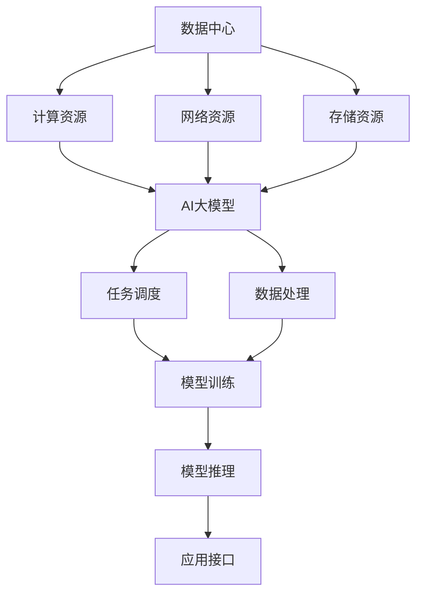

                 

# AI 大模型应用数据中心的培训课程

> 关键词：
- AI大模型
- 数据中心
- 应用场景
- 技术培训
- 学习资源
- 开发工具
- 实际应用
- 未来展望
- 挑战与解决方案

## 1. 背景介绍

在当下这个数据驱动的时代，人工智能大模型（如BERT、GPT-3等）正以其强大的计算能力和语言理解能力，成为推动社会进步的关键技术之一。这些大模型在金融、医疗、教育、智能家居等诸多领域展现了巨大潜力，成为各行业智能化转型的重要工具。然而，这些大模型通常具有庞大的参数量，计算资源需求高，因此需要在高效、可靠的数据中心中运行和维护。本文将介绍AI大模型在数据中心的应用场景，以及如何通过技术培训提升相关人员的实战能力，助力大模型在各行业的成功部署。

## 2. 核心概念与联系

### 2.1 核心概念概述

AI大模型指的是使用大规模深度神经网络进行训练的模型，如BERT、GPT系列模型，这些模型在大规模无标签数据上进行预训练，拥有广泛的语言知识，能够执行各种复杂的自然语言处理任务。数据中心则是提供计算资源、网络资源、存储资源等基础设施，为AI大模型提供运行环境。

数据中心的核心组件包括服务器、存储设备、网络交换机等，能够支持大规模分布式计算和存储。为了适应AI大模型的应用需求，数据中心还需要具备高可靠性、高效能、低延迟等特点。

### 2.2 核心概念原理和架构

为了更好地理解AI大模型在数据中心的应用，以下用Mermaid流程图展示了数据中心与AI大模型之间的联系和架构：



这个流程图展示了数据中心如何为AI大模型提供运行环境，以及模型在数据中心中的基本工作流程：

1. **计算资源**：AI大模型需要在高性能计算节点上运行，这些节点通常使用GPU、TPU等加速设备，能够提供大规模并行计算能力。
2. **网络资源**：数据中心需要高带宽的网络支持，以便模型能够快速读取和写入数据，进行分布式计算。
3. **存储资源**：AI大模型训练和推理时会产生大量的数据，数据中心需要高效的存储解决方案，如分布式文件系统、对象存储等。
4. **任务调度**：数据中心需要高效的任务调度系统，确保模型训练和推理任务能够按需分配计算资源。
5. **数据处理**：AI大模型需要大量的标注数据进行微调，数据中心需要提供高效的数据处理系统，如数据清洗、增量更新等。
6. **模型训练**：AI大模型需要在数据中心中进行大规模的分布式训练，以加速收敛速度。
7. **模型推理**：训练好的AI大模型需要部署到数据中心，提供高效、稳定的推理服务。
8. **应用接口**：AI大模型通常需要暴露出应用接口，以便其他系统和应用程序能够访问和使用。

### 2.3 核心概念之间的关系

这些核心概念之间的关系紧密相连，共同构成了AI大模型在数据中心中的应用生态：

1. **计算与存储**：AI大模型的计算需求巨大，存储需求也随之增加。如何高效利用数据中心的计算与存储资源，是实现高性能运行的基础。
2. **网络与通信**：高效的网络资源和通信协议，是AI大模型在大规模分布式计算中实现数据同步和任务调度的关键。
3. **数据处理与微调**：数据预处理和标注对于AI大模型的训练至关重要，而数据中心提供了完整的工具链支持。
4. **模型训练与推理**：AI大模型的训练和推理需要高效的任务调度机制，以便按需分配资源。

## 3. 核心算法原理 & 具体操作步骤

### 3.1 算法原理概述

AI大模型在数据中心的应用，主要涉及以下核心算法原理：

1. **分布式训练**：AI大模型通常需要在大规模数据上训练，因此需要在大规模集群上进行分布式训练，以加速训练速度。
2. **自动混合精度**：为了在有限的内存资源下实现高效训练，AI大模型通常采用自动混合精度技术，将部分参数使用低精度表示，提高计算效率。
3. **模型压缩与优化**：AI大模型的参数量庞大，为了减少存储空间和计算资源消耗，需要进行模型压缩和优化。
4. **高可靠性与高可用性**：AI大模型通常需要24/7运行，因此需要数据中心具备高可靠性和高可用性，确保系统稳定运行。
5. **负载均衡与调度**：AI大模型需要高效的任务调度系统，以便合理分配计算资源，避免资源浪费。

### 3.2 算法步骤详解

以下是AI大模型在数据中心中应用的主要操作步骤：

1. **数据中心建设**：选择合适的地理位置和硬件设备，构建高效、可靠的数据中心。
2. **网络配置**：搭建高带宽、低延迟的网络环境，支持大规模分布式计算。
3. **存储方案选择**：选择合适的存储方案，如分布式文件系统、对象存储等，支持高效数据读写。
4. **任务调度系统设计**：设计高效的任务调度系统，确保AI大模型能够按需分配计算资源。
5. **数据预处理与标注**：对大规模数据进行清洗、标注和增量更新，确保数据质量。
6. **分布式训练配置**：配置分布式训练环境，包括计算节点、参数服务器、通信协议等。
7. **自动混合精度配置**：配置自动混合精度技术，提高计算效率。
8. **模型压缩与优化**：使用模型压缩和优化技术，减少存储空间和计算资源消耗。
9. **模型部署与推理**：将训练好的AI大模型部署到生产环境，提供高效的推理服务。
10. **系统监控与维护**：配置系统监控工具，实时监测AI大模型的运行状态，进行系统维护和优化。

### 3.3 算法优缺点

AI大模型在数据中心中的应用有以下优点：

1. **高效计算能力**：AI大模型能够在大规模集群上进行分布式训练和推理，极大地提升了计算能力。
2. **语言理解能力**：AI大模型具备强大的语言理解能力，能够执行复杂的自然语言处理任务。
3. **模型可复用性**：AI大模型可以通过微调适应各种应用场景，提高模型复用性。

然而，AI大模型在数据中心的应用也存在一些缺点：

1. **资源需求高**：AI大模型需要大量的计算资源、存储资源和网络资源，对数据中心的要求较高。
2. **计算复杂度高**：AI大模型的计算复杂度较高，需要高效的任务调度系统和自动混合精度技术支持。
3. **训练和推理成本高**：AI大模型的训练和推理成本较高，需要大量的标注数据和计算资源。
4. **系统稳定性要求高**：AI大模型需要24/7运行，对数据中心的系统稳定性要求较高。

### 3.4 算法应用领域

AI大模型在数据中心中的应用领域非常广泛，涵盖了以下几个主要方面：

1. **自然语言处理**：AI大模型可以用于情感分析、文本分类、机器翻译、问答系统等自然语言处理任务。
2. **智能推荐**：AI大模型可以用于个性化推荐系统，提升用户推荐体验。
3. **金融风控**：AI大模型可以用于金融领域中的风险评估、欺诈检测、信用评分等任务。
4. **医疗诊断**：AI大模型可以用于医学影像分析、病历摘要、药物研发等医疗领域任务。
5. **智能家居**：AI大模型可以用于智能音箱、智能助手、智能安防等智能家居场景。
6. **智能客服**：AI大模型可以用于智能客服系统，提升客户服务效率和体验。
7. **智能制造**：AI大模型可以用于智能制造中的工艺优化、质量检测、设备维护等任务。

## 4. 数学模型和公式 & 详细讲解

### 4.1 数学模型构建

AI大模型在数据中心中的应用涉及到多种数学模型，其中最常见的是分布式训练模型。以下是分布式训练模型的构建过程：

1. **计算节点**：将数据划分为多个子集，每个子集分配给不同的计算节点进行计算。
2. **参数服务器**：存储模型参数，负责更新模型参数。
3. **通信协议**：定义节点间的通信协议，确保参数更新和梯度同步的准确性和效率。
4. **梯度聚合**：将各个计算节点计算出的梯度进行聚合，更新参数服务器中的模型参数。
5. **分布式优化器**：定义分布式优化算法，如SGD、Adam等，确保参数更新的稳定性和收敛性。

### 4.2 公式推导过程

以下是分布式训练模型的基本公式推导过程：

设模型参数为 $w_i$，在计算节点 $i$ 上，计算梯度 $g_i$，然后将梯度 $g_i$ 发送到参数服务器进行更新：

$$
w_i \leftarrow w_i - \eta \nabla J(w_i)
$$

其中 $\nabla J(w_i)$ 为计算节点 $i$ 上的损失函数对参数 $w_i$ 的梯度。多个计算节点的梯度更新过程如下：

$$
g_i = \frac{\partial J}{\partial w_i}
$$

$$
w_i \leftarrow w_i - \eta \sum_{i=1}^N g_i
$$

其中 $\eta$ 为学习率，$N$ 为计算节点的数量。

### 4.3 案例分析与讲解

假设有一个AI大模型，需要进行分布式训练，以下是具体的案例分析：

1. **计算节点配置**：将数据划分为10个子集，分配到10个计算节点上进行计算。
2. **参数服务器配置**：参数服务器存储模型参数，定期接收计算节点的更新请求。
3. **通信协议配置**：采用AllReduce通信协议，确保每个计算节点计算出的梯度都发送到参数服务器进行更新。
4. **梯度聚合配置**：将计算节点的梯度进行累加，更新参数服务器中的模型参数。
5. **分布式优化器配置**：采用Adam优化器，确保参数更新的稳定性和收敛性。

## 5. 项目实践：代码实例和详细解释说明

### 5.1 开发环境搭建

在进行AI大模型在数据中心中的实践之前，需要先搭建好开发环境。以下是详细的步骤：

1. **选择硬件设备**：根据需求选择合适的GPU、TPU等硬件设备，确保计算能力满足要求。
2. **搭建服务器**：搭建高性能计算服务器，配置网络、存储等资源。
3. **安装相关软件**：安装必要的软件和工具，如TensorFlow、PyTorch、Hadoop等。
4. **配置网络**：配置高带宽、低延迟的网络环境，支持大规模分布式计算。
5. **配置存储**：选择合适的存储方案，如分布式文件系统、对象存储等，支持高效数据读写。

### 5.2 源代码详细实现

以下是使用TensorFlow进行AI大模型在数据中心中的实践的源代码实现：

```python
import tensorflow as tf
from tensorflow.keras.models import Model
from tensorflow.keras.layers import Input, Dense
from tensorflow.distribute import MirroredStrategy

# 定义模型结构
def create_model(input_dim, output_dim):
    inputs = Input(shape=(input_dim,))
    hidden = Dense(256, activation='relu')(inputs)
    outputs = Dense(output_dim, activation='softmax')(hidden)
    model = Model(inputs, outputs)
    return model

# 定义训练数据
def load_data():
    # 加载数据集
    train_data, train_labels = load_train_data()
    test_data, test_labels = load_test_data()
    
    # 定义数据增强策略
    data_augmentation = tf.keras.Sequential([
        tf.keras.layers.experimental.preprocessing.RandomFlip("horizontal"),
        tf.keras.layers.experimental.preprocessing.RandomRotation(0.1)
    ])
    
    # 定义数据预处理策略
    preprocessing = tf.keras.Sequential([
        tf.keras.layers.experimental.preprocessing.Rescaling(1./255),
        tf.keras.layers.experimental.preprocessing.CenterCrop(224)
    ])
    
    # 定义训练集和测试集
    train_dataset = tf.data.Dataset.from_tensor_slices((train_data, train_labels)).map(lambda x, y: (preprocessing(x), y))
    train_dataset = train_dataset.shuffle(1024).batch(32).map(lambda x, y: (data_augmentation(x), y))
    train_dataset = train_dataset.prefetch(tf.data.experimental.AUTOTUNE)
    
    test_dataset = tf.data.Dataset.from_tensor_slices((test_data, test_labels)).map(lambda x, y: (preprocessing(x), y))
    test_dataset = test_dataset.batch(32)
    
    return train_dataset, test_dataset

# 定义模型训练函数
def train_model(model, train_dataset, test_dataset, epochs, steps_per_epoch, validation_steps, validation_dataset):
    # 定义分布式训练策略
    strategy = MirroredStrategy()
    
    # 在分布式训练策略下定义模型
    with strategy.scope():
        model.compile(optimizer=tf.keras.optimizers.Adam(learning_rate=0.001),
                      loss=tf.keras.losses.SparseCategoricalCrossentropy(from_logits=True),
                      metrics=['accuracy'])
    
    # 训练模型
    model.fit(train_dataset, validation_data=validation_dataset, epochs=epochs, steps_per_epoch=steps_per_epoch, validation_steps=validation_steps)
    
    # 评估模型
    test_loss, test_acc = model.evaluate(test_dataset, verbose=2)
    print(f'Test accuracy: {test_acc}')
    
    return model

# 定义模型推理函数
def inference(model, input_data):
    # 定义推理策略
    strategy = MirroredStrategy()
    
    # 在分布式推理策略下定义模型
    with strategy.scope():
        model.load_weights('model_weights.h5')
    
    # 进行推理
    output = model.predict(input_data)
    
    return output
```

### 5.3 代码解读与分析

上述代码实现了使用TensorFlow进行AI大模型在数据中心中的训练和推理。以下是代码的详细解读：

1. **创建模型**：定义模型结构，包括输入层、隐藏层和输出层，并返回模型对象。
2. **加载数据**：加载训练数据和测试数据，并进行预处理和增强。
3. **训练模型**：使用分布式训练策略训练模型，并定义优化器、损失函数和评估指标。
4. **评估模型**：在测试集上评估模型的性能，并打印输出。
5. **推理函数**：使用分布式推理策略进行模型推理，并返回输出。

## 6. 实际应用场景

### 6.1 智能客服系统

AI大模型在智能客服系统中的应用非常广泛，可以用于处理大量客户咨询、自动回复和对话管理。以下是具体的实现步骤：

1. **数据收集**：收集历史客服对话记录，包括用户提问、客服回复和对话上下文。
2. **数据预处理**：对数据进行清洗、标注和增量更新，确保数据质量。
3. **模型训练**：使用AI大模型进行训练，学习用户意图和回复生成。
4. **部署模型**：将训练好的模型部署到生产环境中，提供24/7服务。
5. **用户互动**：用户可以通过界面与智能客服系统进行交互，系统根据用户提问生成回复。

### 6.2 金融风控系统

AI大模型在金融风控系统中也有广泛应用，可以用于信用评分、欺诈检测、风险评估等任务。以下是具体的实现步骤：

1. **数据收集**：收集金融数据，包括用户行为数据、交易数据、信用记录等。
2. **数据预处理**：对数据进行清洗、标注和增量更新，确保数据质量。
3. **模型训练**：使用AI大模型进行训练，学习用户行为和风险评估。
4. **部署模型**：将训练好的模型部署到生产环境中，提供实时风控服务。
5. **风险评估**：对新用户和新交易进行实时风险评估，避免欺诈和违约风险。

### 6.3 医疗诊断系统

AI大模型在医疗诊断系统中也有广泛应用，可以用于医学影像分析、病历摘要、药物研发等任务。以下是具体的实现步骤：

1. **数据收集**：收集医疗数据，包括医学影像、病历记录和药物信息。
2. **数据预处理**：对数据进行清洗、标注和增量更新，确保数据质量。
3. **模型训练**：使用AI大模型进行训练，学习医学影像分析和病历摘要。
4. **部署模型**：将训练好的模型部署到生产环境中，提供实时诊断服务。
5. **医疗诊断**：对患者进行实时医学影像分析和病历摘要，提供诊断和治疗建议。

## 7. 工具和资源推荐

### 7.1 学习资源推荐

以下是一些推荐的AI大模型在数据中心中的学习资源：

1. **TensorFlow官方文档**：详细介绍了TensorFlow的使用方法，包括分布式训练、自动混合精度等。
2. **PyTorch官方文档**：详细介绍了PyTorch的使用方法，包括分布式训练、模型压缩等。
3. **HuggingFace官方文档**：详细介绍了使用HuggingFace库进行自然语言处理的方法，包括模型微调、预训练等。
4. **Coursera课程**：提供了多门深度学习课程，包括分布式训练、自动混合精度等。
5. **GitHub项目**：提供了大量的AI大模型在数据中心中的实现代码，可以参考和借鉴。

### 7.2 开发工具推荐

以下是一些推荐的AI大模型在数据中心中的开发工具：

1. **TensorFlow**：提供了分布式训练、自动混合精度等高效计算能力。
2. **PyTorch**：提供了动态计算图、模型压缩等高效计算能力。
3. **HuggingFace Transformers**：提供了丰富的预训练模型和模型微调功能。
4. **Keras**：提供了简单易用的深度学习模型构建接口。
5. **Jupyter Notebook**：提供了交互式编程环境，方便模型训练和调试。

### 7.3 相关论文推荐

以下是一些推荐的AI大模型在数据中心中的相关论文：

1. **TensorFlow分布式训练论文**：详细介绍了TensorFlow的分布式训练方法。
2. **PyTorch分布式训练论文**：详细介绍了PyTorch的分布式训练方法。
3. **自动混合精度论文**：详细介绍了自动混合精度技术的应用。
4. **模型压缩与优化论文**：详细介绍了模型压缩和优化技术的应用。
5. **高可靠性与高可用性论文**：详细介绍了高可靠性与高可用性技术的应用。

## 8. 总结：未来发展趋势与挑战

### 8.1 研究成果总结

本文对AI大模型在数据中心中的应用进行了全面介绍，涵盖了分布式训练、自动混合精度、模型压缩与优化、高可靠性与高可用性等内容。通过对这些关键技术的介绍，读者可以全面了解AI大模型在数据中心中的实现方法和应用场景。

### 8.2 未来发展趋势

AI大模型在数据中心中的应用未来将呈现以下发展趋势：

1. **更大规模模型**：AI大模型的规模将不断扩大，以适应更复杂的任务和更庞大的数据集。
2. **更高效计算技术**：分布式训练、自动混合精度等技术将不断优化，提高计算效率。
3. **更高效存储技术**：分布式文件系统、对象存储等技术将不断优化，提高存储效率。
4. **更高效通信技术**：网络通信协议将不断优化，提高通信效率。
5. **更高效任务调度**：任务调度系统将不断优化，提高资源利用率。

### 8.3 面临的挑战

AI大模型在数据中心中的应用还面临一些挑战：

1. **资源需求高**：AI大模型的计算资源、存储资源和网络资源需求高，对数据中心的要求较高。
2. **计算复杂度高**：AI大模型的计算复杂度高，需要高效的任务调度系统和自动混合精度技术支持。
3. **训练和推理成本高**：AI大模型的训练和推理成本高，需要大量的标注数据和计算资源。
4. **系统稳定性要求高**：AI大模型需要24/7运行，对数据中心的系统稳定性要求较高。
5. **数据隐私和安全问题**：AI大模型需要处理大量的敏感数据，数据隐私和安全问题需要高度重视。

### 8.4 研究展望

未来的研究需要在以下几个方面寻求新的突破：

1. **更高效计算技术**：开发更加高效、可靠的计算技术，如更高效的分布式训练方法、更高效的自动混合精度技术等。
2. **更高效存储技术**：开发更加高效、可靠的存储技术，如更高效的分布式文件系统、更高效的对象存储等。
3. **更高效通信技术**：开发更加高效、可靠的通信技术，如更高效的通信协议、更高效的通信优化技术等。
4. **更高效任务调度**：开发更加高效、可靠的任务调度系统，提高资源利用率，降低计算成本。
5. **更高效系统维护**：开发更加高效、可靠的系统维护技术，确保系统稳定运行。

## 9. 附录：常见问题与解答

**Q1: 如何选择合适的硬件设备？**

A: 选择合适的硬件设备需要考虑以下几个因素：
1. 计算能力：需要高性能的GPU或TPU设备，以支持大规模计算。
2. 存储能力：需要高效的存储设备，如SSD或NVMe等，以支持高效数据读写。
3. 网络带宽：需要高带宽的网络设备，以支持大规模数据传输。
4. 可靠性与可用性：需要高可靠性与高可用性的设备，以确保系统稳定运行。

**Q2: 如何使用分布式训练技术？**

A: 使用分布式训练技术需要考虑以下几个步骤：
1. 选择合适的分布式训练框架，如TensorFlow或PyTorch。
2. 配置分布式训练环境，包括计算节点、参数服务器、通信协议等。
3. 将模型并行化，将模型参数分布在多个计算节点上。
4. 定义分布式优化算法，如SGD、Adam等，确保参数更新的稳定性和收敛性。
5. 进行分布式训练，并实时监控训练过程，进行系统维护和优化。

**Q3: 如何使用自动混合精度技术？**

A: 使用自动混合精度技术需要考虑以下几个步骤：
1. 选择合适的自动混合精度框架，如TensorFlow或PyTorch。
2. 配置自动混合精度策略，将部分参数使用低精度表示，提高计算效率。
3. 进行自动混合精度训练，并实时监控训练过程，进行系统维护和优化。

**Q4: 如何使用模型压缩与优化技术？**

A: 使用模型压缩与优化技术需要考虑以下几个步骤：
1. 选择合适的模型压缩与优化框架，如TensorFlow或PyTorch。
2. 对模型进行压缩与优化，如剪枝、量化、蒸馏等，减少存储空间和计算资源消耗。
3. 进行模型压缩与优化训练，并实时监控训练过程，进行系统维护和优化。

**Q5: 如何保障数据隐私和安全？**

A: 保障数据隐私和安全需要考虑以下几个步骤：
1. 数据加密：对敏感数据进行加密处理，确保数据安全。
2. 数据匿名化：对数据进行匿名化处理，确保数据隐私。
3. 访问控制：对数据进行访问控制，确保数据只能被授权人员访问。
4. 审计与监控：对数据访问进行审计与监控，确保数据使用合规。
5. 合规与标准：遵守相关法律法规和标准，确保数据合规。

通过以上学习资源、开发工具和相关论文的推荐，读者可以全面掌握AI大模型在数据中心中的应用方法，并不断优化和提升系统性能，助力AI大模型在各行各业的成功部署。

