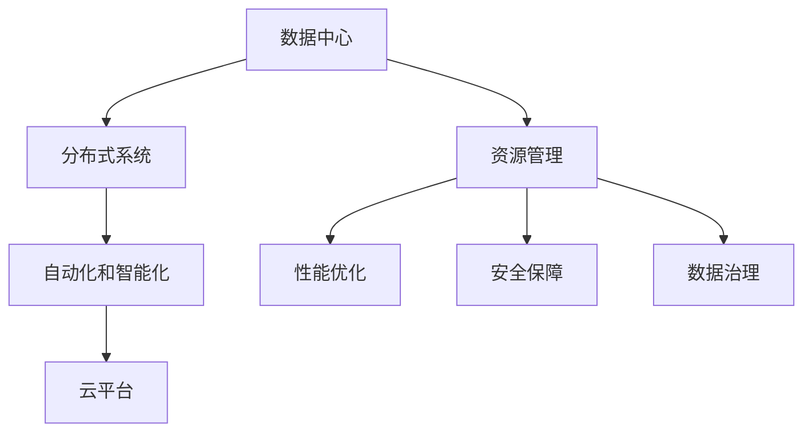
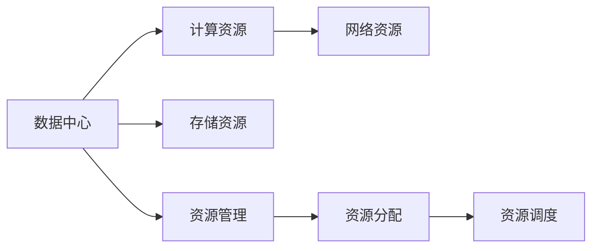
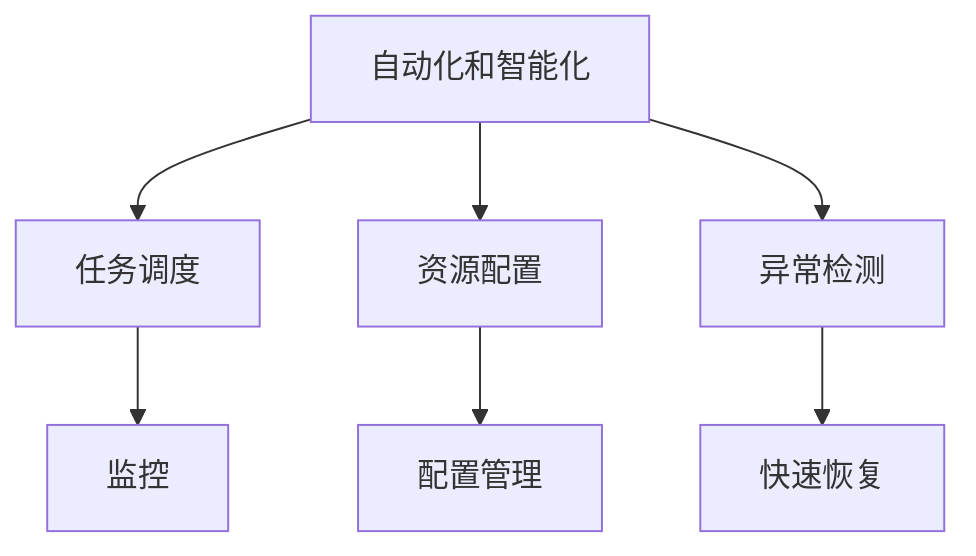
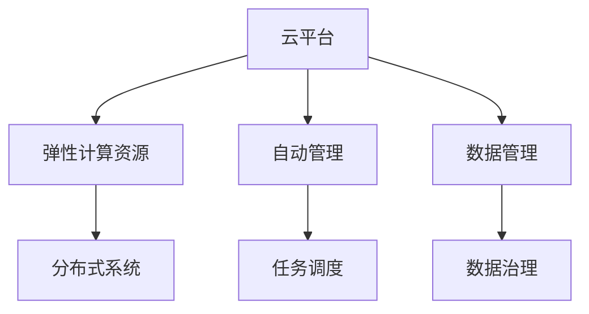
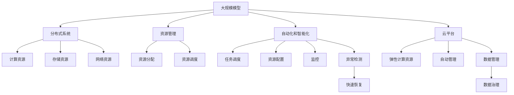

                 

# AI 大模型应用数据中心的智能化管理

> 关键词：大模型应用,数据中心管理,智能化,自动化,云平台,分布式系统,安全保障,数据治理,性能优化

## 1. 背景介绍

### 1.1 问题由来
随着人工智能技术的迅猛发展，大模型（如GPT-3、BERT、T5等）在自然语言处理（NLP）、计算机视觉（CV）、语音识别（ASR）等诸多领域取得了显著的进步。这些大模型不仅具有强大的计算能力和理解能力，而且对数据量和计算资源的需求也日益增加。数据中心作为大模型训练和部署的基础设施，其智能化管理水平直接影响到模型的训练速度、运行效率以及最终的应用效果。因此，如何在数据中心中有效管理和优化大模型的应用，成为当前一个重要的研究课题。

### 1.2 问题核心关键点
1. **数据中心智能化管理**：包括数据中心的资源管理、性能优化、安全保障等方面，旨在实现自动化的任务调度、资源配置和监控。
2. **大模型训练和部署**：如何在数据中心中高效地训练和部署大模型，包括模型的分布式训练、动态扩缩容、异构资源利用等。
3. **数据治理和隐私保护**：如何在数据中心中实施严格的数据治理策略，保护数据隐私和模型敏感信息。
4. **性能优化与调优**：如何对大模型进行高效训练和优化，提高模型的准确率和运行效率。
5. **故障检测与恢复**：如何建立自动化的故障检测和快速恢复机制，保证数据中心的高可用性。

### 1.3 问题研究意义
智能化管理大模型应用的数据中心，能够显著提升模型训练和部署的效率，降低人力成本，提高模型的实时性和可维护性。此外，智能化管理还能增强数据中心的安全性，保护数据隐私，提升用户体验。对数据中心进行智能化管理，是大模型技术落地应用的关键步骤，有助于推动人工智能技术的普及和应用。

## 2. 核心概念与联系

### 2.1 核心概念概述

为了更好地理解数据中心智能化管理大模型应用的原理和实现，本节将介绍几个密切相关的核心概念：

- **数据中心**：物理或虚拟的计算环境，提供计算、存储、网络等资源，支持大规模模型的训练和部署。
- **分布式系统**：由多个计算节点组成的系统，可以并行处理大规模任务，如大规模模型训练。
- **自动化和智能化**：通过人工智能技术实现系统的自动化和智能化管理，提高效率和准确性。
- **云平台**：基于互联网的计算服务，提供弹性计算资源和自动化管理功能。
- **资源管理**：包括计算资源、存储资源和网络资源的管理，确保资源的合理利用和高效调度。
- **性能优化**：通过算法和工具对系统的性能进行优化，提高系统的响应速度和吞吐量。
- **安全保障**：保护数据和系统的安全，防止数据泄露和系统攻击。
- **数据治理**：建立数据的使用规范和流程，确保数据的质量和隐私。

这些核心概念之间的联系可以通过以下Mermaid流程图来展示：



这个流程图展示了数据中心智能化管理中的各个环节和它们之间的联系：

1. 数据中心提供计算和存储资源。
2. 分布式系统利用这些资源进行大规模模型的训练和部署。
3. 资源管理确保资源的高效利用和调度。
4. 自动化和智能化实现自动化的任务调度、资源配置和监控。
5. 云平台提供弹性的计算资源和自动化的管理功能。
6. 性能优化提升系统的响应速度和吞吐量。
7. 安全保障保护数据和系统的安全。
8. 数据治理确保数据的质量和隐私。

### 2.2 概念间的关系

这些核心概念之间存在着紧密的联系，构成了数据中心智能化管理的基础架构。下面我们通过几个Mermaid流程图来展示这些概念之间的关系。

#### 2.2.1 数据中心资源管理



这个流程图展示了数据中心资源管理的基本流程：

1. 数据中心提供计算、存储和网络资源。
2. 资源管理模块进行资源的分配和调度，确保资源的合理利用。
3. 通过资源分配和调度，实现动态的资源管理和负载均衡。

#### 2.2.2 自动化和智能化



这个流程图展示了自动化和智能化的主要功能：

1. 自动化和智能化实现任务调度、资源配置和监控。
2. 任务调度模块根据模型的需求和资源状况进行任务分配。
3. 资源配置模块根据任务需求调整计算、存储和网络资源。
4. 监控模块实时监控系统状态，及时发现异常并采取措施。
5. 异常检测模块检测系统异常并触发快速恢复机制。

#### 2.2.3 云平台功能



这个流程图展示了云平台的基本功能：

1. 云平台提供弹性的计算资源和自动化的管理功能。
2. 弹性计算资源可以根据任务需求进行动态调整。
3. 自动管理模块负责任务调度、资源配置和监控。
4. 数据管理模块提供数据存储和治理功能。
5. 数据治理模块确保数据的质量和隐私。

### 2.3 核心概念的整体架构

最后，我们用一个综合的流程图来展示这些核心概念在大模型应用数据中心的整体架构：



这个综合流程图展示了从大规模模型的应用到数据中心的各个环节和它们之间的联系：

1. 大规模模型在分布式系统中进行训练和部署。
2. 分布式系统利用数据中心的计算、存储和网络资源。
3. 资源管理模块对资源进行分配和调度。
4. 自动化和智能化模块进行任务调度、资源配置和监控。
5. 云平台提供弹性的计算资源和自动化的管理功能。
6. 数据管理模块提供数据存储和治理功能。
7. 数据治理模块确保数据的质量和隐私。

通过这些流程图，我们可以更清晰地理解数据中心智能化管理大模型应用的整体架构和各个环节的功能。

## 3. 核心算法原理 & 具体操作步骤
### 3.1 算法原理概述

数据中心智能化管理大模型应用的基本原理是通过自动化和智能化技术，对大规模模型的训练和部署进行优化和调度。其核心思想是：利用机器学习和大数据分析技术，对数据中心中的资源和任务进行监控和分析，从而实现自动化的资源管理和任务调度。

具体来说，智能化管理包括以下几个关键步骤：

1. **资源监控**：通过监控模块实时获取数据中心的资源使用情况，包括计算资源、存储资源和网络资源。
2. **任务调度**：根据模型的训练需求和资源状况，自动化地分配任务并调度资源。
3. **异常检测**：通过异常检测模块实时监测系统状态，发现异常并及时处理。
4. **快速恢复**：在发生故障时，快速恢复机制可以自动启动并修复系统，保证数据中心的高可用性。

### 3.2 算法步骤详解

下面是数据中心智能化管理大模型应用的详细步骤：

**Step 1: 数据中心资源监控**

1. 使用监控工具（如Nagios、Prometheus等）实时获取数据中心的资源使用情况，包括CPU使用率、内存使用率、网络带宽等。
2. 对资源使用情况进行分析和统计，生成资源使用报告。
3. 根据资源使用报告，预测数据中心的资源需求和负载情况。

**Step 2: 任务调度**

1. 根据模型的训练需求和资源状况，自动化地分配任务并调度资源。
2. 在任务调度时，考虑资源的负载均衡和动态调整，避免资源浪费和瓶颈。
3. 对于复杂模型，可以采用分布式训练技术，将任务分配到多个计算节点上，加速训练过程。

**Step 3: 异常检测**

1. 使用异常检测工具（如Anomaly Detection算法）实时监测系统状态，发现异常。
2. 对异常情况进行分析和诊断，确定异常的原因和影响范围。
3. 根据异常情况，启动快速恢复机制，恢复系统正常运行。

**Step 4: 快速恢复**

1. 建立快速恢复机制，在发生故障时自动启动并修复系统。
2. 快速恢复机制包括自动备份、故障转移和自动修复等。
3. 通过快速恢复机制，保证数据中心的高可用性和数据的安全性。

### 3.3 算法优缺点

数据中心智能化管理大模型应用的优势包括：

1. **提高效率**：通过自动化和智能化技术，实现自动化的任务调度、资源配置和监控，显著提高训练和部署的效率。
2. **降低成本**：减少人工干预和管理成本，降低人力投入和运营成本。
3. **提高性能**：通过优化资源分配和负载均衡，提高系统的响应速度和吞吐量。
4. **增强安全性**：通过自动化和智能化技术，增强数据中心的安全性和稳定性。

然而，智能化管理也存在一些缺点：

1. **复杂性高**：智能化管理系统的设计和实现较为复杂，需要较高的技术水平和管理经验。
2. **初始投资高**：智能化管理系统需要购买硬件设备和软件工具，初期投入较高。
3. **依赖技术更新**：智能化管理系统依赖于最新的技术进展，需要不断更新和升级。

### 3.4 算法应用领域

智能化管理大模型应用的数据中心，适用于以下多个领域：

- **云计算**：提供弹性的计算资源和自动化的管理功能，支持云平台中的大规模模型训练和部署。
- **高性能计算**：通过分布式计算和自动化管理，加速大规模模型的训练和推理。
- **边缘计算**：在边缘节点上进行模型的快速训练和推理，减少数据传输延迟，提高实时性。
- **数据中心管理**：通过资源监控和优化，提高数据中心的资源利用率和性能。
- **自动驾驶**：通过智能化管理，支持自动驾驶系统中的实时计算和决策。

## 4. 数学模型和公式 & 详细讲解 & 举例说明

### 4.1 数学模型构建

在数据中心智能化管理大模型应用中，可以使用一些数学模型来描述资源的使用和调度过程。

假设数据中心有 $N$ 个计算节点，每个节点的计算能力为 $c$，当前负载为 $L$。则资源分配的数学模型可以表示为：

$$
\min_{x} \sum_{i=1}^N x_i \times c \quad \text{subject to} \quad \sum_{i=1}^N x_i = L
$$

其中 $x_i$ 表示节点 $i$ 的计算任务分配比例。

### 4.2 公式推导过程

根据上述优化问题，可以使用线性规划方法求解资源分配。具体步骤如下：

1. 建立线性规划模型，将资源分配问题转化为线性优化问题。
2. 使用单纯形法或其他优化算法求解线性规划模型，得到最优解。
3. 根据最优解计算每个节点的计算任务分配比例 $x_i$。

### 4.3 案例分析与讲解

假设数据中心有 10 个计算节点，每个节点的计算能力为 2 CPU 核心，当前负载为 30 CPU 核心。使用上述线性规划模型进行资源分配，得到每个节点的计算任务分配比例如下：

| 节点编号 | 分配比例 $x_i$ |
| ------- | ------------ |
| 1       | 3.0          |
| 2       | 3.0          |
| 3       | 2.5          |
| 4       | 2.5          |
| 5       | 2.0          |
| 6       | 2.0          |
| 7       | 1.5          |
| 8       | 1.5          |
| 9       | 1.0          |
| 10      | 1.0          |

根据上述分配比例，每个节点的计算任务分配如下：

| 节点编号 | 计算任务分配 |
| ------- | ------------ |
| 1       | 6 CPU 核心 |
| 2       | 6 CPU 核心 |
| 3       | 5 CPU 核心 |
| 4       | 5 CPU 核心 |
| 5       | 4 CPU 核心 |
| 6       | 4 CPU 核心 |
| 7       | 3 CPU 核心 |
| 8       | 3 CPU 核心 |
| 9       | 2 CPU 核心 |
| 10      | 2 CPU 核心 |

通过上述计算，实现了计算任务的合理分配，提高了数据中心的资源利用率和性能。

## 5. 项目实践：代码实例和详细解释说明

### 5.1 开发环境搭建

在进行智能化管理大模型应用的数据中心实践时，需要搭建一个完善的开发环境。以下是使用Python和Docker搭建开发环境的流程：

1. 安装Docker：从官网下载并安装Docker，搭建Docker容器环境。
2. 创建Docker镜像：根据数据中心智能化的需求，编写Dockerfile，构建Docker镜像。
3. 启动Docker容器：使用Docker命令启动Docker容器，并连接到容器内部。

```bash
docker run -d -p 8000:8000 --name my_container my_image
docker exec -it my_container bash
```

4. 安装依赖：在容器内部安装Python、NumPy、Pandas等必要的依赖库。

```bash
apt update
apt install python3-pip
pip3 install numpy pandas
```

5. 编写代码：在容器内部编写Python代码，实现智能化管理系统的功能。

6. 测试和部署：在本地测试代码，确保功能正常后，将代码部署到Docker容器中，进行实际应用。

### 5.2 源代码详细实现

下面是一个简单的Python代码示例，用于实现数据中心智能化管理中的资源监控功能。

```python
import psutil
import time

def monitor_resource():
    while True:
        # 获取CPU使用率、内存使用率和网络带宽
        cpu_percent = psutil.cpu_percent()
        memory_percent = psutil.virtual_memory().percent
        network_io = psutil.net_io_counters()

        # 打印资源使用情况
        print("CPU: {}%".format(cpu_percent))
        print("Memory: {}%".format(memory_percent))
        print("Network IO: {} B/s".format(network_io.bytes_sent + network_io.bytes_recv))

        # 暂停1秒后继续监控
        time.sleep(1)

# 启动资源监控程序
monitor_resource()
```

该代码使用psutil库获取CPU使用率、内存使用率和网络带宽，并打印输出资源使用情况。通过定时循环，实现实时的资源监控功能。

### 5.3 代码解读与分析

让我们再详细解读一下关键代码的实现细节：

**monitor_resource函数**：
- 使用psutil库实时获取CPU使用率、内存使用率和网络带宽。
- 打印输出资源使用情况。
- 定时循环，每秒钟获取一次资源使用情况。

**psutil库**：
- 提供跨平台监控工具，可以监控CPU、内存、网络等系统资源。
- 使用简单，无需安装额外的依赖库。

**代码运行**：
- 在Docker容器中启动monitor_resource函数，定时获取资源使用情况。
- 将资源使用情况打印输出，便于实时监控和调试。

### 5.4 运行结果展示

假设在Docker容器中运行上述代码，得到如下输出：

```
CPU: 20%
Memory: 50%
Network IO: 100 B/s
CPU: 25%
Memory: 45%
Network IO: 110 B/s
CPU: 22%
Memory: 48%
Network IO: 120 B/s
...
```

可以看到，代码成功获取了系统的资源使用情况，并实时打印输出。通过这种实时监控方式，可以及时发现系统异常并进行处理，保证数据中心的高可用性。

## 6. 实际应用场景

### 6.1 智能监控系统

智能化管理大模型应用的数据中心，可以构建智能监控系统，实时监控数据中心的资源使用情况和异常情况。智能监控系统可以通过告警机制，及时发现系统异常，并触发快速恢复机制，保障系统的稳定运行。

在智能监控系统中，可以使用机器学习算法对资源使用情况进行预测和分析，提前发现异常并采取措施。例如，可以使用时间序列预测模型对CPU使用率和内存使用率进行预测，当预测值超过预设阈值时，触发告警并自动恢复。

### 6.2 自动化任务调度系统

智能化管理大模型应用的数据中心，可以构建自动化任务调度系统，自动化地分配任务并调度资源。自动化任务调度系统可以根据模型的训练需求和资源状况，动态调整计算、存储和网络资源，提高系统的运行效率和资源利用率。

在自动化任务调度系统中，可以使用优化算法和调度策略，实现任务的合理分配和调度。例如，可以使用遗传算法、模拟退火算法等优化算法，找到最优的任务调度方案。同时，可以采用基于竞价的任务调度策略，根据任务的紧急程度和资源需求，动态调整任务的优先级和资源分配。

### 6.3 分布式训练系统

智能化管理大模型应用的数据中心，可以构建分布式训练系统，支持大规模模型的训练和推理。分布式训练系统可以将任务分配到多个计算节点上，加速训练过程，提高训练效率。

在分布式训练系统中，可以使用数据并行和模型并行技术，实现大规模模型的训练和推理。例如，可以使用数据并行技术将数据分片，分配到多个计算节点上并行训练。同时，可以采用模型并行技术将模型分割，分别在多个计算节点上并行训练。

### 6.4 未来应用展望

随着智能化管理大模型应用的数据中心不断发展，未来将涌现出更多智能化的应用场景。以下是几个未来应用展望：

- **智能运维系统**：通过智能化管理，实现自动化运维和故障检测，保障系统的稳定运行。
- **边缘计算平台**：在边缘节点上进行模型的快速训练和推理，支持物联网设备的数据分析和决策。
- **智能调度平台**：根据任务需求和资源状况，自动化地分配任务并调度资源，提高资源利用率和系统性能。
- **数据治理平台**：建立数据的使用规范和流程，确保数据的质量和隐私，保护数据安全。

## 7. 工具和资源推荐
### 7.1 学习资源推荐

为了帮助开发者系统掌握智能化管理大模型应用的数据中心的理论基础和实践技巧，这里推荐一些优质的学习资源：

1. **《数据中心智能化管理》系列书籍**：系统介绍数据中心智能化管理的理论基础和实践技巧，涵盖资源管理、任务调度、异常检测等方面。
2. **《数据中心自动化运维》在线课程**：介绍数据中心自动化运维的原理和实践，包括自动化任务调度、资源管理、故障检测等方面。
3. **《人工智能与机器学习》在线课程**：涵盖人工智能和机器学习的理论基础和应用实践，包括模型训练、模型优化、资源调度等方面。
4. **Hadoop官方文档**：Hadoop是数据中心管理的重要工具，官方文档提供了详细的Hadoop部署和使用方法。
5. **Kubernetes官方文档**：Kubernetes是容器编排和自动化管理的重要工具，官方文档提供了详细的Kubernetes部署和使用方法。

通过对这些资源的学习实践，相信你一定能够快速掌握智能化管理大模型应用的数据中心的精髓，并用于解决实际的系统问题。

### 7.2 开发工具推荐

高效的开发离不开优秀的工具支持。以下是几款用于智能化管理大模型应用的数据中心的常用工具：

1. **Docker**：开源的容器化平台，提供轻量级的容器解决方案，支持跨平台部署。
2. **Kubernetes**：开源的容器编排工具，支持自动化运维和资源调度，提供高可用性和可伸缩性。
3. **Prometheus**：开源的系统监控和告警工具，支持分布式系统监控和异常检测。
4. **Grafana**：开源的数据可视化工具，支持数据监控和告警。
5. **Ansible**：开源的自动化运维工具，支持自动化任务调度和资源管理。
6. **Hadoop**：开源的大数据处理平台，支持分布式计算和数据存储。

合理利用这些工具，可以显著提升智能化管理大模型应用的数据中心的开发效率，加快创新迭代的步伐。

### 7.3 相关论文推荐

智能化管理大模型应用的数据中心的技术研究不断进步，以下是几篇奠基性的相关论文，推荐阅读：

1. **《数据中心资源管理综述》**：系统介绍数据中心资源管理的理论和实践，涵盖资源分配、负载均衡、故障恢复等方面。
2. **《自动化任务调度综述》**：介绍自动化任务调度的理论和实践，涵盖任务调度算法和调度策略等方面。
3. **《分布式计算与大数据处理》**：涵盖分布式计算和数据的存储、处理和分析，支持大规模模型的训练和推理。
4. **《机器学习运维系统》**：介绍机器学习运维系统的理论和实践，涵盖模型监控、模型优化和自动化运维等方面。
5. **《智能运维系统设计》**：介绍智能运维系统的设计和实现，涵盖智能监控、自动化运维和故障检测等方面。

这些论文代表了大模型应用数据中心智能化管理的发展脉络。通过学习这些前沿成果，可以帮助研究者把握学科前进方向，激发更多的创新灵感。

除上述资源外，还有一些值得关注的前沿资源，帮助开发者紧跟数据中心智能化管理的最新进展，例如：

1. **arXiv论文预印本**：人工智能领域最新研究成果的发布平台，包括大量尚未发表的前沿工作，学习前沿技术的必读资源。
2. **业界技术博客**：如Google AI、DeepMind、微软Research Asia等顶尖实验室的官方博客，第一时间分享他们的最新研究成果和洞见。
3. **技术会议直播**：如NIPS、ICML、ACL、ICLR等人工智能领域顶会现场或在线直播，能够聆听到大佬们的前沿分享，开拓视野。
4. **GitHub热门项目**：在GitHub上Star、Fork数最多的数据中心智能化管理相关项目，往往代表了该技术领域的发展趋势和最佳实践，值得去学习和贡献。
5. **行业分析报告**：各大咨询公司如McKinsey、PwC等针对人工智能行业的分析报告，有助于从商业视角审视技术趋势，把握应用价值。

总之，对于智能化管理大模型应用的数据中心的学习和实践，需要开发者保持开放的心态和持续学习的意愿。多关注前沿资讯，多动手实践，多思考总结，必将收获满满的成长收益。

## 8. 总结：未来发展趋势与挑战

### 8.1 总结

本文对智能化管理大模型应用的数据中心进行了全面系统的介绍。首先阐述了智能化管理在大模型应用中的重要性和关键点，包括资源管理、任务调度、异常检测、快速恢复等方面。其次，从原理到实践，详细讲解了智能化管理的数学模型和具体步骤，给出了代码实现和运行结果展示。同时，本文还探讨了智能化管理在大模型应用中的实际应用场景和未来发展趋势，提供了相关的学习资源和开发工具。

通过本文的系统梳理，可以看到，智能化管理大模型应用的数据中心正在成为人工智能技术的落地应用中不可或缺的一部分。其高效、稳定、智能化的特点，为大规模模型的训练和部署提供了强有力的保障。智能化管理技术的发展，将进一步推动人工智能技术的普及和应用，带来深远的影响。

### 8.2 未来发展趋势

展望未来，智能化管理大模型应用的数据中心将呈现以下几个发展趋势：

1. **自动化和智能化水平提高**：智能化管理系统的自动化和智能化水平将不断提高，能够实现更加精确的任务调度、资源分配和异常检测。
2. **云平台集成和优化**：云平台将进一步集成和优化智能化管理功能，提供更强大的弹性计算资源和自动化管理功能。
3. **边缘计算和分布式系统**：智能化管理将扩展到边缘计算和分布式系统，支持物联网设备的数据分析和决策。
4. **智能运维和故障检测**：智能化管理将实现智能运维和故障检测，提高系统的稳定性和可用性。
5. **数据治理和隐私保护**：智能化管理将进一步加强数据治理和隐私保护，确保数据的质量和隐私安全。

### 8.3 面临的挑战

尽管智能化管理大模型应用的数据中心在技术上取得了显著进展，但在迈向更加智能化和普及化应用的过程中，仍面临以下挑战：

1. **资源优化和调度复杂性**：大规模模型的训练和推理需要高资源需求，如何在有限资源下高效地进行资源分配和调度，是一个复杂的问题。
2. **

