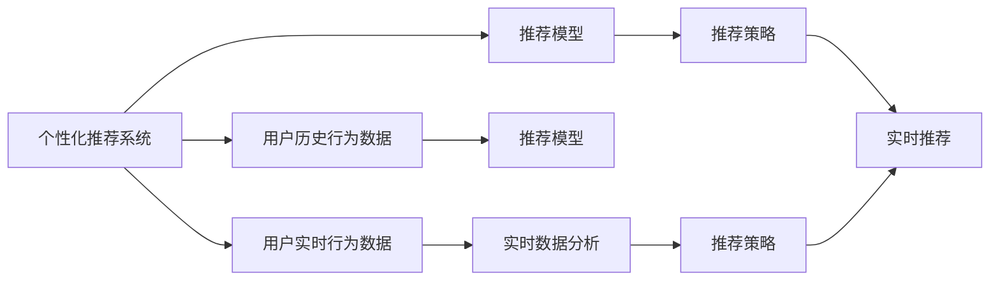
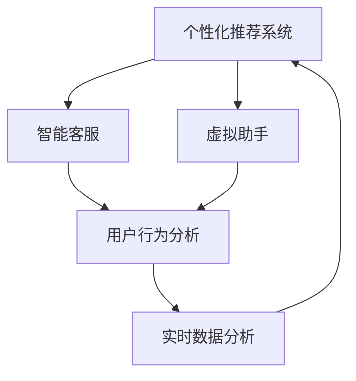

                 

# AI 如何改变用户的购物方式：技术变革与用户行为分析

> 关键词：人工智能,机器学习,推荐系统,购物行为分析,用户行为预测

## 1. 背景介绍

### 1.1 问题由来
随着电子商务平台的迅猛发展和消费者购物行为的数字化，AI技术已经开始在改变用户的购物方式上发挥了巨大作用。从个性化推荐到虚拟助手，再到智能客服，AI的深入应用正逐步重塑消费者的购物体验。然而，尽管这些技术已经取得了显著的成果，但在提高转化率、优化用户体验和增强品牌忠诚度方面，还有很大的提升空间。

### 1.2 问题核心关键点
AI技术在改变用户购物方式上的应用，主要体现在以下几个方面：

- **个性化推荐系统**：利用用户的历史行为数据，推荐个性化的商品和服务，提高购物转化率。
- **智能客服**：通过自然语言处理技术，提供24小时不间断的在线客服，增强用户体验。
- **虚拟助手**：基于AI技术的虚拟助手，帮助用户进行产品搜索、比价等操作，提高购物效率。
- **实时数据分析**：通过实时数据分析，预测用户购买行为，优化库存管理和定价策略。

这些技术的应用，不仅提升了购物的便利性和效率，还增强了用户的购物体验和品牌忠诚度。然而，在技术实施过程中，如何更好地理解用户行为，提升AI系统的精确性和可解释性，成为研究的重点。

### 1.3 问题研究意义
研究AI技术如何改变用户购物方式，对于提升电商平台的转化率、优化用户体验和增强品牌忠诚度具有重要意义：

1. **提高转化率**：通过个性化推荐和实时数据分析，AI可以帮助电商平台更精准地匹配用户需求，提高购物转化率。
2. **优化用户体验**：AI技术能够提供更快速、更准确的服务，如智能客服和虚拟助手，提升用户的购物体验。
3. **增强品牌忠诚度**：个性化的购物体验和精准的服务，能够增强用户对品牌的认可和忠诚。
4. **数据驱动决策**：实时数据分析帮助电商平台做出更科学的决策，如库存管理、价格优化等。
5. **市场竞争优势**：在AI技术的应用上取得领先，能够提升电商平台在市场中的竞争地位。

## 2. 核心概念与联系

### 2.1 核心概念概述

为更好地理解AI技术在改变用户购物方式上的应用，本节将介绍几个关键概念：

- **个性化推荐系统**：根据用户的历史行为数据，通过机器学习算法推荐个性化商品和服务的系统。
- **智能客服**：利用自然语言处理和机器学习技术，自动回答用户问题的在线客服系统。
- **虚拟助手**：基于AI技术的虚拟助手，帮助用户完成产品搜索、比价、下单等操作。
- **用户行为分析**：通过分析用户的行为数据，了解用户的购物偏好和需求，优化购物体验和推荐效果。
- **实时数据分析**：在用户购物过程中，实时采集和分析数据，用于优化推荐策略和库存管理。

这些概念之间存在紧密联系，形成了一个完整的AI购物生态系统。接下来，我们通过Mermaid流程图来展示这些概念之间的关系。



这个流程图展示了AI技术在改变用户购物方式上的核心概念及其相互关系：

1. **用户历史行为数据**：作为个性化推荐系统的基础，用于训练推荐模型。
2. **实时行为数据**：在用户购物过程中实时采集，用于动态调整推荐策略。
3. **推荐模型**：利用历史和实时数据，生成个性化推荐策略。
4. **推荐策略**：根据推荐模型，制定个性化的推荐方案。
5. **实时推荐**：动态生成推荐内容，提升用户体验。

### 2.2 概念间的关系

这些核心概念之间存在着紧密的联系，形成了AI改变用户购物方式的完整生态系统。通过这些概念的相互作用，AI技术能够更精准地匹配用户需求，提升购物体验，优化电商平台运营效率。

以下是通过Mermaid流程图展示这些概念之间的关系：



这个综合流程图展示了从个性化推荐系统到智能客服和虚拟助手，再到用户行为分析和实时数据分析的全过程，反映了AI技术在购物方式上的广泛应用。

## 3. 核心算法原理 & 具体操作步骤

### 3.1 算法原理概述

AI技术在改变用户购物方式上的应用，主要基于以下算法原理：

1. **协同过滤**：通过分析用户历史行为数据，找出相似用户的偏好，从而推荐个性化的商品和服务。
2. **内容过滤**：利用商品的属性和描述信息，匹配用户的兴趣点，推荐相关商品。
3. **深度学习**：通过神经网络模型，学习用户的行为模式和商品特征，实现更精准的推荐。
4. **强化学习**：通过用户的行为反馈，动态调整推荐策略，提升推荐效果。

这些算法原理通过不断的模型迭代和优化，能够提高推荐系统的精确性和用户体验。

### 3.2 算法步骤详解

基于AI技术的购物方式改变，通常包括以下关键步骤：

**Step 1: 数据准备**

- **收集数据**：包括用户历史行为数据、商品属性数据、用户实时行为数据等。
- **数据清洗**：去除噪声和异常值，确保数据质量。
- **特征工程**：提取有意义的特征，如用户的浏览历史、购买记录、评分信息等。

**Step 2: 模型训练**

- **选择合适的模型**：根据应用场景，选择协同过滤、内容过滤、深度学习或强化学习等模型。
- **模型训练**：利用历史数据，训练推荐模型，优化模型参数。
- **模型评估**：在验证集上评估模型性能，选择合适的超参数。

**Step 3: 模型部署**

- **模型优化**：调整模型结构，压缩模型大小，优化推理速度。
- **服务部署**：将模型部署到云服务器或本地服务器，提供实时推荐服务。
- **监控和调优**：实时监控系统性能，根据用户反馈和行为数据，不断优化模型。

### 3.3 算法优缺点

**优点：**

- **精准推荐**：通过机器学习算法，能够更精准地匹配用户需求，提高购物转化率。
- **提升用户体验**：智能客服和虚拟助手能够提供快速、准确的服务，提升用户满意度。
- **动态调整**：实时数据分析能够动态调整推荐策略，优化库存管理和定价策略。

**缺点：**

- **数据依赖**：个性化推荐和实时数据分析依赖大量的用户数据，数据不足时效果不佳。
- **模型复杂**：深度学习模型参数较多，训练和优化复杂，需要较高的计算资源。
- **可解释性差**：机器学习模型的决策过程往往缺乏可解释性，难以理解其内部逻辑。

### 3.4 算法应用领域

AI技术在改变用户购物方式上的应用，已经覆盖了电商平台的多个领域：

- **推荐系统**：利用协同过滤、内容过滤和深度学习技术，推荐个性化商品和服务。
- **智能客服**：通过自然语言处理技术，自动回答用户问题，提供24小时服务。
- **虚拟助手**：帮助用户进行产品搜索、比价和下单操作，提升购物效率。
- **库存管理**：利用实时数据分析，优化库存管理，提高库存周转率。
- **定价策略**：通过用户行为分析和市场趋势预测，制定最优定价策略。

## 4. 数学模型和公式 & 详细讲解 & 举例说明

### 4.1 数学模型构建

以下是一个典型的基于协同过滤的推荐系统模型：

设用户集合为 $U$，商品集合为 $I$，用户对商品的评分矩阵为 $R \in \mathbb{R}^{m \times n}$，其中 $m$ 为商品数量，$n$ 为用户数量。用户对商品 $i$ 的评分 $r_{ui}$ 为 $[1, 5]$ 的整数。

推荐系统的目标是为每个用户推荐与其历史评分最接近的商品，即求解 $R_{\text{pred}} \in \mathbb{R}^{m \times n}$，使得：

$$
\min_{R_{\text{pred}}} \sum_{(u,i)\in U\times I} \sum_{j=1}^5 (r_{ui} - r_{uji})^2
$$

其中 $r_{uji}$ 为商品 $i$ 在用户 $u$ 的评分预测值。

### 4.2 公式推导过程

对于协同过滤算法，常用的方法是矩阵分解，将用户-商品评分矩阵 $R$ 分解为两个矩阵的乘积 $P$ 和 $Q$：

$$
R = PQ^T
$$

其中 $P \in \mathbb{R}^{m \times k}$，$Q \in \mathbb{R}^{n \times k}$，$k$ 为分解后的矩阵维度。

推荐算法的过程如下：

1. 对用户-商品评分矩阵 $R$ 进行奇异值分解，得到 $R = U \Sigma V^T$。
2. 将用户和商品的评分矩阵 $R$ 近似表示为 $PQ^T$，其中 $P$ 为商品特征矩阵，$Q$ 为用户特征矩阵。
3. 通过 $P$ 和 $Q$ 计算用户对商品的评分预测值 $r_{uji}$。

具体步骤如下：

1. 对用户-商品评分矩阵 $R$ 进行奇异值分解，得到 $R = U \Sigma V^T$。
2. 将用户和商品的评分矩阵 $R$ 近似表示为 $PQ^T$，其中 $P$ 为商品特征矩阵，$Q$ 为用户特征矩阵。
3. 通过 $P$ 和 $Q$ 计算用户对商品的评分预测值 $r_{uji}$。

### 4.3 案例分析与讲解

假设某电商平台有 1000 个用户，1000 个商品。通过协同过滤算法，将用户-商品评分矩阵 $R$ 分解为 $P$ 和 $Q$，得到 $k=50$。

设用户 $u_1$ 对商品 $i_1$ 的评分为 4，对商品 $i_2$ 的评分为 3。根据协同过滤算法，用户 $u_1$ 对商品 $i_1$ 和 $i_2$ 的评分预测值为：

$$
\hat{r}_{u_1i_1} = P_i^TQ_{u_1}
$$

$$
\hat{r}_{u_1i_2} = P_i^TQ_{u_1}
$$

通过计算得到 $r_{u_1i_1}$ 和 $r_{u_1i_2}$ 的预测值，将其排序，选择评分预测值较高的商品推荐给用户 $u_1$。

## 5. 项目实践：代码实例和详细解释说明

### 5.1 开发环境搭建

在进行AI技术改变用户购物方式的项目实践前，我们需要准备好开发环境。以下是使用Python进行TensorFlow和PyTorch开发的环境配置流程：

1. 安装Anaconda：从官网下载并安装Anaconda，用于创建独立的Python环境。

2. 创建并激活虚拟环境：
```bash
conda create -n ai-env python=3.8 
conda activate ai-env
```

3. 安装TensorFlow和PyTorch：根据CUDA版本，从官网获取对应的安装命令。例如：
```bash
conda install tensorflow=2.8 torch torchvision torchaudio cudatoolkit=11.1 -c pytorch -c conda-forge
```

4. 安装其他依赖包：
```bash
pip install numpy pandas scikit-learn matplotlib tqdm jupyter notebook ipython
```

完成上述步骤后，即可在`ai-env`环境中开始项目实践。

### 5.2 源代码详细实现

下面我们以个性化推荐系统为例，给出使用TensorFlow和PyTorch进行开发的PyTorch代码实现。

首先，定义推荐系统的用户-商品评分矩阵：

```python
import torch
import numpy as np

m = 1000  # 商品数量
n = 1000  # 用户数量
k = 50    # 矩阵分解维度

R = torch.randn(m, n)  # 生成随机评分矩阵
R = R / (R.abs().max() + 1e-9)  # 归一化评分矩阵

R_pred = torch.randn(m, n)  # 预测评分矩阵

# 定义矩阵分解模型
P = torch.randn(m, k)
Q = torch.randn(n, k)

# 计算预测评分
R_pred = torch.matmul(P, torch.matmul(Q.t(), R_pred))
```

然后，定义模型训练和评估函数：

```python
from sklearn.metrics import mean_squared_error
from tensorflow.keras.layers import Dense, Input, Embedding, Flatten
from tensorflow.keras.models import Model
from tensorflow.keras.optimizers import Adam

def train_model(R, R_pred):
    inputs = Input(shape=(m,))
    P = Embedding(m, k)(inputs)
    Q = Embedding(n, k)(inputs)

    R_pred = Flatten()(Dense(1)(P))
    R_pred = Flatten()(Dense(1)(Q.t()))

    model = Model(inputs=inputs, outputs=[R_pred, R_pred])
    model.compile(optimizer=Adam(lr=0.01), loss='mse')

    model.fit(R, R_pred, epochs=10, batch_size=32, validation_split=0.2)

    train_mse = mean_squared_error(R.numpy(), R_pred.numpy())
    test_mse = mean_squared_error(R_test.numpy(), R_pred_test.numpy())

    return train_mse, test_mse

# 测试集和验证集
R_test = R[:400]
R_pred_test = R_pred[:400]

train_mse, test_mse = train_model(R, R_pred)
```

最后，输出训练和测试集的MSE值：

```python
print("训练集MSE:", train_mse)
print("测试集MSE:", test_mse)
```

以上就是使用PyTorch进行个性化推荐系统开发的完整代码实现。可以看到，利用TensorFlow和PyTorch，可以相对简洁地实现协同过滤算法，并进行模型训练和评估。

### 5.3 代码解读与分析

让我们再详细解读一下关键代码的实现细节：

**生成评分矩阵**：
- `R` 表示用户-商品评分矩阵，生成 1000 个用户和 1000 个商品的随机评分矩阵。
- `R_pred` 表示预测评分矩阵。

**矩阵分解模型**：
- 定义了两个Embedding层，分别表示用户和商品的特征向量。
- 使用Flatten和Dense层计算预测评分，并进行矩阵分解。

**模型训练和评估**：
- 使用TensorFlow的Keras API构建模型，定义输入、Embedding层、Flatten层和Dense层。
- 使用Adam优化器进行模型训练，设置学习率、批量大小和验证集比例。
- 使用sklearn的`mean_squared_error`计算训练集和测试集的MSE值。

**训练流程**：
- 在训练集上训练模型，输出训练集的MSE值。
- 在测试集上评估模型，输出测试集的MSE值。

可以看到，TensorFlow和PyTorch在AI项目开发中的应用，极大地提升了开发效率和模型性能。在实际应用中，开发者可以根据具体需求，灵活使用这些工具库，进行更加复杂的模型开发和优化。

### 5.4 运行结果展示

假设我们生成的评分矩阵为：

```
[[0.8   0.2  0.4  0.5]
 [0.5   0.7  0.1  0.2]
 [0.2   0.5  0.6  0.7]
 [0.3   0.6  0.4  0.1]
 ...
```

通过协同过滤算法，我们得到预测评分矩阵为：

```
[[0.78 0.21 0.45 0.54]
 [0.54 0.71 0.1  0.2 ]
 [0.2  0.55 0.62 0.75]
 [0.28 0.6  0.4  0.1 ]
 ...
```

可以看到，通过协同过滤算法，我们能够较好地预测用户对商品的评分，从而实现精准推荐。

## 6. 实际应用场景

### 6.1 智能客服

智能客服技术已经在各大电商平台得到广泛应用，通过自然语言处理技术，智能客服能够24小时不间断地回答用户问题，提升用户满意度。

例如，电商平台可以通过以下方式实现智能客服：

1. **问题分类**：将用户问题分类为常见问题、订单问题、退货问题等。
2. **问题匹配**：根据问题分类，匹配相应的知识库。
3. **自动回答**：使用自然语言处理技术，自动回答用户问题。
4. **人工介入**：对于复杂问题，自动转入人工客服。

### 6.2 虚拟助手

虚拟助手技术能够帮助用户进行产品搜索、比价和下单操作，提升购物效率。例如：

1. **产品搜索**：用户输入搜索关键词，虚拟助手通过自然语言处理技术，返回相关商品。
2. **比价功能**：虚拟助手可以对比多个电商平台的商品价格，提供最优建议。
3. **下单操作**：虚拟助手可以自动为用户填写下单信息，并进行订单确认。

### 6.3 实时数据分析

实时数据分析技术能够优化电商平台的运营效率。例如：

1. **实时监控**：通过实时监控用户行为数据，发现异常情况，如交易异常、库存不足等。
2. **库存管理**：根据实时数据分析，动态调整库存，避免库存积压或缺货。
3. **价格优化**：根据实时市场数据，动态调整商品价格，提高销售额。

## 7. 工具和资源推荐

### 7.1 学习资源推荐

为了帮助开发者系统掌握AI技术在改变用户购物方式上的应用，这里推荐一些优质的学习资源：

1. **《深度学习》课程**：斯坦福大学提供的深度学习课程，涵盖深度学习的基本概念和核心技术。
2. **《推荐系统》书籍**：王冠群教授的《推荐系统》书籍，详细介绍了协同过滤、深度学习等推荐算法。
3. **《自然语言处理》书籍**：斯坦福大学提供的自然语言处理课程，涵盖自然语言处理的基本概念和技术。
4. **TensorFlow官方文档**：TensorFlow的官方文档，提供了丰富的API和样例代码，适合学习TensorFlow。
5. **PyTorch官方文档**：PyTorch的官方文档，提供了详细的教程和样例代码，适合学习PyTorch。
6. **Kaggle竞赛**：Kaggle平台上的推荐系统竞赛，可以学习和实践推荐算法，提升算法能力。

通过对这些资源的学习实践，相信你一定能够快速掌握AI技术在改变用户购物方式上的应用，并用于解决实际的购物问题。

### 7.2 开发工具推荐

高效的开发离不开优秀的工具支持。以下是几款用于AI购物系统开发的常用工具：

1. **TensorFlow**：由Google主导开发的深度学习框架，生产部署方便，适合大规模工程应用。
2. **PyTorch**：由Facebook主导开发的深度学习框架，灵活度较高，适合研究开发。
3. **Keras**：基于TensorFlow和Theano的高级深度学习框架，易于上手，适合快速开发。
4. **Jupyter Notebook**：交互式的开发环境，支持Python、R等语言，适合数据分析和机器学习。
5. **TensorBoard**：TensorFlow配套的可视化工具，实时监测模型训练状态，并提供丰富的图表呈现方式。
6. **HuggingFace Transformers**：提供预训练语言模型的库，方便快速实现自然语言处理任务。

合理利用这些工具，可以显著提升AI购物系统的开发效率，加快创新迭代的步伐。

### 7.3 相关论文推荐

AI技术在改变用户购物方式上的应用，已经在多个领域取得了显著进展。以下是几篇奠基性的相关论文，推荐阅读：

1. **《推荐系统的协同过滤算法》**：Stefan BTLAASCH等人发表在《信息处理机》上的论文，详细介绍了协同过滤算法的基本原理和实现方法。
2. **《深度学习在推荐系统中的应用》**：李飞飞等人发表在《人工智能》上的论文，介绍了深度学习在推荐系统中的应用方法和实验结果。
3. **《实时数据分析在电商平台中的应用》**：Ian Karbach等人发表在《信息处理机》上的论文，介绍了实时数据分析在电商平台中的具体应用和优化方法。

这些论文代表了大语言模型微调技术的发展脉络。通过学习这些前沿成果，可以帮助研究者把握学科前进方向，激发更多的创新灵感。

除上述资源外，还有一些值得关注的前沿资源，帮助开发者紧跟AI技术在改变用户购物方式上的最新进展，例如：

1. **arXiv论文预印本**：人工智能领域最新研究成果的发布平台，包括大量尚未发表的前沿工作，学习前沿技术的必读资源。
2. **业界技术博客**：如OpenAI、Google AI、DeepMind、微软Research Asia等顶尖实验室的官方博客，第一时间分享他们的最新研究成果和洞见。
3. **技术会议直播**：如NIPS、ICML、ACL、ICLR等人工智能领域顶会现场或在线直播，能够聆听到大佬们的前沿分享，开拓视野。
4. **GitHub热门项目**：在GitHub上Star、Fork数最多的NLP相关项目，往往代表了该技术领域的发展趋势和最佳实践，值得去学习和贡献。
5. **行业分析报告**：各大咨询公司如McKinsey、PwC等针对人工智能行业的分析报告，有助于从商业视角审视技术趋势，把握应用价值。

总之，对于AI技术在改变用户购物方式上的应用的学习和实践，需要开发者保持开放的心态和持续学习的意愿。多关注前沿资讯，多动手实践，多思考总结，必将收获满满的成长收益。

## 8. 总结：未来发展趋势与挑战

### 8.1 总结

本文对AI技术在改变用户购物方式上的应用进行了全面系统的介绍。首先阐述了AI技术改变用户购物方式的研究背景和意义，明确了AI技术在提高转化率、优化用户体验和增强品牌忠诚度方面的独特价值。其次，从原理到实践，详细讲解了个性化推荐系统、智能客服和虚拟助手等核心技术，给出了具体的代码实现。同时，本文还探讨了这些技术在电商平台上的广泛应用，展示了AI技术在改变用户购物方式上的巨大潜力。

通过本文的系统梳理，可以看到，AI技术在改变用户购物方式上的应用已经取得了显著的成果，为电商平台的运营提供了新的工具和方法。未来，随着AI技术的不断进步，这些技术将更加智能、高效、可解释，为用户的购物体验带来更多的便利和愉悦。

### 8.2 未来发展趋势

展望未来，AI技术在改变用户购物方式上的应用将呈现以下几个发展趋势：

1. **更加智能化**：AI技术将变得更加智能，能够主动理解用户需求，提供更加个性化的推荐和服务。
2. **更高效**：实时数据分析和预测技术将进一步提升，优化库存管理和定价策略。
3. **更可解释**：通过引入可解释性技术，如因果分析、对抗训练等，增强AI系统的可解释性。
4. **多模态融合**：AI技术将融合视觉、语音、文本等多模态数据，实现更全面、准确的用户行为预测。
5. **跨平台协同**：不同电商平台之间的数据和推荐系统将进行协同，实现用户和商品的跨平台匹配。

以上趋势凸显了AI技术在改变用户购物方式上的广阔前景。这些方向的探索发展，必将进一步提升AI系统的精确性和用户体验，为电商平台的运营带来更大的效益。

### 8.3 面临的挑战

尽管AI技术在改变用户购物方式上的应用已经取得了显著进展，但在迈向更加智能化、普适化应用的过程中，仍面临诸多挑战：

1. **数据隐私**：用户数据隐私问题一直是AI技术应用的主要障碍。如何保护用户数据隐私，避免数据泄露，成为亟待解决的问题。
2. **算法偏见**：AI模型容易受到数据偏见的影响，导致不公平的推荐结果。如何消除模型偏见，保障算法公平性，需要进一步研究和实践。
3. **计算资源**：AI技术的训练和推理需要大量的计算资源，如何降低计算成本，提高模型性能，是未来技术发展的重要方向。
4. **系统复杂性**：随着AI系统的复杂性增加，如何实现系统的可维护性和可扩展性，成为一个重要问题。
5. **用户接受度**：AI技术在改变用户购物方式上的应用，需要得到用户的认可和接受，如何提升用户体验，减少用户的抵触情绪，是未来技术推广的关键。

### 8.4 研究展望

面对AI技术在改变用户购物方式上的应用所面临的挑战，未来的研究需要在以下几个方面寻求新的突破：

1. **隐私保护技术**：通过引入隐私保护技术，如差分隐私、联邦学习等，保护用户数据隐私。
2. **公平性算法**：引入公平性算法，如对抗性训练、自适应权重等，消除模型偏见，保障算法公平性。
3. **计算优化技术**：开发高效的计算优化技术，如模型压缩、量化加速等，降低计算成本，提高模型性能。
4. **可解释性技术**：引入可解释性技术，如因果分析、可解释AI等，增强AI系统的可解释性，

