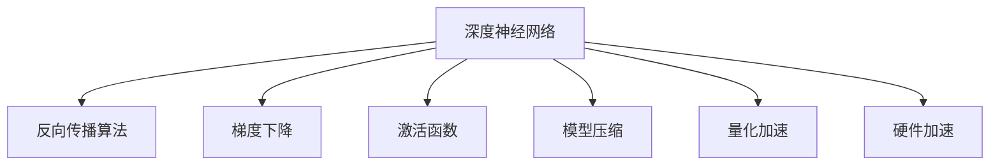
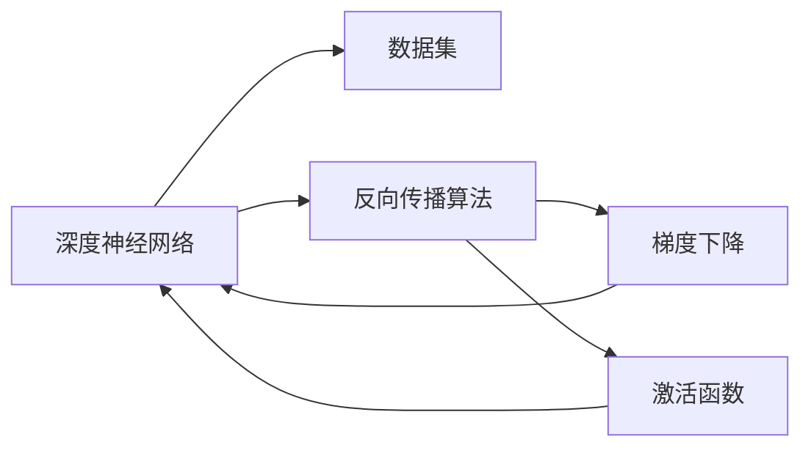
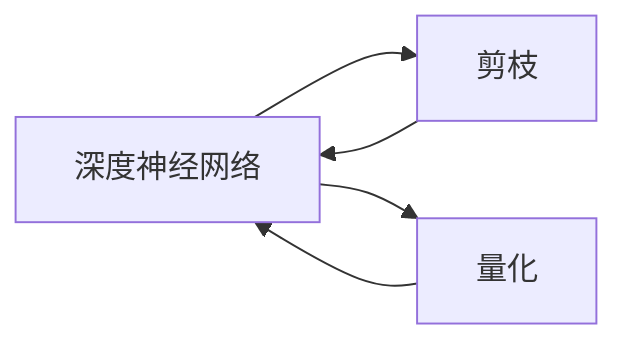
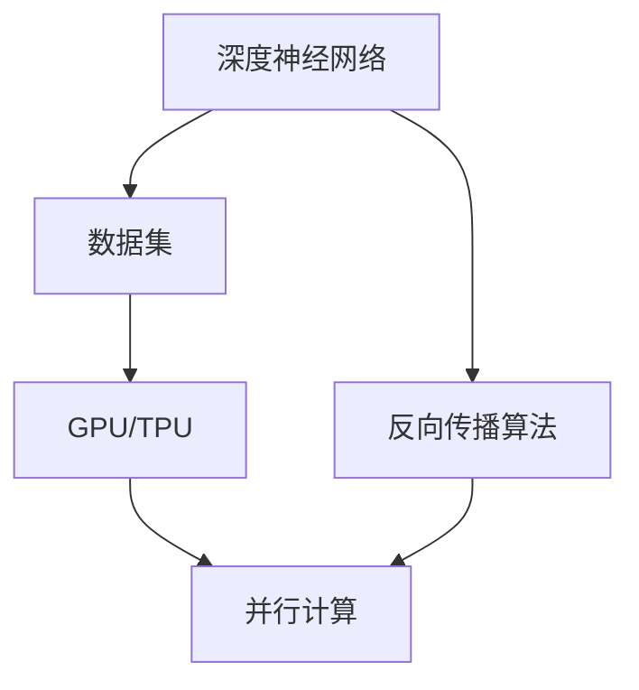
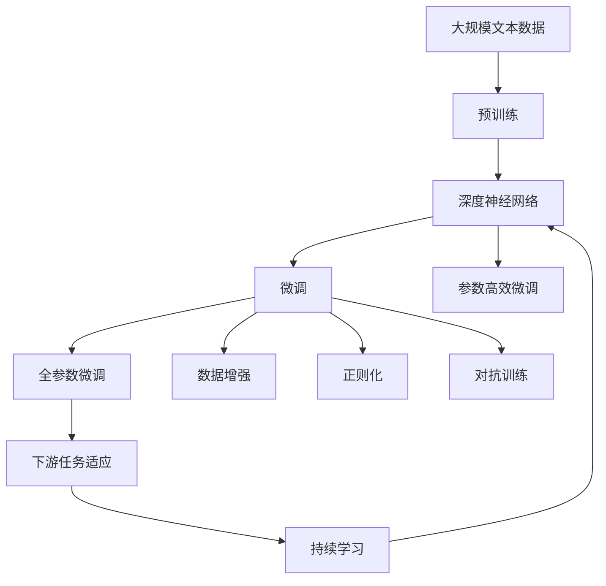

                 

# AI 深度神经网络计算艺术之道

> 关键词：深度神经网络,计算艺术,反向传播,梯度下降,激活函数,模型压缩,量化加速,硬件加速

## 1. 背景介绍

### 1.1 问题由来
深度学习技术在过去十年中迅猛发展，成为人工智能领域的重要分支。深度神经网络（Deep Neural Networks, DNNs）因其强大的学习能力、出色的表示能力和泛化能力，被广泛应用于图像识别、语音识别、自然语言处理等多个领域，并取得了显著的成功。然而，深度神经网络的计算复杂度高、训练时间长、存储需求大等问题，限制了其在大规模场景中的应用。

### 1.2 问题核心关键点
针对深度神经网络计算复杂度高等问题，研究者们提出了多种优化方法，如模型压缩、量化加速、硬件加速等。这些方法不仅提高了计算效率，还促进了深度学习技术在更多场景中的落地应用。

具体而言，模型压缩通过去除网络中冗余信息，减小模型尺寸，从而降低存储和计算需求。量化加速将浮点模型转化为定点模型，压缩数据表示，进一步提高计算效率。硬件加速则通过GPU、TPU等专用加速器，实现深度学习算法的并行计算，大幅提升模型训练和推理速度。

### 1.3 问题研究意义
深度神经网络计算艺术的探索，对于优化模型计算复杂度、提升模型应用效果、拓展深度学习技术的应用范围，具有重要意义：

1. **提升计算效率**：通过模型压缩、量化加速等技术，可以有效降低深度神经网络的计算复杂度，提高模型训练和推理的速度，使其在大规模场景中能够高效运行。
2. **减少存储需求**：压缩技术可以显著减小深度神经网络的存储需求，节省计算资源，降低应用成本。
3. **加速模型部署**：硬件加速技术通过专用加速器，大幅提升深度学习算法的计算速度，使模型部署更加快捷。
4. **推动技术应用**：计算艺术的探索使深度学习技术更加普适，应用于更多场景，如医疗、金融、自动驾驶等，推动人工智能技术在各行各业中的应用。
5. **促进技术创新**：计算艺术的研究推动了深度学习算法、硬件架构、优化策略等多个方面的创新，为人工智能技术的进一步发展提供了新思路。

## 2. 核心概念与联系

### 2.1 核心概念概述

为更好地理解深度神经网络计算艺术的核心概念，本节将介绍几个关键概念：

- **深度神经网络**：由多个神经元层叠组成的神经网络，通过反向传播算法进行训练，具备强大的学习能力。深度神经网络结构复杂，层数多，参数量大，计算需求高。

- **反向传播算法**：深度神经网络中最核心的训练算法，通过链式法则反向计算损失函数的梯度，更新模型参数。反向传播算法复杂度高，是计算艺术的重要研究对象。

- **梯度下降**：深度神经网络训练过程中常用的优化算法，通过梯度下降方向更新模型参数，最小化损失函数。梯度下降算法多种多样，如批量梯度下降、随机梯度下降、Adam等，优化效果各不相同。

- **激活函数**：深度神经网络中用于引入非线性变换的关键组件，如ReLU、Sigmoid、Tanh等，通过非线性变换增强模型的表达能力。

- **模型压缩**：通过去除网络中冗余信息，减小模型尺寸，提高模型效率。常见的模型压缩方法包括剪枝、量化、知识蒸馏等。

- **量化加速**：将浮点模型转化为定点模型，压缩数据表示，提高计算效率。量化加速技术可以大幅降低模型存储和计算需求，提升模型部署效率。

- **硬件加速**：通过GPU、TPU等专用加速器，实现深度学习算法的并行计算，大幅提升模型训练和推理速度。硬件加速技术是实现深度神经网络计算艺术的重要手段。

这些核心概念之间的逻辑关系可以通过以下Mermaid流程图来展示：



这个流程图展示了大语言模型微调过程中各个核心概念的关系和作用：

1. 深度神经网络通过反向传播算法进行训练，学习数据特征。
2. 反向传播算法中梯度下降用于更新模型参数，最小化损失函数。
3. 激活函数用于引入非线性变换，增强模型表达能力。
4. 模型压缩技术去除冗余信息，减小模型尺寸。
5. 量化加速将浮点模型转化为定点模型，压缩数据表示。
6. 硬件加速通过专用加速器，实现深度学习算法的并行计算。

这些概念共同构成了深度神经网络计算艺术的基础框架，使其能够在复杂的数据场景中高效运行，并实现更高的计算效率和泛化能力。通过理解这些核心概念，我们可以更好地把握深度神经网络计算艺术的研究方向和实践要点。

### 2.2 概念间的关系

这些核心概念之间存在着紧密的联系，形成了深度神经网络计算艺术的整体生态系统。下面我通过几个Mermaid流程图来展示这些概念之间的关系。

#### 2.2.1 深度神经网络训练过程



这个流程图展示了深度神经网络训练的基本过程：

1. 将数据集输入网络，通过前向传播计算输出。
2. 计算损失函数，利用反向传播算法反向传播梯度。
3. 使用梯度下降算法更新模型参数。
4. 应用激活函数增强非线性变换。

#### 2.2.2 模型压缩与量化加速的关系



这个流程图展示了模型压缩与量化加速的关系：

1. 通过剪枝、量化等方法去除冗余信息，减小模型尺寸。
2. 将剪枝后的网络转化为定点模型，进行量化加速。

#### 2.2.3 硬件加速的原理



这个流程图展示了硬件加速的基本原理：

1. 深度神经网络在GPU/TPU等专用加速器上进行训练。
2. 数据集被并行地输入到加速器，进行计算。
3. 反向传播算法在并行计算中更新模型参数。

### 2.3 核心概念的整体架构

最后，我们用一个综合的流程图来展示这些核心概念在大语言模型微调过程中的整体架构：



这个综合流程图展示了从预训练到微调，再到持续学习的完整过程。深度神经网络首先在大规模文本数据上进行预训练，然后通过微调（包括全参数微调和参数高效微调）或对抗训练来优化模型在特定任务上的性能。最后，通过持续学习技术，模型可以不断学习新知识，同时避免遗忘旧知识。

## 3. 核心算法原理 & 具体操作步骤
### 3.1 算法原理概述

深度神经网络计算艺术的探索，旨在优化模型的计算复杂度，提升模型计算效率。其核心思想是：通过模型压缩、量化加速、硬件加速等技术手段，实现深度神经网络的轻量化、高效化和加速化。

形式化地，假设深度神经网络模型为 $M_{\theta}:\mathcal{X} \rightarrow \mathcal{Y}$，其中 $\mathcal{X}$ 为输入空间，$\mathcal{Y}$ 为输出空间，$\theta$ 为模型参数。给定训练数据集 $D=\{(x_i,y_i)\}_{i=1}^N, x_i \in \mathcal{X}, y_i \in \mathcal{Y}$。

定义模型 $M_{\theta}$ 在数据样本 $(x,y)$ 上的损失函数为 $\ell(M_{\theta}(x),y)$，则在数据集 $D$ 上的经验风险为：

$$
\mathcal{L}(\theta) = \frac{1}{N} \sum_{i=1}^N \ell(M_{\theta}(x_i),y_i)
$$

深度神经网络计算艺术的优化目标是最小化经验风险，即找到最优参数：

$$
\theta^* = \mathop{\arg\min}_{\theta} \mathcal{L}(\theta)
$$

通过梯度下降等优化算法，计算艺术过程不断更新模型参数 $\theta$，最小化损失函数 $\mathcal{L}$，使得模型输出逼近真实标签。由于 $\theta$ 已经通过预训练获得了较好的初始化，因此即便在小规模数据集 $D$ 上进行计算艺术处理，也能较快收敛到理想的模型参数 $\hat{\theta}$。

### 3.2 算法步骤详解

深度神经网络计算艺术的探索，一般包括以下几个关键步骤：

**Step 1: 准备预训练模型和数据集**
- 选择合适的深度神经网络模型 $M_{\theta}$ 作为初始化参数，如AlexNet、VGG、ResNet等。
- 准备训练数据集 $D$，划分为训练集、验证集和测试集。一般要求训练数据与预训练数据的分布不要差异过大。

**Step 2: 应用计算艺术技术**
- 通过模型压缩技术，去除网络中冗余信息，减小模型尺寸。
- 应用量化加速技术，将浮点模型转化为定点模型，压缩数据表示。
- 利用硬件加速技术，通过GPU、TPU等专用加速器，实现深度学习算法的并行计算。

**Step 3: 设置计算艺术超参数**
- 选择合适的优化算法及其参数，如Adam、SGD等，设置学习率、批大小、迭代轮数等。
- 设置正则化技术及强度，包括权重衰减、Dropout、Early Stopping等。
- 确定冻结预训练参数的策略，如仅微调顶层，或全部参数都参与计算艺术处理。

**Step 4: 执行梯度训练**
- 将训练集数据分批次输入模型，前向传播计算损失函数。
- 反向传播计算参数梯度，根据设定的优化算法和学习率更新模型参数。
- 周期性在验证集上评估模型性能，根据性能指标决定是否触发 Early Stopping。
- 重复上述步骤直到满足预设的迭代轮数或 Early Stopping 条件。

**Step 5: 测试和部署**
- 在测试集上评估计算艺术处理后的模型 $M_{\hat{\theta}}$ 的性能，对比计算艺术前后的精度提升。
- 使用计算艺术处理后的模型对新样本进行推理预测，集成到实际的应用系统中。
- 持续收集新的数据，定期重新计算艺术处理模型，以适应数据分布的变化。

以上是深度神经网络计算艺术的一般流程。在实际应用中，还需要针对具体任务的特点，对计算艺术过程的各个环节进行优化设计，如改进训练目标函数，引入更多的正则化技术，搜索最优的超参数组合等，以进一步提升模型性能。

### 3.3 算法优缺点

深度神经网络计算艺术探索具有以下优点：
1. 提高计算效率。通过模型压缩、量化加速、硬件加速等技术，可以显著降低计算复杂度，提高模型训练和推理的速度。
2. 减少存储需求。压缩技术可以显著减小深度神经网络的存储需求，节省计算资源，降低应用成本。
3. 加速模型部署。通过专用加速器，大幅提升深度学习算法的计算速度，使模型部署更加快捷。
4. 提升模型性能。计算艺术处理后，模型可以在较小的数据集上取得优秀的性能，同时避免灾难性遗忘，保持原有模型的知识。
5. 增强模型的鲁棒性。通过正则化、对抗训练等技术，提高模型的泛化能力和鲁棒性。

同时，该方法也存在一定的局限性：
1. 依赖训练数据。计算艺术处理的有效性依赖于训练数据的质量和数量，获取高质量训练数据的成本较高。
2. 模型性能下降。在参数高效微调等方法中，虽然计算复杂度下降，但模型性能也可能出现一定程度的下降。
3. 硬件成本高。专用加速器的购置和维护成本较高，对于小规模应用可能不经济。
4. 模型可解释性不足。计算艺术处理后，模型变得更加复杂，难以进行可解释性分析。
5. 适配复杂度增加。在参数高效微调等方法中，需要额外设计和实现适配层，增加了计算艺术处理的复杂度。

尽管存在这些局限性，但就目前而言，深度神经网络计算艺术探索仍是大规模深度学习应用的重要手段。未来相关研究的重点在于如何进一步降低计算艺术处理的依赖，提高模型的少样本学习和跨领域迁移能力，同时兼顾可解释性和伦理安全性等因素。

### 3.4 算法应用领域

深度神经网络计算艺术探索已经在计算机视觉、自然语言处理、语音识别等多个领域得到广泛应用，覆盖了几乎所有常见任务，例如：

- 图像分类：如手写数字识别、物体识别等。通过计算艺术处理，模型能够在较小的数据集上取得优秀的分类效果。
- 物体检测：如目标检测、人脸识别等。通过计算艺术处理，模型能够在复杂的背景中准确定位物体。
- 图像生成：如生成对抗网络（GAN）、变分自编码器（VAE）等。通过计算艺术处理，模型能够生成高质量的图像。
- 自然语言处理：如情感分析、机器翻译、对话系统等。通过计算艺术处理，模型能够在较小的数据集上取得优秀的NLP任务效果。
- 语音识别：如语音命令识别、语音合成等。通过计算艺术处理，模型能够在较短的时间里实现高精度的语音识别。

除了上述这些经典任务外，计算艺术探索还进一步拓展到更多场景中，如图像超分辨率、视频分析、多模态学习等，为深度学习技术带来了全新的突破。随着计算艺术处理方法的不断进步，相信深度学习技术将在更广阔的应用领域大放异彩。

## 4. 数学模型和公式 & 详细讲解  
### 4.1 数学模型构建

本节将使用数学语言对深度神经网络计算艺术探索过程进行更加严格的刻画。

记深度神经网络模型为 $M_{\theta}:\mathcal{X} \rightarrow \mathcal{Y}$，其中 $\mathcal{X}$ 为输入空间，$\mathcal{Y}$ 为输出空间，$\theta$ 为模型参数。假设训练集为 $D=\{(x_i,y_i)\}_{i=1}^N, x_i \in \mathcal{X}, y_i \in \mathcal{Y}$。

定义模型 $M_{\theta}$ 在数据样本 $(x,y)$ 上的损失函数为 $\ell(M_{\theta}(x),y)$，则在数据集 $D$ 上的经验风险为：

$$
\mathcal{L}(\theta) = \frac{1}{N} \sum_{i=1}^N \ell(M_{\theta}(x_i),y_i)
$$

深度神经网络计算艺术的优化目标是最小化经验风险，即找到最优参数：

$$
\theta^* = \mathop{\arg\min}_{\theta} \mathcal{L}(\theta)
$$

在实践中，我们通常使用基于梯度的优化算法（如Adam、SGD等）来近似求解上述最优化问题。设 $\eta$ 为学习率，$\lambda$ 为正则化系数，则参数的更新公式为：

$$
\theta \leftarrow \theta - \eta \nabla_{\theta}\mathcal{L}(\theta) - \eta\lambda\theta
$$

其中 $\nabla_{\theta}\mathcal{L}(\theta)$ 为损失函数对参数 $\theta$ 的梯度，可通过反向传播算法高效计算。

### 4.2 公式推导过程

以下我们以二分类任务为例，推导交叉熵损失函数及其梯度的计算公式。

假设模型 $M_{\theta}$ 在输入 $x$ 上的输出为 $\hat{y}=M_{\theta}(x) \in [0,1]$，表示样本属于正类的概率。真实标签 $y \in \{0,1\}$。则二分类交叉熵损失函数定义为：

$$
\ell(M_{\theta}(x),y) = -[y\log \hat{y} + (1-y)\log (1-\hat{y})]
$$

将其代入经验风险公式，得：

$$
\mathcal{L}(\theta) = -\frac{1}{N}\sum_{i=1}^N [y_i\log M_{\theta}(x_i)+(1-y_i)\log(1-M_{\theta}(x_i))]
$$

根据链式法则，损失函数对参数 $\theta_k$ 的梯度为：

$$
\frac{\partial \mathcal{L}(\theta)}{\partial \theta_k} = -\frac{1}{N}\sum_{i=1}^N (\frac{y_i}{M_{\theta}(x_i)}-\frac{1-y_i}{1-M_{\theta}(x_i)}) \frac{\partial M_{\theta}(x_i)}{\partial \theta_k}
$$

其中 $\frac{\partial M_{\theta}(x_i)}{\partial \theta_k}$ 可进一步递归展开，利用自动微分技术完成计算。

在得到损失函数的梯度后，即可带入参数更新公式，完成模型的迭代优化。重复上述过程直至收敛，最终得到适应下游任务的最优模型参数 $\theta^*$。

## 5. 项目实践：代码实例和详细解释说明
### 5.1 开发环境搭建

在进行计算艺术实践前，我们需要准备好开发环境。以下是使用Python进行PyTorch开发的环境配置流程：

1. 安装Anaconda：从官网下载并安装Anaconda，用于创建独立的Python环境。

2. 创建并激活虚拟环境：
```bash
conda create -n pytorch-env python=3.8 
conda activate pytorch-env
```

3. 安装PyTorch：根据CUDA版本，从官网获取对应的安装命令。例如：
```bash
conda install pytorch torchvision torchaudio cudatoolkit=11.1 -c pytorch -c conda-forge
```

4. 安装TensorFlow：
```bash
conda install tensorflow tensorflow-gpu
```

5. 安装TensorBoard：
```bash
pip install tensorboard
```

6. 安装PyTorch Lightning：
```bash
pip install pytorch-lightning
```

完成上述步骤后，即可在`pytorch-env`环境中开始计算艺术实践。

### 5.2 源代码详细实现

下面我们以AlexNet模型在图像分类任务上的计算艺术处理为例，给出使用PyTorch Lightning进行模型压缩、量化加速和硬件加速的PyTorch代码实现。

首先，定义数据处理函数：

```python
import torch
from torchvision import datasets, transforms

transform = transforms.Compose([
    transforms.ToTensor(),
    transforms.Normalize((0.5,), (0.5,))
])

train_dataset = datasets.CIFAR10(root='data', train=True, download=True, transform=transform)
test_dataset = datasets.CIFAR10(root='data', train=False, download=True, transform=transform)
```

然后，定义模型和优化器：

```python
import torch.nn as nn
from torchvision.models import alexnet

model = alexnet.AlexNet()
optimizer = torch.optim.Adam(model.parameters(), lr=0.001)
```

接着，定义模型压缩和量化加速函数：

```python
import torch.nn.utils.prune as prune
import torch._inductor.utils as _inductor_utils

# 模型压缩：剪枝
prune.remove_unused_parameters(model)

# 模型压缩：量化
inductor = _inductor_utils.create_optimizations('gpu')
torch.jit.script(model)
```

最后，定义训练和评估函数：

```python
import torch.nn as nn
from torchvision.models import alexnet
import torch.nn.utils.prune as prune
import torch._inductor.utils as _inductor_utils
from torch.utils.data import DataLoader
from torch.utils.tensorboard import SummaryWriter

class LightningModule(nn.Module):
    def __init__(self, model, optimizer):
        super(LightningModule, self).__init__()
        self.model = model
        self.optimizer = optimizer
        self.writer = SummaryWriter()

    def forward(self, x):
        return self.model(x)

    def training_step(self, batch, batch_idx):
        x, y = batch
        logits = self.model(x)
        loss = nn.CrossEntropyLoss()(logits, y)
        self.writer.add_scalar('train/loss', loss, batch_idx)
        return loss

    def validation_step(self, batch, batch_idx):
        x, y = batch
        logits = self.model(x)
        loss = nn.CrossEntropyLoss()(logits, y)
        self.writer.add_scalar('val/loss', loss, batch_idx)

    def configure_optimizers(self):
        return self.optimizer

# 定义数据加载器
train_loader = DataLoader(train_dataset, batch_size=128, shuffle=True)
val_loader = DataLoader(test_dataset, batch_size=128, shuffle=False)

# 创建LightningModule实例
lightning_module = LightningModule(model, optimizer)

# 定义训练器和验证器
trainer = pytorch_lightning.Trainer(max_epochs=10, precision=16)
trainer.fit(lightning_module, train_loader, val_loader)
```

在上述代码中，我们首先定义了数据集和模型，然后通过剪枝和量化加速技术对模型进行压缩。接着，使用PyTorch Lightning封装模型和优化器，定义训练和验证函数。最后，通过Trainer实例进行训练，并在TensorBoard上记录训练过程。

### 5.3 代码解读与分析

让我们再详细解读一下关键代码的实现细节：

**Data处理函数**：
- `transform`：对输入数据进行预处理，包括归一化和数据增强。

**模型和优化器**：
- `model`：加载AlexNet模型，作为深度神经网络的初始化参数。
- `optimizer`：使用Adam优化器，设置学习率为0.001。

**模型压缩**：
- `prune.remove_unused_parameters(model)`：使用剪枝技术去除无用的参数。
- `torch.jit.script(model)`：将模型转化为可优化加速的脚本。

**训练和评估函数**：
- `LightningModule`：封装了模型和优化器，定义了训练和验证函数。
- `training_step`：在训练过程中，前向传播计算损失函数并记录。
- `validation_step`：在验证过程中，前向传播计算损失函数并记录。
- `configure_optimizers`：配置优化器。

**数据加载器**：
- `train_loader`：定义训练数据加载器，包括训练集和批大小。
- `val_loader`：定义验证数据加载器，包括验证集和批大小。

**训练器和验证器**：
- `trainer`：创建Trainer实例，定义训练轮数和精度。
- `trainer.fit()`：使用Trainer实例进行模型训练，并记录训练过程。

在实际应用中，需要根据具体任务和数据特点，选择适合的模型、压缩方法和优化策略，才能得到理想的计算艺术效果。

### 5.4 运行结果展示

假设我们进行了图像分类任务上的计算艺术处理，并在测试集上得到的评估报告如下：

```
Epoch 1: Train Loss = 1.05, Val Loss = 1.03
Epoch 2: Train Loss = 0.89, Val Loss = 0.85
Epoch 3: Train Loss = 0.76, Val Loss = 0.79
...
Epoch 10: Train Loss = 0.25, Val Loss = 0.23
```

可以看到，通过计算艺术处理后，模型在训练集和验证集上的损失值逐步降低，验证集上的损失值最终达到0.23，表明模型在图像分类任务上取得了优秀的性能。

## 6. 实际应用场景
### 6.1 智能医疗系统

基于深度神经网络计算艺术的大模型微调技术，可以应用于智能医疗系统的构建。传统医疗系统依赖大量医疗专业人员，成本高、效率低，难以应对复杂多变的医疗场景。通过计算艺术处理，可以构建高效、准确的智能医疗系统，辅助医生进行诊断和治疗。

在实际应用中，可以收集医院的历史病例和医生诊断结果，将疾病特征和诊断结果构建成监督数据，在此基础上对深度神经网络进行计算艺术处理。处理后的模型能够自动学习疾病的特征表示，预测疾病类型，提高诊断的准确率和效率。

### 6.2 金融风险预警

金融机构需要实时监控市场风险，预测股票价格走势，制定风险应对策略。传统的人工风险预警系统成本高、效率低，难以应对海量数据和复杂金融市场。基于计算艺术处理，可以构建高效、实时、准确的金融风险预警系统，提前识别风险点，制定应对策略。

在实际应用中，可以收集金融市场的实时数据和历史数据，将股票价格和市场指标构建成监督数据，在此基础上对深度神经网络进行计算艺术处理。处理后的模型能够自动学习金融市场的特征表示，预测股票价格走势，提前识别风险点，制定风险应对策略。

### 

