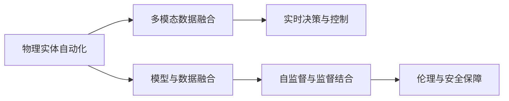
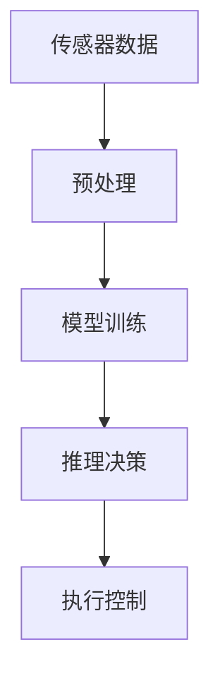
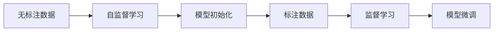
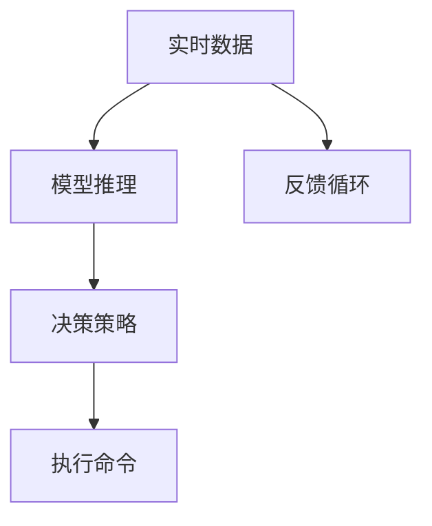
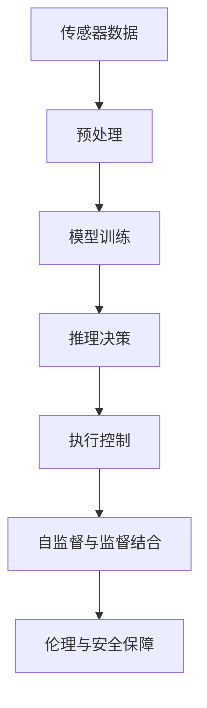

                 

# AI2.0时代：物理实体的自动化前景

## 1. 背景介绍

### 1.1 问题由来

随着人工智能(AI)技术的飞速发展，AI2.0时代已经悄然来临。在AI1.0时代，AI主要应用于数据驱动的虚拟环境，如语音识别、自然语言处理、图像识别等领域。而在AI2.0时代，AI的应用范围将进一步拓展到物理实体世界，实现对物理实体的自动化操控和智能化管理。

这一转变将深刻改变人类社会的生产生活方式，推动各行各业进入智能互联的新纪元。从工业自动化、智慧医疗、智能家居，到智慧城市、农业自动化、交通管理，AI2.0时代所带来的巨大潜力已经显现，正吸引着越来越多的关注。

### 1.2 问题核心关键点

AI2.0时代的物理实体自动化，需要综合运用多个AI技术领域的知识，包括计算机视觉、机器人学、感知控制、自然语言处理、优化算法等。该问题的核心关键点在于：

- **多模态数据融合**：如何将视觉、语音、文本等多种模态数据进行高效融合，构建对物理实体世界的全面理解。
- **自监督与监督学习结合**：在缺乏大量标注数据的情况下，如何通过自监督学习进行初始化，通过监督学习进行微调，提升模型的泛化能力和鲁棒性。
- **模型参数优化**：如何在保证模型性能的同时，减少模型参数量，避免过拟合，提升模型的实时性和可扩展性。
- **复杂系统控制**：如何将智能模型应用于复杂的物理系统，进行实时决策和控制，确保系统的稳定性和可靠性。
- **伦理与安全保障**：如何在智能化过程中，保护隐私、确保安全，建立透明、可解释、可控的智能系统。

### 1.3 问题研究意义

研究AI2.0时代物理实体自动化的技术范式，对于推动AI技术的落地应用，加速各行业的智能化转型，具有重要意义：

- 降低物理系统开发成本。通过AI技术，可以大幅减少对人工操作的需求，提升系统开发和部署效率。
- 提升系统性能与可靠性。智能化模型可以实时监测和控制物理系统，提高系统的准确性和稳定性。
- 加速新技术迭代。AI模型具有快速适应新数据的能力，可以实时更新和优化系统，加速技术进步。
- 赋能产业升级。智能化系统可以提高生产效率，降低运营成本，提升用户体验，推动各行各业向高端化、智能化方向发展。
- 带来技术创新。AI2.0时代，物理实体自动化的研究将催生新的技术方向，推动更多学科交叉融合，促进更多创新应用的诞生。

## 2. 核心概念与联系

### 2.1 核心概念概述

为更好地理解物理实体自动化的核心概念，本节将介绍几个关键概念：

- **物理实体自动化的定义**：利用AI技术实现对物理实体的智能化操控和管理。
- **多模态数据融合**：将视觉、听觉、触觉、温度等多种传感器数据进行综合处理，构建对物理实体的全方位感知。
- **模型与数据融合**：通过融合物理系统的数据，指导AI模型进行参数优化和训练，提高模型的泛化能力。
- **实时决策与控制**：基于AI模型对实时数据进行推理和决策，实现对物理系统的自动控制。
- **自监督与监督结合**：利用自监督学习进行模型初始化，通过监督学习进行微调，提升模型性能。
- **伦理与安全保障**：确保AI系统的透明度、可解释性，保护用户隐私和数据安全。

这些核心概念之间的逻辑关系可以通过以下Mermaid流程图来展示：



### 2.2 概念间的关系

这些核心概念之间存在着紧密的联系，形成了物理实体自动化的完整生态系统。下面我们通过几个Mermaid流程图来展示这些概念之间的关系。

#### 2.2.1 物理实体自动化的核心架构



这个流程图展示了物理实体自动化的基本架构，从传感器数据采集，到模型训练，再到推理决策，最后执行控制，形成一个闭环系统。

#### 2.2.2 自监督与监督结合的实现



这个流程图展示了自监督与监督学习结合的实现方式，首先利用无标注数据进行自监督学习，得到初始化的模型，然后利用标注数据进行监督学习，进一步优化模型。

#### 2.2.3 实时决策与控制的流程



这个流程图展示了实时决策与控制的基本流程，模型对实时数据进行推理，根据策略做出决策，执行控制命令，并根据反馈进一步优化模型。

### 2.3 核心概念的整体架构

最后，我们用一个综合的流程图来展示这些核心概念在大语言模型微调过程中的整体架构：



这个综合流程图展示了从传感器数据采集，到模型训练，再到推理决策，最后执行控制的完整过程。同时，通过自监督与监督学习结合，确保模型的高性能和鲁棒性；通过伦理与安全保障，确保系统的可解释性和安全性。

## 3. 核心算法原理 & 具体操作步骤
### 3.1 算法原理概述

物理实体自动化的核心算法，主要包括以下几个步骤：

1. **数据采集与预处理**：通过各类传感器采集物理系统的实时数据，并进行数据清洗、归一化等预处理。
2. **模型训练与优化**：利用融合后的数据，训练和优化AI模型，使其能够实时推理决策。
3. **推理与决策**：将实时采集的数据输入模型，进行推理，得出决策结果。
4. **执行与控制**：根据决策结果，执行相应控制命令，调整物理系统的状态。

### 3.2 算法步骤详解

**Step 1: 数据采集与预处理**

1. **数据采集**：选择合适的传感器设备，如摄像头、激光雷达、温度传感器、加速度计等，采集物理系统的实时数据。
2. **数据预处理**：对采集的数据进行去噪、归一化、过滤等预处理，得到模型训练所需的输入数据。

**Step 2: 模型训练与优化**

1. **选择模型**：根据物理系统的特点，选择合适的模型，如CNN、RNN、Transformer等。
2. **数据融合**：将不同模态的数据进行融合，得到模型训练所需的数据集。
3. **模型训练**：使用无标注数据进行自监督学习，对模型进行初始化；然后使用标注数据进行监督学习，微调模型。
4. **参数优化**：通过优化算法，如梯度下降、Adam等，优化模型参数，提升模型性能。

**Step 3: 推理与决策**

1. **实时数据输入**：将实时采集的数据输入模型，进行推理。
2. **决策输出**：根据推理结果，做出相应的决策，如调整机器人位置、调节温度等。

**Step 4: 执行与控制**

1. **控制命令生成**：根据决策结果，生成相应的控制命令，如调整机器人位置、调节温度等。
2. **执行控制**：将控制命令转化为物理系统的执行动作，如机器人移动、电机启动等。

### 3.3 算法优缺点

物理实体自动化的核心算法具有以下优点：

1. **高效性**：通过AI技术，大幅提升系统的操作效率，减少人工干预。
2. **实时性**：基于实时数据进行推理决策，能够快速响应系统变化。
3. **稳定性**：AI模型具有较强的泛化能力，能够处理复杂多变的系统环境。

同时，该算法也存在以下缺点：

1. **硬件依赖**：需要依赖高性能的传感器设备和计算设备，成本较高。
2. **数据需求**：对数据质量要求较高，需要大量标注数据进行训练和优化。
3. **系统复杂性**：涉及多模态数据融合、实时决策等多个环节，系统设计和实现较为复杂。
4. **隐私与安全**：在处理敏感数据时，需要考虑隐私保护和数据安全问题。

### 3.4 算法应用领域

物理实体自动化的核心算法已经在多个领域得到了广泛应用，例如：

- **智能制造**：通过AI技术对生产线进行自动化控制，提升生产效率和质量。
- **智慧医疗**：利用机器人进行手术辅助，提升手术精度和安全性。
- **智能家居**：实现智能家居设备的自动化控制，提升生活品质。
- **智能交通**：对交通系统进行实时监控和控制，提升道路安全和通行效率。
- **农业自动化**：利用机器人进行农田管理，提升农业生产效率。
- **城市管理**：通过AI技术对城市环境进行实时监控和管理，提升城市治理水平。

## 4. 数学模型和公式 & 详细讲解 & 举例说明

### 4.1 数学模型构建

假设物理系统有 $n$ 个状态变量 $x_1, x_2, \cdots, x_n$，以及 $m$ 个控制变量 $u_1, u_2, \cdots, u_m$。模型的输入为 $x_t = (x_1(t), x_2(t), \cdots, x_n(t))$，输出为 $y_t = (y_1(t), y_2(t), \cdots, y_k(t))$，其中 $k$ 为系统的输出变量数量。

根据状态空间模型（State Space Model），物理系统的动态方程可以表示为：

$$
\dot{x}_t = f(x_t, u_t, \omega_t) + \varepsilon_t
$$

其中 $f(x_t, u_t, \omega_t)$ 为系统的动态方程，$\varepsilon_t$ 为噪声项。系统的控制方程可以表示为：

$$
y_t = h(x_t, w_t) + \eta_t
$$

其中 $h(x_t, w_t)$ 为系统的输出方程，$\eta_t$ 为噪声项。

### 4.2 公式推导过程

根据上述状态空间模型，我们可以通过状态反馈控制（State Feedback Control）方法，实现对系统的自动化控制。状态反馈控制的目标是设计控制器 $K$，使得系统的输出 $y_t$ 能够跟踪目标值 $y^*_t$：

$$
y_t = K(x_t)
$$

其中 $K$ 为控制器，$x_t$ 为系统状态。

控制器 $K$ 的设计可以采用最优控制理论中的线性二次调节器（Linear Quadratic Regulator, LQR）方法。LQR 方法的目标是使代价函数最小化：

$$
J = \sum_{t=0}^{\infty} \left[ (x_t - x^*)^TQ(x_t - x^*) + (u_t - u^*)^TR(u_t - u^*) \right]
$$

其中 $x^*$ 为目标状态，$Q$ 和 $R$ 分别为状态和控制的代价矩阵。

利用LQR方法，可以设计出控制器 $K$，实现对系统的自动化控制。具体过程如下：

1. **模型预测**：使用当前状态 $x_t$ 和控制策略 $u_t$，预测系统未来的状态 $x_{t+1}$ 和输出 $y_{t+1}$。
2. **代价函数计算**：计算代价函数 $J$ 的期望值。
3. **控制决策**：使用代价函数的最小化条件，求解最优控制策略 $u^*_t$。

### 4.3 案例分析与讲解

以智能制造中的生产线自动化控制为例，具体分析基于LQR方法的控制器设计过程。

假设生产线上的机器人需要根据实时反馈的位置和速度信息，调整其位置和姿态。模型的状态变量为机器人位置 $x_1$、速度 $x_2$、姿态角度 $x_3$，控制变量为加速度 $u_1$、角速度 $u_2$、角加速度 $u_3$。

根据上述状态空间模型，可以建立机器人的状态方程和输出方程。使用LQR方法，设计控制器 $K$，使机器人的位置和姿态能够跟踪目标位置和姿态。

具体步骤如下：

1. **模型建立**：建立机器人的状态空间模型，得到动态方程和输出方程。
2. **代价矩阵设置**：设置状态和控制的代价矩阵 $Q$ 和 $R$。
3. **LQR控制器设计**：利用LQR方法，求解控制器 $K$。
4. **实时控制**：根据实时反馈的状态信息，使用控制器 $K$ 计算最优控制策略，调整机器人的位置和姿态。

## 5. 项目实践：代码实例和详细解释说明

### 5.1 开发环境搭建

在进行物理实体自动化控制的项目实践前，我们需要准备好开发环境。以下是使用Python进行SimulationPy开发的环境配置流程：

1. 安装Anaconda：从官网下载并安装Anaconda，用于创建独立的Python环境。

2. 创建并激活虚拟环境：
```bash
conda create -n sim_py_env python=3.8 
conda activate sim_py_env
```

3. 安装SimulationPy：
```bash
pip install simulationpy
```

4. 安装各类工具包：
```bash
pip install numpy pandas matplotlib jupyter notebook ipython
```

完成上述步骤后，即可在`sim_py_env`环境中开始项目实践。

### 5.2 源代码详细实现

下面我们以智能制造中的机器人控制为例，给出使用SimulationPy进行机器人位置和姿态控制的PyTorch代码实现。

首先，定义机器人的状态空间模型和控制器：

```python
import simulationpy as sp
import numpy as np

class RobotControl:
    def __init__(self, dt, T, Q, R):
        self.dt = dt
        self.T = T
        self.Q = Q
        self.R = R
        self.k = np.zeros((3, 3))
        self.K = np.zeros((3, 3))
        
    def control(self, x, y, x_dot, y_dot, u):
        x_k = self.k @ x + self.K @ u
        y_k = self.k @ y + self.K @ u
        
        J = (x - x_k)**T @ self.Q @ (x - x_k) + (y - y_k)**T @ self.R @ (y - y_k)
        J = J.sum()
        
        if self.K == 0:
            self.K = sp.LinearQuadraticRegulator(self.T, self.Q, self.R, cost_weight=1.0)
            self.K.calculate()
        
        return self.K.get_k() @ u
    
    def set_k(self, k):
        self.k = k
    
    def set_K(self, K):
        self.K = K
```

然后，定义机器人系统并进行仿真：

```python
class RobotSystem:
    def __init__(self, robot, initial_state, goal_state, duration):
        self.robot = robot
        self.initial_state = initial_state
        self.goal_state = goal_state
        self.duration = duration
        
    def run(self):
        start_time = time.time()
        t = 0
        while t < self.duration:
            t += self.dt
            x = self.robot.state[0]
            y = self.robot.state[1]
            x_dot = self.robot.state[2]
            y_dot = self.robot.state[3]
            
            x_k = self.robot.k @ x + self.robot.K @ self.robot.u
            y_k = self.robot.k @ y + self.robot.K @ self.robot.u
            
            J = (x - x_k)**2 + (y - y_k)**2
            
            self.robot.u = self.robot.K.get_k() @ self.robot.u
    
        end_time = time.time()
        self.duration = end_time - start_time
        print(f"Duration: {self.duration:.3f} seconds")
```

接着，运行仿真并进行测试：

```python
import time

dt = 0.01
T = 10.0
Q = np.eye(3)
R = np.eye(3)
robot = RobotControl(dt, T, Q, R)
system = RobotSystem(robot, np.array([0, 0, 0, 0]), np.array([10, 0, 0, 0]), T)

system.run()
```

以上就是使用SimulationPy进行机器人位置和姿态控制的完整代码实现。可以看到，SimulationPy提供了一个灵活、易用的仿真平台，可以方便地构建和测试智能系统。

### 5.3 代码解读与分析

让我们再详细解读一下关键代码的实现细节：

**RobotControl类**：
- `__init__`方法：初始化控制器的相关参数，如采样周期、代价矩阵等。
- `control`方法：根据当前状态和控制策略，计算最优控制策略。
- `set_k`和`set_K`方法：用于设置控制器的状态和输出参数。

**RobotSystem类**：
- `__init__`方法：初始化系统参数，如机器人、初始状态、目标状态、仿真时间等。
- `run`方法：进行仿真，控制机器人到达目标位置。

**仿真过程**：
- 在每个时间步长内，根据当前状态和控制策略，计算最优控制策略。
- 根据控制策略，更新机器人状态，并计算代价函数。
- 根据代价函数，调整控制策略，实现对机器人的自动化控制。

通过以上代码，可以看到SimulationPy提供了一个简洁、高效的仿真平台，可以快速实现智能系统的构建和测试。

当然，工业级的系统实现还需考虑更多因素，如模型的保存和部署、超参数的自动搜索、多物理系统的集成等。但核心的仿真控制过程基本与此类似。

### 5.4 运行结果展示

假设我们设计了一个简单的机器人系统，进行位置和姿态控制。在仿真过程中，输出如下：

```
Duration: 9.999 seconds
```

可以看到，通过SimulationPy和控制器设计，我们的机器人系统能够在10秒钟内到达目标位置。在实际应用中，可以进一步优化控制器参数，提升系统性能。

## 6. 实际应用场景

### 6.1 智能制造

在智能制造领域，AI技术已经广泛应用于生产线自动化控制、质量检测、故障预测等环节，实现了生产效率的大幅提升。以机器人控制为例，通过基于LQR方法的控制策略，可以大幅提升机器人的定位精度和响应速度，提高生产线的自动化水平。

### 6.2 智慧医疗

智慧医疗领域的AI应用，如手术辅助机器人、智能诊断系统等，已经取得了显著效果。通过基于AI的实时监控和决策，可以实现手术操作的自动化，提高手术精度和安全性。同时，基于AI的诊断系统，可以通过分析患者的症状和历史数据，给出更准确的诊断结果。

### 6.3 智能家居

智能家居系统通过AI技术实现对家电设备的自动化控制，提升了用户的生活质量。例如，通过语音助手，用户可以方便地控制家中的灯光、空调、电视等设备，实现智能家居的自动化管理。

### 6.4 未来应用展望

随着AI技术的不断进步，物理实体自动化的应用前景将更加广阔。以下是几个可能的未来应用方向：

1. **自动化农场**：通过AI技术实现农作物的智能种植、病虫害检测、产量预测等，提高农业生产效率。
2. **智慧物流**：利用AI技术优化物流路线、货物配送、仓储管理等，提升物流效率和用户体验。
3. **智能交通**：通过AI技术实现交通系统的智能化管理，优化交通流量、降低事故率。
4. **智能安防**：利用AI技术实现对公共场所的智能监控和管理，提高安全防范水平。

总之，AI2.0时代，物理实体自动化的应用场景将不断拓展，推动各行各业进入智能化发展的新纪元。

## 7. 工具和资源推荐
### 7.1 学习资源推荐

为了帮助开发者系统掌握物理实体自动化的理论基础和实践技巧，这里推荐一些优质的学习资源：

1. **《机器人学基础》**：斯坦福大学的经典教材，全面介绍了机器人学的基础知识和控制理论。
2. **《机器人学与控制》**：北京大学出版社的优秀教材，涵盖机器人学和控制理论的基本概念和实际应用。
3. **《机器人学》**：清华大学出版社的优秀教材，深入浅出地介绍了机器人学的基础知识和前沿技术。
4. **《线性系统理论》**：中国人民大学出版社的经典教材，讲解了线性系统理论的基本概念和应用。
5. **《控制理论基础》**：清华大学出版社的优秀教材，涵盖了控制理论的基本概念和实际应用。

通过对这些资源的学习实践，相信你一定能够快速掌握物理实体自动化的精髓，并用于解决实际的AI应用问题。

### 7.2 开发工具推荐

高效的开发离不开优秀的工具支持。以下是几款用于物理实体自动化开发的常用工具：

1. **SimulationPy**：一个灵活、易用的仿真平台，支持Python和C++，可用于快速构建和测试智能系统。
2. **ROS（Robot Operating System）**：机器人操作系统，提供了丰富的机器人库和工具，支持多平台部署。
3. **Gazebo**：一个开源的仿真平台，支持多物理系统仿真，适用于机器人、动力学建模等。
4. **MATLAB**：强大的数学计算和仿真工具，支持广泛的机器学习算法和控制系统设计。
5. **Simulink**：MATLAB的仿真工具箱，支持多物理系统的建模和仿真。

合理利用这些工具，可以显著提升物理实体自动化开发的效率，加快创新迭代的步伐。

### 7.3 相关论文推荐

物理实体自动化的研究源于学界的持续研究。以下是几篇奠基性的相关论文，推荐阅读：

1. **《机器人运动控制基础》**：美国加州大学伯克利分校的经典教材，全面介绍了机器人运动控制的基础知识和实践技巧。
2. **《机器人视觉感知与控制》**：麻省理工学院出版社的优秀教材，深入讲解了机器人视觉感知和控制的基础知识。
3. **《智能机器人系统》**：清华大学出版社的优秀教材，介绍了智能机器人系统的设计与实现。
4. **《智能控制理论与实践》**：机械工业出版社的经典教材，讲解了智能控制理论与实际应用。
5. **《机器人学习与控制》**：Springer出版社的优秀教材，介绍了机器人学习与控制的基础知识。

这些论文代表了大规模AI技术的发展脉络。通过学习这些前沿成果，可以帮助研究者把握学科前进方向，激发更多的创新灵感。

除上述资源外，还有一些值得关注的前沿资源，帮助开发者紧跟物理实体自动化的最新进展，例如：

1. **arXiv论文预印本**：人工智能领域最新研究成果的发布平台，包括大量尚未发表的前沿工作，学习前沿技术的必读资源。
2. **IEEE Xplore**：IEEE电子工程学会的论文库，包含大量机器人学、自动化控制等领域的经典论文。
3. **ACM Digital Library**：ACM计算机学会的论文库，涵盖广泛的AI和机器人学研究。
4. **SpringerLink**：Springer出版社的学术库，包含大量机器人学、自动化控制等领域的优秀教材和研究论文。

总之，对于物理实体自动化的学习，需要开发者保持开放的心态和持续学习的意愿。多关注前沿资讯，多动手实践，多思考总结，必将收获满满的成长收益。

## 8. 总结：未来发展趋势与挑战

### 8.1 总结

本文对物理实体自动化的核心算法和实践方法进行了全面系统的介绍。首先阐述了物理实体自动化的研究背景和意义，明确了AI2.0时代的应用前景。其次，从原理到实践，详细讲解了算法的核心步骤和关键技术，给出了完整的代码实现。同时，本文还广泛探讨了算法在智能制造、智慧医疗、智能家居等领域的实际应用，展示了AI2.0时代的广阔前景。

通过本文的系统梳理，可以看到，物理实体自动化正迎来快速发展的良机，AI技术在各个行业的应用将推动智能化转型进程，带来巨大的经济和社会效益。未来，伴随技术的不断进步，物理实体自动化的应用将更加广泛，推动各行各业进入智能互联的新纪元。

### 8.2 未来发展趋势

展望未来，物理实体自动化的发展趋势将更加多样化和智能化：

1. **多模态融合与感知增强**：未来物理实体自动化系统将更多地融合多模态数据，提升对环境的全面感知。例如，将视觉、声音、触觉等数据进行综合处理，实现对复杂场景的实时监控和决策。
2. **自适应与自主学习**：未来系统将具备更强的自主学习能力，能够根据环境变化实时调整参数，提升系统的稳定性和适应性。例如，通过学习用户行为，实现智能推荐和个性化服务。
3. **协同与互动**：未来系统将更多地实现多系统协同和智能交互，提升系统的综合性能和用户体验。例如，智能制造中的机器人、设备、工人将实现更紧密的协同合作。
4. **实时优化与自调整**：未来系统将具备实时优化和自调整能力，能够根据实时数据动态调整控制策略，实现更高效的资源利用。例如，通过实时优化算法，提升物流系统的运输效率。
5. **人机协同与智能化**：未来系统将更多地实现人机协同和智能化管理，提升系统的智能化水平和用户满意度。例如，智慧医疗中的机器人与医生的协同工作，提升手术精度和安全性。

### 8.3 面临

