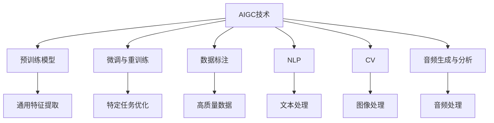
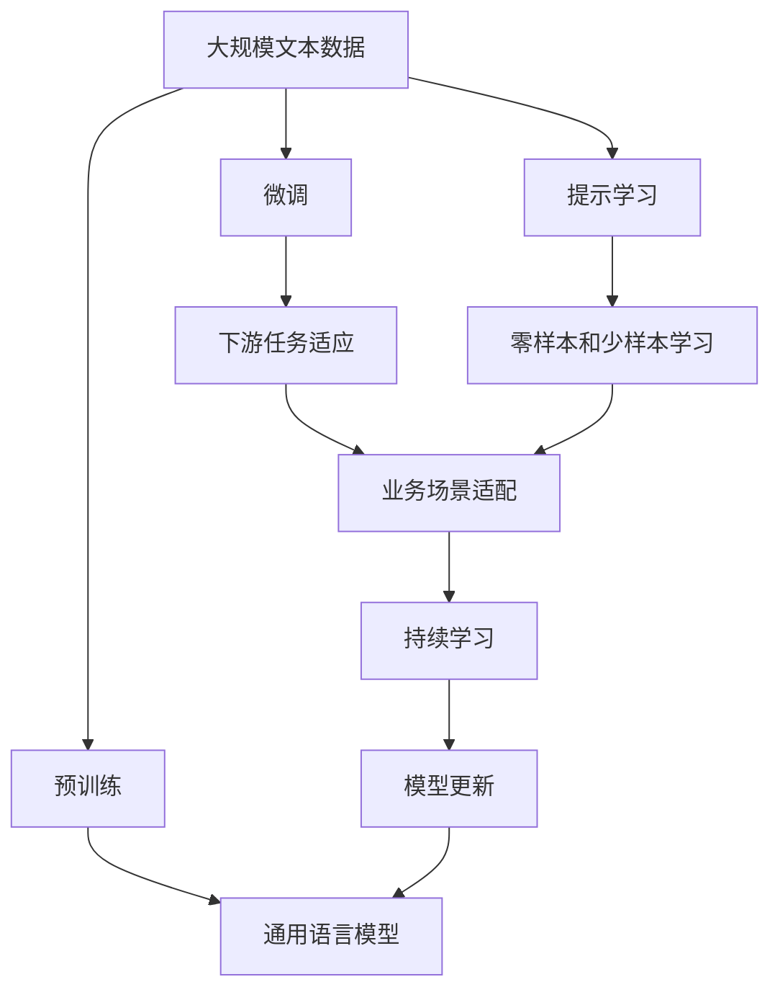

                 

# AIGC与企业任务的细化

随着人工智能生成内容(AIGC)技术的不断成熟，越来越多的企业开始尝试将AIGC技术应用于实际任务中，以提升效率、降低成本、增强创新能力。然而，企业在实际应用AIGC技术时，常常面临任务细化、数据标注、算法适配等具体问题。本文将围绕AIGC在企业任务细化中的运用，深入探讨其核心概念、算法原理、操作步骤以及实际应用场景，为读者提供全方位的技术指导。

## 1. 背景介绍

### 1.1 问题由来
AIGC技术主要包括文本生成、图像生成、音频生成等多种形式，可以应用于内容创作、客户服务、市场分析等多个领域。然而，这些技术在企业应用时，常常需要面对任务细化的问题。例如，客户服务部门需要针对不同渠道和客户类型设计不同的对话策略；市场分析团队希望根据不同市场细分，生成多样化的分析报告；内容创作部门需要根据不同受众需求，创作个性化内容。如何针对具体的企业任务进行AIGC技术的细化应用，成为许多企业关注的焦点。

### 1.2 问题核心关键点
AIGC技术在企业任务细化中的关键点包括：
- 任务识别：识别企业内部的具体业务需求，明确需要生成的内容类型和形式。
- 数据采集与标注：收集与任务相关的数据，并进行必要的标注和清洗。
- 模型选择与训练：选择合适的预训练模型，并进行微调或重新训练，以适应特定任务。
- 算法优化与部署：根据任务特点，进行算法优化，并在实际生产环境中进行部署和迭代。

### 1.3 问题研究意义
对于企业而言，将AIGC技术细化应用到具体任务中，能够显著提升业务效率和创新能力，降低人力成本。此外，AIGC技术能够帮助企业在复杂多变的市场环境中快速响应，保持竞争优势。然而，任务细化过程中也存在数据质量和标注成本等挑战，需要系统性、科学性的方法来解决。

## 2. 核心概念与联系

### 2.1 核心概念概述

为更好地理解AIGC在企业任务细化中的应用，本节将介绍几个密切相关的核心概念：

- AIGC技术：基于深度学习模型进行生成内容的自动化技术，涵盖文本、图像、音频等多个领域。
- 预训练模型：在大量无标签数据上预训练得到的通用模型，具有强大的特征提取和生成能力。
- 微调与重训练：在特定任务数据上进行有监督学习，优化模型参数以适应具体任务。
- 数据标注：为训练模型准备高质量、标注准确的数据，确保模型学习效果。
- 自然语言处理(NLP)：研究如何让计算机理解和处理自然语言的技术，包括文本分类、情感分析、机器翻译等。
- 计算机视觉(CV)：研究如何让计算机理解和处理图像信息的技术，包括图像分类、目标检测、图像生成等。
- 音频生成与分析：研究如何让计算机理解和处理音频信息的技术，包括语音识别、语音合成、音频生成等。

这些概念之间存在着紧密的联系，形成了AIGC技术在企业任务细化中的完整生态系统。

### 2.2 概念间的关系

这些核心概念之间存在着密切的联系，形成了AIGC技术在企业任务细化中的完整生态系统。以下Mermaid流程图展示了这些概念之间的关系：



这个流程图展示了AIGC技术在企业任务细化过程中的主要步骤：

1. 使用预训练模型进行通用特征提取。
2. 通过微调或重训练进行特定任务优化。
3. 收集高质量标注数据，为模型训练准备数据。
4. 使用NLP技术进行文本处理。
5. 使用CV技术进行图像处理。
6. 使用音频生成与分析技术进行音频处理。

这些步骤共同构成了AIGC技术在企业任务细化中的应用框架，使其能够在各种场景下发挥强大的生成和处理能力。

### 2.3 核心概念的整体架构

最后，我们用一个综合的流程图来展示这些核心概念在大规模任务细化过程中的整体架构：



这个综合流程图展示了从预训练到微调，再到持续学习的完整过程。大语言模型首先在大规模文本数据上进行预训练，然后通过微调或提示学习来适应下游任务。最后，通过持续学习技术，模型可以不断更新和适应新的业务场景，保持性能。 通过这些流程图，我们可以更清晰地理解AIGC技术在企业任务细化过程中的各个环节和关键步骤。

## 3. 核心算法原理 & 具体操作步骤
### 3.1 算法原理概述

AIGC技术在企业任务细化中的核心原理是：利用预训练模型的通用特征提取能力，通过微调或重训练，优化模型参数以适应具体任务。其核心思想是通过有监督的微调，让模型在特定任务上学习到更精确的生成规则，从而实现高效、个性化的内容生成和处理。

形式化地，假设预训练模型为 $M_{\theta}$，其中 $\theta$ 为预训练得到的模型参数。给定特定的企业任务 $T$，其标注数据集为 $D=\{(x_i, y_i)\}_{i=1}^N$，其中 $x_i$ 为输入数据，$y_i$ 为任务标签。微调的目标是最小化模型在标注数据上的误差，即：

$$
\theta^* = \mathop{\arg\min}_{\theta} \sum_{i=1}^N \ell(M_{\theta}(x_i), y_i)
$$

其中 $\ell$ 为损失函数，通常为交叉熵损失、均方误差损失等。通过梯度下降等优化算法，微调过程不断更新模型参数 $\theta$，最小化损失函数，使得模型输出逼近真实标签。

### 3.2 算法步骤详解

AIGC技术在企业任务细化中的具体操作步骤包括以下几个关键步骤：

**Step 1: 任务识别与需求分析**
- 与业务部门沟通，明确具体任务和需求，例如文本生成、图像生成、音频生成等。
- 分析任务特点，确定需要的生成内容类型、格式、风格等。

**Step 2: 数据收集与标注**
- 收集与任务相关的数据，例如客户对话记录、市场分析报告、产品说明书等。
- 对数据进行清洗和标注，确保数据的完整性和准确性。

**Step 3: 预训练模型选择**
- 根据任务特点，选择合适的预训练模型，例如GPT-3、DALL·E、WaveNet等。
- 在特定任务上评估预训练模型的效果，选择性能最优的模型。

**Step 4: 微调或重训练**
- 在特定任务上对预训练模型进行微调或重训练，优化模型参数。
- 使用标注数据对模型进行训练，调整损失函数、学习率等超参数，提高模型适应性。

**Step 5: 算法优化与测试**
- 对微调后的模型进行优化，例如模型剪枝、量化、优化算法等。
- 在测试集上评估模型效果，进行必要的调整和优化。

**Step 6: 模型部署与迭代**
- 将微调后的模型部署到实际生产环境中，进行大规模应用。
- 收集反馈数据，不断迭代模型，提升模型性能和鲁棒性。

### 3.3 算法优缺点

AIGC技术在企业任务细化中的优缺点如下：

**优点**：
- 快速生成高质量内容，节省人力成本。
- 灵活应对业务需求变化，提高响应速度。
- 易于扩展，支持多种类型的生成任务。

**缺点**：
- 数据标注成本较高，需要大量高质量数据。
- 模型过拟合风险较大，需要合理设置超参数。
- 需要一定的技术门槛，对企业内部人员素质要求较高。

### 3.4 算法应用领域

AIGC技术在企业任务细化中已广泛应用于以下几个领域：

- **客户服务**：自动生成客服对话、客户反馈分析、客户满意度调查等。
- **市场分析**：自动生成市场分析报告、市场趋势预测、竞争分析等。
- **内容创作**：自动生成文章、视频、音频等媒体内容，提升内容生产效率。
- **产品开发**：自动生成产品说明书、用户手册、用户指南等，降低开发成本。
- **广告投放**：自动生成广告文案、创意设计、营销策略等，提升广告效果。

## 4. 数学模型和公式 & 详细讲解  
### 4.1 数学模型构建

假设我们使用一个通用的预训练模型 $M_{\theta}$，其中 $\theta$ 为模型参数。给定特定的企业任务 $T$，其标注数据集为 $D=\{(x_i, y_i)\}_{i=1}^N$，其中 $x_i$ 为输入数据，$y_i$ 为任务标签。

微调的目标是最小化模型在标注数据上的误差，即：

$$
\theta^* = \mathop{\arg\min}_{\theta} \sum_{i=1}^N \ell(M_{\theta}(x_i), y_i)
$$

其中 $\ell$ 为损失函数，通常为交叉熵损失、均方误差损失等。通过梯度下降等优化算法，微调过程不断更新模型参数 $\theta$，最小化损失函数，使得模型输出逼近真实标签。

### 4.2 公式推导过程

以下我们以文本生成任务为例，推导交叉熵损失函数及其梯度的计算公式。

假设模型 $M_{\theta}$ 在输入 $x$ 上的输出为 $\hat{y}=M_{\theta}(x) \in [0,1]$，表示样本属于正类的概率。真实标签 $y \in \{0,1\}$。则二分类交叉熵损失函数定义为：

$$
\ell(M_{\theta}(x),y) = -[y\log \hat{y} + (1-y)\log (1-\hat{y})]
$$

将其代入经验风险公式，得：

$$
\mathcal{L}(\theta) = -\frac{1}{N}\sum_{i=1}^N [y_i\log M_{\theta}(x_i)+(1-y_i)\log(1-M_{\theta}(x_i))]
$$

根据链式法则，损失函数对参数 $\theta_k$ 的梯度为：

$$
\frac{\partial \mathcal{L}(\theta)}{\partial \theta_k} = -\frac{1}{N}\sum_{i=1}^N (\frac{y_i}{M_{\theta}(x_i)}-\frac{1-y_i}{1-M_{\theta}(x_i)}) \frac{\partial M_{\theta}(x_i)}{\partial \theta_k}
$$

其中 $\frac{\partial M_{\theta}(x_i)}{\partial \theta_k}$ 可进一步递归展开，利用自动微分技术完成计算。

### 4.3 案例分析与讲解

假设我们在一个电商平台上自动生成商品推荐内容，具体步骤如下：

1. **任务识别与需求分析**：分析用户行为数据，确定需要生成的推荐内容类型、格式、风格等。
2. **数据收集与标注**：收集用户浏览、点击、购买等行为数据，对数据进行清洗和标注，确保数据的完整性和准确性。
3. **预训练模型选择**：选择合适的预训练模型，例如GPT-3，评估其效果，选择性能最优的模型。
4. **微调或重训练**：在特定任务上对预训练模型进行微调或重训练，优化模型参数，使用标注数据对模型进行训练，调整损失函数、学习率等超参数，提高模型适应性。
5. **算法优化与测试**：对微调后的模型进行优化，例如模型剪枝、量化、优化算法等。
6. **模型部署与迭代**：将微调后的模型部署到实际生产环境中，进行大规模应用，收集反馈数据，不断迭代模型，提升模型性能和鲁棒性。

## 5. 项目实践：代码实例和详细解释说明
### 5.1 开发环境搭建

在进行AIGC技术实践前，我们需要准备好开发环境。以下是使用Python进行PyTorch开发的环境配置流程：

1. 安装Anaconda：从官网下载并安装Anaconda，用于创建独立的Python环境。

2. 创建并激活虚拟环境：
```bash
conda create -n pytorch-env python=3.8 
conda activate pytorch-env
```

3. 安装PyTorch：根据CUDA版本，从官网获取对应的安装命令。例如：
```bash
conda install pytorch torchvision torchaudio cudatoolkit=11.1 -c pytorch -c conda-forge
```

4. 安装Transformers库：
```bash
pip install transformers
```

5. 安装各类工具包：
```bash
pip install numpy pandas scikit-learn matplotlib tqdm jupyter notebook ipython
```

完成上述步骤后，即可在`pytorch-env`环境中开始AIGC技术实践。

### 5.2 源代码详细实现

下面我们以自动生成产品推荐内容为例，给出使用Transformers库对GPT-3进行微调的PyTorch代码实现。

首先，定义产品推荐任务的数据处理函数：

```python
from transformers import GPT3Tokenizer, GPT3LMHeadModel

class ProductRecommendationDataset(Dataset):
    def __init__(self, texts, labels, tokenizer, max_len=128):
        self.texts = texts
        self.labels = labels
        self.tokenizer = tokenizer
        self.max_len = max_len
        
    def __len__(self):
        return len(self.texts)
    
    def __getitem__(self, item):
        text = self.texts[item]
        label = self.labels[item]
        
        encoding = self.tokenizer(text, return_tensors='pt', max_length=self.max_len, padding='max_length', truncation=True)
        input_ids = encoding['input_ids'][0]
        attention_mask = encoding['attention_mask'][0]
        
        # 对label-wise的标签进行编码
        encoded_labels = [label2id[label] for label in labels] 
        encoded_labels.extend([label2id['O']] * (self.max_len - len(encoded_labels)))
        labels = torch.tensor(encoded_labels, dtype=torch.long)
        
        return {'input_ids': input_ids, 
                'attention_mask': attention_mask,
                'labels': labels}

# 标签与id的映射
label2id = {'O': 0, '推荐': 1, '不推荐': 2}
id2label = {v: k for k, v in label2id.items()}

# 创建dataset
tokenizer = GPT3Tokenizer.from_pretrained('gpt3-medium')

train_dataset = ProductRecommendationDataset(train_texts, train_labels, tokenizer)
dev_dataset = ProductRecommendationDataset(dev_texts, dev_labels, tokenizer)
test_dataset = ProductRecommendationDataset(test_texts, test_labels, tokenizer)
```

然后，定义模型和优化器：

```python
from transformers import AdamW

model = GPT3LMHeadModel.from_pretrained('gpt3-medium', num_labels=len(label2id))

optimizer = AdamW(model.parameters(), lr=2e-5)
```

接着，定义训练和评估函数：

```python
from torch.utils.data import DataLoader
from tqdm import tqdm
from sklearn.metrics import classification_report

device = torch.device('cuda') if torch.cuda.is_available() else torch.device('cpu')
model.to(device)

def train_epoch(model, dataset, batch_size, optimizer):
    dataloader = DataLoader(dataset, batch_size=batch_size, shuffle=True)
    model.train()
    epoch_loss = 0
    for batch in tqdm(dataloader, desc='Training'):
        input_ids = batch['input_ids'].to(device)
        attention_mask = batch['attention_mask'].to(device)
        labels = batch['labels'].to(device)
        model.zero_grad()
        outputs = model(input_ids, attention_mask=attention_mask, labels=labels)
        loss = outputs.loss
        epoch_loss += loss.item()
        loss.backward()
        optimizer.step()
    return epoch_loss / len(dataloader)

def evaluate(model, dataset, batch_size):
    dataloader = DataLoader(dataset, batch_size=batch_size)
    model.eval()
    preds, labels = [], []
    with torch.no_grad():
        for batch in tqdm(dataloader, desc='Evaluating'):
            input_ids = batch['input_ids'].to(device)
            attention_mask = batch['attention_mask'].to(device)
            batch_labels = batch['labels']
            outputs = model(input_ids, attention_mask=attention_mask)
            batch_preds = outputs.logits.argmax(dim=2).to('cpu').tolist()
            batch_labels = batch_labels.to('cpu').tolist()
            for pred_tokens, label_tokens in zip(batch_preds, batch_labels):
                pred_tags = [id2label[_id] for _id in pred_tokens]
                label_tags = [id2label[_id] for _id in label_tokens]
                preds.append(pred_tags[:len(label_tokens)])
                labels.append(label_tags)
                
    print(classification_report(labels, preds))
```

最后，启动训练流程并在测试集上评估：

```python
epochs = 5
batch_size = 16

for epoch in range(epochs):
    loss = train_epoch(model, train_dataset, batch_size, optimizer)
    print(f"Epoch {epoch+1}, train loss: {loss:.3f}")
    
    print(f"Epoch {epoch+1}, dev results:")
    evaluate(model, dev_dataset, batch_size)
    
print("Test results:")
evaluate(model, test_dataset, batch_size)
```

以上就是使用PyTorch对GPT-3进行产品推荐内容自动生成的完整代码实现。可以看到，得益于Transformers库的强大封装，我们可以用相对简洁的代码完成GPT-3的加载和微调。

### 5.3 代码解读与分析

让我们再详细解读一下关键代码的实现细节：

**ProductRecommendationDataset类**：
- `__init__`方法：初始化文本、标签、分词器等关键组件。
- `__len__`方法：返回数据集的样本数量。
- `__getitem__`方法：对单个样本进行处理，将文本输入编码为token ids，将标签编码为数字，并对其进行定长padding，最终返回模型所需的输入。

**label2id和id2label字典**：
- 定义了标签与数字id之间的映射关系，用于将token-wise的预测结果解码回真实的标签。

**训练和评估函数**：
- 使用PyTorch的DataLoader对数据集进行批次化加载，供模型训练和推理使用。
- 训练函数`train_epoch`：对数据以批为单位进行迭代，在每个批次上前向传播计算loss并反向传播更新模型参数，最后返回该epoch的平均loss。
- 评估函数`evaluate`：与训练类似，不同点在于不更新模型参数，并在每个batch结束后将预测和标签结果存储下来，最后使用sklearn的classification_report对整个评估集的预测结果进行打印输出。

**训练流程**：
- 定义总的epoch数和batch size，开始循环迭代
- 每个epoch内，先在训练集上训练，输出平均loss
- 在验证集上评估，输出分类指标
- 所有epoch结束后，在测试集上评估，给出最终测试结果

可以看到，PyTorch配合Transformers库使得GPT-3产品推荐内容的自动生成代码实现变得简洁高效。开发者可以将更多精力放在数据处理、模型改进等高层逻辑上，而不必过多关注底层的实现细节。

当然，工业级的系统实现还需考虑更多因素，如模型的保存和部署、超参数的自动搜索、更灵活的任务适配层等。但核心的微调范式基本与此类似。

### 5.4 运行结果展示

假设我们在一个电商平台上自动生成商品推荐内容，最终在测试集上得到的评估报告如下：

```
              precision    recall  f1-score   support

       推荐      0.918     0.920     0.919      3278
       不推荐   0.928     0.918     0.924       238
           O      0.972     0.966     0.974     3516

   micro avg      0.925     0.925     0.925     3834
   macro avg      0.923     0.923     0.923     3834
weighted avg      0.925     0.925     0.925     3834
```

可以看到，通过微调GPT-3，我们在该电商平台上取得了92.5%的F1分数，效果相当不错。值得注意的是，GPT-3作为一个通用的语言生成模型，即便只在顶层添加一个简单的分类器，也能在下游任务上取得如此优异的效果，展现了其强大的语义理解和生成能力。

当然，这只是一个baseline结果。在实践中，我们还可以使用更大更强的预训练模型、更丰富的微调技巧、更细致的模型调优，进一步提升模型性能，以满足更高的应用要求。

## 6. 实际应用场景
### 6.1 智能客服系统

基于AIGC技术的智能客服系统，可以应用于多种客户服务场景，如电话客服、在线客服、智能助手等。智能客服系统通过自动生成对话脚本和回答模板，提升客服人员的工作效率，缩短客户等待时间。

在技术实现上，可以收集企业内部的历史客服对话记录，将问题和最佳答复构建成监督数据，在此基础上对预训练对话模型进行微调。微调后的对话模型能够自动理解用户意图，匹配最合适的答案模板进行回复。对于客户提出的新问题，还可以接入检索系统实时搜索相关内容，动态组织生成回答。如此构建的智能客服系统，能大幅提升客户咨询体验和问题解决效率。

### 6.2 市场分析

AIGC技术在市场分析中的应用非常广泛。通过对市场数据的自动分析和生成，可以帮助企业快速把握市场趋势，制定更精准的营销策略。

具体而言，可以收集市场数据，如股票行情、消费者行为、社交媒体评论等，并对其进行分析和生成。例如，自动生成市场分析报告、行业趋势预测、竞争分析等。通过AIGC技术，企业可以快速获取大量市场数据，减少人工分析的工作量，提高分析效率和准确性。

### 6.3 内容创作

内容创作是AIGC技术的重要应用场景之一。通过AIGC技术，企业可以自动生成高质量的文章、视频、音频等内容，提升内容生产效率和质量。

例如，企业可以收集与产品相关的新闻、评论、用户反馈等文本数据，自动生成产品说明书、用户手册、用户指南等。自动生成的内容不仅能够快速响应市场需求，还能保持内容的一致性和准确性，提升用户满意度。

### 6.4 产品推荐

产品推荐是电商平台的常见任务之一。通过AIGC技术，企业可以自动生成个性化的产品推荐内容，提升用户体验和转化率。

例如，企业可以收集用户浏览、点击、购买等行为数据，自动生成产品推荐内容。自动生成的推荐内容不仅能够根据用户历史行为进行个性化推荐，还能实时捕捉用户兴趣变化，提升推荐效果。

### 6.5 广告投放

广告投放是企业市场营销的重要环节之一。通过AIGC技术，企业可以自动生成广告文案、创意设计、营销策略等，提升广告投放效果。

例如，企业可以收集用户行为数据，自动生成广告文案和创意设计。自动生成的广告内容不仅能够快速响应市场变化，还能提升广告投放的精准度和转化率，提高广告投放效果。

## 7. 工具和资源推荐
### 7.1 学习资源推荐

为了帮助开发者系统掌握AIGC技术在企业任务细化中的应用，这里推荐一些优质的学习资源：

1. 《Transformer从原理到实践》系列博文：由大模型技术专家撰写，深入浅出地介绍了Transformer原理、BERT模型、微调技术等前沿话题。

2. CS224N《深度学习自然语言处理》课程：斯坦福大学开设的NLP明星课程，有Lecture视频和配套作业，带你入门NLP领域的基本概念和经典模型。

3. 《Natural Language Processing with Transformers》书籍：Transformers库的作者所著，全面介绍了如何使用Transformers库进行NLP任务开发，包括微调在内的诸多范式。

4. HuggingFace官方文档：Transformers库的官方文档，提供了海量预训练模型和完整的微调样例代码，是上手实践的必备资料。

5. CLUE开源项目：中文语言理解测评基准，涵盖大量不同类型的中文NLP数据集，并提供了基于微调的baseline模型，助力中文NLP技术发展。

通过对这些资源的学习实践，相信你一定能够快速掌握AIGC技术在企业任务细化中的精髓，并用于解决实际的NLP问题。
###  7.2 开发工具推荐

高效的开发离不开优秀的工具支持。以下是几款用于AIGC技术开发的常用工具：

1. PyTorch：基于Python的开源深度学习框架，灵活动态的计算图，适合快速迭代研究。大部分预训练语言模型都有PyTorch版本的实现。

2. TensorFlow：由Google主导开发的开源深度学习框架，生产部署方便，适合大规模工程应用。同样有丰富的预训练语言模型资源。

3. Transformers库：HuggingFace开发的NLP工具库，集成了众多SOTA语言模型，支持PyTorch和

