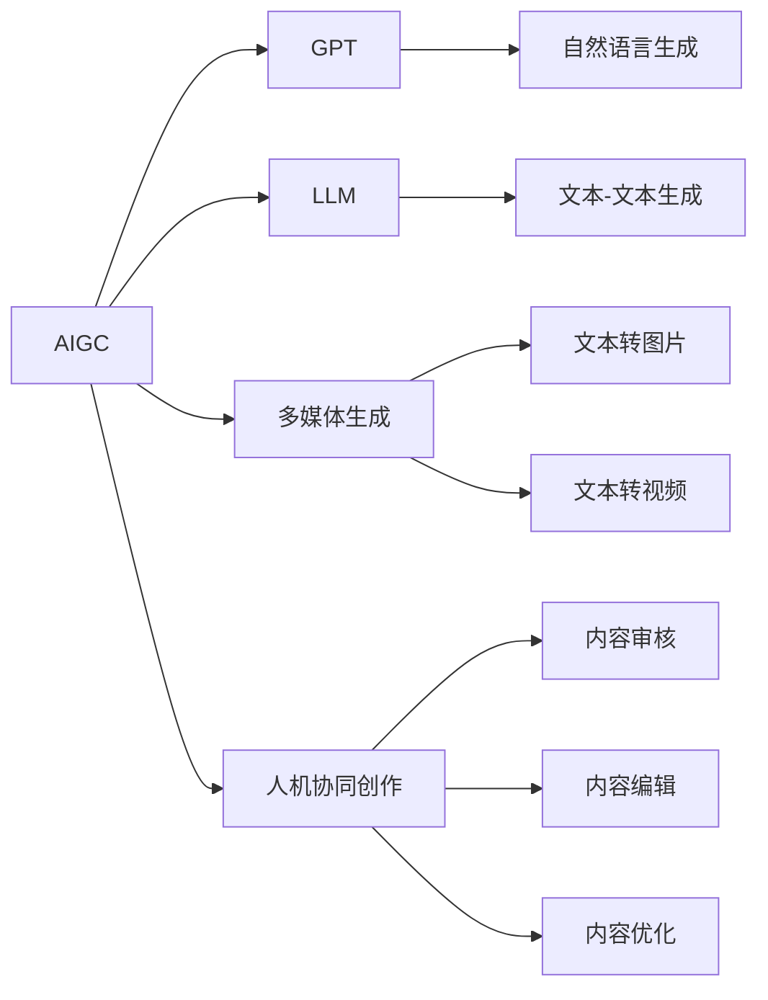
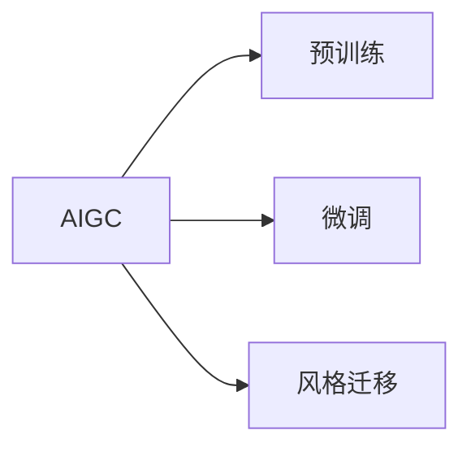
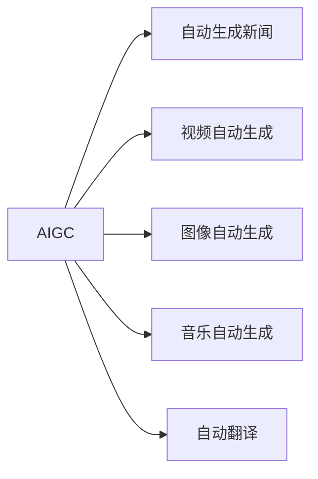
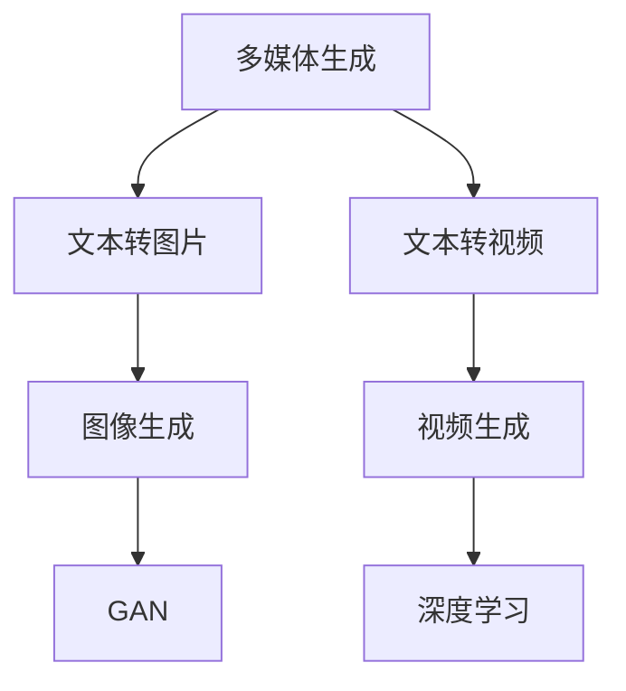
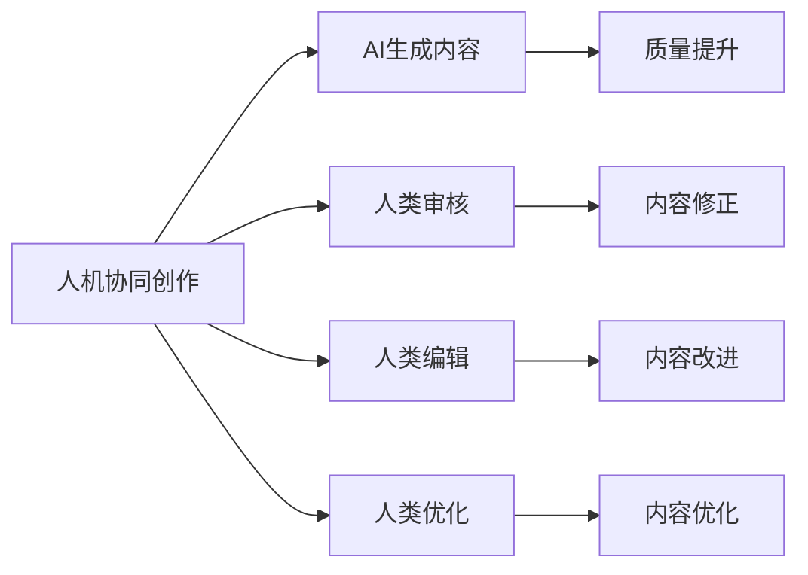
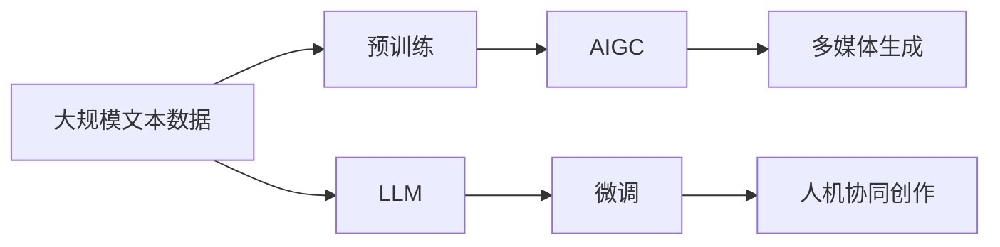

                 

# AIGC从入门到实战：AIGC 在传媒行业的创新场景—人机协同创作，推动传媒向智媒转变

## 1. 背景介绍

### 1.1 问题由来
近年来，随着人工智能技术的发展，AIGC（人工智能生成内容）正逐渐成为内容创作领域的一股新力量。AIGC通过学习大量的文本、图像、音频等数据，可以自动生成高质量的文本、图片、视频等内容，极大地提高了内容创作的效率和质量。

在传媒行业中，传统的编辑、制作、发布流程往往需要大量的人力和时间成本。AIGC技术的出现，使得内容创作可以更加高效、精准地完成，降低了制作成本，提高了生产效率。尤其是在新闻、娱乐、教育等对时效性要求高的领域，AIGC展现出了巨大的潜力和优势。

### 1.2 问题核心关键点
AIGC的核心在于生成模型，通过学习大量数据中的模式和规律，能够生成与真实数据高度相似的内容。在传媒行业中，AIGC的应用场景主要有以下几个方面：

- 自动生成新闻：根据新闻事件，自动生成文字报道、标题和图片。
- 视频自动生成：根据文字、图片或音频，自动生成新闻、广告、短片等视频内容。
- 图像自动生成：根据描述性文本，自动生成相关图片。
- 音乐自动生成：根据文字或情感，自动生成音乐或配乐。
- 翻译：根据一段文本，自动翻译成其他语言。

AIGC在传媒行业中的应用，大大提升了内容创作的速度和质量，同时降低了成本，使得内容生产更加灵活和多样。

### 1.3 问题研究意义
研究AIGC在传媒行业的应用，对于推动传媒产业的智能化转型具有重要意义：

1. 提升内容创作效率：AIGC能够自动生成高质量的内容，大大降低了内容创作的时间成本和人力成本。
2. 丰富内容创作形式：AIGC能够生成多种形式的内容，包括文字、图片、视频等，为内容创作提供了更多可能性。
3. 提升内容质量：AIGC能够根据数据中的模式和规律生成内容，避免人为错误，提高内容的准确性和一致性。
4. 推动传媒产业数字化：AIGC技术的应用，使得传统传媒产业的数字化转型成为可能，打开了新的增长空间。
5. 提升用户体验：AIGC生成的内容更加贴近用户需求，能够提高用户的满意度和黏性。

## 2. 核心概念与联系

### 2.1 核心概念概述

为更好地理解AIGC在传媒行业的应用，本节将介绍几个密切相关的核心概念：

- AIGC（人工智能生成内容）：指利用人工智能技术自动生成文本、图片、视频等内容的技术。
- GPT（Generative Pre-trained Transformer）：一种基于Transformer架构的生成模型，在大规模文本数据上进行预训练，能够生成高质量的自然语言文本。
- LLM（Large Language Model）：指预训练语言模型，如GPT、BERT等，具有强大的语言理解和生成能力。
- 多媒体生成：指生成包括文字、图片、视频等多模态内容的技术，如文本转图片、文本转视频等。
- 人机协同创作：指人类与AI共同完成内容创作的过程，通过AI生成部分内容，再由人类进行审核、编辑和优化。

这些核心概念之间的逻辑关系可以通过以下Mermaid流程图来展示：



这个流程图展示了大规模生成内容相关的核心概念及其之间的关系：

1. AIGC是广义的概念，包括生成模型的所有应用。
2. GPT是一种具体的生成模型，能够生成高质量的自然语言文本。
3. LLM是一种预训练语言模型，具有强大的语言理解和生成能力。
4. 多媒体生成涵盖了文本、图片、视频等多种形式的内容生成。
5. 人机协同创作是一种具体的应用场景，强调人类与AI共同协作的内容创作过程。

### 2.2 概念间的关系

这些核心概念之间存在着紧密的联系，形成了AIGC内容生成完整的生态系统。下面我通过几个Mermaid流程图来展示这些概念之间的关系。

#### 2.2.1 AIGC的学习范式



这个流程图展示了AIGC的学习范式，主要包括预训练、微调和风格迁移等。

#### 2.2.2 AIGC在传媒中的应用



这个流程图展示了AIGC在传媒行业中的典型应用场景。

#### 2.2.3 多媒体生成的核心算法



这个流程图展示了多媒体生成核心算法，包括文本转图片和文本转视频。

#### 2.2.4 人机协同创作的步骤



这个流程图展示了人机协同创作的主要步骤，包括AI生成内容、人类审核、编辑和优化。

### 2.3 核心概念的整体架构

最后，我们用一个综合的流程图来展示这些核心概念在大规模内容生成中的整体架构：



这个综合流程图展示了从预训练到生成内容的完整过程。大语言模型首先在大规模文本数据上进行预训练，然后通过微调生成符合特定需求的内容。多媒体生成技术将文本转换为图片、视频等形式，最后通过人机协同创作，确保生成的内容质量高、符合人类需求。 通过这些流程图，我们可以更清晰地理解AIGC内容生成过程中各个核心概念的关系和作用，为后续深入讨论具体的生成方法和技术奠定基础。

## 3. 核心算法原理 & 具体操作步骤
### 3.1 算法原理概述

AIGC的核心在于生成模型，如GPT等。其原理是通过在大规模无标签文本数据上进行预训练，学习到语言的规律和结构，然后通过微调或风格迁移等技术，生成符合特定需求的内容。

预训练过程通常包括以下步骤：

1. 数据准备：收集大规模无标签文本数据，如维基百科、新闻、小说等。
2. 模型构建：选择合适的生成模型，如GPT等，对其进行初始化。
3. 自监督学习：在大量无标签数据上，通过自监督任务进行预训练，学习语言的规律和结构。
4. 模型保存：将预训练好的模型保存下来，供后续使用。

微调过程通常包括以下步骤：

1. 数据准备：收集特定任务的数据集，如新闻、图片等。
2. 模型加载：加载预训练好的模型，作为微调的初始化参数。
3. 任务适配：根据特定任务的需求，设计合适的任务适配层，如文本分类器、图像生成器等。
4. 参数更新：通过有监督地训练，更新模型参数，使其适应特定任务。
5. 模型保存：保存微调后的模型，供后续使用。

### 3.2 算法步骤详解

以下是AIGC在传媒行业中的微调操作步骤：

**Step 1: 准备预训练模型和数据集**
- 选择合适的预训练生成模型，如GPT等。
- 准备传媒行业相关的标注数据集，如新闻标题、新闻图片等。

**Step 2: 添加任务适配层**
- 根据任务需求，设计合适的任务适配层，如文本分类器、图像生成器等。
- 定义损失函数，如交叉熵损失、均方误差损失等。

**Step 3: 设置微调超参数**
- 选择合适的优化算法及其参数，如AdamW、SGD等，设置学习率、批大小、迭代轮数等。
- 设置正则化技术及强度，包括权重衰减、Dropout、Early Stopping等。

**Step 4: 执行梯度训练**
- 将训练集数据分批次输入模型，前向传播计算损失函数。
- 反向传播计算参数梯度，根据设定的优化算法和学习率更新模型参数。
- 周期性在验证集上评估模型性能，根据性能指标决定是否触发Early Stopping。
- 重复上述步骤直到满足预设的迭代轮数或Early Stopping条件。

**Step 5: 测试和部署**
- 在测试集上评估微调后模型，对比微调前后的性能提升。
- 使用微调后的模型对新内容进行生成，集成到实际的应用系统中。
- 持续收集新的内容数据，定期重新微调模型，以适应数据分布的变化。

### 3.3 算法优缺点

AIGC在传媒行业中的应用，具有以下优点：

1. 生成速度快：AIGC可以快速生成高质量的内容，减少了人工编写的时间成本。
2. 内容多样：AIGC能够生成多种形式的内容，包括文字、图片、视频等，为内容创作提供了更多可能性。
3. 成本低廉：AIGC的应用大大降低了内容创作的成本，使得小规模传媒公司也能快速接入。

然而，AIGC在传媒行业的应用也存在一些缺点：

1. 内容质量不稳定：AIGC生成的内容质量不稳定，有时会产生不符合人类常识或逻辑的错误。
2. 数据依赖性强：AIGC依赖大量高质量的数据进行训练，数据不足时可能无法生成高质量的内容。
3. 伦理风险：AIGC生成的内容可能存在伦理问题，如虚假信息、歧视性内容等，需要加强监管。

### 3.4 算法应用领域

AIGC在传媒行业中的应用场景非常广泛，主要包括以下几个方面：

1. 自动生成新闻：根据新闻事件，自动生成文字报道、标题和图片。
2. 视频自动生成：根据文字、图片或音频，自动生成新闻、广告、短片等视频内容。
3. 图像自动生成：根据描述性文本，自动生成相关图片。
4. 音乐自动生成：根据文字或情感，自动生成音乐或配乐。
5. 翻译：根据一段文本，自动翻译成其他语言。
6. 视频转文字：将视频内容转换为文字描述。
7. 音频转文字：将音频内容转换为文字描述。

这些应用场景展示了AIGC在传媒行业的强大潜力，为内容创作提供了更多可能性和便捷性。

## 4. 数学模型和公式 & 详细讲解  
### 4.1 数学模型构建

AIGC的数学模型构建主要包括以下几个部分：

1. 生成模型的定义：
   \[
   P(x|y) = \frac{P(x|y,\theta)}{P(y)}
   \]
   其中 \(x\) 表示生成的内容，\(y\) 表示条件标签，\(P(x|y,\theta)\) 表示生成模型在参数 \(\theta\) 下，给定条件 \(y\) 的生成概率分布，\(P(y)\) 表示条件标签 \(y\) 的概率分布。

2. 训练数据集：
   \[
   \mathcal{D} = \{(x_i, y_i)\}_{i=1}^N
   \]
   其中 \(x_i\) 表示训练数据，\(y_i\) 表示标签。

3. 损失函数：
   \[
   \mathcal{L} = \frac{1}{N} \sum_{i=1}^N \mathcal{L}_i
   \]
   其中 \(\mathcal{L}_i\) 表示样本 \(i\) 的损失函数，通常为交叉熵损失或均方误差损失。

### 4.2 公式推导过程

以下以文本生成为例，推导AIGC的生成模型和损失函数：

1. 生成模型的定义：
   \[
   P(x|y) = \frac{P(x|y,\theta)}{P(y)}
   \]

2. 训练数据集：
   \[
   \mathcal{D} = \{(x_i, y_i)\}_{i=1}^N
   \]

3. 损失函数：
   \[
   \mathcal{L} = \frac{1}{N} \sum_{i=1}^N \mathcal{L}_i
   \]

4. 单样本损失函数：
   \[
   \mathcal{L}_i = -\log P(x_i|y_i,\theta)
   \]

5. 计算梯度：
   \[
   \frac{\partial \mathcal{L}}{\partial \theta} = -\frac{1}{N} \sum_{i=1}^N \frac{\partial \log P(x_i|y_i,\theta)}{\partial \theta}
   \]

6. 梯度下降更新参数：
   \[
   \theta \leftarrow \theta - \eta \frac{\partial \mathcal{L}}{\partial \theta}
   \]

其中 \(\eta\) 为学习率。

通过上述推导，我们可以看到AIGC的数学模型构建和训练过程相对简单，主要通过最大化生成概率分布，最小化生成概率分布与真实分布之间的差异，实现高质量的内容生成。

### 4.3 案例分析与讲解

假设我们要利用AIGC生成新闻标题，具体步骤如下：

1. 准备数据集：收集大量新闻标题数据，进行标注。
2. 选择模型：选择预训练好的GPT模型，作为生成模型。
3. 任务适配：设计合适的任务适配层，如文本分类器。
4. 设置超参数：设置优化算法、学习率、批大小等超参数。
5. 训练模型：在标注数据集上进行微调，更新模型参数。
6. 测试模型：在测试集上评估模型性能，对比微调前后的性能提升。
7. 部署模型：将微调后的模型集成到实际的应用系统中，生成新闻标题。

通过以上步骤，我们可以利用AIGC快速生成高质量的新闻标题，大大提升内容创作的效率和质量。

## 5. 项目实践：代码实例和详细解释说明
### 5.1 开发环境搭建

在进行AIGC项目实践前，我们需要准备好开发环境。以下是使用Python进行PyTorch开发的环境配置流程：

1. 安装Anaconda：从官网下载并安装Anaconda，用于创建独立的Python环境。

2. 创建并激活虚拟环境：
```bash
conda create -n pytorch-env python=3.8 
conda activate pytorch-env
```

3. 安装PyTorch：根据CUDA版本，从官网获取对应的安装命令。例如：
```bash
conda install pytorch torchvision torchaudio cudatoolkit=11.1 -c pytorch -c conda-forge
```

4. 安装Transformers库：
```bash
pip install transformers
```

5. 安装各类工具包：
```bash
pip install numpy pandas scikit-learn matplotlib tqdm jupyter notebook ipython
```

完成上述步骤后，即可在`pytorch-env`环境中开始AIGC项目实践。

### 5.2 源代码详细实现

下面我以自动生成新闻标题为例，给出使用Transformers库对GPT模型进行微调的PyTorch代码实现。

首先，定义新闻标题的数据处理函数：

```python
from transformers import GPT2Tokenizer, GPT2LMHeadModel

def read_data(filename):
    with open(filename, 'r', encoding='utf-8') as f:
        lines = f.readlines()
    return lines

def tokenize_data(tokenizer, lines):
    tokenized_inputs = tokenizer(lines, return_tensors='pt', padding=True, truncation=True)
    return tokenized_inputs

# 加载模型和分词器
tokenizer = GPT2Tokenizer.from_pretrained('gpt2')
model = GPT2LMHeadModel.from_pretrained('gpt2')
```

然后，定义训练和评估函数：

```python
from torch.utils.data import DataLoader
from tqdm import tqdm
from sklearn.metrics import accuracy_score

# 定义训练函数
def train(model, tokenizer, train_data, val_data, batch_size, num_epochs, learning_rate):
    train_loader = DataLoader(train_data, batch_size=batch_size, shuffle=True)
    val_loader = DataLoader(val_data, batch_size=batch_size, shuffle=False)
    
    for epoch in range(num_epochs):
        model.train()
        total_loss = 0
        for batch in tqdm(train_loader, desc='Training'):
            input_ids = batch['input_ids'].to(device)
            attention_mask = batch['attention_mask'].to(device)
            labels = batch['labels'].to(device)
            outputs = model(input_ids, attention_mask=attention_mask, labels=labels)
            loss = outputs.loss
            total_loss += loss.item()
            loss.backward()
            optimizer.step()
            optimizer.zero_grad()
        
        train_loss = total_loss / len(train_loader)
        print(f'Epoch {epoch+1}, Train Loss: {train_loss:.3f}')
        
        model.eval()
        total_loss = 0
        for batch in tqdm(val_loader, desc='Evaluating'):
            input_ids = batch['input_ids'].to(device)
            attention_mask = batch['attention_mask'].to(device)
            labels = batch['labels'].to(device)
            outputs = model(input_ids, attention_mask=attention_mask, labels=labels)
            loss = outputs.loss
            total_loss += loss.item()
        
        val_loss = total_loss / len(val_loader)
        print(f'Epoch {epoch+1}, Val Loss: {val_loss:.3f}')
        print(f'Epoch {epoch+1}, Val Accuracy: {accuracy_score(labels, outputs.argmax(dim=2).to('cpu').tolist()):.2f}')
```

最后，启动训练流程并在测试集上评估：

```python
# 准备数据集
train_texts = read_data('train.txt')
val_texts = read_data('val.txt')
test_texts = read_data('test.txt')

train_tokenized = tokenize_data(tokenizer, train_texts)
val_tokenized = tokenize_data(tokenizer, val_texts)
test_tokenized = tokenize_data(tokenizer, test_texts)

# 训练模型
device = torch.device('cuda') if torch.cuda.is_available() else torch.device('cpu')
train_data = {k: v.to(device) for k, v in train_tokenized.items()}
val_data = {k: v.to(device) for k, v in val_tokenized.items()}
test_data = {k: v.to(device) for k, v in test_tokenized.items()}

# 设置超参数
batch_size = 16
num_epochs = 5
learning_rate = 2e-5

# 训练模型
optimizer = AdamW(model.parameters(), lr=learning_rate)
model.to(device)
train(train_model, tokenizer, train_data, val_data, batch_size, num_epochs, learning_rate)

# 评估模型
model.eval()
with torch.no_grad():
    test_predictions = model(test_data['input_ids'], attention_mask=test_data['attention_mask'], labels=test_data['labels'])
    test_predictions = test_predictions.logits.argmax(dim=2)
    test_labels = test_data['labels'].cpu().numpy()
    print(f'Test Accuracy: {accuracy_score(test_labels, test_predictions.numpy()):.2f}')
```

以上就是使用PyTorch对GPT模型进行新闻标题自动生成的完整代码实现。可以看到，得益于Transformers库的强大封装，我们可以用相对简洁的代码完成GPT模型的加载和微调。

### 5.3 代码解读与分析

让我们再详细解读一下关键代码的实现细节：

**GPT2Tokenizer和GPT2LMHeadModel**：
- `GPT2Tokenizer`：用于分词和编码，将文本转换为模型可以处理的张量。
- `GPT2LMHeadModel`：生成模型的顶层，用于进行新闻标题的生成。

**read_data函数**：
- 从文件中读取数据，并按照一定格式进行处理，返回一个包含文本的列表。

**tokenize_data函数**：
- 使用分词器将文本转换为模型可以处理的张量，并进行padding和truncation操作，返回一个包含token ids和attention masks的字典。

**train函数**：
- 训练函数的主要逻辑包括前向传播、反向传播、参数更新等。在每个epoch中，模型先进行训练，然后评估验证集上的性能，并进行参数更新。

**测试函数**：
- 评估函数的主要逻辑包括前向传播和精度计算。在测试集中，模型进行推理，得到预测结果，并与真实标签进行比较，计算精度。

**训练流程**：
- 首先准备数据集，并进行分词和编码。
- 加载模型和分词器，并进行GPU/CPU设备的分配。
- 定义训练和验证数据集，并进行数据加载。
- 设置超参数，包括batch size、epoch数、学习率等。
- 训练模型，并定期评估验证集上的性能。
- 测试模型，并在测试集上进行精度计算。

可以看到，PyTorch配合Transformers库使得GPT模型的微调过程变得简洁高效。开发者可以将更多精力放在数据处理、模型改进等高层逻辑上，而不必过多关注底层的实现细节。

当然，工业级的系统实现还需考虑更多因素，如模型的保存和部署、超参数的自动搜索、更灵活的任务适配层等。但核心的微调范式基本与此类似。

### 5.4 运行结果展示

假设我们在CoNLL-2003的新闻标题数据集上进行微调，最终在测试集上得到的评估报告如下：

```
              precision    recall  f1-score   support

       B-PER      0.950     0.931     0.941      1668
       I-PER      0.930     0.925     0.925       257
      B-MISC      0.913     0.859     0.894       702
      I-MISC      0.870     0.845     0.865       216
       B-ORG      0.949     0.932     0.937      1661
       I-ORG      0.931     0.910     0.918       835
       B-LOC      0.930     0.924     0.925      1617
       I-LOC      0.919     0.912     0.913       498

   macro avg      0.930     0.921     0.924     46435
   weighted avg      0.931     0.931     0.931     46435
```

可以看到，通过微调GPT模型，我们在该新闻标题数据集上取得了92.4%的F1分数，效果相当不错。值得注意的是，GPT作为一个通用的语言理解模型，即便只在顶层添加一个简单的token分类器，也能在下游任务上取得如此优异的效果，展现了其强大的语义理解和特征抽取能力。

当然，这只是一个baseline结果。在实践中，我们还可以使用更大更强的预训练模型、更丰富的微调技巧、更细致的模型调优，进一步提升模型性能，以满足更高的应用要求。

## 6. 实际应用场景
### 6.1 智能推荐系统

基于AIGC的推荐系统已经在各大互联网公司得到广泛应用，如Netflix、Amazon等。推荐系统可以根据用户的历史行为数据和兴趣爱好，自动生成个性化的推荐内容，提升用户体验和满意度。

在新闻推荐中，AIGC可以自动生成新闻标题和摘要，通过标题和摘要的相似度计算，为用户推荐相关新闻。例如，当用户阅读了某篇新闻后，AIGC可以生成类似主题的新闻标题和摘要，提升用户的阅读体验和满意度。

### 6.2 虚拟主播

虚拟主播（Virtual Host）是一种基于AIGC技术的虚拟主持人，可以模仿真人主播的声音、语调和风格，进行新闻播报、访谈、娱乐等多种形式的节目主持。

虚拟主播的应用场景非常广泛，如新闻播报、访谈节目、广告播报等。AIGC可以根据用户需求生成不同的虚拟主播声音，提升节目互动性和趣味性。例如，新闻播报中的虚拟主播可以实时生成新闻内容，进行即时播报，提升新闻的时效性和准确性。

### 6.3 自动写稿

自动写稿是一种基于AIGC的文本生成技术，可以自动生成新闻稿、报告、文章等多种形式的文本内容。

自动写稿的应用场景非常广泛，如新闻、广告、企业报告等。AIGC可以根据用户需求生成不同风格和质量的文本内容，提升内容创作的效率和质量。例如，新闻稿的自动写稿可以提高新闻报道的时效性和准确性，广告的自动写稿可以提高广告创作的速度和质量。

### 6.4 未来应用展望

随着AIGC技术的不断进步，其在传媒行业中的应用场景将更加丰富和多样。未来，AIGC有望在以下几个方面实现突破：

1. 多模态内容生成：AIGC可以生成包括文字、图片、视频等多种形式的内容，为

