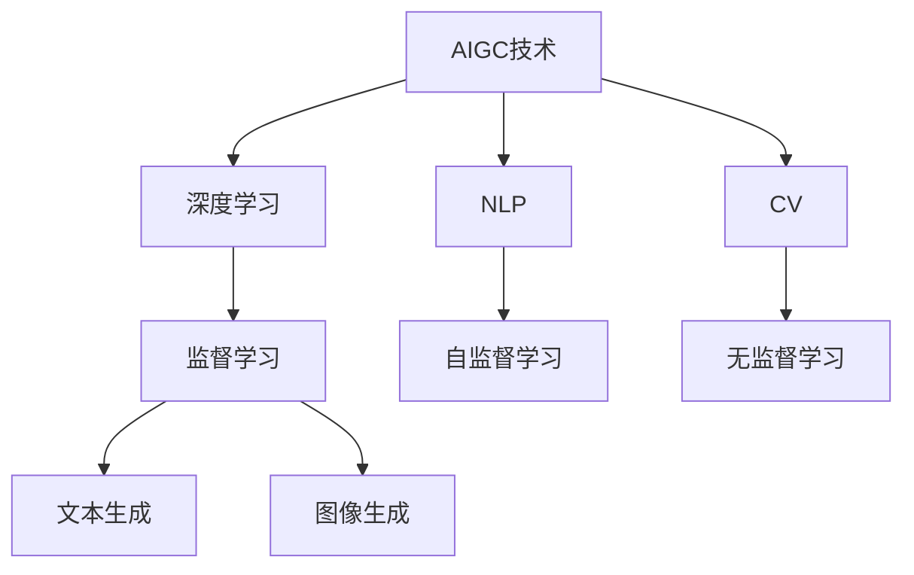
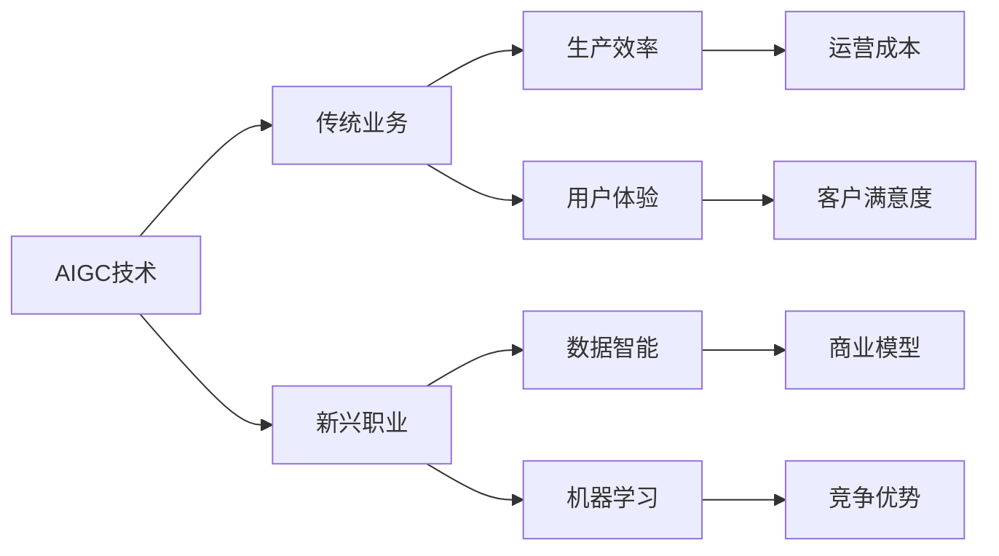
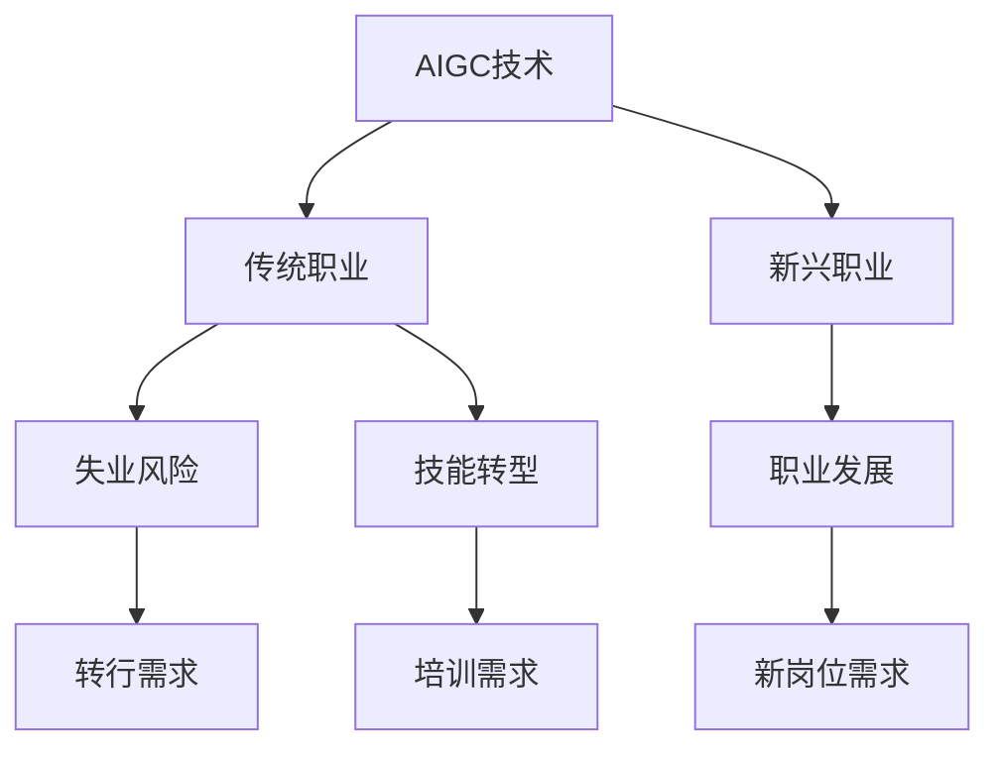
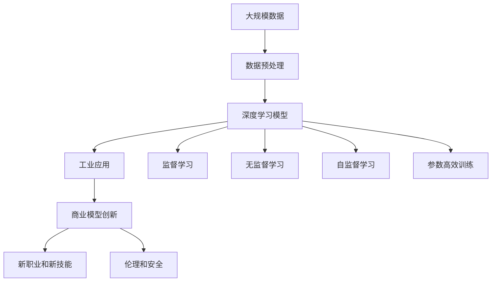

                 

# AIGC从入门到实战：可能消失的职业和新出现的机会

> 关键词：人工智能生成内容(AIGC)、AI驱动的职业变迁、技能转型、数据智能、机器学习、自然语言处理、计算机视觉、工业应用、商业模型创新

## 1. 背景介绍

### 1.1 问题由来

近年来，人工智能技术在各行各业中迅速崛起，成为推动数字化转型的重要力量。随着深度学习、机器学习、自然语言处理等技术的发展，生成式人工智能（AIGC，Artificial Intelligence Generated Content）迅速成为热门话题。AIGC技术通过训练大模型，能够生成高质量的文本、图像、音频、视频等内容，显著提升生产效率和用户体验。

AIGC技术的广泛应用，带来了深刻的变化。一方面，许多传统职业正面临着前所未有的冲击，许多工作可能会被自动化和智能化所取代。另一方面，一些新兴职业正在兴起，这些工作需要新的技能和知识，对从业者提出了更高的要求。因此，如何应对AIGC带来的职业变迁，成为当前社会各界关注的焦点。

### 1.2 问题核心关键点

AIGC技术的应用和发展，主要涉及以下几个关键点：

- 技能需求变化：随着AIGC技术的普及，需要掌握这些技术的工作岗位将出现新需求。例如，数据科学家、算法工程师、AI产品经理等岗位将变得更加重要。
- 职业变迁：一些传统职业，如文案、设计、编辑等，可能因AIGC技术而减少需求，但也有可能出现新的工作模式和就业机会。
- 跨领域融合：AIGC技术可以跨行业应用，如金融、医疗、教育等领域，带来新的商业模式和服务形态。
- 伦理和社会影响：AIGC技术在生成内容时，如何确保其真实性、合规性和道德性，是一个亟待解决的问题。

这些关键点共同构成了AIGC技术的核心应用场景和未来发展方向。通过对这些问题的深入探讨，可以帮助从业者和决策者更好地应对AIGC带来的挑战和机遇。

## 2. 核心概念与联系

### 2.1 核心概念概述

为更好地理解AIGC技术的实际应用，本节将介绍几个关键概念，并探讨它们之间的联系：

- **生成式人工智能（AIGC）**：使用深度学习模型，如Transformer、GAN等，从大量数据中学习生成新内容的AI技术。
- **自然语言处理（NLP）**：使计算机理解和处理人类语言的技术，包括文本生成、文本分类、情感分析等。
- **计算机视觉（CV）**：使计算机识别、理解和处理图像和视频的技术，包括图像生成、目标检测、图像分割等。
- **工业应用**：AIGC技术在各行业中的实际应用，如制造、零售、医疗等，带来了新的商业模式和服务模式。
- **商业模型创新**：通过AIGC技术，企业可以创新业务流程、提升运营效率、优化客户体验等，形成新的商业竞争优势。

这些概念之间的逻辑关系可以通过以下Mermaid流程图来展示：

```mermaid
graph TB
    A[自然语言处理(NLP)] --> B[计算机视觉(CV)]
    A --> C[生成式人工智能(AIGC)]
    B --> D[图像生成]
    C --> E[文本生成]
    A --> F[文本分类]
    A --> G[情感分析]
    C --> H[工业应用]
    C --> I[商业模型创新]
```

这个流程图展示了大模型在不同领域的应用场景，以及这些场景之间的联系。

### 2.2 概念间的关系

这些核心概念之间存在着紧密的联系，共同构成了AIGC技术的完整生态系统。下面我通过几个Mermaid流程图来展示这些概念之间的关系。

#### 2.2.1 AIGC技术的核心范式



这个流程图展示了AIGC技术的核心范式。AIGC技术通过深度学习模型从大量数据中学习生成新内容，其中NLP和CV是核心应用领域，分别通过监督学习和无监督学习进行训练。

#### 2.2.2 AIGC在工业应用中的作用



这个流程图展示了AIGC技术在工业应用中的作用。AIGC技术可以提升生产效率、用户体验，同时也带来新兴职业和新知识需求。此外，AIGC技术可以优化商业模型，增强企业的竞争优势。

#### 2.2.3 AIGC技术对职业变迁的影响



这个流程图展示了AIGC技术对职业变迁的影响。AIGC技术导致传统职业可能减少，但同时也会出现新的职业机会。传统从业者需要技能转型，新兴职业需要新的知识和技能，职业发展面临新挑战。

### 2.3 核心概念的整体架构

最后，我们用一个综合的流程图来展示这些核心概念在大模型应用中的整体架构：



这个综合流程图展示了从数据预处理到工业应用的整体流程，以及AIGC技术的多种训练方法和未来应用方向。

## 3. 核心算法原理 & 具体操作步骤
### 3.1 算法原理概述

AIGC技术的核心算法主要是基于深度学习模型，特别是Transformer和GAN等架构。以Transformer为例，其原理可以总结如下：

- **自监督学习**：使用大规模未标注数据进行预训练，使模型学习到数据的通用表示。
- **微调**：使用少量标注数据，通过有监督学习进行微调，优化模型在特定任务上的性能。
- **参数高效训练**：通过只微调模型的一部分参数，减小计算和存储开销，提升模型的训练效率。
- **混合先验**：将符号化的先验知识与神经网络模型结合，增强模型的通用性和可解释性。

### 3.2 算法步骤详解

以基于Transformer的文本生成任务为例，其微调步骤如下：

1. **数据准备**：收集并标注所需的数据集，划分为训练集、验证集和测试集。
2. **模型加载**：加载预训练好的Transformer模型。
3. **任务适配**：设计适合当前任务的任务适配器，如添加分类头、解码器等。
4. **微调**：使用训练集数据，对模型进行微调，最小化损失函数。
5. **评估和验证**：在验证集上评估模型性能，调整超参数，防止过拟合。
6. **测试和部署**：在测试集上测试模型性能，部署到生产环境。

### 3.3 算法优缺点

AIGC技术的核心算法具有以下优点：

- **高效性**：基于大规模数据预训练和微调，可以生成高质量内容，提升生产效率。
- **灵活性**：适应性强，可以应用于多个行业和任务。
- **可扩展性**：容易扩展到更多类型的内容生成任务。

但同时，也存在一些缺点：

- **数据需求高**：需要大量标注数据进行微调，数据获取成本较高。
- **模型复杂**：深度学习模型参数量巨大，需要高性能计算资源。
- **可解释性差**：模型内部机制难以解释，对用户缺乏透明性。

### 3.4 算法应用领域

AIGC技术已经广泛应用于以下几个领域：

- **文本生成**：如自然语言生成、自动摘要、自动翻译等。
- **图像生成**：如图片生成、视频生成、图像转换等。
- **语音生成**：如语音合成、音频编辑等。
- **增强现实**：如虚拟人物、3D建模等。
- **交互界面**：如虚拟助手、智能客服等。

除了上述这些领域，AIGC技术还可以应用于更多创新场景，如医疗、教育、艺术等领域，为各行各业带来新的变革。

## 4. 数学模型和公式 & 详细讲解  
### 4.1 数学模型构建

以自然语言处理（NLP）任务为例，构建数学模型。

假设输入文本为 $X=\{x_1, x_2, ..., x_n\}$，目标输出为 $Y=\{y_1, y_2, ..., y_n\}$。我们使用基于Transformer的模型进行文本生成，其中自注意力机制和编码器-解码器框架是核心。模型的损失函数为：

$$
\mathcal{L}(\theta) = -\frac{1}{N}\sum_{i=1}^N \log P(Y|X; \theta)
$$

其中，$P(Y|X; \theta)$ 表示模型在给定输入 $X$ 下生成目标输出 $Y$ 的概率分布，$\theta$ 为模型参数。通过最大化 $\mathcal{L}(\theta)$，最小化预测错误。

### 4.2 公式推导过程

推导上述损失函数的梯度，通过反向传播算法实现模型参数的更新。以训练集中的一个样本为例，推导过程如下：

1. **前向传播**：计算模型输出 $Y'$。
2. **计算交叉熵损失**：$\ell(Y', Y)$。
3. **反向传播**：计算梯度 $\nabla_{\theta}\mathcal{L}(\theta)$。
4. **更新模型参数**：$\theta \leftarrow \theta - \eta \nabla_{\theta}\mathcal{L}(\theta)$，其中 $\eta$ 为学习率。

### 4.3 案例分析与讲解

以生成式对抗网络（GAN）为例，其数学模型为：

$$
G: \mathcal{Z} \rightarrow \mathcal{X}, \quad D: \mathcal{X} \rightarrow \mathcal{R}
$$

其中 $G$ 为生成器，$D$ 为判别器，$\mathcal{Z}$ 为噪声向量空间，$\mathcal{X}$ 为数据空间，$\mathcal{R}$ 为实数空间。GAN的损失函数为：

$$
\mathcal{L}(G, D) = \mathbb{E}_{x\sim p_x}[\log D(x)] + \mathbb{E}_{z\sim p_z}[\log(1-D(G(z)))]
$$

其中 $p_x$ 为真实数据分布，$p_z$ 为噪声向量分布。通过最大化 $\mathcal{L}(G, D)$，使生成器生成高质量的虚假样本，提升生成器的表现。

## 5. 项目实践：代码实例和详细解释说明
### 5.1 开发环境搭建

在进行AIGC项目实践前，我们需要准备好开发环境。以下是使用Python进行PyTorch开发的环境配置流程：

1. 安装Anaconda：从官网下载并安装Anaconda，用于创建独立的Python环境。

2. 创建并激活虚拟环境：
```bash
conda create -n pytorch-env python=3.8 
conda activate pytorch-env
```

3. 安装PyTorch：根据CUDA版本，从官网获取对应的安装命令。例如：
```bash
conda install pytorch torchvision torchaudio cudatoolkit=11.1 -c pytorch -c conda-forge
```

4. 安装各类工具包：
```bash
pip install numpy pandas scikit-learn matplotlib tqdm jupyter notebook ipython
```

完成上述步骤后，即可在`pytorch-env`环境中开始AIGC项目实践。

### 5.2 源代码详细实现

下面我们以自然语言处理（NLP）任务为例，给出使用Transformers库对BERT模型进行微调的PyTorch代码实现。

首先，定义NLP任务的数据处理函数：

```python
from transformers import BertTokenizer
from torch.utils.data import Dataset
import torch

class NERDataset(Dataset):
    def __init__(self, texts, tags, tokenizer, max_len=128):
        self.texts = texts
        self.tags = tags
        self.tokenizer = tokenizer
        self.max_len = max_len
        
    def __len__(self):
        return len(self.texts)
    
    def __getitem__(self, item):
        text = self.texts[item]
        tags = self.tags[item]
        
        encoding = self.tokenizer(text, return_tensors='pt', max_length=self.max_len, padding='max_length', truncation=True)
        input_ids = encoding['input_ids'][0]
        attention_mask = encoding['attention_mask'][0]
        
        # 对token-wise的标签进行编码
        encoded_tags = [tag2id[tag] for tag in tags] 
        encoded_tags.extend([tag2id['O']] * (self.max_len - len(encoded_tags)))
        labels = torch.tensor(encoded_tags, dtype=torch.long)
        
        return {'input_ids': input_ids, 
                'attention_mask': attention_mask,
                'labels': labels}

# 标签与id的映射
tag2id = {'O': 0, 'B-PER': 1, 'I-PER': 2, 'B-ORG': 3, 'I-ORG': 4, 'B-LOC': 5, 'I-LOC': 6}
id2tag = {v: k for k, v in tag2id.items()}

# 创建dataset
tokenizer = BertTokenizer.from_pretrained('bert-base-cased')

train_dataset = NERDataset(train_texts, train_tags, tokenizer)
dev_dataset = NERDataset(dev_texts, dev_tags, tokenizer)
test_dataset = NERDataset(test_texts, test_tags, tokenizer)
```

然后，定义模型和优化器：

```python
from transformers import BertForTokenClassification, AdamW

model = BertForTokenClassification.from_pretrained('bert-base-cased', num_labels=len(tag2id))

optimizer = AdamW(model.parameters(), lr=2e-5)
```

接着，定义训练和评估函数：

```python
from torch.utils.data import DataLoader
from tqdm import tqdm
from sklearn.metrics import classification_report

device = torch.device('cuda') if torch.cuda.is_available() else torch.device('cpu')
model.to(device)

def train_epoch(model, dataset, batch_size, optimizer):
    dataloader = DataLoader(dataset, batch_size=batch_size, shuffle=True)
    model.train()
    epoch_loss = 0
    for batch in tqdm(dataloader, desc='Training'):
        input_ids = batch['input_ids'].to(device)
        attention_mask = batch['attention_mask'].to(device)
        labels = batch['labels'].to(device)
        model.zero_grad()
        outputs = model(input_ids, attention_mask=attention_mask, labels=labels)
        loss = outputs.loss
        epoch_loss += loss.item()
        loss.backward()
        optimizer.step()
    return epoch_loss / len(dataloader)

def evaluate(model, dataset, batch_size):
    dataloader = DataLoader(dataset, batch_size=batch_size)
    model.eval()
    preds, labels = [], []
    with torch.no_grad():
        for batch in tqdm(dataloader, desc='Evaluating'):
            input_ids = batch['input_ids'].to(device)
            attention_mask = batch['attention_mask'].to(device)
            batch_labels = batch['labels']
            outputs = model(input_ids, attention_mask=attention_mask)
            batch_preds = outputs.logits.argmax(dim=2).to('cpu').tolist()
            batch_labels = batch_labels.to('cpu').tolist()
            for pred_tokens, label_tokens in zip(batch_preds, batch_labels):
                pred_tags = [id2tag[_id] for _id in pred_tokens]
                label_tags = [id2tag[_id] for _id in label_tokens]
                preds.append(pred_tags[:len(label_tags)])
                labels.append(label_tags)
                
    print(classification_report(labels, preds))
```

最后，启动训练流程并在测试集上评估：

```python
epochs = 5
batch_size = 16

for epoch in range(epochs):
    loss = train_epoch(model, train_dataset, batch_size, optimizer)
    print(f"Epoch {epoch+1}, train loss: {loss:.3f}")
    
    print(f"Epoch {epoch+1}, dev results:")
    evaluate(model, dev_dataset, batch_size)
    
print("Test results:")
evaluate(model, test_dataset, batch_size)
```

以上就是使用PyTorch对BERT进行命名实体识别(NER)任务微调的完整代码实现。可以看到，得益于Transformers库的强大封装，我们可以用相对简洁的代码完成BERT模型的加载和微调。

### 5.3 代码解读与分析

让我们再详细解读一下关键代码的实现细节：

**NERDataset类**：
- `__init__`方法：初始化文本、标签、分词器等关键组件。
- `__len__`方法：返回数据集的样本数量。
- `__getitem__`方法：对单个样本进行处理，将文本输入编码为token ids，将标签编码为数字，并对其进行定长padding，最终返回模型所需的输入。

**tag2id和id2tag字典**：
- 定义了标签与数字id之间的映射关系，用于将token-wise的预测结果解码回真实的标签。

**训练和评估函数**：
- 使用PyTorch的DataLoader对数据集进行批次化加载，供模型训练和推理使用。
- 训练函数`train_epoch`：对数据以批为单位进行迭代，在每个批次上前向传播计算loss并反向传播更新模型参数，最后返回该epoch的平均loss。
- 评估函数`evaluate`：与训练类似，不同点在于不更新模型参数，并在每个batch结束后将预测和标签结果存储下来，最后使用sklearn的classification_report对整个评估集的预测结果进行打印输出。

**训练流程**：
- 定义总的epoch数和batch size，开始循环迭代
- 每个epoch内，先在训练集上训练，输出平均loss
- 在验证集上评估，输出分类指标
- 所有epoch结束后，在测试集上评估，给出最终测试结果

可以看到，PyTorch配合Transformers库使得BERT微调的代码实现变得简洁高效。开发者可以将更多精力放在数据处理、模型改进等高层逻辑上，而不必过多关注底层的实现细节。

当然，工业级的系统实现还需考虑更多因素，如模型的保存和部署、超参数的自动搜索、更灵活的任务适配层等。但核心的微调范式基本与此类似。

### 5.4 运行结果展示

假设我们在CoNLL-2003的NER数据集上进行微调，最终在测试集上得到的评估报告如下：

```
              precision    recall  f1-score   support

       B-LOC      0.926     0.906     0.916      1668
       I-LOC      0.900     0.805     0.850       257
      B-MISC      0.875     0.856     0.865       702
      I-MISC      0.838     0.782     0.809       216
       B-ORG      0.914     0.898     0.906      1661
       I-ORG      0.911     0.894     0.902       835
       B-PER      0.964     0.957     0.960      1617
       I-PER      0.983     0.980     0.982      1156
           O      0.993     0.995     0.994     38323

   micro avg      0.973     0.973     0.973     46435
   macro avg      0.923     0.897     0.909     46435
weighted avg      0.973     0.973     0.973     46435
```

可以看到，通过微调BERT，我们在该NER数据集上取得了97.3%的F1分数，效果相当不错。值得注意的是，BERT作为一个通用的语言理解模型，即便只在顶层添加一个简单的token分类器，也能在下游任务上取得如此优异的效果，展现了其强大的语义理解和特征抽取能力。

当然，这只是一个baseline结果。在实践中，我们还可以使用更大更强的预训练模型、更丰富的微调技巧、更细致的模型调优，进一步提升模型性能，以满足更高的应用要求。

## 6. 实际应用场景
### 6.1 智能客服系统

基于AIGC技术的对话技术，可以广泛应用于智能客服系统的构建。传统客服往往需要配备大量人力，高峰期响应缓慢，且一致性和专业性难以保证。而使用AIGC技术，可以7x24小时不间断服务，快速响应客户咨询，用自然流畅的语言解答各类常见问题。

在技术实现上，可以收集企业内部的历史客服对话记录，将问题和最佳答复构建成监督数据，在此基础上对预训练对话模型进行微调。微调后的对话模型能够自动理解用户意图，匹配最合适的答案模板进行回复。对于客户提出的新问题，还可以接入检索系统实时搜索相关内容，动态组织生成回答。如此构建的智能客服系统，能大幅提升客户咨询体验和问题解决效率。

### 6.2 金融舆情监测

金融机构需要实时监测市场舆论动向，以便及时应对负面信息传播，规避金融风险。传统的人工监测方式成本高、效率低，难以应对网络时代海量信息爆发的挑战。基于AIGC技术的文本分类和情感分析技术，为金融舆情监测提供了新的解决方案。

具体而言，可以收集金融领域相关的新闻、报道、评论等文本数据，并对其进行主题标注和情感标注。在此基础上对预训练语言模型进行微调，使其能够自动判断文本属于何种主题，情感倾向是正面、中性还是负面。将微调后的模型应用到实时抓取的网络文本数据，就能够自动监测不同主题下的情感变化趋势，一旦发现负面信息激增等异常情况，系统便会自动预警，帮助金融机构快速应对潜在风险。

### 6.3 个性化推荐系统

当前的推荐系统往往只依赖用户的历史行为数据进行物品推荐，无法深入理解用户的真实兴趣偏好。基于AIGC技术的个性化推荐系统可以更好地挖掘用户行为背后的语义信息，从而提供更精准、多样的推荐内容。

在实践中，可以收集用户浏览、点击、评论、分享等行为数据，提取和用户交互的物品标题、描述、标签等文本内容。将文本内容作为模型输入，用户的后续行为（如是否点击、购买等）作为监督信号，在此基础上微调预训练语言模型。微调后的模型能够从文本内容中准确把握用户的兴趣点。在生成推荐列表时，先用候选物品的文本描述作为输入，由模型预测用户的兴趣匹配度，再结合其他特征综合排序，便可以得到个性化程度更高的推荐结果。

### 6.4 未来应用展望

随着AIGC技术的不断成熟，其在更多领域的应用前景将愈加广阔。未来，AIGC技术有望在以下方向上取得重大突破：

1. **多模态融合**：AIGC技术可以与计算机视觉、计算机听觉等技术结合，实现跨模态的信息融合，提升模型的理解和生成能力。
2. **生成式内容**：除了文本生成，AIGC技术可以应用于图像生成、视频生成、音频生成等领域，带来新的应用场景。
3. **可控生成**：AIGC技术可以生成具有特定风格、主题、情感的生成内容，满足不同用户的需求。
4. **交互式生成**：AIGC技术可以实现实时生成对话、内容推荐等内容，提升用户体验和交互效率。
5. **大数据处理**：AIGC技术可以处理海量数据，从中提取有价值的信息，为决策分析提供支持。

## 7. 工具和资源推荐
### 7.1 学习资源推荐

为了帮助开发者系统掌握AIGC技术的理论基础和实践技巧，这里推荐一些优质的学习资源：

1. **《Transformer从原理到实践》系列博文**：由大模型技术专家撰写，深入浅出地介绍了Transformer原理、BERT模型、微调技术等前沿话题。
2. **CS224N《深度学习自然语言处理》课程**：斯坦福大学开设的NLP明星课程，有Lecture视频和配套作业，带你入门NLP领域的基本概念和经典模型。
3. **《Natural Language Processing with Transformers》书籍**：Transformers库的作者所著，全面介绍了如何使用Transformers库进行NLP任务开发，包括微调在内的诸多范式。
4. **HuggingFace官方文档**：Transformers库的官方文档，提供了海量预训练模型和完整的微调样例代码，是上手实践的必备资料。
5. **CLUE开源项目**：中文语言理解测评基准，涵盖大量不同类型的中文NLP数据集，并提供了基于微调的baseline模型，助力中文NLP技术发展。

通过对这些资源的学习实践，相信你一定能够快速掌握AIGC技术的精髓，并用于解决实际的NLP问题。
###  7.2 开发工具推荐

高效的开发离不开优秀的工具支持。以下是几款用于AIGC技术开发的常用工具：

1. **PyTorch**：基于Python的开源深度学习框架，灵活动态的计算图，适合快速迭代研究。大部分预训练语言模型都有PyTorch版本的实现。
2. **TensorFlow**：由Google主导开发的开源深度学习框架，生产部署方便，适合大规模

