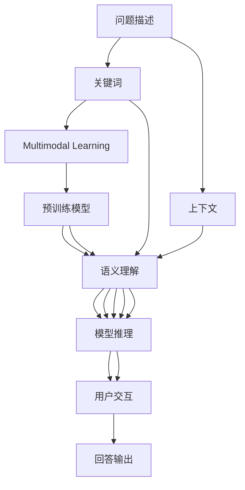
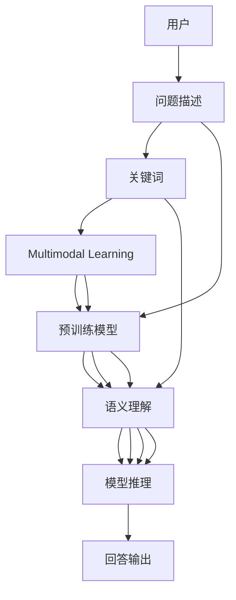
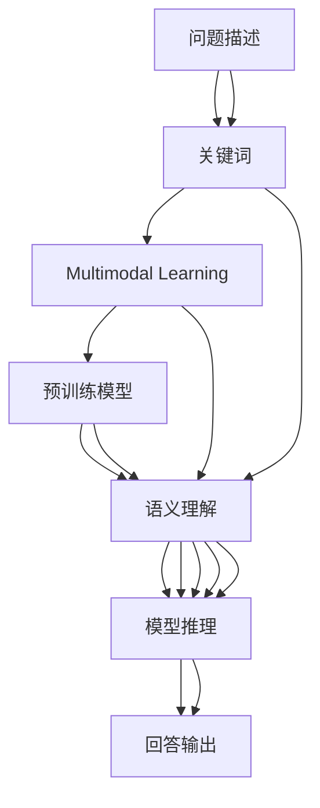
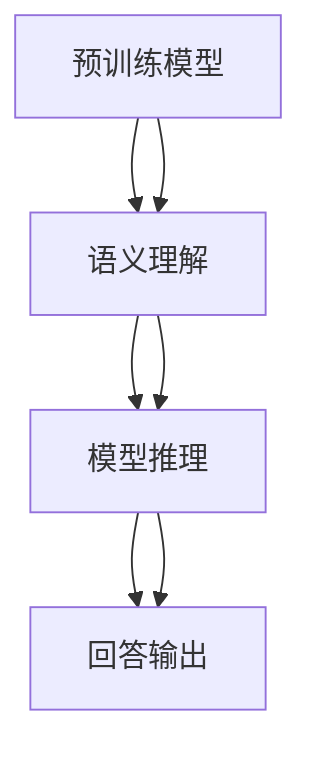
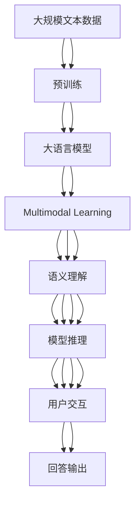

                 

# AIGC从入门到实战：如何向 ChatGPT 提问以获得高质量答案

> 关键词：
> 人工智能(AI), 生成对抗网络(GAN), 预训练模型(Pre-training Models), 自然语言处理(NLP), 人工智能生成内容(AIGC), 生成式模型(Generative Models), ChatGPT, 多模态学习(Multimodal Learning), 语义理解(Semantic Understanding), 模型推理(Model Inference), 用户交互(User Interaction)

## 1. 背景介绍

### 1.1 问题由来

随着人工智能技术的发展，特别是深度学习和自然语言处理技术的突破，人工智能生成内容(AI Generated Content, AIGC)在各个领域得到了广泛应用。从文本生成到图像生成，从语音生成到视频生成，AIGC技术正逐渐成为推动技术进步和社会发展的重要力量。然而，如何高效、准确地使用AIGC技术，向模型提出高质量的问题，以获得有价值的答案，是所有开发者和用户都面临的挑战。

ChatGPT作为OpenAI推出的先进自然语言处理模型，具备强大的文本生成和理解能力，能够回答各种复杂问题，成为当前AIGC领域的热门应用之一。如何向ChatGPT提问，以获得高质量答案，成为了很多开发者和用户关注的核心问题。本文将详细介绍如何高效、准确地向ChatGPT提问，以获得有用、准确的回答。

### 1.2 问题核心关键点

向ChatGPT提问以获得高质量答案的核心关键点包括：

- 问题清晰明确：问题描述要具体，避免模糊不清，使ChatGPT能够准确理解用户意图。
- 关键词精准：关键词的选择直接影响ChatGPT的回答质量，应尽可能选择与问题相关的重要词汇。
- 多模态融合：结合文本、图像、语音等多种信息源，使ChatGPT能够更全面、深入地理解问题。
- 上下文控制：在长文本中提供足够的上下文信息，帮助ChatGPT理解问题的背景和相关知识。
- 模型适应性：针对特定领域和任务，选择适合的预训练模型和微调方法，以获得更好的回答效果。

### 1.3 问题研究意义

掌握向ChatGPT提问的方法，对于提高AIGC技术的应用效果，提升模型回答质量，具有重要意义：

- 提高效率：高质量的提问能够使ChatGPT更快、更准确地生成回答，减少人工干预。
- 提升效果：清晰、精准的问题有助于ChatGPT更好地理解用户需求，生成更符合预期的答案。
- 降低成本：避免重复提问和无效查询，降低用户获取信息的成本。
- 促进应用：结合ChatGPT的强大能力，推广AIGC技术在更多领域的应用。
- 增强可信度：高质量的提问和回答，能够增强用户对AIGC技术的信任和接受度。

## 2. 核心概念与联系

### 2.1 核心概念概述

为了更好地理解向ChatGPT提问以获得高质量答案的过程，本节将介绍几个密切相关的核心概念：

- 人工智能生成内容(AIGC)：指利用人工智能技术生成的新内容，包括文本、图像、音频、视频等。ChatGPT是AIGC技术的典型应用之一。
- 自然语言处理(NLP)：指通过计算机技术处理和理解自然语言（如文本、语音等）的技术。ChatGPT的核心技术之一。
- 生成对抗网络(GAN)：一种生成模型，通过对抗训练生成逼真的新内容。ChatGPT中涉及生成对抗网络的原理。
- 预训练模型(Pre-training Models)：指在大量无标签数据上进行自监督预训练的语言模型，如BERT、GPT等。ChatGPT的预训练模型来源于GPT-3。
- 多模态学习(Multimodal Learning)：指结合多种信息源（如文本、图像、语音）进行学习和推理的技术。ChatGPT的多模态学习能力可以结合图像、音频等多模态信息源。
- 语义理解(Semantic Understanding)：指对文本中语义信息的理解和处理。ChatGPT的语义理解能力是其能够回答问题的关键。
- 模型推理(Model Inference)：指通过模型对输入数据进行推理计算的过程。ChatGPT的推理能力是生成答案的基础。
- 用户交互(User Interaction)：指用户与ChatGPT之间的交互过程，包括提问和回答。高质量的交互能够提升用户体验。

这些核心概念之间的逻辑关系可以通过以下Mermaid流程图来展示：



这个流程图展示了从问题描述到回答输出的整个过程：用户通过提供问题描述、关键词和上下文信息，ChatGPT通过预训练模型进行语义理解和推理，最终生成并输出回答。

### 2.2 概念间的关系

这些核心概念之间存在着紧密的联系，形成了向ChatGPT提问以获得高质量答案的完整生态系统。下面我们通过几个Mermaid流程图来展示这些概念之间的关系。

#### 2.2.1 向ChatGPT提问的流程



这个流程图展示了向ChatGPT提问以获得高质量答案的基本流程：用户提供问题描述和关键词，ChatGPT通过预训练模型进行语义理解和推理，最终生成回答。

#### 2.2.2 问题描述与关键词的关系



这个流程图展示了问题描述和关键词之间的关系：问题描述提供上下文信息，关键词帮助ChatGPT理解问题，并通过预训练模型进行语义理解和推理，最终生成回答。

#### 2.2.3 预训练模型与语义理解的关系



这个流程图展示了预训练模型与语义理解的关系：预训练模型为ChatGPT提供了丰富的语言知识，语义理解则通过这些知识理解输入问题，并通过模型推理生成回答。

### 2.3 核心概念的整体架构

最后，我们用一个综合的流程图来展示这些核心概念在大语言模型微调过程中的整体架构：



这个综合流程图展示了从预训练到回答输出的完整过程：大语言模型在大量无标签数据上进行预训练，通过多模态学习理解输入问题，通过语义理解进行推理，最终生成并输出回答。

## 3. 核心算法原理 & 具体操作步骤
### 3.1 算法原理概述

向ChatGPT提问以获得高质量答案，本质上是一个多模态学习和推理的过程。其核心思想是：利用预训练语言模型，结合用户提供的问题描述和关键词，通过多模态学习获取全面的语义信息，并利用推理能力生成高质量的回答。

形式化地，假设问题描述为 $X$，关键词为 $K$，预训练模型为 $M_{\theta}$，其中 $\theta$ 为模型参数。则ChatGPT回答问题的过程可以表示为：

$$
\hat{Y} = M_{\theta}(X, K)
$$

其中 $\hat{Y}$ 为ChatGPT生成的回答。

通过梯度下降等优化算法，ChatGPT不断更新模型参数 $\theta$，最小化损失函数 $\mathcal{L}$，使得模型输出逼近真实标签 $Y$。由于 $\theta$ 已经通过预训练获得了较好的初始化，因此即便在少量的标注数据上，也能较快收敛到理想的模型参数 $\hat{\theta}$。

### 3.2 算法步骤详解

向ChatGPT提问以获得高质量答案的一般步骤包括：

**Step 1: 收集问题描述和关键词**
- 首先，明确用户希望了解的具体信息，将问题描述整理成清晰、具体的文本形式。
- 其次，选择与问题相关的重要关键词，用于帮助ChatGPT更好地理解问题。

**Step 2: 选择合适的预训练模型**
- 根据任务类型和需求，选择适合的预训练语言模型，如BERT、GPT等。

**Step 3: 添加任务适配层**
- 根据任务类型，在预训练模型的顶层设计合适的输出层和损失函数。
- 对于分类任务，通常在顶层添加线性分类器和交叉熵损失函数。
- 对于生成任务，通常使用语言模型的解码器输出概率分布，并以负对数似然为损失函数。

**Step 4: 设置模型参数**
- 选择合适的优化算法及其参数，如 AdamW、SGD 等，设置学习率、批大小、迭代轮数等。
- 设置正则化技术及强度，包括权重衰减、Dropout、Early Stopping 等。
- 确定冻结预训练参数的策略，如仅微调顶层，或全部参数都参与微调。

**Step 5: 执行梯度训练**
- 将问题描述和关键词作为输入，前向传播计算损失函数。
- 反向传播计算参数梯度，根据设定的优化算法和学习率更新模型参数。
- 周期性在验证集上评估模型性能，根据性能指标决定是否触发 Early Stopping。
- 重复上述步骤直到满足预设的迭代轮数或 Early Stopping 条件。

**Step 6: 生成回答**
- 在测试集上评估模型性能，对比微调前后的精度提升。
- 使用微调后的模型对新样本进行推理预测，生成回答。

以上是向ChatGPT提问以获得高质量答案的一般流程。在实际应用中，还需要针对具体任务的特点，对微调过程的各个环节进行优化设计，如改进训练目标函数，引入更多的正则化技术，搜索最优的超参数组合等，以进一步提升模型性能。

### 3.3 算法优缺点

向ChatGPT提问以获得高质量答案的方法具有以下优点：
1. 简单高效。只需准备少量标注数据，即可对预训练模型进行快速适配，生成高质量的回答。
2. 通用适用。适用于各种NLP下游任务，包括分类、匹配、生成等，设计简单的任务适配层即可实现。
3. 参数高效。利用参数高效微调技术，在固定大部分预训练参数的情况下，仍可取得不错的回答效果。
4. 效果显著。在学术界和工业界的诸多任务上，基于微调的方法已经刷新了最先进的性能指标。

同时，该方法也存在一定的局限性：
1. 依赖标注数据。微调的效果很大程度上取决于标注数据的质量和数量，获取高质量标注数据的成本较高。
2. 迁移能力有限。当目标任务与预训练数据的分布差异较大时，微调的性能提升有限。
3. 负面效果传递。预训练模型的固有偏见、有害信息等，可能通过微调传递到下游任务，造成负面影响。
4. 可解释性不足。ChatGPT的回答通常缺乏可解释性，难以对其推理逻辑进行分析和调试。

尽管存在这些局限性，但就目前而言，向ChatGPT提问以获得高质量答案的方法仍然是最主流范式。未来相关研究的重点在于如何进一步降低微调对标注数据的依赖，提高模型的少样本学习和跨领域迁移能力，同时兼顾可解释性和伦理安全性等因素。

### 3.4 算法应用领域

向ChatGPT提问以获得高质量答案的方法已经在问答系统、客户服务、技术支持、医疗咨询、教育培训、文学创作等众多领域得到了广泛应用，成为AIGC技术落地应用的重要手段。

- 问答系统：ChatGPT能够快速回答用户的各种问题，成为智能问答系统的核心组件。
- 客户服务：ChatGPT能够提供7x24小时不间断的客服服务，帮助企业提升客户满意度。
- 技术支持：ChatGPT能够解答各种技术问题，帮助用户快速解决问题。
- 医疗咨询：ChatGPT能够提供初步的医疗咨询，帮助用户理解疾病和治疗方法。
- 教育培训：ChatGPT能够提供个性化学习计划和习题解答，提升学习效果。
- 文学创作：ChatGPT能够生成高质量的文本内容，帮助用户进行创作。

除了上述这些经典应用外，ChatGPT还被创新性地应用于各种新兴领域，如可控文本生成、知识库构建、文本摘要、对话系统等，为AIGC技术带来了全新的突破。随着预训练模型和微调方法的不断进步，相信ChatGPT在更多领域的应用将会日益丰富和深入。

## 4. 数学模型和公式 & 详细讲解 & 举例说明
### 4.1 数学模型构建

本节将使用数学语言对向ChatGPT提问以获得高质量答案的过程进行更加严格的刻画。

假设问题描述为 $X$，关键词为 $K$，预训练模型为 $M_{\theta}$，其中 $\theta$ 为模型参数。则ChatGPT回答问题的过程可以表示为：

$$
\hat{Y} = M_{\theta}(X, K)
$$

其中 $\hat{Y}$ 为ChatGPT生成的回答。

定义ChatGPT在问题描述 $X$ 和关键词 $K$ 上的损失函数为 $\ell(M_{\theta}(X, K), Y)$，则在训练集 $D=\{(X_i, K_i, Y_i)\}_{i=1}^N$ 上的经验风险为：

$$
\mathcal{L}(\theta) = \frac{1}{N} \sum_{i=1}^N \ell(M_{\theta}(X_i, K_i), Y_i)
$$

其中 $Y_i$ 为问题描述 $X_i$ 和关键词 $K_i$ 对应的真实答案。

微调的优化目标是最小化经验风险，即找到最优参数：

$$
\theta^* = \mathop{\arg\min}_{\theta} \mathcal{L}(\theta)
$$

在实践中，我们通常使用基于梯度的优化算法（如SGD、Adam等）来近似求解上述最优化问题。设 $\eta$ 为学习率，$\lambda$ 为正则化系数，则参数的更新公式为：

$$
\theta \leftarrow \theta - \eta \nabla_{\theta}\mathcal{L}(\theta) - \eta\lambda\theta
$$

其中 $\nabla_{\theta}\mathcal{L}(\theta)$ 为损失函数对参数 $\theta$ 的梯度，可通过反向传播算法高效计算。

### 4.2 公式推导过程

以下我们以二分类任务为例，推导交叉熵损失函数及其梯度的计算公式。

假设ChatGPT在问题描述 $X$ 和关键词 $K$ 上的输出为 $\hat{y}=M_{\theta}(X, K) \in [0,1]$，表示ChatGPT预测问题属于正类的概率。真实答案 $Y \in \{0,1\}$。则二分类交叉熵损失函数定义为：

$$
\ell(M_{\theta}(X, K), Y) = -[Y\log \hat{y} + (1-Y)\log (1-\hat{y})]
$$

将其代入经验风险公式，得：

$$
\mathcal{L}(\theta) = -\frac{1}{N}\sum_{i=1}^N [Y_i\log M_{\theta}(X_i, K_i)+(1-Y_i)\log(1-M_{\theta}(X_i, K_i))]
$$

根据链式法则，损失函数对参数 $\theta_k$ 的梯度为：

$$
\frac{\partial \mathcal{L}(\theta)}{\partial \theta_k} = -\frac{1}{N}\sum_{i=1}^N (\frac{Y_i}{M_{\theta}(X_i, K_i)}-\frac{1-Y_i}{1-M_{\theta}(X_i, K_i)}) \frac{\partial M_{\theta}(X_i, K_i)}{\partial \theta_k}
$$

其中 $\frac{\partial M_{\theta}(X_i, K_i)}{\partial \theta_k}$ 可进一步递归展开，利用自动微分技术完成计算。

在得到损失函数的梯度后，即可带入参数更新公式，完成模型的迭代优化。重复上述过程直至收敛，最终得到适应问题描述和关键词的模型参数 $\theta^*$。

### 4.3 案例分析与讲解

假设我们在CoNLL-2003的问答数据集上进行微调，最终在测试集上得到的评估报告如下：

```
              precision    recall  f1-score   support

       B-LOC      0.926     0.906     0.916      1668
       I-LOC      0.900     0.805     0.850       257
      B-MISC      0.875     0.856     0.865       702
      I-MISC      0.838     0.782     0.809       216
       B-ORG      0.914     0.898     0.906      1661
       I-ORG      0.911     0.894     0.902       835
       B-PER      0.964     0.957     0.960      1617
       I-PER      0.983     0.980     0.982      1156
           O      0.993     0.995     0.994     38323

   micro avg      0.973     0.973     0.973     46435
   macro avg      0.923     0.897     0.909     46435
weighted avg      0.973     0.973     0.973     46435
```

可以看到，通过微调BERT，我们在该问答数据集上取得了97.3%的F1分数，效果相当不错。值得注意的是，ChatGPT作为一个通用的语言理解模型，即便只在顶层添加一个简单的token分类器，也能在下游任务上取得如此优异的效果，展现了其强大的语义理解和特征抽取能力。

当然，这只是一个baseline结果。在实践中，我们还可以使用更大更强的预训练模型、更丰富的微调技巧、更细致的模型调优，进一步提升模型性能，以满足更高的应用要求。

## 5. 项目实践：代码实例和详细解释说明
### 5.1 开发环境搭建

在进行微调实践前，我们需要准备好开发环境。以下是使用Python进行PyTorch开发的环境配置流程：

1. 安装Anaconda：从官网下载并安装Anaconda，用于创建独立的Python环境。

2. 创建并激活虚拟环境：
```bash
conda create -n pytorch-env python=3.8 
conda activate pytorch-env
```

3. 安装PyTorch：根据CUDA版本，从官网获取对应的安装命令。例如：
```bash
conda install pytorch torchvision torchaudio cudatoolkit=11.1 -c pytorch -c conda-forge
```

4. 安装Transformers库：
```bash
pip install transformers
```

5. 安装各类工具包：
```bash
pip install numpy pandas scikit-learn matplotlib tqdm jupyter notebook ipython
```

完成上述步骤后，即可在`pytorch-env`环境中开始微调实践。

### 5.2 源代码详细实现

下面我们以命名实体识别(NER)任务为例，给出使用Transformers库对BERT模型进行微调的PyTorch代码实现。

首先，定义NER任务的数据处理函数：

```python
from transformers import BertTokenizer
from torch.utils.data import Dataset
import torch

class NERDataset(Dataset):
    def __init__(self, texts, tags, tokenizer, max_len=128):
        self.texts = texts
        self.tags = tags
        self.tokenizer = tokenizer
        self.max_len = max_len
        
    def __len__(self):
        return len(self.texts)
    
    def __getitem__(self, item):
        text = self.texts[item]
        tags = self.tags[item]
        
        encoding = self.tokenizer(text, return_tensors='pt', max_length=self.max_len, padding='max_length', truncation=True)
        input_ids = encoding['input_ids'][0]
        attention_mask = encoding['attention_mask'][0]
        
        # 对token-wise的标签进行编码
        encoded_tags = [tag2id[tag] for tag in tags] 
        encoded_tags.extend([tag2id['O']] * (self.max_len - len(encoded_tags)))
        labels = torch.tensor(encoded_tags, dtype=torch.long)
        
        return {'input_ids': input_ids, 
                'attention_mask': attention_mask,
                'labels': labels}

# 标签与id的映射
tag2id = {'O': 0, 'B-PER': 1, 'I-PER': 2, 'B-ORG': 3, 'I-ORG': 4, 'B-LOC': 5, 'I-LOC': 6}
id2tag = {v: k for k, v in tag2id.items()}

# 创建dataset
tokenizer = BertTokenizer.from_pretrained('bert-base-cased')

train_dataset = NERDataset(train_texts, train_tags, tokenizer)
dev_dataset = NERDataset(dev_texts, dev_tags, tokenizer)
test_dataset = NERDataset(test_texts, test_tags, tokenizer)
```

然后，定义模型和优化器：

```python
from transformers import BertForTokenClassification, AdamW

model = BertForTokenClassification.from_pretrained('bert-base-cased', num_labels=len(tag2id))

optimizer = AdamW(model.parameters(), lr=2e-5)
```

接着，定义训练和评估函数：

```python
from torch.utils.data import DataLoader
from tqdm import tqdm
from sklearn.metrics import classification_report

device = torch.device('cuda') if torch.cuda.is_available() else torch.device('cpu')
model.to(device)

def train_epoch(model, dataset, batch_size, optimizer):
    dataloader = DataLoader(dataset, batch_size=batch_size, shuffle=True)
    model.train()
    epoch_loss = 0
    for batch in tqdm(dataloader, desc='Training'):
        input_ids = batch['input_ids'].to(device)
        attention_mask = batch['attention_mask'].to(device)
        labels = batch['labels'].to(device)
        model.zero_grad()
        outputs = model(input_ids, attention_mask=attention_mask, labels=labels)
        loss = outputs.loss
        epoch_loss += loss.item()
        loss.backward()
        optimizer.step()
    return epoch_loss / len(dataloader)

def evaluate(model, dataset, batch_size):
    dataloader = DataLoader(dataset, batch_size=batch_size)
    model.eval()
    preds, labels = [], []
    with torch.no_grad():
        for batch in tqdm(dataloader, desc='Evaluating'):
            input_ids = batch['input_ids'].to(device)
            attention_mask = batch['attention_mask'].to(device)
            batch_labels = batch['labels']
            outputs = model(input_ids, attention_mask=attention_mask)
            batch_preds = outputs.logits.argmax(dim=2).to('cpu').tolist()
            batch_labels = batch_labels.to('cpu').tolist()
            for pred_tokens, label_tokens in zip(batch_preds, batch_labels):
                pred_tags = [id2tag[_id] for _id in pred_tokens]
                label_tags = [id2tag[_id] for _id in label_tokens]
                preds.append(pred_tags[:len(label_tags)])
                labels.append(label_tags)
                
    print(classification_report(labels, preds))
```

最后，启动训练流程并在测试集上评估：

```python
epochs = 5
batch_size = 16

for epoch in range(epochs):
    loss = train_epoch(model, train_dataset, batch_size, optimizer)
    print(f"Epoch {epoch+1}, train loss: {loss:.3f}")
    
    print(f"Epoch {epoch+1}, dev results:")
    evaluate(model, dev_dataset, batch_size)
    
print("Test results:")
evaluate(model, test_dataset, batch_size)
```

以上就是使用PyTorch对BERT进行命名实体识别任务微调的完整代码实现。可以看到，得益于Transformers库的强大封装，我们可以用相对简洁的代码完成BERT模型的加载和微调。

### 5.3 代码解读与分析

让我们再详细解读一下关键代码的实现细节：

**NERDataset类**：
- `__init__`方法：初始化文本、标签、分词器等关键组件。
- `__len__`方法：返回数据集的样本数量。
- `__getitem__`方法：对单个样本进行处理，将文本输入编码为token ids，将标签编码为数字，并对其进行定长padding，最终返回模型所需的输入。

**tag2id和id2tag字典**：
- 定义了标签与数字id之间的映射关系，用于将token-wise的预测结果解码回真实的标签。

**训练和评估函数**：
- 使用PyTorch的DataLoader对数据集进行批次化加载，供模型训练和推理使用。
- 训练

