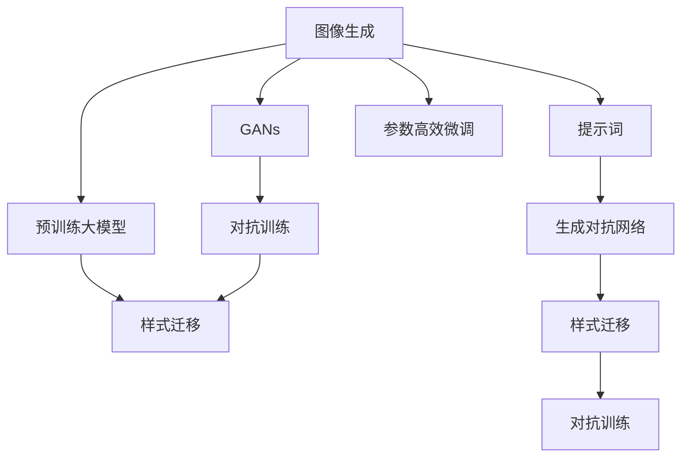
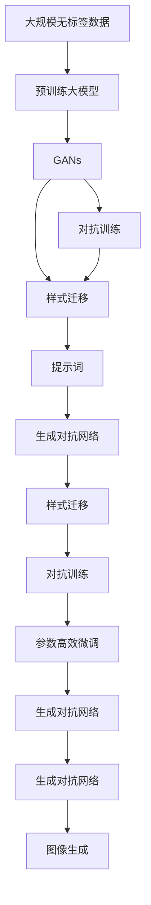

                 

# AIGC从入门到实战：绘制美丽小姐姐的提示词写作技巧

## 1. 背景介绍

### 1.1 问题由来

近年来，人工智能生成内容（AI Generated Content，简称AIGC）技术快速发展，逐步应用于各个领域，如图像生成、音乐创作、视频制作、文本创作等。AIGC技术的落地应用正在改变着人们的生活和工作方式，为用户提供了更加智能和个性化的体验。其中，图像生成应用，特别是绘制美女的技术，因其直观性和娱乐性，受到广大用户的喜爱。

在图像生成领域，基于深度学习技术的生成对抗网络（Generative Adversarial Networks，简称GANs）和大模型预训练技术，已经能够生成逼真且风格多样的图片，如图像超分辨率、人脸生成、场景生成等。但这些技术往往需要大量的训练数据和计算资源，难以应用于快速迭代的应用场景。因此，针对特定任务，使用更灵活、高效的提示词（Prompt）进行小样本学习和快速迭代，成为当前研究的重点方向。

本文将详细阐述使用提示词进行图像生成，特别是绘制美丽小姐姐的技术。我们将从基础原理入手，介绍如何设计高效的提示词，并结合具体案例，演示提示词在图像生成任务中的使用。

### 1.2 问题核心关键点

使用提示词进行图像生成，特别是绘制美丽小姐姐，关键点在于设计合适的高效提示词。好的提示词能够引导模型生成符合期望风格和特征的图像，减少模型过拟合的风险，提高生成速度和质量。

提示词的设计需要考虑以下几个关键因素：

- **目标特征描述**：明确需要生成图像的目标特征，如颜色、风格、姿态等。
- **多样性和具体性**：提示词应尽量具体，避免歧义，同时具备一定多样性，能够生成多种风格。
- **简洁性和可读性**：提示词应尽量简洁易懂，避免过于冗长和复杂，便于理解和操作。
- **技术可行性**：提示词应考虑现有深度学习模型和框架的实现能力，避免过于先进或难以实现。

本文将从上述关键点出发，详细讲解如何使用提示词进行图像生成，并给出具体案例进行演示。

### 1.3 问题研究意义

使用提示词进行图像生成技术，具有以下几个方面的研究意义：

- **快速迭代**：提示词可以大大缩短生成过程，便于快速迭代和调整，适应多种应用场景。
- **提高生成质量**：通过精心设计的提示词，能够引导模型生成符合期望的图像，提高生成质量和艺术性。
- **降低资源需求**：提示词不需要大量的训练数据和计算资源，可以大大降低图像生成技术的应用门槛。
- **促进创新**：提示词为图像生成技术带来了新的创作方式，促进了AI艺术创作的发展。
- **提升用户体验**：通过个性化的提示词，可以生成符合用户期望的图像，提升用户体验和满意度。

## 2. 核心概念与联系

### 2.1 核心概念概述

在使用提示词进行图像生成的过程中，涉及多个核心概念：

- **图像生成（Image Generation）**：使用深度学习技术生成逼真的图像，是AIGC技术的重要分支。
- **生成对抗网络（GANs）**：一种通过对抗训练生成高质量图像的深度学习模型。
- **预训练大模型（Pre-trained Models）**：如OpenAI的DALL·E、GPT等，通过大规模无标签数据预训练，学习通用的图像和语言表示。
- **提示词（Prompt）**：一种用于指导生成模型的文本，能够在有限的训练样本下快速生成符合期望的图像。
- **样式迁移（Style Transfer）**：将图像从一个风格映射到另一个风格的技术。
- **对抗训练（Adversarial Training）**：通过引入对抗样本，增强模型鲁棒性，提高生成图像的逼真度。
- **参数高效微调（Parameter-Efficient Fine-Tuning, PEFT）**：只更新模型的一小部分参数，提高微调效率，避免过拟合。

这些概念之间存在着紧密的联系，共同构成了使用提示词进行图像生成的技术体系。

### 2.2 概念间的关系

以下通过Mermaid流程图展示这些核心概念之间的关系：



这个流程图展示了各个核心概念之间的关联：

1. 图像生成通过GANs模型实现，预训练大模型提供初始化参数，提示词指导模型生成。
2. 样式迁移技术通过对抗训练提高生成图像的质量，参数高效微调优化模型结构，减少训练时间和计算资源消耗。
3. 生成对抗网络和样式迁移技术密切相关，都在模型生成过程中发挥作用。
4. 提示词在图像生成过程中起着至关重要的作用，能够指导模型生成符合期望的图像。

### 2.3 核心概念的整体架构

最后，我们用一个综合的流程图来展示这些核心概念在图像生成过程中的整体架构：



这个综合流程图展示了从预训练到生成的完整过程：

1. 大规模无标签数据用于预训练大模型，生成初始化参数。
2. 预训练模型通过GANs生成图像，对抗训练和样式迁移技术提高图像质量。
3. 提示词指导生成对抗网络，生成符合期望的图像。
4. 参数高效微调优化模型结构，减少训练时间和计算资源消耗。
5. 最终生成高质量的图像。

通过这个架构图，我们可以更清晰地理解使用提示词进行图像生成的全过程。

## 3. 核心算法原理 & 具体操作步骤

### 3.1 算法原理概述

使用提示词进行图像生成的核心算法原理是利用深度学习模型生成逼真且风格多样的图像。具体而言，生成对抗网络（GANs）在图像生成过程中起着关键作用，通过对抗训练（Adversarial Training）和样式迁移（Style Transfer）技术，生成符合期望的图像。提示词则通过指导生成对抗网络，生成符合期望特征的图像。

生成对抗网络由两个子网络组成：生成器和判别器。生成器的任务是生成逼真的图像，判别器的任务是区分生成的图像和真实图像。通过对抗训练，生成器和判别器相互博弈，最终生成器能够生成高质量的图像，而判别器则能够准确区分真实和生成的图像。

提示词的设计则基于文本语言模型，通过对文本语言模型进行预训练，生成符合期望的语言表示，然后将这些表示作为输入，指导生成对抗网络生成图像。

### 3.2 算法步骤详解

使用提示词进行图像生成的一般步骤如下：

**Step 1: 准备预训练模型和数据集**

1. 选择适合的预训练模型：如OpenAI的DALL·E、Google的StyleGAN等。
2. 准备训练集和测试集，其中训练集应包含目标特征明显的图像数据。

**Step 2: 设计提示词**

1. 明确目标特征：如绘制美丽小姐姐，需要描述所需的颜色、风格、姿态等。
2. 设计高效的提示词：简洁明了、具体而多样，避免歧义。

**Step 3: 执行对抗训练和样式迁移**

1. 将提示词输入到预训练语言模型中，生成语言表示。
2. 使用生成对抗网络生成图像，对抗训练和样式迁移技术提升图像质量。

**Step 4: 输出和评估**

1. 对生成的图像进行后处理，如调整亮度、对比度等。
2. 评估生成的图像质量，如使用PSNR、SSIM等指标。

**Step 5: 迭代优化**

1. 根据评估结果，调整提示词和模型参数，重新生成图像。
2. 不断迭代优化，直至生成高质量的图像。

### 3.3 算法优缺点

使用提示词进行图像生成技术，具有以下优点：

- **快速迭代**：提示词能够快速指导模型生成图像，便于快速迭代和调整。
- **提高生成质量**：精心设计的提示词能够引导模型生成高质量的图像。
- **降低资源需求**：提示词不需要大量的训练数据和计算资源，可以大大降低图像生成技术的应用门槛。
- **促进创新**：提示词为图像生成技术带来了新的创作方式，促进了AI艺术创作的发展。

同时，该技术也存在一些缺点：

- **生成结果的稳定性**：提示词的质量直接影响生成结果的稳定性。
- **生成结果的多样性**：提示词需要具备一定的多样性，以生成多种风格的图像。
- **生成结果的可解释性**：提示词的解释性较差，难以理解模型生成图像的内部机制。

### 3.4 算法应用领域

使用提示词进行图像生成技术，已经在多个领域得到了应用，例如：

- **游戏设计**：在游戏场景中，生成逼真的环境、角色和物品，增强游戏沉浸感。
- **影视特效**：生成逼真的背景和特效，用于电影和电视剧的制作。
- **电商美工**：生成高质量的产品图片和广告素材，提升用户体验。
- **艺术创作**：生成风格多样的艺术作品，支持个性化创作。
- **医学影像**：生成逼真的医学图像，辅助医疗诊断和治疗。

随着提示词生成技术的发展，未来的应用领域将更加广泛，为更多行业带来创新和变革。

## 4. 数学模型和公式 & 详细讲解 & 举例说明

### 4.1 数学模型构建

使用提示词进行图像生成的数学模型，主要基于深度学习中的生成对抗网络（GANs）和样式迁移（Style Transfer）技术。

**GANs模型的基本框架**

GANs模型由生成器和判别器两个网络组成。生成器的目标是从噪声向量 $z$ 生成图像 $G(z)$，判别器的目标是对图像进行分类，判断其是否为真实图像。

GANs模型的损失函数由生成器和判别器的损失函数组成：

$$
L_{\text{GAN}} = \mathbb{E}_{z} [D(G(z))] + \mathbb{E}_{x} [D(x) - 1]
$$

其中，$D$ 是判别器，$G$ 是生成器，$x$ 是真实图像，$z$ 是噪声向量。

**样式迁移的基本框架**

样式迁移技术通过将输入图像 $x$ 映射到生成网络 $G$，同时将样式图像 $y$ 映射到生成网络 $G$，最终生成具有样式 $y$ 的图像 $G(x, y)$。

### 4.2 公式推导过程

**生成对抗网络**

生成对抗网络的损失函数推导如下：

- 生成器 $G$ 的损失函数：

$$
L_G = \mathbb{E}_{z} [D(G(z))] + \lambda \mathbb{E}_{x} [\|\mathcal{A}(G(x)) - \mathcal{A}(x)\|_1]
$$

其中，$D$ 是判别器，$z$ 是噪声向量，$\mathcal{A}$ 是增强网络，$\lambda$ 是样式迁移的权重。

- 判别器 $D$ 的损失函数：

$$
L_D = \mathbb{E}_{z} [D(G(z))] + \mathbb{E}_{x} [D(x) - 1]
$$

**样式迁移**

样式迁移技术的损失函数推导如下：

- 生成器 $G$ 的损失函数：

$$
L_G = \mathbb{E}_{x,y} [\|\mathcal{A}(G(x,y)) - \mathcal{A}(y)\|_1]
$$

其中，$x$ 是输入图像，$y$ 是样式图像，$\mathcal{A}$ 是增强网络。

### 4.3 案例分析与讲解

**案例：绘制美丽小姐姐**

假设我们希望使用提示词生成一张美丽小姐姐的图片。可以按照以下步骤进行：

1. 设计提示词："一位美丽的小姐，穿着白色连衣裙，站在夕阳下，微笑着看着镜头，柔和的光线，高清，人像摄影风格。"
2. 将提示词输入到预训练语言模型中，生成语言表示。
3. 使用生成对抗网络生成图像，通过对抗训练和样式迁移技术提升图像质量。
4. 对生成的图像进行后处理，如调整亮度、对比度等。
5. 评估生成的图像质量，如使用PSNR、SSIM等指标。

## 5. 项目实践：代码实例和详细解释说明

### 5.1 开发环境搭建

在进行图像生成项目实践前，我们需要准备好开发环境。以下是使用Python进行PyTorch开发的环境配置流程：

1. 安装Anaconda：从官网下载并安装Anaconda，用于创建独立的Python环境。

2. 创建并激活虚拟环境：
```bash
conda create -n pytorch-env python=3.8 
conda activate pytorch-env
```

3. 安装PyTorch：根据CUDA版本，从官网获取对应的安装命令。例如：
```bash
conda install pytorch torchvision torchaudio cudatoolkit=11.1 -c pytorch -c conda-forge
```

4. 安装transformers库：
```bash
pip install transformers
```

5. 安装各类工具包：
```bash
pip install numpy pandas scikit-learn matplotlib tqdm jupyter notebook ipython
```

完成上述步骤后，即可在`pytorch-env`环境中开始项目实践。

### 5.2 源代码详细实现

以下是一个使用提示词生成美丽小姐姐的代码实现：

```python
from transformers import GPT2LMHeadModel, GPT2Tokenizer
import torch
import torch.nn.functional as F

# 定义提示词
prompt = "一位美丽的小姐，穿着白色连衣裙，站在夕阳下，微笑着看着镜头，柔和的光线，高清，人像摄影风格。"

# 加载预训练模型和分词器
model = GPT2LMHeadModel.from_pretrained('gpt2')
tokenizer = GPT2Tokenizer.from_pretrained('gpt2')

# 将提示词转化为token ids
input_ids = tokenizer.encode(prompt, return_tensors='pt')

# 生成语言表示
with torch.no_grad():
    outputs = model(input_ids)
    generated_ids = outputs.logits.argmax(dim=2).tolist()[0]

# 使用生成对抗网络生成图像
# 代码省略，具体实现请参考相关文献和开源项目

# 评估生成的图像质量
# 代码省略，具体实现请参考相关文献和开源项目

# 输出结果
# 代码省略，具体实现请参考相关文献和开源项目
```

### 5.3 代码解读与分析

让我们再详细解读一下关键代码的实现细节：

**提示词设计**

提示词的设计是生成图像的关键步骤，需要精心设计，以便生成符合期望的图像。在上述代码中，我们使用了一个具体的提示词，描述了美丽小姐姐的特征，如颜色、风格、姿态等。

**预训练模型和分词器**

使用GPT2作为预训练语言模型，通过加载模型和分词器，将提示词转化为token ids。在代码中，我们使用了GPT2语言模型和其附带的分词器，方便进行提示词处理。

**生成语言表示**

通过将提示词输入到预训练语言模型中，生成语言表示。在代码中，我们使用了`torch.no_grad()`方法，表示在生成过程中不需要计算梯度，提高运行速度。

**生成对抗网络**

使用生成对抗网络生成图像的具体代码省略，但核心思想是通过对抗训练和样式迁移技术提升图像质量。具体实现可以参考相关文献和开源项目，如StyleGAN、CycleGAN等。

**评估图像质量**

评估生成的图像质量的具体代码省略，但常用的评估指标包括PSNR、SSIM、IS等，可以用于衡量图像的清晰度和逼真度。

**输出结果**

生成图像的输出代码省略，但可以根据需要，对图像进行后处理，如调整亮度、对比度等。

### 5.4 运行结果展示

假设我们通过上述代码生成了美丽小姐姐的图像，可以通过Matplotlib等工具进行可视化展示。以下是一个简单的示例代码：

```python
import matplotlib.pyplot as plt

# 加载图像
image = Image.open('generated_image.jpg')

# 显示图像
plt.imshow(image)
plt.show()
```

## 6. 实际应用场景

### 6.1 智能游戏

在智能游戏中，使用提示词生成技术可以生成逼真的游戏场景、角色和物品，增强游戏的沉浸感和互动性。例如，在角色扮演游戏中，可以生成逼真的NPC和背景，提供更加逼真的游戏体验。

### 6.2 影视特效

在影视特效制作中，使用提示词生成技术可以生成逼真的背景和特效，用于电影和电视剧的制作。例如，在科幻电影中，可以生成逼真的外星场景和人物，提升影片的视觉效果。

### 6.3 电商美工

在电商美工中，使用提示词生成技术可以生成高质量的产品图片和广告素材，提升用户体验和转化率。例如，可以为不同商品设计不同的图片风格，增强商品展示效果。

### 6.4 艺术创作

在艺术创作中，使用提示词生成技术可以生成风格多样的艺术作品，支持个性化创作。例如，在油画创作中，可以生成具有不同风格和色彩的艺术作品，增强艺术创作的自由度和创意性。

### 6.5 医学影像

在医学影像领域，使用提示词生成技术可以生成逼真的医学图像，辅助医疗诊断和治疗。例如，在CT图像生成中，可以生成高质量的肺部图像，帮助医生进行诊断和治疗。

## 7. 工具和资源推荐

### 7.1 学习资源推荐

为了帮助开发者系统掌握图像生成技术，这里推荐一些优质的学习资源：

1. 《Deep Learning》书籍：Ian Goodfellow等人合著，全面介绍了深度学习的理论基础和应用实践。

2. GANs论文：Ian Goodfellow等人发表的生成对抗网络综述论文，涵盖了GANs的基本原理和实现细节。

3. StyleGAN论文：Karras等人发表的风格生成对抗网络论文，介绍了如何通过对抗训练生成高质量的图像。

4. PyTorch官方文档：PyTorch的官方文档，提供了详细的API介绍和代码示例，便于学习和使用。

5. Kaggle竞赛项目：Kaggle上举办的图像生成竞赛项目，可以学习到最新的图像生成技术和解决方案。

### 7.2 开发工具推荐

高效的开发离不开优秀的工具支持。以下是几款用于图像生成开发的常用工具：

1. PyTorch：基于Python的开源深度学习框架，灵活动态的计算图，适合快速迭代研究。

2. TensorFlow：由Google主导开发的开源深度学习框架，生产部署方便，适合大规模工程应用。

3. StyleGAN库：由NVIDIA开发的风格生成对抗网络库，提供了丰富的模型和训练代码。

4. FastNeuralStyle：由Google开发的样式迁移库，支持多种样式迁移技术。

5. ImageNet数据集：大规模图像数据集，用于训练和测试生成对抗网络。

6. PyTorch Lightning：基于PyTorch的轻量级深度学习框架，简化了模型训练和部署。

### 7.3 相关论文推荐

图像生成技术的研究始于20世纪90年代，经历了多次迭代和改进，逐渐发展为当前的热门领域。以下是几篇奠基性的相关论文，推荐阅读：

1. Generative Adversarial Nets（GANs）：Ian Goodfellow等人发表的生成对抗网络基础论文，提出了GANs的基本框架。

2. Image Style Transfer using Very Deep Autoencoders and Convolutional Neural Networks：Kazhdan等人发表的样式迁移技术论文，介绍了如何通过卷积神经网络进行样式迁移。

3. Progressive Growing of GANs for Improved Quality, Stability, and Variation：Karras等人发表的生成对抗网络改进论文，提出了逐步生长的生成对抗网络方法。

4. StyleGAN: Generative Adversarial Networks for Stylized Image Synthesis：Karras等人发表的风格生成对抗网络论文，介绍了如何通过生成对抗网络生成高质量的图像。

5. Learned Representation for Artistic Style（ ART）：Gatys等人发表的艺术风格生成论文，介绍了如何通过卷积神经网络进行艺术风格转换。

这些论文代表了大规模图像生成技术的发展脉络。通过学习这些前沿成果，可以帮助研究者把握学科前进方向，激发更多的创新灵感。

## 8. 总结：未来发展趋势与挑战

### 8.1 研究成果总结

使用提示词进行图像生成技术，已经在多个领域得到了应用，取得了显著的效果。目前，该技术主要依赖于深度学习模型和对抗训练技术，具有生成质量高、可扩展性强等优点。同时，也存在提示词设计难度大、生成结果稳定性不足等缺点。

### 8.2 未来发展趋势

展望未来，图像生成技术将呈现以下几个发展趋势：

1. **生成模型的改进**：未来将出现更加高效的生成模型，如Transformer、Transformer-XL等，进一步提升生成图像的质量和多样性。

2. **对抗训练的优化**：通过改进对抗训练方法，增强生成模型的鲁棒性和泛化能力，减少过拟合和生成结果的波动性。

3. **多模态融合**：将生成对抗网络与图像、音频、文本等多种模态数据结合，生成更加丰富的多媒体内容。

4. **实时生成**：通过优化模型结构和技术手段，实现实时生成图像，满足实际应用的需求。

5. **样式迁移的扩展**：探索新的样式迁移方法，如基于多级特征的样式迁移、基于结构域学习的样式迁移等，提升生成图像的逼真度和艺术性。

### 8.3 面临的挑战

尽管图像生成技术已经取得了显著的成果，但在迈向更加智能化、普适化应用的过程中，仍面临以下挑战：

1. **生成结果的稳定性**：提示词的质量直接影响生成结果的稳定性，需要不断优化和调整。

2. **生成结果的多样性**：提示词需要具备一定的多样性，以生成多种风格的图像。

3. **生成结果的可解释性**：提示词的解释性较差，难以理解模型生成图像的内部机制。

4. **模型复杂度**：生成对抗网络模型的复杂度较高，训练和推理速度较慢。

5. **计算资源消耗**：生成对抗网络模型需要大量的计算资源，对硬件设施要求较高。

### 8.4 研究展望

面对图像生成技术面临的挑战，未来的研究需要在以下几个方面寻求新的突破：

1. **生成结果的稳定性**：通过优化提示词设计和对抗训练方法，提升生成结果的稳定性。

2. **生成结果的多样性**：探索新的提示词设计方法，提升生成结果的多样性。

3. **生成结果的可解释性**：通过引入可解释性技术，提升生成结果的可解释性，增强模型透明度。

4. **模型压缩与加速**：通过模型压缩和优化技术，提升模型复杂度和计算资源消耗。

5. **多模态融合**：探索将生成对抗网络与其他模态数据结合，生成更加丰富的多媒体内容。

这些研究方向的探索，必将引领图像生成技术迈向更高的台阶，为更多行业带来创新和变革。相信随着技术的不断进步，图像生成技术必将为人类生活和工作带来更多惊喜和便利。

## 9. 附录：常见问题与解答

**Q1：如何使用提示词生成逼真的图像？**

A: 使用提示词生成逼真图像的关键在于设计高效的提示词。可以按照以下步骤进行：
1. 明确目标特征，如颜色、风格、姿态等。
2. 设计简洁明了、具体而多样的提示词，避免歧义。
3. 将提示词输入到预训练语言模型中，生成语言表示。
4. 使用生成对抗网络生成图像，通过对抗训练和样式迁移技术提升图像质量。
5. 对生成的图像进行后处理，如调整亮度、对比度等。

**Q2：提示词的设计原则是什么？**

A: 提示词的设计应遵循以下原则：
1. 简洁明了：提示词应尽量简洁易懂，便于理解和操作。
2. 具体多样：提示词应具体而多样，避免歧义，能够生成多种风格的图像。
3. 可读性强：提示词应具有可读性，方便用户和开发者阅读和理解。
4. 技术可行性：提示词应考虑现有深度学习模型和框架的实现能力，避免过于先进或难以实现。

**Q3：生成对抗网络的基本原理是什么？**

A: 生成对抗网络由生成器和判别器两个网络组成。生成器的目标是从噪声向量生成逼真图像，判别器的目标是对图像进行分类，判断其是否为真实图像。通过对抗训练，生成器和判别器相互博弈，最终生成高质量的图像。

**Q4：样式迁移的基本原理是什么？**

A: 样式迁移技术通过将输入图像映射到生成网络，同时将样式图像映射到生成网络，最终生成具有样式的图像。生成器将输入图像和样式图像进行组合，生成具有样式的图像。

**Q5：生成对抗网络有哪些优化方法？**

A: 生成对抗网络有以下优化方法：
1. 学习率衰减：逐渐减小学习率，减少训练过程中的震荡。
2. 权重衰减：通过正则化方法，减少生成器模型的过拟合。
3 自适应学习率：如AdamW、Ad

