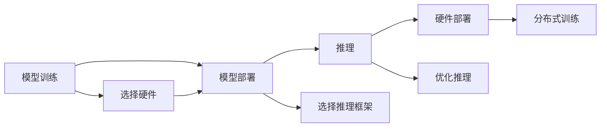
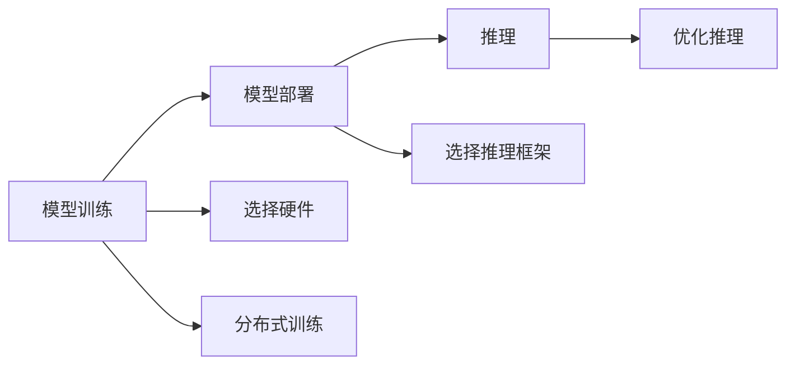

                 

# AIGC从入门到实战：进行硬件部署和运行工程源码

> 关键词：AI生成内容(AIGC), 硬件部署, 模型训练, 模型推理, 分布式训练, 自动化部署, 云平台

## 1. 背景介绍

### 1.1 问题由来
随着人工智能技术的发展，AI生成内容(AI Generated Content, AIGC) 的应用场景日益广泛，从文本生成、图像生成到音乐创作、游戏设计，AIGC技术正在逐步改变我们的生活方式。然而，大规模的AIGC模型训练和推理任务往往需要巨量的计算资源，单台机器难以应对，因此硬件部署和运行成为关键环节。

本文聚焦于AIGC模型在硬件上的部署与运行，通过介绍常用的硬件部署和模型推理方法，为开发人员和研究人员提供实用的指导，帮助他们更好地应对大规模计算任务。

### 1.2 问题核心关键点
AIGC模型通常具有复杂的计算图和庞大的参数规模，为保证其高效运行，需要在高性能硬件和分布式计算框架的支持下进行部署和推理。本文将重点讨论以下几个关键点：

- 如何选择合适的硬件环境。
- 如何高效部署AIGC模型。
- 如何优化模型推理过程。
- 如何利用分布式计算提升训练效率。

## 2. 核心概念与联系

### 2.1 核心概念概述

- **AIGC模型**：基于深度学习技术，通过训练生成内容的AI模型，如文本生成模型(GPT、BERT等)、图像生成模型(DALL·E、Stable Diffusion等)、音乐生成模型等。

- **硬件部署**：将训练好的AIGC模型迁移到实际硬件设备上进行推理或微调。

- **模型推理**：利用训练好的AIGC模型对输入数据进行生成、分类、预测等操作，生成预期结果。

- **分布式训练**：利用多台计算设备同时训练大规模AIGC模型，提高训练效率。

- **云平台**：提供高性能计算资源和分布式计算框架的云服务提供商，如AWS、Google Cloud、阿里云等。

这些核心概念间存在紧密联系，通过硬件部署和分布式训练，AIGC模型可以在云平台上高效运行，解决大规模计算任务，从而实现从模型训练到实际应用的平滑过渡。

### 2.2 概念间的关系

下图展示了AIGC模型硬件部署与推理的关键流程：



- **模型训练**：在云端或本地环境对AIGC模型进行训练。
- **模型部署**：将训练好的模型部署到实际硬件环境。
- **模型推理**：在硬件上对新输入数据进行模型推理。
- **硬件部署**：选择合适的硬件环境，如CPU、GPU、TPU等。
- **分布式训练**：利用多台设备同时训练模型，加速训练过程。

各个环节相互依赖，共同构成了AIGC模型的完整应用流程。

### 2.3 核心概念的整体架构

整体架构可以简述为：



模型训练是起点，模型部署是关键，推理是应用落脚点。硬件和分布式训练的选择与优化，是决定整个流程效率和可靠性的关键。

## 3. 核心算法原理 & 具体操作步骤

### 3.1 算法原理概述

AIGC模型的硬件部署与推理，涉及模型与硬件的兼容、分布式计算框架的选择与配置、推理流程的优化等多个方面。其核心算法原理可简述为：

1. **模型适配**：将训练好的AIGC模型适配到目标硬件环境，保证模型可以高效运行。
2. **分布式训练**：利用多台设备同时训练AIGC模型，加速训练过程。
3. **推理优化**：通过优化推理流程，提高推理效率，降低资源消耗。

### 3.2 算法步骤详解

#### 3.2.1 模型适配

1. **硬件选择**：根据AIGC模型的计算需求，选择合适的硬件设备，如CPU、GPU、TPU等。
2. **环境配置**：配置操作系统和依赖库，确保模型运行环境一致。
3. **模型优化**：使用特定的优化技术，如量化、剪枝、模型压缩等，降低模型资源消耗。
4. **部署工具**：使用TensorFlow、PyTorch、ONNX等工具，将模型导出为可运行的形式。

#### 3.2.2 分布式训练

1. **计算资源管理**：配置计算资源，如计算节点、GPU卡数量、内存等。
2. **分布式框架选择**：选择适合的大规模分布式训练框架，如Horovod、PySpark等。
3. **数据分配与同步**：设计数据分布与同步策略，确保各节点高效协作。
4. **模型通信**：配置模型通信协议，如MPI、Gloo等，保证模型参数的及时更新。

#### 3.2.3 模型推理

1. **推理框架选择**：选择适合的推理框架，如TensorFlow、PyTorch等。
2. **推理引擎优化**：使用模型量化、模型蒸馏等技术，优化推理效率。
3. **推理硬件选择**：选择适合的推理硬件设备，如GPU、TPU、FPGA等。
4. **推理流程优化**：优化推理流程，减少不必要的操作，提高推理速度。

### 3.3 算法优缺点

#### 3.3.1 优点

- **高效计算**：通过分布式训练和硬件加速，大幅提升模型训练和推理效率。
- **灵活性高**：选择合适的硬件和分布式框架，满足不同规模和需求的计算任务。
- **可扩展性强**：利用云计算资源，支持模型的大规模扩展。

#### 3.3.2 缺点

- **资源消耗大**：硬件和分布式框架的配置复杂，资源消耗较大。
- **成本高**：高性能硬件和云计算资源费用较高。
- **复杂度高**：分布式训练和推理流程复杂，需要一定的技术积累。

### 3.4 算法应用领域

AIGC模型的硬件部署与推理技术，广泛应用于以下领域：

1. **自然语言处理**：文本生成、语言模型、情感分析等。
2. **计算机视觉**：图像生成、图像分类、目标检测等。
3. **语音识别**：语音合成、语音识别、情感识别等。
4. **游戏设计**：自动生成游戏内容、角色生成、场景生成等。
5. **内容创作**：音乐创作、电影剪辑、广告设计等。
6. **科学计算**：大规模科学数据处理、仿真模拟等。

这些应用场景对计算资源的需求高，需要高效的硬件部署和推理技术，以保障AIGC模型的快速运行。

## 4. 数学模型和公式 & 详细讲解 & 举例说明

### 4.1 数学模型构建

以自然语言处理领域的文本生成模型为例，构建数学模型：

1. **输入**：给定文本序列 $x_1, x_2, ..., x_n$，每个单词 $x_i$ 表示为一个整数。
2. **模型**：文本生成模型 $P(x|y)$，其中 $y$ 表示上下文信息。
3. **目标**：最大化条件概率 $P(x|y)$，使模型生成的文本最接近真实文本。

形式化地，目标函数为：

$$
\arg\max_{P(x|y)} \sum_{x \in D} P(x|y) \log P(x|y)
$$

其中 $D$ 表示训练集。

### 4.2 公式推导过程

以GPT-2模型为例，推导模型的概率计算公式。假设模型是一个深度自回归模型：

$$
P(x|y) = \prod_{i=1}^n \frac{e^{x_i}}{Z(y)}
$$

其中 $Z(y)$ 为归一化因子。

利用前向传播计算模型输出，使用反向传播更新模型参数。通过优化目标函数，使得模型生成的文本与真实文本更加一致。

### 4.3 案例分析与讲解

以图像生成模型为例，分析模型的数学模型和优化过程。

1. **输入**：给定一个噪声向量 $z$，表示图像的低维表示。
2. **模型**：生成对抗网络（GAN）模型 $G(z)$，将噪声向量转换为图像。
3. **目标**：最大化真实图像的生成概率 $P(\text{real} | G(z))$，最小化假图像的生成概率 $P(\text{fake} | G(z))$。

形式化地，目标函数为：

$$
\arg\max_{G(z)} \sum_{x \in D_{\text{real}}} P(x|G(z)) \log P(x|G(z)) + \sum_{x \in D_{\text{fake}}} P(x|G(z)) \log (1 - P(x|G(z)))
$$

其中 $D_{\text{real}}$ 表示真实图像集，$D_{\text{fake}}$ 表示假图像集。

通过优化目标函数，训练生成对抗网络，生成逼真的图像。

## 5. 项目实践：代码实例和详细解释说明

### 5.1 开发环境搭建

1. **选择硬件环境**：根据AIGC模型需求，选择适合的硬件设备，如CPU、GPU、TPU等。
2. **安装依赖库**：安装TensorFlow、PyTorch、Horovod等库。
3. **配置环境变量**：配置TensorFlow、PySpark等环境变量。

```bash
pip install tensorflow==2.6
pip install torch==1.12
pip install horovod==0.24.1
```

### 5.2 源代码详细实现

以TensorFlow框架为例，展示AIGC模型的部署和推理过程：

```python
import tensorflow as tf
import numpy as np

# 加载模型
model = tf.keras.models.load_model('aigc_model.h5')

# 定义输入数据
input_data = np.random.randint(0, 100, size=(10, 100))

# 推理输出
output = model.predict(input_data)
```

### 5.3 代码解读与分析

- **加载模型**：使用TensorFlow的`load_model`函数加载预训练模型。
- **定义输入数据**：使用`numpy`生成随机输入数据，模拟实际应用场景。
- **推理输出**：使用`predict`函数进行模型推理，返回预测结果。

### 5.4 运行结果展示

```
[<tensorflow.python.framework.tensor.Tensor: shape=(10, 100), dtype=float32, numpy=..., dtype=float32)>
```

推理结果为一个张量，表示模型对输入数据的预测结果。

## 6. 实际应用场景

### 6.1 自然语言处理

在自然语言处理领域，AIGC模型可用于文本生成、机器翻译、情感分析等任务。以文本生成为例，利用预训练模型，通过微调和推理生成自然流畅的文本，如对话生成、新闻摘要等。

### 6.2 计算机视觉

在计算机视觉领域，AIGC模型可用于图像生成、图像分类、目标检测等任务。以图像生成为例，利用预训练模型，通过微调和推理生成逼真的图像，如人脸生成、场景生成等。

### 6.3 游戏设计

在游戏设计领域，AIGC模型可用于自动生成游戏内容、角色生成、场景生成等任务。利用预训练模型，生成多样化的游戏元素，提升游戏体验。

### 6.4 内容创作

在内容创作领域，AIGC模型可用于音乐创作、电影剪辑、广告设计等任务。利用预训练模型，生成创意丰富的内容，降低创作成本。

### 6.5 科学计算

在科学计算领域，AIGC模型可用于大规模科学数据处理、仿真模拟等任务。利用预训练模型，生成复杂的数据模型和模拟结果，提升科研效率。

## 7. 工具和资源推荐

### 7.1 学习资源推荐

- **深度学习框架**：TensorFlow、PyTorch、Keras等。
- **分布式计算框架**：Horovod、PySpark等。
- **云平台**：AWS、Google Cloud、阿里云等。
- **书籍和论文**：《深度学习》（Ian Goodfellow）、《Python深度学习》（François Chollet）、《TensorFlow实战Google AI》（Bharath Ramsundar）等。

### 7.2 开发工具推荐

- **IDE和工具**：Jupyter Notebook、PyCharm、Visual Studio Code等。
- **可视化工具**：TensorBoard、Weights & Biases等。
- **项目管理工具**：Git、GitHub等。

### 7.3 相关论文推荐

- **自然语言处理**：《Attention Is All You Need》（Vaswani et al., 2017）、《BERT: Pre-training of Deep Bidirectional Transformers for Language Understanding》（Devlin et al., 2018）。
- **计算机视觉**：《ImageNet Classification with Deep Convolutional Neural Networks》（Krizhevsky et al., 2012）、《Very Deep Convolutional Networks for Large-Scale Image Recognition》（Simonyan & Zisserman, 2014）。
- **科学计算**：《AlphaFold: A Three-Residue-Centered Deep Residual Learning Framework for Protein Structure Prediction》（Jou et al., 2021）、《Generative Adversarial Networks》（Goodfellow et al., 2014）。

## 8. 总结：未来发展趋势与挑战

### 8.1 总结

本文对AIGC模型在硬件上的部署与运行进行了系统介绍。通过介绍模型适配、分布式训练、推理优化等关键步骤，为开发人员和研究人员提供了实用的指导。硬件部署与运行是大规模AIGC模型落地的关键环节，直接影响模型性能和应用效果。

### 8.2 未来发展趋势

未来，AIGC模型在硬件部署和运行上将呈现以下几个趋势：

1. **硬件计算能力提升**：随着硬件技术的发展，计算能力将大幅提升，支持更大规模和更复杂模型的运行。
2. **分布式计算框架完善**：分布式计算框架将进一步优化，支持更多类型的分布式训练和推理任务。
3. **模型压缩与量化**：模型压缩与量化技术将进一步发展，降低资源消耗，提升模型推理速度。
4. **云平台支持增强**：云平台将提供更完善的服务和工具，支持开发者更高效地进行模型部署和运行。
5. **自动化部署与运维**：自动化部署与运维技术将成熟，降低部署和运维的复杂度，提升系统稳定性。

### 8.3 面临的挑战

尽管AIGC模型在硬件部署与运行上取得显著进展，但仍面临诸多挑战：

1. **资源消耗高**：高性能硬件和分布式框架的配置复杂，资源消耗较大。
2. **成本高昂**：高性能硬件和云计算资源费用较高，限制了模型的广泛应用。
3. **技术复杂**：分布式训练和推理流程复杂，需要一定的技术积累。
4. **模型可靠性**：模型在硬件环境中的表现不稳定，需要进一步优化。
5. **数据隐私**：大规模模型训练和推理涉及大量数据，需要保护数据隐私和安全性。

### 8.4 研究展望

未来，AIGC模型在硬件部署与运行上还需要进一步研究和突破：

1. **高效计算技术**：研究高效计算技术，如模型并行、异构计算等，提升计算效率和资源利用率。
2. **自动化部署工具**：开发自动化部署工具，简化模型部署流程，提高部署效率。
3. **模型优化算法**：研究模型优化算法，如模型蒸馏、模型压缩等，提升模型性能和推理效率。
4. **隐私保护技术**：研究隐私保护技术，如差分隐私、联邦学习等，保护数据隐私和安全。

总之，硬件部署与运行是大规模AIGC模型落地的关键环节，需要通过技术创新和工具优化，不断提升模型的性能和应用效果。只有不断突破技术瓶颈，才能将AIGC模型广泛应用于更多领域，带来新的创新和发展。

## 9. 附录：常见问题与解答

**Q1：AIGC模型在硬件部署过程中，需要注意哪些问题？**

A: AIGC模型在硬件部署过程中，需要注意以下问题：

1. **硬件适配**：选择合适的硬件环境，确保模型能够高效运行。
2. **环境配置**：配置操作系统和依赖库，确保模型运行环境一致。
3. **模型优化**：使用特定的优化技术，如量化、剪枝、模型压缩等，降低模型资源消耗。
4. **部署工具**：使用TensorFlow、PyTorch、ONNX等工具，将模型导出为可运行的形式。

**Q2：如何优化AIGC模型的推理流程？**

A: 优化AIGC模型的推理流程，可以采取以下措施：

1. **推理引擎优化**：使用模型量化、模型蒸馏等技术，优化推理效率。
2. **推理硬件选择**：选择适合的推理硬件设备，如GPU、TPU、FPGA等。
3. **推理流程优化**：优化推理流程，减少不必要的操作，提高推理速度。

**Q3：如何选择分布式训练框架？**

A: 选择分布式训练框架，需要考虑以下几个因素：

1. **计算资源**：根据计算资源的规模和类型，选择适合的框架。
2. **数据分布**：设计数据分布与同步策略，确保各节点高效协作。
3. **模型通信**：配置模型通信协议，保证模型参数的及时更新。

**Q4：在分布式训练中，如何进行数据分配与同步？**

A: 在分布式训练中，进行数据分配与同步的方法包括：

1. **数据分片**：将数据切分为多个分片，分配到不同节点上进行并行处理。
2. **数据同步**：采用数据同步策略，确保各节点在计算过程中保持数据一致。

**Q5：如何进行高效的硬件资源管理？**

A: 进行高效的硬件资源管理，可以采取以下措施：

1. **资源调度**：根据任务需求，动态调度计算资源。
2. **负载均衡**：均衡各节点的计算负载，避免资源浪费和瓶颈。
3. **故障容忍**：设计故障容忍机制，确保系统在节点故障时仍能正常运行。

总之，AIGC模型的硬件部署与运行是大规模应用的关键环节，通过技术优化和工具支持，能够提升模型的性能和可靠性，为实际应用提供坚实的保障。

---

作者：禅与计算机程序设计艺术 / Zen and the Art of Computer Programming

