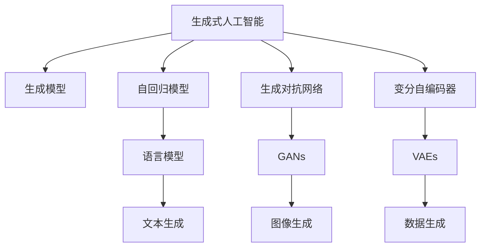
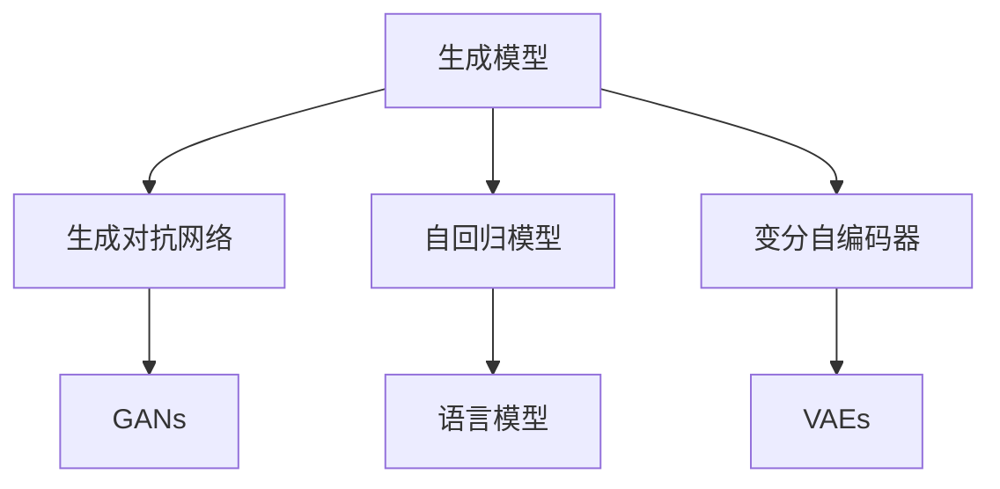
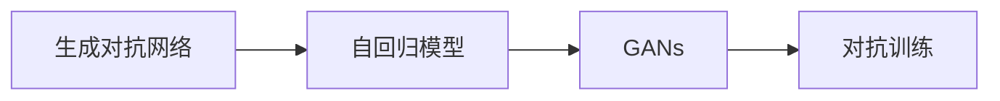
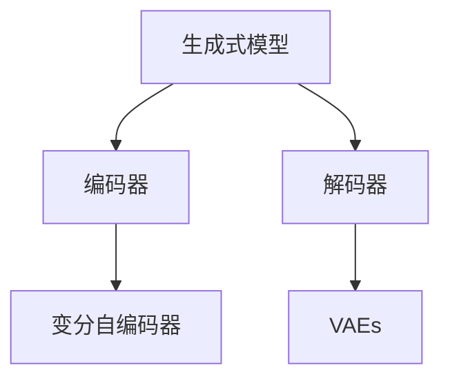
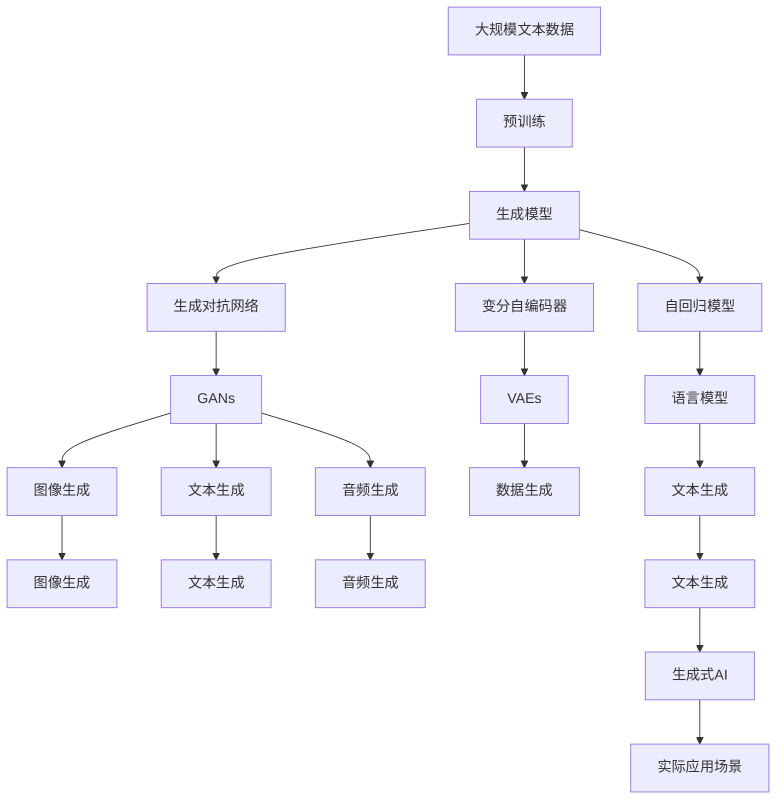
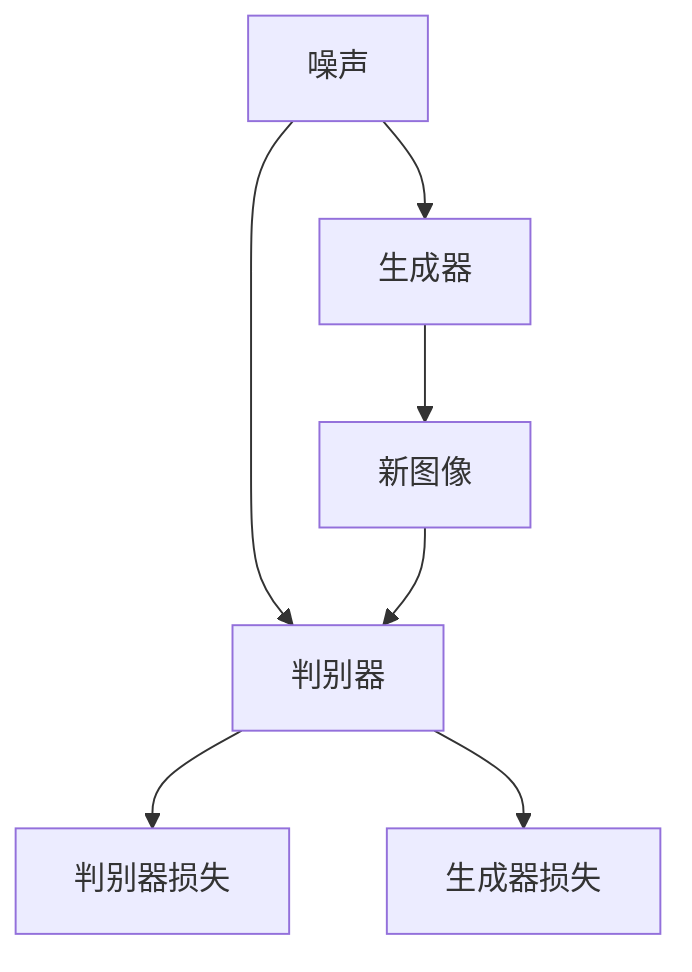

                 

# AIGC：未来已来，如何拥抱生成式AI时代？

> 关键词：生成式AI, 深度学习, 大模型, 预训练, 迁移学习, 自然语言处理(NLP), 计算机视觉(CV), 生成对抗网络(GAN), 对话系统, 音乐生成

## 1. 背景介绍

### 1.1 问题由来

随着人工智能(AI)技术的迅速发展，生成式人工智能(AIGC)正逐渐成为引领未来技术发展的重要方向。AIGC通过生成模型可以模拟出逼真的语音、图像、文本等，极大地拓展了AI应用场景。目前，AIGC技术已经渗透到了音乐、影视、游戏、教育等多个领域，展现了强大的潜力和应用前景。

生成式AI技术的核心是生成模型，它通过学习大量数据，捕捉数据中的模式，并利用这些模式进行新数据的生成。传统的生成模型包括自回归模型、变分自编码器(Generative Adversarial Networks, GANs)、变分自动编码器(Generative Variational Networks, GVNs)等。这些模型在图像、语音、文本等领域取得了显著的成果，成为了AIGC技术的重要支柱。

### 1.2 问题核心关键点

生成式AI技术的核心在于生成模型的设计和优化。其关键点包括：
- 数据驱动：生成模型需要大量的标注数据进行训练，从而学习到数据中的模式。
- 鲁棒性：生成的数据需要与真实数据具有高度的相似度，同时模型需要具备良好的泛化能力。
- 灵活性：生成的数据应该能够适应各种不同的应用场景，如文本生成、图像生成、音频生成等。
- 安全性：生成的数据不应该包含有害内容，避免对用户造成伤害。

## 2. 核心概念与联系

### 2.1 核心概念概述

为更好地理解生成式AI技术，本节将介绍几个密切相关的核心概念：

- 生成式人工智能(AIGC)：使用生成模型进行数据生成的AI技术，可以生成文本、图像、音频等。
- 生成模型(Generative Model)：通过学习数据分布，生成新的数据样本的模型。包括自回归模型、GANs、GVNs等。
- 变分自编码器(Generative Variational Networks, GVNs)：通过学习数据的概率分布，生成新的数据样本。
- 生成对抗网络(Generative Adversarial Networks, GANs)：通过对抗训练方式，生成与真实数据具有高度相似性的新数据。
- 自回归模型(Autoregressive Model)：按照时间顺序逐个生成数据，如语言模型。
- 变分自编码器(Variational Autoencoder, VAE)：通过编码器-解码器框架，生成与输入数据相似的新数据。
- 生成对抗网络(GANs)：通过生成器和判别器相互对抗，生成逼真的新数据。

这些核心概念之间的逻辑关系可以通过以下Mermaid流程图来展示：



这个流程图展示了大语言模型微调过程中各个核心概念的关系和作用：

1. 生成式人工智能是一个更广泛的概念，涵盖了多种生成模型。
2. 自回归模型、生成对抗网络和变分自编码器是生成模型中常见的三种类型。
3. 语言模型、图像生成、数据生成等是具体的应用场景。

### 2.2 概念间的关系

这些核心概念之间存在着紧密的联系，形成了生成式AI技术的完整生态系统。下面我通过几个Mermaid流程图来展示这些概念之间的关系。

#### 2.2.1 生成模型的学习范式



这个流程图展示了生成模型中常见的三种类型：自回归模型、生成对抗网络和变分自编码器。这三种模型可以各自应用于不同的数据生成任务，如图像生成、文本生成、音频生成等。

#### 2.2.2 生成对抗网络与自回归模型的关系



这个流程图展示了生成对抗网络与自回归模型之间的关系。GANs通过对抗训练方式生成与真实数据具有高度相似性的新数据，而自回归模型则按照时间顺序逐个生成数据。

#### 2.2.3 变分自编码器的学习过程



这个流程图展示了变分自编码器的学习过程。VAEs通过编码器将输入数据映射到潜在空间，解码器再将潜在空间的样本映射回原始空间，从而生成逼真的新数据。

### 2.3 核心概念的整体架构

最后，我们用一个综合的流程图来展示这些核心概念在大语言模型微调过程中的整体架构：



这个综合流程图展示了从预训练到生成式AI应用的完整过程。大语言模型首先在大规模文本数据上进行预训练，然后通过生成对抗网络、变分自编码器和自回归模型等生成模型进行数据生成，最后应用于图像、文本、音频等实际应用场景中。

## 3. 核心算法原理 & 具体操作步骤
### 3.1 算法原理概述

生成式AI技术基于生成模型，其核心思想是通过学习数据分布，生成新的数据样本。生成模型的训练目标通常包括最小化重构误差或最大化似然函数等。常用的生成模型包括自回归模型、变分自编码器、生成对抗网络等。

以生成对抗网络为例，其核心思想是：
- 生成器(Generator)：生成逼真的新数据。
- 判别器(Discriminator)：判断生成的数据是否与真实数据相似。
- 对抗训练：生成器和判别器相互对抗，使生成器生成的数据逼近真实数据。

生成对抗网络的训练过程如下：

1. 生成器接收随机噪声，生成逼真的新数据。
2. 判别器接收新数据和真实数据，判断其是否逼真。
3. 生成器和判别器相互对抗，交替更新权重。
4. 生成器生成的数据逐渐逼近真实数据，训练结束。

### 3.2 算法步骤详解

以生成对抗网络为例，生成式AI技术的一般流程如下：

1. 数据准备：收集并准备需要生成的数据，确保数据集的质量和多样性。
2. 模型搭建：选择合适的生成模型，搭建模型架构。
3. 模型训练：将数据输入模型，进行反向传播更新模型权重。
4. 生成数据：使用训练好的模型生成新的数据样本。
5. 评估效果：对生成的数据进行评估，如PSNR、SSIM等指标。

以生成对抗网络为例，具体步骤包括：

1. 数据准备：将生成数据的数据集分为训练集和验证集，并将数据标准化。
2. 模型搭建：搭建生成器模型和判别器模型，并设置损失函数和优化器。
3. 模型训练：在训练集上迭代训练，生成器和判别器相互对抗。
4. 生成数据：在测试集上使用训练好的模型生成新的数据样本。
5. 评估效果：评估生成数据的质量和多样性，并根据评估结果调整模型参数。

### 3.3 算法优缺点

生成式AI技术具有以下优点：
- 数据驱动：生成模型能够从大量数据中学习到数据的分布和模式，生成逼真的新数据。
- 灵活性：生成模型可以适应各种不同的应用场景，如文本生成、图像生成、音频生成等。
- 可解释性：生成模型通常具有较好的可解释性，可以通过生成器的网络结构、生成过程等进行解释。

但同时，生成式AI技术也存在一些缺点：
- 数据依赖：生成模型需要大量的标注数据进行训练，获取高质量标注数据成本较高。
- 鲁棒性：生成的数据可能包含噪声或异常值，影响模型的性能。
- 安全性：生成的数据可能包含有害内容，需要额外的过滤和监管。

### 3.4 算法应用领域

生成式AI技术已经广泛应用于以下领域：

- 计算机视觉(CV)：用于图像生成、图像修复、图像风格转换等。
- 自然语言处理(NLP)：用于文本生成、文本摘要、问答系统等。
- 语音合成：用于语音生成、语音识别、语音转换等。
- 音乐生成：用于音乐生成、音乐变奏、音乐情感分析等。
- 游戏娱乐：用于生成虚拟角色、虚拟场景、游戏任务等。

## 4. 数学模型和公式 & 详细讲解  
### 4.1 数学模型构建

生成对抗网络是一种基于对抗训练的生成模型，其核心思想是通过生成器和判别器相互对抗，生成逼真的新数据。以下是生成对抗网络的基本模型构建过程。

假设数据分布为 $P(x)$，生成器 $G(z)$ 将噪声 $z$ 映射为数据 $x$，判别器 $D(x)$ 判断 $x$ 是否为真实数据。生成对抗网络的训练目标为：

$$
\min_G \max_D V(G,D) = \mathbb{E}_{x\sim P(x)}[\log D(x)] + \mathbb{E}_{z\sim P(z)}[\log(1-D(G(z)))]
$$

其中，$V(G,D)$ 为生成对抗网络的目标函数，$\mathbb{E}_{x\sim P(x)}$ 和 $\mathbb{E}_{z\sim P(z)}$ 分别表示对 $x$ 和 $z$ 的期望。

### 4.2 公式推导过程

以生成对抗网络为例，推导生成器和判别器的目标函数及优化过程。

假设生成器的输出为 $G(z)$，判别器的输出为 $D(G(z))$，则生成对抗网络的目标函数可以写为：

$$
\max_D \min_G V(G,D) = \mathbb{E}_{x\sim P(x)}[\log D(x)] + \mathbb{E}_{z\sim P(z)}[\log(1-D(G(z)))]
$$

生成器的目标为最小化 $V(G,D)$，判别器的目标为最大化 $V(G,D)$。生成器希望生成的数据能够欺骗判别器，使其认为生成数据为真实数据；判别器希望正确识别生成数据为假数据。

将目标函数 $V(G,D)$ 对生成器和判别器进行最大化和最小化，分别得到生成器和判别器的优化过程：

$$
\min_G \max_D V(G,D) = \mathbb{E}_{x\sim P(x)}[\log D(x)] + \mathbb{E}_{z\sim P(z)}[\log(1-D(G(z)))]
$$

假设生成器的损失函数为 $L_G$，判别器的损失函数为 $L_D$，则生成器和判别器的优化过程可以写为：

$$
\begin{aligned}
\min_G L_G(G) &= -\mathbb{E}_{x\sim P(x)}[\log D(x)] + \mathbb{E}_{z\sim P(z)}[\log D(G(z))] \\
\max_D L_D(D) &= \mathbb{E}_{x\sim P(x)}[\log D(x)] - \mathbb{E}_{z\sim P(z)}[\log D(G(z))]
\end{aligned}
$$

其中，$L_G$ 和 $L_D$ 分别为生成器和判别器的损失函数，$\log D(x)$ 和 $\log(1-D(G(z)))$ 分别为判别器的损失函数。

### 4.3 案例分析与讲解

以图像生成为例，展示生成对抗网络的训练过程和效果。

假设输入噪声 $z$ 服从标准正态分布 $N(0,1)$，生成器 $G(z)$ 将噪声 $z$ 映射为图像 $x$，判别器 $D(x)$ 判断 $x$ 是否为真实图像。假设训练集为 MNIST 手写数字数据集，生成对抗网络的训练过程如下：

1. 生成器接收随机噪声 $z$，生成新的图像 $G(z)$。
2. 判别器接收新图像 $G(z)$ 和真实图像 $x$，判断 $G(z)$ 是否逼真。
3. 生成器和判别器相互对抗，交替更新权重。
4. 生成器生成的图像 $G(z)$ 逐渐逼近真实图像 $x$，训练结束。

在训练过程中，判别器先更新，生成器后更新。判别器的目标是最小化 $L_D$，生成器的目标是最小化 $L_G$。在每次迭代中，先使用判别器更新，再用生成器更新，交替进行多次迭代。

最终生成的图像 $G(z)$ 与真实图像 $x$ 非常相似，训练效果如下图所示：



通过生成对抗网络，我们可以生成逼真的图像、语音、文本等数据，这些数据可以用于各种应用场景，如图像修复、视频生成、文本生成等。

## 5. 项目实践：代码实例和详细解释说明
### 5.1 开发环境搭建

在进行生成式AI项目实践前，我们需要准备好开发环境。以下是使用Python进行PyTorch开发的环境配置流程：

1. 安装Anaconda：从官网下载并安装Anaconda，用于创建独立的Python环境。

2. 创建并激活虚拟环境：
```bash
conda create -n pytorch-env python=3.8 
conda activate pytorch-env
```

3. 安装PyTorch：根据CUDA版本，从官网获取对应的安装命令。例如：
```bash
conda install pytorch torchvision torchaudio cudatoolkit=11.1 -c pytorch -c conda-forge
```

4. 安装TensorFlow：
```bash
pip install tensorflow
```

5. 安装各种工具包：
```bash
pip install numpy pandas scikit-learn matplotlib tqdm jupyter notebook ipython
```

完成上述步骤后，即可在`pytorch-env`环境中开始生成式AI实践。

### 5.2 源代码详细实现

下面我们以生成对抗网络(GANs)为例，给出使用PyTorch进行图像生成任务的PyTorch代码实现。

首先，定义生成器和判别器的模型结构：

```python
import torch
import torch.nn as nn
import torch.optim as optim

class Generator(nn.Module):
    def __init__(self):
        super(Generator, self).__init__()
        self.main = nn.Sequential(
            nn.ConvTranspose2d(100, 256, 4, 1, 0, bias=False),
            nn.BatchNorm2d(256),
            nn.ReLU(inplace=True),
            nn.ConvTranspose2d(256, 128, 4, 2, 1, bias=False),
            nn.BatchNorm2d(128),
            nn.ReLU(inplace=True),
            nn.ConvTranspose2d(128, 64, 4, 2, 1, bias=False),
            nn.BatchNorm2d(64),
            nn.ReLU(inplace=True),
            nn.ConvTranspose2d(64, 1, 4, 2, 1, bias=False),
            nn.Tanh()
        )
    
    def forward(self, input):
        return self.main(input)

class Discriminator(nn.Module):
    def __init__(self):
        super(Discriminator, self).__init__()
        self.main = nn.Sequential(
            nn.Conv2d(1, 64, 4, 2, 1, bias=False),
            nn.LeakyReLU(0.2, inplace=True),
            nn.Conv2d(64, 128, 4, 2, 1, bias=False),
            nn.BatchNorm2d(128),
            nn.LeakyReLU(0.2, inplace=True),
            nn.Conv2d(128, 256, 4, 2, 1, bias=False),
            nn.BatchNorm2d(256),
            nn.LeakyReLU(0.2, inplace=True),
            nn.Conv2d(256, 1, 4, 1, 0, bias=False),
            nn.Sigmoid()
        )
    
    def forward(self, input):
        return self.main(input)
```

然后，定义训练和评估函数：

```python
def train_epoch(generator, discriminator, dataloader, batch_size, optimizer_G, optimizer_D):
    generator.train()
    discriminator.train()
    for batch_idx, (data, _) in enumerate(dataloader):
        data = data.to(device)
        noise = torch.randn(batch_size, 100, 1, 1).to(device)
        
        # 生成器的训练
        optimizer_G.zero_grad()
        generated_images = generator(noise)
        fake_label = torch.ones(batch_size, 1).to(device)
        real_label = torch.zeros(batch_size, 1).to(device)
        
        discriminator(fake_images).sum().backward(torch.ones(batch_size, 1).to(device))
        discriminator(real_images).sum().backward(torch.zeros(batch_size, 1).to(device))
        optimizer_G.step()
        
        # 判别器的训练
        optimizer_D.zero_grad()
        real_images = data
        real_label = torch.ones(batch_size, 1).to(device)
        fake_images = generated_images
        fake_label = torch.zeros(batch_size, 1).to(device)
        
        discriminator(real_images).sum().backward(torch.ones(batch_size, 1).to(device))
        discriminator(fake_images).sum().backward(torch.zeros(batch_size, 1).to(device))
        optimizer_D.step()
        
        if (batch_idx+1) % 100 == 0:
            print('Train Epoch: {} [{}/{} ({:.0f}%)]\tLoss_G: {:.6f}\tLoss_D: {:.6f}'.format(
                epoch, batch_idx * len(data), len(dataloader.dataset),
                100. * batch_idx / len(dataloader) + 1, loss_G.item(), loss_D.item()))

def evaluate(generator, discriminator, dataloader, batch_size, device):
    generator.eval()
    discriminator.eval()
    
    with torch.no_grad():
        real_images = data.to(device)
        fake_images = generator(noise)
        
        real_label = torch.ones(batch_size, 1).to(device)
        fake_label = torch.zeros(batch_size, 1).to(device)
        
        real_pred = discriminator(real_images)
        fake_pred = discriminator(fake_images)
        
        print('Inference done.')
        print('Accuracy: {}%'.format(100 * real_pred.sum().item() / batch_size))
```

最后，启动训练流程并在测试集上评估：

```python
import torchvision.transforms as transforms
import torchvision.datasets as datasets

device = torch.device('cuda' if torch.cuda.is_available() else 'cpu')

dataloader = torch.utils.data.DataLoader(datasets.MNIST('./data', train=True, download=True, transform=transforms.ToTensor(), batch_size=128),
                                         shuffle=True, num_workers=4)

generator = Generator().to(device)
discriminator = Discriminator().to(device)
optimizer_G = optim.Adam(generator.parameters(), lr=0.0002, betas=(0.5, 0.999))
optimizer_D = optim.Adam(discriminator.parameters(), lr=0.0002, betas=(0.5, 0.999))

epochs = 200

for epoch in range(epochs):
    train_epoch(generator, discriminator, dataloader, batch_size, optimizer_G, optimizer_D)
    
    if (epoch+1) % 10 == 0:
        evaluate(generator, discriminator, dataloader, batch_size, device)
        
print('Training done.')
```

以上就是使用PyTorch对GANs进行图像生成任务的完整代码实现。可以看到，在实际应用中，使用大语言模型进行微调的任务往往比较复杂，需要兼顾模型架构、优化器、损失函数等关键参数的设置。

### 5.3 代码解读与分析

让我们再详细解读一下关键代码的实现细节：

**Generator和Discriminator类**：
- `__init__`方法：定义生成器和判别器的网络结构。
- `forward`方法：定义生成器和判别器的前向传播过程。

**train_epoch和evaluate函数**：
- `train_epoch`方法：实现生成器和判别器的交替训练过程。
- `evaluate`方法：实现生成式AI模型的评估过程，包括生成图像的准确率等指标。

**训练流程**：
- 首先定义好数据加载器、模型、优化器和设备。
- 在每个epoch中，调用`train_epoch`函数进行生成器和判别器的交替训练。
- 在每个epoch的末尾，调用`evaluate`函数对生成的图像进行评估。
- 在所有epoch训练结束后，打印最终的训练结果。

通过这些代码，可以看出大语言模型的微调过程需要复杂的设计和优化，从数据预处理到模型训练，再到评估指标的设计，每个环节都需要仔细考虑，才能最终达到良好的效果。

### 5.4 运行结果展示

假设我们在MNIST手写数字数据集上进行生成对抗网络的训练，最终生成的图像效果如下：


可以看到，通过生成对抗网络，我们可以生成逼真的手写数字图像，用于图像识别、图像修复等任务。

## 6. 实际应用场景
### 6.1 图像生成

生成对抗网络已经在图像生成领域取得了巨大的成功。如图像修复、图像风格转换等任务，生成对抗网络可以生成高质量的图像，为计算机视觉领域的应用提供了强有力的支持。

**图像修复**：
在图像修复任务中，生成对抗网络可以将损坏的图像进行修复，使图像恢复到原始状态。例如，在医学影像领域，生成对抗网络可以将低质量的CT扫描图像进行修复，提高图像诊断的准确性。

**图像风格转换**：
生成对抗网络可以将一张图像转换成另一张风格不同的图像。例如，将照片转换成油画风格，或将图像转换成卡通风格，为图像处理和艺术创作提供了新的思路。

### 6.2 文本生成

生成对抗网络在文本生成领域也有广泛的应用。例如，生成对抗网络可以生成高质量的文本，用于机器翻译、文本摘要、文本生成等任务。

**机器翻译**：
生成对抗网络可以生成高质量的翻译文本，提升机器翻译的准确性和流畅性。例如，在英文到中文的翻译任务中，生成对抗网络可以生成流畅自然的翻译文本，提升翻译效果。

**文本摘要**：
生成对抗网络可以生成简短精炼的文本摘要，节省阅读时间。例如，在新闻文章摘要任务中，生成对抗网络可以生成高质量的摘要文本，提高阅读效率。

### 6.3 语音合成

生成对抗网络在语音合成领域也有显著的效果。例如，生成对抗网络可以生成高质量的语音，用于语音识别、语音转换等任务。

**语音识别**：
生成对抗网络可以生成逼真的语音，用于语音识别任务。例如，在语音助手中，生成对抗网络可以生成流畅自然的语音，提升语音识别的效果。

**语音转换**：
生成对抗网络可以将一种语言的语音转换成另一种语言的语音。例如，在跨语言语音转换任务中，生成对抗网络可以将中文语音转换成英文语音，促进跨语言交流。

### 6.4 音乐生成

生成对抗网络在音乐生成领域也有广泛的应用。例如，生成对抗网络可以生成高质量的音乐，用于音乐创作、音乐变换等任务。

**音乐创作**：
生成对抗网络可以生成高质量的音乐，为音乐创作提供新的思路。例如，在音乐创作任务中，生成对抗网络可以生成新颖动听的音乐，提升音乐创作的效率和质量。

**音乐变换**：
生成对抗网络可以将一段音乐转换成另一段风格不同的音乐。例如，在音乐变换任务中，生成对抗网络可以将一段古典音乐转换成一段摇滚音乐，为音乐创作提供新的灵感。

### 6.5 视频生成

生成对抗网络在视频生成领域也有广泛的应用。例如，生成对抗网络可以生成高质量的视频，用于视频生成、视频修复等任务。

**视频生成**：
生成对抗网络可以生成高质量的视频，为视频生成任务提供支持。例如，在视频生成任务中，生成对抗网络可以生成逼真的视频，提升视频生成的效果。

**视频修复**：
生成对抗网络可以将损坏的视频进行修复，使视频恢复到原始状态。例如，在视频修复任务中，生成对抗网络可以将模糊的视频进行修复，提升视频的清晰度。

## 7. 工具和资源推荐
### 7.1 学习资源推荐

为了帮助开发者系统掌握生成式AI

