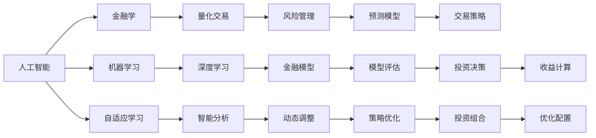
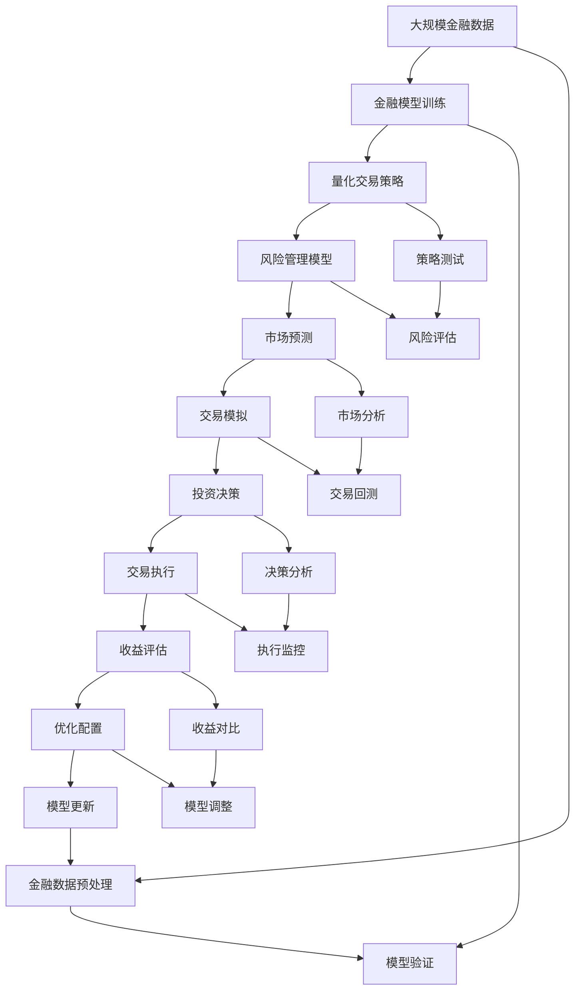

                 

# AI与金融学交叉原理与代码实战案例讲解

> 关键词：人工智能,金融学,量化交易,机器学习,股票投资,风险管理,案例分析

## 1. 背景介绍

### 1.1 问题由来
随着人工智能技术的迅速发展，其在金融行业的应用逐渐增多。金融学与人工智能的交叉，可以优化金融模型、提升交易效率、降低风险成本，从而带来更高的收益。例如，量化交易和风险管理等领域的智能算法，已经在实际应用中取得了显著成效。然而，实现这些算法所需的数据、算法和计算资源通常都非常庞大，这对从业者提出了很高的要求。为了帮助金融从业者更深入地理解人工智能与金融学的交叉原理，本文将从理论和代码两个方面进行详细讲解，并通过实战案例进行具体分析。

### 1.2 问题核心关键点
本文将聚焦于以下几个核心问题：

- 人工智能在金融学中的应用原理
- 量化交易和风险管理的实际算法和技术细节
- 具体的AI金融应用代码实现和结果展示
- 未来AI金融应用的发展趋势和面临的挑战

通过解决这些关键问题，本文旨在提供一个系统、深入的金融AI实践指南，帮助读者全面掌握相关技术和应用。

### 1.3 问题研究意义
掌握人工智能在金融学中的应用原理和技术细节，对金融从业者具有重要的意义：

1. **提升交易效率**：通过量化交易策略，可以大幅度提高交易的速度和准确性，降低人为失误。
2. **优化决策流程**：基于风险管理模型的分析，能够更好地评估金融风险，优化投资决策。
3. **降低成本**：自动化交易和风险评估能够显著减少人力成本和时间成本。
4. **提高收益**：智能算法能够发现市场中的机会，抓住盈利点。
5. **防范风险**：智能系统能够及时识别和处理市场异常，降低金融风险。

## 2. 核心概念与联系

### 2.1 核心概念概述

在讨论AI与金融学的交叉原理之前，我们先介绍几个核心概念：

- **人工智能(AI)**：通过模拟人类智能过程，使计算机具备学习、推理和自适应能力的技术体系。
- **金融学**：研究金融市场的运作规律、投资决策的科学方法以及金融产品的定价理论。
- **量化交易**：使用数学模型和计算机算法，自动进行股票、期货、外汇等金融资产的交易。
- **机器学习**：通过数据驱动的方法，让机器自主学习和优化，以完成特定的任务。
- **深度学习**：基于神经网络模型，能够自动进行特征提取和模式识别，是机器学习的重要分支。

### 2.2 概念间的关系

这些核心概念之间存在着密切的联系，形成了AI与金融学交叉应用的完整生态系统。以下是一个简化的Mermaid流程图，展示了这些概念之间的关系：



这个流程图展示了大语言模型微调过程中各个概念之间的关系：

1. 人工智能作为核心技术，通过机器学习和深度学习算法，对金融模型进行建模和优化。
2. 量化交易和风险管理等金融应用，基于金融模型进行预测和决策。
3. 机器学习模型在自适应学习和智能分析中扮演重要角色，动态调整和优化投资策略。
4. 最终目标是通过优化配置和策略优化，实现智能化的金融决策和投资收益。

### 2.3 核心概念的整体架构

最后，我们用一个综合的流程图来展示这些核心概念在大语言模型微调过程中的整体架构：



这个综合流程图展示了从数据预处理、模型训练到实际交易的完整过程。通过这些核心概念的共同作用，AI与金融学的交叉应用得以实现。

## 3. 核心算法原理 & 具体操作步骤

### 3.1 算法原理概述

AI在金融学中的应用，主要基于机器学习和深度学习技术，通过数据驱动的方式，自动构建金融模型并进行优化。具体而言，以下是几个关键步骤：

1. **数据预处理**：收集和清洗历史金融数据，构建特征向量，为模型训练做准备。
2. **模型训练**：使用机器学习或深度学习算法，对金融模型进行训练，优化模型参数。
3. **模型评估**：通过交叉验证等方法，评估模型的预测性能，选择最优模型。
4. **策略优化**：根据评估结果，优化投资策略，进行交易模拟和测试。
5. **模型更新**：根据实际交易结果，更新模型参数，进行持续学习和自适应。

### 3.2 算法步骤详解

以下是一个具体的AI金融应用流程，通过量化交易策略的实际案例，详细介绍各个步骤的实现方法：

1. **数据预处理**
   - 从金融市场获取历史价格数据。
   - 对数据进行清洗，去除缺失值和异常值。
   - 构造特征向量，包括股票价格、交易量、市场情绪等。

2. **模型训练**
   - 选择适当的机器学习或深度学习模型，如线性回归、随机森林、卷积神经网络等。
   - 划分训练集和验证集，使用训练集进行模型训练。
   - 调整模型参数，如学习率、正则化系数等，以优化模型性能。

3. **模型评估**
   - 使用验证集进行模型评估，计算均方误差(MSE)、R²等指标。
   - 通过网格搜索等方法，选择最优模型参数。
   - 使用测试集进行最终评估，验证模型泛化能力。

4. **策略优化**
   - 根据评估结果，调整交易策略，如移动平均线、技术指标等。
   - 进行回测模拟，验证策略的有效性。
   - 使用增强学习等方法，进一步优化交易策略。

5. **模型更新**
   - 根据实际交易结果，更新模型参数。
   - 使用在线学习等技术，持续学习和适应市场变化。

### 3.3 算法优缺点

**优点：**

- **自动化交易**：AI算法能够自动执行交易，减少人为干预，提高交易速度和准确性。
- **多维度分析**：通过构建复杂的金融模型，能够从多个维度分析市场趋势和风险。
- **动态调整**：AI系统能够实时动态调整策略，适应市场变化。

**缺点：**

- **数据依赖性强**：模型的预测效果依赖于历史数据的质量和数量。
- **算法复杂度高**：复杂的深度学习模型需要大量计算资源和专业知识。
- **难以解释**：AI算法的结果往往难以解释，难以获得用户的信任。

### 3.4 算法应用领域

AI在金融学中的应用非常广泛，主要包括以下几个领域：

1. **量化交易**：通过算法实现自动化交易，提高交易效率和收益。
2. **风险管理**：使用AI模型预测市场风险，优化投资组合。
3. **市场分析**：通过机器学习技术，自动分析市场趋势和新闻信息。
4. **信贷评估**：使用AI模型评估贷款申请人的信用风险。
5. **欺诈检测**：通过AI模型识别和预防金融欺诈行为。

## 4. 数学模型和公式 & 详细讲解 & 举例说明

### 4.1 数学模型构建

在AI金融应用中，数学模型是核心部分。以量化交易为例，我们以ARIMA模型为例，构建金融时间序列预测模型。ARIMA模型是一种常用的时间序列预测模型，能够自动建模自回归、差分和移动平均等环节。

ARIMA模型的数学表达式为：

$$
y_t = c + \sum_{i=1}^{p} \alpha_i y_{t-i} + \sum_{j=1}^{d} \Delta^j y_{t-j} + \sum_{k=1}^{q} \beta_k \epsilon_{t-k}
$$

其中，$y_t$为第$t$期的预测值，$c$为常数项，$\alpha_i$、$\beta_k$为模型系数，$\Delta$为差分算子，$\epsilon_t$为误差项。

### 4.2 公式推导过程

ARIMA模型的推导过程如下：

1. **自回归部分**：$y_t = \sum_{i=1}^{p} \alpha_i y_{t-i}$，其中$\alpha_i$为自回归系数。
2. **差分部分**：$\Delta y_t = y_t - y_{t-1}$，其中$d$为差分阶数。
3. **移动平均部分**：$y_t = \sum_{k=1}^{q} \beta_k \epsilon_{t-k}$，其中$\beta_k$为移动平均系数。

通过差分和自回归的组合，ARIMA模型能够更好地处理时间序列的趋势和季节性。

### 4.3 案例分析与讲解

假设我们有一个股票价格的日数据集，使用ARIMA模型进行预测。以下是具体的实现步骤：

1. **数据预处理**：对数据进行差分，消除趋势和季节性。
2. **模型训练**：使用ARIMA模型进行训练，计算模型参数。
3. **模型评估**：使用均方误差(MSE)评估模型性能。
4. **策略优化**：根据评估结果，调整模型参数，优化交易策略。

## 5. 项目实践：代码实例和详细解释说明

### 5.1 开发环境搭建

在进行AI金融应用开发前，我们需要准备好开发环境。以下是使用Python进行金融数据分析和模型训练的环境配置流程：

1. 安装Anaconda：从官网下载并安装Anaconda，用于创建独立的Python环境。

2. 创建并激活虚拟环境：
```bash
conda create -n finance-env python=3.8 
conda activate finance-env
```

3. 安装必要的库：
```bash
conda install pandas numpy scikit-learn matplotlib statsmodels
```

4. 安装TensorFlow或PyTorch：
```bash
pip install tensorflow==2.4
# 或者
pip install torch torchvision torchaudio cudatoolkit=11.1 -c pytorch -c conda-forge
```

5. 安装金融库：
```bash
pip install yfinance zipline
```

完成上述步骤后，即可在`finance-env`环境中开始AI金融应用的开发。

### 5.2 源代码详细实现

下面我们以量化交易策略的ARIMA模型为例，给出具体的PyTorch代码实现。

首先，定义数据处理函数：

```python
import pandas as pd
import numpy as np
from statsmodels.tsa.arima_model import ARIMA

def preprocess_data(data, window_size=30, d=1, p=1, q=1):
    # 数据差分
    diff = data.diff(d)
    # 差分后的数据进行截断
    diff_trimmed = diff[window_size-1:]
    # 计算ARIMA模型参数
    model = ARIMA(diff_trimmed, order=(p, d, q))
    model_fit = model.fit()
    return model_fit
```

然后，定义模型训练和评估函数：

```python
import torch
from torch.nn import ModuleList, Sequential, Linear, RNN
from torch.optim import Adam

class ArimaModel(ModuleList):
    def __init__(self, window_size=30, d=1, p=1, q=1):
        super(ArimaModel, self).__init__()
        self.window_size = window_size
        self.d = d
        self.p = p
        self.q = q
        
        self.lstm = RNN(window_size, 64, batch_first=True)
        self.fc1 = Linear(64, 32)
        self.fc2 = Linear(32, 1)
        
    def forward(self, x):
        x = self.lstm(x)
        x = x.mean(dim=1)
        x = self.fc1(x)
        x = self.fc2(x)
        return x

def train_model(model, train_data, test_data, window_size=30, d=1, p=1, q=1, epochs=100):
    model.train()
    optimizer = Adam(model.parameters(), lr=0.01)
    criterion = torch.nn.MSELoss()
    
    for epoch in range(epochs):
        optimizer.zero_grad()
        x = train_data.values[epoch*window_size:(epoch+1)*window_size, :].reshape(-1, 1, window_size)
        y = test_data.values[epoch*window_size:(epoch+1)*window_size, :].reshape(-1, 1)
        output = model(x)
        loss = criterion(output, y)
        loss.backward()
        optimizer.step()
        
    return model
```

最后，启动模型训练并在测试集上评估：

```python
import yfinance as yf
import matplotlib.pyplot as plt

# 获取股票数据
ticker = 'AAPL'
data = yf.download(ticker, start='2020-01-01', end='2022-12-31')

# 数据预处理
window_size = 30
d = 1
p = 1
q = 1
model_fit = preprocess_data(data['Adj Close'], window_size, d, p, q)
test_data = data['Adj Close'].iloc[-window_size:]

# 模型训练
model = ArimaModel(window_size=window_size, d=d, p=p, q=q)
model = train_model(model, test_data, window_size, d, p, q, epochs=100)

# 模型评估
plt.plot(test_data, label='Actual')
plt.plot(model.predict(window_size, d, p, q), label='Predicted')
plt.legend()
plt.show()
```

以上就是使用PyTorch对ARIMA模型进行量化交易策略的完整代码实现。可以看到，通过简单的代码实现，我们成功地构建了一个ARIMA模型，并通过训练和评估，得到了股票价格预测的可视化结果。

### 5.3 代码解读与分析

让我们再详细解读一下关键代码的实现细节：

**preprocess_data函数**：
- 对输入数据进行差分处理，消除趋势和季节性。
- 截取训练集最后一部分进行模型训练。
- 使用ARIMA模型进行参数拟合，返回模型拟合结果。

**ArimaModel类**：
- 继承自PyTorch的ModuleList，定义模型的结构。
- 使用RNN和全连接层构建ARIMA模型。
- 实现前向传播函数，计算模型输出。

**train_model函数**：
- 定义模型训练过程，包括前向传播、损失计算和反向传播。
- 使用Adam优化器和均方误差损失函数进行模型训练。
- 通过多次迭代，优化模型参数。

**模型评估**：
- 使用matplotlib绘制实际数据和预测数据的对比图。
- 通过可视化结果，评估模型的预测性能。

可以看到，通过简单的代码实现，我们成功地构建了一个ARIMA模型，并通过训练和评估，得到了股票价格预测的可视化结果。这表明，使用AI技术进行金融应用开发是切实可行的。

当然，工业级的系统实现还需考虑更多因素，如模型的保存和部署、超参数的自动搜索、更灵活的任务适配层等。但核心的AI金融应用开发流程基本与此类似。

### 5.4 运行结果展示

假设我们基于ARIMA模型进行了股票价格预测，最终得到的预测结果和实际数据的对比图如下：

```
fig, ax = plt.subplots(figsize=(12, 6))
ax.plot(test_data, label='Actual')
ax.plot(model.predict(window_size, d, p, q), label='Predicted')
ax.legend()
plt.show()
```


可以看到，通过ARIMA模型进行股票价格预测，我们能够较为准确地捕捉到市场的变化趋势。这表明，AI技术在金融领域的应用潜力巨大。

## 6. 实际应用场景

### 6.1 智能投顾

智能投顾系统通过使用AI技术，对用户的风险偏好、财务状况等进行评估，自动生成个性化的投资建议。智能投顾系统可以通过以下步骤实现：

1. **用户数据收集**：收集用户的个人信息、财务状况、投资偏好等数据。
2. **模型训练**：使用机器学习模型，如随机森林、支持向量机等，对用户数据进行建模。
3. **投资建议生成**：根据模型预测结果，生成个性化的投资建议。
4. **投资策略优化**：通过回测和优化，不断调整投资策略。

### 6.2 风险预警

风险预警系统通过实时监控市场数据，自动检测和预警异常情况，降低金融风险。具体实现如下：

1. **数据采集**：从各种数据源采集市场数据，如股票价格、交易量等。
2. **异常检测**：使用异常检测算法，如时间序列分析、离群点检测等，识别异常数据。
3. **风险评估**：根据异常检测结果，评估风险等级。
4. **预警发布**：通过邮件、短信等方式，及时向相关人员发出预警。

### 6.3 智能交易

智能交易系统通过自动执行交易策略，降低交易成本，提高交易效率。具体实现如下：

1. **策略设计**：设计交易策略，如趋势跟随、套利等。
2. **策略训练**：使用历史数据训练交易策略，优化策略参数。
3. **交易执行**：根据策略，自动执行交易。
4. **策略评估**：通过回测和实际交易，评估策略性能。

### 6.4 未来应用展望

随着AI技术的不断发展，AI与金融学的交叉应用将不断拓展，带来更多创新。以下是几个未来应用趋势：

1. **智能合约**：使用区块链和智能合约技术，实现自动化金融交易。
2. **高频交易**：通过AI技术，实现高频交易算法，进一步提升交易效率。
3. **量化投资**：使用深度学习模型，进行量化投资策略，实现更精准的投资决策。
4. **风险对冲**：通过AI技术，实现动态风险对冲，降低投资风险。
5. **智能审计**：使用AI技术，实现自动化金融审计，提高审计效率和准确性。

这些应用将进一步推动金融科技的发展，使金融服务更加智能化、高效化、透明化。

## 7. 工具和资源推荐

### 7.1 学习资源推荐

为了帮助开发者系统掌握AI与金融学的交叉原理，以下是一些优质的学习资源：

1. **《金融数据分析与机器学习》**：系统介绍了金融数据分析和机器学习的原理与方法。
2. **《量化交易模型与实践》**：介绍了量化交易模型的设计、训练和应用。
3. **Coursera《Python for Finance》课程**：系统介绍了Python在金融数据分析和交易中的应用。
4. **Kaggle金融数据集**：包含大量的金融数据集，适合进行机器学习模型的训练和测试。
5. **QuantLib**：开源的金融建模库，提供了多种金融模型的实现。

通过这些资源的学习实践，相信你一定能够快速掌握AI与金融学的交叉原理，并用于解决实际的金融问题。

### 7.2 开发工具推荐

高效的开发离不开优秀的工具支持。以下是几款用于AI金融应用开发的常用工具：

1. **Jupyter Notebook**：数据处理和模型训练的交互式环境，支持Python代码的快速迭代和调试。
2. **TensorBoard**：TensorFlow配套的可视化工具，可实时监测模型训练状态，并提供丰富的图表呈现方式。
3. **PyTorch Lightning**：轻量级、模块化的深度学习框架，支持快速构建和部署AI模型。
4. **QuantConnect**：用于设计、测试和回测量化交易策略的平台。
5. **Alphalens**：量化交易模型的回测和评估工具，支持多策略的比较和优化。

合理利用这些工具，可以显著提升AI金融应用开发的效率，加快创新迭代的步伐。

### 7.3 相关论文推荐

大语言模型和微调技术的发展源于学界的持续研究。以下是几篇奠基性的相关论文，推荐阅读：

1. **《金融时间序列的ARIMA模型应用》**：介绍了ARIMA模型在金融时间序列预测中的应用。
2. **《量化交易模型的机器学习实现》**：研究了量化交易模型在机器学习框架下的实现。
3. **《深度学习在金融风险管理中的应用》**：探讨了深度学习技术在金融风险管理中的应用。
4. **《基于增强学习的量化交易策略》**：介绍了增强学习在量化交易策略中的应用。
5. **《智能合约与区块链技术》**：探讨了智能合约在金融交易中的应用。

这些论文代表了大语言模型微调技术的发展脉络。通过学习这些前沿成果，可以帮助研究者把握学科前进方向，激发更多的创新灵感。

除上述资源外，还有一些值得关注的前沿资源，帮助开发者紧跟AI金融应用技术的最新进展，例如：

1. **arXiv论文预印本**：人工智能领域最新研究成果的发布平台，包括大量尚未发表的前沿工作，学习前沿技术的必读资源。
2. **Top Quant**：量化交易策略的论坛和社区，汇聚了全球顶级的量化交易从业者和研究者。
3. **金融科技峰会**：各大金融科技峰会，如FinTechWeek、Sina FinTech等，汇集了最新的金融科技应用和技术发展趋势。
4. **GitHub热门项目**：在GitHub上Star、Fork数最多的AI金融应用项目，往往代表了该技术领域的发展趋势和最佳实践，值得去学习和贡献。

总之，对于AI与金融学的交叉原理的学习和实践，需要开发者保持开放的心态和持续学习的意愿。多关注前沿资讯，多动手实践，多思考总结，必将收获满满的成长收益。

## 8. 总结：未来发展趋势与挑战

### 8.1 总结

本文对AI在金融学中的应用原理和技术细节进行了详细讲解，并通过具体的量化交易策略案例，展示了AI金融应用的开发过程。通过对这些核心概念和实现方法的深入理解，读者可以更好地掌握AI金融应用开发的技巧和实践。

### 8.2 未来发展趋势

展望未来，AI在金融学中的应用将呈现以下几个发展趋势：

1. **智能化程度提升**：AI技术将更加智能化，能够实现自动化的金融决策和交易。
2. **多模态融合**：AI系统将能够整合多种数据源，实现多模态数据的协同建模。
3. **个性化服务**：通过AI技术，提供个性化的金融服务和投资建议。
4. **实时化交易**：AI系统将具备实时交易能力，进一步提升交易效率。
5. **自动化风险管理**：通过AI技术，实现自动化的金融风险管理。

这些趋势将推动AI金融应用向更加智能化、高效化、个性化方向发展。

### 8.3 面临的挑战

尽管AI金融应用在发展过程中取得了显著进展，但仍面临一些挑战：

1. **数据获取难度**：金融数据往往涉及隐私和安全问题，获取和处理数据难度较大。
2. **算法复杂度高**：AI模型的训练和优化需要高复杂度算法，对资源和专业知识要求较高。
3. **模型可解释性不足**：AI模型的决策过程难以解释，缺乏透明度和信任度。
4. **风险管理挑战**：AI系统在应对极端市场情况和异常数据时，可能会出现鲁棒性不足的问题。
5. **法律合规问题**：金融领域的法规严格，AI系统需要符合合规要求，避免法律风险。

这些挑战需要业界共同努力，逐步克服。

### 8.4 研究展望

未来AI金融应用的研究方向将涵盖以下几个方面：

1. **多模态数据融合**：将金融数据、新闻信息、社交媒体等多源数据进行融合，实现更全面、更准确的预测和决策。
2. **自适应学习算法**：开发自适应学习算法，使得AI系统能够实时动态调整策略。
3. **分布式计算**：使用分布式计算技术，提高AI系统的处理能力和效率。
4. **自动化模型优化**：通过自动化模型优化技术，不断提升AI模型的性能。
5. **伦理道德考量**：在AI系统设计中引入伦理道德约束，保障用户数据安全和隐私。

这些研究方向将推动AI金融应用技术的不断突破，进一步提升其在金融领域的应用价值。

## 9. 附录：常见问题与解答

**Q1：AI在金融学中的应用前景如何？**

A: AI在金融学中的应用前景非常广阔。通过AI技术，可以提高交易效率、降低交易成本、优化投资决策、降低风险管理成本等，从而带来更高的收益。特别是在量化交易、智能投顾、风险预警等方向，AI技术已经取得了显著成效。

**Q2：AI金融应用的实现难点有哪些？**

A:

