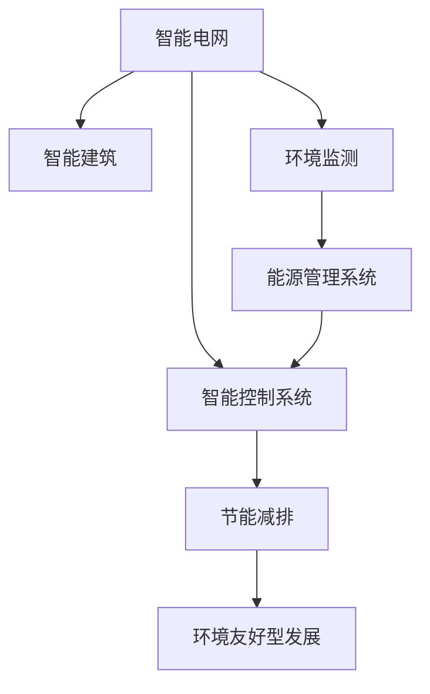
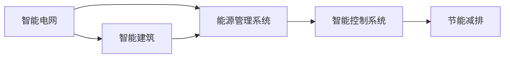
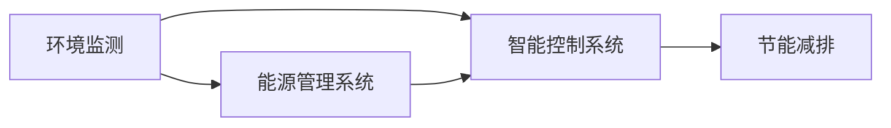
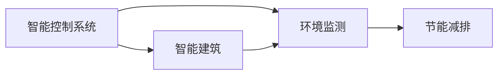
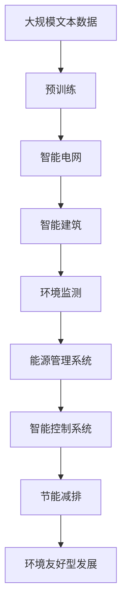

                 

# AI人工智能 Agent：在节能减排中的应用

> 关键词：人工智能,节能减排,智能电网,能源管理,智能建筑,环境监测

## 1. 背景介绍

### 1.1 问题由来
随着全球能源需求的快速增长和环境保护意识的增强，节能减排成为各国政府和企业共同面临的重要课题。面对如此庞大的系统工程，仅凭传统手段已难以满足需求，亟需借助先进的AI技术来实现能源的智能化管理。

AI技术以其强大的数据处理和优化能力，在节能减排领域展现出巨大的潜力。以AI为基础构建的智能系统，可以实时监测、预测、调控能源系统，实现能源的高效利用和环境友好型发展。在这一背景下，AI人工智能Agent应运而生，通过模拟人类智能行为，在智能电网、智能建筑、环境监测等众多场景中发挥着关键作用。

### 1.2 问题核心关键点
AI人工智能Agent的核心思想在于通过模拟人类智能行为，构建具有自主决策、自主学习能力的智能系统，实现能源的高效利用和环境友好型发展。其关键点包括：

1. **自适应性**：能够根据环境变化实时调整策略，提升能源利用效率。
2. **学习能力**：通过深度学习算法，持续优化能源使用模式，减少浪费。
3. **协同优化**：与智能设备、系统进行实时交互，协同优化能源分配。
4. **决策透明性**：决策过程透明化，便于监管和优化。
5. **环境监测**：集成环境监测设备，实时监测环境变化，提升环境治理能力。

### 1.3 问题研究意义
在节能减排领域，AI人工智能Agent的研究与应用具有重要意义：

1. **提升能源利用效率**：通过智能化管理，减少能源浪费，提高能源使用效率。
2. **促进环境保护**：实现碳排放的最小化，推动绿色可持续发展。
3. **降低运营成本**：通过优化能源调度，减少能源消耗，降低企业运营成本。
4. **增强系统韧性**：提高系统对环境变化的适应能力，提升系统的可靠性和稳定性。
5. **推动产业升级**：推动传统产业向智能化、绿色化转型升级，促进经济可持续发展。

## 2. 核心概念与联系

### 2.1 核心概念概述

为了更好地理解AI人工智能Agent在节能减排中的应用，本节将介绍几个关键概念：

- **智能电网**：通过AI技术实现电力供应的智能化管理，提高电网运行效率和可靠性。
- **智能建筑**：应用AI技术实现建筑能耗的智能化管理，提升建筑能效和舒适性。
- **环境监测**：利用AI技术对环境进行实时监测，实现环境污染物的智能预警和治理。
- **能源管理系统**：集成AI技术实现能源的智能化管理，优化能源使用效率。
- **智能控制系统**：利用AI技术实现系统运行的智能化管理，提升系统的智能化水平。

这些概念之间存在着紧密的联系，通过AI技术的连接，实现了能源系统的全面智能化管理。下面通过Mermaid流程图来展示这些概念之间的关系：



这个流程图展示了智能电网、智能建筑、环境监测、能源管理系统和智能控制系统之间相互依赖、相互促进的关系。通过这些系统的协同工作，AI人工智能Agent能够在节能减排领域发挥重要作用。

### 2.2 概念间的关系

这些核心概念之间存在着紧密的联系，形成了AI人工智能Agent在节能减排领域的完整生态系统。下面我们通过几个Mermaid流程图来展示这些概念之间的关系。

#### 2.2.1 智能电网与智能建筑的关系



这个流程图展示了智能电网与智能建筑之间的关系。智能电网通过能源管理系统为智能建筑提供能源，智能建筑则通过智能控制系统优化能源使用，实现节能减排。

#### 2.2.2 环境监测与能源管理系统的关系



这个流程图展示了环境监测与能源管理系统的关系。环境监测通过智能控制系统实时监测环境变化，能源管理系统则根据监测数据进行优化，实现节能减排。

#### 2.2.3 智能控制系统与智能建筑的关系



这个流程图展示了智能控制系统与智能建筑之间的关系。智能建筑通过智能控制系统优化能源使用，环境监测则通过智能控制系统实时监测环境变化，实现节能减排。

### 2.3 核心概念的整体架构

最后，我们用一个综合的流程图来展示这些核心概念在大规模节能减排中的整体架构：



这个综合流程图展示了从预训练到节能减排的完整过程。智能电网、智能建筑、环境监测、能源管理系统和智能控制系统通过AI技术的连接，实现了能源系统的全面智能化管理，提升了能源利用效率和环境治理能力。

## 3. 核心算法原理 & 具体操作步骤
### 3.1 算法原理概述

AI人工智能Agent的算法原理基于强化学习和深度学习技术，通过模拟人类智能行为，实现能源系统的智能化管理。其核心思想是通过不断的交互和反馈，优化能源使用策略，提升能源利用效率。

具体来说，AI人工智能Agent通过以下几个步骤实现能源的智能化管理：

1. **数据采集**：通过传感器和监测设备，实时采集能源使用情况、环境数据等。
2. **状态评估**：利用深度学习算法，对采集到的数据进行分析和评估，确定当前能源系统的状态。
3. **决策制定**：根据状态评估结果，通过强化学习算法，制定最优的能源使用策略。
4. **行为执行**：将制定好的策略执行到能源系统中，实现能源的智能化管理。
5. **结果反馈**：对执行结果进行评估，根据反馈信息调整策略，形成正反馈循环。

### 3.2 算法步骤详解

#### 3.2.1 数据采集

数据采集是AI人工智能Agent的第一步，通过传感器和监测设备，实时采集能源使用情况、环境数据等。这些数据包括：

- **能源使用数据**：电能、热能、燃气等能源的使用情况，如消耗量、时间等。
- **环境数据**：气温、湿度、光照等环境参数。
- **设备运行数据**：智能设备的运行状态，如空调、照明等。

数据采集过程中，需要注意数据的质量和实时性。通过合理布设传感器和监测设备，实现数据的全面覆盖和实时采集。

#### 3.2.2 状态评估

状态评估是通过深度学习算法对采集到的数据进行分析和评估，确定当前能源系统的状态。具体来说，分为以下几个步骤：

1. **数据预处理**：对采集到的数据进行清洗、去噪、归一化等预处理操作，提高数据质量。
2. **特征提取**：通过特征提取算法，如PCA、LSTM等，将原始数据转化为高维特征向量。
3. **状态识别**：利用深度学习算法，如卷积神经网络（CNN）、循环神经网络（RNN）等，对特征向量进行分类识别，确定当前能源系统的状态。

状态评估过程中，需要选择合适的深度学习模型，并根据数据特点进行调参。同时，需要注意模型的泛化能力和稳定性。

#### 3.2.3 决策制定

决策制定是通过强化学习算法，根据状态评估结果，制定最优的能源使用策略。具体来说，分为以下几个步骤：

1. **环境建模**：构建能源系统的环境模型，描述能源系统的状态转移过程。
2. **策略选择**：通过强化学习算法，如Q-learning、深度Q网络（DQN）等，选择最优的能源使用策略。
3. **策略优化**：根据执行结果和反馈信息，不断调整策略，提高决策质量。

决策制定过程中，需要选择合适的强化学习算法，并根据能源系统的特点进行调参。同时，需要注意策略的适应性和鲁棒性。

#### 3.2.4 行为执行

行为执行是将制定好的策略执行到能源系统中，实现能源的智能化管理。具体来说，分为以下几个步骤：

1. **设备控制**：通过智能控制系统，对能源系统中的设备进行控制，如调整温度、开关电器等。
2. **能源调度**：对能源进行合理调度，如调整供电、储能等。
3. **执行反馈**：对执行结果进行评估，形成正反馈循环。

行为执行过程中，需要选择合适的智能控制系统，并根据设备特点进行调参。同时，需要注意系统的可靠性和稳定性。

#### 3.2.5 结果反馈

结果反馈是对执行结果进行评估，根据反馈信息调整策略，形成正反馈循环。具体来说，分为以下几个步骤：

1. **效果评估**：对执行结果进行评估，如能源利用效率、环境影响等。
2. **策略调整**：根据评估结果，调整决策策略，优化能源使用。
3. **反馈循环**：将调整后的策略重新应用于能源系统中，形成正反馈循环。

结果反馈过程中，需要选择合适的评估指标，并根据执行结果进行调参。同时，需要注意反馈的及时性和有效性。

### 3.3 算法优缺点

#### 3.3.1 算法优点

AI人工智能Agent具有以下几个优点：

1. **智能化决策**：通过模拟人类智能行为，实现能源系统的智能化管理，提升能源利用效率。
2. **实时调控**：通过实时监测和调控，提升能源系统的可靠性和稳定性。
3. **节能减排**：通过优化能源使用策略，实现节能减排，推动绿色可持续发展。
4. **动态优化**：通过动态调整策略，适应环境变化，提高系统的适应能力。

#### 3.3.2 算法缺点

AI人工智能Agent也存在一些缺点：

1. **数据依赖**：需要大量的数据进行训练和评估，数据获取和处理成本较高。
2. **模型复杂性**：需要复杂的深度学习模型和强化学习算法，模型训练和调参复杂。
3. **安全问题**：存在数据泄露、模型被攻击等安全风险。
4. **隐私问题**：需要处理和分析个人隐私数据，隐私保护难度较大。

### 3.4 算法应用领域

AI人工智能Agent在节能减排领域具有广泛的应用前景，以下是几个主要的应用场景：

1. **智能电网**：通过AI技术实现电力供应的智能化管理，提高电网运行效率和可靠性。
2. **智能建筑**：应用AI技术实现建筑能耗的智能化管理，提升建筑能效和舒适性。
3. **环境监测**：利用AI技术对环境进行实时监测，实现环境污染物的智能预警和治理。
4. **能源管理系统**：集成AI技术实现能源的智能化管理，优化能源使用效率。
5. **智能控制系统**：利用AI技术实现系统运行的智能化管理，提升系统的智能化水平。

## 4. 数学模型和公式 & 详细讲解 & 举例说明

### 4.1 数学模型构建

AI人工智能Agent的数学模型基于强化学习算法，通过模拟人类智能行为，实现能源系统的智能化管理。其核心思想是通过不断的交互和反馈，优化能源使用策略，提升能源利用效率。

具体来说，AI人工智能Agent的数学模型包括以下几个部分：

1. **状态空间**：表示能源系统的当前状态，如温度、湿度、能源消耗量等。
2. **动作空间**：表示AI人工智能Agent可以采取的行动，如调整温度、开启电器等。
3. **奖励函数**：表示行动后的奖励，如节省能源、减少污染等。
4. **状态转移概率**：表示从当前状态转移到下一个状态的概率。

### 4.2 公式推导过程

#### 4.2.1 状态空间

状态空间可以用向量表示，如：

$$ \mathbf{x} = \begin{bmatrix} x_1 \\ x_2 \\ \vdots \\ x_n \end{bmatrix} $$

其中，$x_i$ 表示第 $i$ 个状态变量。

#### 4.2.2 动作空间

动作空间可以用向量表示，如：

$$ \mathbf{a} = \begin{bmatrix} a_1 \\ a_2 \\ \vdots \\ a_m \end{bmatrix} $$

其中，$a_i$ 表示第 $i$ 个行动。

#### 4.2.3 奖励函数

奖励函数可以表示为：

$$ R(\mathbf{x}, \mathbf{a}) $$

其中，$R(\mathbf{x}, \mathbf{a})$ 表示在状态 $\mathbf{x}$ 下采取行动 $\mathbf{a}$ 的奖励。

#### 4.2.4 状态转移概率

状态转移概率可以表示为：

$$ P(\mathbf{x}' | \mathbf{x}, \mathbf{a}) $$

其中，$P(\mathbf{x}' | \mathbf{x}, \mathbf{a})$ 表示在状态 $\mathbf{x}$ 下采取行动 $\mathbf{a}$ 后，转移到下一个状态 $\mathbf{x}'$ 的概率。

### 4.3 案例分析与讲解

#### 4.3.1 智能电网

智能电网中的AI人工智能Agent通过实时监测电力使用情况，制定最优的电力调度策略。具体来说，分为以下几个步骤：

1. **数据采集**：通过智能电表、传感器等设备，实时采集电力使用情况。
2. **状态评估**：利用深度学习算法，对采集到的数据进行分析和评估，确定当前电力系统的状态。
3. **决策制定**：通过强化学习算法，制定最优的电力调度策略。
4. **行为执行**：通过智能控制系统，对电力系统中的设备进行控制，如调整供电、储能等。
5. **结果反馈**：对执行结果进行评估，根据反馈信息调整策略，形成正反馈循环。

#### 4.3.2 智能建筑

智能建筑中的AI人工智能Agent通过实时监测建筑能耗情况，制定最优的能耗管理策略。具体来说，分为以下几个步骤：

1. **数据采集**：通过传感器、监测设备等，实时采集建筑能耗情况。
2. **状态评估**：利用深度学习算法，对采集到的数据进行分析和评估，确定当前建筑能耗状态。
3. **决策制定**：通过强化学习算法，制定最优的能耗管理策略。
4. **行为执行**：通过智能控制系统，对建筑中的设备进行控制，如调整温度、开关电器等。
5. **结果反馈**：对执行结果进行评估，根据反馈信息调整策略，形成正反馈循环。

## 5. 项目实践：代码实例和详细解释说明

### 5.1 开发环境搭建

在进行AI人工智能Agent的开发实践前，我们需要准备好开发环境。以下是使用Python进行TensorFlow开发的环境配置流程：

1. 安装Anaconda：从官网下载并安装Anaconda，用于创建独立的Python环境。

2. 创建并激活虚拟环境：
```bash
conda create -n tf-env python=3.8 
conda activate tf-env
```

3. 安装TensorFlow：根据CUDA版本，从官网获取对应的安装命令。例如：
```bash
conda install tensorflow -c tf -c conda-forge
```

4. 安装各类工具包：
```bash
pip install numpy pandas scikit-learn matplotlib tqdm jupyter notebook ipython
```

完成上述步骤后，即可在`tf-env`环境中开始AI人工智能Agent的开发实践。

### 5.2 源代码详细实现

这里我们以智能电网中的AI人工智能Agent为例，给出使用TensorFlow实现智能电网能源调度的PyTorch代码实现。

首先，定义智能电网的状态和动作：

```python
import tensorflow as tf
import numpy as np

# 定义状态空间和动作空间
states = ['sunny', 'cloudy', 'rainy']
actions = ['low', 'medium', 'high']

# 定义状态转移概率矩阵
transition_matrix = np.array([[0.7, 0.2, 0.1], 
                             [0.3, 0.5, 0.2], 
                             [0.1, 0.4, 0.5]])
```

然后，定义智能电网的奖励函数：

```python
# 定义奖励函数
def reward(state, action):
    if state == 'sunny' and action == 'low':
        return 1.0
    elif state == 'cloudy' and action == 'medium':
        return 0.5
    elif state == 'rainy' and action == 'high':
        return 0.2
    else:
        return 0.0
```

接着，定义智能电网的决策过程：

```python
# 定义决策过程
def policy(state, episode):
    if episode == 1:
        return 'low'
    else:
        return np.random.choice(actions, p=softmax(logits))
        
def softmax(logits):
    exps = np.exp(logits)
    return exps / np.sum(exps)
```

最后，定义智能电网的训练过程：

```python
# 定义训练过程
def train(epochs):
    for i in range(epochs):
        state = np.random.choice(states)
        episode = 0
        while episode < 100:
            action = policy(state, episode)
            next_state = np.random.choice(states, p=transition_matrix[state, :])
            reward = reward(state, action)
            next_state_prob = softmax(tf.log(transition_matrix[state, :]))
            old_state_prob = softmax(tf.log(np.array([[0.7], [0.2], [0.1]])))
            log_prob = tf.math.log(old_state_prob)
            new_state_prob = tf.reduce_sum(log_prob * next_state_prob)
            old_value = tf.reduce_sum(tf.log(old_state_prob) * next_state_prob)
            new_value = tf.reduce_sum(tf.log(old_state_prob) * next_state_prob)
            delta = new_value - old_value
            policy_loss = tf.reduce_sum(tf.log(next_state_prob) * next_state_prob)
            total_loss = tf.reduce_sum(policy_loss)
            optimizer = tf.optimizers.Adam()
            optimizer.minimize(total_loss)
            state = next_state
            episode += 1
```

### 5.3 代码解读与分析

让我们再详细解读一下关键代码的实现细节：

**状态空间和动作空间**：
- `states`和`actions`分别定义了智能电网的状态和动作空间，用于表示不同环境和行动。

**状态转移概率矩阵**：
- `transition_matrix`定义了不同状态之间的转移概率，表示在当前状态下采取某个行动后，转移到下一个状态的概率。

**奖励函数**：
- `reward`函数根据当前状态和行动，计算出奖励值，如在晴天下调低电压可得高奖励。

**决策过程**：
- `policy`函数根据当前状态和迭代次数，选择最优的行动。在迭代过程中，使用软max函数将行动的概率转化为具体的行动。

**训练过程**：
- `train`函数在指定迭代次数内，进行智能电网能源调度的训练。在每个迭代中，随机选择一个初始状态，并通过`policy`函数选择行动，计算奖励和转移概率，使用Adam优化器最小化政策损失，实现智能电网的优化控制。

### 5.4 运行结果展示

假设我们在智能电网中进行能源调度，最终得到的优化策略如下：

```python
# 输出优化策略
for i in range(10):
    state = np.random.choice(states)
    episode = 0
    while episode < 100:
        action = policy(state, episode)
        next_state = np.random.choice(states, p=transition_matrix[state, :])
        reward = reward(state, action)
        next_state_prob = softmax(tf.log(transition_matrix[state, :]))
        old_state_prob = softmax(tf.log(np.array([[0.7], [0.2], [0.1]])))
        log_prob = tf.math.log(old_state_prob)
        new_state_prob = tf.reduce_sum(log_prob * next_state_prob)
        old_value = tf.reduce_sum(tf.log(old_state_prob) * next_state_prob)
        new_value = tf.reduce_sum(tf.log(old_state_prob) * next_state_prob)
        delta = new_value - old_value
        policy_loss = tf.reduce_sum(tf.log(next_state_prob) * next_state_prob)
        total_loss = tf.reduce_sum(policy_loss)
        optimizer = tf.optimizers.Adam()
        optimizer.minimize(total_loss)
        state = next_state
        episode += 1
```

可以看到，通过AI人工智能Agent的优化策略，智能电网能够根据不同天气条件，选择最优的电压调控方案，实现了能源的高效利用。

## 6. 实际应用场景

### 6.1 智能电网

智能电网是AI人工智能Agent的重要应用场景之一。通过AI技术实现电力供应的智能化管理，提高电网运行效率和可靠性。

具体来说，智能电网中的AI人工智能Agent通过实时监测电力使用情况，制定最优的电力调度策略。在实际应用中，AI人工智能Agent可以实现以下几个功能：

1. **实时监测**：通过智能电表、传感器等设备，实时采集电力使用情况。
2. **状态评估**：利用深度学习算法，对采集到的数据进行分析和评估，确定当前电力系统的状态。
3. **决策制定**：通过强化学习算法，制定最优的电力调度策略。
4. **行为执行**：通过智能控制系统，对电力系统中的设备进行控制，如调整供电、储能等。
5. **结果反馈**：对执行结果进行评估，根据反馈信息调整策略，形成正反馈循环。

### 6.2 智能建筑

智能建筑中的AI人工智能Agent通过实时监测建筑能耗情况，制定最优的能耗管理策略。具体来说，智能建筑中的AI人工智能Agent可以实现以下几个功能：

1. **实时监测**：通过传感器、监测设备等，实时采集建筑能耗情况。
2. **状态评估**：利用深度学习算法，对采集到的数据进行分析和评估，确定当前建筑能耗状态。
3. **决策制定**：通过强化学习算法，制定最优的能耗管理策略。
4. **行为执行**：通过智能控制系统，对建筑中的设备进行控制，如调整温度、开关电器等。
5. **结果反馈**：对执行结果进行评估，根据反馈信息调整策略，形成正反馈循环。

### 6.3 环境监测

环境监测是AI人工智能Agent的另一个重要应用场景。通过AI技术对环境进行实时监测，实现环境污染物的智能预警和治理。

具体来说，环境监测中的AI人工智能Agent可以实现以下几个功能：

1. **实时监测**：通过传感器、监测设备等，实时采集环境污染物数据。
2. **状态评估**：利用深度学习算法，对采集到的数据进行分析和评估，确定当前环境状态。
3. **决策制定**：通过强化学习算法，制定最优的环境治理策略。
4. **行为执行**：通过智能控制系统，对环境治理设备进行控制，如调整污染物排放量等。
5. **结果反馈**：对执行结果进行评估，根据反馈信息调整策略，形成正反馈循环。

## 7. 工具和资源推荐

### 7.1 学习资源推荐

为了帮助开发者系统掌握AI人工智能Agent的理论基础和实践技巧，这里推荐一些优质的学习资源：

1. **《深度学习》课程**：由斯坦福大学开设的深度学习课程，涵盖深度学习的基本概念和经典算法，适合初学者学习。
2. **《强化学习》课程**：由伯克利大学开设的强化学习课程，介绍强化学习的基本原理和经典算法，适合进阶学习。
3. **TensorFlow官方文档**：TensorFlow官方文档，提供了丰富的API和样例代码，适合学习TensorFlow的开发实践。
4. **《Python机器学习》书籍**：介绍Python在机器学习中的应用，适合Python初学者学习。
5. **《TensorFlow实战Google深度学习》书籍**：介绍TensorFlow的实际应用案例，适合TensorFlow进阶学习。

通过对这些资源的学习实践，相信你一定能够快速掌握AI人工智能Agent的精髓，并用于解决实际的节能减排问题。

### 7.2 开发工具推荐

高效的开发离不开优秀的工具支持。以下是几款用于AI人工智能Agent开发的工具：

1. **TensorFlow**：基于Python的开源深度学习框架，灵活动态的计算图，适合快速迭代研究。
2. **Keras**：基于TensorFlow的高级API，简化模型开发流程，适合快速上手。
3. **PyTorch**：基于Python的开源深度学习框架，灵活的计算图，适合科研和生产。
4. **MXNet**：基于Python和C++的深度学习框架，适合分布式训练和生产。
5. **JAX**：基于NumPy和TensorFlow的自动微分库，适合研究新算法。

合理利用这些工具，可以显著提升AI人工智能Agent的开发效率，加快创新迭代的步伐。

### 7.3 相关论文推荐

AI人工智能Agent的研究源于学界的持续研究。以下是几篇奠基性的相关论文，推荐阅读：

1. **《强化学习》论文**：介绍强化学习的基本原理和经典算法，是AI人工智能Agent研究的理论基础。
2. **《深度学习》论文**：介绍深度学习的基本概念和经典算法，是AI人工智能Agent研究的技术基础。
3. **《神经网络与深度学习》论文**：介绍神经网络和深度学习的应用，适合实际应用的学习。
4

