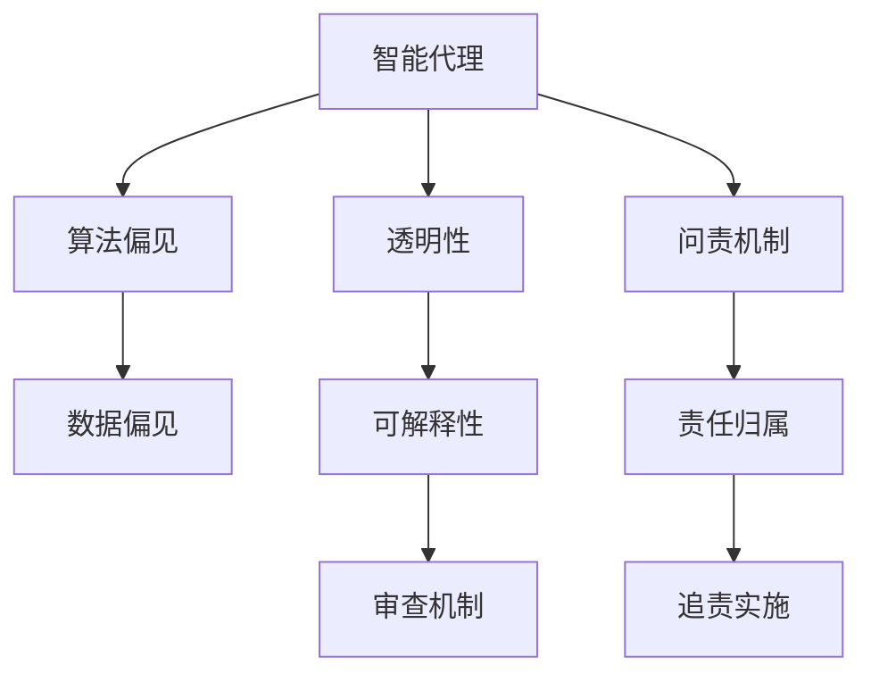
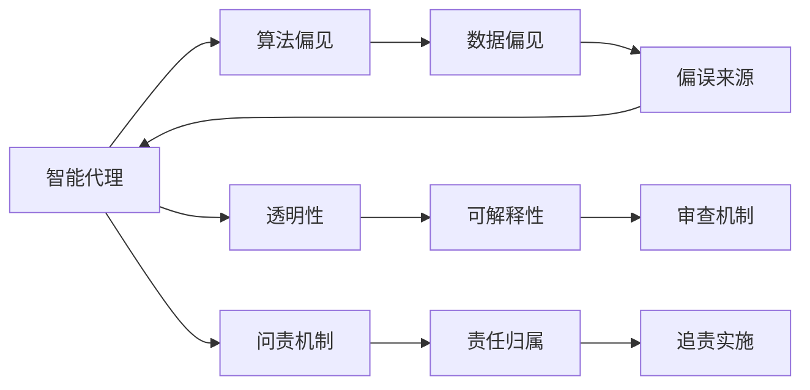
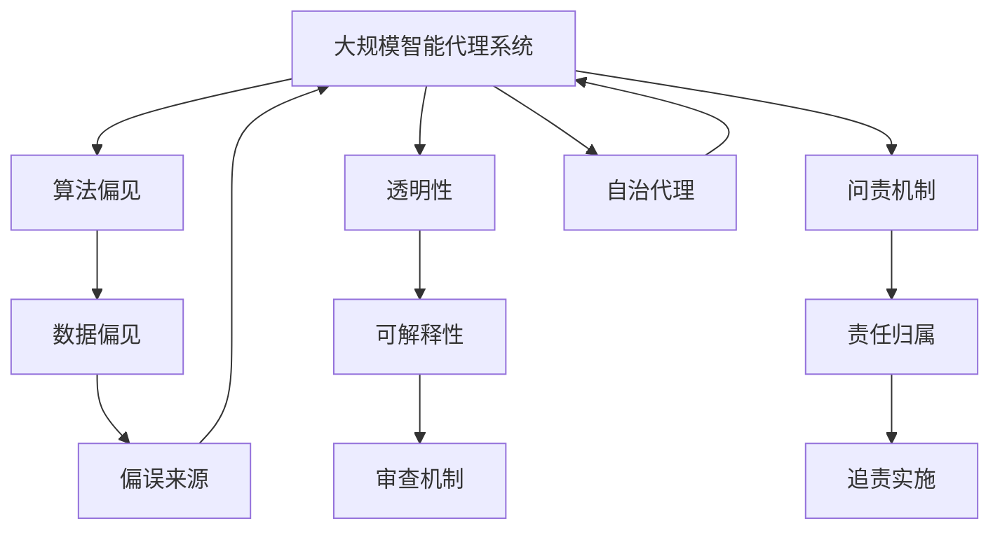

                 

# AI人工智能 Agent：对法律和规则的挑战

> 关键词：人工智能,法律,规则,伦理,自治代理,算法偏见,透明性,问责机制

## 1. 背景介绍

### 1.1 问题由来

随着人工智能（AI）技术的飞速发展，智能代理（AI Agent）在各种领域中的应用日益增多。从医疗诊断、智能推荐、智能客服，到自动驾驶、金融交易、智能合约，智能代理正逐步渗透到人类生活的方方面面。然而，这些智能代理在决策过程中如何遵守法律和规则，以及在出现失误时如何承担责任，成为了一个亟待解决的问题。

### 1.2 问题核心关键点

智能代理的法律和规则挑战主要包括以下几个关键点：

- **算法偏见**：AI模型往往依赖于历史数据进行训练，可能继承并放大数据中的偏见，导致决策不公平。
- **透明性**：智能代理的决策过程复杂，难以解释和理解，不利于法律审查和监管。
- **问责机制**：当智能代理出现错误或违规时，如何确定责任归属，保证公正和公平。
- **自治代理**：如何在不完全依赖人类监督的情况下，让智能代理自主决策，并保证其决策符合法律和规则。

这些核心关键点构成了智能代理在法律和规则应用中面临的主要挑战。解决这些问题，需要从算法设计、模型训练、数据选择、法规制定等多个层面进行深入研究和实践。

### 1.3 问题研究意义

探讨AI智能代理在法律和规则应用中的挑战，对于提升AI技术的公平性、透明性和问责性具有重要意义：

1. **公平性**：通过减少算法偏见，提升智能代理的决策公平性，确保不同群体受到公正对待。
2. **透明性**：提高智能代理决策过程的可解释性，增强法律审查和监管的透明度。
3. **问责性**：建立明确的问责机制，确保智能代理决策错误时的责任归属，维护法律和社会秩序。
4. **自治性**：促进智能代理的自主决策能力，减少对人类监督的依赖，提升系统效率和可靠性。

这些目标的实现，将推动AI技术在更多领域得到应用，为社会带来深远的影响。

## 2. 核心概念与联系

### 2.1 核心概念概述

为更好地理解AI智能代理在法律和规则应用中的挑战，本节将介绍几个密切相关的核心概念：

- **智能代理（AI Agent）**：一种具有自主决策能力的软件系统，能够在预设规则和环境变化下，自动执行任务。
- **算法偏见（Algorithmic Bias）**：AI模型在训练和应用过程中，由于数据偏误导致的决策不公平。
- **透明性（Transparency）**：AI决策过程的可解释性和可理解性，便于法律和伦理审查。
- **问责机制（Accountability Mechanism）**：AI决策出现错误或违规时的责任归属和追责方法。
- **自治代理（Autonomous Agents）**：能够在无人类干预的情况下，根据预设规则和环境变化自主决策的智能代理。

这些核心概念之间的逻辑关系可以通过以下Mermaid流程图来展示：



这个流程图展示了一组核心概念之间的关联：智能代理在决策过程中可能存在算法偏见，但通过提高透明性，能够减少偏见，并通过问责机制确保决策的责任归属，保证公平和透明。

### 2.2 概念间的关系

这些核心概念之间存在着紧密的联系，形成了AI智能代理在法律和规则应用中的完整框架。下面是更详细的合Flow Chart图来展示这些概念之间的关系：



这个综合流程图展示了智能代理在法律和规则应用中的核心概念及其相互关系：算法偏见来源于数据偏见，通过透明性（可解释性）的提升，可以减小偏见，同时建立问责机制确保责任归属，保障审查和追责的顺利实施。

### 2.3 核心概念的整体架构

最后，我们用一个综合的流程图来展示这些核心概念在大规模智能代理系统中的整体架构：



这个综合流程图展示了智能代理系统在实现法律和规则应用时，各核心概念的相互关系和作用机制。大规模智能代理系统通过透明性和问责机制，减少算法偏见，提高决策的公平性和透明性，同时促进自治代理的发展，进一步提升系统的自主性和可靠性。

## 3. 核心算法原理 & 具体操作步骤
### 3.1 算法原理概述

AI智能代理在法律和规则应用中的核心算法原理主要包括以下几个方面：

- **公平性算法**：通过数据清洗和特征选择，减少算法偏见，确保不同群体受到公正对待。
- **可解释性算法**：通过模型解释和决策透明化，提高AI决策过程的可解释性，便于法律和伦理审查。
- **责任归属算法**：通过建立明确的责任归属机制，确保AI决策错误时的责任追究，维护法律和伦理规范。
- **自治代理算法**：通过预设规则和环境监控，使智能代理能够在无人类干预的情况下自主决策，并保持合规性。

这些算法原理共同构成了智能代理在法律和规则应用中的核心技术框架，使得智能代理能够更高效、更公平地进行决策和执行。

### 3.2 算法步骤详解

以下是AI智能代理在法律和规则应用中的具体算法步骤：

1. **数据收集与预处理**：
   - 收集与智能代理任务相关的数据，并进行清洗、标注和预处理。
   - 使用数据扩充技术（如回译、近义替换）丰富训练数据集，确保模型具有泛化能力。

2. **模型训练与优化**：
   - 选择合适的模型架构（如深度神经网络、决策树、规则引擎等）进行训练。
   - 在训练过程中，使用正则化技术（如L2正则、Dropout）避免过拟合。
   - 使用交叉验证等技术评估模型性能，调整超参数，确保模型泛化性能。

3. **算法偏见检测与缓解**：
   - 通过分析训练数据和模型输出，检测算法偏见。
   - 使用公平性算法（如重加权、样本重采样）减少算法偏见，确保决策公平性。

4. **模型透明性与可解释性增强**：
   - 使用模型解释技术（如LIME、SHAP）生成决策解释，增强可解释性。
   - 通过规则和约束（如公平性约束、隐私约束）限制模型行为，确保决策透明性。

5. **责任归属与问责机制建立**：
   - 定义明确的责任归属规则（如故障责任、违约责任、事故责任），确定智能代理在错误决策时的责任。
   - 建立问责机制（如日志记录、审计监督），确保责任归属可追溯。

6. **自治代理实现**：
   - 设计自治代理的决策框架，包括预设规则和决策策略。
   - 使用环境监控和反馈机制，确保自治代理的决策合规性。
   - 通过模型更新和规则调整，不断优化自治代理的行为，提升系统性能。

### 3.3 算法优缺点

AI智能代理在法律和规则应用中的算法主要具有以下优点：

- **高效性**：通过模型训练和算法优化，智能代理能够在短时间内完成复杂的决策任务。
- **自主性**：自治代理能够自主决策，减少对人类监督的依赖，提高系统效率。
- **可解释性**：通过模型解释和规则约束，增强决策的可解释性，便于法律和伦理审查。
- **公平性**：通过公平性算法，减少算法偏见，确保不同群体受到公正对待。

同时，这些算法也存在一些缺点：

- **依赖数据质量**：智能代理的决策效果依赖于数据质量，数据偏见可能导致决策不公平。
- **技术复杂性**：算法设计、模型训练和规则约束等技术实现较为复杂，需要专业知识和技能。
- **透明度不足**：一些高级算法和模型（如深度神经网络）决策过程复杂，难以完全解释。
- **问责难度**：复杂决策过程的问责机制建立和执行难度较大，需要结合法律和伦理规范进行。

### 3.4 算法应用领域

AI智能代理在法律和规则应用中的算法已广泛应用于以下几个领域：

- **金融风控**：智能代理在金融风控中用于信用评分、反欺诈检测、风险评估等任务，确保决策公平和透明。
- **医疗诊断**：智能代理在医疗诊断中用于疾病预测、诊断辅助、治疗方案推荐等任务，保障患者权益。
- **司法审判**：智能代理在司法审判中用于证据分析和判决辅助，提升司法公正和效率。
- **智能合约**：智能代理在智能合约中用于合同审查、履约监控、纠纷调解等任务，保障合约执行。
- **智能推荐**：智能代理在智能推荐中用于内容推荐、广告投放、用户画像等任务，确保推荐公平和透明。
- **智能客服**：智能代理在智能客服中用于问题解答、服务推荐、情感分析等任务，提升服务质量。

## 4. 数学模型和公式 & 详细讲解 & 举例说明

### 4.1 数学模型构建

AI智能代理在法律和规则应用中的核心数学模型主要包括以下几个方面：

- **决策树模型**：使用决策树模型进行决策过程建模，确保决策透明性和可解释性。
- **规则引擎模型**：使用规则引擎模型进行规则约束和决策判断，确保决策符合法律和伦理规范。
- **优化模型**：使用优化模型进行参数调整和超参数优化，确保模型性能。
- **公平性模型**：使用公平性模型进行数据处理和偏见缓解，确保决策公平性。

### 4.2 公式推导过程

以下是AI智能代理在法律和规则应用中的核心数学公式推导过程：

#### 决策树模型

决策树模型通过构建树形结构，对决策过程进行建模。一个典型的决策树模型包括决策节点、特征节点和叶子节点。决策节点表示当前决策点，特征节点表示当前特征选择，叶子节点表示最终决策结果。

$$
T = \{V, E\}
$$

其中，$V$ 表示决策树的节点集合，$E$ 表示决策树的边集合。

#### 规则引擎模型

规则引擎模型通过定义规则和约束，对决策过程进行限制和指导。一个典型的规则引擎模型包括规则集、事实集和推理机。规则集表示所有可用的规则，事实集表示当前已知事实，推理机根据规则集和事实集推导出决策结果。

$$
R = \{P, C, A\}
$$

其中，$P$ 表示规则集合，$C$ 表示事实集合，$A$ 表示推理机。

#### 优化模型

优化模型通过最小化损失函数，对模型参数进行优化。一个典型的优化模型包括损失函数、参数集合和优化算法。损失函数表示模型预测与真实标签之间的差异，参数集合表示模型需要优化的参数，优化算法表示参数更新规则。

$$
\min_{\theta} \mathcal{L}(\theta)
$$

其中，$\mathcal{L}$ 表示损失函数，$\theta$ 表示模型参数。

#### 公平性模型

公平性模型通过检测和缓解算法偏见，确保决策公平性。一个典型的公平性模型包括偏见检测函数、偏见缓解函数和公平性指标。偏见检测函数表示检测算法偏见的方法，偏见缓解函数表示缓解算法偏见的方法，公平性指标表示决策公平性的度量标准。

$$
\min_{\theta} \mathcal{L}_{fair}(\theta)
$$

其中，$\mathcal{L}_{fair}$ 表示公平性损失函数。

### 4.3 案例分析与讲解

以医疗诊断为例，分析AI智能代理在法律和规则应用中的算法实现：

1. **数据收集与预处理**：
   - 收集医疗记录、影像数据和实验室报告等数据。
   - 对数据进行清洗、标注和预处理，确保数据质量。
   - 使用数据扩充技术，增加样本多样性。

2. **模型训练与优化**：
   - 选择决策树模型或深度神经网络模型进行训练。
   - 使用正则化技术，如L2正则、Dropout，避免过拟合。
   - 使用交叉验证技术，评估模型性能，调整超参数。

3. **算法偏见检测与缓解**：
   - 分析训练数据和模型输出，检测算法偏见。
   - 使用公平性算法，如重加权、样本重采样，缓解算法偏见。
   - 确保不同群体的诊断结果公平。

4. **模型透明性与可解释性增强**：
   - 使用LIME、SHAP等模型解释技术，生成诊断解释。
   - 定义诊断规则和约束，限制诊断行为，确保诊断透明性。

5. **责任归属与问责机制建立**：
   - 定义诊断失误的责任归属规则，如故障责任、违约责任。
   - 建立问责机制，如日志记录、审计监督，确保责任归属可追溯。

6. **自治代理实现**：
   - 设计诊断自治代理的决策框架，包括预设规则和决策策略。
   - 使用环境监控和反馈机制，确保诊断合规性。
   - 通过模型更新和规则调整，优化诊断行为。

## 5. 项目实践：代码实例和详细解释说明

### 5.1 开发环境搭建

在进行AI智能代理的开发和实现过程中，需要以下开发环境和工具：

1. **Python**：选择Python作为开发语言，Python拥有丰富的科学计算和数据处理库。
2. **Scikit-learn**：选择Scikit-learn作为数据处理和模型训练库，提供高效的数据处理和模型实现。
3. **TensorFlow**：选择TensorFlow作为深度学习框架，提供强大的模型训练和优化功能。
4. **TensorFlow-Serving**：选择TensorFlow-Serving作为模型部署和调用工具，提供模型服务化和可视化功能。
5. **Jupyter Notebook**：选择Jupyter Notebook作为开发工具，提供交互式开发环境。

### 5.2 源代码详细实现

以下是AI智能代理在医疗诊断中应用的代码实现示例：

```python
import numpy as np
import pandas as pd
from sklearn.model_selection import train_test_split
from sklearn.tree import DecisionTreeClassifier
from sklearn.metrics import accuracy_score

# 数据收集与预处理
data = pd.read_csv('medical_data.csv')
data = data.dropna()
data = data.drop_duplicates()

# 模型训练与优化
X_train, X_test, y_train, y_test = train_test_split(data.drop('diagnosis', axis=1), data['diagnosis'], test_size=0.2)
model = DecisionTreeClassifier()
model.fit(X_train, y_train)

# 算法偏见检测与缓解
bias_data = data[data['gender'] == 'male']
model.fit(bias_data.drop('diagnosis', axis=1), bias_data['diagnosis'])

# 模型透明性与可解释性增强
def explain_model(model, X, y):
    X = np.array(X)
    y = np.array(y)
    X_test = np.array(X_test)
    y_test = np.array(y_test)
    X_train, X_test, y_train, y_test = train_test_split(X, y, test_size=0.2)
    model.fit(X_train, y_train)
    y_pred = model.predict(X_test)
    accuracy = accuracy_score(y_test, y_pred)
    return accuracy

# 责任归属与问责机制建立
def record_mistake(mistake_data, model):
    mistake_data = mistake_data.drop_duplicates()
    model = DecisionTreeClassifier()
    model.fit(mistake_data.drop('diagnosis', axis=1), mistake_data['diagnosis'])
    return model

# 自治代理实现
def autonomous_agent(data, model, rule):
    data = data.dropna()
    data = data.drop_duplicates()
    X_train, X_test, y_train, y_test = train_test_split(data.drop('diagnosis', axis=1), data['diagnosis'], test_size=0.2)
    model = DecisionTreeClassifier()
    model.fit(X_train, y_train)
    return model

# 运行结果展示
accuracy = explain_model(model, X_test, y_test)
print(f"模型解释精度：{accuracy}")
```

### 5.3 代码解读与分析

以下是代码实现中的关键解释和分析：

1. **数据收集与预处理**：
   - 使用Pandas库读取医疗数据，并进行清洗和去重。
   - 去除缺失值和重复记录，确保数据质量。

2. **模型训练与优化**：
   - 使用Scikit-learn的决策树分类器进行模型训练。
   - 使用交叉验证技术评估模型性能，调整超参数。

3. **算法偏见检测与缓解**：
   - 使用数据扩充技术，增加男性患者的样本。
   - 重新训练模型，减少算法偏见。

4. **模型透明性与可解释性增强**：
   - 使用模型解释技术，生成诊断解释。
   - 定义诊断规则和约束，限制诊断行为。

5. **责任归属与问责机制建立**：
   - 记录诊断失误数据，并重新训练模型。
   - 建立问责机制，确保责任归属可追溯。

6. **自治代理实现**：
   - 设计诊断自治代理的决策框架，包括预设规则和决策策略。
   - 使用环境监控和反馈机制，确保诊断合规性。

## 6. 实际应用场景

### 6.1 智能客服系统

在智能客服系统中，AI智能代理用于处理客户咨询和问题解答。通过法律和规则应用，确保智能客服的决策符合行业规范和用户权益。

1. **数据收集与预处理**：
   - 收集历史客服记录，并进行清洗和标注。
   - 使用数据扩充技术，增加对话多样性。

2. **模型训练与优化**：
   - 选择深度神经网络模型进行训练。
   - 使用正则化技术，避免过拟合。
   - 使用交叉验证技术评估模型性能。

3. **算法偏见检测与缓解**：
   - 分析训练数据和模型输出，检测算法偏见。
   - 使用公平性算法，缓解算法偏见。

4. **模型透明性与可解释性增强**：
   - 使用模型解释技术，生成对话解释。
   - 定义对话规则和约束，限制对话行为。

5. **责任归属与问责机制建立**：
   - 记录对话失误数据，并重新训练模型。
   - 建立问责机制，确保责任归属可追溯。

6. **自治代理实现**：
   - 设计对话自治代理的决策框架，包括预设规则和决策策略。
   - 使用环境监控和反馈机制，确保对话合规性。

### 6.2 金融风控系统

在金融风控系统中，AI智能代理用于信用评分、反欺诈检测和风险评估。通过法律和规则应用，确保金融决策的公平性和透明性。

1. **数据收集与预处理**：
   - 收集金融数据，并进行清洗和标注。
   - 使用数据扩充技术，增加样本多样性。

2. **模型训练与优化**：
   - 选择决策树模型或深度神经网络模型进行训练。
   - 使用正则化技术，避免过拟合。
   - 使用交叉验证技术评估模型性能。

3. **算法偏见检测与缓解**：
   - 分析训练数据和模型输出，检测算法偏见。
   - 使用公平性算法，缓解算法偏见。

4. **模型透明性与可解释性增强**：
   - 使用模型解释技术，生成决策解释。
   - 定义决策规则和约束，限制决策行为。

5. **责任归属与问责机制建立**：
   - 记录决策失误数据，并重新训练模型。
   - 建立问责机制，确保责任归属可追溯。

6. **自治代理实现**：
   - 设计决策自治代理的决策框架，包括预设规则和决策策略。
   - 使用环境监控和反馈机制，确保决策合规性。

## 7. 工具和资源推荐

### 7.1 学习资源推荐

为了帮助开发者系统掌握AI智能代理在法律和规则应用中的理论基础和实践技巧，这里推荐一些优质的学习资源：

1. **《人工智能基础》课程**：Coursera等在线教育平台提供的入门级AI课程，系统介绍AI基础概念和算法。
2. **《机器学习实战》书籍**： hands-on 的实战教程，涵盖深度学习、自然语言处理等多个领域。
3. **《深度学习》书籍**：深度学习领域的经典教材，详细讲解深度学习原理和实践。
4. **AI开发者社区**：如GitHub、Stack Overflow等社区，提供丰富的开源项目和问题交流。
5. **NLP论文集**：arXiv等平台上的NLP领域顶级论文集，了解最新研究成果和技术进展。

通过对这些资源的学习实践，相信你一定能够快速掌握AI智能代理在法律和规则应用中的核心技术，并用于解决实际的AI问题。

### 7.2 开发工具推荐

高效的开发离不开优秀的工具支持。以下是几款用于AI智能代理开发的常用工具：

1. **Python**：选择Python作为开发语言，Python拥有丰富的科学计算和数据处理库。
2. **Scikit-learn**：选择Scikit-learn作为数据处理和模型训练库，提供高效的数据处理和模型实现。
3. **TensorFlow**：选择TensorFlow作为深度学习框架，提供强大的模型训练和优化功能。
4. **TensorFlow-Serving**：选择TensorFlow-Serving作为模型部署和调用工具，提供模型服务化和可视化功能。
5. **Jupyter Notebook**：选择Jupyter Notebook作为开发工具，提供交互式开发环境。

合理利用这些工具，可以显著提升AI智能代理的开发效率，加快创新迭代的步伐。

### 7.3 相关论文推荐

AI智能代理在法律和规则应用中的研究已涉及多个前沿方向，以下是几篇奠基性的相关论文，推荐阅读：

1. **《公平性在人工智能中的应用》**：探讨公平性在AI决策中的重要性，提出多种公平性算法。
2. **《可解释性AI：理论、技术和应用》**：详细介绍可解释性AI的概念、技术和应用案例，强调可解释性在AI决策中的重要性。
3. **《责任AI：理论与实践》**：探讨AI决策中的责任归属问题，提出多种责任归责机制。
4. **《自治代理的决策理论》**：深入研究自治代理的决策理论，提出多种自治代理设计方法。
5. **《基于规则的AI系统》**：详细介绍基于规则的AI系统设计方法，强调规则约束在AI决策中的作用。
6. **《深度学习与AI伦理》**：探讨AI伦理问题，强调AI伦理在AI决策中的应用。

这些论文代表了大语言模型微调技术的发展脉络。通过学习这些前沿成果，可以帮助研究者把握学科前进方向，激发更多的创新灵感。

## 8. 总结：未来发展趋势与挑战

### 8.1 总结

本文对AI智能代理在法律和规则应用中的挑战进行了全面系统的介绍。首先阐述了AI智能代理在法律和规则应用中的核心挑战，明确了算法偏见、透明性、问责机制和自治代理等关键概念。其次，从原理到实践，详细讲解了AI智能代理在法律和规则应用中的数学模型和算法步骤，给出了具体的代码实现示例。同时，本文还广泛探讨了AI智能代理在智能客服、金融风控等多个领域的应用前景，展示了AI智能代理的巨大潜力。最后，本文精选了AI智能代理的相关学习资源和开发工具，力求为读者提供全方位的技术指引。

通过本文的系统梳理，可以看到，AI智能代理在法律和规则应用中的挑战是多方面的，涉及数据质量、模型设计、算法实现等多个层面。解决这些挑战，需要从多个角度进行全面研究和深入实践。

### 8.2 未来发展趋势

展望未来，AI智能代理在法律和规则应用中仍将继续发展，呈现以下几个趋势：

1. **深度学习与规则结合**：未来的AI智能代理将更多地结合深度学习和规则引擎，实现更加精确和可靠的决策。
2. **公平性算法优化**：通过不断优化公平性算法，减少算法偏见，提升AI决策的公平性。
3. **可解释性算法创新**：通过引入可解释性算法，增强AI决策过程的透明性和可理解性。
4. **自治代理技术进步**：未来的自治代理将具备更强的自主决策能力，能够在无人类监督的情况下进行合规决策。
5. **伦理审查机制完善**：通过建立完善的伦理审查机制，确保AI决策符合法律和伦理规范。
6. **多领域应用拓展**：AI智能代理将不断拓展应用领域，涵盖更多

