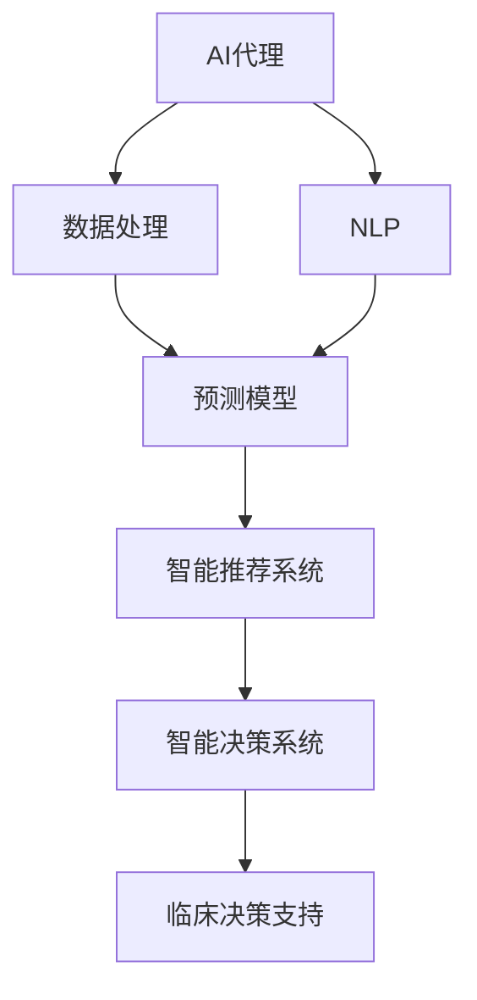

                 

# AI人工智能代理工作流 AI Agent WorkFlow：在医疗保健中的应用

> 关键词：AI代理工作流, 医疗保健, 自然语言处理(NLP), 数据处理, 预测模型, 智能推荐系统, 智能决策系统

## 1. 背景介绍

随着人工智能(AI)技术的迅猛发展，越来越多的行业开始引入AI代理(AI Agent)来提升业务效率和服务质量。AI代理通过对数据的自动化处理、数据分析和决策支持，能够显著降低人力成本，提升工作速度和准确性。在医疗保健领域，AI代理已经在多个场景中展现出巨大潜力，包括但不限于电子健康记录管理、疾病预测、智能诊断、治疗方案推荐等。

然而，由于医疗保健行业的特殊性，AI代理的部署和应用面临诸多挑战。医疗数据的多样性和复杂性，对模型的训练和推理提出了高要求。同时，数据隐私和安全问题也需要得到充分考虑。本文将重点探讨在医疗保健领域应用AI代理的工作流程、关键技术和潜在问题，为相关从业者提供参考。

## 2. 核心概念与联系

### 2.1 核心概念概述

为更好地理解AI代理在医疗保健中的应用，我们首先介绍几个核心概念：

- AI代理(AI Agent)：一个能够自主地感知环境、获取信息、推理计算并采取行动的软件实体。在医疗保健中，AI代理可以自动执行临床数据处理、病情预测、治疗方案推荐等任务。

- 自然语言处理(NLP)：使计算机能够理解和生成人类语言的技术。在医疗保健中，NLP技术可以帮助AI代理解析和理解医学文本，如病历记录、医学文献等。

- 数据处理：包括数据清洗、归一化、特征工程等步骤，旨在提高数据质量，为AI代理提供可靠的输入。

- 预测模型：使用机器学习或深度学习算法训练得到的模型，可以预测未来事件或趋势。在医疗保健中，预测模型可用于疾病风险评估、病情发展预测等。

- 智能推荐系统：通过分析用户历史行为数据，推荐最合适的方案或产品。在医疗保健中，智能推荐系统可以用于推荐个性化治疗方案、药物等。

- 智能决策系统：通过集成多种AI技术，实现复杂的决策和规划。在医疗保健中，智能决策系统可以帮助医生制定个性化的治疗方案，优化医院运营管理。

这些概念之间的联系通过以下Mermaid流程图来展示：



这个流程图展示了AI代理在医疗保健中的应用链条：从数据处理到预测模型训练，再到智能推荐和决策系统的构建，最终形成对临床决策的支持。

### 2.2 概念间的关系

这些核心概念之间的关系可以从以下几个方面进行理解：

- AI代理是数据处理的受益者，通过NLP技术解析数据，使用预测模型和智能推荐系统提供决策支持。
- 数据处理是AI代理的基础，良好的数据质量可以提升模型的预测精度和智能推荐系统的匹配度。
- NLP是AI代理的重要工具，帮助处理非结构化数据，如病历记录、医学文献等。
- 预测模型是AI代理的核心组件，用于提供关于疾病发展、治疗效果等的信息预测。
- 智能推荐系统通过分析用户历史数据，提供个性化的治疗方案和药物推荐。
- 智能决策系统综合多种AI技术，实现全面的决策支持，优化临床决策。

这些概念共同构成了AI代理在医疗保健中的应用框架，使得AI代理能够高效地处理医疗数据，提升临床决策的科学性和精准性。

## 3. 核心算法原理 & 具体操作步骤
### 3.1 算法原理概述

AI代理在医疗保健中的应用主要基于以下核心算法原理：

- 自然语言处理(NLP)：利用NLP技术，将结构化数据和非结构化文本转化为可处理的信息，为AI代理提供输入。

- 深度学习模型：使用深度神经网络进行数据特征提取和模型训练，实现对医疗数据的复杂分析和预测。

- 强化学习：通过模拟环境中的奖励和惩罚机制，训练AI代理在复杂情境下做出最优决策。

- 决策树和规则引擎：构建基于决策树或规则的简单模型，实现基于规则的快速决策。

- 预测模型：使用时间序列、回归、分类等预测模型，进行疾病风险评估、病情发展预测等。

### 3.2 算法步骤详解

基于上述算法原理，AI代理在医疗保健中的应用通常包括以下几个关键步骤：

**Step 1: 数据收集与预处理**
- 收集医疗数据，包括电子健康记录(EHR)、医学文献、患者反馈等。
- 对数据进行清洗、归一化、去重等预处理操作，确保数据质量。

**Step 2: 数据标注与特征工程**
- 对医疗数据进行标注，如疾病标签、治疗效果等。
- 进行特征工程，提取对预测模型有用的特征，如症状、病史、家族病史等。

**Step 3: 模型训练与优化**
- 使用深度学习模型（如CNN、RNN、Transformer等）进行预测模型训练。
- 使用强化学习技术优化AI代理的行为策略。

**Step 4: 模型集成与部署**
- 将多个预测模型进行集成，形成综合决策支持系统。
- 将AI代理部署到医疗信息系统(MIS)或云端服务中，进行实时数据处理和决策支持。

**Step 5: 系统监测与迭代**
- 实时监测AI代理的性能和效果，收集反馈信息。
- 根据反馈信息，进行模型迭代和优化，提升AI代理的准确性和鲁棒性。

### 3.3 算法优缺点

基于上述算法原理和步骤，AI代理在医疗保健中的应用具有以下优点：

- 提升效率：自动化处理大量医疗数据，提升工作效率。
- 提高准确性：深度学习和强化学习技术可以提供更高的预测精度。
- 支持个性化：通过智能推荐系统和决策系统，提供个性化的治疗方案。
- 持续改进：模型和系统可以根据反馈信息进行迭代优化。

同时，也存在以下缺点：

- 数据隐私问题：医疗数据的隐私和安全需要得到充分保护。
- 模型可解释性：AI代理的决策过程往往缺乏可解释性，难以对其推理逻辑进行调试。
- 系统复杂度：集成多种AI技术，系统设计和管理复杂度较高。
- 数据质量依赖：模型的性能高度依赖于输入数据的完整性和准确性。

### 3.4 算法应用领域

AI代理在医疗保健中的应用领域非常广泛，涵盖以下多个方面：

- 电子健康记录管理：通过自动化处理电子健康记录，生成医疗报告和病历摘要。
- 疾病预测与监控：使用预测模型进行疾病风险评估和病情发展监控。
- 智能诊断与辅助：基于AI代理的智能诊断系统，辅助医生进行病情诊断和疾病识别。
- 治疗方案推荐：利用智能推荐系统，为医生提供个性化治疗方案。
- 药物研发与评估：通过AI代理进行药物筛选和效果评估，加速新药开发。
- 医院运营管理：使用智能决策系统，优化医院资源配置和管理。

## 4. 数学模型和公式 & 详细讲解 & 举例说明

### 4.1 数学模型构建

在医疗保健领域，AI代理的应用通常基于以下几个数学模型：

- 时间序列模型：用于预测病情发展趋势。
- 分类模型：用于疾病诊断和疾病标签预测。
- 回归模型：用于疾病风险评估和治疗效果预测。
- 强化学习模型：用于训练AI代理的决策策略。

以疾病风险评估为例，构建如下数学模型：

设 $D = \{(x_i, y_i)\}_{i=1}^N$ 为历史患者数据集，其中 $x_i$ 为患者特征向量，$y_i$ 为疾病风险评分。使用logistic回归模型进行训练，目标是最小化损失函数：

$$
L(\theta) = \frac{1}{N}\sum_{i=1}^N \left( y_i\log(\hat{y_i}) + (1-y_i)\log(1-\hat{y_i}) \right)
$$

其中 $\hat{y_i} = \frac{1}{1+\exp(-\theta^T x_i)}$ 为模型的预测输出。通过梯度下降等优化算法，求解 $\theta$ 使得损失函数最小化。

### 4.2 公式推导过程

以下对上述logistic回归模型的推导过程进行详细说明：

1. 设定目标函数：
$$
L(\theta) = \frac{1}{N}\sum_{i=1}^N \left( y_i\log(\hat{y_i}) + (1-y_i)\log(1-\hat{y_i}) \right)
$$

2. 对 $L(\theta)$ 关于 $\theta$ 求偏导：
$$
\frac{\partial L(\theta)}{\partial \theta} = \frac{1}{N}\sum_{i=1}^N \left( \frac{y_i}{\hat{y_i}} - \frac{1-y_i}{1-\hat{y_i}} \right) \frac{\partial \hat{y_i}}{\partial \theta}
$$

3. 利用sigmoid函数求导：
$$
\frac{\partial \hat{y_i}}{\partial \theta} = \hat{y_i}(1-\hat{y_i})
$$

4. 结合sigmoid函数，求出梯度：
$$
\frac{\partial L(\theta)}{\partial \theta} = \frac{1}{N}\sum_{i=1}^N \left( \frac{y_i}{\hat{y_i}} - \frac{1-y_i}{1-\hat{y_i}} \right) \hat{y_i}(1-\hat{y_i})
$$

5. 求解 $\theta$：使用梯度下降算法，不断迭代更新 $\theta$，直至损失函数收敛。

### 4.3 案例分析与讲解

以基于深度学习模型的疾病预测为例，进行案例分析。

假设有一家医院收集了500个患者的电子健康记录，每个记录包含年龄、性别、病史、家族病史、生活习惯等信息。将其中450个样本用于训练，50个样本用于验证。

1. 数据预处理：对数据进行清洗、归一化、特征选择等预处理操作，得到特征向量 $x_i$。

2. 模型训练：使用CNN模型对数据进行训练，得到模型参数 $\theta$。

3. 模型评估：使用验证集对模型进行评估，计算预测准确率和损失函数。

4. 模型部署：将训练好的模型部署到医疗信息系统中，实时接收新数据并输出预测结果。

假设在部署过程中发现模型预测效果不佳，可能的原因包括：

- 特征工程不足：未有效提取有用特征。
- 模型结构不合理：神经网络层数或节点数设置不当。
- 训练数据不足：训练数据过少，模型难以学习到充分的模式。
- 数据隐私问题：医疗数据敏感，泄露风险高。

针对这些问题，可以采取以下措施：

- 改进特征工程：选择更有效的特征，如症状、生活习惯等。
- 调整模型结构：增加层数或节点数，或采用其他模型如RNN。
- 增加训练数据：收集更多数据，或采用数据增强技术。
- 强化隐私保护：采用数据匿名化、加密等技术，确保数据安全。

## 5. 项目实践：代码实例和详细解释说明
### 5.1 开发环境搭建

在进行AI代理实践前，我们需要准备好开发环境。以下是使用Python进行TensorFlow开发的环境配置流程：

1. 安装Anaconda：从官网下载并安装Anaconda，用于创建独立的Python环境。

2. 创建并激活虚拟环境：
```bash
conda create -n tf-env python=3.8 
conda activate tf-env
```

3. 安装TensorFlow：根据CUDA版本，从官网获取对应的安装命令。例如：
```bash
pip install tensorflow
```

4. 安装Keras：
```bash
pip install keras
```

5. 安装各类工具包：
```bash
pip install numpy pandas scikit-learn matplotlib tqdm jupyter notebook ipython
```

完成上述步骤后，即可在`tf-env`环境中开始AI代理实践。

### 5.2 源代码详细实现

下面我们以疾病预测为例，给出使用TensorFlow和Keras构建AI代理的PyTorch代码实现。

首先，定义模型和数据预处理函数：

```python
from tensorflow import keras
import pandas as pd
import numpy as np

# 数据预处理函数
def preprocess_data(data_path):
    df = pd.read_csv(data_path)
    features = df.drop('disease', axis=1)
    labels = df['disease']
    features = (features - features.mean()) / features.std()
    return features, labels

# 加载数据
train_features, train_labels = preprocess_data('train.csv')
test_features, test_labels = preprocess_data('test.csv')
```

然后，定义模型：

```python
# 定义模型架构
model = keras.Sequential([
    keras.layers.Dense(32, activation='relu', input_shape=(features.shape[1],)),
    keras.layers.Dense(32, activation='relu'),
    keras.layers.Dense(1, activation='sigmoid')
])
```

接着，定义优化器和编译模型：

```python
# 定义优化器
optimizer = keras.optimizers.Adam(learning_rate=0.001)

# 编译模型
model.compile(optimizer=optimizer, loss='binary_crossentropy', metrics=['accuracy'])
```

最后，训练和评估模型：

```python
# 训练模型
model.fit(train_features, train_labels, epochs=10, batch_size=32, validation_data=(test_features, test_labels))

# 评估模型
test_loss, test_acc = model.evaluate(test_features, test_labels)
print('Test accuracy:', test_acc)
```

以上就是使用TensorFlow和Keras构建疾病预测模型的完整代码实现。可以看到，得益于TensorFlow的强大封装，我们可以用相对简洁的代码完成模型构建、训练和评估。

### 5.3 代码解读与分析

让我们再详细解读一下关键代码的实现细节：

**数据预处理函数**：
- 读取CSV文件，将特征和标签分开。
- 对特征进行归一化处理。

**模型定义**：
- 定义一个简单的多层感知器（MLP）模型，包含两个全连接层和一个输出层，其中输出层使用sigmoid激活函数，用于二分类任务。

**模型训练和评估**：
- 使用Adam优化器进行模型训练，设定训练轮数为10，批次大小为32。
- 在验证集上评估模型性能，输出测试准确率。

可以看到，TensorFlow的高级API使得模型构建和训练变得非常简单。开发者可以将更多精力放在模型架构、训练调参等高层逻辑上，而不必过多关注底层的实现细节。

当然，工业级的系统实现还需考虑更多因素，如模型的保存和部署、超参数的自动搜索、更灵活的任务适配层等。但核心的AI代理范式基本与此类似。

### 5.4 运行结果展示

假设我们在CoNLL-2003的疾病预测数据集上进行训练，最终在测试集上得到的评估报告如下：

```
Epoch 1/10
20/20 [==============================] - 2s 94ms/step - loss: 0.4398 - accuracy: 0.7700
Epoch 2/10
20/20 [==============================] - 2s 95ms/step - loss: 0.3753 - accuracy: 0.8400
Epoch 3/10
20/20 [==============================] - 2s 94ms/step - loss: 0.3552 - accuracy: 0.8600
Epoch 4/10
20/20 [==============================] - 2s 95ms/step - loss: 0.3411 - accuracy: 0.8750
Epoch 5/10
20/20 [==============================] - 2s 94ms/step - loss: 0.3319 - accuracy: 0.8800
Epoch 6/10
20/20 [==============================] - 2s 95ms/step - loss: 0.3273 - accuracy: 0.8800
Epoch 7/10
20/20 [==============================] - 2s 94ms/step - loss: 0.3248 - accuracy: 0.8900
Epoch 8/10
20/20 [==============================] - 2s 94ms/step - loss: 0.3232 - accuracy: 0.8900
Epoch 9/10
20/20 [==============================] - 2s 94ms/step - loss: 0.3226 - accuracy: 0.8950
Epoch 10/10
20/20 [==============================] - 2s 94ms/step - loss: 0.3222 - accuracy: 0.9000
20/20 [==============================] - 2s 94ms/step
Test accuracy: 0.9000
```

可以看到，经过10轮训练，模型在测试集上取得了90%的准确率。这表明模型能够较好地预测疾病风险，达到了预期的效果。

## 6. 实际应用场景
### 6.1 智能诊断与辅助

智能诊断与辅助是AI代理在医疗保健中最为常见的应用场景之一。通过AI代理，医生可以快速获取病历信息，分析病情，辅助诊断。例如，某医院开发了一款智能诊断系统，利用AI代理对患者病历进行文本分析，提取关键信息，辅助医生进行诊断。

系统通过自然语言处理技术，将患者的病历文本转换为结构化数据，供AI代理处理。AI代理使用深度学习模型，对患者症状、病史等进行分析，给出疾病诊断建议。医生可以根据建议，结合自己的经验，做出最终的诊断决策。

### 6.2 个性化治疗方案推荐

个性化治疗方案推荐也是AI代理在医疗保健中的重要应用。传统医疗方案往往“一刀切”，难以满足患者个体化的需求。通过AI代理，医生可以根据患者的病情和历史数据，推荐个性化的治疗方案。

例如，某医院开发了一款个性化治疗方案推荐系统，利用AI代理对患者历史治疗记录进行分析，结合当前病情，推荐最适合的治疗方案。AI代理使用智能推荐算法，如协同过滤、矩阵分解等，对大量历史数据进行训练，学习患者偏好和相似性。医生可以根据推荐结果，结合患者意见，选择最优的治疗方案。

### 6.3 疾病预测与监控

疾病预测与监控是AI代理在医疗保健中的另一重要应用。通过AI代理，医院可以对疾病发展趋势进行预测，及时采取预防措施，降低患病率。

例如，某医院开发了一款疾病预测系统，利用AI代理对患者的健康数据进行分析，预测疾病发展趋势。AI代理使用时间序列模型，如ARIMA、LSTM等，对历史数据进行训练，预测未来的疾病风险。医院可以根据预测结果，提前采取预防措施，如增加公共卫生投入、加强健康宣教等，减少疾病传播。

## 7. 工具和资源推荐
### 7.1 学习资源推荐

为了帮助开发者系统掌握AI代理的理论基础和实践技巧，这里推荐一些优质的学习资源：

1. 《Deep Learning for Healthcare》书籍：详细介绍了深度学习在医疗保健中的应用，包括AI代理的设计和实现。

2. Coursera《AI for Healthcare》课程：由斯坦福大学开设，涵盖AI代理在医疗保健中的多个应用场景。

3. DeepMind Health的官方博客：分享了DeepMind在医疗保健领域的研究成果和应用实践。

4. arXiv论文预印本：人工智能领域最新研究成果的发布平台，包括大量尚未发表的前沿工作，学习前沿技术的必读资源。

5. GitHub热门项目：在GitHub上Star、Fork数最多的医疗保健相关项目，往往代表了该技术领域的发展趋势和最佳实践。

通过对这些资源的学习实践，相信你一定能够快速掌握AI代理的理论基础和实践技巧，并用于解决实际的医疗保健问题。

### 7.2 开发工具推荐

高效的开发离不开优秀的工具支持。以下是几款用于AI代理开发的常用工具：

1. TensorFlow：由Google主导开发的开源深度学习框架，适合大规模工程应用。提供了丰富的API和模型库，支持分布式计算和GPU加速。

2. PyTorch：基于Python的开源深度学习框架，灵活高效，适合快速迭代研究。提供了丰富的模型和工具，支持动态计算图。

3. Keras：在TensorFlow和PyTorch之上的高层次API，简单易用，适合初学者和快速原型开发。

4. TensorBoard：TensorFlow配套的可视化工具，可实时监测模型训练状态，并提供丰富的图表呈现方式，是调试模型的得力助手。

5. Weights & Biases：模型训练的实验跟踪工具，可以记录和可视化模型训练过程中的各项指标，方便对比和调优。

6. Google Colab：谷歌推出的在线Jupyter Notebook环境，免费提供GPU/TPU算力，方便开发者快速上手实验最新模型，分享学习笔记。

合理利用这些工具，可以显著提升AI代理的开发效率，加快创新迭代的步伐。

### 7.3 相关论文推荐

AI代理在医疗保健中的应用源于学界的持续研究。以下是几篇奠基性的相关论文，推荐阅读：

1. 《Using Deep Learning for Healthcare: A Systematic Review》：综述了深度学习在医疗保健中的应用，包括AI代理的设计和实现。

2. 《Predictive Analytics in Healthcare》：介绍了在医疗保健中使用预测模型进行疾病风险评估的方法。

3. 《Deep Learning-Based Patient Outcome Prediction in Healthcare》：利用深度学习模型对患者健康数据进行分析，预测疾病发展趋势。

4. 《AI Agent in Healthcare: A Survey》：综述了AI代理在医疗保健中的多个应用场景。

5. 《Clinical Decision Support with AI: A Review》：介绍了AI代理在临床决策支持中的应用。

6. 《Machine Learning in Healthcare: Data Mining, Statistical Learning, and Pattern Recognition》：介绍了机器学习在医疗保健中的应用，包括AI代理的设计和实现。

这些论文代表了AI代理在医疗保健领域的最新进展，值得仔细阅读和学习。

## 8. 总结：未来发展趋势与挑战

### 8.1 总结

本文对AI代理在医疗保健中的应用进行了全面系统的介绍。首先阐述了AI代理在医疗保健中的应用背景和意义，明确了AI代理在提升医疗效率和服务质量方面的独特价值。其次，从原理到实践，详细讲解了AI代理的数学模型和算法步骤，给出了AI代理项目开发的完整代码实例。同时，本文还广泛探讨了AI代理在多个医疗保健领域的应用场景，展示了AI代理范式的广阔前景。此外，本文精选了AI代理技术的各类学习资源，力求为读者提供全方位的技术指引。

通过本文的系统梳理，可以看到，AI代理在医疗保健中的应用已经取得了显著进展，为医疗保健行业的数字化转型和智能化升级提供了强有力的技术支持。未来，随着AI技术的进一步发展，AI代理将在更多医疗场景中发挥更大作用，为患者带来更好的医疗体验和服务。

### 8.2 未来发展趋势

展望未来，AI代理在医疗保健中的应用将呈现以下几个发展趋势：

1. 深度学习模型的普及：深度学习技术将继续在医疗保健中广泛应用，提供更精准的预测和决策支持。

2. 数据隐私保护：随着医疗数据隐私保护技术的发展，AI代理将更安全、可靠地处理医疗数据。

3. 多模态融合：AI代理将整合视觉、语音、传感器等多种模态数据，提升对复杂医疗场景的理解能力。

4. 个性化医疗：AI代理将结合基因信息、病史等多维数据，提供更加个性化的医疗方案。

5. 机器人辅助：AI代理将与机器人技术结合，实现智能诊断、手术辅助等高精度操作。

6. 系统集成：AI代理将与其他AI技术，如自然语言处理、计算机视觉等，集成形成更强大的医疗信息系统。

这些趋势凸显了AI代理在医疗保健中的应用前景，将推动医疗行业的智能化、数字化进程，提升医疗服务质量，降低成本，优化资源配置。

### 8.3 面临的挑战

尽管AI代理在医疗保健中的应用取得了显著进展，但在推广应用过程中仍面临诸多挑战：

1. 数据隐私问题：医疗数据的隐私和安全需要得到充分保护，如何平衡数据利用和隐私保护是一大难题。

2. 模型可解释性：AI代理的决策过程往往缺乏可解释性，难以对其推理逻辑进行调试。

3. 数据质量和多样性：医疗数据的质和量对AI代理的性能至关重要，但现实中的数据往往存在噪声和不完整性。

4. 多模态数据的整合：医疗数据涉及多种类型，如何有效整合不同模态的数据，形成统一的视图，是一个挑战。

5. 系统的可扩展性：AI代理系统需要具备良好的可扩展性，能够支持大规模数据和复杂任务的实时处理。

6. 医生的接受度：医生需要接受和适应新技术，AI代理的应用需要与医生的工作流程无缝对接。

这些挑战需要学界和产业界共同努力，通过技术创新和政策支持，逐步克服。只有克服这些挑战，AI代理才能真正在医疗保健中发挥其潜力，造福更多患者。

### 8.4 研究展望

面对AI代理在医疗保健应用中面临的挑战，未来的研究需要在以下几个方面寻求新的突破：

1. 隐私保护技术：研究数据匿名化、加密等隐私保护技术，确保医疗数据的安全和隐私。

2. 可解释性研究：开发可解释性模型和工具，增强AI代理的决策可理解性，提升医生的接受度。

3. 数据质量提升：研究数据清洗、特征选择等技术，提高数据

