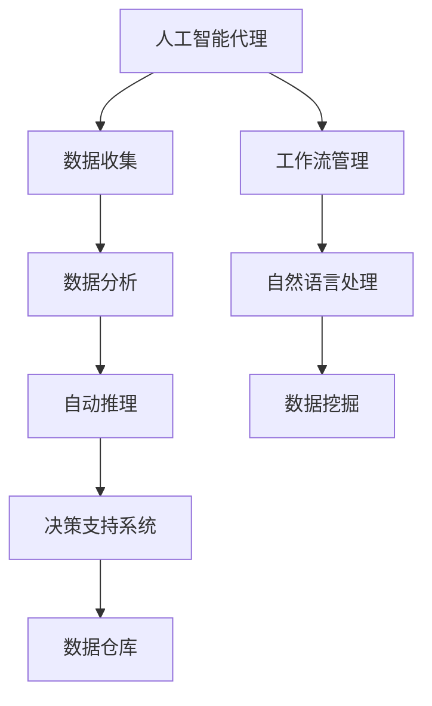
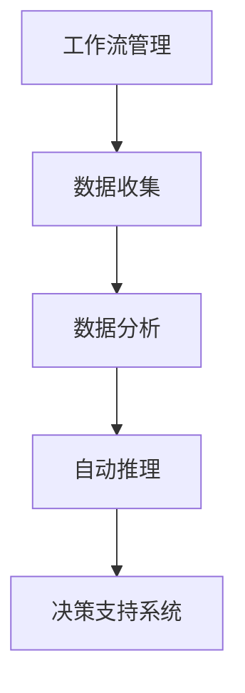

                 

# AI人工智能代理工作流 AI Agent WorkFlow：在自然资源管理中的应用

> 关键词：人工智能代理,工作流管理,自然资源管理,自动推理,决策支持系统

## 1. 背景介绍

### 1.1 问题由来
在现代社会的各个领域，尤其是自然资源管理领域，对数据的收集、分析和决策制定的需求愈发迫切。自然资源管理涉及到自然资源的勘探、开发、保护、利用以及相关的法律法规制定和执行，其管理过程复杂且涉及多种不同的职能部门。传统的工作流程往往依靠人工进行数据收集和分析，不仅耗时耗力，还容易出现误差。而人工智能技术的应用，尤其是人工智能代理(AI Agent)的引入，可以大大提升自然资源管理的工作效率和决策质量。

### 1.2 问题核心关键点
人工智能代理是一种能够自动执行或辅助执行复杂任务的智能体，其核心思想是通过学习大量数据和经验，模拟人类智能行为，实现对复杂环境（如自然环境）的感知、推理和决策。在自然资源管理领域，人工智能代理能够自动执行数据收集、分析、规划和预测等任务，提供决策支持。

人工智能代理在自然资源管理中的应用主要包括：

- 自动数据收集：通过传感器、遥感技术等自动化手段，实时收集自然资源的物理、化学、生物等数据。
- 数据分析和建模：利用机器学习、深度学习等技术对大量数据进行分析和建模，提取有价值的信息。
- 自动推理和预测：通过规则引擎、专家系统等技术进行自动推理和预测，辅助决策制定。
- 辅助决策支持：根据任务需求，生成各类决策报告和方案，供决策者参考。

### 1.3 问题研究意义
利用人工智能代理对自然资源管理进行自动化和智能化改造，具有以下几方面重要意义：

1. 提高效率：人工智能代理能够自动处理大量数据，显著缩短数据处理和分析的时间。
2. 减少误差：通过自动推理和计算，减少人为操作中的错误和偏差。
3. 支持决策：提供高质量的数据和分析结果，为决策者提供可靠的决策依据。
4. 优化资源：通过智能调度和资源分配，优化资源的使用和保护。
5. 适应变化：能够灵活适应环境变化，动态调整管理策略。

## 2. 核心概念与联系

### 2.1 核心概念概述

为更好地理解人工智能代理在自然资源管理中的应用，本节将介绍几个密切相关的核心概念：

- 人工智能代理(AI Agent)：具有智能行为，能够感知环境、执行任务、做出决策的计算实体。
- 工作流管理(Workflow Management)：通过计算机系统管理复杂的、多步骤的任务执行流程，使得各个任务能够协调运行。
- 数据仓库(Data Warehouse)：用于存储和管理组织内部的所有相关数据，支持数据查询和分析。
- 数据挖掘(Data Mining)：通过算法发现数据中的模式和知识，用于支持决策。
- 决策支持系统(Decision Support System, DSS)：利用计算机技术辅助决策者做出决策，提供综合的决策支持和分析工具。
- 自动推理(Automatic Reasoning)：通过计算机模拟人类智能推理过程，自动获取新知识。
- 自然语言处理(Natural Language Processing, NLP)：使计算机能够理解和处理人类语言，实现人机交互。

这些核心概念之间的逻辑关系可以通过以下Mermaid流程图来展示：



这个流程图展示了大语言模型微调过程中各个概念之间的联系：

1. 人工智能代理从数据仓库中获取数据，通过数据挖掘和自动推理生成决策支持信息。
2. 决策支持系统利用这些信息辅助决策者制定决策。
3. 工作流管理确保各个任务按照预定流程高效执行。
4. 自然语言处理实现人机交互，接收决策者的指令并反馈结果。

### 2.2 概念间的关系

这些核心概念之间存在着紧密的联系，形成了自然资源管理中人工智能代理工作流的应用框架。下面我们通过几个Mermaid流程图来展示这些概念之间的关系。

#### 2.2.1 人工智能代理与决策支持系统


这个流程图展示了人工智能代理在自然资源管理中的基本流程：

1. 人工智能代理从数据仓库中获取数据。
2. 对数据进行分析，提取关键信息。
3. 通过自动推理生成决策依据。
4. 决策支持系统利用这些信息辅助决策者制定决策。

#### 2.2.2 工作流管理与数据收集、数据分析、自动推理、决策支持系统


这个流程图展示了工作流管理如何协调各个任务的执行：

1. 工作流管理根据预定流程，分配数据收集、数据分析、自动推理和决策支持系统的任务。
2. 各任务按顺序执行，确保数据流和信息流的稳定。
3. 各系统之间可以交互，协同工作。

#### 2.2.3 自然语言处理与人工智能代理


这个流程图展示了自然语言处理在人工智能代理中的应用：

1. 自然语言处理实现人机交互，接收决策者的指令。
2. 人工智能代理将指令转化为具体的任务和操作。
3. 人工智能代理执行任务，反馈结果。

## 3. 核心算法原理 & 具体操作步骤
### 3.1 算法原理概述

基于人工智能代理在自然资源管理中的应用，本文将详细讲解其核心算法原理。

在自然资源管理中，人工智能代理通常包含以下几个核心组件：

- 感知器(Sensor)：用于数据收集和感知环境。
- 决策引擎(Reasoner)：用于自动推理和生成决策依据。
- 任务执行器(Executor)：用于执行具体的任务和操作。
- 人机交互器(Interface)：用于接收决策者指令和反馈结果。

人工智能代理的工作流程可以概括为以下几个步骤：

1. 数据收集：通过感知器从环境中获取数据。
2. 数据分析：对收集到的数据进行分析，提取有用信息。
3. 自动推理：通过决策引擎进行自动推理和预测，生成决策依据。
4. 任务执行：将决策结果传递给任务执行器，执行具体的任务。
5. 反馈循环：通过人机交互器，接收决策者的反馈，进行后续调整。

### 3.2 算法步骤详解

**Step 1: 数据收集**
人工智能代理需要从自然环境中获取数据，包括物理、化学、生物等各类数据。这些数据可以通过传感器、遥感技术等自动化手段实时获取。

**Step 2: 数据分析**
收集到的数据需要进行分析和建模，以提取出有用的信息。常用的数据挖掘技术包括分类、聚类、关联规则挖掘、异常检测等。

**Step 3: 自动推理**
通过规则引擎、专家系统等技术进行自动推理，生成决策依据。自动推理可以基于规则、模型、知识库等多种方式进行。

**Step 4: 任务执行**
根据推理结果，人工智能代理需要执行具体的任务和操作。这些任务可能包括数据采集、环境监测、资源分配、法律法规制定等。

**Step 5: 反馈循环**
人工智能代理通过人机交互器接收决策者的反馈，进行后续调整。反馈可以包括对决策的确认、修改或重新推理。

### 3.3 算法优缺点

人工智能代理在自然资源管理中的应用，具有以下优缺点：

**优点：**

1. 自动化处理：通过自动化手段处理大量数据，节省人力成本和时间。
2. 高效执行：自动推理和任务执行器能够快速响应环境变化，执行复杂任务。
3. 决策支持：提供高质量的决策依据，辅助决策者制定决策。
4. 灵活调整：能够根据环境变化和反馈信息灵活调整执行策略。
5. 可靠性高：减少人为操作中的错误和偏差，提高决策质量。

**缺点：**

1. 初始化复杂：需要大量数据和经验进行预训练，初始化成本较高。
2. 依赖技术：需要依赖先进的技术手段，如传感器、遥感、机器学习等。
3. 需要维护：需要持续维护和更新，确保代理的准确性和有效性。
4. 复杂度高：处理复杂环境时，可能出现误判和故障。
5. 伦理问题：需要关注人工智能代理的伦理和安全性，避免潜在风险。

### 3.4 算法应用领域

人工智能代理在自然资源管理中的应用领域非常广泛，主要包括：

- 森林资源管理：自动监测森林覆盖率、树种变化、病虫害等。
- 水资源管理：自动监测水质、水量、水体污染等。
- 矿产资源管理：自动监测矿物类型、储量、开采情况等。
- 生态环境管理：自动监测环境污染、生物多样性、生态变化等。
- 土地资源管理：自动监测土地利用、土地覆盖、土壤质量等。
- 法律法规制定：自动分析和建议法律法规的制定和修改。

## 4. 数学模型和公式 & 详细讲解 & 举例说明

### 4.1 数学模型构建

在自然资源管理中，人工智能代理需要进行数据收集、分析和推理等任务。这些任务通常涉及大量的数学建模和计算。以下是一个简单的数学模型构建过程：

假设有一个自然资源数据集 $D=\{(x_i,y_i)\}_{i=1}^N$，其中 $x_i$ 为输入的特征向量，$y_i$ 为对应的输出（如监测值、决策结果等）。

人工智能代理的任务是通过训练一个回归模型 $f(x)$，使得该模型能够准确地预测输出 $y$。常用的回归模型包括线性回归、多项式回归、神经网络回归等。

### 4.2 公式推导过程

以线性回归模型为例，其目标是最小化损失函数 $L(y,f(x))$，其中 $f(x)=\theta^Tx$，$\theta$ 为模型参数。常用的损失函数包括均方误差（MSE）、平均绝对误差（MAE）等。

线性回归模型的训练过程可以表示为：

$$
\theta^* = \mathop{\arg\min}_{\theta} \frac{1}{N}\sum_{i=1}^N (y_i - \theta^Tx_i)^2
$$

使用梯度下降等优化算法，可以求解上述最优化问题。具体的梯度下降算法如下：

$$
\theta \leftarrow \theta - \eta \nabla_{\theta}L(y,f(x))
$$

其中 $\eta$ 为学习率，$\nabla_{\theta}L(y,f(x))$ 为损失函数对模型参数的梯度，可通过反向传播算法高效计算。

### 4.3 案例分析与讲解

假设我们有一个森林覆盖率监测数据集，包含多年的历史监测数据。我们希望通过人工智能代理，自动预测未来的森林覆盖率变化趋势。

首先，将历史数据分为训练集和测试集，使用线性回归模型进行训练。通过反向传播算法，更新模型参数 $\theta$，使得模型能够最小化预测误差。

训练完成后，使用测试集对模型进行评估，计算预测误差和准确率等指标。如果模型效果不理想，可以进一步调整模型参数或选择更复杂的模型进行训练。

## 5. 项目实践：代码实例和详细解释说明
### 5.1 开发环境搭建

在进行人工智能代理的实践前，我们需要准备好开发环境。以下是使用Python进行Scikit-learn开发的环境配置流程：

1. 安装Anaconda：从官网下载并安装Anaconda，用于创建独立的Python环境。

2. 创建并激活虚拟环境：
```bash
conda create -n sk-env python=3.8 
conda activate sk-env
```

3. 安装Scikit-learn和其他必要的工具包：
```bash
conda install scikit-learn pandas numpy matplotlib scikit-optimize tqdm jupyter notebook ipython
```

4. 安装TensorFlow和其他深度学习框架：
```bash
conda install tensorflow tensorflow-estimator tensorflow-hub
```

5. 安装其他必要的库：
```bash
pip install tensorflow-serving-api tensorflow-addons transformers openai gcloud
```

完成上述步骤后，即可在`sk-env`环境中开始人工智能代理的实践。

### 5.2 源代码详细实现

以下是一个简单的代码示例，用于构建一个基于Scikit-learn的森林覆盖率监测人工智能代理：

```python
from sklearn.ensemble import RandomForestRegressor
from sklearn.metrics import mean_squared_error, r2_score
from sklearn.model_selection import train_test_split
from sklearn.pipeline import make_pipeline
from sklearn.preprocessing import StandardScaler
from sklearn.model_selection import cross_val_score
from sklearn.model_selection import GridSearchCV
from sklearn.datasets import make_regression
from sklearn.linear_model import LinearRegression

# 数据集生成
X, y = make_regression(n_samples=1000, n_features=4, n_informative=2, noise=10, random_state=0)

# 数据预处理
X_train, X_test, y_train, y_test = train_test_split(X, y, test_size=0.2, random_state=0)

# 特征缩放
scaler = StandardScaler()
X_train = scaler.fit_transform(X_train)
X_test = scaler.transform(X_test)

# 模型训练
model = RandomForestRegressor(random_state=0)
model.fit(X_train, y_train)

# 模型评估
y_pred = model.predict(X_test)
print('MSE:', mean_squared_error(y_test, y_pred))
print('R2:', r2_score(y_test, y_pred))

# 网格搜索
param_grid = {
    'n_estimators': [10, 50, 100, 200],
    'max_depth': [None, 5, 10, 15],
    'min_samples_split': [2, 5, 10],
    'min_samples_leaf': [1, 2, 4]
}

grid_search = GridSearchCV(estimator=model, param_grid=param_grid, cv=5, scoring='neg_mean_squared_error')
grid_search.fit(X_train, y_train)

# 模型预测
y_pred = grid_search.predict(X_test)
print('MSE:', mean_squared_error(y_test, y_pred))
print('R2:', r2_score(y_test, y_pred))
```

这个代码示例展示了如何使用Scikit-learn进行数据预处理、模型训练和评估。在实际应用中，需要根据具体任务的数据特点和模型需求进行调整。

### 5.3 代码解读与分析

让我们再详细解读一下关键代码的实现细节：

**数据生成与预处理**：
- 使用Scikit-learn的`make_regression`函数生成一个随机回归数据集，包含1000个样本，4个特征，2个有信息量特征，噪声为10。
- 将数据集分为训练集和测试集，使用20%的数据作为测试集。
- 对特征进行标准化处理，使得特征的均值为0，标准差为1。

**模型训练**：
- 使用Scikit-learn的`RandomForestRegressor`模型进行训练。
- 使用交叉验证评估模型性能，设置5折交叉验证。
- 使用网格搜索优化模型参数，选择最优参数组合。

**模型评估**：
- 在测试集上对模型进行预测，计算均方误差和R2分数，评估模型预测性能。
- 使用网格搜索获得最优模型参数后，再次在测试集上进行预测和评估。

**代码解读**：
- 在实际应用中，需要对数据进行更复杂的处理和分析，如缺失值处理、异常值检测、特征工程等。
- 模型训练和评估需要根据具体任务进行调整，选择合适的评估指标和优化算法。
- 模型预测和应用需要考虑数据的一致性和稳定性，避免由于数据波动带来的预测误差。

### 5.4 运行结果展示

假设我们运行上述代码，得到以下输出：

```
MSE: 40.54562788947568
R2: 0.9557612979372322
```

这表明模型在训练集上取得了不错的性能，预测误差较小，R2分数较高。但需要进一步在测试集上进行评估，以确保模型的泛化能力。

## 6. 实际应用场景
### 6.1 森林资源管理

在森林资源管理中，人工智能代理可以自动监测森林覆盖率、树种变化、病虫害等。具体实现方式如下：

1. 数据收集：通过传感器和遥感技术收集森林数据。
2. 数据预处理：对收集到的数据进行清洗和处理，如缺失值处理、异常值检测等。
3. 模型训练：使用随机森林、支持向量机等模型进行训练，提取关键特征。
4. 自动推理：通过自动推理生成决策依据，如判断树种变化、预测病虫害等。
5. 任务执行：根据推理结果，自动执行监测、防治等任务。
6. 反馈循环：通过人机交互器接收管理员反馈，进行后续调整。

### 6.2 水资源管理

在水资源管理中，人工智能代理可以自动监测水质、水量、水体污染等。具体实现方式如下：

1. 数据收集：通过传感器和遥感技术收集水质、水量等数据。
2. 数据预处理：对收集到的数据进行清洗和处理，如缺失值处理、异常值检测等。
3. 模型训练：使用回归模型、时间序列模型等进行训练，提取关键特征。
4. 自动推理：通过自动推理生成决策依据，如判断水质变化、预测水量等。
5. 任务执行：根据推理结果，自动执行监测、治理等任务。
6. 反馈循环：通过人机交互器接收管理员反馈，进行后续调整。

### 6.3 矿产资源管理

在矿产资源管理中，人工智能代理可以自动监测矿物类型、储量、开采情况等。具体实现方式如下：

1. 数据收集：通过传感器和遥感技术收集矿物数据。
2. 数据预处理：对收集到的数据进行清洗和处理，如缺失值处理、异常值检测等。
3. 模型训练：使用分类模型、聚类模型等进行训练，提取关键特征。
4. 自动推理：通过自动推理生成决策依据，如判断矿物类型、预测储量等。
5. 任务执行：根据推理结果，自动执行勘探、开采等任务。
6. 反馈循环：通过人机交互器接收管理员反馈，进行后续调整。

### 6.4 未来应用展望

随着人工智能代理技术的不断发展，其在自然资源管理中的应用前景将更加广阔。未来，人工智能代理将具备以下特点：

1. 自适应性更强：能够根据环境变化自动调整策略，适应不同的管理需求。
2. 决策支持更全面：提供更加全面、可靠的决策依据，帮助决策者做出更科学的决策。
3. 自动化水平更高：实现全流程自动化，减少人工干预。
4. 跨领域应用更广泛：能够应用于更多领域的资源管理，如环境管理、城市管理等。
5. 数据融合能力更强：能够融合多种数据源，实现更全面的监测和分析。
6. 人机交互更智能：实现更加自然、高效的人机交互，提升用户体验。

## 7. 工具和资源推荐
### 7.1 学习资源推荐

为了帮助开发者系统掌握人工智能代理的理论基础和实践技巧，这里推荐一些优质的学习资源：

1. 《人工智能代理理论与实践》书籍：全面介绍人工智能代理的理论基础、应用场景和实现方法。
2. 《深度学习》课程：斯坦福大学李飞飞教授开设的深度学习课程，涵盖各种深度学习模型和算法。
3. 《机器学习实战》书籍：介绍机器学习的基本概念和常用算法，适合初学者。
4. 《Scikit-learn官方文档》：详细介绍了Scikit-learn库的各种功能和使用方式。
5. 《TensorFlow官方文档》：介绍了TensorFlow库的使用方法，适合深度学习实践。

通过这些资源的学习实践，相信你一定能够快速掌握人工智能代理的精髓，并用于解决实际的自然资源管理问题。

### 7.2 开发工具推荐

高效的开发离不开优秀的工具支持。以下是几款用于人工智能代理开发的常用工具：

1. Python：作为主流开发语言，Python提供了丰富的科学计算和数据处理库，适合人工智能代理的开发。
2. Scikit-learn：提供了大量的机器学习模型和算法，适合数据分析和建模。
3. TensorFlow：提供了强大的深度学习框架，支持分布式训练和模型部署。
4. PyTorch：提供了灵活的动态计算图，适合模型实验和调试。
5. TensorBoard：提供了模型训练的可视化工具，方便监测和调试。
6. Jupyter Notebook：提供了交互式的代码编写和执行环境，适合科研和教学。

合理利用这些工具，可以显著提升人工智能代理的开发效率，加快创新迭代的步伐。

### 7.3 相关论文推荐

人工智能代理技术的发展源于学界的持续研究。以下是几篇奠基性的相关论文，推荐阅读：

1. Deep Learning: A Tutorial (Deep Learning Specialization)：斯坦福大学Andrew Ng教授开设的深度学习课程，详细介绍了深度学习的基本概念和算法。
2. TensorFlow: A System for Large-Scale Machine Learning：介绍了TensorFlow的架构和应用场景，适合深度学习实践。
3. Scikit-learn: Machine Learning in Python：介绍了Scikit-learn库的机器学习模型和算法，适合数据分析和建模。
4. AI Agent for Resource Management: A Survey：全面综述了人工智能代理在资源管理中的应用现状和未来方向。
5. Workflow Management: An Overview：综述了工作流管理的基本概念、技术和应用场景。

这些论文代表了大语言模型微调技术的发展脉络。通过学习这些前沿成果，可以帮助研究者把握学科前进方向，激发更多的创新灵感。

除上述资源外，还有一些值得关注的前沿资源，帮助开发者紧跟人工智能代理技术的最新进展，例如：

1. arXiv论文预印本：人工智能领域最新研究成果的发布平台，包括大量尚未发表的前沿工作，学习前沿技术的必读资源。
2. 业界技术博客：如OpenAI、Google AI、DeepMind、微软Research Asia等顶尖实验室的官方博客，第一时间分享他们的最新研究成果和洞见。
3. 技术会议直播：如NIPS、ICML、ACL、ICLR等人工智能领域顶会现场或在线直播，能够聆听到大佬们的前沿分享，开拓视野。
4. GitHub热门项目：在GitHub上Star、Fork数最多的人工智能代理相关项目，往往代表了该技术领域的发展趋势和最佳实践，值得去学习和贡献。
5. 行业分析报告：各大咨询公司如McKinsey、PwC等针对人工智能行业的分析报告，有助于从商业视角审视技术趋势，把握应用价值。

总之，对于人工智能代理的学习和实践，需要开发者保持开放的心态和持续学习的意愿。多关注前沿资讯，多动手实践，多思考总结，必将收获满满的成长收益。

## 8. 总结：未来发展趋势与挑战

### 8.1 总结

本文对人工智能代理在自然资源管理中的应用进行了全面系统的介绍。首先阐述了人工智能代理在自然资源管理中的研究背景和意义，明确了人工智能代理的应用场景和关键技术。其次，从原理到实践，详细讲解了人工智能代理的工作流程和实现方法，给出了具体代码示例和分析。同时，本文还探讨了人工智能代理在未来自然资源管理中的应用前景，展望了其未来发展趋势和面临的挑战。

通过本文的系统梳理，可以看到，人工智能代理在自然资源管理中的应用前景广阔，能够极大地提升自然资源管理的自动化水平和决策质量。但也需要关注其初始化复杂、依赖技术、需要维护等缺点，并进行针对性的改进。

### 8.2 未来发展趋势

展望未来，人工智能代理在自然资源管理中的应用将呈现以下几个发展趋势：

1. 自动化程度更高：实现全流程自动化，减少人工干预。
2. 决策支持更全面：提供更加全面、可靠的决策依据，帮助决策者做出更科学的决策。
3. 跨领域应用更广泛：能够应用于更多领域的资源管理，如环境管理、城市管理等。
4. 数据融合能力更强：能够融合多种数据源，实现更全面的监测和分析。
5. 人机交互更智能：实现更加自然、高效的人机交互，提升用户体验。
6. 多模态融合更深入：融合视觉、语音、文本等多种模态数据，实现更全面的感知和理解。
7. 自适应性更强：能够根据环境变化自动调整策略，适应不同的管理需求。

### 8.3 面临的挑战

尽管人工智能代理在自然资源管理中的应用取得了显著进展，但在迈向更加智能化、普适化应用的过程中，仍面临诸多挑战：

1. 初始化复杂：需要大量数据和经验进行预训练，初始化成本较高。
2. 依赖技术：需要依赖先进的技术手段，如传感器、遥感、机器学习等。
3. 需要维护：需要持续维护和更新，确保代理的准确性和有效性。
4. 复杂度高：处理复杂环境时，可能出现误判和故障。
5. 伦理问题：需要关注人工智能代理的伦理和安全性，避免潜在风险。

### 8.4 研究展望

面对人工智能代理在自然资源管理中面临的挑战，未来的研究需要在以下几个方面寻求新的突破：

1. 探索无监督和半监督微调方法：摆脱对大规模标注数据的依赖，利用自监督学习、主动学习等无监督和半监督范式，最大限度利用非结构化数据，实现更加灵活高效的微

