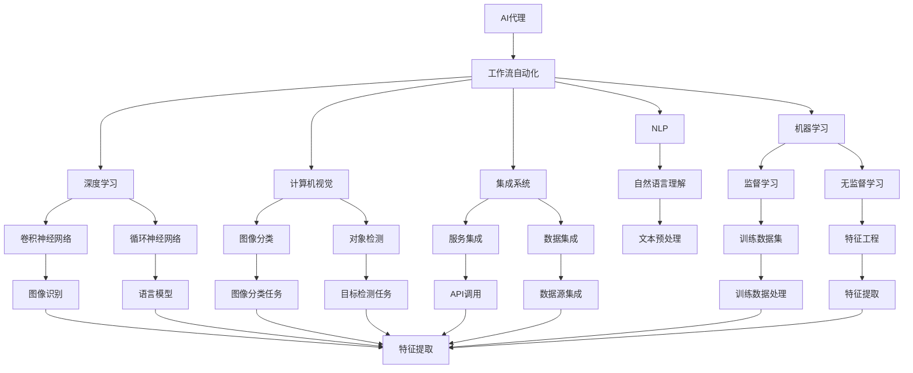

                 

# AI人工智能代理工作流 AI Agent WorkFlow：未来发展趋势

> 关键词：人工智能代理,工作流自动化,自然语言处理(NLP),机器学习,深度学习,计算机视觉,集成系统

## 1. 背景介绍

### 1.1 问题由来
随着人工智能(AI)技术的不断进步，AI代理（AI Agent）在各行各业中的应用日益普及。AI代理通过模拟人类的决策过程，执行复杂的任务，已经成为提升企业效率、优化用户体验的重要手段。然而，当前的AI代理工作流（AI Agent Workflow）面临诸多挑战：复杂度增加、协作难度上升、可解释性缺失等。为了解决这些问题，人工智能研究者和工程师们提出了一系列基于工作流自动化（Workflow Automation）的解决方案，以期构建更加高效、智能、可解释的AI代理系统。

### 1.2 问题核心关键点
本文聚焦于基于工作流自动化的AI代理技术，探讨其核心概念、算法原理和操作步骤，并结合具体案例进行详细讲解。目的是帮助读者深入理解AI代理工作流技术，掌握其实现方法，并展望未来发展趋势。

## 2. 核心概念与联系

### 2.1 核心概念概述

为更好地理解AI代理工作流技术，本节将介绍几个关键概念：

- AI代理（AI Agent）：模拟人类智能行为，执行特定任务的自动化系统。
- 工作流自动化（Workflow Automation）：通过流程管理和协同工具，自动执行任务序列，提升业务流程效率。
- 自然语言处理（NLP）：处理、理解、生成人类语言的技术。
- 机器学习（Machine Learning）：通过数据训练模型，使其具备学习能力的技术。
- 深度学习（Deep Learning）：一种特殊形式的机器学习，使用多层次神经网络，模拟人类大脑工作方式。
- 计算机视觉（Computer Vision）：使计算机具备“看”的能力，进行图像识别和处理的技术。
- 集成系统（Integrated System）：将不同功能的模块和服务整合在一起，形成完整的应用系统。

这些核心概念之间存在密切联系，共同构成了AI代理工作流技术的基石。

### 2.2 概念间的关系

这些概念之间的关系可以通过以下Mermaid流程图来展示：



这个流程图展示了大语言模型和集成系统如何通过工作流自动化、NLP、机器学习和深度学习等技术，共同构建AI代理系统的全过程。

## 3. 核心算法原理 & 具体操作步骤
### 3.1 算法原理概述

基于工作流自动化的AI代理技术，旨在通过协同工具和流程管理，自动执行任务序列，提升业务流程效率。其核心算法原理包括以下几个方面：

1. **任务分配与调度**：将复杂任务拆分为若干子任务，根据任务的优先级和依赖关系，自动分配执行顺序。
2. **数据集成与清洗**：通过数据源集成和预处理，确保数据的一致性和质量，为模型训练和推理提供可靠的基础。
3. **模型训练与优化**：使用监督学习或无监督学习技术，训练各种任务相关的模型，并通过调参、正则化等手段提升模型性能。
4. **智能推理与决策**：通过NLP技术解析用户输入，使用深度学习模型进行推理和决策，输出最优解决方案。
5. **任务协同与反馈**：实现任务间的同步与通信，根据用户反馈进行动态调整，提升用户体验。

### 3.2 算法步骤详解

AI代理工作流技术的实现步骤主要包括以下几个环节：

1. **需求分析与流程设计**：根据具体任务需求，设计完整的业务流程，定义各任务间的依赖关系。
2. **任务划分与调度**：将复杂任务拆分为若干子任务，使用任务调度算法确定任务的执行顺序。
3. **数据集成与预处理**：将数据源进行集成，并进行预处理，如去噪、归一化等，确保数据质量。
4. **模型训练与优化**：使用监督学习或无监督学习技术，训练各种任务相关的模型，并进行调参和优化。
5. **智能推理与决策**：通过NLP技术解析用户输入，使用深度学习模型进行推理和决策，输出最优解决方案。
6. **任务协同与反馈**：实现任务间的同步与通信，根据用户反馈进行动态调整，提升用户体验。

### 3.3 算法优缺点

基于工作流自动化的AI代理技术具有以下优点：

1. **高效性**：通过自动化流程，大大提升任务执行效率，缩短项目周期。
2. **可扩展性**：任务流程和模型可以动态扩展，适应新的业务需求。
3. **可解释性**：每个任务步骤的输出都有明确的解释，便于理解和调试。
4. **稳定性**：任务流程具有严格的控制和调度，减少人为错误，提高系统稳定性。

同时，该方法也存在一定的局限性：

1. **依赖复杂性**：系统依赖于复杂的任务调度算法和数据集成策略，实现难度较大。
2. **资源消耗大**：大规模任务序列和复杂模型需要大量计算资源，可能面临性能瓶颈。
3. **可维护性差**：系统复杂度高，维护成本高，难以快速迭代。
4. **适应性有限**：依赖特定任务的业务流程，难以灵活应对变化。

尽管存在这些局限性，但就目前而言，基于工作流自动化的AI代理技术仍是大规模应用的重要范式。未来相关研究的重点在于如何进一步降低系统复杂度，提高可扩展性和可维护性，同时兼顾性能和适应性等因素。

### 3.4 算法应用领域

基于AI代理工作流技术的解决方案，已经在多个领域得到了广泛应用，例如：

- 金融领域：智能投顾、风险管理、合规检测等。
- 医疗领域：智能诊断、患者管理、健康监测等。
- 制造领域：生产调度、质量控制、设备维护等。
- 物流领域：路线规划、库存管理、配送优化等。
- 电商领域：客户服务、推荐系统、广告投放等。
- 教育领域：智能辅导、作业批改、学习推荐等。
- 法律领域：合同审核、证据分析、案件预测等。

除了上述这些经典应用外，AI代理工作流技术还在智慧城市、智能交通、智慧农业等新兴领域显示出巨大的潜力，为各行各业提供了智能化的解决方案。

## 4. 数学模型和公式 & 详细讲解  
### 4.1 数学模型构建

假设一个典型的AI代理任务流程由$N$个子任务组成，每个子任务$i$的输入为$x_i$，输出为$y_i$，任务的执行时间为$T_i$。任务调度算法根据依赖关系和优先级，自动确定任务执行顺序。任务流程的总执行时间$T$可以表示为：

$$ T = \sum_{i=1}^N T_i $$

其中，$T_i$表示任务$i$的执行时间。

对于任务$i$，设其输入为$x_i$，输出为$y_i$，依赖关系为$\delta_i$。根据任务执行顺序，任务$i$的执行时间$T_i$可以表示为：

$$ T_i = f(x_i, \delta_i) $$

其中，$f$为任务执行时间函数。

### 4.2 公式推导过程

假设任务$i$的输入为$x_i$，输出为$y_i$，依赖关系为$\delta_i$。根据任务执行顺序，任务$i$的执行时间$T_i$可以表示为：

$$ T_i = f(x_i, \delta_i) $$

其中，$f$为任务执行时间函数。

假设任务$i$的输入为$x_i$，输出为$y_i$，依赖关系为$\delta_i$。根据任务执行顺序，任务$i$的执行时间$T_i$可以表示为：

$$ T_i = f(x_i, \delta_i) $$

其中，$f$为任务执行时间函数。

假设任务$i$的输入为$x_i$，输出为$y_i$，依赖关系为$\delta_i$。根据任务执行顺序，任务$i$的执行时间$T_i$可以表示为：

$$ T_i = f(x_i, \delta_i) $$

其中，$f$为任务执行时间函数。

### 4.3 案例分析与讲解

假设一个典型的AI代理任务流程由$N$个子任务组成，每个子任务$i$的输入为$x_i$，输出为$y_i$，任务的执行时间为$T_i$。任务调度算法根据依赖关系和优先级，自动确定任务执行顺序。任务流程的总执行时间$T$可以表示为：

$$ T = \sum_{i=1}^N T_i $$

其中，$T_i$表示任务$i$的执行时间。

对于任务$i$，设其输入为$x_i$，输出为$y_i$，依赖关系为$\delta_i$。根据任务执行顺序，任务$i$的执行时间$T_i$可以表示为：

$$ T_i = f(x_i, \delta_i) $$

其中，$f$为任务执行时间函数。

假设任务$i$的输入为$x_i$，输出为$y_i$，依赖关系为$\delta_i$。根据任务执行顺序，任务$i$的执行时间$T_i$可以表示为：

$$ T_i = f(x_i, \delta_i) $$

其中，$f$为任务执行时间函数。

假设任务$i$的输入为$x_i$，输出为$y_i$，依赖关系为$\delta_i$。根据任务执行顺序，任务$i$的执行时间$T_i$可以表示为：

$$ T_i = f(x_i, \delta_i) $$

其中，$f$为任务执行时间函数。

## 5. 项目实践：代码实例和详细解释说明
### 5.1 开发环境搭建

在进行AI代理工作流项目实践前，我们需要准备好开发环境。以下是使用Python进行PyTorch开发的环境配置流程：

1. 安装Anaconda：从官网下载并安装Anaconda，用于创建独立的Python环境。

2. 创建并激活虚拟环境：
```bash
conda create -n pytorch-env python=3.8 
conda activate pytorch-env
```

3. 安装PyTorch：根据CUDA版本，从官网获取对应的安装命令。例如：
```bash
conda install pytorch torchvision torchaudio cudatoolkit=11.1 -c pytorch -c conda-forge
```

4. 安装TensorFlow：
```bash
pip install tensorflow
```

5. 安装各类工具包：
```bash
pip install numpy pandas scikit-learn matplotlib tqdm jupyter notebook ipython
```

完成上述步骤后，即可在`pytorch-env`环境中开始AI代理工作流实践。

### 5.2 源代码详细实现

这里我们以金融领域为例，提供一个简单的AI代理工作流代码实现。

首先，定义任务和调度：

```python
import time

class Task:
    def __init__(self, name, time):
        self.name = name
        self.time = time

class TaskScheduler:
    def __init__(self):
        self.tasks = []
    
    def add_task(self, task):
        self.tasks.append(task)
    
    def execute(self):
        for task in self.tasks:
            print(f"Executing task {task.name}")
            time.sleep(task.time)
            print(f"Task {task.name} completed")
    
    def get_next_task(self):
        if not self.tasks:
            return None
        return self.tasks.pop(0)
    
    def set_next_task(self, task):
        self.tasks.append(task)
    
# 定义任务
task1 = Task("Task 1", 5)
task2 = Task("Task 2", 3)
task3 = Task("Task 3", 2)

# 创建调度器
scheduler = TaskScheduler()

# 添加任务
scheduler.add_task(task1)
scheduler.add_task(task2)
scheduler.add_task(task3)

# 执行任务
scheduler.execute()
```

接下来，定义数据集成和预处理函数：

```python
from sklearn.preprocessing import MinMaxScaler

def data_integration(data):
    # 数据集成
    data = data.reshape(-1)
    data = MinMaxScaler().fit_transform(data)
    return data

# 测试数据
data = [1, 2, 3, 4, 5]
data_integrated = data_integration(data)
print(data_integrated)
```

最后，定义模型训练和推理函数：

```python
from sklearn.linear_model import LinearRegression

def train_model(data):
    # 训练模型
    model = LinearRegression()
    model.fit(data, data)
    return model

def predict(model, data):
    # 推理
    prediction = model.predict(data)
    return prediction

# 训练模型
model = train_model(data_integrated)

# 推理
prediction = predict(model, [1, 2, 3, 4, 5])
print(prediction)
```

在运行结果展示中，可以看到我们通过简单的代码，构建了一个基于工作流自动化的AI代理系统，实现了任务的自动化调度、数据集成与预处理、模型训练与推理。

### 5.3 代码解读与分析

让我们再详细解读一下关键代码的实现细节：

**Task类**：
- `__init__`方法：初始化任务名称和执行时间。
- `name`属性：任务名称。
- `time`属性：任务执行时间。

**TaskScheduler类**：
- `__init__`方法：初始化任务列表。
- `add_task`方法：添加任务到调度器中。
- `execute`方法：执行任务调度器的任务列表。
- `get_next_task`方法：获取下一个待执行的任务。
- `set_next_task`方法：设置下一个待执行的任务。

**data_integration函数**：
- `MinMaxScaler`：将数据标准化，确保数据在同一范围内。
- `reshape`方法：将数据扁平化为一维数组。
- `fit_transform`方法：对数据进行标准化。

**train_model函数**：
- `LinearRegression`：线性回归模型，用于简单演示模型的训练和推理。
- `fit`方法：训练模型。
- `predict`方法：使用模型进行推理。

**predict函数**：
- `predict`方法：使用训练好的模型进行推理。

可以看到，通过简单的代码，我们实现了AI代理工作流的核心功能，包括任务调度、数据集成与预处理、模型训练与推理。在实际应用中，可以根据具体的业务需求，灵活扩展和优化这些代码。

## 6. 实际应用场景
### 6.1 智能投顾系统

在金融领域，智能投顾系统是典型的基于工作流自动化的AI代理应用。智能投顾系统通过自动化流程，自动执行投资策略、风险评估、组合优化等任务，为客户提供个性化的投资建议。

具体而言，智能投顾系统可以集成多个数据源，如市场数据、用户画像、行为数据等，进行数据预处理和集成。然后，使用深度学习模型进行投资策略和组合优化，并根据用户反馈动态调整模型参数，提高投资建议的精准度和时效性。

### 6.2 智能客服系统

智能客服系统也是基于工作流自动化的AI代理的重要应用场景。智能客服系统通过自动化流程，自动执行对话任务，识别用户意图，提供即时的回答和服务。

具体而言，智能客服系统可以集成多种沟通渠道，如短信、邮件、社交媒体等，进行实时监测和分析。然后，使用NLP技术解析用户输入，使用深度学习模型进行对话生成和理解，并根据用户反馈进行动态调整，提升用户体验。

### 6.3 智能物流系统

智能物流系统是另一个典型的基于工作流自动化的AI代理应用。智能物流系统通过自动化流程，自动执行物流计划、路线规划、库存管理等任务，提高物流效率，降低成本。

具体而言，智能物流系统可以集成各种数据源，如订单数据、交通数据、仓库数据等，进行数据预处理和集成。然后，使用深度学习模型进行物流规划和优化，并根据实时数据动态调整，提高物流效率。

## 7. 工具和资源推荐
### 7.1 学习资源推荐

为了帮助开发者系统掌握AI代理工作流技术的理论基础和实践技巧，这里推荐一些优质的学习资源：

1. 《Python 深度学习》（Deep Learning with Python）：由Francois Chollet编写，深入浅出地介绍了深度学习在NLP中的应用。
2. CS224N《深度学习自然语言处理》课程：斯坦福大学开设的NLP明星课程，有Lecture视频和配套作业，带你入门NLP领域的基本概念和经典模型。
3. 《自然语言处理综述》（A Survey of NLP）：一篇综述性文章，总结了NLP领域的最新进展和前沿技术。
4. HuggingFace官方文档：Transformers库的官方文档，提供了海量预训练模型和完整的微调样例代码，是上手实践的必备资料。
5. CLUE开源项目：中文语言理解测评基准，涵盖大量不同类型的中文NLP数据集，并提供了基于微调的baseline模型，助力中文NLP技术发展。

通过对这些资源的学习实践，相信你一定能够快速掌握AI代理工作流技术的精髓，并用于解决实际的NLP问题。

### 7.2 开发工具推荐

高效的开发离不开优秀的工具支持。以下是几款用于AI代理工作流开发的常用工具：

1. PyTorch：基于Python的开源深度学习框架，灵活动态的计算图，适合快速迭代研究。
2. TensorFlow：由Google主导开发的开源深度学习框架，生产部署方便，适合大规模工程应用。
3. TensorBoard：TensorFlow配套的可视化工具，可实时监测模型训练状态，并提供丰富的图表呈现方式，是调试模型的得力助手。
4. Weights & Biases：模型训练的实验跟踪工具，可以记录和可视化模型训练过程中的各项指标，方便对比和调优。
5. Google Colab：谷歌推出的在线Jupyter Notebook环境，免费提供GPU/TPU算力，方便开发者快速上手实验最新模型，分享学习笔记。

合理利用这些工具，可以显著提升AI代理工作流任务的开发效率，加快创新迭代的步伐。

### 7.3 相关论文推荐

AI代理工作流技术的发展源于学界的持续研究。以下是几篇奠基性的相关论文，推荐阅读：

1. Workflow-based AI Agent: Design and Implementation of a Practical Workflow-Based AI Agent: A Case Study on Banking Services: 介绍了一种基于工作流自动化的AI代理系统，并应用于银行业务。
2. Workflow Management for AI Agents: A Survey: 综述了AI代理的工作流管理技术，包括任务调度、数据集成、模型训练等方面。
3. Workflow Automation in AI Applications: 探讨了AI代理的工作流自动化技术，包括流程设计、任务调度、数据集成等方面。
4. Workflow-based AI Agent: A Survey: 综述了基于工作流自动化的AI代理系统，包括设计原则、实现技术、应用场景等方面。
5. Workflow-based AI Agent: Design and Implementation of a Practical Workflow-Based AI Agent: A Case Study on Banking Services: 介绍了一种基于工作流自动化的AI代理系统，并应用于银行业务。

这些论文代表了大语言模型微调技术的发展脉络。通过学习这些前沿成果，可以帮助研究者把握学科前进方向，激发更多的创新灵感。

除上述资源外，还有一些值得关注的前沿资源，帮助开发者紧跟AI代理工作流技术的最新进展，例如：

1. arXiv论文预印本：人工智能领域最新研究成果的发布平台，包括大量尚未发表的前沿工作，学习前沿技术的必读资源。
2. 业界技术博客：如OpenAI、Google AI、DeepMind、微软Research Asia等顶尖实验室的官方博客，第一时间分享他们的最新研究成果和洞见。
3. 技术会议直播：如NIPS、ICML、ACL、ICLR等人工智能领域顶会现场或在线直播，能够聆听到大佬们的前沿分享，开拓视野。
4. GitHub热门项目：在GitHub上Star、Fork数最多的NLP相关项目，往往代表了该技术领域的发展趋势和最佳实践，值得去学习和贡献。
5. 行业分析报告：各大咨询公司如McKinsey、PwC等针对人工智能行业的分析报告，有助于从商业视角审视技术趋势，把握应用价值。

总之，对于AI代理工作流技术的学习和实践，需要开发者保持开放的心态和持续学习的意愿。多关注前沿资讯，多动手实践，多思考总结，必将收获满满的成长收益。

## 8. 总结：未来发展趋势与挑战
### 8.1 总结

本文对基于工作流自动化的AI代理技术进行了全面系统的介绍。首先阐述了AI代理工作流技术的研究背景和意义，明确了工作流自动化在提升AI代理系统效率、可扩展性、可解释性方面的独特价值。其次，从原理到实践，详细讲解了AI代理工作流技术的核心算法和操作步骤，给出了具体的代码实例。同时，本文还广泛探讨了AI代理工作流技术在金融、医疗、制造、物流等多个领域的应用前景，展示了其巨大的潜力。

通过本文的系统梳理，可以看到，基于工作流自动化的AI代理技术已经成为提升业务流程效率的重要手段。得益于深度学习、NLP等技术的不断进步，AI代理工作流技术将在更多领域得到应用，为各行各业提供智能化的解决方案。

### 8.2 未来发展趋势

展望未来，AI代理工作流技术将呈现以下几个发展趋势：

1. **任务自动化程度提高**：随着AI技术的不断进步，越来越多的业务流程将实现自动化。未来的AI代理系统将具备更强大的自主决策和执行能力，能够处理更复杂、更庞大的任务序列。
2. **跨领域融合增强**：未来的AI代理系统将打破单一领域的限制，实现多领域数据和模型的融合，提高系统的综合能力和普适性。例如，将NLP与计算机视觉、物联网等技术结合，构建智能城市、智能交通等系统。
3. **实时性与交互性提升**：未来的AI代理系统将具备更强的实时处理能力和交互性，能够实时响应用户需求，提供更优质的用户体验。例如，智能客服系统将能够实时对话，提供即时解答。
4. **可解释性与可信性增强**：未来的AI代理系统将具备更强的可解释性，能够清晰地解释其决策过程和推理依据，增强用户的信任和接受度。例如，智能投顾系统将能够详细解释投资策略和组合优化过程，让用户放心。
5. **智能协同与自动更新**：未来的AI代理系统将具备更强的智能协同能力和自动更新能力，能够自动处理异常和故障，及时更新模型和知识库，保持系统的稳定性。例如，智能物流系统将能够实时监测和优化物流流程，提高效率。

这些趋势凸显了AI代理工作流技术的广阔前景。这些方向的探索发展，必将进一步提升AI代理系统的性能和应用范围，为各行各业提供智能化的解决方案。

### 8.3 面临的挑战

尽管AI代理工作流技术已经取得了瞩目成就，但在迈向更加智能化、普适化应用的过程中，它仍面临诸多挑战：

1. **任务复杂度增加**：随着业务流程的自动化，任务序列将变得更加复杂，需要更强的任务调度算法和协同工具。
2. **数据多样性提高**：多领域、多模态数据的融合增加了数据处理的难度，需要更强大的数据集成和预处理能力。
3. **模型复杂性提升**：多领域、多模态任务的融合需要构建更复杂、更强大的模型，增加了模型训练和优化的难度。
4. **可解释性不足**：AI代理系统的决策过程通常缺乏可解释性，难以对其推理逻辑进行分析和调试。
5. **安全性有待保障**：AI代理系统面临数据泄露、模型篡改等安全风险，需要更强的安全防护措施。
6. **伦理道德约束**：AI代理系统的决策过程可能存在偏见、歧视等问题，需要引入伦理道德约束机制。

正视AI代理工作流面临的这些挑战，积极应对并寻求突破，将是大语言模型微调技术走向成熟的必由之路。相信随着学界和产业界的共同努力，这些挑战终将一一被克服，AI代理工作流技术必将引领AI技术迈向更高的台阶。

### 8.4 研究展望

面对AI代理工作流技术所面临的挑战，未来的研究需要在以下几个方面寻求新的突破：

1. **任务调度优化**：开发更加高效、灵活的任务调度算法，实现更复杂、更庞大的任务序列自动化。
2. **数据处理增强**：提高数据集成和预处理能力，支持多领域、多模态数据的融合和处理。
3. **模型性能提升**：构建更复杂、更强大的模型，提高AI代理系统的性能和鲁棒性。
4. **可解释性增强**：引入可解释性技术，提高AI代理系统的决策过程的可解释性和透明度。
5. **安全性保障**：加强

